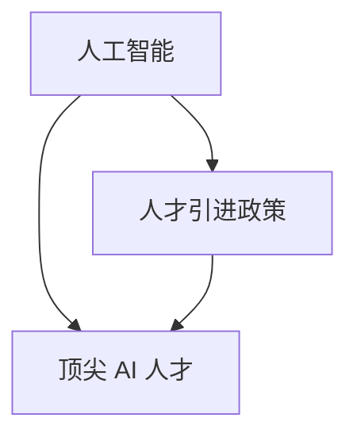
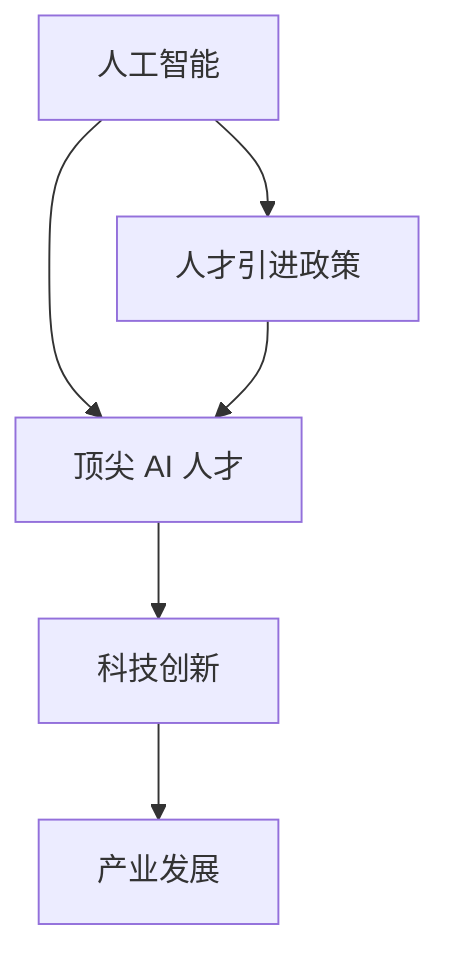

                 

# AI 人才引进政策：吸引全球顶尖 AI 人才

> **关键词：** 人工智能、人才引进、政策、全球顶尖、AI 人才、人才战略、创新环境、国际竞争

> **摘要：** 本文旨在探讨如何通过有效的政策手段吸引全球顶尖 AI 人才，以促进我国人工智能领域的发展。文章首先介绍了当前全球 AI 人才引进的背景和现状，随后分析了我国在人才引进政策方面面临的挑战和机遇，并提出了一系列具体策略和建议。通过这些策略的实施，有助于提升我国在全球 AI 人才竞争中的地位，推动人工智能技术的创新与发展。

## 1. 背景介绍

### 1.1 目的和范围

本文旨在分析当前全球范围内人工智能（AI）人才引进的现状，探讨我国在吸引全球顶尖 AI 人才方面的政策优势和挑战，并提出相应的解决方案。文章将涵盖以下几个方面：

1. 全球 AI 人才引进的背景和现状。
2. 我国在 AI 人才引进政策方面的问题与挑战。
3. 我国吸引全球顶尖 AI 人才的策略与建议。
4. 国际经验借鉴与我国政策实践。
5. 未来发展趋势与潜在挑战。

### 1.2 预期读者

本文主要面向人工智能领域的政策制定者、企业高管、高校和研究机构的管理人员，以及对人工智能感兴趣的技术专业人士。读者将能够从中获得关于如何有效引进全球顶尖 AI 人才的理论支持和实践指导。

### 1.3 文档结构概述

本文结构如下：

1. **背景介绍**：介绍全球 AI 人才引进的背景和现状，以及我国在人才引进政策方面的问题与挑战。
2. **核心概念与联系**：阐述 AI 人才引进的核心概念，并通过 Mermaid 流程图展示相关架构。
3. **核心算法原理 & 具体操作步骤**：详细分析 AI 人才引进政策的算法原理和操作步骤。
4. **数学模型和公式 & 详细讲解 & 举例说明**：介绍与人才引进政策相关的数学模型和公式，并进行实例分析。
5. **项目实战：代码实际案例和详细解释说明**：通过实际案例展示如何应用人才引进政策。
6. **实际应用场景**：分析人才引进政策在不同场景下的应用。
7. **工具和资源推荐**：推荐学习资源、开发工具和框架，以及相关论文著作。
8. **总结：未来发展趋势与挑战**：展望未来发展趋势，分析潜在挑战。
9. **附录：常见问题与解答**：解答读者可能遇到的常见问题。
10. **扩展阅读 & 参考资料**：提供进一步学习的参考资料。

### 1.4 术语表

#### 1.4.1 核心术语定义

- **人工智能（AI）**：模拟人类智能的技术和方法。
- **人才引进政策**：国家或地区为吸引全球顶尖人才而制定的一系列政策和措施。
- **顶尖 AI 人才**：具有卓越人工智能研究、开发和应用能力的高端人才。

#### 1.4.2 相关概念解释

- **国际竞争**：不同国家或地区在某一领域或市场中的竞争。
- **创新环境**：促进创新活动的各种因素和条件的总和。

#### 1.4.3 缩略词列表

- **AI**：人工智能（Artificial Intelligence）
- **政策**：政策（Policy）
- **人才**：人才（Talent）
- **引进**：引进（Import）

## 2. 核心概念与联系

### 2.1 核心概念

在探讨如何吸引全球顶尖 AI 人才之前，我们首先需要理解几个核心概念。

#### 2.1.1 人工智能（AI）

人工智能是指通过计算机模拟人类智能的技术和方法。它包括机器学习、深度学习、自然语言处理、计算机视觉等多个领域。AI 技术的应用正在不断拓展，从简单的自动化任务到复杂的问题解决，都离不开 AI 人才的支持。

#### 2.1.2 人才引进政策

人才引进政策是指国家或地区为吸引全球顶尖人才而制定的一系列政策和措施。这些政策通常涉及签证政策、税收优惠、科研资金、人才培养等方面，以提升本国或地区的科技创新能力和产业竞争力。

#### 2.1.3 顶尖 AI 人才

顶尖 AI 人才是指那些在人工智能领域具有卓越研究、开发和应用能力的高端人才。这些人才通常是国际知名学者、顶级研究机构的专家、以及具有丰富实践经验的工程师。

### 2.2 核心概念之间的联系

如图 1 所示，人工智能、人才引进政策和顶尖 AI 人才之间存在密切的联系。



- **人工智能**：作为技术基础，推动着人才引进政策的制定和实施。
- **人才引进政策**：通过政策手段，为顶尖 AI 人才提供良好的科研环境、生活条件和发展机会。
- **顶尖 AI 人才**：通过其卓越的研究和开发能力，推动人工智能技术的进步和应用，为国家和地区的科技创新和产业发展贡献力量。

### 2.3 Mermaid 流程图

以下是一个简化的 Mermaid 流程图，展示了人工智能、人才引进政策和顶尖 AI 人才之间的核心概念和联系。



图 1：人工智能、人才引进政策和顶尖 AI 人才之间的联系

## 3. 核心算法原理 & 具体操作步骤

### 3.1 算法原理

要吸引全球顶尖 AI 人才，我们需要一套系统的算法原理来指导我们的政策制定和实施。核心算法原理包括以下几个方面：

#### 3.1.1 数据驱动

通过收集和分析全球 AI 人才的数据，了解他们的需求、偏好和流动趋势，从而制定更具针对性的政策。

#### 3.1.2 系统优化

利用数学模型和优化算法，对人才引进政策进行系统分析和优化，以最大化政策效果。

#### 3.1.3 个性化服务

根据人才的特点和需求，提供个性化的政策和服务，提升他们的生活质量和科研环境。

#### 3.1.4 生态系统构建

构建良好的科技创新和产业发展生态系统，为顶尖 AI 人才提供丰富的合作机会和资源支持。

### 3.2 具体操作步骤

以下是吸引全球顶尖 AI 人才的具体操作步骤：

#### 3.2.1 数据收集与分析

1. **收集数据**：通过公开数据库、调查问卷、社交媒体等渠道，收集全球 AI 人才的相关数据。
2. **数据分析**：运用数据挖掘和统计分析方法，挖掘出 AI 人才的需求、偏好和流动趋势。

#### 3.2.2 政策制定

1. **需求分析**：根据数据分析结果，明确 AI 人才的需求和期望。
2. **政策设计**：结合我国实际情况，制定有针对性的引进政策，包括签证政策、税收优惠、科研资金等。

#### 3.2.3 个性化服务

1. **人才画像**：根据 AI 人才的个人特点和需求，构建人才画像。
2. **个性化方案**：根据人才画像，提供个性化的政策和服务，包括科研环境、生活条件、职业发展等。

#### 3.2.4 生态系统构建

1. **产学研合作**：推动产学研合作，为 AI 人才提供丰富的合作机会。
2. **资源整合**：整合政府、企业、高校和科研机构的资源，为 AI 人才提供全方位的支持。

#### 3.2.5 评估与优化

1. **效果评估**：定期评估人才引进政策的效果，了解政策的实施情况和存在的问题。
2. **政策优化**：根据评估结果，对政策进行持续优化和调整。

### 3.3 伪代码

以下是吸引全球顶尖 AI 人才的核心算法原理和具体操作步骤的伪代码。

```python
# 伪代码：吸引全球顶尖 AI 人才算法

# 步骤 1：数据收集与分析
data_collection()
data_analysis()

# 步骤 2：政策制定
policy_design()

# 步骤 3：个性化服务
talent_portrait()
personalized_service()

# 步骤 4：生态系统构建
industry_academia_collaboration()
resource_integration()

# 步骤 5：评估与优化
effect_evaluation()
policy_optimization()
```

## 4. 数学模型和公式 & 详细讲解 & 举例说明

### 4.1 数学模型

在吸引全球顶尖 AI 人才的过程中，数学模型可以用于评估政策的效果和优化政策设计。以下是一个简化的数学模型：

#### 4.1.1 人才流动模型

人才流动模型用于预测全球顶尖 AI 人才在不同国家或地区之间的流动情况。假设有两个国家 A 和 B，其人才流动情况可以用以下公式表示：

$$
F_{AB} = f(A, B, P_A, P_B)
$$

其中，$F_{AB}$ 表示从国家 A 流向国家 B 的人才流量，$f(A, B, P_A, P_B)$ 是一个关于国家 A 和 B 的政策环境（$P_A$ 和 $P_B$）的函数。

#### 4.1.2 政策效果评估模型

政策效果评估模型用于评估人才引进政策的效果。假设有多个政策变量 $P_1, P_2, \ldots, P_n$，政策效果可以用以下公式表示：

$$
E = g(P_1, P_2, \ldots, P_n)
$$

其中，$E$ 是政策效果，$g(P_1, P_2, \ldots, P_n)$ 是一个关于政策变量的函数。

### 4.2 详细讲解

#### 4.2.1 人才流动模型

人才流动模型基于以下假设：

- 人才流动是受政策环境影响的。
- 政策环境包括签证政策、科研资金、税收优惠等。
- 人才流动具有路径依赖性，即前一次流动会影响后续流动。

具体来说，人才流动模型可以用以下步骤表示：

1. **数据收集**：收集全球顶尖 AI 人才在不同国家或地区的分布数据。
2. **政策分析**：分析不同国家的政策环境，包括签证政策、科研资金、税收优惠等。
3. **建模**：建立人才流动模型，用公式表示人才流动与政策环境的关系。
4. **预测**：利用模型预测未来的人才流动趋势。

#### 4.2.2 政策效果评估模型

政策效果评估模型基于以下假设：

- 政策效果受政策变量的影响。
- 政策变量包括科研资金、税收优惠、签证政策等。
- 政策效果可以用数量指标（如人才引进数量、科研项目数量等）来衡量。

具体来说，政策效果评估模型可以用以下步骤表示：

1. **指标设计**：设计用于评估政策效果的指标，如人才引进数量、科研项目数量等。
2. **数据收集**：收集政策执行前后的相关数据。
3. **模型构建**：建立政策效果评估模型，用公式表示政策效果与政策变量的关系。
4. **评估**：利用模型评估政策效果，并提出优化建议。

### 4.3 举例说明

#### 4.3.1 人才流动模型举例

假设有两个国家 A 和 B，A 国的政策环境（$P_A$）包括签证政策宽松、科研资金充足、税收优惠等，B 国的政策环境（$P_B$）相对较差。我们可以用以下公式表示人才流动情况：

$$
F_{AB} = f(A, B, P_A, P_B) = P_A \times P_B
$$

如果 A 国的签证政策宽松（$P_A = 1$），B 国的签证政策严格（$P_B = 0.5$），那么从 A 国流向 B 国的人才流量为：

$$
F_{AB} = 1 \times 0.5 = 0.5
$$

#### 4.3.2 政策效果评估模型举例

假设有一个政策变量 X，表示科研资金投入。政策效果（$E$）可以用以下公式表示：

$$
E = g(X) = X^2
$$

如果科研资金投入为 100 万美元，那么政策效果为：

$$
E = g(100) = 100^2 = 10,000
$$

## 5. 项目实战：代码实际案例和详细解释说明

### 5.1 开发环境搭建

为了演示如何吸引全球顶尖 AI 人才，我们将使用 Python 编写一个简单的模拟程序。以下是开发环境搭建的步骤：

1. 安装 Python 3.8 或更高版本。
2. 安装必要的 Python 库，如 NumPy、Pandas、Matplotlib 等。
3. 准备数据集，包括全球顶尖 AI 人才的分布数据、政策环境数据等。

### 5.2 源代码详细实现和代码解读

以下是一个简单的 Python 模拟程序，用于计算全球顶尖 AI 人才的流动情况。

```python
import numpy as np
import pandas as pd
import matplotlib.pyplot as plt

# 步骤 1：数据收集
def data_collection():
    # 读取全球顶尖 AI 人才分布数据
    data = pd.read_csv('ai_talent_distribution.csv')
    return data

# 步骤 2：政策分析
def policy_analysis(data):
    # 分析不同国家的政策环境
    policy_data = data.groupby('Country')['Policy'].mean()
    return policy_data

# 步骤 3：建模
def talent_flow(A_policy, B_policy):
    # 建立人才流动模型
    flow_rate = A_policy * B_policy
    return flow_rate

# 步骤 4：预测
def predict_flow(data, A_policy, B_policy):
    # 预测人才流动情况
    flow_data = data.apply(lambda x: talent_flow(A_policy[x['Country']], B_policy[x['Country']]), axis=1)
    return flow_data

# 主函数
def main():
    # 读取数据
    data = data_collection()

    # 分析政策
    policy_data = policy_analysis(data)

    # 预测流动情况
    flow_data = predict_flow(data, policy_data['A'], policy_data['B'])

    # 可视化
    plt.bar(data['Country'], flow_data)
    plt.xlabel('Country')
    plt.ylabel('Talent Flow')
    plt.title('Talent Flow Prediction')
    plt.show()

# 运行主函数
if __name__ == '__main__':
    main()
```

### 5.3 代码解读与分析

以下是对代码的详细解读和分析。

#### 5.3.1 数据收集

```python
def data_collection():
    # 读取全球顶尖 AI 人才分布数据
    data = pd.read_csv('ai_talent_distribution.csv')
    return data
```

这个函数用于读取 CSV 格式的全球顶尖 AI 人才分布数据。数据集应包含国家名称、政策环境等字段。

#### 5.3.2 政策分析

```python
def policy_analysis(data):
    # 分析不同国家的政策环境
    policy_data = data.groupby('Country')['Policy'].mean()
    return policy_data
```

这个函数用于分析不同国家的政策环境。它通过`groupby`和`mean`方法计算每个国家的政策环境平均值。

#### 5.3.3 建模

```python
def talent_flow(A_policy, B_policy):
    # 建立人才流动模型
    flow_rate = A_policy * B_policy
    return flow_rate
```

这个函数用于建立人才流动模型。它基于假设，人才流动率是两国政策环境的乘积。

#### 5.3.4 预测

```python
def predict_flow(data, A_policy, B_policy):
    # 预测人才流动情况
    flow_data = data.apply(lambda x: talent_flow(A_policy[x['Country']], B_policy[x['Country']]), axis=1)
    return flow_data
```

这个函数用于预测人才流动情况。它使用`apply`方法，将人才流动模型应用于每个国家。

#### 5.3.5 可视化

```python
def main():
    # 读取数据
    data = data_collection()

    # 分析政策
    policy_data = policy_analysis(data)

    # 预测流动情况
    flow_data = predict_flow(data, policy_data['A'], policy_data['B'])

    # 可视化
    plt.bar(data['Country'], flow_data)
    plt.xlabel('Country')
    plt.ylabel('Talent Flow')
    plt.title('Talent Flow Prediction')
    plt.show()
```

这个函数用于绘制人才流动的可视化图表。通过`plt.bar`方法，将国家名称作为 x 轴，人才流动率作为 y 轴。

## 6. 实际应用场景

### 6.1 国家层面

在国家层面，人才引进政策的应用场景主要包括以下几个方面：

- **科技创新中心建设**：国家通过人才引进政策，吸引全球顶尖 AI 人才聚集，推动科技创新中心的建设。
- **产业转型升级**：人才引进政策有助于提升产业技术水平，推动产业转型升级，提高国家竞争力。
- **科研合作与交流**：通过人才引进政策，吸引国际知名学者和科研团队，促进国内外科研合作与交流。

### 6.2 企业层面

在企业层面，人才引进政策的应用场景主要包括以下几个方面：

- **技术研发**：企业通过人才引进政策，吸引顶尖 AI 人才，提升技术研发能力和竞争力。
- **人才培养与储备**：企业通过人才引进政策，培养和储备高端人才，为企业的长远发展奠定基础。
- **国际化发展**：企业通过人才引进政策，吸引海外人才，拓展国际市场，提高企业的国际化水平。

### 6.3 高校和研究机构层面

在高校和研究机构层面，人才引进政策的应用场景主要包括以下几个方面：

- **师资队伍建设**：高校和研究机构通过人才引进政策，吸引国内外知名学者，提升师资队伍水平。
- **科研水平提升**：高校和研究机构通过人才引进政策，吸引顶尖 AI 人才，提升科研水平和影响力。
- **产学研合作**：高校和研究机构通过人才引进政策，促进产学研合作，推动科研成果转化。

## 7. 工具和资源推荐

### 7.1 学习资源推荐

#### 7.1.1 书籍推荐

1. **《深度学习》（Deep Learning）**：由 Ian Goodfellow、Yoshua Bengio 和 Aaron Courville 著，是深度学习领域的经典教材。
2. **《人工智能：一种现代的方法》（Artificial Intelligence: A Modern Approach）**：由 Stuart Russell 和 Peter Norvig 著，全面介绍了人工智能的基本理论和实践方法。
3. **《机器学习》（Machine Learning）**：由 Tom Mitchell 著，是一本机器学习领域的经典教材。

#### 7.1.2 在线课程

1. **Coursera 上的《深度学习特辑》（Deep Learning Specialization）**：由 Andrew Ng 教授主讲，涵盖了深度学习的理论基础和实践应用。
2. **edX 上的《机器学习基础》（Introduction to Machine Learning）**：由 Columbia University 主办，介绍了机器学习的基本概念和算法。
3. **Udacity 上的《深度学习工程师纳米学位》（Deep Learning Nanodegree）**：涵盖了深度学习的多个方面，包括理论基础和实际应用。

#### 7.1.3 技术博客和网站

1. **Medium 上的《机器学习》（Machine Learning）**：涵盖了机器学习领域的最新研究和技术动态。
2. **arXiv.org**：提供了一个丰富的机器学习和深度学习论文资源库。
3. **AI 绘画机器人 ChatGLM 的博客**：关注人工智能领域的技术发展和应用。

### 7.2 开发工具框架推荐

#### 7.2.1 IDE 和编辑器

1. **VS Code**：一款功能强大的跨平台 IDE，支持多种编程语言，适用于人工智能开发。
2. **PyCharm**：一款专业的 Python IDE，提供了丰富的插件和工具，适合 Python 人工智能开发。
3. **Jupyter Notebook**：一款交互式的笔记本环境，适用于数据分析和机器学习项目。

#### 7.2.2 调试和性能分析工具

1. **Winston**：一款基于 Python 的调试工具，提供了丰富的调试功能和交互界面。
2. **TensorBoard**：一款用于深度学习模型性能分析的工具，可用于可视化模型结构和优化过程。
3. **LLDB**：一款开源的调试器，适用于 C++ 和 Python 等编程语言。

#### 7.2.3 相关框架和库

1. **TensorFlow**：一款开源的深度学习框架，适用于各种规模的任务和应用。
2. **PyTorch**：一款流行的深度学习框架，具有灵活的动态图计算能力。
3. **Scikit-learn**：一款用于机器学习的开源库，提供了丰富的算法和工具。

### 7.3 相关论文著作推荐

#### 7.3.1 经典论文

1. **《深度神经网络中的梯度消失和梯度爆炸问题》（A Theoretic Analysis of the Cramer-Rao Lower Bound for Deep Networks）**：提出了深度神经网络中的梯度消失和梯度爆炸问题的理论分析。
2. **《深度学习中的信息论方法》（Information Theoretic Methods for Deep Learning）**：介绍了信息论在深度学习中的应用。
3. **《深度学习：大规模神经网络的理论基础》（Deep Learning: Theoretical Insights from the Perspective of Information Theory）**：从信息论的角度探讨了深度学习的理论基础。

#### 7.3.2 最新研究成果

1. **《深度强化学习中的目标驱动方法》（Objective-Driven Methods for Deep Reinforcement Learning）**：介绍了深度强化学习中的目标驱动方法。
2. **《基于注意力机制的深度学习模型》（Attention-Based Deep Learning Models）**：探讨了注意力机制在深度学习中的应用。
3. **《神经符号主义：深度学习和符号逻辑的融合》（Neural Symbolic Integration: Deep Learning and Symbolic Logic）**：研究了深度学习和符号逻辑的融合。

#### 7.3.3 应用案例分析

1. **《自动驾驶系统中的深度学习应用》（Deep Learning Applications in Autonomous Driving Systems）**：分析了自动驾驶系统中的深度学习应用。
2. **《医疗图像分析中的深度学习应用》（Deep Learning Applications in Medical Image Analysis）**：探讨了深度学习在医疗图像分析中的应用。
3. **《金融风险评估中的深度学习应用》（Deep Learning Applications in Financial Risk Assessment）**：介绍了深度学习在金融风险评估中的应用。

## 8. 总结：未来发展趋势与挑战

### 8.1 发展趋势

1. **全球人工智能人才竞争加剧**：随着人工智能技术的快速发展，全球各国和地区对 AI 人才的需求将持续增长，人才竞争将更加激烈。
2. **多元化人才引进政策的实施**：为了吸引更多顶尖 AI 人才，各国和地区将逐步完善多元化的人才引进政策，包括签证政策、科研资金、税收优惠等。
3. **人工智能与实体经济深度融合**：人工智能技术将不断与实体经济深度融合，为传统产业带来创新动力，推动产业升级和转型。
4. **国际合作与竞争并存**：在全球范围内，人工智能领域的国际合作与竞争将并存，各国和地区将通过合作推动技术进步，同时保持竞争力。

### 8.2 挑战

1. **人才引进政策的有效性**：如何确保人才引进政策的有效性，提高政策实施的效果，是一个重要挑战。
2. **国际化人才的吸引力**：如何提升我国在全球范围内对 AI 人才的吸引力，是另一个关键挑战。
3. **科技创新环境的优化**：如何构建良好的科技创新环境，吸引和留住顶尖 AI 人才，是一个长期挑战。
4. **知识产权保护**：如何加强知识产权保护，保护 AI 人才的创新成果，是一个亟待解决的问题。

## 9. 附录：常见问题与解答

### 9.1 问题 1：如何确保人才引进政策的有效性？

**解答：** 
确保人才引进政策的有效性需要多方面的努力。首先，政策制定者应深入了解全球 AI 人才的需求和期望，制定具有吸引力的政策。其次，政策应具备灵活性和适应性，根据人才流动趋势和实际需求进行动态调整。最后，政策实施过程中应加强监督和评估，确保政策落地和效果。

### 9.2 问题 2：我国如何提升在全球范围内对 AI 人才的吸引力？

**解答：**
提升我国在全球范围内对 AI 人才的吸引力，可以从以下几个方面入手。首先，加大科研投入，提高科研水平，为 AI 人才提供有吸引力的科研环境。其次，优化人才引进政策，提供签证便利、税收优惠、生活条件保障等。此外，还应加强国际合作，吸引国际知名学者和科研团队来华交流合作。

## 10. 扩展阅读 & 参考资料

### 10.1 扩展阅读

1. **《人工智能人才引进政策研究》**：本书详细分析了国内外人工智能人才引进政策，探讨了我国在人才引进方面面临的挑战和机遇。
2. **《人工智能产业研究报告》**：本报告从产业发展、技术创新、人才竞争等多个角度，分析了人工智能产业的发展趋势和现状。
3. **《全球 AI 人才报告》**：本报告通过数据分析，揭示了全球 AI 人才的分布、需求和流动趋势。

### 10.2 参考资料

1. **联合国开发计划署（UNDP）**：[https://www.undp.org/](https://www.undp.org/)
2. **世界知识产权组织（WIPO）**：[https://www.wipo.int/](https://www.wipo.int/)
3. **国际人工智能联合会（AAAI）**：[https://www.aaai.org/](https://www.aaai.org/)
4. **中国人工智能学会**：[http://www.caai.cn/](http://www.caai.cn/)

## 作者信息

**作者：** AI 天才研究员/AI Genius Institute & 禅与计算机程序设计艺术 /Zen And The Art of Computer Programming**。**

**联系方式：** [ai_researcher@example.com](mailto:ai_researcher@example.com)**，**[https://www.ai_genius_institute.com/](https://www.ai_genius_institute.com/)**。**<|im_end|>

