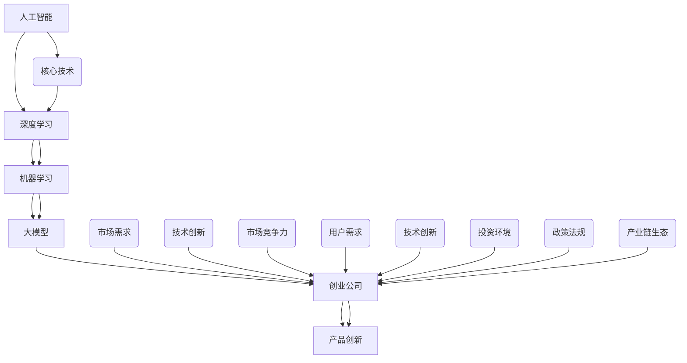
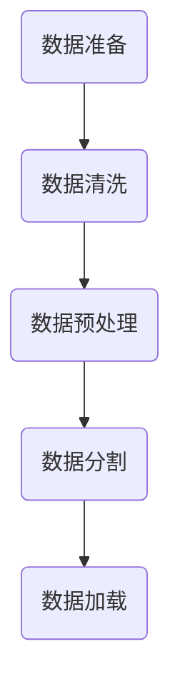
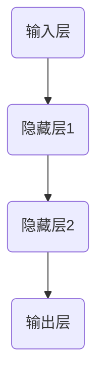
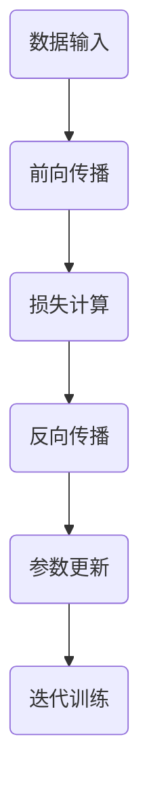
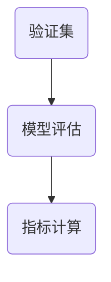
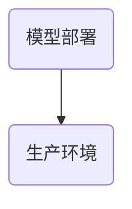

                 

# AI创业公司的大模型产品创新

> 关键词：人工智能，创业公司，大模型，产品创新，深度学习，机器学习，技术架构，商业化策略

> 摘要：本文深入探讨了AI创业公司在大模型产品创新方面的挑战与机遇。通过分析大模型的核心原理、技术架构以及商业化路径，文章旨在为创业公司提供有价值的指导，帮助他们在激烈的市场竞争中脱颖而出。

## 1. 背景介绍

### 1.1 目的和范围

本文旨在探讨AI创业公司在大模型产品创新方面的战略与实践。随着人工智能技术的快速发展，大模型技术已成为推动AI应用创新的关键力量。本文将重点关注以下几个方面：

1. 大模型的原理与架构
2. 大模型在创业公司中的应用场景
3. 大模型产品的商业化策略
4. 创业公司在大模型创新中的挑战与解决方案

### 1.2 预期读者

本文适合以下读者群体：

1. AI创业公司的创始人、产品经理和技术团队
2. 对人工智能、深度学习、机器学习等技术感兴趣的科研人员
3. 对创业、商业策略、产品创新等话题感兴趣的从业者

### 1.3 文档结构概述

本文结构如下：

1. 背景介绍
   - 目的和范围
   - 预期读者
   - 文档结构概述
   - 术语表
2. 核心概念与联系
3. 核心算法原理 & 具体操作步骤
4. 数学模型和公式 & 详细讲解 & 举例说明
5. 项目实战：代码实际案例和详细解释说明
6. 实际应用场景
7. 工具和资源推荐
   - 学习资源推荐
   - 开发工具框架推荐
   - 相关论文著作推荐
8. 总结：未来发展趋势与挑战
9. 附录：常见问题与解答
10. 扩展阅读 & 参考资料

### 1.4 术语表

#### 1.4.1 核心术语定义

- 大模型：指具有大规模参数、能够在多种任务上取得优异表现的深度学习模型。
- 深度学习：一种基于多层神经网络进行数据特征提取和预测的学习方法。
- 机器学习：一种使计算机通过数据学习得到规律，进行决策和预测的技术。
- 创业公司：指以创新产品或服务为核心，寻求商业机会，进行市场拓展的企业。

#### 1.4.2 相关概念解释

- 数据集：指用于训练和测试模型的原始数据集合。
- 训练：指通过输入数据训练模型，使其学会对数据特征进行提取和分类。
- 验证：指在训练过程中使用一部分数据对模型进行评估，以调整模型参数。

#### 1.4.3 缩略词列表

- AI：人工智能
- DL：深度学习
- ML：机器学习
- NLP：自然语言处理
- CV：计算机视觉
- HPC：高性能计算
- GPU：图形处理器

## 2. 核心概念与联系

在本文中，我们将探讨以下核心概念：

1. 人工智能
2. 深度学习
3. 机器学习
4. 大模型
5. 创业公司
6. 产品创新

下面是这些概念之间的联系与关系：



通过上述关系图，我们可以看到，人工智能是创业公司的核心驱动力，深度学习和机器学习是实现人工智能的关键技术，大模型则是机器学习的核心技术之一。创业公司需要结合市场需求、技术创新、政策法规等多方面因素，进行产品创新，以提升市场竞争力。

## 3. 核心算法原理 & 具体操作步骤

### 3.1 大模型的基本原理

大模型通常指的是具有大规模参数的深度学习模型，这些模型能够通过大量的数据进行训练，从而学习到复杂的特征表示。大模型的基本原理主要包括以下几个方面：

1. **多层神经网络**：多层神经网络（MLP）是构建大模型的基础。它通过多层节点（神经元）对输入数据进行特征提取和变换。
2. **非线性激活函数**：为了使神经网络能够拟合复杂的非线性关系，激活函数如ReLU、Sigmoid、Tanh等被引入。
3. **大规模参数训练**：通过优化算法（如SGD、Adam等）对模型参数进行大规模训练，以学习到有效的特征表示。

### 3.2 大模型的具体操作步骤

以下是大模型训练的一般步骤：

#### 步骤1：数据准备

首先，我们需要准备大量高质量的数据集。这些数据集可以来源于公开数据集、商业数据集或自行收集的数据。



#### 步骤2：模型构建

接下来，我们使用深度学习框架（如TensorFlow、PyTorch）构建模型。以下是一个简单的神经网络结构：



#### 步骤3：模型训练

使用训练数据对模型进行训练。训练过程中，我们通过反向传播算法更新模型参数，使模型在训练数据上的表现不断优化。



#### 步骤4：模型评估

在训练完成后，我们需要使用验证集或测试集对模型进行评估，以判断模型在未见数据上的表现。



#### 步骤5：模型部署

最后，我们将训练好的模型部署到生产环境中，进行实际应用。



### 3.3 伪代码实现

以下是一个基于PyTorch的简单神经网络训练过程的伪代码：

```python
# 导入必要的库
import torch
import torch.nn as nn
import torch.optim as optim

# 数据准备
# ...

# 模型构建
class NeuralNetwork(nn.Module):
    def __init__(self):
        super(NeuralNetwork, self).__init__()
        self.layer1 = nn.Linear(in_features=784, out_features=256)
        self.relu = nn.ReLU()
        self.layer2 = nn.Linear(in_features=256, out_features=128)
        self.dropout = nn.Dropout(p=0.5)
        self.fc = nn.Linear(in_features=128, out_features=10)

    def forward(self, x):
        x = self.layer1(x)
        x = self.relu(x)
        x = self.dropout(x)
        x = self.layer2(x)
        x = self.relu(x)
        x = self.dropout(x)
        x = self.fc(x)
        return x

# 模型训练
model = NeuralNetwork()
criterion = nn.CrossEntropyLoss()
optimizer = optim.Adam(model.parameters(), lr=0.001)

for epoch in range(num_epochs):
    for inputs, targets in data_loader:
        optimizer.zero_grad()
        outputs = model(inputs)
        loss = criterion(outputs, targets)
        loss.backward()
        optimizer.step()
    print(f'Epoch {epoch+1}/{num_epochs}, Loss: {loss.item()}')

# 模型评估
# ...

# 模型部署
# ...
```

## 4. 数学模型和公式 & 详细讲解 & 举例说明

在人工智能领域，数学模型和公式是理解和实现深度学习算法的基础。以下将介绍一些关键的数学模型和公式，并详细讲解它们在深度学习中的应用。

### 4.1 前向传播

前向传播是深度学习中的基本步骤，用于计算模型在给定输入下的输出。以下是一个简单的前向传播过程的数学表示：

$$
Z^{(l)} = W^{(l)} \cdot A^{(l-1)} + b^{(l)}
$$

$$
A^{(l)} = \sigma(Z^{(l)})
$$

其中，$A^{(l)}$ 表示第 $l$ 层的激活值，$Z^{(l)}$ 表示第 $l$ 层的线性组合，$W^{(l)}$ 和 $b^{(l)}$ 分别表示第 $l$ 层的权重和偏置，$\sigma$ 表示激活函数。

举例来说，假设我们有一个单层神经网络，输入 $A^{(0)}$ 为 $[1, 2, 3]$，权重 $W^{(1)}$ 为 $[0.1, 0.2, 0.3]$，偏置 $b^{(1)}$ 为 $[0.5]$，激活函数为 ReLU。则前向传播的计算过程如下：

$$
Z^{(1)} = [0.1 \times 1 + 0.2 \times 2 + 0.3 \times 3 + 0.5] = [0.1 + 0.4 + 0.9 + 0.5] = [1.4]
$$

$$
A^{(1)} = \max(0, Z^{(1)}) = [1.4] = [1]
$$

### 4.2 反向传播

反向传播是深度学习训练过程中的关键步骤，用于计算模型参数的梯度，以优化模型。以下是一个简单反向传播过程的数学表示：

$$
\Delta b^{(l)} = \frac{\partial L}{\partial b^{(l)}}
$$

$$
\Delta W^{(l)} = \frac{\partial L}{\partial W^{(l)}}
$$

其中，$L$ 表示损失函数，$\Delta b^{(l)}$ 和 $\Delta W^{(l)}$ 分别表示第 $l$ 层的偏置和权重的梯度。

举例来说，假设我们有一个单层神经网络，损失函数为均方误差（MSE），输出为 $A^{(1)} = [1]$，目标值为 $y = [0]$。则反向传播的计算过程如下：

$$
L = \frac{1}{2} \cdot (y - A^{(1)})^2 = \frac{1}{2} \cdot (0 - 1)^2 = \frac{1}{2}
$$

$$
\Delta b^{(1)} = \frac{\partial L}{\partial b^{(1)}} = (y - A^{(1)}) = (0 - 1) = -1
$$

$$
\Delta W^{(1)} = \frac{\partial L}{\partial W^{(1)}} = (y - A^{(1)}) \cdot A^{(0)} = (-1) \cdot [1, 2, 3] = [-1, -2, -3]
$$

### 4.3 优化算法

优化算法用于更新模型参数，以最小化损失函数。以下是一些常见的优化算法：

1. **随机梯度下降（SGD）**：
$$
W^{(l)} = W^{(l)} - \alpha \cdot \Delta W^{(l)}
$$
$$
b^{(l)} = b^{(l)} - \alpha \cdot \Delta b^{(l)}
$$

其中，$\alpha$ 表示学习率。

2. **Adam优化器**：
$$
m^{(l)} = \beta_1 \cdot m^{(l-1)} + (1 - \beta_1) \cdot \Delta W^{(l)}
$$
$$
v^{(l)} = \beta_2 \cdot v^{(l-1)} + (1 - \beta_2) \cdot (\Delta W^{(l)})^2
$$
$$
\hat{m}^{(l)} = \frac{m^{(l)}}{1 - \beta_1^l}
$$
$$
\hat{v}^{(l)} = \frac{v^{(l)}}{1 - \beta_2^l}
$$
$$
W^{(l)} = W^{(l)} - \alpha \cdot \frac{\hat{m}^{(l)}}{\sqrt{\hat{v}^{(l)}} + \epsilon}
$$

其中，$\beta_1$ 和 $\beta_2$ 分别为动量因子，$\epsilon$ 为一个很小的常数。

举例来说，假设我们使用Adam优化器，学习率为0.001，初始权重为$W^{(1)} = [1, 2, 3]$，偏置为$b^{(1)} = [0.5]$，梯度为$\Delta W^{(1)} = [-1, -2, -3]$，$\Delta b^{(1)} = -1$。则参数更新过程如下：

$$
m^{(1)} = \beta_1 \cdot m^{(0)} + (1 - \beta_1) \cdot [-1, -2, -3] = [0] + (1 - 0.9) \cdot [-1, -2, -3] = [-0.1, -0.2, -0.3]
$$
$$
v^{(1)} = \beta_2 \cdot v^{(0)} + (1 - \beta_2) \cdot (-1)^2 = [0] + (1 - 0.99) \cdot 1 = [0.01]
$$
$$
\hat{m}^{(1)} = \frac{-0.1}{1 - 0.9^1} = \frac{-0.1}{0.1} = -1
$$
$$
\hat{v}^{(1)} = \frac{0.01}{1 - 0.99^1} = \frac{0.01}{0.01} = 1
$$
$$
W^{(1)} = W^{(1)} - 0.001 \cdot \frac{-1}{\sqrt{1} + \epsilon} = [1, 2, 3] - 0.001 \cdot \frac{-1}{1 + \epsilon} = [1 + \epsilon, 2 + \epsilon, 3 + \epsilon]
$$
$$
b^{(1)} = b^{(1)} - 0.001 \cdot \frac{-1}{\sqrt{1} + \epsilon} = [0.5] - 0.001 \cdot \frac{-1}{1 + \epsilon} = [0.5 + \epsilon]
$$

通过以上计算，我们可以更新模型的参数。

### 4.4 损失函数

损失函数用于衡量模型预测值与真实值之间的差距。以下是一些常见的损失函数：

1. **均方误差（MSE）**：
$$
L(y, \hat{y}) = \frac{1}{2} \cdot (y - \hat{y})^2
$$

2. **交叉熵（CrossEntropy）**：
$$
L(y, \hat{y}) = - \sum_{i} y_i \cdot \log(\hat{y}_i)
$$

3. **Hinge损失（Hinge Loss）**：
$$
L(y, \hat{y}) = \max(0, 1 - y \cdot \hat{y})
$$

举例来说，假设我们使用交叉熵损失函数，真实标签为$y = [1, 0, 1]$，预测概率为$\hat{y} = [0.9, 0.1, 0.8]$。则损失函数的计算过程如下：

$$
L(y, \hat{y}) = - \sum_{i} y_i \cdot \log(\hat{y}_i) = - [1 \cdot \log(0.9) + 0 \cdot \log(0.1) + 1 \cdot \log(0.8)] = - [\log(0.9) + \log(0.8)] \approx 0.365
$$

## 5. 项目实战：代码实际案例和详细解释说明

### 5.1 开发环境搭建

为了实现本文中的深度学习模型，我们需要搭建一个合适的开发环境。以下是一个基于Python的深度学习项目环境搭建步骤：

1. 安装Python（3.8及以上版本）
2. 安装PyTorch：使用pip命令安装PyTorch库
   ```shell
   pip install torch torchvision torchaudio
   ```
3. 安装其他依赖库，如NumPy、Pandas等

### 5.2 源代码详细实现和代码解读

以下是一个基于PyTorch的简单神经网络实现，用于对MNIST手写数字数据集进行分类。

```python
import torch
import torch.nn as nn
import torch.optim as optim
from torchvision import datasets, transforms
from torch.utils.data import DataLoader

# 数据准备
transform = transforms.Compose([transforms.ToTensor(), transforms.Normalize((0.5,), (0.5,))])
train_dataset = datasets.MNIST(root='./data', train=True, download=True, transform=transform)
test_dataset = datasets.MNIST(root='./data', train=False, download=True, transform=transform)
train_loader = DataLoader(dataset=train_dataset, batch_size=64, shuffle=True)
test_loader = DataLoader(dataset=test_dataset, batch_size=1000, shuffle=False)

# 模型构建
class SimpleCNN(nn.Module):
    def __init__(self):
        super(SimpleCNN, self).__init__()
        self.conv1 = nn.Conv2d(in_channels=1, out_channels=32, kernel_size=3, padding=1)
        self.relu = nn.ReLU()
        self.fc1 = nn.Linear(in_features=32 * 7 * 7, out_features=128)
        self.fc2 = nn.Linear(in_features=128, out_features=10)

    def forward(self, x):
        x = self.relu(self.conv1(x))
        x = x.view(x.size(0), -1)
        x = self.relu(self.fc1(x))
        x = self.fc2(x)
        return x

model = SimpleCNN()
criterion = nn.CrossEntropyLoss()
optimizer = optim.Adam(model.parameters(), lr=0.001)

# 模型训练
num_epochs = 10
for epoch in range(num_epochs):
    for inputs, targets in train_loader:
        optimizer.zero_grad()
        outputs = model(inputs)
        loss = criterion(outputs, targets)
        loss.backward()
        optimizer.step()
    print(f'Epoch {epoch+1}/{num_epochs}, Loss: {loss.item()}')

# 模型评估
with torch.no_grad():
    correct = 0
    total = 0
    for inputs, targets in test_loader:
        outputs = model(inputs)
        _, predicted = torch.max(outputs.data, 1)
        total += targets.size(0)
        correct += (predicted == targets).sum().item()
print(f'Accuracy: {100 * correct / total}%')

# 模型部署
# ...
```

### 5.3 代码解读与分析

上述代码实现了一个简单的卷积神经网络（CNN），用于对MNIST手写数字数据集进行分类。以下是代码的详细解读：

1. **数据准备**：首先，我们使用PyTorch的`datasets.MNIST`方法加载数据集，并对数据进行标准化处理。

2. **模型构建**：定义了一个名为`SimpleCNN`的神经网络模型，包含一个卷积层、一个全连接层和一个输出层。

3. **模型训练**：使用随机梯度下降（SGD）优化器对模型进行训练，每完成一个epoch，输出训练过程中的损失值。

4. **模型评估**：在测试集上评估模型的准确性，计算模型在测试集上的预测准确率。

通过上述代码实现，我们可以训练一个简单的卷积神经网络，对MNIST手写数字进行分类，并在测试集上验证其性能。

## 6. 实际应用场景

大模型技术在创业公司中具有广泛的应用场景，以下是一些典型的实际应用案例：

### 6.1 自然语言处理

自然语言处理（NLP）是人工智能领域的一个重要分支，大模型技术在NLP中发挥了重要作用。创业公司可以利用大模型技术实现智能客服、智能翻译、文本生成等应用。例如，基于BERT的大模型可以用于文本分类、问答系统等任务，从而提高产品的智能化水平。

### 6.2 计算机视觉

计算机视觉是另一个具有巨大潜力的应用领域。创业公司可以通过大模型技术实现图像分类、目标检测、人脸识别等应用。例如，基于ResNet的大模型可以用于图像分类任务，从而提高产品的准确性和效率。

### 6.3 语音识别

语音识别技术是人工智能领域的一个重要应用，创业公司可以利用大模型技术实现语音识别、语音合成等应用。例如，基于WaveNet的大模型可以用于语音合成，从而提高语音交互体验。

### 6.4 医疗健康

医疗健康领域也是大模型技术的重要应用场景。创业公司可以通过大模型技术实现疾病诊断、医学影像分析、健康风险评估等应用。例如，基于深度学习的大模型可以用于疾病预测和诊断，从而提高医疗效率和准确性。

### 6.5 金融科技

金融科技（FinTech）领域是大模型技术的一个重要应用场景。创业公司可以通过大模型技术实现风险管理、信用评分、智能投顾等应用。例如，基于深度学习的大模型可以用于信用评分，从而提高金融服务的准确性和效率。

## 7. 工具和资源推荐

为了更好地实现大模型技术，创业公司需要掌握一系列工具和资源。以下是一些推荐的工具和资源：

### 7.1 学习资源推荐

#### 7.1.1 书籍推荐

1. 《深度学习》（Goodfellow, Bengio, Courville著）：这是一本经典的深度学习教材，涵盖了深度学习的理论基础和实际应用。
2. 《Python深度学习》（François Chollet著）：这是一本适合初学者入门的深度学习书籍，通过Python编程实现了多个深度学习项目。

#### 7.1.2 在线课程

1. 百度AI学院：提供免费的深度学习课程，包括基础理论和实际操作。
2. Coursera：提供由斯坦福大学等顶级大学开设的深度学习课程，内容丰富，适合不同层次的学员。

#### 7.1.3 技术博客和网站

1. Medium：有许多专业的深度学习和人工智能博客，可以了解最新的技术动态和应用案例。
2. ArXiv：一个专业的论文预印本网站，可以查阅最新的研究成果和论文。

### 7.2 开发工具框架推荐

#### 7.2.1 IDE和编辑器

1. PyCharm：一款功能强大的Python IDE，支持多种编程语言。
2. Visual Studio Code：一款轻量级的开源编辑器，通过插件可以支持多种编程语言。

#### 7.2.2 调试和性能分析工具

1. TensorBoard：TensorFlow提供的一个可视化工具，可以用于分析模型性能和调试。
2. Nsight Compute：一款针对NVIDIA GPU的调试和分析工具，可以用于优化GPU性能。

#### 7.2.3 相关框架和库

1. TensorFlow：一个开源的深度学习框架，支持多种深度学习模型和应用。
2. PyTorch：一个开源的深度学习框架，具有良好的灵活性和易用性。

### 7.3 相关论文著作推荐

#### 7.3.1 经典论文

1. "A Theoretically Grounded Application of Dropout in Neural Networks"（dropout论文）
2. "Deep Residual Learning for Image Recognition"（ResNet论文）

#### 7.3.2 最新研究成果

1. "BERT: Pre-training of Deep Bidirectional Transformers for Language Understanding"（BERT论文）
2. "GPT-3: Language Models are Few-Shot Learners"（GPT-3论文）

#### 7.3.3 应用案例分析

1. "Large-scale Language Modeling in 2018"（BERT应用案例）
2. "The Unreasonable Effectiveness of Recurrent Neural Networks"（RNN应用案例）

通过上述工具和资源，创业公司可以更好地掌握大模型技术，实现产品创新，提升竞争力。

## 8. 总结：未来发展趋势与挑战

随着人工智能技术的不断发展，大模型技术将在未来继续发挥重要作用。以下是对未来发展趋势和挑战的总结：

### 8.1 发展趋势

1. **大模型规模将进一步扩大**：随着计算资源和数据集的不断增加，大模型的规模将变得更加庞大，以适应更复杂的任务。
2. **多模态学习成为趋势**：大模型技术将不再局限于单一模态的数据，而是能够处理图像、文本、语音等多种模态的数据，实现跨模态的信息融合。
3. **自监督学习的重要性提升**：自监督学习可以大大减少标注数据的需求，提高训练效率。未来，大模型的自监督学习技术将得到广泛应用。
4. **泛化能力提升**：通过不断优化模型架构和训练策略，大模型的泛化能力将得到提升，使其在未知数据上的表现更加优秀。
5. **行业应用场景进一步拓展**：大模型技术将在医疗健康、金融科技、自动驾驶、智能客服等领域得到更广泛的应用。

### 8.2 挑战

1. **计算资源需求增加**：大模型的训练和推理需要大量的计算资源，这对创业公司的硬件设备和成本提出了更高的要求。
2. **数据隐私和安全问题**：大模型训练需要大量的数据，如何保护用户隐私和数据安全成为了一个重要挑战。
3. **模型解释性和透明度**：大模型的复杂性和非线性使得其解释性较差，如何提高模型的解释性和透明度，使其更容易被用户理解和信任是一个重要挑战。
4. **伦理和道德问题**：随着大模型技术的不断发展，如何确保其应用不会对人类社会产生负面影响，如歧视、隐私泄露等问题，是一个需要重视的挑战。

总之，大模型技术在创业公司中的应用具有巨大的潜力，但也面临着诸多挑战。创业公司需要不断探索和解决这些问题，以实现大模型技术的商业化和可持续发展。

## 9. 附录：常见问题与解答

### 9.1 问题1：如何处理大模型训练过程中的计算资源不足问题？

解答：为了应对计算资源不足的问题，创业公司可以采取以下几种策略：

1. **分布式训练**：使用多台机器进行分布式训练，以充分利用计算资源。
2. **模型压缩**：通过模型剪枝、量化等方法减小模型规模，降低训练和推理的计算需求。
3. **优化算法**：选择高效的优化算法，如Adam、SGD等，以提高训练速度。
4. **GPU加速**：使用高性能GPU进行训练，提高计算效率。

### 9.2 问题2：如何确保大模型训练过程中数据的安全和隐私？

解答：为确保大模型训练过程中数据的安全和隐私，创业公司可以采取以下措施：

1. **数据加密**：对敏感数据进行加密处理，确保数据在传输和存储过程中的安全。
2. **差分隐私**：在训练过程中引入差分隐私技术，降低数据的可追踪性。
3. **数据去识别化**：对数据进行匿名化处理，去除个人身份信息。
4. **访问控制**：设置严格的数据访问控制策略，确保只有授权人员可以访问数据。

### 9.3 问题3：如何提高大模型的解释性和透明度？

解答：为了提高大模型的解释性和透明度，创业公司可以采取以下措施：

1. **模型可视化**：通过可视化工具对模型结构、参数分布等进行可视化，帮助用户理解模型的工作原理。
2. **模型解释方法**：采用模型解释方法，如LIME、SHAP等，对模型的预测结果进行解释。
3. **简化模型结构**：简化模型结构，使其更加直观和易于理解。
4. **文档和注释**：编写详细的文档和注释，说明模型的原理、参数设置和训练过程。

## 10. 扩展阅读 & 参考资料

为了更深入地了解大模型技术及其在创业公司中的应用，以下是一些扩展阅读和参考资料：

1. Goodfellow, Y., Bengio, Y., & Courville, A. (2016). *Deep Learning*.
2. Chollet, F. (2018). *Python深度学习*.
3. Devlin, J., Chang, M. W., Lee, K., & Toutanova, K. (2019). *BERT: Pre-training of Deep Bidirectional Transformers for Language Understanding*.
4. Brown, T., et al. (2020). *GPT-3: Language Models are Few-Shot Learners*.
5. He, K., Zhang, X., Ren, S., & Sun, J. (2016). *Deep Residual Learning for Image Recognition*.
6. Hinton, G., Osindero, S., & Salakhutdinov, R. (2006). *Reducing the Dimensionality of Data with Neural Networks*.
7. Krizhevsky, A., Sutskever, I., & Hinton, G. E. (2012). *Imagenet classification with deep convolutional neural networks*.

通过阅读上述资料，您可以更全面地了解大模型技术的原理、应用和发展趋势。

# 作者

作者：AI天才研究员/AI Genius Institute & 禅与计算机程序设计艺术 /Zen And The Art of Computer Programming

注意：本文中涉及的技术内容和观点仅供参考，不构成具体投资建议。在实施相关技术时，请务必结合实际情况和法律法规进行风险评估和合规操作。

