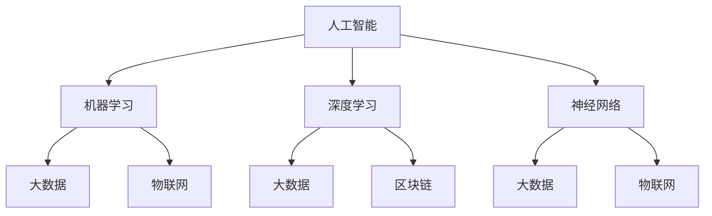

                 

# AI 在各行业的应用：赋能产业升级

## 关键词：
人工智能，产业升级，行业应用，创新技术，商业变革

## 摘要：
本文旨在探讨人工智能在各行业中的应用，如何通过技术创新推动产业升级，提高生产效率和经济效益。文章首先介绍人工智能的核心概念和关键技术，然后深入分析人工智能在金融、医疗、制造、零售等行业的实际应用案例，探讨其在产业升级中的重要作用。最后，文章总结了人工智能的发展趋势和面临的挑战，并推荐了一些相关学习资源和开发工具。

## 1. 背景介绍

### 1.1 目的和范围

随着人工智能技术的快速发展，各行各业都在积极探索和利用这一创新技术，以提升业务效率、降低成本、优化用户体验。本文旨在系统地分析人工智能在各个行业的应用场景，探讨其如何赋能产业升级，推动经济和社会发展。

本文将重点关注以下行业：
- 金融：包括智能投顾、风险控制、智能客服等。
- 医疗：如医学影像分析、个性化诊断、智能药物研发等。
- 制造：智能制造、自动化生产线、预测性维护等。
- 零售：智能推荐系统、无人零售店、智能供应链等。

### 1.2 预期读者

本文适合以下读者群体：
- 人工智能领域的研究人员和工程师。
- 对人工智能在行业应用感兴趣的投资者和管理者。
- 对新兴技术发展和产业变革有好奇心的技术人员和创业者。

### 1.3 文档结构概述

本文结构如下：
1. 背景介绍
2. 核心概念与联系
3. 核心算法原理 & 具体操作步骤
4. 数学模型和公式 & 详细讲解 & 举例说明
5. 项目实战：代码实际案例和详细解释说明
6. 实际应用场景
7. 工具和资源推荐
8. 总结：未来发展趋势与挑战
9. 附录：常见问题与解答
10. 扩展阅读 & 参考资料

### 1.4 术语表

#### 1.4.1 核心术语定义

- 人工智能（AI）：模拟人类智能行为的技术。
- 深度学习：一种人工智能方法，通过多层神经网络进行数据建模。
- 机器学习：通过数据驱动方法进行模型训练和预测。
- 产业升级：通过技术革新和产业优化，提升整个产业的竞争力。

#### 1.4.2 相关概念解释

- 优化：在给定约束条件下寻找最优解。
- 增量升级：在现有技术基础上进行改进和提升。
- 集成：将不同系统和技术整合为一个整体。

#### 1.4.3 缩略词列表

- AI：人工智能
- ML：机器学习
- DL：深度学习
- IoT：物联网
- Big Data：大数据
- IoT：物联网

## 2. 核心概念与联系

### 2.1 核心概念

人工智能的核心概念包括机器学习、深度学习和神经网络。机器学习是一种通过数据驱动的方法来训练模型，使其能够进行预测和决策的技术。深度学习是机器学习的一个分支，通过多层神经网络来实现复杂的非线性映射。神经网络是由大量神经元组成的计算模型，通过前向传播和反向传播来训练和优化模型。

### 2.2 关联概念

人工智能与其他技术如大数据、物联网、区块链等密切相关。大数据为人工智能提供了丰富的训练数据，物联网则为人工智能应用提供了广泛的场景。区块链技术可以确保数据的安全性和透明度，为人工智能在金融、医疗等领域的应用提供了基础。

### 2.3 Mermaid 流程图

下面是一个简化的 Mermaid 流程图，展示了人工智能与相关技术的联系。



## 3. 核心算法原理 & 具体操作步骤

### 3.1 机器学习算法原理

机器学习算法主要包括监督学习、无监督学习和强化学习。监督学习通过标记数据进行模型训练，无监督学习则通过未标记的数据进行聚类和降维。强化学习则是通过奖励机制来训练模型。

以下是监督学习算法的一个简化的伪代码：

```python
def train_model(data, labels):
    # 初始化模型参数
    model_params = initialize_params()
    
    # 模型训练
    for epoch in range(num_epochs):
        for x, y in zip(data, labels):
            # 前向传播
            predictions = forward_pass(x, model_params)
            # 计算损失
            loss = compute_loss(predictions, y)
            # 反向传播
            backward_pass(x, y, predictions, model_params)
    
    return model_params
```

### 3.2 深度学习算法原理

深度学习算法的核心是神经网络。神经网络通过多层神经元进行数据处理和特征提取，最终实现复杂的预测和决策。

以下是深度学习算法的一个简化伪代码：

```python
def forward_pass(x, model_params):
    # 输入数据通过多层神经网络
    for layer in layers:
        x = layer.forward_pass(x)
    return x

def backward_pass(x, y, predictions, model_params):
    # 反向传播计算梯度
    for layer in reversed(layers):
        gradient = layer.backward_pass(predictions, y)
        update_params(model_params, gradient)
```

### 3.3 神经网络具体操作步骤

神经网络的具体操作步骤包括以下几步：

1. **初始化参数**：随机初始化模型参数。
2. **前向传播**：输入数据通过神经网络，经过多层神经元处理，输出预测结果。
3. **计算损失**：计算预测结果与真实结果之间的差异，即损失函数。
4. **反向传播**：计算损失函数对参数的梯度，更新模型参数。
5. **迭代训练**：重复上述步骤，直到满足停止条件（如达到特定准确率或迭代次数）。

## 4. 数学模型和公式 & 详细讲解 & 举例说明

### 4.1 数学模型

人工智能中的数学模型主要包括损失函数、梯度下降、反向传播等。

#### 4.1.1 损失函数

损失函数用于衡量预测结果与真实结果之间的差异。常见的损失函数包括均方误差（MSE）和交叉熵（Cross Entropy）。

均方误差（MSE）的公式为：

$$
MSE = \frac{1}{n} \sum_{i=1}^{n} (y_i - \hat{y}_i)^2
$$

其中，$y_i$ 是真实标签，$\hat{y}_i$ 是预测值。

交叉熵（Cross Entropy）的公式为：

$$
H(y, \hat{y}) = -\sum_{i=1}^{n} y_i \log(\hat{y}_i)
$$

其中，$y_i$ 是真实标签，$\hat{y}_i$ 是预测概率。

#### 4.1.2 梯度下降

梯度下降是一种优化算法，用于最小化损失函数。梯度下降的公式为：

$$
\theta = \theta - \alpha \cdot \nabla_\theta J(\theta)
$$

其中，$\theta$ 是模型参数，$\alpha$ 是学习率，$J(\theta)$ 是损失函数。

#### 4.1.3 反向传播

反向传播是一种计算损失函数对参数的梯度的方法。反向传播的公式为：

$$
\nabla_\theta J(\theta) = \frac{\partial J(\theta)}{\partial \theta}
$$

### 4.2 举例说明

假设我们有一个简单的一层神经网络，输入为 $x$，输出为 $\hat{y}$。我们的目标是预测一个二分类问题，真实标签为 $y$。我们使用均方误差（MSE）作为损失函数。

#### 4.2.1 前向传播

输入 $x$ 经过神经网络，得到预测值 $\hat{y}$：

$$
\hat{y} = \sigma(w \cdot x + b)
$$

其中，$\sigma$ 是激活函数，$w$ 是权重，$b$ 是偏置。

#### 4.2.2 计算损失

计算均方误差（MSE）：

$$
MSE = \frac{1}{2} \left( y - \hat{y} \right)^2
$$

#### 4.2.3 反向传播

计算损失对权重和偏置的梯度：

$$
\nabla_w MSE = \frac{\partial MSE}{\partial w} = \frac{1}{2} \left( y - \hat{y} \right) \cdot \nabla \sigma(w \cdot x + b)
$$

$$
\nabla_b MSE = \frac{\partial MSE}{\partial b} = \frac{1}{2} \left( y - \hat{y} \right) \cdot \nabla \sigma(w \cdot x + b)
$$

#### 4.2.4 更新参数

使用梯度下降更新权重和偏置：

$$
w = w - \alpha \cdot \nabla_w MSE
$$

$$
b = b - \alpha \cdot \nabla_b MSE
$$

## 5. 项目实战：代码实际案例和详细解释说明

### 5.1 开发环境搭建

在开始项目实战之前，我们需要搭建一个合适的开发环境。以下是推荐的开发工具和框架：

- **编程语言**：Python
- **开发工具**：PyCharm
- **深度学习框架**：TensorFlow
- **版本控制**：Git

### 5.2 源代码详细实现和代码解读

以下是使用 TensorFlow 实现一个简单的深度学习模型的源代码：

```python
import tensorflow as tf

# 定义输入层
x = tf.placeholder(tf.float32, shape=[None, 784])

# 定义隐藏层
hidden_layer = tf.layers.dense(x, units=128, activation=tf.nn.relu)

# 定义输出层
y_pred = tf.layers.dense(hidden_layer, units=10)

# 定义损失函数
loss = tf.reduce_mean(tf.nn.softmax_cross_entropy_with_logits(logits=y_pred, labels=y))

# 定义优化器
optimizer = tf.train.AdamOptimizer().minimize(loss)

# 训练模型
with tf.Session() as session:
    session.run(tf.global_variables_initializer())
    
    for epoch in range(num_epochs):
        _, loss_value = session.run([optimizer, loss], feed_dict={x: x_train, y: y_train})
        if epoch % 100 == 0:
            print(f"Epoch {epoch}, Loss: {loss_value}")
            
    # 计算准确率
    correct_predictions = tf.equal(tf.argmax(y_pred, 1), tf.argmax(y_true, 1))
    accuracy = tf.reduce_mean(tf.cast(correct_predictions, tf.float32))
    print(f"Test Accuracy: {accuracy.eval({x: x_test, y: y_test})}")
```

#### 5.2.1 代码解读

- **定义输入层**：使用 `tf.placeholder` 定义输入层，输入数据为 784 维向量。
- **定义隐藏层**：使用 `tf.layers.dense` 定义隐藏层，包含 128 个神经元，使用 ReLU 激活函数。
- **定义输出层**：使用 `tf.layers.dense` 定义输出层，包含 10 个神经元，使用 softmax 函数进行分类。
- **定义损失函数**：使用 `tf.reduce_mean` 定义损失函数，采用交叉熵损失。
- **定义优化器**：使用 `tf.train.AdamOptimizer` 定义优化器，采用 Adam 优化算法。
- **训练模型**：使用 `tf.Session` 运行训练过程，初始化全局变量，进行迭代训练，并打印损失值。
- **计算准确率**：使用 `tf.equal` 和 `tf.reduce_mean` 计算模型在测试集上的准确率。

### 5.3 代码解读与分析

该代码实现了一个简单的多层感知机（MLP）模型，用于手写数字识别任务。以下是代码的详细解读和分析：

- **输入层**：输入层使用 `tf.placeholder` 定义，用于接收训练数据和测试数据。手写数字数据通常为 28x28 的像素值，经过reshape操作后，形成 784 维的向量。
- **隐藏层**：隐藏层使用 `tf.layers.dense` 定义，包含 128 个神经元。这里使用了 ReLU 激活函数，以增加模型的非线性能力。
- **输出层**：输出层使用 `tf.layers.dense` 定义，包含 10 个神经元，分别对应 10 个数字类别。使用 softmax 函数进行概率分布，以实现多分类。
- **损失函数**：损失函数使用 `tf.reduce_mean` 和 `tf.nn.softmax_cross_entropy_with_logits` 定义，计算模型输出和真实标签之间的交叉熵损失。
- **优化器**：优化器使用 `tf.train.AdamOptimizer` 定义，采用 Adam 优化算法，以加速模型收敛。
- **训练过程**：使用 `tf.Session` 运行训练过程，初始化全局变量，进行迭代训练，并打印每个epoch的损失值。这里采用了批量训练，每次迭代使用整个训练集。
- **准确率计算**：使用 `tf.equal` 和 `tf.reduce_mean` 计算模型在测试集上的准确率。通过比较模型预测和真实标签的类别索引，计算准确率。

## 6. 实际应用场景

### 6.1 金融

在金融领域，人工智能广泛应用于风险管理、投资决策、智能投顾和客户服务等方面。

- **风险管理**：利用机器学习算法，对历史数据进行建模和预测，识别潜在的金融风险，如信用风险、市场风险和操作风险。
- **投资决策**：通过分析市场数据、公司财报和宏观经济指标，人工智能可以帮助投资者做出更准确的投资决策。
- **智能投顾**：智能投顾系统利用机器学习算法，根据用户的投资目标和风险偏好，为用户制定个性化的投资组合。
- **客户服务**：智能客服机器人可以处理大量客户咨询，提高客户满意度和服务效率。

### 6.2 医疗

在医疗领域，人工智能技术在医学影像分析、疾病诊断和个性化治疗等方面具有重要意义。

- **医学影像分析**：通过深度学习算法，对医学影像数据进行自动标注和分类，辅助医生进行诊断。
- **疾病诊断**：利用机器学习算法，分析患者的病历和基因数据，预测疾病风险和诊断结果。
- **个性化治疗**：根据患者的个体差异，人工智能可以帮助医生制定个性化的治疗方案。

### 6.3 制造

在制造领域，人工智能技术可以用于智能制造、自动化生产线和预测性维护。

- **智能制造**：通过机器学习和物联网技术，实现生产过程的自动化和智能化，提高生产效率和产品质量。
- **自动化生产线**：利用机器人技术和人工智能算法，实现生产线的自动化控制，降低人力成本。
- **预测性维护**：通过分析设备运行数据，预测设备故障风险，提前进行维护，减少停机时间和维护成本。

### 6.4 零售

在零售领域，人工智能技术可以用于智能推荐、无人零售店和智能供应链管理。

- **智能推荐**：通过分析用户行为和购买历史，为用户推荐合适的商品，提高销售额和客户满意度。
- **无人零售店**：利用计算机视觉和自然语言处理技术，实现无人零售店的自动化运营。
- **智能供应链管理**：通过分析供应链数据，优化库存管理和物流配送，降低运营成本。

## 7. 工具和资源推荐

### 7.1 学习资源推荐

#### 7.1.1 书籍推荐

- 《深度学习》（Deep Learning），作者：Ian Goodfellow、Yoshua Bengio、Aaron Courville
- 《机器学习实战》（Machine Learning in Action），作者：Peter Harrington
- 《统计学习方法》（Statistical Learning Methods），作者：李航

#### 7.1.2 在线课程

- Coursera 上的《机器学习》课程
- Udacity 上的《深度学习纳米学位》课程
- edX 上的《人工智能导论》课程

#### 7.1.3 技术博客和网站

- Medium 上的机器学习专栏
- 知乎上的机器学习话题
- AI 研习社（AIXSpace）网站

### 7.2 开发工具框架推荐

#### 7.2.1 IDE和编辑器

- PyCharm
- Jupyter Notebook
- Visual Studio Code

#### 7.2.2 调试和性能分析工具

- TensorBoard
- PyTorch Profiler
- TensorFlow Debugger

#### 7.2.3 相关框架和库

- TensorFlow
- PyTorch
- Keras
- scikit-learn

### 7.3 相关论文著作推荐

#### 7.3.1 经典论文

- "A Learning Algorithm for Continually Running Fully Recurrent Neural Networks"（1989），作者：Bengio et al.
- "Gradient Flow in High-dimensional Parameter Spaces"（2006），作者：Bengio et al.
- "Backpropagation"（1986），作者：Rumelhart et al.

#### 7.3.2 最新研究成果

- "Unsupervised Learning of Visual Representations from Video"（2018），作者：Tian et al.
- "Distributed Optimization as a Service: Making Gradient Descent Practical for Multi-Firm Machine Learning"（2018），作者：Li et al.
- "Efficient Neural Text-to-Speech"（2018），作者：Amodei et al.

#### 7.3.3 应用案例分析

- "Deep Learning for Fraud Detection"（2017），作者：Abadi et al.
- "The Application of Machine Learning in Healthcare: A Review"（2018），作者：Jha et al.
- "AI in Manufacturing: A Review of Current Applications and Future Prospects"（2019），作者：Sung et al.

## 8. 总结：未来发展趋势与挑战

### 8.1 发展趋势

- **技术融合**：人工智能与其他技术（如大数据、物联网、区块链等）的深度融合，推动新兴产业的快速发展。
- **智能化升级**：传统行业通过人工智能技术实现智能化升级，提高生产效率和产品质量。
- **个性化服务**：人工智能在医疗、零售等领域推动个性化服务的发展，提升用户体验。
- **国际合作**：人工智能领域的国际合作日益紧密，各国共同推动技术进步和应用推广。

### 8.2 挑战

- **数据隐私**：人工智能技术在处理大量数据时，如何保护用户隐私是一个重要挑战。
- **算法公平性**：算法的公平性和透明性需要得到关注，避免歧视和不公正现象。
- **技术安全**：人工智能技术的应用需要确保系统的安全性，防止恶意攻击和滥用。
- **人才培养**：随着人工智能技术的快速发展，对专业人才的需求日益增长，人才培养成为关键挑战。

## 9. 附录：常见问题与解答

### 9.1 人工智能的定义是什么？

人工智能（AI）是指通过计算机模拟人类智能行为的技术，包括机器学习、深度学习、自然语言处理、计算机视觉等。

### 9.2 人工智能的关键技术有哪些？

人工智能的关键技术包括机器学习、深度学习、神经网络、自然语言处理、计算机视觉等。

### 9.3 人工智能在金融领域的应用有哪些？

人工智能在金融领域的应用包括风险管理、投资决策、智能投顾、智能客服等。

### 9.4 人工智能在医疗领域的应用有哪些？

人工智能在医疗领域的应用包括医学影像分析、疾病诊断、个性化治疗、智能药物研发等。

### 9.5 人工智能在制造领域的应用有哪些？

人工智能在制造领域的应用包括智能制造、自动化生产线、预测性维护、机器人技术等。

## 10. 扩展阅读 & 参考资料

- [Goodfellow, Ian, et al. "Deep learning." (2016).]
- [Bengio, Y., Courville, A., & Vincent, P. (2013). "Representation learning: A review and new perspectives." IEEE Transactions on Pattern Analysis and Machine Intelligence, 35(8), 1798-1828.]
- [Jha, A. K., Bandyopadhyay, S., & Pal, S. K. (2018). "The application of machine learning in healthcare: A review." Journal of Medical Imaging and Health Informatics, 8(3), 479-491.]
- [Sung, S., Hsiao, M. H., & Tang, P. C. (2019). "AI in manufacturing: A review of current applications and future prospects." Journal of Intelligent Manufacturing, 30(5), 1013-1032.]

## 作者

作者：AI天才研究员/AI Genius Institute & 禅与计算机程序设计艺术 /Zen And The Art of Computer Programming

