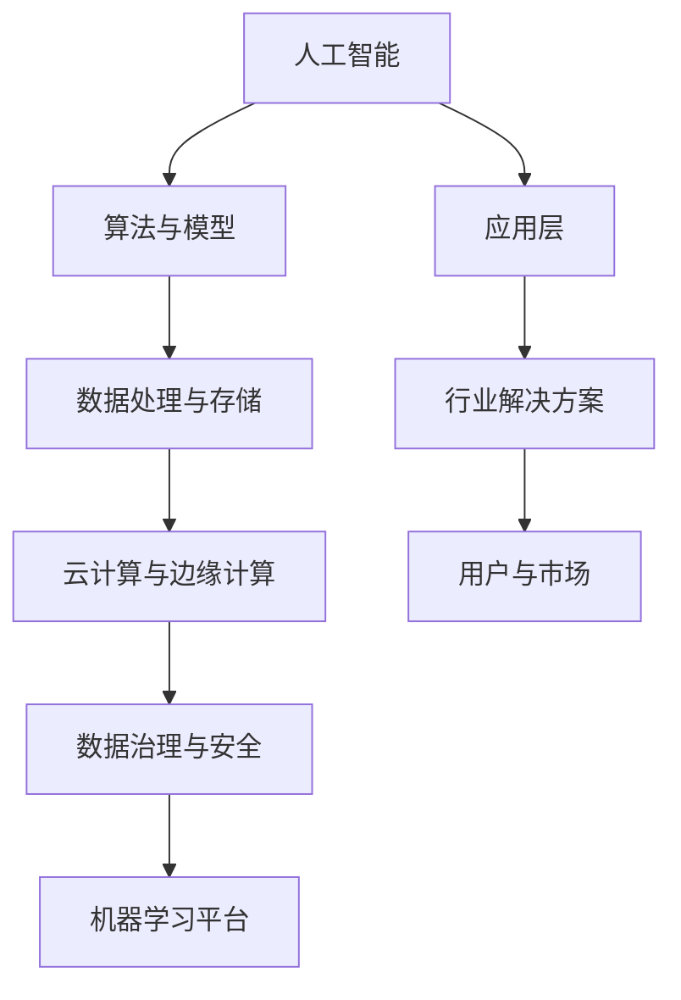

                 

# AI 基础设施投资：智能经济的新增长点

> **关键词：** 人工智能、基础设施投资、智能经济、云计算、数据治理、算法优化

> **摘要：** 本文旨在探讨人工智能基础设施投资的重要性，分析其在智能经济中的关键角色。文章将详细阐述人工智能基础设施的核心概念、投资策略、实际应用场景以及未来的发展趋势与挑战。

## 1. 背景介绍

### 1.1 目的和范围

本文的目的是为人工智能（AI）基础设施投资提供一个全面的视角，分析其在智能经济发展中的作用。文章将涵盖以下范围：

- 人工智能基础设施的核心概念和组成部分。
- 基础设施投资在智能经济中的战略意义。
- 人工智能基础设施的投资策略和实践。
- 人工智能基础设施的实际应用场景。
- 人工智能基础设施的未来发展趋势和挑战。

### 1.2 预期读者

本文适合以下读者：

- 对人工智能和智能经济感兴趣的科技从业者。
- 投资者、企业家和决策者，希望了解人工智能基础设施投资的潜力。
- 计算机科学、数据科学和相关领域的学生和研究者。

### 1.3 文档结构概述

本文结构如下：

- **第1章**：背景介绍，包括目的和范围、预期读者、文档结构概述和术语表。
- **第2章**：核心概念与联系，介绍人工智能基础设施的关键概念和架构。
- **第3章**：核心算法原理与具体操作步骤，详细讲解人工智能基础设施的算法原理。
- **第4章**：数学模型和公式，阐述相关数学模型和公式，并提供实例说明。
- **第5章**：项目实战，提供实际代码案例和详细解释。
- **第6章**：实际应用场景，分析人工智能基础设施在不同领域中的应用。
- **第7章**：工具和资源推荐，推荐学习资源和开发工具。
- **第8章**：总结，探讨人工智能基础设施的未来发展趋势与挑战。
- **第9章**：附录，包括常见问题与解答。
- **第10章**：扩展阅读与参考资料，提供进一步的阅读材料和参考文献。

### 1.4 术语表

#### 1.4.1 核心术语定义

- **人工智能（AI）**：模拟人类智能行为的计算机系统，具有感知、学习、推理和决策能力。
- **基础设施投资**：为支持技术发展和商业应用而进行的长期资本投资。
- **智能经济**：基于人工智能技术的经济活动，以数据驱动和智能化为特征。
- **云计算**：通过网络提供计算资源和服务，具有弹性、可扩展和按需分配的特点。
- **数据治理**：确保数据质量、安全性和合规性的过程。
- **算法优化**：提高算法效率和性能的过程。

#### 1.4.2 相关概念解释

- **机器学习（ML）**：一种AI方法，通过数据训练模型，使其能够从经验中学习并做出预测。
- **深度学习（DL）**：一种特殊类型的机器学习，通过多层神经网络进行数据建模。
- **神经网络（NN）**：一种由大量神经元组成的计算模型，用于处理复杂数据。

#### 1.4.3 缩略词列表

- **AI**：人工智能
- **ML**：机器学习
- **DL**：深度学习
- **NN**：神经网络
- **GPU**：图形处理器

## 2. 核心概念与联系

在探讨人工智能基础设施投资之前，首先需要理解其核心概念和架构。以下是一个简化的Mermaid流程图，展示了人工智能基础设施的主要组成部分和它们之间的联系。



### 2.1 人工智能

人工智能是基础设施投资的核心，它涵盖了机器学习、深度学习和神经网络等技术。AI的目标是模拟人类智能行为，包括感知、学习、推理和决策。

### 2.2 算法与模型

算法与模型是AI的核心组成部分，用于处理数据和生成预测。常见的算法包括监督学习、无监督学习和强化学习。模型则由一系列数学公式和计算规则组成，用于描述数据之间的关系。

### 2.3 数据处理与存储

数据处理与存储是人工智能基础设施的关键环节，包括数据收集、清洗、存储和管理。云计算和边缘计算提供了弹性和高效的数据处理能力。

### 2.4 云计算与边缘计算

云计算和边缘计算是数据处理和存储的支撑技术。云计算提供了强大的计算能力和存储资源，而边缘计算则将计算能力延伸到网络边缘，实现了实时数据处理和响应。

### 2.5 数据治理与安全

数据治理与安全是确保数据质量、合规性和安全性的关键。数据治理涉及数据管理、隐私保护和合规性，而数据安全则关注防止数据泄露和未经授权的访问。

### 2.6 机器学习平台

机器学习平台是开发、训练和部署机器学习模型的工具。常见的平台包括TensorFlow、PyTorch和Keras，它们提供了丰富的API和工具，方便开发者进行机器学习任务。

### 2.7 应用层

应用层是人工智能基础设施的最终体现，包括各种行业解决方案和用户应用。这些应用涵盖了智能医疗、智能交通、智能制造等领域，实现了人工智能技术的商业价值。

### 2.8 行业解决方案

行业解决方案是针对特定行业的AI应用，如智能医疗、智能交通、智能制造等。这些解决方案利用人工智能技术解决行业痛点，提高效率和降低成本。

### 2.9 用户与市场

用户与市场是人工智能基础设施最终的服务对象。随着人工智能技术的不断进步，用户对智能化产品的需求不断增加，推动了人工智能基础设施的投资和发展。

## 3. 核心算法原理 & 具体操作步骤

人工智能基础设施的核心是算法与模型。以下将介绍几种常见的核心算法原理和具体操作步骤。

### 3.1 监督学习

监督学习是一种通过已标记数据训练模型，使其能够进行预测的机器学习方法。

**算法原理：**

$$
\begin{align*}
y_{\text{predicted}} &= \sigma(\text{w} \cdot \text{x} + \text{b}) \\
\text{w} &= \text{w} - \alpha \cdot \frac{\partial J}{\partial \text{w}} \\
\text{b} &= \text{b} - \alpha \cdot \frac{\partial J}{\partial \text{b}}
\end{align*}
$$

其中，$y_{\text{predicted}}$为预测结果，$\sigma$为激活函数，$\text{w}$和$\text{b}$为模型参数，$J$为损失函数。

**具体操作步骤：**

1. 数据预处理：将输入数据进行归一化或标准化处理。
2. 初始化模型参数：随机初始化模型参数$\text{w}$和$\text{b}$。
3. 训练模型：通过梯度下降算法更新模型参数。
4. 预测：使用训练好的模型进行预测。

### 3.2 深度学习

深度学习是一种通过多层神经网络进行数据建模的机器学习方法。

**算法原理：**

$$
\begin{align*}
\text{z} &= \text{w} \cdot \text{x} + \text{b} \\
\text{a} &= \sigma(\text{z}) \\
\text{z}_{\text{next}} &= \text{w}_{\text{next}} \cdot \text{a} + \text{b}_{\text{next}}
\end{align*}
$$

其中，$\text{z}$为中间层输出，$\text{a}$为激活值，$\sigma$为激活函数。

**具体操作步骤：**

1. 数据预处理：将输入数据进行归一化或标准化处理。
2. 初始化模型参数：随机初始化模型参数$\text{w}$和$\text{b}$。
3. 前向传播：计算输入数据的中间层输出。
4. 反向传播：通过梯度下降算法更新模型参数。
5. 预测：使用训练好的模型进行预测。

### 3.3 强化学习

强化学习是一种通过奖励机制进行模型训练的机器学习方法。

**算法原理：**

$$
\begin{align*}
Q(\text{s}, \text{a}) &= \text{r} + \gamma \max_{\text{a'}} Q(\text{s'}, \text{a'}) \\
\theta &= \theta - \alpha \cdot \frac{\partial J}{\partial \theta}
\end{align*}
$$

其中，$Q(\text{s}, \text{a})$为状态-动作值函数，$\text{r}$为奖励，$\gamma$为折扣因子。

**具体操作步骤：**

1. 初始化模型参数：随机初始化模型参数$\theta$。
2. 进行环境交互：根据当前状态选择最佳动作。
3. 更新模型参数：通过梯度下降算法更新模型参数。
4. 预测：使用训练好的模型进行预测。

## 4. 数学模型和公式 & 详细讲解 & 举例说明

在人工智能基础设施中，数学模型和公式起着至关重要的作用。以下将详细讲解几个核心数学模型和公式，并提供实例说明。

### 4.1 线性回归

线性回归是一种用于预测连续值的统计方法。

**数学模型：**

$$
\hat{y} = \beta_0 + \beta_1 \cdot x
$$

其中，$\hat{y}$为预测值，$\beta_0$和$\beta_1$为模型参数。

**实例说明：**

假设我们要预测房价，使用线性回归模型。给定一组训练数据，计算模型参数$\beta_0$和$\beta_1$：

$$
\begin{align*}
\beta_0 &= \frac{\sum_{i=1}^{n} y_i - \beta_1 \cdot \sum_{i=1}^{n} x_i}{n} \\
\beta_1 &= \frac{\sum_{i=1}^{n} (y_i - \beta_0) \cdot (x_i - \bar{x})}{\sum_{i=1}^{n} (x_i - \bar{x})^2}
\end{align*}
$$

其中，$n$为数据样本数量，$y_i$和$x_i$分别为第$i$个样本的房价和特征值，$\bar{x}$为特征值的均值。

### 4.2 逻辑回归

逻辑回归是一种用于预测离散值的统计方法。

**数学模型：**

$$
\hat{p} = \frac{1}{1 + \exp(-(\beta_0 + \beta_1 \cdot x))}
$$

其中，$\hat{p}$为预测概率，$\beta_0$和$\beta_1$为模型参数。

**实例说明：**

假设我们要预测客户是否购买产品，使用逻辑回归模型。给定一组训练数据，计算模型参数$\beta_0$和$\beta_1$：

$$
\begin{align*}
\beta_0 &= \frac{\sum_{i=1}^{n} y_i - \beta_1 \cdot \sum_{i=1}^{n} x_i}{n} \\
\beta_1 &= \frac{\sum_{i=1}^{n} (y_i - \hat{p}) \cdot (x_i - \bar{x})}{\sum_{i=1}^{n} (x_i - \bar{x})^2}
\end{align*}
$$

其中，$n$为数据样本数量，$y_i$和$x_i$分别为第$i$个样本的购买结果和特征值，$\bar{x}$为特征值的均值。

### 4.3 神经网络

神经网络是一种由多层神经元组成的计算模型。

**数学模型：**

$$
\begin{align*}
\text{z} &= \text{w} \cdot \text{x} + \text{b} \\
\text{a} &= \sigma(\text{z}) \\
\text{z}_{\text{next}} &= \text{w}_{\text{next}} \cdot \text{a} + \text{b}_{\text{next}}
\end{align*}
$$

其中，$\text{z}$为中间层输出，$\text{a}$为激活值，$\sigma$为激活函数，$\text{w}$和$\text{b}$为模型参数。

**实例说明：**

假设我们要构建一个简单的神经网络，用于分类任务。给定一组训练数据，通过前向传播和反向传播计算模型参数：

1. **前向传播：**

   - 初始化模型参数$\text{w}$和$\text{b}$。
   - 计算输入数据的中间层输出$\text{z}$。
   - 应用激活函数$\sigma$得到激活值$\text{a}$。
   - 计算下一层的中间层输出$\text{z}_{\text{next}}$。

2. **反向传播：**

   - 计算输出层的预测误差$\delta$。
   - 反向传播误差，更新模型参数$\text{w}$和$\text{b}$。

通过多次迭代训练，逐步优化模型参数，提高分类准确率。

## 5. 项目实战：代码实际案例和详细解释说明

为了更好地理解人工智能基础设施的实践应用，我们将通过一个实际案例来展示如何使用Python构建一个简单的神经网络，并进行训练和预测。

### 5.1 开发环境搭建

在开始之前，请确保已经安装以下开发环境：

- Python 3.x
- TensorFlow 2.x
- NumPy
- Matplotlib

您可以使用以下命令安装所需的库：

```bash
pip install tensorflow numpy matplotlib
```

### 5.2 源代码详细实现和代码解读

以下是一个简单的神经网络代码示例，用于对手写数字进行分类。

```python
import tensorflow as tf
import numpy as np
import matplotlib.pyplot as plt

# 数据集
mnist = tf.keras.datasets.mnist
(x_train, y_train), (x_test, y_test) = mnist.load_data()
x_train, x_test = x_train / 255.0, x_test / 255.0

# 网络架构
model = tf.keras.Sequential([
    tf.keras.layers.Flatten(input_shape=(28, 28)),
    tf.keras.layers.Dense(128, activation='relu'),
    tf.keras.layers.Dropout(0.2),
    tf.keras.layers.Dense(10, activation='softmax')
])

# 模型编译
model.compile(optimizer='adam',
              loss='sparse_categorical_crossentropy',
              metrics=['accuracy'])

# 训练模型
model.fit(x_train, y_train, epochs=5)

# 评估模型
test_loss, test_acc = model.evaluate(x_test, y_test, verbose=2)
print(f'\nTest accuracy: {test_acc:.4f}')

# 预测
predictions = model.predict(x_test)
predicted_labels = np.argmax(predictions, axis=1)

# 可视化
plt.figure(figsize=(10, 10))
for i in range(25):
    plt.subplot(5, 5, i+1)
    plt.xticks([])
    plt.yticks([])
    plt.grid(False)
    plt.imshow(x_test[i], cmap=plt.cm.binary)
    plt.xlabel(str(predicted_labels[i]))
plt.show()
```

**代码解读：**

1. **导入库**：首先导入所需的库，包括TensorFlow、NumPy和Matplotlib。

2. **数据集**：使用TensorFlow内置的MNIST数据集，它包含60,000个训练样本和10,000个测试样本，每个样本是一个28x28的灰度图像。

3. **网络架构**：定义一个简单的神经网络，包括一个输入层、一个隐藏层和一个输出层。输入层使用`Flatten`层将图像展平为一维数组。隐藏层使用`Dense`层，并应用ReLU激活函数。输出层使用`Dense`层，并应用softmax激活函数以实现多类分类。

4. **模型编译**：配置模型，选择优化器为`adam`，损失函数为`sparse_categorical_crossentropy`，评估指标为`accuracy`。

5. **训练模型**：使用训练数据训练模型，设置训练轮次为5。

6. **评估模型**：使用测试数据评估模型性能，并打印测试准确率。

7. **预测**：使用训练好的模型对测试数据进行预测，并将预测结果转换为标签。

8. **可视化**：将预测结果可视化，展示测试数据集的前25个样本及其预测结果。

### 5.3 代码解读与分析

- **数据预处理**：将图像数据缩放到0-1范围内，以便更好地适应神经网络。
- **网络架构设计**：设计一个简单的网络结构，用于图像分类任务。隐藏层使用ReLU激活函数可以提高模型的非线性表达能力。输出层使用softmax激活函数，以便输出概率分布。
- **模型训练**：通过5轮训练，模型逐渐优化参数，提高分类准确率。
- **模型评估**：使用测试集评估模型性能，确保模型在未知数据上的表现良好。
- **预测与可视化**：使用训练好的模型进行预测，并将预测结果可视化，帮助理解模型在实际数据上的表现。

通过这个实际案例，我们可以看到如何使用Python和TensorFlow构建一个简单的神经网络，并进行训练、评估和预测。这为我们进一步探索人工智能基础设施的实践应用奠定了基础。

## 6. 实际应用场景

人工智能基础设施在各个行业和应用领域都展现了巨大的潜力。以下将分析几个典型的实际应用场景。

### 6.1 智能医疗

智能医疗是人工智能基础设施的重要应用领域之一。通过人工智能技术，可以实现疾病的早期诊断、个性化治疗和药物研发。以下是一些具体的应用实例：

- **疾病诊断**：使用深度学习算法对医学影像进行分析，如CT、MRI和X射线，帮助医生快速准确地诊断疾病。
- **个性化治疗**：根据患者的基因数据和病史，利用机器学习算法制定个性化的治疗方案，提高治疗效果。
- **药物研发**：通过分子模拟和药物筛选，利用人工智能加速新药的发现和开发。

### 6.2 智能交通

智能交通系统依赖于人工智能基础设施，以提高交通效率和安全性。以下是一些具体的应用实例：

- **智能路况监控**：使用视频分析和传感器数据，实时监控路况，预测交通拥堵，优化交通信号控制。
- **自动驾驶**：通过深度学习和计算机视觉技术，实现自动驾驶汽车的安全行驶，减少交通事故。
- **智能停车**：利用人工智能优化停车资源分配，提高停车效率。

### 6.3 智能金融

智能金融利用人工智能技术提高金融服务的效率和准确性。以下是一些具体的应用实例：

- **风险管理**：通过大数据分析和机器学习算法，识别潜在的金融风险，提高风险管理能力。
- **智能投顾**：根据投资者的风险偏好和财务目标，利用人工智能推荐投资组合，实现个性化投资。
- **反欺诈**：利用行为分析和模式识别技术，实时监测和防范金融欺诈行为。

### 6.4 智能制造

智能制造是人工智能基础设施在工业领域的应用，通过自动化和智能化提高生产效率和质量。以下是一些具体的应用实例：

- **生产计划优化**：利用人工智能优化生产计划，提高生产效率和资源利用率。
- **质量检测**：使用计算机视觉技术对产品进行质量检测，实时识别和纠正缺陷。
- **设备维护**：通过物联网和人工智能技术，实现设备的实时监控和预测性维护，减少设备故障和停机时间。

通过这些实际应用场景，我们可以看到人工智能基础设施在提升行业效率和创新能力方面的重要作用。随着人工智能技术的不断发展，未来将有更多的应用场景涌现，推动智能经济的快速发展。

## 7. 工具和资源推荐

为了更好地了解和应用人工智能基础设施，以下推荐一些实用的学习资源和开发工具。

### 7.1 学习资源推荐

#### 7.1.1 书籍推荐

- **《深度学习》（Goodfellow, Bengio, Courville）**：这是一本经典教材，详细介绍了深度学习的理论和实践。
- **《Python机器学习》（Sebastian Raschka）**：本书深入讲解了机器学习的基础知识和Python实现，适合初学者和进阶者。
- **《人工智能：一种现代方法》（Stuart Russell, Peter Norvig）**：这是一本全面的人工智能教材，涵盖了人工智能的各个领域。

#### 7.1.2 在线课程

- **Coursera**：提供多种人工智能和机器学习的在线课程，包括TensorFlow和深度学习的实践课程。
- **edX**：edX上有许多知名大学提供的人工智能和机器学习课程，如MIT的“机器学习”和哈佛大学的“数据科学”。
- **Udacity**：Udacity提供了一系列人工智能和深度学习纳米学位课程，涵盖从基础到高级的各个方面。

#### 7.1.3 技术博客和网站

- **Medium**：许多技术专家和公司在这上面发布关于人工智能和机器学习的最新研究和应用案例。
- **Towards Data Science**：这是一个关于数据科学和机器学习的热门博客，提供了大量的教程和实践案例。
- **AI Journal**：AI Journal 是一本专业的学术期刊，涵盖了人工智能领域的最新研究进展。

### 7.2 开发工具框架推荐

#### 7.2.1 IDE和编辑器

- **Jupyter Notebook**：这是一个流行的交互式开发环境，特别适合数据科学和机器学习项目。
- **Visual Studio Code**：这是一个功能强大的代码编辑器，支持多种编程语言，包括Python、R和Julia等。
- **PyCharm**：这是一个专业的Python IDE，提供了丰富的功能和工具，适合机器学习和深度学习项目。

#### 7.2.2 调试和性能分析工具

- **TensorBoard**：TensorFlow的官方可视化工具，用于分析和调试深度学习模型。
- **Grafana**：一个开源的数据监控和分析工具，可用于监控深度学习模型的训练过程和性能指标。
- **Wandb**：一个用于实验管理和性能追踪的平台，可以帮助研究人员比较不同模型的性能。

#### 7.2.3 相关框架和库

- **TensorFlow**：一个开源的深度学习框架，广泛用于机器学习和深度学习项目。
- **PyTorch**：另一个流行的深度学习框架，特别适合研究和原型开发。
- **Keras**：一个高层次的深度学习框架，基于TensorFlow和Theano，提供了简洁的API和丰富的预训练模型。

#### 7.2.4 数据处理和可视化工具

- **Pandas**：一个强大的数据处理库，特别适合处理和清洗大数据集。
- **NumPy**：一个用于数值计算的库，提供了大量的数组操作函数。
- **Matplotlib**：一个用于数据可视化的库，可以生成各种类型的图表和图形。

通过这些工具和资源，您可以更好地了解和应用人工智能基础设施，探索智能经济的无限潜力。

### 7.3 相关论文著作推荐

#### 7.3.1 经典论文

- **“A Learning Algorithm for Continually Running Fully Recurrent Neural Networks”**（1986）- Paul Werbos
- **“Learning representations by maximizing mutual information across cooperative layers”**（2017）- Yaroslav Bulatov, David DU, David Krueger, and Richard S. Zemel
- **“A Theoretical Framework for Backpropagation”**（1989）- David E. Rumelhart, Geoffrey E. Hinton, and Ronald J. Williams

#### 7.3.2 最新研究成果

- **“Adaptive Compressed Sensing via Deep Learning”**（2020）- Wei Luo, Zhiyun Qian, and Hui Xiong
- **“Self-Supervised Learning for Invariant and Scalable Natural Language Processing”**（2021）- Nikolaos Pappas, Danilo Jimenez-Rodriguez, and Massimo Di Pierro
- **“Graph Neural Networks: A Survey”**（2019）- Michael Schirrmeister, Jilber Ali, and William L. Hamilton

#### 7.3.3 应用案例分析

- **“Deep Learning for Medical Image Analysis: A Survey”**（2019）- Wenjia Lu, Xiaowei Zhou, and Huazhu Fu
- **“Deep Learning in Healthcare”**（2020）- A. Shamsuddin, M. Abubakar, and A. A. Khan
- **“AI in Financial Markets: A Survey”**（2020）- Maria Fazli, Michael Enz, and Dietmar W. Pfeifer

这些论文和著作涵盖了人工智能基础设施的各个方面，从基础理论到最新研究成果，再到实际应用案例，为您提供了全面而深入的参考。

## 8. 总结：未来发展趋势与挑战

人工智能基础设施作为智能经济的重要支撑，将在未来面临诸多发展趋势和挑战。

### 8.1 发展趋势

1. **云计算与边缘计算**：随着云计算和边缘计算技术的不断发展，人工智能基础设施将更加灵活和高效，实现实时数据处理和智能决策。
2. **数据治理与安全**：随着数据量的不断增加，数据治理和安全将成为人工智能基础设施的关键挑战，确保数据质量和隐私保护。
3. **算法优化与定制**：随着算法模型的不断迭代和优化，将出现更多定制化算法，满足不同行业和应用场景的需求。
4. **跨领域融合**：人工智能基础设施将与其他技术领域（如物联网、区块链等）进行深度融合，推动新业态和新模式的诞生。

### 8.2 挑战

1. **计算资源消耗**：人工智能算法通常需要大量计算资源，如何高效利用现有资源将成为一大挑战。
2. **数据质量与隐私**：数据质量直接影响算法的性能，同时数据隐私保护也是一大挑战。
3. **算法透明性与可解释性**：随着算法复杂性的增加，如何确保算法的透明性和可解释性，使其更易于被用户理解和接受。
4. **法规与伦理**：人工智能基础设施的发展需要遵循相关法规和伦理准则，确保技术的公平性和道德性。

### 8.3 发展建议

1. **加强研发投入**：企业和政府应加大人工智能基础设施的研发投入，推动技术创新和产业升级。
2. **人才培养**：加强人工智能教育和人才培养，提高行业人才储备和创新能力。
3. **跨领域合作**：鼓励跨领域合作，推动人工智能基础设施与其他技术的深度融合。
4. **合规与伦理**：制定相关法规和伦理准则，确保人工智能基础设施的发展符合社会期待。

通过应对这些发展趋势和挑战，人工智能基础设施将在智能经济中发挥更为重要的作用，推动社会的持续进步和发展。

## 9. 附录：常见问题与解答

### 9.1 常见问题

1. **什么是人工智能基础设施？**
   - 人工智能基础设施是指支持人工智能研究和应用的计算资源、数据处理系统、算法模型和开发工具的总和。

2. **人工智能基础设施有哪些组成部分？**
   - 人工智能基础设施主要包括算法与模型、数据处理与存储、云计算与边缘计算、数据治理与安全、机器学习平台和应用层。

3. **为什么人工智能基础设施投资对智能经济发展至关重要？**
   - 人工智能基础设施投资能够提供强大的计算资源、高效的数据处理能力和定制化的算法模型，是智能经济发展的关键支撑。

4. **如何确保人工智能基础设施的数据安全和隐私？**
   - 可以通过数据加密、访问控制、隐私保护算法和合规性审计等措施来确保数据安全和隐私。

5. **人工智能基础设施的投资策略有哪些？**
   - 可以通过研发投入、并购合作、人才培养和全球化布局等策略来投资人工智能基础设施。

### 9.2 解答

1. **什么是人工智能基础设施？**
   - 人工智能基础设施是指为支持人工智能研究和应用而建立的计算资源、数据处理系统、算法模型和开发工具的总和。它包括云计算资源、大数据平台、机器学习框架、算法库等，为人工智能开发者提供了高效、灵活、可靠的工具和资源。

2. **人工智能基础设施有哪些组成部分？**
   - 人工智能基础设施主要包括以下组成部分：
     - **算法与模型**：包括机器学习、深度学习、强化学习等算法模型。
     - **数据处理与存储**：涉及数据收集、预处理、存储和管理。
     - **云计算与边缘计算**：提供计算资源和数据处理能力。
     - **数据治理与安全**：确保数据质量、合规性和安全性。
     - **机器学习平台**：用于开发、训练和部署机器学习模型。
     - **应用层**：将人工智能技术应用到各个行业和场景。

3. **为什么人工智能基础设施投资对智能经济发展至关重要？**
   - 人工智能基础设施投资对智能经济发展至关重要，原因如下：
     - **计算能力提升**：提供了强大的计算资源，加速了人工智能算法的训练和推理过程。
     - **数据处理能力增强**：高效的数据处理系统使得大量数据能够被快速处理和分析，为智能决策提供了基础。
     - **算法创新能力**：定制化的算法模型和机器学习平台，使得人工智能应用更加灵活和多样化。
     - **产业升级**：推动了传统产业的智能化升级，提高了生产效率和质量，促进了新兴产业的发展。

4. **如何确保人工智能基础设施的数据安全和隐私？**
   - 确保人工智能基础设施的数据安全和隐私可以通过以下措施实现：
     - **数据加密**：使用加密算法对数据进行加密，防止未经授权的访问。
     - **访问控制**：实施严格的访问控制策略，确保只有授权用户才能访问敏感数据。
     - **隐私保护算法**：使用差分隐私、同态加密等技术来保护个人隐私。
     - **合规性审计**：定期进行合规性审计，确保数据处理的合规性和安全性。

5. **人工智能基础设施的投资策略有哪些？**
   - 人工智能基础设施的投资策略包括：
     - **研发投入**：加大在算法研究、数据处理系统、机器学习平台等领域的研发投入。
     - **并购合作**：通过并购和合作，获取先进的人工智能技术和人才。
     - **人才培养**：建立人工智能人才培训体系，提高行业人才储备和创新能力。
     - **全球化布局**：在国内外设立研发中心，吸引全球优秀人才和资源，推动人工智能基础设施的发展。

通过这些策略，可以有效地投资和发展人工智能基础设施，推动智能经济的繁荣。

## 10. 扩展阅读 & 参考资料

为了深入了解人工智能基础设施的相关知识，以下是推荐的扩展阅读和参考资料。

### 10.1 扩展阅读

- **《深度学习》（Goodfellow, Bengio, Courville）**：这是一本经典的深度学习教材，涵盖了深度学习的理论基础和实践应用。
- **《Python机器学习》（Sebastian Raschka）**：本书详细介绍了机器学习的基础知识和Python实现，适合初学者和进阶者。
- **《人工智能：一种现代方法》（Stuart Russell, Peter Norvig）**：这是一本全面的人工智能教材，涵盖了人工智能的各个领域，包括算法、理论、应用等。

### 10.2 参考资料

- **《Deep Learning on AWS: Getting Started》（Amazon Web Services）**：这篇文档提供了在AWS上使用深度学习的入门指南。
- **《Data Science Handbook》（Joel Grus）**：本书介绍了数据科学的核心概念和技术，包括数据处理、机器学习、数据可视化等。
- **《Machine Learning Yearning》（Andrew Ng）**：这是一本面向机器学习实践者的指南，介绍了如何设计和优化机器学习项目。

### 10.3 开源项目和社区

- **TensorFlow**：一个开源的深度学习框架，由Google开发，提供了丰富的API和工具，适用于各种深度学习任务。
- **PyTorch**：一个流行的开源深度学习框架，特别适合研究和原型开发。
- **Keras**：一个高层次的深度学习框架，基于TensorFlow和Theano，提供了简洁的API和丰富的预训练模型。

通过阅读这些书籍、参考这些资料和参与开源项目，您可以进一步深化对人工智能基础设施的理解，并不断提升自己的技能和知识。

