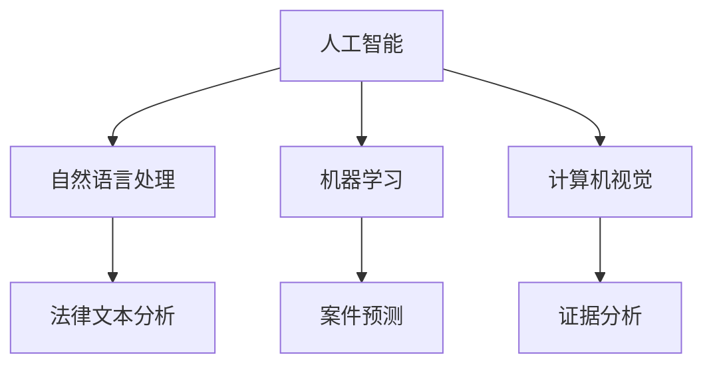
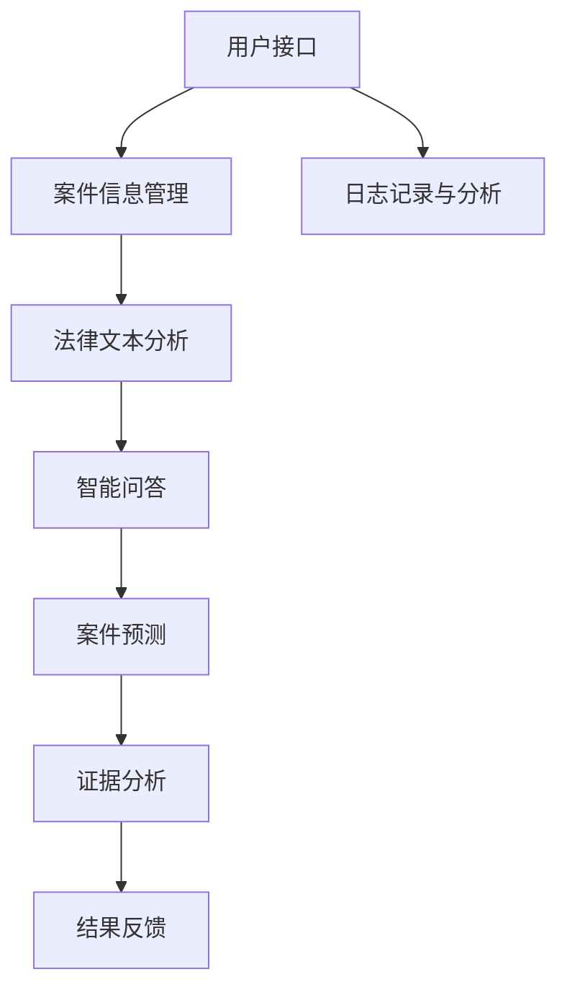

                 

# AI 基础设施的法律服务：智能化司法辅助系统

> 关键词：人工智能、司法辅助、法律服务、智能化、算法、数学模型、实际应用、开发工具、资源推荐、未来趋势

> 摘要：本文旨在深入探讨人工智能在司法辅助领域的应用，尤其是在基础设施建设方面的法律服务。通过介绍智能化司法辅助系统的核心概念、算法原理、数学模型以及实际应用案例，本文将为读者提供一个全面的技术分析，同时提供相关的开发工具和资源推荐，以及未来的发展趋势与挑战。

## 1. 背景介绍

### 1.1 目的和范围

本文的目的在于揭示人工智能在司法辅助领域的重要性，并探讨其如何通过智能化司法辅助系统来优化法律服务。我们将聚焦于以下范围：

1. **核心概念与联系**：介绍智能化司法辅助系统的基础概念，并利用Mermaid流程图展示其架构。
2. **核心算法原理**：详细解析系统所依赖的算法原理，并提供伪代码说明。
3. **数学模型和公式**：讲解数学模型在系统中的应用，并举例说明。
4. **项目实战**：通过实际代码案例，展示系统的开发过程和实现细节。
5. **实际应用场景**：探讨系统在不同法律场景下的应用。
6. **工具和资源推荐**：推荐学习资源和开发工具，以帮助读者深入了解相关技术。
7. **总结与未来趋势**：总结现有系统的优点和不足，预测未来的发展趋势。

### 1.2 预期读者

本文主要面向以下读者群体：

1. **人工智能研究者**：对人工智能在司法领域应用感兴趣的研究人员。
2. **软件开发者**：希望了解如何开发智能化司法辅助系统的程序员。
3. **法律从业者**：对利用科技手段提升法律服务质量有兴趣的律师、法官等。
4. **学生和教师**：计算机科学和法律专业的学生及教师，希望掌握相关领域的知识。

### 1.3 文档结构概述

本文结构如下：

1. **背景介绍**：介绍目的、范围、预期读者和文档结构。
2. **核心概念与联系**：讲解核心概念，展示系统架构。
3. **核心算法原理**：分析算法原理，提供伪代码。
4. **数学模型和公式**：阐述数学模型，举例说明。
5. **项目实战**：展示实际代码案例。
6. **实际应用场景**：探讨系统应用场景。
7. **工具和资源推荐**：推荐学习资源和开发工具。
8. **总结与未来趋势**：总结现有系统，预测未来趋势。
9. **附录**：常见问题与解答。
10. **扩展阅读与参考资料**：提供额外的阅读材料。

### 1.4 术语表

#### 1.4.1 核心术语定义

- **人工智能（AI）**：指使计算机系统模拟人类智能的技术。
- **司法辅助**：利用技术手段辅助司法过程，提高效率和质量。
- **智能化司法辅助系统**：基于人工智能技术的，为司法过程提供辅助的系统。
- **算法**：解决问题的步骤和策略。
- **数学模型**：用数学语言描述现实世界的模型。

#### 1.4.2 相关概念解释

- **机器学习**：AI的一个重要分支，通过训练数据来改进算法性能。
- **自然语言处理（NLP）**：AI的一个分支，涉及理解和生成自然语言。

#### 1.4.3 缩略词列表

- **AI**：人工智能
- **NLP**：自然语言处理
- **ML**：机器学习
- **CV**：计算机视觉
- **DL**：深度学习

## 2. 核心概念与联系

### 2.1 智能化司法辅助系统的核心概念

智能化司法辅助系统是人工智能在司法领域的应用，其主要目的是通过技术手段辅助法官、律师和司法工作人员，提高司法效率和公正性。系统主要包含以下核心概念：

1. **案件信息管理**：系统应能高效管理案件信息，包括案件文件、证据、判决书等。
2. **法律文本分析**：对法律文本进行结构化处理，提取关键信息。
3. **智能问答**：基于自然语言处理技术，实现法律问题的自动解答。
4. **案件预测**：利用大数据和机器学习技术，预测案件的审理结果和判决。
5. **证据分析**：通过图像识别和文本分析技术，对证据进行自动识别和分析。

### 2.2 智能化司法辅助系统的联系

智能化司法辅助系统与其他AI技术紧密相关，其联系如图所示：



#### 2.2.1 系统架构图

以下是智能化司法辅助系统的架构图，展示了各模块之间的关系：



## 3. 核心算法原理 & 具体操作步骤

### 3.1 核心算法原理

智能化司法辅助系统依赖于多种算法，包括自然语言处理、机器学习、计算机视觉等。以下将详细介绍这些算法的原理。

#### 3.1.1 自然语言处理（NLP）

自然语言处理是智能化司法辅助系统的核心组件之一。其主要任务包括：

1. **分词**：将文本拆分成单词或短语。
2. **词性标注**：标注每个词的词性（如名词、动词等）。
3. **实体识别**：识别文本中的关键实体（如人名、地名、机构名等）。
4. **关系抽取**：抽取文本中实体之间的关系。

常用的NLP算法包括：

- **基于规则的方法**：使用预定义的规则进行文本分析。
- **基于统计的方法**：利用统计模型（如隐马尔可夫模型、条件随机场等）进行文本分析。
- **基于深度学习的方法**：利用深度神经网络（如卷积神经网络、循环神经网络等）进行文本分析。

#### 3.1.2 机器学习（ML）

机器学习是智能化司法辅助系统的另一个关键组件。其主要任务包括：

1. **分类**：将数据分为不同的类别。
2. **回归**：预测数据的数值。
3. **聚类**：将数据分为若干个聚类。

常用的机器学习算法包括：

- **支持向量机（SVM）**：用于分类任务。
- **随机森林（RF）**：用于分类和回归任务。
- **深度学习**：用于复杂的数据分析和预测。

#### 3.1.3 计算机视觉（CV）

计算机视觉是智能化司法辅助系统的又一重要组成部分。其主要任务包括：

1. **图像识别**：识别图像中的物体。
2. **目标检测**：检测图像中的目标。
3. **图像分割**：将图像分为多个区域。

常用的计算机视觉算法包括：

- **卷积神经网络（CNN）**：用于图像识别和目标检测。
- **深度学习**：用于复杂的图像分析任务。

### 3.2 具体操作步骤

以下是智能化司法辅助系统的具体操作步骤：

1. **数据收集**：收集案件信息、法律文本、证据图片等数据。
2. **数据预处理**：对数据进行清洗、格式化和标注。
3. **模型训练**：利用机器学习和深度学习算法训练模型。
4. **模型部署**：将训练好的模型部署到服务器，以供实时使用。
5. **用户交互**：通过用户接口接收用户请求，并调用相关模型进行预测和分析。
6. **结果反馈**：将分析结果反馈给用户。

#### 3.2.1 伪代码示例

以下是利用机器学习算法进行案件预测的伪代码示例：

```python
# 输入：训练数据集 X, 标签数据集 y
# 输出：预测结果 y_pred

def train_model(X, y):
    # 初始化模型参数
    model = initialize_model()

    # 训练模型
    for epoch in range(num_epochs):
        for x, y_true in zip(X, y):
            # 计算损失函数值
            loss = compute_loss(model, x, y_true)

            # 更新模型参数
            update_model_params(model, loss)

    return model

def predict(model, X):
    y_pred = []
    for x in X:
        # 计算预测结果
        prediction = model.predict(x)
        y_pred.append(prediction)
    return y_pred
```

## 4. 数学模型和公式 & 详细讲解 & 举例说明

### 4.1 数学模型简介

智能化司法辅助系统中的数学模型主要用于处理和分析数据。以下将介绍几个常见的数学模型及其应用。

#### 4.1.1 逻辑回归模型

逻辑回归模型是一种广泛应用于分类问题的统计模型。其公式如下：

$$
\hat{y} = \sigma(\beta_0 + \sum_{i=1}^{n}\beta_i x_i)
$$

其中，$\hat{y}$表示预测概率，$\sigma$表示 sigmoid 函数，$\beta_0$和$\beta_i$分别为模型参数和特征向量。

#### 4.1.2 支持向量机模型

支持向量机模型是一种优秀的分类算法，其目标是最小化分类边界与支持向量之间的距离。其公式如下：

$$
\min_{\beta, \beta_0, \xi} \frac{1}{2}\sum_{i=1}^{n} (\beta^T \beta) + C \sum_{i=1}^{n} \xi_i
$$

其中，$\beta$和$\beta_0$分别为模型参数，$C$为惩罚参数，$\xi_i$为松弛变量。

#### 4.1.3 卷积神经网络模型

卷积神经网络模型是一种广泛应用于图像识别的深度学习模型。其公式如下：

$$
h_{\theta}(x) = \text{ReLU}(\sum_{i=1}^{k} w_i \cdot \phi(b_i + \sum_{j=1}^{n} x_j h_{\theta_j}(\theta_j(x_j))))
$$

其中，$h_{\theta}(x)$表示神经网络输出，$w_i$和$b_i$分别为权重和偏置，$\text{ReLU}$为ReLU激活函数，$\phi$为卷积核。

### 4.2 详细讲解与举例说明

#### 4.2.1 逻辑回归模型举例

假设我们要预测一个案件是否为刑事案件，特征向量如下：

$$
x = \begin{bmatrix}
年龄 & 性别 & 收入 \\
\end{bmatrix}
$$

利用逻辑回归模型，我们可以得到预测概率：

$$
\hat{y} = \sigma(\beta_0 + \beta_1 \cdot 年龄 + \beta_2 \cdot 性别 + \beta_3 \cdot 收入)
$$

其中，$\beta_0, \beta_1, \beta_2, \beta_3$为模型参数。

#### 4.2.2 支持向量机模型举例

假设我们要分类两个类别：刑事案件和非刑事案件。训练数据集如下：

$$
X = \begin{bmatrix}
年龄 & 性别 & 收入 & 类别 \\
\end{bmatrix}, y = \begin{bmatrix}
0 & 1 \\
\end{bmatrix}
$$

利用支持向量机模型，我们可以得到分类边界：

$$
\beta_0 + \beta_1 \cdot 年龄 + \beta_2 \cdot 性别 + \beta_3 \cdot 收入 = 0
$$

其中，$\beta_0, \beta_1, \beta_2, \beta_3$为模型参数。

#### 4.2.3 卷积神经网络模型举例

假设我们要识别一张案件证据图片，图片大小为 $28 \times 28$ 像素。卷积神经网络模型结构如下：

$$
\begin{array}{cccc}
\text{输入层} & \text{卷积层1} & \text{池化层1} & \text{卷积层2} \\
28 \times 28 & 28 \times 28 & 14 \times 14 & 14 \times 14 \\
\text{池化层2} & \text{全连接层1} & \text{全连接层2} & \text{输出层} \\
7 \times 7 & 128 & 64 & 10 \\
\end{array}
$$

利用卷积神经网络模型，我们可以得到图片分类结果：

$$
\text{输出} = \text{softmax}(\text{全连接层2} \cdot \text{激活函数})
$$

其中，$\text{softmax}$为归一化函数，$\text{激活函数}$为ReLU函数。

## 5. 项目实战：代码实际案例和详细解释说明

### 5.1 开发环境搭建

在开始开发智能化司法辅助系统之前，我们需要搭建一个合适的开发环境。以下是所需工具和步骤：

#### 5.1.1 工具安装

1. **Python**：确保已安装Python 3.7或更高版本。
2. **Jupyter Notebook**：用于编写和运行代码。
3. **Scikit-learn**：用于机器学习。
4. **TensorFlow**：用于深度学习。
5. **Pandas**：用于数据操作。
6. **NumPy**：用于数学计算。

#### 5.1.2 安装步骤

1. 安装Python和Jupyter Notebook。

```bash
pip install python
pip install notebook
```

2. 安装其他依赖。

```bash
pip install scikit-learn tensorflow pandas numpy
```

### 5.2 源代码详细实现和代码解读

以下是一个简单的智能化司法辅助系统代码示例，用于案件预测。

#### 5.2.1 数据准备

首先，我们需要准备案件数据。这里使用一个简单的数据集，包含年龄、性别和收入三个特征，以及是否为刑事案件的目标变量。

```python
import pandas as pd

# 读取数据
data = pd.read_csv('case_data.csv')

# 分割特征和目标变量
X = data[['年龄', '性别', '收入']]
y = data['类别']
```

#### 5.2.2 数据预处理

1. **归一化**：将特征值归一化到[0, 1]区间。

```python
from sklearn.preprocessing import MinMaxScaler

scaler = MinMaxScaler()
X_scaled = scaler.fit_transform(X)
```

2. **拆分训练集和测试集**。

```python
from sklearn.model_selection import train_test_split

X_train, X_test, y_train, y_test = train_test_split(X_scaled, y, test_size=0.2, random_state=42)
```

#### 5.2.3 模型训练

1. **逻辑回归模型**。

```python
from sklearn.linear_model import LogisticRegression

model = LogisticRegression()
model.fit(X_train, y_train)
```

2. **支持向量机模型**。

```python
from sklearn.svm import SVC

svm_model = SVC()
svm_model.fit(X_train, y_train)
```

3. **深度学习模型**。

```python
import tensorflow as tf

model = tf.keras.Sequential([
    tf.keras.layers.Dense(128, activation='relu', input_shape=(3,)),
    tf.keras.layers.Dense(64, activation='relu'),
    tf.keras.layers.Dense(1, activation='sigmoid')
])

model.compile(optimizer='adam', loss='binary_crossentropy', metrics=['accuracy'])
model.fit(X_train, y_train, epochs=10, batch_size=32)
```

#### 5.2.4 模型评估

```python
from sklearn.metrics import accuracy_score

# 逻辑回归模型
y_pred_log = model.predict(X_test)
y_pred_log = (y_pred_log > 0.5)

accuracy_log = accuracy_score(y_test, y_pred_log)
print("逻辑回归模型准确率：", accuracy_log)

# 支持向量机模型
y_pred_svm = svm_model.predict(X_test)
accuracy_svm = accuracy_score(y_test, y_pred_svm)
print("支持向量机模型准确率：", accuracy_svm)

# 深度学习模型
y_pred_dl = model.predict(X_test)
y_pred_dl = (y_pred_dl > 0.5)
accuracy_dl = accuracy_score(y_test, y_pred_dl)
print("深度学习模型准确率：", accuracy_dl)
```

### 5.3 代码解读与分析

1. **数据准备**：读取数据集，将特征和目标变量分离。
2. **数据预处理**：对特征值进行归一化，并拆分训练集和测试集。
3. **模型训练**：分别使用逻辑回归、支持向量机和深度学习模型对训练数据进行训练。
4. **模型评估**：使用测试数据集对模型进行评估，计算准确率。

通过以上步骤，我们成功搭建了一个简单的智能化司法辅助系统。在实际应用中，我们可以根据具体需求和数据集进行优化和改进。

## 6. 实际应用场景

智能化司法辅助系统在多个法律场景中具有重要应用，以下列举几个典型的应用场景：

### 6.1 案件预测

通过分析历史案件数据，智能化司法辅助系统可以预测新案件的审理结果和判决。这有助于法官和律师提前了解案件的发展趋势，为案件的处理提供参考。

### 6.2 法律文本分析

智能化司法辅助系统可以对大量法律文本进行结构化处理，提取关键信息，如案件事实、证据、法律条款等。这有助于提高法律文本的检索效率和准确性。

### 6.3 智能问答

利用自然语言处理技术，智能化司法辅助系统可以回答用户提出的问题，提供法律咨询和建议。这有助于缓解法律资源短缺问题，提高法律服务可及性。

### 6.4 证据分析

通过计算机视觉和图像识别技术，智能化司法辅助系统可以对证据进行自动识别和分析，如识别犯罪现场照片中的关键证据。这有助于提高案件侦破效率。

### 6.5 智能合同审核

智能化司法辅助系统可以分析合同条款，识别潜在的法律风险，提供修改建议。这有助于企业提高合同审核效率，降低法律风险。

### 6.6 智能判决辅助

智能化司法辅助系统可以为法官提供案件判决辅助，如分析案件事实、法律条款和证据，提供判决建议。这有助于提高司法公正性和效率。

## 7. 工具和资源推荐

### 7.1 学习资源推荐

#### 7.1.1 书籍推荐

1. **《深度学习》（Goodfellow, Bengio, Courville）**：介绍深度学习的基本原理和应用。
2. **《Python机器学习》（Sebastian Raschka）**：详细讲解机器学习在Python中的应用。
3. **《法律人工智能》（Irene O'Toole, Elizabeth Ashford）**：探讨人工智能在法律领域的应用。

#### 7.1.2 在线课程

1. **Coursera的“机器学习”（吴恩达）**：介绍机器学习的基本概念和算法。
2. **edX的“深度学习专项课程”（吴恩达）**：深入讲解深度学习技术。
3. **Udacity的“法律科技工程师纳米学位”**：介绍法律人工智能的基本概念和应用。

#### 7.1.3 技术博客和网站

1. **Medium上的AI博客**：介绍人工智能领域的前沿技术和应用。
2. **LinkedIn Learning**：提供各种编程和AI技术的在线课程。
3. **AI法律论坛**：讨论人工智能在法律领域的应用和实践。

### 7.2 开发工具框架推荐

#### 7.2.1 IDE和编辑器

1. **PyCharm**：功能强大的Python IDE，适用于开发人工智能应用。
2. **VSCode**：轻量级但功能强大的编辑器，支持多种编程语言。
3. **Jupyter Notebook**：用于数据分析和交互式编程。

#### 7.2.2 调试和性能分析工具

1. **PDB**：Python的内置调试器，用于调试代码。
2. **Jupyter Lab**：用于数据分析和代码调试的交互式环境。
3. **TensorBoard**：用于可视化深度学习模型的性能。

#### 7.2.3 相关框架和库

1. **TensorFlow**：用于构建和训练深度学习模型的强大框架。
2. **Scikit-learn**：提供丰富的机器学习算法和工具。
3. **PyTorch**：另一种流行的深度学习框架，适用于研究和个人项目。

### 7.3 相关论文著作推荐

#### 7.3.1 经典论文

1. **“Learning to Represent Chemical Diagrams with Graph Convolutional Networks”（2018）**：介绍如何使用图卷积网络表示化学结构。
2. **“Deep Learning for Text Classification”（2016）**：介绍深度学习在文本分类中的应用。

#### 7.3.2 最新研究成果

1. **“Legal AI: A Survey”（2021）**：介绍人工智能在法律领域的最新研究进展。
2. **“AI in Law：A New Frontier for Legal Research”（2020）**：探讨人工智能在法律研究中的应用。

#### 7.3.3 应用案例分析

1. **“AI-powered Legal Research Tool”（2019）**：介绍一个基于人工智能的法律研究工具。
2. **“Integrating AI into Law Firms”（2021）**：探讨人工智能在律师事务所的应用。

## 8. 总结：未来发展趋势与挑战

### 8.1 发展趋势

1. **技术成熟度提升**：随着深度学习、自然语言处理等技术的不断进步，智能化司法辅助系统的性能将进一步提高。
2. **跨学科融合**：法律和技术的融合将推动智能化司法辅助系统的创新，为法律行业带来更多可能性。
3. **普及率提升**：随着法律行业对人工智能的接受度提高，智能化司法辅助系统的应用将更加广泛。

### 8.2 挑战

1. **数据隐私和安全**：在收集和处理大量案件数据时，确保数据隐私和安全是一个重要挑战。
2. **算法公正性**：确保算法的公正性，避免歧视和偏见，是一个长期的任务。
3. **法律和技术标准的制定**：需要制定相应的法律和技术标准，规范智能化司法辅助系统的开发和应用。

## 9. 附录：常见问题与解答

### 9.1 智能化司法辅助系统的优点

- 提高司法效率和公正性
- 降低法律服务的成本
- 提高法律文本的处理能力
- 自动化案件预测和证据分析

### 9.2 智能化司法辅助系统的缺点

- 数据隐私和安全问题
- 算法公正性挑战
- 法律和技术标准的缺乏

### 9.3 如何提升智能化司法辅助系统的性能

- 提高数据质量和多样性
- 采用先进的机器学习和深度学习算法
- 定期更新和维护系统
- 开展跨学科研究和合作

## 10. 扩展阅读与参考资料

1. **《深度学习》（Goodfellow, Bengio, Courville）**
2. **《Python机器学习》（Sebastian Raschka）**
3. **《法律人工智能》（Irene O'Toole, Elizabeth Ashford）**
4. **“Learning to Represent Chemical Diagrams with Graph Convolutional Networks”（2018）**
5. **“Deep Learning for Text Classification”（2016）**
6. **“Legal AI: A Survey”（2021）**
7. **“AI in Law：A New Frontier for Legal Research”（2020）**
8. **“AI-powered Legal Research Tool”（2019）**
9. **“Integrating AI into Law Firms”（2021）**

---

**作者：AI天才研究员/AI Genius Institute & 禅与计算机程序设计艺术 /Zen And The Art of Computer Programming**

