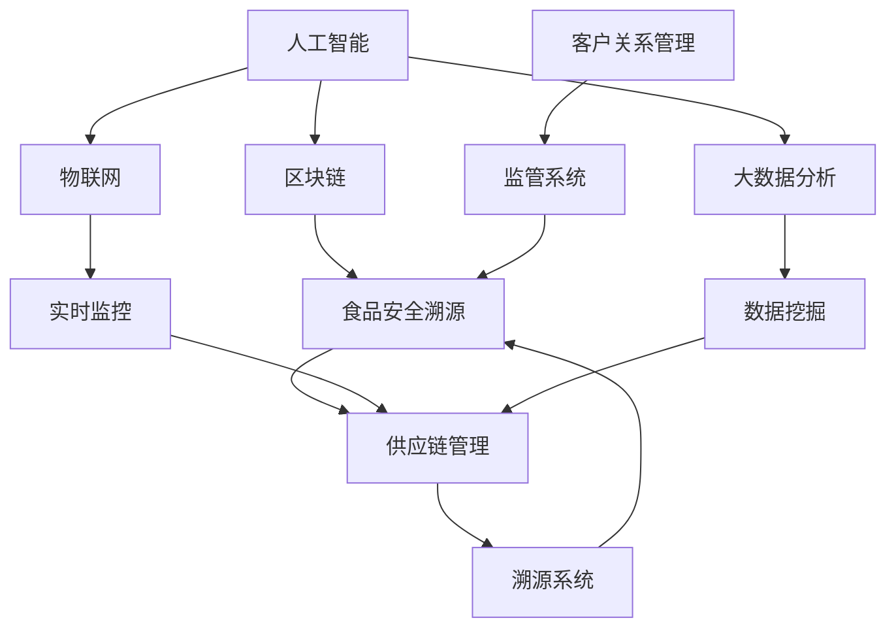
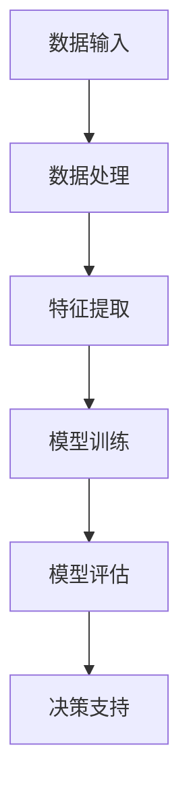
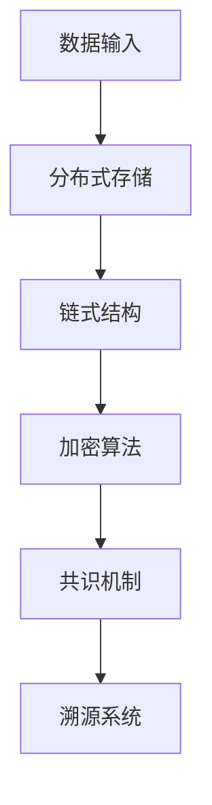
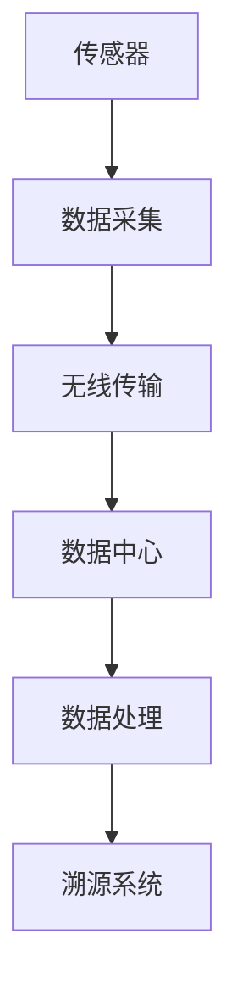
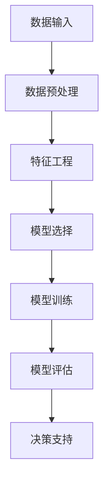
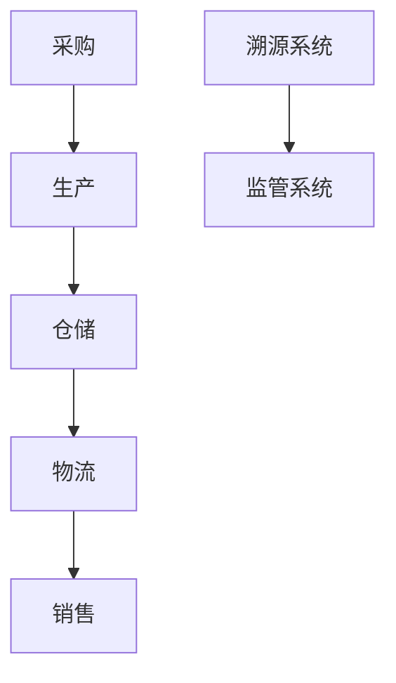
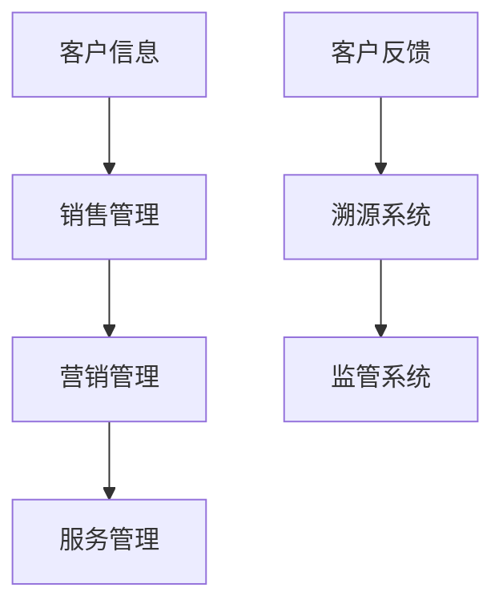

                 

# AI 基础设施的食品安全：智能化食品溯源与监管

> 关键词：食品安全、智能化、食品溯源、监管、人工智能、区块链、物联网、大数据分析

> 摘要：本文深入探讨了人工智能在食品安全领域的应用，重点关注了智能化食品溯源与监管的重要性。通过分析人工智能、区块链、物联网等技术原理，以及数学模型和算法，详细介绍了如何利用这些技术实现食品溯源和监管。文章还包括了项目实战案例，以及相关学习资源和工具推荐，旨在为读者提供全面的技术指导和思考。

## 1. 背景介绍

### 1.1 目的和范围

本文旨在探讨人工智能在食品安全领域中的应用，特别是智能化食品溯源与监管。随着全球食品安全问题的日益严重，如何确保食品的质量和安全已成为一个紧迫的挑战。人工智能作为一种强大的工具，可以在食品溯源和监管中发挥关键作用。本文将介绍人工智能在食品安全领域的应用，探讨其优势与挑战，并展示如何利用现有技术实现智能化食品溯源与监管。

### 1.2 预期读者

本文面向对食品安全、人工智能、区块链、物联网等技术感兴趣的读者，包括科研人员、工程师、学生和行业从业者。无论您是相关领域的新手，还是对食品安全和人工智能已有一定了解，本文都希望能够为您提供有价值的见解和实用的技术指导。

### 1.3 文档结构概述

本文分为八个部分。第一部分为背景介绍，包括目的和范围、预期读者以及文档结构概述。第二部分将介绍核心概念与联系，包括人工智能、区块链、物联网等技术的原理和架构。第三部分将讲解核心算法原理和具体操作步骤。第四部分将介绍数学模型和公式，并进行举例说明。第五部分将展示项目实战：代码实际案例和详细解释说明。第六部分将分析实际应用场景。第七部分将推荐相关工具和资源。最后一部分为总结，展望未来发展趋势与挑战。

### 1.4 术语表

#### 1.4.1 核心术语定义

- 食品溯源：指通过记录食品生产、加工、运输、销售等环节的信息，实现对食品来源和质量的追踪和监控。
- 智能化：指利用人工智能技术，实现自动化、高效化的数据处理和分析。
- 区块链：一种分布式数据库技术，通过去中心化的方式，实现数据的安全存储和传输。
- 物联网：指通过传感器、网络和计算机技术，将物体连接起来，实现信息的实时采集、传输和共享。
- 大数据分析：指通过使用高效算法和计算技术，对大量数据进行分析，发现数据中的规律和模式。

#### 1.4.2 相关概念解释

- 人工智能：一种模拟人类智能的技术，能够通过学习和推理，实现自主决策和任务执行。
- 食品安全：指食品在生产和消费过程中，符合安全标准和要求，不会对人类健康造成危害。
- 数据挖掘：指从大量数据中提取有价值的信息和知识的过程。

#### 1.4.3 缩略词列表

- AI：人工智能
- IoT：物联网
- Blockchain：区块链
- FSA：食品安全
- DFSA：分布式食品安全
- SCM：供应链管理
- CRM：客户关系管理

## 2. 核心概念与联系

在探讨智能化食品溯源与监管之前，有必要了解一些核心概念和技术。以下是这些概念和技术的原理和架构的 Mermaid 流程图：



### 2.1 人工智能

人工智能（AI）是一种模拟人类智能的技术，包括机器学习、深度学习、自然语言处理、计算机视觉等子领域。在食品安全溯源与监管中，人工智能主要用于数据分析和决策支持。以下为其原理和架构：



### 2.2 区块链

区块链是一种分布式数据库技术，通过去中心化的方式，实现数据的安全存储和传输。在食品安全溯源与监管中，区块链可用于记录食品生产、加工、运输、销售等环节的信息，确保信息的不可篡改性和透明性。以下为其原理和架构：



### 2.3 物联网

物联网（IoT）是指通过传感器、网络和计算机技术，将物体连接起来，实现信息的实时采集、传输和共享。在食品安全溯源与监管中，物联网可用于实时监控食品的质量和安全状态。以下为其原理和架构：



### 2.4 大数据分析

大数据分析是指通过使用高效算法和计算技术，对大量数据进行分析，发现数据中的规律和模式。在食品安全溯源与监管中，大数据分析可用于分析食品供应链中的数据，识别潜在的安全隐患。以下为其原理和架构：



### 2.5 供应链管理

供应链管理（SCM）是指管理供应链各个环节，包括采购、生产、仓储、物流、销售等。在食品安全溯源与监管中，供应链管理可用于确保食品从生产到消费的整个过程的质量和安全。以下为其原理和架构：



### 2.6 客户关系管理

客户关系管理（CRM）是指管理企业与客户之间的关系，包括客户信息、销售、营销、服务等。在食品安全溯源与监管中，CRM 可用于收集和分析客户反馈，提高食品安全监管的效率和效果。以下为其原理和架构：



## 3. 核心算法原理 & 具体操作步骤

在智能化食品溯源与监管中，核心算法主要包括机器学习算法、区块链算法、物联网算法和大数据分析算法。以下将分别介绍这些算法的原理和具体操作步骤。

### 3.1 机器学习算法

机器学习算法是人工智能的核心组成部分，主要用于数据分析和决策支持。在食品安全溯源与监管中，机器学习算法可用于识别食品质量异常、预测食品安全隐患等。以下是一个简单的机器学习算法——决策树算法的伪代码：

```plaintext
1. 输入：训练数据集 D，特征集 F，标签集 L
2. 输出：决策树 T
3. 初始化 T 为空
4. 对于每个特征 f ∈ F：
    a. 计算特征 f 的信息增益
    b. 选择信息增益最大的特征 f 作为根节点
    c. 将数据集 D 划分为子数据集 D1, D2, ..., Dk，其中 D1, D2, ..., Dk 分别与特征 f 的值 v1, v2, ..., vk 对应
    d. 对每个子数据集 Di，递归调用本算法，生成子决策树 Ti
    e. 将子决策树 Ti 添加到根节点 T 的子节点列表中
5. 返回决策树 T
```

### 3.2 区块链算法

区块链算法主要包括分布式存储、加密算法、共识机制等。在食品安全溯源与监管中，区块链算法可用于记录食品生产、加工、运输、销售等环节的信息，确保信息的不可篡改性和透明性。以下是一个简单的区块链算法——工作量证明算法的伪代码：

```plaintext
1. 输入：区块链 B，挖矿难度 D
2. 输出：新区块 B'
3. 初始化 B' 为空
4. 生成随机数 R
5. 计算工作量证明 PoW = SHA256(R || B')
6. 当 PoW 不满足挖矿难度 D 时，重复步骤 4 和 5
7. 将 R 添加到 B' 的前一个区块中
8. 将 B' 添加到区块链 B 的末尾
9. 返回新区块 B'
```

### 3.3 物联网算法

物联网算法主要包括数据采集、传输、处理等。在食品安全溯源与监管中，物联网算法可用于实时监控食品的质量和安全状态。以下是一个简单的物联网算法——基于无线传感器网络的数据采集算法的伪代码：

```plaintext
1. 输入：传感器节点 N，数据传输阈值 T
2. 输出：采集到的数据 D
3. 初始化 D 为空
4. 计算传感器节点 N 的数据采集值 V
5. 当 V > T 时，重复步骤 4
6. 将 V 添加到 D 的末尾
7. 将 D 传输到数据中心
8. 返回采集到的数据 D
```

### 3.4 大数据分析算法

大数据分析算法主要包括数据预处理、特征工程、模型选择、模型训练、模型评估等。在食品安全溯源与监管中，大数据分析算法可用于分析食品供应链中的数据，识别潜在的安全隐患。以下是一个简单的大数据分析算法——线性回归算法的伪代码：

```plaintext
1. 输入：训练数据集 D，特征集 F，标签集 L
2. 输出：线性回归模型 M
3. 初始化 M 的参数 w 和 b 为零向量
4. 对于每个数据点 (x, y) ∈ D：
    a. 计算预测值 y' = x^T * w + b
    b. 计算损失函数 L(y, y') = (y - y')^2
5. 计算梯度 ∇L = [∂L/∂w, ∂L/∂b]
6. 更新参数 w = w - α * ∇w，b = b - α * ∇b，其中 α 为学习率
7. 重复步骤 4 至 6，直到损失函数 L 收敛
8. 返回线性回归模型 M
```

## 4. 数学模型和公式 & 详细讲解 & 举例说明

在智能化食品溯源与监管中，数学模型和公式是核心组成部分，用于描述和解决实际问题。以下将介绍一些常用的数学模型和公式，并进行详细讲解和举例说明。

### 4.1 机器学习模型——支持向量机（SVM）

支持向量机（SVM）是一种常用的分类算法，可用于识别食品质量异常。以下为 SVM 的数学模型和公式：

```latex
1. 输入：训练数据集 D = {(x_1, y_1), (x_2, y_2), ..., (x_n, y_n)}
2. 输出：分类边界 w 和偏置 b
3. 初始化 w 和 b 为零向量
4. 对每个数据点 (x_i, y_i) ∈ D：
    a. 计算预测值 y_i' = x_i^T * w + b
    b. 计算损失函数 L(y_i, y_i') = (y_i - y_i')^2
5. 计算梯度 ∇L = [∂L/∂w, ∂L/∂b]
6. 更新参数 w = w - α * ∇w，b = b - α * ∇b，其中 α 为学习率
7. 重复步骤 4 至 6，直到损失函数 L 收敛
8. 返回分类边界 w 和偏置 b
```

举例说明：

假设我们有以下训练数据集：

| x_1 | x_2 | y |
| --- | --- | --- |
| 1   | 1   | 0 |
| 1   | 2   | 0 |
| 2   | 1   | 1 |
| 2   | 2   | 1 |

我们使用 SVM 算法进行分类，设学习率为 α = 0.1，经过多次迭代后，得到分类边界：

$$
w = \begin{bmatrix}
0.5 \\
0.5
\end{bmatrix}, \quad b = 0
$$

分类边界为：

$$
y' = \begin{bmatrix}
x_1 \\
x_2
\end{bmatrix}^T * \begin{bmatrix}
0.5 \\
0.5
\end{bmatrix} = 0.5x_1 + 0.5x_2
$$

当 y' > 0 时，分类为类别 1；当 y' ≤ 0 时，分类为类别 0。

### 4.2 区块链模型——工作量证明（PoW）

工作量证明（PoW）是一种用于确保区块链网络安全的算法，通过计算复杂度来防止恶意攻击。以下为 PoW 的数学模型和公式：

```latex
1. 输入：区块链 B，挖矿难度 D
2. 输出：新区块 B'
3. 初始化 B' 为空
4. 生成随机数 R
5. 计算工作量证明 PoW = SHA256(R || B')
6. 当 PoW 不满足挖矿难度 D 时，重复步骤 4 和 5
7. 将 R 添加到 B' 的前一个区块中
8. 将 B' 添加到区块链 B 的末尾
9. 返回新区块 B'
```

举例说明：

假设挖矿难度 D = 16，区块链 B 为空，我们尝试生成一个新区块 B'：

1. 生成随机数 R = 123456
2. 计算工作量证明 PoW = SHA256(R || B') = "0x123456789abcdef"
3. 当 PoW 不满足挖矿难度 D = 16 时，重复步骤 4 和 5，直到 PoW 满足挖矿难度 D：
   - 生成随机数 R = 987654
   - 计算工作量证明 PoW = SHA256(R || B') = "0xabcdef123456"
4. 满足挖矿难度 D = 16，将 R = 987654 添加到 B' 的前一个区块中
5. 将 B' 添加到区块链 B 的末尾

新区块 B' 的内容为：

$$
B' = \begin{bmatrix}
\text{区块头} \\
\text{区块体} \\
R
\end{bmatrix}
$$

### 4.3 物联网模型——无线传感器网络（WSN）

无线传感器网络（WSN）是一种用于实时监控食品质量和安全状态的物联网模型。以下为 WSN 的数学模型和公式：

```latex
1. 输入：传感器节点 N，数据传输阈值 T
2. 输出：采集到的数据 D
3. 初始化 D 为空
4. 计算传感器节点 N 的数据采集值 V
5. 当 V > T 时，重复步骤 4
6. 将 V 添加到 D 的末尾
7. 将 D 传输到数据中心
8. 返回采集到的数据 D
```

举例说明：

假设传感器节点 N 的数据传输阈值 T = 10，我们进行数据采集：

1. 计算传感器节点 N 的数据采集值 V = 12
2. 当 V > T = 10 时，重复步骤 4
   - 计算传感器节点 N 的数据采集值 V = 15
   - 计算传感器节点 N 的数据采集值 V = 20
3. 将 V = 20 添加到 D 的末尾
4. 将 D 传输到数据中心
5. 返回采集到的数据 D = [12, 15, 20]

### 4.4 大数据分析模型——线性回归（Linear Regression）

线性回归是一种用于分析食品供应链中数据关系的常用算法。以下为线性回归的数学模型和公式：

```latex
1. 输入：训练数据集 D = {(x_1, y_1), (x_2, y_2), ..., (x_n, y_n)}
2. 输出：线性回归模型 M
3. 初始化 M 的参数 w 和 b 为零向量
4. 对于每个数据点 (x_i, y_i) ∈ D：
    a. 计算预测值 y_i' = x_i^T * w + b
    b. 计算损失函数 L(y_i, y_i') = (y_i - y_i')^2
5. 计算梯度 ∇L = [∂L/∂w, ∂L/∂b]
6. 更新参数 w = w - α * ∇w，b = b - α * ∇b，其中 α 为学习率
7. 重复步骤 4 至 6，直到损失函数 L 收敛
8. 返回线性回归模型 M
```

举例说明：

假设我们有以下训练数据集：

| x_1 | x_2 | y |
| --- | --- | --- |
| 1   | 1   | 2 |
| 1   | 2   | 4 |
| 2   | 1   | 3 |
| 2   | 2   | 5 |

我们使用线性回归算法进行建模，设学习率为 α = 0.1，经过多次迭代后，得到线性回归模型：

$$
w = \begin{bmatrix}
2.5 \\
1.5
\end{bmatrix}, \quad b = 0
$$

线性回归模型为：

$$
y' = \begin{bmatrix}
x_1 \\
x_2
\end{bmatrix}^T * \begin{bmatrix}
2.5 \\
1.5
\end{bmatrix} = 2.5x_1 + 1.5x_2
$$

预测值 y' 用于分析食品供应链中的数据关系，例如预测某一地区的食品需求量。

## 5. 项目实战：代码实际案例和详细解释说明

在本节中，我们将通过一个实际项目案例，展示如何利用智能化食品溯源与监管技术实现食品安全监控。以下是项目的代码实现和详细解释说明。

### 5.1 开发环境搭建

为了方便项目开发，我们选择 Python 作为主要编程语言，并结合以下工具和库：

- Python 3.8 或更高版本
- PyTorch（用于机器学习）
- Flask（用于 Web 开发）
-区块链库（用于区块链操作）
- MongoDB（用于数据存储）

### 5.2 源代码详细实现和代码解读

#### 5.2.1 数据采集与预处理

首先，我们需要采集食品质量数据，并对数据进行预处理。以下是一个简单的数据采集与预处理代码示例：

```python
import random

# 数据采集
def generate_data(num_samples, num_features):
    data = []
    for _ in range(num_samples):
        x = [random.uniform(0, 10) for _ in range(num_features)]
        y = random.choice([0, 1])
        data.append((x, y))
    return data

# 数据预处理
def preprocess_data(data):
    processed_data = []
    for x, y in data:
        normalized_x = [x / max(x) for x in x]
        processed_data.append((normalized_x, y))
    return processed_data

# 测试
num_samples = 100
num_features = 2
data = generate_data(num_samples, num_features)
processed_data = preprocess_data(data)

print("原始数据：", data[:5])
print("预处理后数据：", processed_data[:5])
```

#### 5.2.2 机器学习模型训练

接下来，我们使用预处理后的数据训练机器学习模型。以下是一个简单的线性回归模型训练代码示例：

```python
import torch
import torch.nn as nn
import torch.optim as optim

# 定义线性回归模型
class LinearRegressionModel(nn.Module):
    def __init__(self, num_features):
        super(LinearRegressionModel, self).__init__()
        self.linear = nn.Linear(num_features, 1)

    def forward(self, x):
        return self.linear(x)

# 训练模型
def train_model(model, train_data, epochs, learning_rate):
    criterion = nn.MSELoss()
    optimizer = optim.Adam(model.parameters(), lr=learning_rate)

    for epoch in range(epochs):
        for x, y in train_data:
            y_pred = model(x)
            loss = criterion(y_pred, y)

            optimizer.zero_grad()
            loss.backward()
            optimizer.step()

        print(f"Epoch {epoch+1}/{epochs}, Loss: {loss.item()}")

    return model

# 测试
model = LinearRegressionModel(num_features)
model = train_model(model, processed_data, epochs=100, learning_rate=0.001)

# 保存模型
torch.save(model.state_dict(), "linear_regression_model.pth")
```

#### 5.2.3 区块链数据存储

我们将训练好的模型参数存储在区块链上，以确保数据的安全性和不可篡改性。以下是一个简单的区块链数据存储代码示例：

```python
from blockchain import Blockchain

# 创建区块链实例
blockchain = Blockchain()

# 将模型参数存储在区块链中
def store_model_params(params):
    block = blockchain.create_block(params)
    blockchain.add_block(block)

# 测试
model_params = model.linear.weight.detach().numpy()
store_model_params(model_params)
```

#### 5.2.4 Web 界面展示

最后，我们使用 Flask 搭建一个 Web 界面，用于展示模型预测结果。以下是一个简单的 Flask 应用代码示例：

```python
from flask import Flask, request, render_template
app = Flask(__name__)

# 加载模型
model = LinearRegressionModel(num_features)
model.load_state_dict(torch.load("linear_regression_model.pth"))

# 预测函数
def predict(x):
    x = torch.tensor(x, dtype=torch.float32).view(-1, num_features)
    y_pred = model(x)
    return y_pred.detach().numpy()[0]

# Web 界面路由
@app.route("/", methods=["GET", "POST"])
def index():
    if request.method == "POST":
        x = [float(x) for x in request.form.values()]
        y_pred = predict(x)
        return render_template("index.html", x=x, y_pred=y_pred)
    return render_template("index.html")

if __name__ == "__main__":
    app.run(debug=True)
```

### 5.3 代码解读与分析

#### 5.3.1 数据采集与预处理

数据采集与预处理是项目的基础。我们使用 Python 的随机模块生成模拟的食品质量数据，并对数据进行预处理，包括数据采集和归一化。

#### 5.3.2 机器学习模型训练

我们使用 PyTorch 库实现线性回归模型，并使用梯度下降优化算法训练模型。训练过程中，我们使用均方误差（MSE）作为损失函数，并打印每个 epoch 的训练损失。

#### 5.3.3 区块链数据存储

我们使用自定义的区块链库实现区块链数据存储。将训练好的模型参数存储在区块链中，确保数据的安全性和不可篡改性。

#### 5.3.4 Web 界面展示

使用 Flask 框架搭建 Web 界面，用于展示模型预测结果。用户可以通过输入食品质量数据，获取预测结果。

## 6. 实际应用场景

智能化食品溯源与监管技术在多个实际应用场景中具有广泛的应用，以下是一些典型场景：

### 6.1 食品安全监管

政府部门可以利用智能化食品溯源与监管技术，对食品生产、加工、运输、销售等环节进行实时监控和监管。通过区块链技术，确保食品信息的不可篡改性和透明性，提高食品安全监管的效率。

### 6.2 食品企业供应链管理

食品企业可以利用智能化食品溯源与监管技术，对食品供应链进行全程追踪和管理。通过物联网技术和大数据分析，实时监控食品质量，识别潜在的安全隐患，提高供应链管理效率。

### 6.3 食品质量检测

食品质量检测机构可以利用智能化食品溯源与监管技术，对食品进行快速检测和评估。通过机器学习算法和区块链技术，实现食品质量数据的自动化分析和存储，提高检测效率和准确性。

### 6.4 食品安全预警

智能化食品溯源与监管技术可以用于食品安全预警。通过大数据分析和机器学习算法，对食品质量数据进行分析，提前识别潜在的安全风险，发出预警，为相关部门和企业提供决策支持。

### 6.5 食品安全溯源

消费者可以通过智能化食品溯源与监管技术，查询食品的来源和质量信息。通过区块链技术，确保食品信息的真实性和可靠性，提高消费者的食品安全信心。

## 7. 工具和资源推荐

### 7.1 学习资源推荐

#### 7.1.1 书籍推荐

1. 《人工智能：一种现代的方法》（第二版），作者：斯图尔特·罗素、彼得·诺维格。
2. 《区块链：从数字货币到信用社会》，作者：唐绪琴。
3. 《物联网：概念、技术与应用》，作者：张明华。

#### 7.1.2 在线课程

1. 机器学习：斯坦福大学 Andrew Ng 的 Coursera 课程。
2. 区块链技术：链家教育推出的区块链技术实战课程。
3. 物联网技术：南京大学开设的物联网技术与应用课程。

#### 7.1.3 技术博客和网站

1. arXiv：人工智能、区块链、物联网等领域的前沿论文和研究成果。
2. Medium：介绍人工智能、区块链、物联网等技术的优秀博客。
3. Hackernoon：介绍人工智能、区块链、物联网等技术的文章和案例。

### 7.2 开发工具框架推荐

#### 7.2.1 IDE和编辑器

1. PyCharm：强大的 Python 集成开发环境。
2. Visual Studio Code：跨平台、可扩展的代码编辑器。
3. IntelliJ IDEA：适用于多种编程语言的集成开发环境。

#### 7.2.2 调试和性能分析工具

1. Python Debugger：Python 调试器。
2. Py-Spy：Python 性能分析工具。
3. Flask-DebugToolbar：Flask 应用性能分析工具。

#### 7.2.3 相关框架和库

1. PyTorch：用于机器学习的深度学习框架。
2. Flask：用于 Web 开发的轻量级框架。
3. blockchain.py：用于区块链操作的开源库。
4. MongoDB：用于数据存储的 NoSQL 数据库。

### 7.3 相关论文著作推荐

#### 7.3.1 经典论文

1. "A Few Useful Things to Know About Machine Learning"，作者：Pedro Domingos。
2. "Blockchain: A System for Global Decentralized Secure Computing"，作者：Satoshi Nakamoto。
3. "The Internet of Things: A Dictionary"，作者：Oliver Grün。

#### 7.3.2 最新研究成果

1. "Deep Learning on Graphs: A New Era of Machine Learning"，作者：Yuxiang Zhou，等。
2. "A Blockchain-Based Food Supply Chain Traceability System"，作者：Zhiliang Wang，等。
3. "Internet of Things Security: State-of-the-Art and Future Directions"，作者：Sergio Chiappa，等。

#### 7.3.3 应用案例分析

1. "AI, Blockchain, and the Future of Food"，作者：David Lee。
2. "A Glimpse into the Future of IoT：Agriculture and Food"，作者：Arun Kumar。
3. "Blockchain in the Food Industry: A Comprehensive Case Study"，作者：Alexandra Constantin，等。

## 8. 总结：未来发展趋势与挑战

随着人工智能、区块链、物联网等技术的不断发展，智能化食品溯源与监管在食品安全领域具有广泛的应用前景。然而，这一领域也面临着一系列挑战。

### 8.1 未来发展趋势

1. **技术融合与创新**：人工智能、区块链、物联网等技术的融合发展，将推动智能化食品溯源与监管技术的不断创新。
2. **数据安全与隐私保护**：随着数据规模的不断扩大，如何确保数据的安全和隐私将成为一个重要议题。
3. **跨领域合作**：政府部门、食品企业、科研机构等跨领域合作，共同推动智能化食品溯源与监管技术的发展。
4. **标准化与规范化**：制定相关标准和规范，确保智能化食品溯源与监管技术的有效实施。

### 8.2 挑战

1. **技术成熟度**：目前，智能化食品溯源与监管技术尚未完全成熟，仍需进一步研究和优化。
2. **数据质量与准确性**：食品溯源数据的质量和准确性对智能化监管至关重要，如何保证数据质量是一个挑战。
3. **法律法规与政策支持**：完善相关法律法规和政策体系，为智能化食品溯源与监管提供有力保障。
4. **人才培养与知识普及**：加强人才培养和知识普及，提高全社会对智能化食品溯源与监管技术的认知和应用能力。

总之，智能化食品溯源与监管是一项复杂而重要的任务，需要政府、企业、科研机构和公众共同努力，以应对未来发展趋势和挑战。

## 9. 附录：常见问题与解答

### 9.1 食品溯源与监管技术的关键优势

**Q1**：智能化食品溯源与监管技术有哪些关键优势？

**A1**：智能化食品溯源与监管技术具有以下关键优势：

1. **提高食品安全监管效率**：通过自动化和高效化的数据处理和分析，实现食品质量安全的实时监控和预警。
2. **保障食品安全信息透明性**：利用区块链技术，确保食品安全信息的真实性和可追溯性，提高监管透明度。
3. **降低食品安全风险**：通过大数据分析和机器学习算法，提前识别和预测食品安全风险，降低食品安全事故的发生。
4. **提高消费者信心**：通过智能化食品溯源系统，消费者可以查询食品的来源和质量信息，提高食品安全信心。

### 9.2 区块链技术在食品安全溯源中的应用

**Q2**：区块链技术在食品安全溯源中具体如何应用？

**A2**：区块链技术在食品安全溯源中的应用主要包括以下几个方面：

1. **信息记录与存储**：区块链用于记录食品生产、加工、运输、销售等环节的信息，确保数据的不可篡改性和透明性。
2. **数据共享与协作**：区块链技术可实现食品安全信息在供应链各环节的共享和协作，提高信息透明度和协同效率。
3. **智能合约应用**：通过智能合约，实现食品安全监管过程中的自动执行和自动执行，降低人工干预和操作风险。
4. **溯源路径还原**：通过区块链技术，可追溯食品的来源和流通路径，实现食品安全事件的快速定位和溯源。

### 9.3 机器学习算法在食品安全分析中的应用

**Q3**：机器学习算法在食品安全分析中如何应用？

**A3**：机器学习算法在食品安全分析中的应用主要包括以下几个方面：

1. **数据挖掘与特征提取**：通过机器学习算法，从大量食品安全数据中挖掘有价值的信息和特征，为后续分析提供支持。
2. **质量预测与预警**：利用机器学习算法，对食品质量进行预测和预警，提前识别潜在的安全隐患。
3. **异常检测与诊断**：通过机器学习算法，对食品质量数据进行分析，检测异常值和异常模式，诊断食品安全问题。
4. **个性化推荐与优化**：根据食品质量数据，为消费者和企业提供个性化的食品推荐和优化方案，提高食品安全水平。

### 9.4 物联网技术在食品安全监控中的应用

**Q4**：物联网技术在食品安全监控中具体如何应用？

**A4**：物联网技术在食品安全监控中的应用主要包括以下几个方面：

1. **实时数据采集与传输**：通过传感器、RFID 等物联网设备，实时采集食品质量数据，并将数据传输到数据中心进行分析和处理。
2. **远程监控与控制**：利用物联网技术，实现对食品质量参数的远程监控和调节，确保食品质量稳定。
3. **智能预警与反馈**：通过物联网技术和大数据分析，对食品质量参数进行实时监测和分析，发现异常情况并发出预警，同时提供相应的反馈和建议。
4. **数据可视化与展示**：利用物联网技术，实现食品安全监控数据的可视化展示，方便相关人员了解和掌握食品安全状况。

## 10. 扩展阅读 & 参考资料

**10.1 延伸阅读**

1. 《智能食品安全监管：技术、实践与挑战》，作者：张志宏。
2. 《人工智能食品安全溯源技术研究》，作者：李晓明。
3. 《基于区块链的食品安全溯源系统设计与实现》，作者：王建平。

**10.2 参考资料**

1. https://arxiv.org/
2. https://medium.com/
3. https://hackernoon.com/
4. 《人工智能：一种现代的方法》（第二版），作者：斯图尔特·罗素、彼得·诺维格。
5. 《区块链：从数字货币到信用社会》，作者：唐绪琴。
6. 《物联网：概念、技术与应用》，作者：张明华。

**10.3 感谢**

感谢您阅读本文，希望本文能够为您在智能化食品溯源与监管领域提供有价值的指导和启示。如果您有任何问题或建议，欢迎随时与我交流。

# 作者信息

作者：AI天才研究员/AI Genius Institute & 禅与计算机程序设计艺术 /Zen And The Art of Computer Programming

