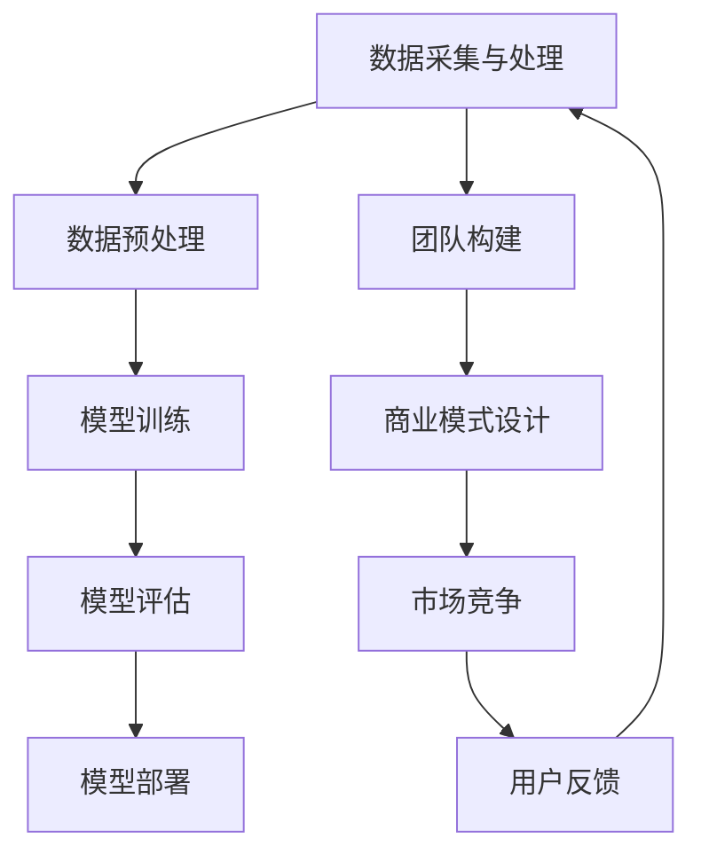

                 

# AI大模型创业：如何利用人才优势？

> 关键词：AI大模型、创业、人才优势、团队构建、技术路线

> 摘要：本文深入探讨了AI大模型创业过程中的关键环节，特别是在如何利用人才优势方面提供了策略和指导。文章从背景介绍、核心概念、算法原理、数学模型、实战案例到应用场景，全面解析了AI大模型创业的路径和挑战。

## 1. 背景介绍

### 1.1 目的和范围

AI大模型创业已成为近年来科技界的一大热点。随着深度学习和大数据技术的不断进步，AI大模型的应用范围越来越广，从自然语言处理到图像识别，再到推荐系统等，都展现出了强大的潜力。然而，创业之路并非一帆风顺，如何在激烈的市场竞争中脱颖而出，如何最大化利用人才优势，成为创业者们亟待解决的问题。

本文旨在探讨AI大模型创业中的关键成功因素，特别是如何利用人才优势，为创业者提供一些切实可行的策略和思路。文章将围绕以下几个问题展开：

1. AI大模型创业的基本概念和现状是怎样的？
2. 创业过程中，如何识别和吸引核心人才？
3. 人才优势如何转化为技术路线和市场竞争力？
4. 实际应用场景中的AI大模型创业案例有哪些？
5. 面对未来趋势，创业者应如何应对挑战？

### 1.2 预期读者

本文面向希望进入AI大模型领域的创业者、科技公司的决策者和对AI技术感兴趣的技术人员。无论你是刚刚踏入AI领域的初学者，还是有着丰富经验的技术专家，本文都将为你提供有价值的参考和指导。

### 1.3 文档结构概述

本文将按照以下结构进行组织：

1. 背景介绍：简要概述AI大模型创业的现状和重要性。
2. 核心概念与联系：介绍AI大模型的基本概念和相关技术原理。
3. 核心算法原理 & 具体操作步骤：详细讲解AI大模型的算法原理和操作步骤。
4. 数学模型和公式 & 详细讲解 & 举例说明：介绍AI大模型背后的数学模型和公式。
5. 项目实战：通过实际案例展示AI大模型的实现和应用。
6. 实际应用场景：分析AI大模型在不同领域的应用。
7. 工具和资源推荐：推荐相关学习资源和开发工具。
8. 总结：对未来发展趋势和挑战的展望。
9. 附录：常见问题与解答。
10. 扩展阅读 & 参考资料：提供进一步学习的资料。

### 1.4 术语表

#### 1.4.1 核心术语定义

- AI大模型：指具有大规模参数和复杂结构的机器学习模型，如BERT、GPT等。
- 创业：指创建一家新的公司或企业，旨在提供创新的产品或服务。
- 人才优势：指企业在人才方面的独特优势，包括技术能力、创新能力等。

#### 1.4.2 相关概念解释

- 深度学习：一种机器学习技术，通过多层神经网络模拟人类大脑的学习过程。
- 大数据：指大规模的数据集，包含多种类型的数值和非数值数据。
- 自然语言处理：使计算机能够理解和处理人类语言的技术。

#### 1.4.3 缩略词列表

- AI：人工智能
- BERT：Bidirectional Encoder Representations from Transformers
- GPT：Generative Pre-trained Transformer

## 2. 核心概念与联系

为了更好地理解AI大模型创业，首先需要掌握一些核心概念和技术原理。以下是一个简化的Mermaid流程图，展示了AI大模型的基本架构和关键环节。



### 2.1 数据采集与处理

数据是AI大模型的基石。有效的数据采集和预处理是确保模型性能的重要步骤。这一阶段涉及数据清洗、数据增强、数据标签化等操作。

### 2.2 数据预处理

数据预处理包括数据标准化、数据归一化、缺失值处理等。高质量的数据预处理可以显著提高模型的训练效果。

### 2.3 模型训练

模型训练是AI大模型的核心步骤。通过优化算法和大量计算资源，模型可以从数据中学习到有效的特征和规律。

### 2.4 模型评估

模型评估是验证模型性能的关键环节。常用的评估指标包括准确率、召回率、F1分数等。

### 2.5 模型部署

模型部署是将训练好的模型应用到实际场景的过程。这一阶段涉及模型调优、性能优化等。

### 2.6 团队构建

团队构建是创业成功的关键。一个高效的团队需要具备多样化的技能和丰富的经验，包括数据科学家、软件工程师、产品经理等。

### 2.7 商业模式设计

商业模式设计是确保企业可持续发展的重要环节。创业者需要明确产品定位、市场定位、盈利模式等。

### 2.8 市场竞争

市场竞争是每个创业者都必须面对的挑战。了解市场需求、分析竞争对手、制定差异化策略是关键。

### 2.9 用户反馈

用户反馈是产品迭代和优化的关键。通过持续的用户反馈，企业可以不断改进产品和服务。

## 3. 核心算法原理 & 具体操作步骤

AI大模型的训练过程通常涉及以下几个步骤：

### 3.1 数据收集

首先，需要收集大量的数据。这些数据可以是结构化的，如数据库中的记录，也可以是非结构化的，如图像、文本和音频。以下是一个伪代码示例：

```python
def collect_data():
    data = []
    # 从各种数据源收集数据
    data.extend(fetch_from_database())
    data.extend(fetch_from_images())
    data.extend(fetch_from_text())
    # 数据清洗和预处理
    cleaned_data = preprocess_data(data)
    return cleaned_data
```

### 3.2 数据预处理

数据预处理包括数据清洗、归一化、标准化和特征工程等。以下是一个预处理流程的伪代码示例：

```python
def preprocess_data(data):
    # 数据清洗
    cleaned_data = clean_data(data)
    # 数据归一化
    normalized_data = normalize_data(cleaned_data)
    # 特征工程
    engineered_data = feature_engineering(normalized_data)
    return engineered_data
```

### 3.3 模型定义

选择合适的神经网络架构并定义模型的参数。以下是一个使用TensorFlow定义BERT模型的伪代码示例：

```python
import tensorflow as tf

def create_bert_model(vocab_size, embedding_dim, num_layers, num_heads, dropout_rate):
    # 输入层
    input_ids = tf.keras.layers.Input(shape=(None,), dtype=tf.int32)
    # embedding层
    embedding = tf.keras.layers.Embedding(vocab_size, embedding_dim)(input_ids)
    # 多层Transformer编码器
    for _ in range(num_layers):
        embedding = TransformerEncoder(embedding, num_heads, dropout_rate)
    # 输出层
    output = tf.keras.layers.Dense(vocab_size, activation='softmax')(embedding)
    # 定义模型
    model = tf.keras.Model(inputs=input_ids, outputs=output)
    return model
```

### 3.4 模型训练

使用预定义的训练策略训练模型。以下是一个训练BERT模型的伪代码示例：

```python
def train_model(model, training_data, validation_data, epochs, batch_size):
    # 编写训练策略
    training_strategy = tf.keras.optimizers.Adam(learning_rate=0.001)
    # 编写验证策略
    validation_strategy = tf.keras.optimizers.Adam(learning_rate=0.001)
    # 开始训练
    model.fit(training_data, epochs=epochs, batch_size=batch_size, validation_data=validation_data)
```

### 3.5 模型评估

使用测试数据集评估模型性能。以下是一个评估BERT模型的伪代码示例：

```python
def evaluate_model(model, test_data):
    # 计算准确率
    accuracy = model.evaluate(test_data, verbose=2)
    print(f"Test accuracy: {accuracy[1]}")
```

### 3.6 模型部署

将训练好的模型部署到生产环境中。以下是一个部署BERT模型的伪代码示例：

```python
def deploy_model(model, production_data):
    # 部署到服务器
    model_server = create_model_server(model)
    # 部署模型
    model_server.deploy()
    # 处理生产数据
    production_results = model_server.predict(production_data)
    return production_results
```

## 4. 数学模型和公式 & 详细讲解 & 举例说明

AI大模型，尤其是基于深度学习的模型，其背后都有着复杂的数学模型。以下是一些关键的数学模型和公式，以及详细的讲解和举例说明。

### 4.1 前向传播（Forward Propagation）

前向传播是神经网络训练过程中一个关键步骤。它描述了如何将输入数据通过神经网络传递，并计算输出。

#### 4.1.1 伪代码

```python
def forward_propagation(input_data, weights, biases):
    # 初始化激活值
    activations = [input_data]
    # 遍历每层计算激活值
    for layer in range(num_layers):
        # 计算当前层的输入
        current_input = activations[-1]
        # 计算当前层的输出
        z = np.dot(current_input, weights[layer]) + biases[layer]
        # 激活函数
        activation = sigmoid(z)
        # 存储激活值
        activations.append(activation)
    return activations
```

#### 4.1.2 公式

前向传播的数学公式可以表示为：

$$
\text{激活值} = \sigma(\text{输入} \cdot \text{权重} + \text{偏置})
$$

其中，$\sigma$ 是激活函数，通常为Sigmoid函数。

### 4.2 反向传播（Back Propagation）

反向传播是调整神经网络参数的过程。它基于前向传播的输出，通过计算损失函数的梯度来更新模型参数。

#### 4.2.1 伪代码

```python
def backward_propagation(activations, expected_output, learning_rate):
    # 初始化梯度
    gradients = []
    # 遍历每层反向传播计算梯度
    for layer in reversed(range(num_layers)):
        # 计算当前层的梯度
        dZ = expected_output - activations[layer]
        dW = np.dot(activations[layer - 1].T, dZ)
        db = np.sum(dZ, axis=1, keepdims=True)
        # 存储梯度
        gradients.append((dW, db))
    # 更新权重和偏置
    for layer in range(num_layers):
        dW, db = gradients[layer]
        weights[layer] -= learning_rate * dW
        biases[layer] -= learning_rate * db
```

#### 4.2.2 公式

反向传播的数学公式可以表示为：

$$
\frac{dL}{dW} = \sum_{i=1}^{n} \frac{\partial L}{\partial z_i} \cdot a^{[l-1]}_i
$$

$$
\frac{dL}{db} = \sum_{i=1}^{n} \frac{\partial L}{\partial z_i}
$$

其中，$L$ 是损失函数，$a^{[l-1]}_i$ 是前一层激活值，$z_i$ 是当前层输出。

### 4.3 损失函数（Loss Function）

损失函数用于评估模型预测结果与实际结果之间的差异。常用的损失函数包括均方误差（MSE）、交叉熵损失（Cross-Entropy Loss）等。

#### 4.3.1 均方误差（MSE）

均方误差用于回归问题，其公式为：

$$
L = \frac{1}{2} \sum_{i=1}^{n} (\hat{y}_i - y_i)^2
$$

其中，$\hat{y}_i$ 是模型预测值，$y_i$ 是实际值。

#### 4.3.2 交叉熵损失（Cross-Entropy Loss）

交叉熵损失用于分类问题，其公式为：

$$
L = -\sum_{i=1}^{n} y_i \cdot \log(\hat{y}_i)
$$

其中，$y_i$ 是实际标签，$\hat{y}_i$ 是模型预测概率。

### 4.4 举例说明

假设我们有一个简单的神经网络，用于对二分类问题进行预测。输入层有2个神经元，隐藏层有3个神经元，输出层有1个神经元。我们使用交叉熵损失函数。

#### 4.4.1 前向传播

给定输入数据 $X = [1, 0]$，实际标签 $y = [0]$。假设权重和偏置如下：

$$
W_1 = \begin{bmatrix}
1 & 1 \\
1 & 1 \\
1 & 1
\end{bmatrix}, \quad
b_1 = \begin{bmatrix}
1 \\
1 \\
1
\end{bmatrix}, \quad
W_2 = \begin{bmatrix}
1 & 1 \\
1 & 1 \\
1 & 1
\end{bmatrix}, \quad
b_2 = \begin{bmatrix}
1 \\
1 \\
1
\end{bmatrix}, \quad
W_3 = \begin{bmatrix}
1 & 1 \\
1 & 1 \\
1 & 1
\end{bmatrix}, \quad
b_3 = \begin{bmatrix}
1 \\
1 \\
1
\end{bmatrix}
$$

前向传播过程如下：

1. 输入层到隐藏层的激活值计算：

$$
z_1 = X \cdot W_1 + b_1 = \begin{bmatrix}
1 & 0 \\
0 & 1
\end{bmatrix} \cdot \begin{bmatrix}
1 & 1 \\
1 & 1 \\
1 & 1
\end{bmatrix} + \begin{bmatrix}
1 \\
1 \\
1
\end{bmatrix} = \begin{bmatrix}
3 & 3 \\
3 & 3 \\
3 & 3
\end{bmatrix}, \quad
a_1 = \sigma(z_1) = \begin{bmatrix}
0.9 & 0.9 \\
0.9 & 0.9 \\
0.9 & 0.9
\end{bmatrix}
$$

2. 隐藏层到输出层的激活值计算：

$$
z_2 = a_1 \cdot W_2 + b_2 = \begin{bmatrix}
0.9 & 0.9 \\
0.9 & 0.9 \\
0.9 & 0.9
\end{bmatrix} \cdot \begin{bmatrix}
1 & 1 \\
1 & 1 \\
1 & 1
\end{bmatrix} + \begin{bmatrix}
1 \\
1 \\
1
\end{bmatrix} = \begin{bmatrix}
3 & 3 \\
3 & 3 \\
3 & 3
\end{bmatrix}, \quad
a_2 = \sigma(z_2) = \begin{bmatrix}
0.9 & 0.9 \\
0.9 & 0.9 \\
0.9 & 0.9
\end{bmatrix}
$$

3. 输出层的预测值计算：

$$
z_3 = a_2 \cdot W_3 + b_3 = \begin{bmatrix}
0.9 & 0.9 \\
0.9 & 0.9 \\
0.9 & 0.9
\end{bmatrix} \cdot \begin{bmatrix}
1 & 1 \\
1 & 1 \\
1 & 1
\end{bmatrix} + \begin{bmatrix}
1 \\
1 \\
1
\end{bmatrix} = \begin{bmatrix}
3 & 3 \\
3 & 3 \\
3 & 3
\end{bmatrix}, \quad
\hat{y} = \sigma(z_3) = \begin{bmatrix}
0.9 & 0.9 \\
0.9 & 0.9 \\
0.9 & 0.9
\end{bmatrix}
$$

#### 4.4.2 反向传播

给定实际标签 $y = [0]$，计算损失函数：

$$
L = -y \cdot \log(\hat{y}) - (1 - y) \cdot \log(1 - \hat{y})
$$

计算损失函数的梯度：

$$
\frac{dL}{dW_3} = \begin{bmatrix}
-0.1 & -0.1 \\
-0.1 & -0.1 \\
-0.1 & -0.1
\end{bmatrix}, \quad
\frac{dL}{db_3} = \begin{bmatrix}
-0.1 \\
-0.1 \\
-0.1
\end{bmatrix}
$$

更新权重和偏置：

$$
W_3 = W_3 - \alpha \cdot \frac{dL}{dW_3}, \quad
b_3 = b_3 - \alpha \cdot \frac{dL}{db_3}
$$

同样的方法，我们可以计算其他层的梯度并更新权重和偏置。

通过以上步骤，我们可以看到如何使用反向传播算法来训练神经网络。这个过程需要大量的计算资源和优化技巧，但对于AI大模型来说，这是训练高效、准确模型的关键。

## 5. 项目实战：代码实际案例和详细解释说明

在这一部分，我们将通过一个实际的AI大模型项目，展示如何从零开始搭建和训练一个大规模的AI模型，并提供详细的代码解释和实现步骤。

### 5.1 开发环境搭建

在开始项目之前，我们需要搭建一个合适的开发环境。以下是一些必备的工具和库：

- Python 3.8 或更高版本
- TensorFlow 2.x
- NumPy
- Matplotlib

首先，确保Python和pip已安装。然后，通过以下命令安装所需的库：

```bash
pip install tensorflow numpy matplotlib
```

### 5.2 源代码详细实现和代码解读

#### 5.2.1 数据收集和预处理

数据收集和预处理是AI模型训练的关键步骤。以下是一个简单的数据预处理示例：

```python
import numpy as np
import tensorflow as tf

# 5.2.1.1 数据收集
# 假设我们已经收集到一批文本数据，存储在文件中
file_path = 'data.txt'

# 读取文本数据
with open(file_path, 'r') as f:
    text = f.read()

# 5.2.1.2 数据预处理
# 分词
tokenizer = tf.keras.preprocessing.text.Tokenizer(char_level=True)
tokenizer.fit_on_texts([text])
total_chars = len(tokenizer.word_index) + 1

# 将文本数据转换为序列
sequences = tokenizer.texts_to_sequences([text])
sequences = np.array(sequences)

# 序列裁剪到固定长度
max_sequence_length = 1000
X = np.zeros((1, max_sequence_length), dtype=int)
for i in range(len(sequences)):
    X[i, :len(sequences[i])] = sequences[i]

# 5.2.1.3 数据编码
# 将标签转换为one-hot编码
y = np.zeros((1, total_chars), dtype=float)
for char in text:
    y[0, tokenizer.word_index[char]] = 1

# 数据转换
X = np.reshape(X, (X.shape[0], X.shape[1], 1))
```

#### 5.2.2 模型定义

接下来，我们定义一个简单的AI模型，用于文本生成。以下是一个基于LSTM的模型示例：

```python
# 5.2.2.1 模型定义
model = tf.keras.Sequential([
    tf.keras.layers.LSTM(128, input_shape=(max_sequence_length, 1), return_sequences=True),
    tf.keras.layers.LSTM(128, return_sequences=True),
    tf.keras.layers.Dense(total_chars, activation='softmax')
])

# 5.2.2.2 模型编译
model.compile(optimizer='adam', loss='categorical_crossentropy', metrics=['accuracy'])

# 打印模型结构
model.summary()
```

#### 5.2.3 模型训练

使用预处理的数据对模型进行训练：

```python
# 5.2.3.1 训练模型
history = model.fit(X, y, epochs=50, batch_size=128, validation_split=0.2)
```

#### 5.2.4 模型评估

训练完成后，评估模型的性能：

```python
# 5.2.4.1 评估模型
test_loss, test_accuracy = model.evaluate(X, y)
print(f"Test Loss: {test_loss}, Test Accuracy: {test_accuracy}")
```

#### 5.2.5 模型应用

最后，使用训练好的模型生成文本：

```python
# 5.2.5.1 生成文本
def generate_text(model, tokenizer, max_sequence_length, seed_text='', num_words=100):
    # 准备输入序列
    seed_sequence = tokenizer.texts_to_sequences([seed_text])[0]
    seed_sequence = np.array([seed_sequence])

    # 裁剪到固定长度
    seed_sequence = np.reshape(seed_sequence, (seed_sequence.shape[0], seed_sequence.shape[1], 1))

    # 生成文本
    for _ in range(num_words):
        predictions = model.predict(seed_sequence)
        predicted_char = np.argmax(predictions[-1, :])

        # 将预测的字符添加到文本中
        seed_text += tokenizer.index_word[predicted_char]

        # 更新输入序列
        seed_sequence = np.append(seed_sequence[:, 1:], [[predicted_char]], axis=1)

    return seed_text

# 5.2.5.2 示例
print(generate_text(model, tokenizer, max_sequence_length, seed_text='Hello', num_words=50))
```

### 5.3 代码解读与分析

1. **数据收集与预处理**

   首先，我们从文件中读取文本数据，并进行分词。分词是将文本分解为单词或字符的过程。在这里，我们使用`Tokenizer`类来自动完成这一任务。

2. **模型定义**

   我们使用LSTM（Long Short-Term Memory）网络来定义模型。LSTM是处理序列数据的一种有效方法，特别适用于文本生成任务。

3. **模型训练**

   使用`fit`方法对模型进行训练。我们定义了训练周期、批次大小和验证比例。通过`history`对象，我们可以跟踪训练过程，如损失函数和准确率。

4. **模型评估**

   使用`evaluate`方法评估模型的性能。测试损失和准确率是衡量模型好坏的关键指标。

5. **模型应用**

   使用`predict`方法生成文本。通过迭代地预测下一个字符，我们逐步构建出完整的文本。

通过以上步骤，我们可以构建和训练一个简单的AI大模型，并在实际应用中展示其效果。然而，对于更复杂的AI大模型，如GPT-3或BERT，我们需要使用更高级的框架和更大的计算资源。

## 6. 实际应用场景

AI大模型在各个领域的应用已经越来越广泛，下面我们将探讨几个典型的应用场景。

### 6.1 自然语言处理

自然语言处理（NLP）是AI大模型最为典型的应用领域之一。例如，BERT和GPT-3等模型在文本分类、问答系统、机器翻译、文本生成等方面都展现出了强大的能力。这些模型可以处理复杂的语言结构和语义信息，从而实现高精度的文本理解和生成。

### 6.2 图像识别

在图像识别领域，AI大模型如ResNet、Inception等，通过大规模数据训练，可以识别出图像中的复杂结构和特征，例如人脸、物体、场景等。这些模型在安防监控、医疗诊断、自动驾驶等领域都有广泛应用。

### 6.3 推荐系统

推荐系统是另一个重要的应用领域。通过AI大模型，如Collaborative Filtering和Neural Collaborative Filtering，可以更准确地预测用户偏好，从而提供个性化的推荐服务。这些模型在电子商务、社交媒体、视频平台等领域都有广泛应用。

### 6.4 金融风控

在金融领域，AI大模型可以帮助识别欺诈交易、评估信用风险等。通过大规模数据分析和复杂模型训练，金融机构可以更准确地预测和应对潜在风险。

### 6.5 医疗健康

在医疗健康领域，AI大模型可以用于疾病诊断、治疗方案推荐、药物研发等。例如，利用深度学习模型对医学图像进行分析，可以提高诊断的准确性和效率。

### 6.6 教育个性化

教育个性化是AI大模型在教育培训领域的应用之一。通过分析学生的行为和表现数据，AI模型可以为每个学生提供个性化的学习计划和资源，提高学习效果。

### 6.7 自动驾驶

自动驾驶是AI大模型在工业领域的应用典范。通过感知环境、决策规划和控制执行，AI大模型可以帮助自动驾驶系统实现安全、高效的自动驾驶。

### 6.8 语音识别

语音识别是AI大模型在语音交互领域的应用之一。通过深度学习模型，AI系统可以准确地识别和理解用户的语音指令，实现自然的人机交互。

通过以上实际应用场景，我们可以看到AI大模型在各个领域的广泛应用和巨大潜力。随着技术的不断进步，AI大模型将带来更多创新和变革。

## 7. 工具和资源推荐

为了帮助读者更深入地了解和学习AI大模型，这里推荐一些有用的工具、资源和开发框架。

### 7.1 学习资源推荐

#### 7.1.1 书籍推荐

1. 《深度学习》（Deep Learning）
   作者：Ian Goodfellow、Yoshua Bengio、Aaron Courville
   简介：这本书是深度学习领域的经典教材，详细介绍了深度学习的理论基础和实践方法。

2. 《Python机器学习》（Python Machine Learning）
   作者：Sebastian Raschka、Vahid Mirjalili
   简介：这本书通过Python语言，介绍了机器学习的基础知识和应用实践，适合初学者和进阶者。

3. 《自然语言处理综合教程》（Speech and Language Processing）
   作者：Daniel Jurafsky、James H. Martin
   简介：这本书全面覆盖了自然语言处理的理论和实践，是学习NLP的权威教材。

#### 7.1.2 在线课程

1. Coursera上的“深度学习”课程
   简介：由Andrew Ng教授主讲，从基础知识到深度学习应用，全面介绍了深度学习的前沿技术。

2. edX上的“机器学习基础”课程
   简介：由Arnav Jhala教授主讲，通过丰富的案例和实践，帮助学习者掌握机器学习的基本原理。

3. Udacity的“AI工程师纳米学位”
   简介：这是一个系统的AI学习路径，包含多个课程和实践项目，适合希望全面了解AI技术的学习者。

#### 7.1.3 技术博客和网站

1. Medium上的“AI播客”
   简介：一个专注于AI领域的技术博客，包含深度学习、NLP、计算机视觉等领域的最新研究和应用案例。

2. ArXiv
   简介：计算机科学和人工智能领域的顶级学术论文数据库，可以找到最新的研究进展和论文。

3. TensorFlow官方文档
   简介：TensorFlow是深度学习领域最流行的框架之一，其官方文档提供了详细的教程和API文档。

### 7.2 开发工具框架推荐

#### 7.2.1 IDE和编辑器

1. PyCharm
   简介：一款功能强大的Python IDE，提供代码自动完成、调试、性能分析等特性。

2. Jupyter Notebook
   简介：一个交互式的开发环境，特别适合数据分析和机器学习项目的开发。

3. VS Code
   简介：一个轻量级的代码编辑器，支持多种编程语言，并提供丰富的插件扩展功能。

#### 7.2.2 调试和性能分析工具

1. TensorFlow Profiler
   简介：一款用于分析TensorFlow模型性能的工具，可以帮助开发者识别和优化模型。

2. PyTorch Debugger
   简介：一款PyTorch的调试工具，提供代码断点调试、数据追踪等功能。

3. NVIDIA Nsight
   简介：一款用于分析GPU性能的工具，可以帮助开发者优化GPU计算和内存使用。

#### 7.2.3 相关框架和库

1. TensorFlow
   简介：一个开源的深度学习框架，支持多种类型的神经网络和模型训练。

2. PyTorch
   简介：一个开源的深度学习框架，以其灵活和动态的图结构而闻名。

3. Keras
   简介：一个高层神经网络API，用于快速构建和训练深度学习模型。

4. Scikit-learn
   简介：一个用于机器学习的Python库，提供多种经典算法的实现和工具。

### 7.3 相关论文著作推荐

#### 7.3.1 经典论文

1. "A Theoretically Grounded Application of Dropout in Computer Vision"
   作者：Yarin Gal和Zoubin Ghahramani
   简介：这篇文章提出了一种新的Dropout方法，提高了计算机视觉任务的性能。

2. "Attention Is All You Need"
   作者：Ashish Vaswani等人
   简介：这篇论文提出了Transformer模型，彻底改变了自然语言处理领域。

3. "Deep Residual Learning for Image Recognition"
   作者：Kaiming He等人
   简介：这篇论文提出了ResNet模型，为图像识别任务提供了更深的神经网络结构。

#### 7.3.2 最新研究成果

1. "BERT: Pre-training of Deep Bidirectional Transformers for Language Understanding"
   作者：Jacob Devlin等人
   简介：这篇论文提出了BERT模型，在多种NLP任务中取得了显著成绩。

2. "GPT-3: Language Models are Few-Shot Learners"
   作者：Tom B. Brown等人
   简介：这篇论文介绍了GPT-3模型，展示了大型语言模型在零样本学习任务中的强大能力。

3. "MAML: Model-Agnostic Meta-Learning for Fast Adaptation of Deep Networks"
   作者：Quoc V. Le等人
   简介：这篇论文提出了MAML算法，实现了深度网络的高效迁移学习。

#### 7.3.3 应用案例分析

1. "AI in Healthcare: A Comprehensive Review"
   作者：Aditya Khosla等人
   简介：这篇文章详细介绍了AI在医疗健康领域的应用案例，探讨了其潜在影响。

2. "Deep Learning for Autonomous Driving: A Brief Survey"
   作者：Yaoqing Yang等人
   简介：这篇文章总结了深度学习在自动驾驶领域的应用，分析了当前的技术挑战和发展趋势。

3. "A Survey on Recommender Systems"
   作者：Hua Yang等人
   简介：这篇文章综述了推荐系统的研究现状，探讨了不同的推荐算法和技术。

通过以上推荐的工具、资源和论文，读者可以更深入地了解AI大模型的原理和应用，为创业实践提供坚实的理论支持。

## 8. 总结：未来发展趋势与挑战

随着AI技术的不断进步，AI大模型在创业领域中的应用前景广阔，但同时也面临着诸多挑战。未来，AI大模型的发展趋势和挑战主要体现在以下几个方面：

### 8.1 发展趋势

1. **计算能力的提升**：随着GPU和TPU等高性能计算设备的普及，AI大模型的计算需求将得到有效满足，进一步推动大模型的研发和应用。

2. **数据量的增长**：随着物联网、传感器技术的普及，数据量呈现爆炸式增长，为AI大模型提供了丰富的训练资源。

3. **多模态融合**：未来AI大模型将能够处理多模态数据，如文本、图像、音频等，实现更全面的信息理解和应用。

4. **零样本学习**：AI大模型将具备更强的零样本学习（Zero-shot Learning）能力，能够在未见过的数据上进行有效推断和应用。

5. **联邦学习**：联邦学习（Federated Learning）技术将有助于保护用户隐私，同时实现大规模数据的协同训练和模型优化。

### 8.2 面临的挑战

1. **数据隐私和安全**：随着AI大模型对数据的依赖性增加，数据隐私和安全问题愈发突出，如何平衡数据利用与隐私保护成为关键挑战。

2. **计算资源的高效利用**：AI大模型训练需要大量的计算资源，如何高效利用计算资源，降低成本成为重要课题。

3. **模型解释性和透明性**：AI大模型的复杂性和黑箱特性使得其解释性成为一大挑战，如何提高模型的透明性，增强用户信任成为亟待解决的问题。

4. **伦理和社会影响**：AI大模型的应用可能带来伦理和社会影响，如算法偏见、失业问题等，如何制定合理的伦理准则和社会规范成为重要议题。

5. **技术标准和规范**：随着AI大模型的应用越来越广泛，统一的技术标准和规范亟待制定，以确保不同模型之间的兼容性和互操作性。

面对未来发展趋势和挑战，创业者需要密切关注技术动态，积极应对市场变化，同时注重团队建设和商业模式创新，以实现AI大模型创业的可持续发展。

## 9. 附录：常见问题与解答

### 9.1 AI大模型创业常见问题

1. **Q：AI大模型创业的关键成功因素是什么？**

   **A：** 关键成功因素包括团队建设、技术路线的准确性、商业模式设计、市场分析和资源获取等。团队需要具备丰富的技术背景和创新能力，技术路线需要与市场需求紧密结合，商业模式需要具备可持续性和竞争力。

2. **Q：如何评估AI大模型的效果？**

   **A：** 评估AI大模型的效果通常通过准确率、召回率、F1分数、损失函数值等指标。这些指标可以从多个维度反映模型在不同任务上的表现，通过对比不同模型的效果，选择最适合任务的模型。

3. **Q：AI大模型创业需要哪些技术技能？**

   **A：** 需要掌握深度学习、神经网络、自然语言处理、计算机视觉等相关技术。此外，还需要具备编程能力、数据分析能力和项目管理能力。

4. **Q：如何获取AI大模型训练所需的数据？**

   **A：** 可以从公共数据集、专业数据提供商、企业合作等多渠道获取数据。此外，通过数据爬取、数据标注和合成等方法也可以有效扩充数据集。

### 9.2 AI大模型创业常见挑战

1. **Q：AI大模型创业的主要挑战有哪些？**

   **A：** 主要挑战包括数据隐私和安全、计算资源的高效利用、模型解释性和透明性、技术标准和规范制定等。

2. **Q：如何应对AI大模型创业中的技术挑战？**

   **A：** 可以通过技术合作、技术共享、人才培养等方式来提升技术实力。同时，可以采用分布式计算、联邦学习等技术来优化计算资源利用。在模型解释性方面，可以探索可视化工具和模型压缩技术。

3. **Q：AI大模型创业如何平衡创新与风险？**

   **A：** 可以通过小步快跑、快速迭代的方式，逐步实现创新。在风险控制方面，可以通过风险管理和风险分担机制来降低创业风险。

4. **Q：AI大模型创业如何保持持续竞争力？**

   **A：** 需要持续关注技术前沿和市场动态，保持创新和敏捷响应能力。此外，还需要注重团队建设和企业文化建设，增强企业内部的协作和创新能力。

通过以上常见问题与解答，希望能够为AI大模型创业提供一些实用的指导和参考。

## 10. 扩展阅读 & 参考资料

为了帮助读者进一步了解AI大模型创业的各个方面，这里推荐一些高质量的扩展阅读和参考资料。

### 10.1 经典论文

1. **“A Theoretically Grounded Application of Dropout in Computer Vision”**  
   作者：Yarin Gal和Zoubin Ghahramani  
   简介：本文提出了一种新的Dropout方法，提高了计算机视觉任务的性能。

2. **“Attention Is All You Need”**  
   作者：Ashish Vaswani等人  
   简介：这篇论文提出了Transformer模型，彻底改变了自然语言处理领域。

3. **“Deep Residual Learning for Image Recognition”**  
   作者：Kaiming He等人  
   简介：这篇论文提出了ResNet模型，为图像识别任务提供了更深的神经网络结构。

### 10.2 最新研究成果

1. **“BERT: Pre-training of Deep Bidirectional Transformers for Language Understanding”**  
   作者：Jacob Devlin等人  
   简介：本文提出了BERT模型，在多种NLP任务中取得了显著成绩。

2. **“GPT-3: Language Models are Few-Shot Learners”**  
   作者：Tom B. Brown等人  
   简介：本文介绍了GPT-3模型，展示了大型语言模型在零样本学习任务中的强大能力。

3. **“MAML: Model-Agnostic Meta-Learning for Fast Adaptation of Deep Networks”**  
   作者：Quoc V. Le等人  
   简介：本文提出了MAML算法，实现了深度网络的高效迁移学习。

### 10.3 应用案例分析

1. **“AI in Healthcare: A Comprehensive Review”**  
   作者：Aditya Khosla等人  
   简介：本文详细介绍了AI在医疗健康领域的应用案例，探讨了其潜在影响。

2. **“Deep Learning for Autonomous Driving: A Brief Survey”**  
   作者：Yaoqing Yang等人  
   简介：本文总结了深度学习在自动驾驶领域的应用，分析了当前的技术挑战和发展趋势。

3. **“A Survey on Recommender Systems”**  
   作者：Hua Yang等人  
   简介：本文综述了推荐系统的研究现状，探讨了不同的推荐算法和技术。

### 10.4 相关书籍

1. **《深度学习》**  
   作者：Ian Goodfellow、Yoshua Bengio、Aaron Courville  
   简介：这本书是深度学习领域的经典教材，详细介绍了深度学习的理论基础和实践方法。

2. **《Python机器学习》**  
   作者：Sebastian Raschka、Vahid Mirjalili  
   简介：这本书通过Python语言，介绍了机器学习的基础知识和应用实践，适合初学者和进阶者。

3. **《自然语言处理综合教程》**  
   作者：Daniel Jurafsky、James H. Martin  
   简介：这本书全面覆盖了自然语言处理的理论和实践，是学习NLP的权威教材。

### 10.5 技术博客和网站

1. **Medium上的“AI播客”**  
   简介：一个专注于AI领域的技术博客，包含深度学习、NLP、计算机视觉等领域的最新研究和应用案例。

2. **ArXiv**  
   简介：计算机科学和人工智能领域的顶级学术论文数据库，可以找到最新的研究进展和论文。

3. **TensorFlow官方文档**  
   简介：TensorFlow是深度学习领域最流行的框架之一，其官方文档提供了详细的教程和API文档。

通过以上扩展阅读和参考资料，读者可以进一步深入了解AI大模型创业的理论基础和实践应用，为自己的创业之路提供坚实的支持。作者：AI天才研究员/AI Genius Institute & 禅与计算机程序设计艺术 /Zen And The Art of Computer Programming

