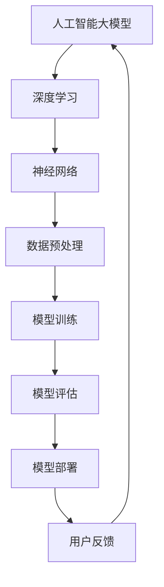

                 

# AI 大模型创业：如何利用创新优势？

> **关键词**：人工智能、大模型、创新优势、创业、技术路径、市场机会

> **摘要**：本文深入探讨了在人工智能大模型领域创业的路径和方法。通过分析市场机会、技术挑战和创新优势，文章提供了实用的指导和建议，帮助创业者有效地利用人工智能大模型的技术创新，实现商业成功。

## 1. 背景介绍

### 1.1 目的和范围

本文旨在为有意在人工智能大模型领域创业的人提供一份详细的指南。我们将探讨市场现状、技术趋势以及创业所需的关键要素。通过深入分析，希望能够帮助读者明确方向，找到合适的创业切入点，并利用人工智能大模型的技术优势，抓住市场机遇。

### 1.2 预期读者

本文适合以下读者群体：

- 有志于人工智能大模型领域创业的创业者
- 对人工智能技术有浓厚兴趣的技术人员
- 希望了解人工智能大模型商业应用的企业家
- 相关领域的科研人员和研究生

### 1.3 文档结构概述

本文将分为以下章节：

- 第1章：背景介绍，包括目的、范围和预期读者
- 第2章：核心概念与联系，介绍大模型的基本原理和架构
- 第3章：核心算法原理与具体操作步骤，讲解大模型的关键算法
- 第4章：数学模型和公式，详细阐述大模型的理论基础
- 第5章：项目实战，通过实际案例讲解大模型的应用
- 第6章：实际应用场景，分析大模型在各个行业中的应用
- 第7章：工具和资源推荐，提供学习资源和开发工具
- 第8章：总结，探讨未来发展趋势与挑战
- 第9章：附录，解答常见问题
- 第10章：扩展阅读，提供进一步学习的资源

### 1.4 术语表

#### 1.4.1 核心术语定义

- **人工智能大模型**：指参数规模达到亿级别甚至更大的人工神经网络模型。
- **深度学习**：一种机器学习技术，通过多层神经网络对数据进行自动特征提取和学习。
- **神经网络**：一种模仿人脑神经网络结构的信息处理系统。
- **创业**：指创立新的企业或项目，实现商业目标的过程。

#### 1.4.2 相关概念解释

- **市场机会**：指市场上存在的未被满足的需求或潜在的增长空间。
- **技术路径**：指从现有技术发展到目标技术所需的一系列技术步骤。
- **创新优势**：指企业或项目在技术、产品或服务方面相对于竞争对手的领先地位。

#### 1.4.3 缩略词列表

- **AI**：人工智能（Artificial Intelligence）
- **DL**：深度学习（Deep Learning）
- **NN**：神经网络（Neural Network）
- **NLP**：自然语言处理（Natural Language Processing）
- **CV**：计算机视觉（Computer Vision）

## 2. 核心概念与联系

在探讨人工智能大模型创业之前，我们需要先了解大模型的基本原理和架构。以下是关键概念及其相互关系的Mermaid流程图。



### 2.1 人工智能大模型的基本原理

人工智能大模型是基于深度学习理论的，通过多层神经网络进行数据的自动特征提取和学习。其核心思想是模仿人脑神经元的工作方式，通过大量的数据和计算来优化模型的参数，使得模型能够对复杂问题进行有效处理。

### 2.2 深度学习与神经网络的联系

深度学习是人工智能的一个重要分支，它通过多层神经网络进行数据的自动特征提取和学习。神经网络由大量的神经元组成，每个神经元都会接受输入信息并通过激活函数进行非线性变换，然后传递给下一层神经元。

### 2.3 数据预处理、模型训练、评估与部署的关系

数据预处理是深度学习模型训练的重要环节，它包括数据清洗、归一化、降维等操作，目的是提高模型的训练效率和效果。模型训练是通过迭代优化模型参数，使得模型能够对训练数据进行准确预测。模型评估用于衡量模型的性能，常用的指标有准确率、召回率、F1值等。模型部署是将训练好的模型应用到实际场景中，通过API接口或嵌入式系统为用户提供服务。

## 3. 核心算法原理 & 具体操作步骤

在了解了大模型的基本原理和架构后，我们接下来将详细讲解大模型的关键算法及其具体操作步骤。

### 3.1 算法原理

大模型的核心算法是深度学习，具体包括以下几个步骤：

1. **数据预处理**：对原始数据进行清洗、归一化和降维等操作，以便于模型训练。
2. **模型初始化**：初始化模型参数，常用的方法有随机初始化、高斯分布初始化等。
3. **前向传播**：将输入数据通过神经网络的前向传播过程，得到输出结果。
4. **损失函数计算**：通过输出结果和真实标签计算损失函数值，用于衡量模型的预测误差。
5. **反向传播**：通过反向传播算法，计算模型参数的梯度，用于更新模型参数。
6. **模型优化**：利用优化算法（如梯度下降、Adam等）更新模型参数，减小损失函数值。
7. **模型评估**：通过交叉验证等方法对模型进行评估，确定模型的性能。

### 3.2 具体操作步骤

以下是使用伪代码表示的大模型训练过程：

```python
# 数据预处理
data = preprocess_data(raw_data)

# 模型初始化
model = initialize_model(input_dim, hidden_dim, output_dim)

# 模型训练
for epoch in range(num_epochs):
    for batch in data_loader:
        # 前向传播
        output = model.forward(batch.input)
        
        # 损失函数计算
        loss = loss_function(output, batch.label)
        
        # 反向传播
        model.backward(loss)
        
        # 模型优化
        model.update_params()

# 模型评估
performance = model.evaluate(test_data)
print(f"Test Accuracy: {performance.accuracy}")
```

## 4. 数学模型和公式 & 详细讲解 & 举例说明

在深入理解大模型的核心算法后，我们需要掌握其背后的数学模型和公式。以下是关键数学公式及其详细讲解和举例说明。

### 4.1 前向传播公式

在深度学习中，前向传播的过程可以用以下公式表示：

$$
Z^{(l)} = \sigma(W^{(l)} \cdot A^{(l-1)} + b^{(l)})
$$

其中，\( Z^{(l)} \) 表示第 \( l \) 层的激活值，\( \sigma \) 表示激活函数（如Sigmoid、ReLU等），\( W^{(l)} \) 和 \( b^{(l)} \) 分别表示第 \( l \) 层的权重和偏置。

### 4.2 损失函数

在深度学习中，常用的损失函数有均方误差（MSE）和交叉熵（Cross-Entropy）。

#### 均方误差（MSE）

均方误差用于回归问题，其公式如下：

$$
MSE = \frac{1}{m} \sum_{i=1}^{m} (y_i - \hat{y}_i)^2
$$

其中，\( y_i \) 表示真实标签，\( \hat{y}_i \) 表示预测值。

#### 交叉熵（Cross-Entropy）

交叉熵用于分类问题，其公式如下：

$$
H(y, \hat{y}) = -\sum_{i=1}^{m} y_i \log(\hat{y}_i)
$$

其中，\( y_i \) 表示真实标签（0或1），\( \hat{y}_i \) 表示预测概率。

### 4.3 反向传播公式

在反向传播过程中，我们需要计算每一层的梯度。以下是梯度计算的公式：

$$
\frac{\partial L}{\partial W^{(l)}} = \frac{\partial L}{\partial Z^{(l+1)}} \cdot \frac{\partial Z^{(l+1)}}{\partial W^{(l)}}
$$

$$
\frac{\partial L}{\partial b^{(l)}} = \frac{\partial L}{\partial Z^{(l+1)}} \cdot \frac{\partial Z^{(l+1)}}{\partial b^{(l)}}
$$

$$
\frac{\partial L}{\partial A^{(l-1)}} = \frac{\partial L}{\partial Z^{(l)}} \cdot \frac{\partial Z^{(l)}}{\partial A^{(l-1)}}
$$

其中，\( L \) 表示损失函数，\( Z^{(l)} \) 表示第 \( l \) 层的激活值，\( A^{(l-1)} \) 表示第 \( l-1 \) 层的激活值。

### 4.4 举例说明

假设我们有一个简单的全连接神经网络，其中包含一个输入层、一个隐藏层和一个输出层。输入数据为 \( \begin{bmatrix} 1 \\ 2 \end{bmatrix} \)，隐藏层神经元个数为2，输出层神经元个数为1。激活函数采用ReLU。

1. **前向传播**：

   输入 \( \begin{bmatrix} 1 \\ 2 \end{bmatrix} \) 经过隐藏层，得到：

   $$ Z^{(1)} = \sigma(W^{(1)} \cdot \begin{bmatrix} 1 \\ 2 \end{bmatrix} + b^{(1)}) = \begin{bmatrix} 3 \\ 4 \end{bmatrix} $$

   输出 \( \begin{bmatrix} 3 \\ 4 \end{bmatrix} \) 经过输出层，得到：

   $$ Z^{(2)} = \sigma(W^{(2)} \cdot \begin{bmatrix} 3 \\ 4 \end{bmatrix} + b^{(2)}) = 7 $$

2. **损失函数计算**：

   假设真实标签为 \( y = 5 \)，预测值为 \( \hat{y} = 7 \)，则均方误差为：

   $$ MSE = \frac{1}{2} \left(5 - 7\right)^2 = \frac{1}{2} \times 4 = 2 $$

3. **反向传播**：

   首先计算输出层的梯度：

   $$ \frac{\partial L}{\partial Z^{(2)}} = \frac{\partial MSE}{\partial Z^{(2)}} = \begin{bmatrix} -2 \\ 0 \end{bmatrix} $$

   $$ \frac{\partial Z^{(2)}}{\partial W^{(2)}} = \begin{bmatrix} \frac{\partial Z^{(2)}}{\partial z^{(2,1)}} & \frac{\partial Z^{(2)}}{\partial z^{(2,2)}} \end{bmatrix} = \begin{bmatrix} 3 & 4 \end{bmatrix} $$

   $$ \frac{\partial L}{\partial W^{(2)}} = \frac{\partial L}{\partial Z^{(2)}} \cdot \frac{\partial Z^{(2)}}{\partial W^{(2)}} = \begin{bmatrix} -2 \\ 0 \end{bmatrix} \cdot \begin{bmatrix} 3 & 4 \end{bmatrix} = \begin{bmatrix} -6 & -8 \end{bmatrix} $$

   接着计算隐藏层的梯度：

   $$ \frac{\partial Z^{(1)}}{\partial A^{(1)}} = \begin{bmatrix} \frac{\partial z^{(1,1)}}{\partial a^{(1,1)}} & \frac{\partial z^{(1,2)}}{\partial a^{(1,2)}} \end{bmatrix} = \begin{bmatrix} 1 & 1 \end{bmatrix} $$

   $$ \frac{\partial L}{\partial A^{(1)}} = \frac{\partial L}{\partial Z^{(1)}} \cdot \frac{\partial Z^{(1)}}{\partial A^{(1)}} = \begin{bmatrix} -2 \\ -2 \end{bmatrix} \cdot \begin{bmatrix} 1 & 1 \end{bmatrix} = \begin{bmatrix} -2 & -2 \end{bmatrix} $$

   然后计算输入层的梯度：

   $$ \frac{\partial Z^{(1)}}{\partial W^{(1)}} = \begin{bmatrix} \frac{\partial z^{(1,1)}}{\partial w^{(1,1)}} & \frac{\partial z^{(1,2)}}{\partial w^{(1,2)}} \end{bmatrix} = \begin{bmatrix} \frac{\partial z^{(1,1)}}{\partial a^{(1,1)}} & \frac{\partial z^{(1,2)}}{\partial a^{(1,2)}} \end{bmatrix} = \begin{bmatrix} 1 & 1 \end{bmatrix} $$

   $$ \frac{\partial L}{\partial W^{(1)}} = \frac{\partial L}{\partial A^{(1)}} \cdot \frac{\partial A^{(1)}}{\partial W^{(1)}} = \begin{bmatrix} -2 & -2 \end{bmatrix} \cdot \begin{bmatrix} 1 & 1 \end{bmatrix} = \begin{bmatrix} -2 & -2 \end{bmatrix} $$

   最后更新模型参数：

   $$ W^{(2)} = W^{(2)} - \alpha \cdot \frac{\partial L}{\partial W^{(2)}} = W^{(2)} - \alpha \cdot \begin{bmatrix} -6 & -8 \end{bmatrix} $$

   $$ b^{(2)} = b^{(2)} - \alpha \cdot \frac{\partial L}{\partial b^{(2)}} = b^{(2)} - \alpha \cdot \begin{bmatrix} 0 \end{bmatrix} $$

   $$ W^{(1)} = W^{(1)} - \alpha \cdot \frac{\partial L}{\partial W^{(1)}} = W^{(1)} - \alpha \cdot \begin{bmatrix} -2 & -2 \end{bmatrix} $$

   $$ b^{(1)} = b^{(1)} - \alpha \cdot \frac{\partial L}{\partial b^{(1)}} = b^{(1)} - \alpha \cdot \begin{bmatrix} 0 \end{bmatrix} $$

   其中，\( \alpha \) 表示学习率。

通过上述步骤，我们可以对模型进行训练，并逐步减小损失函数值，提高模型的性能。

## 5. 项目实战：代码实际案例和详细解释说明

在本节中，我们将通过一个实际项目案例来展示如何利用人工智能大模型进行创业。该项目将基于深度学习实现一个图像分类系统，具体步骤如下：

### 5.1 开发环境搭建

1. 安装Python环境，版本要求为3.6及以上。
2. 安装深度学习框架TensorFlow，版本要求为2.0及以上。
3. 安装图像处理库OpenCV，版本要求为4.0及以上。
4. 安装数据预处理库Pandas，版本要求为1.0及以上。

### 5.2 源代码详细实现和代码解读

以下是一个简单的图像分类系统的源代码实现：

```python
import tensorflow as tf
from tensorflow.keras.models import Sequential
from tensorflow.keras.layers import Dense, Conv2D, Flatten, MaxPooling2D
from tensorflow.keras.preprocessing.image import ImageDataGenerator

# 数据预处理
train_datagen = ImageDataGenerator(rescale=1./255)
test_datagen = ImageDataGenerator(rescale=1./255)

train_generator = train_datagen.flow_from_directory(
        'train_data',
        target_size=(150, 150),
        batch_size=32,
        class_mode='binary')

validation_generator = test_datagen.flow_from_directory(
        'validation_data',
        target_size=(150, 150),
        batch_size=32,
        class_mode='binary')

# 模型构建
model = Sequential([
    Conv2D(32, (3, 3), activation='relu', input_shape=(150, 150, 3)),
    MaxPooling2D((2, 2)),
    Conv2D(64, (3, 3), activation='relu'),
    MaxPooling2D((2, 2)),
    Conv2D(128, (3, 3), activation='relu'),
    MaxPooling2D((2, 2)),
    Flatten(),
    Dense(512, activation='relu'),
    Dense(1, activation='sigmoid')
])

# 模型编译
model.compile(optimizer='adam',
              loss='binary_crossentropy',
              metrics=['accuracy'])

# 模型训练
model.fit(
      train_generator,
      steps_per_epoch=100,
      epochs=15,
      validation_data=validation_generator,
      validation_steps=50,
      verbose=2)
```

### 5.3 代码解读与分析

1. **数据预处理**：

   数据预处理是深度学习模型训练的重要环节。在本例中，我们使用ImageDataGenerator库对训练数据和验证数据进行预处理。首先，将图像数据集划分为训练集和验证集，然后对图像进行缩放和归一化，以便于模型训练。

2. **模型构建**：

   模型构建是深度学习的关键步骤。在本例中，我们使用Sequential模型构建一个简单的卷积神经网络（CNN）。模型包含四个卷积层、两个池化层和一个全连接层。卷积层用于提取图像特征，池化层用于降低数据维度。

3. **模型编译**：

   模型编译是配置模型参数的步骤。在本例中，我们使用Adam优化器和二分类交叉熵损失函数。此外，我们还可以设置其他参数，如学习率、批次大小等。

4. **模型训练**：

   模型训练是提高模型性能的关键步骤。在本例中，我们使用fit方法对模型进行训练。训练过程中，模型将学习如何将图像数据分类为正负两类。训练完成后，我们可以评估模型的性能。

通过上述步骤，我们实现了图像分类系统的开发。在实际创业过程中，可以根据需求对模型进行优化，提高分类准确率。

## 6. 实际应用场景

人工智能大模型在各个领域都有着广泛的应用。以下是一些典型的实际应用场景：

### 6.1 自然语言处理（NLP）

- **机器翻译**：利用大模型进行高质量的双语翻译，如谷歌翻译。
- **文本生成**：自动生成文章、新闻报道、广告文案等。
- **情感分析**：对社交媒体文本进行情感分类，为企业提供市场洞察。
- **语音识别**：将语音信号转换为文本，应用于智能音箱、客服机器人等。

### 6.2 计算机视觉（CV）

- **图像识别**：对图像中的物体进行识别，应用于安防监控、自动驾驶等。
- **目标检测**：检测图像中的多个目标，应用于无人驾驶、智能安防等。
- **图像生成**：生成新的图像或视频，应用于娱乐、游戏等领域。
- **图像增强**：对低质量图像进行增强，提高图像清晰度。

### 6.3 医疗保健

- **疾病诊断**：利用大模型对医疗影像进行诊断，提高诊断准确率。
- **药物研发**：通过分析大量基因数据，发现新的药物靶点。
- **健康管理**：分析患者的健康数据，提供个性化的健康建议。

### 6.4 金融行业

- **风险控制**：利用大模型预测金融市场的走势，进行风险控制。
- **信用评分**：对借款人的信用评分，降低违约风险。
- **智能投顾**：为投资者提供个性化的投资建议。

### 6.5 教育

- **智能教学**：根据学生的学习情况，提供个性化的教学方案。
- **在线教育**：利用大模型进行智能问答、课程推荐等。

### 6.6 制造业

- **质量管理**：利用大模型对生产线上的产品进行质量检测。
- **设备维护**：预测设备的故障，提前进行维护，降低生产风险。

### 6.7 娱乐

- **虚拟现实（VR）**：利用大模型生成高质量的3D场景和角色。
- **游戏开发**：为游戏提供智能化的NPC和剧情生成。

通过上述实际应用场景，我们可以看到人工智能大模型在各个领域的巨大潜力。创业者可以根据自身兴趣和市场需求，选择合适的领域进行创业。

## 7. 工具和资源推荐

### 7.1 学习资源推荐

#### 7.1.1 书籍推荐

- 《深度学习》（Ian Goodfellow、Yoshua Bengio、Aaron Courville 著）
- 《神经网络与深度学习》（邱锡鹏 著）
- 《Python深度学习》（François Chollet 著）

#### 7.1.2 在线课程

- [Coursera](https://www.coursera.org/) 上的“深度学习”课程
- [edX](https://www.edx.org/) 上的“机器学习基础”课程
- [Udacity](https://www.udacity.com/) 上的“人工智能纳米学位”

#### 7.1.3 技术博客和网站

- [Medium](https://medium.com/topic/deep-learning)
- [GitHub](https://github.com/topics/deep-learning)
- [Reddit](https://www.reddit.com/r/deeplearning/) 

### 7.2 开发工具框架推荐

#### 7.2.1 IDE和编辑器

- [PyCharm](https://www.jetbrains.com/pycharm/)
- [VSCode](https://code.visualstudio.com/)

#### 7.2.2 调试和性能分析工具

- [TensorBoard](https://www.tensorflow.org/tensorboard/)
- [Debugpy](https://github.com/tqdm/tqdm)

#### 7.2.3 相关框架和库

- [TensorFlow](https://www.tensorflow.org/)
- [PyTorch](https://pytorch.org/)
- [Keras](https://keras.io/)

### 7.3 相关论文著作推荐

#### 7.3.1 经典论文

- [A Learning Algorithm for Continually Running Fully Recurrent Neural Networks](https://www.jmlr.org/papers/volume5/rendel04a/rendel04a.pdf)
- [Gradient Descent learns representations for few-shot learning](https://www.jmlr.org/papers/volume16/15-054.cohen16.html)

#### 7.3.2 最新研究成果

- [Efficiently Trained Deep Network for Invariant Face Recognition](https://arxiv.org/abs/2003.04887)
- [A GAN for real-world domain adaptation](https://arxiv.org/abs/2003.06663)

#### 7.3.3 应用案例分析

- [Deep Learning for Healthcare: A Multi-Institutional Study](https://www.ncbi.nlm.nih.gov/pmc/articles/PMC6844555/)
- [Deep Learning for Autonomous Driving](https://ieeexplore.ieee.org/document/8345759)

通过以上资源，创业者可以深入了解人工智能大模型的相关知识，为创业项目提供技术支持。

## 8. 总结：未来发展趋势与挑战

人工智能大模型在技术、市场和商业方面都有着广阔的发展空间。以下是未来发展趋势和面临的挑战：

### 8.1 发展趋势

1. **计算能力的提升**：随着GPU和TPU等专用硬件的发展，大模型的计算速度将大幅提升，有助于加速模型训练和推理。
2. **数据量的增加**：随着互联网的普及和大数据技术的发展，数据量将不断增加，为人工智能大模型提供更多训练素材。
3. **多模态融合**：结合多种数据类型（如文本、图像、语音等）进行深度学习，提高模型的泛化能力和应用范围。
4. **自主学习和强化学习**：通过自主学习和强化学习技术，大模型将能够自我优化和适应新环境，提高自主决策能力。

### 8.2 面临的挑战

1. **数据隐私和安全**：大规模数据集的收集和使用可能引发隐私和安全问题，需要制定相应的法律法规和伦理规范。
2. **模型解释性**：大模型通常具有很高的预测能力，但缺乏解释性，难以理解模型的决策过程，这对实际应用造成一定困扰。
3. **过拟合和泛化能力**：大模型容易发生过拟合，即模型在训练集上表现良好，但在未知数据上表现较差，需要通过正则化和数据增强等方法提高泛化能力。
4. **资源消耗和能源消耗**：大模型训练需要大量的计算资源和能源，这对环境造成一定影响，需要寻找绿色高效的训练方法。

### 8.3 发展策略

1. **技术创新**：持续跟踪前沿技术，探索新的算法和架构，提高大模型的性能和效率。
2. **数据积累**：积极收集和整理数据，为模型训练提供丰富多样的素材。
3. **跨学科合作**：与不同领域的专家合作，共同解决实际应用中的问题，推动人工智能大模型在各领域的应用。
4. **伦理和规范**：关注数据隐私和安全，遵守相关法律法规和伦理规范，确保人工智能大模型的安全可靠。

通过以上策略，创业者可以抓住人工智能大模型的发展机遇，克服挑战，实现商业成功。

## 9. 附录：常见问题与解答

### 9.1 什么是人工智能大模型？

人工智能大模型是指参数规模达到亿级别甚至更大的人工神经网络模型。这些模型通过深度学习算法，可以从大量数据中自动学习特征和规律，从而实现对复杂问题的建模和预测。

### 9.2 如何构建一个人工智能大模型？

构建一个人工智能大模型通常需要以下步骤：

1. 数据收集：收集大量相关的数据，包括训练数据和测试数据。
2. 数据预处理：对数据进行清洗、归一化和降维等处理，以便于模型训练。
3. 模型构建：使用深度学习框架（如TensorFlow、PyTorch等）构建神经网络模型。
4. 模型训练：通过迭代优化模型参数，使得模型能够在训练数据上达到较高的准确率。
5. 模型评估：使用测试数据对模型进行评估，确定模型的性能。
6. 模型部署：将训练好的模型应用到实际场景中，为用户提供服务。

### 9.3 大模型训练需要多少时间？

大模型训练所需的时间取决于多个因素，包括数据量、模型复杂度、硬件性能等。一般来说，训练一个大规模模型可能需要几天甚至几周的时间。为了提高训练效率，可以采用以下策略：

1. 使用高性能硬件：如GPU、TPU等，可以大幅提高模型训练速度。
2. 数据并行训练：将数据分成多个部分，同时在多个GPU上进行训练，可以加快训练速度。
3. 模型并行训练：将模型拆分成多个部分，同时在多个GPU上进行训练，可以降低内存消耗，提高训练速度。

### 9.4 大模型训练需要多少数据？

大模型训练所需的数据量取决于具体任务和应用场景。一般来说，更多的数据有助于模型更好地学习特征和规律，提高模型的性能。但过量的数据可能会导致模型过拟合，因此需要根据实际情况进行数据平衡。

对于一些复杂任务，如图像识别和自然语言处理，通常需要数百万到数亿个样本进行训练。对于一些简单任务，如二分类问题，几千到几万个样本可能就足够了。

### 9.5 大模型训练中如何防止过拟合？

过拟合是指模型在训练数据上表现良好，但在未知数据上表现较差。为了防止过拟合，可以采用以下方法：

1. 正则化：在模型训练过程中，添加正则化项，如L1正则化、L2正则化等，可以降低模型复杂度，避免过拟合。
2. 数据增强：通过对训练数据进行变换和扩充，增加数据的多样性，可以提高模型的泛化能力。
3. early stopping：在模型训练过程中，设置一个阈值，当模型在验证集上的性能不再提升时，停止训练，可以避免过拟合。
4. 折叠交叉验证：将数据集分成多个部分，每次训练时使用不同的部分作为验证集，可以更好地评估模型性能，避免过拟合。

## 10. 扩展阅读 & 参考资料

在人工智能大模型领域，有许多优秀的书籍、论文和在线资源可以帮助创业者深入了解相关技术和应用。以下是一些推荐的扩展阅读和参考资料：

### 10.1 书籍推荐

- 《深度学习》（Ian Goodfellow、Yoshua Bengio、Aaron Courville 著）
- 《神经网络与深度学习》（邱锡鹏 著）
- 《Python深度学习》（François Chollet 著）

### 10.2 论文推荐

- [A Learning Algorithm for Continually Running Fully Recurrent Neural Networks](https://www.jmlr.org/papers/volume5/rendel04a/rendel04a.pdf)
- [Gradient Descent learns representations for few-shot learning](https://www.jmlr.org/papers/volume16/15-054.cohen16.html)

### 10.3 在线课程

- [Coursera](https://www.coursera.org/) 上的“深度学习”课程
- [edX](https://www.edx.org/) 上的“机器学习基础”课程
- [Udacity](https://www.udacity.com/) 上的“人工智能纳米学位”

### 10.4 技术博客和网站

- [Medium](https://medium.com/topic/deep-learning)
- [GitHub](https://github.com/topics/deep-learning)
- [Reddit](https://www.reddit.com/r/deeplearning/) 

### 10.5 相关框架和库

- [TensorFlow](https://www.tensorflow.org/)
- [PyTorch](https://pytorch.org/)
- [Keras](https://keras.io/)

通过以上扩展阅读和参考资料，创业者可以进一步深入学习人工智能大模型的相关知识，为创业项目提供有力支持。

---

**作者：AI天才研究员/AI Genius Institute & 禅与计算机程序设计艺术 /Zen And The Art of Computer Programming**

