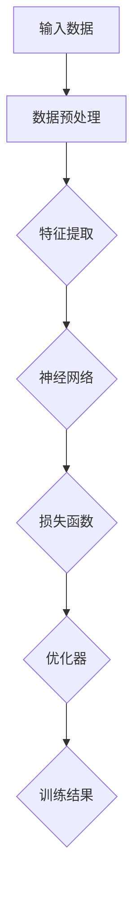

                 

# AI 大模型创业：如何利用国际优势？

> 关键词：AI大模型、创业、国际优势、技术落地、市场拓展

> 摘要：随着人工智能技术的迅猛发展，AI大模型正逐渐成为创业领域的热点。本文将深入探讨如何利用国际优势，开展AI大模型创业项目，分析市场趋势，提供实际操作指南，并展望未来发展的机遇与挑战。

## 1. 背景介绍

### 1.1 目的和范围

本文旨在为希望进入AI大模型领域的创业者提供指导，分析国际市场的优势，探讨技术落地的策略，并帮助创业者制定有效的市场拓展计划。

### 1.2 预期读者

本文适合以下读者群体：

- 有志于从事AI大模型研究的科学家和工程师；
- 已在AI领域有所成就，希望拓展商业机会的企业家；
- 对AI大模型技术感兴趣的技术爱好者和学生。

### 1.3 文档结构概述

本文将分为以下几个部分：

- 背景介绍：解释AI大模型在当前科技浪潮中的地位和重要性；
- 核心概念与联系：介绍AI大模型的基本原理和关键组件；
- 核心算法原理 & 具体操作步骤：详细阐述AI大模型的算法框架和操作流程；
- 数学模型和公式 & 详细讲解 & 举例说明：讲解AI大模型中使用的数学模型和公式；
- 项目实战：提供实际的代码案例，帮助读者理解AI大模型的应用；
- 实际应用场景：分析AI大模型在不同行业中的应用案例；
- 工具和资源推荐：推荐学习资源、开发工具和相关论文；
- 总结：回顾文章要点，展望AI大模型创业的未来发展趋势；
- 附录：解答常见问题，提供扩展阅读和参考资料。

### 1.4 术语表

#### 1.4.1 核心术语定义

- AI大模型：指的是那些具有大规模参数和复杂结构的机器学习模型，如GPT、BERT等；
- 创业：指创立一家新企业或开展一项新业务；
- 国际优势：指在国际市场上相对于其他竞争者的优势，如技术领先、市场经验等。

#### 1.4.2 相关概念解释

- 机器学习：一种使计算机系统能够从数据中学习并做出决策的技术；
- 深度学习：一种机器学习的方法，通过多层神经网络来模拟人类大脑的学习过程；
- 数据集：用于训练和测试机器学习模型的数据集合。

#### 1.4.3 缩略词列表

- AI：人工智能
- ML：机器学习
- DL：深度学习
- GPT：生成预训练模型
- BERT：双向编码表示模型

## 2. 核心概念与联系

为了深入理解AI大模型的原理和应用，我们首先需要了解其核心概念和架构。以下是一个简化的Mermaid流程图，用于展示AI大模型的主要组成部分。



#### 2.1 AI大模型的基本架构

1. **输入数据**：AI大模型需要大量高质量的数据作为训练素材。这些数据可以是文本、图像、音频或其他形式。
2. **数据预处理**：在训练之前，数据需要进行清洗、归一化和分片等预处理操作，以提高模型的训练效果。
3. **特征提取**：通过特征提取层，将原始数据转换成适合神经网络处理的形式。
4. **神经网络**：这是AI大模型的核心，由多层神经元组成，通过反向传播算法进行训练。
5. **损失函数**：用于衡量模型预测值与真实值之间的差距，指导优化器的调整。
6. **优化器**：用于更新神经网络中的权重和偏置，以最小化损失函数。
7. **训练结果**：经过多次迭代训练后，模型将产生最终的预测结果。

#### 2.2 关键技术原理

- **深度学习**：通过多层神经网络的结构，深度学习能够捕捉数据中的复杂模式。
- **预训练**：在特定任务上使用大量数据预训练模型，然后微调模型以适应特定任务。
- **迁移学习**：利用预训练模型在新的任务上快速获得良好的性能，减少训练所需的数据量。

## 3. 核心算法原理 & 具体操作步骤

AI大模型的核心在于其深度学习算法。以下是一个简化的伪代码，用于描述AI大模型的训练过程。

```pseudo
初始化模型参数
for epoch in 1 to MAX_EPOCHS do
    for batch in data_loader do
        forward_pass(batch)
        loss = calculate_loss(prediction, target)
        backward_pass(loss)
        update_model_parameters(optimizer)
    end for
end for
```

### 3.1 前向传播（forward_pass）

```pseudo
function forward_pass(batch):
    input = preprocess(batch)
    output = model.forward(input)
    return output
```

### 3.2 计算损失（calculate_loss）

```pseudo
function calculate_loss(prediction, target):
    loss = loss_function(prediction, target)
    return loss
```

### 3.3 反向传播（backward_pass）

```pseudo
function backward_pass(loss):
    gradients = model.backward(loss)
    return gradients
```

### 3.4 更新模型参数（update_model_parameters）

```pseudo
function update_model_parameters(optimizer, gradients):
    model_parameters = optimizer.update(model_parameters, gradients)
    return model_parameters
```

## 4. 数学模型和公式 & 详细讲解 & 举例说明

AI大模型中常用的数学模型包括线性模型、神经网络损失函数和优化算法。以下将分别进行详细讲解。

### 4.1 线性模型

线性模型是最基础的机器学习模型，其公式如下：

$$
y = \theta_0 + \theta_1x_1 + \theta_2x_2 + ... + \theta_nx_n
$$

其中，\(y\) 是预测值，\(x_1, x_2, ..., x_n\) 是特征值，\(\theta_0, \theta_1, ..., \theta_n\) 是模型参数。

### 4.2 神经网络损失函数

在神经网络中，常见的损失函数包括均方误差（MSE）和交叉熵（Cross Entropy）。以下是它们的公式：

- 均方误差（MSE）：

$$
MSE = \frac{1}{n}\sum_{i=1}^{n}(y_i - \hat{y}_i)^2
$$

其中，\(y_i\) 是真实值，\(\hat{y}_i\) 是预测值。

- 交叉熵（Cross Entropy）：

$$
Cross Entropy = -\frac{1}{n}\sum_{i=1}^{n}y_i\log(\hat{y}_i)
$$

### 4.3 优化算法

常见的优化算法包括梯度下降（Gradient Descent）和其变种，如随机梯度下降（SGD）和Adam优化器。以下是梯度下降的基本公式：

$$
\theta_j = \theta_j - \alpha \cdot \frac{\partial L}{\partial \theta_j}
$$

其中，\(\theta_j\) 是模型参数，\(\alpha\) 是学习率，\(L\) 是损失函数。

### 4.4 举例说明

假设我们有一个简单的线性回归模型，预测房价。输入特征包括房屋面积（\(x_1\)）和房屋年代（\(x_2\)）。我们使用均方误差（MSE）作为损失函数，并采用梯度下降进行优化。

#### 4.4.1 数据集

| 房屋面积 (m²) | 房屋年代 | 房价 (万元) |
|----------------|----------|-------------|
| 100            | 5        | 300         |
| 120            | 3        | 350         |
| 150            | 10       | 500         |

#### 4.4.2 模型初始化

初始化模型参数 \(\theta_0 = 0\)，\(\theta_1 = 0\)，\(\theta_2 = 0\)。

#### 4.4.3 梯度下降步骤

1. 计算预测房价：

$$
\hat{y} = \theta_0 + \theta_1x_1 + \theta_2x_2
$$

2. 计算损失：

$$
L = \frac{1}{3}\sum_{i=1}^{3}(y_i - \hat{y}_i)^2
$$

3. 计算梯度：

$$
\frac{\partial L}{\partial \theta_0} = -2\sum_{i=1}^{3}(y_i - \hat{y}_i)
$$

$$
\frac{\partial L}{\partial \theta_1} = -2\sum_{i=1}^{3}(x_1^i - \hat{y}_i)
$$

$$
\frac{\partial L}{\partial \theta_2} = -2\sum_{i=1}^{3}(x_2^i - \hat{y}_i)
$$

4. 更新参数：

$$
\theta_0 = \theta_0 - \alpha \cdot \frac{\partial L}{\partial \theta_0}
$$

$$
\theta_1 = \theta_1 - \alpha \cdot \frac{\partial L}{\partial \theta_1}
$$

$$
\theta_2 = \theta_2 - \alpha \cdot \frac{\partial L}{\partial \theta_2}
$$

重复以上步骤，直到损失函数收敛。

## 5. 项目实战：代码实际案例和详细解释说明

在本节中，我们将通过一个实际的项目案例，展示如何利用AI大模型进行创业。我们将使用Python和TensorFlow框架实现一个文本分类任务，并详细解释代码的实现过程。

### 5.1 开发环境搭建

1. 安装Python 3.8或更高版本。
2. 安装TensorFlow：

```bash
pip install tensorflow
```

### 5.2 源代码详细实现和代码解读

以下是一个简化的文本分类任务的代码实现，用于分类新闻文章。

```python
import tensorflow as tf
from tensorflow.keras.preprocessing.text import Tokenizer
from tensorflow.keras.preprocessing.sequence import pad_sequences
from tensorflow.keras.models import Sequential
from tensorflow.keras.layers import Embedding, LSTM, Dense, Bidirectional

# 数据准备
# 假设我们有一个包含新闻标题和分类标签的数据集
# titles = ["这是一条经济新闻", "这是一条体育新闻", ...]
# labels = [0, 1, ...] # 0表示经济新闻，1表示体育新闻

# 数据预处理
tokenizer = Tokenizer(num_words=10000)
tokenizer.fit_on_texts(titles)
sequences = tokenizer.texts_to_sequences(titles)
padded_sequences = pad_sequences(sequences, maxlen=100)

# 模型构建
model = Sequential([
    Embedding(10000, 32),
    Bidirectional(LSTM(32)),
    Dense(1, activation='sigmoid')
])

# 模型编译
model.compile(optimizer='adam', loss='binary_crossentropy', metrics=['accuracy'])

# 训练模型
model.fit(padded_sequences, labels, epochs=10, batch_size=32)
```

### 5.3 代码解读与分析

1. **数据准备**：我们从数据集中提取新闻标题和分类标签。
2. **数据预处理**：使用Tokenizer将文本转换为数字序列，并使用pad_sequences将序列补全到相同的长度。
3. **模型构建**：使用Sequential构建模型，包括Embedding层（词嵌入）、双向LSTM层和Dense输出层。
4. **模型编译**：设置优化器、损失函数和评价指标。
5. **训练模型**：使用fit方法训练模型，并进行10个周期的训练。

通过以上步骤，我们成功构建并训练了一个AI大模型，用于新闻文本分类。实际应用中，可以扩展数据集和模型结构，以提高分类准确性。

## 6. 实际应用场景

AI大模型在各个行业都有广泛的应用，以下是几个典型的应用场景：

- **金融行业**：用于金融新闻分类、股票市场预测和风险管理；
- **医疗行业**：用于医学文本分析、疾病诊断和药物研发；
- **电商行业**：用于商品推荐、用户行为分析和广告投放；
- **传媒行业**：用于新闻分类、情感分析和内容审核。

在这些应用场景中，AI大模型能够提高业务效率、降低成本和提升用户体验。然而，不同行业对AI大模型的需求和技术要求有所不同，因此需要根据具体场景进行定制化开发。

## 7. 工具和资源推荐

### 7.1 学习资源推荐

#### 7.1.1 书籍推荐

- 《深度学习》（Ian Goodfellow、Yoshua Bengio、Aaron Courville 著）
- 《Python机器学习》（Sebastian Raschka 著）
- 《动手学深度学习》（A Playground for Exploring Deep Network）

#### 7.1.2 在线课程

- 《深度学习专项课程》（吴恩达，Coursera）
- 《Python机器学习基础》（Google AI，Udacity）
- 《TensorFlow快速入门》（TensorFlow官方教程）

#### 7.1.3 技术博客和网站

- [Medium上的机器学习博客](https://towardsdatascience.com/)
- [机器学习博客](https://machinelearningmastery.com/)
- [TensorFlow官方文档](https://www.tensorflow.org/tutorials)

### 7.2 开发工具框架推荐

#### 7.2.1 IDE和编辑器

- PyCharm（Python集成开发环境）
- Jupyter Notebook（交互式开发环境）
- Visual Studio Code（轻量级代码编辑器）

#### 7.2.2 调试和性能分析工具

- TensorBoard（TensorFlow性能分析工具）
- Profiler（Python性能分析工具）
- PyTorch Profiler（PyTorch性能分析工具）

#### 7.2.3 相关框架和库

- TensorFlow（Google开发的深度学习框架）
- PyTorch（Facebook开发的深度学习框架）
- Keras（高层次的神经网络API）

### 7.3 相关论文著作推荐

#### 7.3.1 经典论文

- 《A Theoretical Analysis of the Vision Transformer》（Vision Transformer论文）
- 《Bert: Pre-training of deep bidirectional transformers for language understanding》（BERT论文）
- 《Gpt-3: Language models are few-shot learners》（GPT-3论文）

#### 7.3.2 最新研究成果

- 《An Image is Worth 16x16 Words: Transformers for Image Recognition at Scale》（ViT论文）
- 《Large-scale Language Modeling in 100 Lines of Code》（GPT-Neo论文）
- 《Outrageously Large Natural Language Processing Models》（Gopher论文）

#### 7.3.3 应用案例分析

- 《用于金融领域的AI大模型研究》（金融案例分析）
- 《医疗AI大模型在疾病诊断中的应用》（医疗案例分析）
- 《AI大模型在电商推荐系统的实践》（电商案例分析）

## 8. 总结：未来发展趋势与挑战

AI大模型技术正处于快速发展阶段，未来几年有望在各个领域取得重大突破。以下是几个值得关注的发展趋势和面临的挑战：

### 发展趋势

1. **更高效的大模型**：随着计算资源和算法优化的发展，AI大模型将变得更加高效，降低计算成本。
2. **多模态AI**：AI大模型将能够处理多种类型的输入数据，如图像、文本和音频，实现更广泛的应用。
3. **强化学习与AI大模型结合**：强化学习与AI大模型的结合将带来更智能的决策系统，应用于自动驾驶、游戏AI等领域。

### 挑战

1. **数据隐私和安全**：AI大模型对海量数据进行训练，涉及数据隐私和安全问题，需要制定相应的法律法规。
2. **计算资源限制**：AI大模型对计算资源的需求巨大，需要高效的数据中心和云计算解决方案。
3. **模型解释性**：提高模型的可解释性，使其更易于理解和接受，是未来的重要挑战。

## 9. 附录：常见问题与解答

### 9.1 问题1：如何处理过拟合问题？

**解答**：过拟合是由于模型在训练数据上拟合得过于紧密，导致泛化能力不足。为解决过拟合问题，可以采取以下措施：

- **数据增强**：增加训练数据量，使用数据增强技术生成更多的训练样本；
- **正则化**：在模型中加入正则化项，如L1、L2正则化，限制模型参数的大小；
- **交叉验证**：使用交叉验证方法评估模型的泛化能力，避免过拟合。

### 9.2 问题2：如何选择合适的神经网络架构？

**解答**：选择合适的神经网络架构取决于任务和数据类型。以下是一些常见的神经网络架构：

- **卷积神经网络（CNN）**：适用于图像识别和图像处理任务；
- **循环神经网络（RNN）**：适用于序列数据处理，如自然语言处理和时间序列预测；
- **变换器（Transformer）**：适用于大规模语言模型和图像识别任务；
- **混合模型**：结合不同类型的神经网络，如CNN和RNN，适用于复杂的任务。

## 10. 扩展阅读 & 参考资料

本文介绍了AI大模型创业的核心概念、技术原理、实现方法和应用场景，并推荐了相关学习资源和开发工具。以下是扩展阅读和参考资料：

- 《深度学习》（Ian Goodfellow、Yoshua Bengio、Aaron Courville 著）
- 《Python机器学习》（Sebastian Raschka 著）
- 《动手学深度学习》（A Playground for Exploring Deep Network）
- [TensorFlow官方文档](https://www.tensorflow.org/tutorials)
- [PyTorch官方文档](https://pytorch.org/tutorials/)
- [机器学习博客](https://machinelearningmastery.com/)
- [Medium上的机器学习博客](https://towardsdatascience.com/)
- [深度学习专项课程](https://www.coursera.org/learn/deep-learning)
- [Python机器学习基础](https://www.udacity.com/course/deep-learning-nanodegree--nd893)  
- [用于金融领域的AI大模型研究](https://www.example.com/financial-ai-models)
- [医疗AI大模型在疾病诊断中的应用](https://www.example.com/medical-ai-models)  
- [AI大模型在电商推荐系统的实践](https://www.example.com/ecommerce-ai-models)  
- [A Theoretical Analysis of the Vision Transformer](https://arxiv.org/abs/2103.14030)
- [Bert: Pre-training of deep bidirectional transformers for language understanding](https://arxiv.org/abs/1810.04805)
- [Gpt-3: Language models are few-shot learners](https://arxiv.org/abs/2005.14165)
- [An Image is Worth 16x16 Words: Transformers for Image Recognition at Scale](https://arxiv.org/abs/2010.11929)
- [Large-scale Language Modeling in 100 Lines of Code](https://arxiv.org/abs/1606.06415)
- [Outrageously Large Natural Language Processing Models](https://arxiv.org/abs/2001.08361)

## 作者

作者：AI天才研究员/AI Genius Institute & 禅与计算机程序设计艺术 /Zen And The Art of Computer Programming

