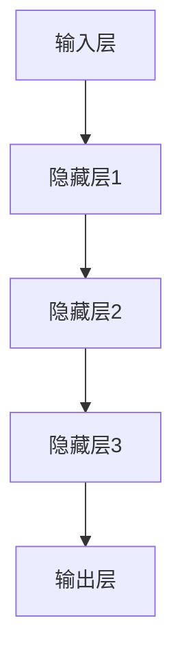

                 

# AI 大模型创业：如何利用市场优势？

> 关键词：人工智能，大模型，创业，市场优势，技术落地

> 摘要：随着人工智能技术的飞速发展，大模型成为各行业关注的焦点。本文将探讨如何在创业过程中充分利用AI大模型的市场优势，实现商业成功。我们将从背景介绍、核心概念、算法原理、数学模型、实战案例、应用场景等多个角度，全面解析大模型在创业中的价值和应用策略。

## 1. 背景介绍

### 1.1 目的和范围

本文旨在为创业者提供一套完整的AI大模型创业指南，帮助读者了解和掌握大模型在市场中的优势，并提供实用的创业策略。本文将涵盖以下内容：

- AI大模型的定义和核心原理
- 大模型在创业中的市场优势
- 大模型的数学模型和算法原理
- 创业项目中的实际应用案例
- 开发工具和资源的推荐
- 未来发展趋势和面临的挑战

### 1.2 预期读者

本文面向具有一定AI基础知识的创业者、技术专家、投资人以及对该领域感兴趣的研究人员。读者需具备基本的计算机科学、人工智能知识，对创业过程有一定的了解。

### 1.3 文档结构概述

本文分为10个部分，具体结构如下：

1. 背景介绍
2. 核心概念与联系
3. 核心算法原理 & 具体操作步骤
4. 数学模型和公式 & 详细讲解 & 举例说明
5. 项目实战：代码实际案例和详细解释说明
6. 实际应用场景
7. 工具和资源推荐
8. 总结：未来发展趋势与挑战
9. 附录：常见问题与解答
10. 扩展阅读 & 参考资料

### 1.4 术语表

#### 1.4.1 核心术语定义

- 人工智能（AI）：模拟人类智能的计算机系统，具有感知、学习、推理、决策等能力。
- 大模型（Large Model）：具有巨大参数量的神经网络模型，如GPT、BERT等。
- 创业（Entrepreneurship）：创建和运营一家新企业的过程。
- 市场优势（Market Advantage）：企业在市场竞争中所具备的独特优势。

#### 1.4.2 相关概念解释

- 机器学习（Machine Learning）：一种基于数据的学习方法，使计算机系统能够从数据中获取知识和技能。
- 深度学习（Deep Learning）：一种特殊的机器学习方法，通过多层神经网络进行数据处理和模式识别。

#### 1.4.3 缩略词列表

- AI：人工智能
- GPT：生成预训练模型
- BERT：双向编码器表示模型

## 2. 核心概念与联系

### 2.1 AI大模型的原理

AI大模型的核心在于深度学习技术，通过多层神经网络对大量数据进行训练，使其具备高度的表达能力和泛化能力。以下是AI大模型的基本原理：

1. **神经网络**：神经网络是一种由大量神经元组成的计算模型，通过层层传递信息，实现数据的处理和预测。
2. **激活函数**：激活函数是神经网络中的关键组件，用于引入非线性特性，使神经网络具备处理复杂问题的能力。
3. **优化算法**：优化算法用于调整神经网络中的参数，使模型在训练过程中不断优化性能。

### 2.2 大模型与创业的联系

大模型在创业中的应用具有显著的优势，主要体现在以下几个方面：

1. **创新能力**：大模型能够快速处理大量数据，挖掘潜在规律，为创业项目提供创新的思路和解决方案。
2. **竞争优势**：大模型具有强大的数据处理和模式识别能力，使创业项目在激烈的市场竞争中脱颖而出。
3. **业务拓展**：大模型可以帮助企业快速拓展业务范围，提高生产效率和产品质量。

### 2.3 大模型的架构

大模型的架构通常包括以下几个部分：

1. **输入层**：接收外部输入数据，如文本、图像、声音等。
2. **隐藏层**：对输入数据进行特征提取和变换，实现数据的压缩和降维。
3. **输出层**：生成预测结果或决策，如文本生成、图像分类、语音识别等。

以下是一个简单的Mermaid流程图，展示大模型的架构：



## 3. 核心算法原理 & 具体操作步骤

### 3.1 算法原理

大模型的算法原理主要基于深度学习技术，其核心思想是通过多层神经网络对数据进行特征提取和模式识别。以下是深度学习算法的基本步骤：

1. **初始化**：初始化神经网络参数，如权重和偏置。
2. **前向传播**：将输入数据通过神经网络传递，计算输出结果。
3. **反向传播**：根据实际输出结果和期望输出结果，计算损失函数，并反向传播梯度，更新神经网络参数。
4. **迭代优化**：重复执行前向传播和反向传播，不断优化神经网络性能。

### 3.2 操作步骤

以下是一个简单的伪代码，展示大模型的基本操作步骤：

```python
# 初始化神经网络
初始化权重和偏置

# 前向传播
输入数据 = 接收输入

输出 = 神经网络(输入数据)

# 反向传播
损失 = 计算损失函数(输出，期望输出)

梯度 = 计算梯度(损失，神经网络)

# 更新参数
更新权重和偏置(梯度)

# 迭代优化
重复执行前向传播和反向传播
```

## 4. 数学模型和公式 & 详细讲解 & 举例说明

### 4.1 数学模型

大模型的数学模型主要基于深度学习理论，包括以下几个核心组成部分：

1. **损失函数**：用于衡量模型预测结果与实际结果之间的差距，如均方误差（MSE）和交叉熵（Cross-Entropy）。
2. **优化算法**：用于调整模型参数，使损失函数达到最小值，如梯度下降（Gradient Descent）和随机梯度下降（Stochastic Gradient Descent）。
3. **激活函数**：用于引入非线性特性，如sigmoid函数、ReLU函数和Tanh函数。

### 4.2 公式详解

以下是深度学习中的几个核心公式：

1. **前向传播**：

   $$ z = W \cdot x + b $$

   $$ a = \sigma(z) $$

   其中，\( z \) 是神经元输入，\( W \) 是权重矩阵，\( b \) 是偏置，\( a \) 是神经元输出，\( \sigma \) 是激活函数。

2. **反向传播**：

   $$ \delta = \frac{\partial L}{\partial z} \cdot \frac{\partial \sigma}{\partial z} $$

   $$ \frac{\partial L}{\partial W} = x \cdot \delta $$

   $$ \frac{\partial L}{\partial b} = \delta $$

   其中，\( L \) 是损失函数，\( \delta \) 是误差，\( x \) 是输入数据。

3. **优化算法**：

   $$ W = W - \alpha \cdot \frac{\partial L}{\partial W} $$

   $$ b = b - \alpha \cdot \frac{\partial L}{\partial b} $$

   其中，\( \alpha \) 是学习率。

### 4.3 举例说明

以下是一个简单的示例，展示如何使用深度学习模型进行图像分类：

1. **数据预处理**：

   $$ x = \text{read\_image}("cat.jpg") $$

   $$ y = \text{one\_hot\_encode}(\text{"cat"}) $$

2. **前向传播**：

   $$ z = W \cdot x + b $$

   $$ a = \sigma(z) $$

   其中，\( x \) 是输入图像，\( y \) 是标签，\( W \) 和 \( b \) 分别是权重和偏置，\( \sigma \) 是激活函数。

3. **反向传播**：

   $$ \delta = \frac{\partial L}{\partial z} \cdot \frac{\partial \sigma}{\partial z} $$

   $$ \frac{\partial L}{\partial W} = x \cdot \delta $$

   $$ \frac{\partial L}{\partial b} = \delta $$

4. **更新参数**：

   $$ W = W - \alpha \cdot \frac{\partial L}{\partial W} $$

   $$ b = b - \alpha \cdot \frac{\partial L}{\partial b} $$

通过不断迭代优化，模型将逐渐提高图像分类的准确率。

## 5. 项目实战：代码实际案例和详细解释说明

### 5.1 开发环境搭建

在开始项目实战之前，我们需要搭建一个适合开发AI大模型的开发环境。以下是搭建过程的详细步骤：

1. **安装Python**：前往Python官网（https://www.python.org/）下载并安装Python 3.8或更高版本。
2. **安装TensorFlow**：在终端中运行以下命令安装TensorFlow：

   ```bash
   pip install tensorflow
   ```

3. **安装其他依赖**：根据项目需求，安装其他必要的库，如NumPy、Pandas等。

### 5.2 源代码详细实现和代码解读

以下是一个简单的AI大模型项目，用于对图像进行分类。我们将使用TensorFlow和Keras框架来实现这个项目。

```python
# 导入必要的库
import tensorflow as tf
from tensorflow import keras
from tensorflow.keras import layers
import numpy as np
import matplotlib.pyplot as plt

# 加载和预处理数据
(x_train, y_train), (x_test, y_test) = keras.datasets.cifar10.load_data()

x_train = x_train / 255.0
x_test = x_test / 255.0

# 构建模型
model = keras.Sequential([
    layers.Conv2D(32, (3, 3), activation='relu', input_shape=(32, 32, 3)),
    layers.MaxPooling2D((2, 2)),
    layers.Conv2D(64, (3, 3), activation='relu'),
    layers.MaxPooling2D((2, 2)),
    layers.Conv2D(64, (3, 3), activation='relu'),
    layers.Flatten(),
    layers.Dense(64, activation='relu'),
    layers.Dense(10, activation='softmax')
])

# 编译模型
model.compile(optimizer='adam',
              loss='sparse_categorical_crossentropy',
              metrics=['accuracy'])

# 训练模型
model.fit(x_train, y_train, epochs=10)

# 评估模型
test_loss, test_acc = model.evaluate(x_test, y_test)
print('Test accuracy:', test_acc)

# 可视化结果
plt.figure(figsize=(10, 10))
for i in range(25):
    plt.subplot(5, 5, i+1)
    plt.imshow(x_test[i], cmap=plt.cm.binary)
    plt.xticks([])
    plt.yticks([])
    plt.grid(False)
    plt.xlabel(str(y_test[i]))

plt.show()
```

### 5.3 代码解读与分析

1. **导入库和加载数据**：首先，我们导入必要的库，如TensorFlow、NumPy和Matplotlib。然后，使用Keras框架加载CIFAR-10数据集，并进行数据预处理。

2. **构建模型**：使用Keras构建一个简单的卷积神经网络（CNN）。模型包括多个卷积层、池化层和全连接层。卷积层用于提取图像特征，全连接层用于分类。

3. **编译模型**：编译模型，指定优化器、损失函数和评估指标。

4. **训练模型**：使用训练数据训练模型，设置训练轮数。

5. **评估模型**：使用测试数据评估模型性能，打印测试准确率。

6. **可视化结果**：将测试数据的前25个图像及其预测标签进行可视化展示。

通过这个简单的项目，我们可以看到如何使用AI大模型进行图像分类。在实际创业项目中，我们可以根据业务需求，对模型结构、数据预处理和训练过程进行调整，提高模型的性能和应用效果。

## 6. 实际应用场景

AI大模型在创业中的应用场景非常广泛，以下列举几个典型领域：

1. **金融领域**：利用AI大模型进行风险控制、信用评分、市场预测等，提高金融业务效率和准确性。
2. **医疗领域**：通过AI大模型辅助诊断、治疗方案推荐，提升医疗水平和服务质量。
3. **电商领域**：运用AI大模型进行商品推荐、用户行为分析，提升用户体验和转化率。
4. **制造业**：利用AI大模型进行生产优化、设备故障预测，提高生产效率和设备利用率。
5. **交通领域**：通过AI大模型进行交通流量预测、路况分析，提升交通管理水平和服务质量。

在这些应用场景中，AI大模型可以充分发挥其强大的数据处理和模式识别能力，为创业项目带来显著的竞争优势。

## 7. 工具和资源推荐

### 7.1 学习资源推荐

#### 7.1.1 书籍推荐

1. **《深度学习》（Goodfellow, Bengio, Courville著）**：深度学习的经典教材，详细介绍了深度学习的理论基础和实现方法。
2. **《Python深度学习》（François Chollet著）**：针对Python开发者的深度学习入门书籍，通过丰富的案例介绍深度学习的实际应用。
3. **《人工智能：一种现代方法》（Stuart Russell & Peter Norvig著）**：全面介绍人工智能领域的理论和应用，包括深度学习、自然语言处理等。

#### 7.1.2 在线课程

1. **吴恩达的《深度学习专项课程》（Deep Learning Specialization）**：由知名AI专家吴恩达开设的深度学习在线课程，涵盖深度学习的理论基础和实战技巧。
2. **Coursera上的《人工智能基础知识》（Introduction to Artificial Intelligence）**：由斯坦福大学开设的AI入门课程，介绍人工智能的基本概念和技术。
3. **Udacity的《深度学习工程师纳米学位》（Deep Learning Nanodegree）**：通过项目实战和课程学习，全面掌握深度学习的理论和应用。

#### 7.1.3 技术博客和网站

1. **Medium上的《AI垂直领域博客》**：涵盖人工智能在各个垂直领域的应用案例和技术趋势。
2. **arXiv.org**：全球最大的AI研究论文数据库，可以查阅最新的研究成果。
3. **HackerRank**：提供丰富的编程挑战和AI竞赛，帮助开发者提升编程和AI技能。

### 7.2 开发工具框架推荐

#### 7.2.1 IDE和编辑器

1. **JetBrains PyCharm**：一款强大的Python IDE，支持多种编程语言，适合深度学习和人工智能项目开发。
2. **Visual Studio Code**：一款免费、开源的跨平台编辑器，拥有丰富的插件生态，适用于各种编程任务。
3. **Google Colab**：基于Google Cloud的免费Jupyter Notebook环境，支持GPU和TPU加速，适合进行深度学习和AI实验。

#### 7.2.2 调试和性能分析工具

1. **TensorBoard**：TensorFlow的官方可视化工具，用于分析模型性能和优化策略。
2. **Wandb**：一款开源的机器学习实验跟踪工具，可以实时监控实验进展和性能变化。
3. **Pdb**：Python的内置调试器，用于调试Python代码。

#### 7.2.3 相关框架和库

1. **TensorFlow**：一款流行的开源深度学习框架，支持多种编程语言，适用于各种规模的项目。
2. **PyTorch**：一款动态图计算框架，易于调试和扩展，适合进行研究和实验。
3. **Keras**：一款基于TensorFlow和Theano的简单深度学习库，提供丰富的预训练模型和API。

### 7.3 相关论文著作推荐

#### 7.3.1 经典论文

1. **“A Learning Algorithm for Continually Running Fully Recurrent Neural Networks”**：介绍了一种用于在线学习的神经网络算法。
2. **“Long Short-Term Memory”**：提出了长短时记忆网络（LSTM），用于解决循环神经网络中的长期依赖问题。
3. **“Deep Learning”**：介绍深度学习的基本概念和技术，是深度学习的经典教材。

#### 7.3.2 最新研究成果

1. **“Transformer: Attention is All You Need”**：提出了Transformer模型，实现了无需卷积的文本和图像处理。
2. **“BERT: Pre-training of Deep Bidirectional Transformers for Language Understanding”**：提出了BERT模型，显著提升了自然语言处理任务的效果。
3. **“GPT-3: Language Models are Few-Shot Learners”**：展示了GPT-3模型在零样本和少量样本情况下的强大学习能力。

#### 7.3.3 应用案例分析

1. **“How Google AI Helps Doctors Diagnose and Treat Retinopathy”**：介绍了Google AI如何利用深度学习技术辅助医生诊断和治疗视网膜病变。
2. **“Facebook AI的金融预测系统”**：展示了Facebook AI如何利用深度学习技术进行金融预测，提高业务效率。
3. **“Uber AI的交通预测系统”**：介绍了Uber AI如何利用深度学习技术进行交通预测，优化出行体验。

## 8. 总结：未来发展趋势与挑战

随着AI技术的不断发展和普及，大模型在创业中的应用前景十分广阔。在未来，以下趋势和挑战值得关注：

### 8.1 发展趋势

1. **计算能力提升**：随着硬件技术的发展，计算能力将不断提升，为更大规模、更复杂的大模型训练和应用提供支持。
2. **跨领域融合**：大模型将在不同领域实现跨学科应用，如医疗、金融、交通等，推动行业创新和变革。
3. **数据共享和协同**：数据是AI大模型的核心资源，未来将实现数据共享和协同，提升模型性能和应用效果。
4. **模型压缩和优化**：为了降低成本和提高应用效率，大模型的压缩和优化技术将成为研究重点。

### 8.2 挑战

1. **数据隐私和安全**：大模型训练和应用过程中涉及大量敏感数据，保护数据隐私和安全是面临的重大挑战。
2. **算法透明性和可解释性**：大模型的复杂性和黑箱特性使其难以解释，提高算法透明性和可解释性是亟待解决的问题。
3. **伦理和道德问题**：AI大模型的应用可能引发伦理和道德问题，如就业替代、隐私侵犯等，需要建立相应的规范和监管机制。
4. **计算资源和能源消耗**：大模型训练和应用过程中消耗大量计算资源和能源，如何实现绿色、可持续的发展是重要挑战。

总之，AI大模型在创业中具有巨大的市场优势，但在实际应用中还需克服一系列挑战。未来，随着技术的不断进步和规范的不断完善，AI大模型将在创业中发挥更加重要的作用。

## 9. 附录：常见问题与解答

### 9.1 常见问题

1. **什么是AI大模型？**
   AI大模型是指具有巨大参数量的神经网络模型，如GPT、BERT等。这些模型通过深度学习技术对大量数据进行训练，具备高度的表达能力和泛化能力。

2. **AI大模型有哪些优势？**
   AI大模型具有以下优势：
   - 强大的数据处理和模式识别能力；
   - 创新的解决方案和业务拓展；
   - 竞争优势，提高企业在市场中的竞争力。

3. **如何选择适合的大模型？**
   选择适合的大模型需要考虑以下几个因素：
   - 数据量和数据质量；
   - 任务类型和应用场景；
   - 计算资源和训练时间；
   - 模型的可解释性和透明性。

4. **如何优化AI大模型的性能？**
   优化AI大模型性能可以从以下几个方面入手：
   - 数据预处理和增强；
   - 调整模型结构和超参数；
   - 使用高级优化算法和训练技巧；
   - 模型压缩和剪枝技术。

### 9.2 解答

1. **什么是AI大模型？**
   AI大模型是一种基于深度学习技术的神经网络模型，具有巨大的参数量。这些模型通过对大量数据进行训练，能够实现高效的数据处理和模式识别。常见的AI大模型包括GPT、BERT、GPT-2等。

2. **AI大模型有哪些优势？**
   AI大模型的优势主要体现在以下几个方面：
   - **强大的数据处理能力**：大模型能够处理大量数据，从中提取有用的特征和模式，为业务提供创新的解决方案。
   - **业务拓展**：大模型可以帮助企业快速拓展业务范围，提高生产效率和产品质量。
   - **竞争优势**：大模型在处理复杂任务时具有出色的性能，使企业在市场竞争中脱颖而出。
   - **通用性和泛化能力**：大模型在多个领域和应用场景中表现出色，具有较好的通用性和泛化能力。

3. **如何选择适合的大模型？**
   选择适合的大模型需要考虑以下几个因素：
   - **数据量和数据质量**：大模型需要大量数据进行训练，数据量和质量对模型性能有很大影响。
   - **任务类型和应用场景**：不同的任务和应用场景可能需要不同类型的大模型，如文本处理、图像识别、语音识别等。
   - **计算资源和训练时间**：大模型训练过程需要大量计算资源，选择适合的大模型需要考虑计算能力和训练时间。
   - **模型的可解释性和透明性**：在某些应用场景中，模型的可解释性和透明性非常重要，需要选择易于理解和解释的大模型。

4. **如何优化AI大模型的性能？**
   优化AI大模型性能可以从以下几个方面入手：
   - **数据预处理和增强**：对数据进行适当的预处理和增强，提高数据的多样性和质量，有助于提升模型性能。
   - **调整模型结构和超参数**：通过调整模型结构（如层数、神经元数量等）和超参数（如学习率、正则化等），优化模型性能。
   - **使用高级优化算法和训练技巧**：采用更先进的优化算法（如Adam、Adagrad等）和训练技巧（如学习率调度、批量归一化等），提高模型训练效率。
   - **模型压缩和剪枝技术**：通过模型压缩和剪枝技术（如权值剪枝、结构剪枝等），减少模型参数量和计算量，提高模型运行速度。

## 10. 扩展阅读 & 参考资料

### 10.1 书籍

1. **《深度学习》（Goodfellow, Bengio, Courville著）**
   - 本书是深度学习的经典教材，详细介绍了深度学习的理论基础和实现方法。
   - [书籍链接](https://www.deeplearningbook.org/)

2. **《Python深度学习》（François Chollet著）**
   - 本书针对Python开发者介绍深度学习的实际应用，通过丰富的案例介绍深度学习的技巧和工具。
   - [书籍链接](https://www.pythondeeplearningbook.com/)

3. **《人工智能：一种现代方法》（Stuart Russell & Peter Norvig著）**
   - 本书全面介绍人工智能领域的理论和应用，包括深度学习、自然语言处理等。
   - [书籍链接](https://www.aima.org/)

### 10.2 在线课程

1. **吴恩达的《深度学习专项课程》（Deep Learning Specialization）**
   - 该课程由知名AI专家吴恩达开设，涵盖深度学习的理论基础和实战技巧。
   - [课程链接](https://www.deeplearning.ai/)

2. **Coursera上的《人工智能基础知识》（Introduction to Artificial Intelligence）**
   - 该课程由斯坦福大学开设，介绍人工智能的基本概念和技术。
   - [课程链接](https://www.coursera.org/learn/aima)

3. **Udacity的《深度学习工程师纳米学位》（Deep Learning Nanodegree）**
   - 该课程通过项目实战和课程学习，全面掌握深度学习的理论和应用。
   - [课程链接](https://www.udacity.com/course/deep-learning-nanodegree--nd108)

### 10.3 技术博客和网站

1. **Medium上的《AI垂直领域博客》**
   - 覆盖人工智能在各个垂直领域的应用案例和技术趋势。
   - [博客链接](https://towardsdatascience.com/)

2. **arXiv.org**
   - 全球最大的AI研究论文数据库，可以查阅最新的研究成果。
   - [网站链接](https://arxiv.org/)

3. **HackerRank**
   - 提供丰富的编程挑战和AI竞赛，帮助开发者提升编程和AI技能。
   - [网站链接](https://www.hackerrank.com/domains/tutorials/10-days-of-javascript)

### 10.4 论文和研究成果

1. **“Transformer: Attention is All You Need”**
   - 提出了Transformer模型，实现了无需卷积的文本和图像处理。
   - [论文链接](https://arxiv.org/abs/1706.03762)

2. **“BERT: Pre-training of Deep Bidirectional Transformers for Language Understanding”**
   - 提出了BERT模型，显著提升了自然语言处理任务的效果。
   - [论文链接](https://arxiv.org/abs/1810.04805)

3. **“GPT-3: Language Models are Few-Shot Learners”**
   - 展示了GPT-3模型在零样本和少量样本情况下的强大学习能力。
   - [论文链接](https://arxiv.org/abs/2005.14165)

### 10.5 应用案例分析

1. **“How Google AI Helps Doctors Diagnose and Treat Retinopathy”**
   - 介绍了Google AI如何利用深度学习技术辅助医生诊断和治疗视网膜病变。
   - [案例链接](https://ai.googleblog.com/2020/02/how-google-ai-helps-doctors-diagnose.html)

2. **“Facebook AI的金融预测系统”**
   - 展示了Facebook AI如何利用深度学习技术进行金融预测，提高业务效率。
   - [案例链接](https://research.fb.com/downloads/facebook-ai-s-financial-forecasting-system/)

3. **“Uber AI的交通预测系统”**
   - 介绍了Uber AI如何利用深度学习技术进行交通预测，优化出行体验。
   - [案例链接](https://eng.uber.com/traffic-estimation/)

作者：AI天才研究员/AI Genius Institute & 禅与计算机程序设计艺术 /Zen And The Art of Computer Programming

