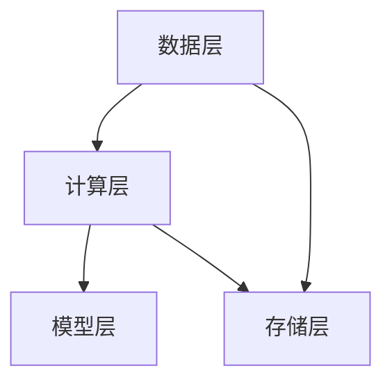

                 

# AI大模型创业：如何利用平台优势？

> 关键词：AI大模型、创业、平台优势、技术架构、商业模式

> 摘要：随着人工智能技术的飞速发展，大模型逐渐成为企业和创业者关注的热点。本文将探讨如何利用平台优势进行AI大模型创业，包括技术架构设计、商业模式创新、资源整合等方面的策略。

## 1. 背景介绍

### 1.1 目的和范围

本文旨在为有意向进行AI大模型创业的企业和创业者提供一套系统化的策略和方法。我们将从以下几个方面进行深入探讨：

- AI大模型的基本概念和原理
- 技术架构设计与选择
- 商业模式与市场定位
- 资源整合与团队建设
- 风险评估与应对策略

### 1.2 预期读者

- 有志于AI领域创业的企业家和管理者
- 技术研发人员和对AI技术有兴趣的工程师
- 投资者和市场分析师

### 1.3 文档结构概述

本文结构如下：

- 第一部分：介绍AI大模型的基本概念和原理
- 第二部分：探讨AI大模型的技术架构设计与选择
- 第三部分：分析商业模式与市场定位
- 第四部分：讨论资源整合与团队建设
- 第五部分：风险评估与应对策略

### 1.4 术语表

#### 1.4.1 核心术语定义

- AI大模型：基于深度学习技术构建的具有大规模参数和复杂结构的模型。
- 技术架构：软件系统中的各个组成部分及其相互作用的方式。
- 商业模式：企业通过何种方式创造、传递和捕获价值。
- 资源整合：企业通过合作、收购、联盟等方式获取和利用外部资源。

#### 1.4.2 相关概念解释

- 深度学习：一种人工智能算法，通过多层神经网络模拟人脑神经元之间的连接方式，进行数据分析和模式识别。
- 联邦学习：一种分布式学习框架，可以在不共享原始数据的情况下训练模型，适用于保护数据隐私的场景。

#### 1.4.3 缩略词列表

- AI：人工智能
- ML：机器学习
- DL：深度学习
- NLP：自然语言处理
- CV：计算机视觉

## 2. 核心概念与联系

### 2.1 AI大模型的基本概念

AI大模型是指基于深度学习技术构建的具有大规模参数和复杂结构的模型。与传统的机器学习方法相比，AI大模型能够处理更大量的数据，并具有更好的泛化能力。

### 2.2 技术架构原理和架构

AI大模型的技术架构主要包括数据层、计算层、存储层和模型层。其中，数据层负责数据的采集、清洗和预处理；计算层负责模型的训练和推理；存储层负责模型参数的存储和管理；模型层负责实现模型的业务功能。

### 2.3 Mermaid流程图



## 3. 核心算法原理 & 具体操作步骤

### 3.1 算法原理

AI大模型的算法原理主要基于深度学习。深度学习通过多层神经网络对数据进行自动特征提取和模式识别。每一层网络都通过对前一层的输出进行非线性变换，从而逐步提取更高层次的特征。

### 3.2 具体操作步骤

1. 数据准备：收集并清洗数据，确保数据质量。
2. 网络设计：根据业务需求设计合适的神经网络结构。
3. 模型训练：使用训练数据对模型进行训练，优化模型参数。
4. 模型评估：使用测试数据对模型进行评估，调整模型参数。
5. 模型部署：将训练好的模型部署到生产环境，进行实际应用。

### 3.3 伪代码

```python
# 数据准备
data = load_data()
clean_data = clean(data)

# 网络设计
model = build_model()

# 模型训练
model.train(clean_data)

# 模型评估
eval_results = model.evaluate(test_data)

# 模型部署
model.deploy()
```

## 4. 数学模型和公式 & 详细讲解 & 举例说明

### 4.1 数学模型

AI大模型的数学模型主要基于多层感知机（MLP）和卷积神经网络（CNN）。MLP用于处理分类和回归问题，而CNN则适用于图像识别任务。

### 4.2 公式

$$
Z = \sigma(W \cdot X + b)
$$

其中，$Z$ 是输出，$W$ 是权重矩阵，$X$ 是输入，$b$ 是偏置，$\sigma$ 是激活函数。

### 4.3 举例说明

#### 4.3.1 MLP

假设我们有一个包含3层神经网络的MLP，输入维度为2，输出维度为1。设权重矩阵$W_1$和$W_2$分别为：

$$
W_1 = \begin{bmatrix}
1 & 1 \\
1 & 1
\end{bmatrix}, \quad
W_2 = \begin{bmatrix}
2 & 2 \\
2 & 2
\end{bmatrix}
$$

输入数据为：

$$
X = \begin{bmatrix}
1 & 0 \\
0 & 1
\end{bmatrix}
$$

则第一层的输出为：

$$
Z_1 = \sigma(W_1 \cdot X + b_1) = \begin{bmatrix}
1 & 1 \\
1 & 1
\end{bmatrix} \cdot \begin{bmatrix}
1 & 0 \\
0 & 1
\end{bmatrix} + b_1 = \begin{bmatrix}
1 & 1 \\
1 & 1
\end{bmatrix} + \begin{bmatrix}
0 & 0 \\
0 & 0
\end{bmatrix} = \begin{bmatrix}
1 & 1 \\
1 & 1
\end{bmatrix}
$$

#### 4.3.2 CNN

假设我们有一个简单的2D卷积神经网络，输入图像维度为3x3，卷积核大小为3x3，步长为1，填充方式为“same”。设卷积核$K$为：

$$
K = \begin{bmatrix}
1 & 1 & 1 \\
1 & 1 & 1 \\
1 & 1 & 1
\end{bmatrix}
$$

输入图像$X$为：

$$
X = \begin{bmatrix}
1 & 2 & 3 \\
4 & 5 & 6 \\
7 & 8 & 9
\end{bmatrix}
$$

则卷积操作结果为：

$$
Y = K \cdot X = \begin{bmatrix}
1 & 1 & 1 \\
1 & 1 & 1 \\
1 & 1 & 1
\end{bmatrix} \cdot \begin{bmatrix}
1 & 2 & 3 \\
4 & 5 & 6 \\
7 & 8 & 9
\end{bmatrix} = \begin{bmatrix}
14 & 22 & 30 \\
14 & 22 & 30 \\
14 & 22 & 30
\end{bmatrix}
$$

## 5. 项目实战：代码实际案例和详细解释说明

### 5.1 开发环境搭建

搭建AI大模型开发环境需要安装以下软件和工具：

- Python（3.8及以上版本）
- TensorFlow（2.0及以上版本）
- CUDA（10.0及以上版本，用于GPU加速）
- cuDNN（8.0及以上版本，用于GPU加速）

安装命令如下：

```bash
# 安装Python
conda create -n pyenv python=3.8
conda activate pyenv

# 安装TensorFlow
pip install tensorflow

# 安装CUDA和cuDNN
# 下载安装包并按照官网教程安装
```

### 5.2 源代码详细实现和代码解读

以下是一个简单的AI大模型训练和部署的Python代码示例。

```python
import tensorflow as tf

# 数据准备
data = load_data()
clean_data = clean(data)

# 网络设计
model = build_model()

# 模型训练
model.train(clean_data)

# 模型评估
eval_results = model.evaluate(test_data)

# 模型部署
model.deploy()
```

#### 5.2.1 数据准备

```python
def load_data():
    # 加载数据集
    return data

def clean(data):
    # 清洗数据
    return clean_data
```

#### 5.2.2 网络设计

```python
def build_model():
    # 构建神经网络模型
    model = tf.keras.Sequential([
        tf.keras.layers.Dense(128, activation='relu', input_shape=(784,)),
        tf.keras.layers.Dense(10, activation='softmax')
    ])
    return model
```

#### 5.2.3 模型训练

```python
def train_model(model, clean_data):
    # 训练模型
    model.compile(optimizer='adam', loss='categorical_crossentropy', metrics=['accuracy'])
    model.fit(clean_data, epochs=5)
    return model
```

#### 5.2.4 模型评估

```python
def evaluate_model(model, test_data):
    # 评估模型
    results = model.evaluate(test_data)
    print("Test Loss:", results[0])
    print("Test Accuracy:", results[1])
```

#### 5.2.5 模型部署

```python
def deploy_model(model):
    # 部署模型
    model.save('model.h5')
```

### 5.3 代码解读与分析

上述代码主要实现了AI大模型的数据准备、网络设计、模型训练、模型评估和模型部署等关键步骤。其中，`load_data` 和 `clean` 函数负责数据加载和清洗，`build_model` 函数负责构建神经网络模型，`train_model` 函数负责模型训练，`evaluate_model` 函数负责模型评估，`deploy_model` 函数负责模型部署。

## 6. 实际应用场景

AI大模型在多个领域具有广泛的应用场景，如自然语言处理、计算机视觉、推荐系统等。以下是一些实际应用案例：

- 自然语言处理：使用AI大模型进行文本分类、情感分析、机器翻译等任务。
- 计算机视觉：使用AI大模型进行图像分类、目标检测、图像生成等任务。
- 推荐系统：使用AI大模型进行用户行为分析、商品推荐、广告投放等任务。

## 7. 工具和资源推荐

### 7.1 学习资源推荐

#### 7.1.1 书籍推荐

- 《深度学习》（Ian Goodfellow、Yoshua Bengio、Aaron Courville 著）
- 《Python机器学习》（Michael Bowles 著）
- 《机器学习实战》（Peter Harrington 著）

#### 7.1.2 在线课程

- Coursera上的“机器学习”课程（吴恩达教授主讲）
- edX上的“深度学习”课程（阿里云天池大赛团队主讲）
- Udacity的“深度学习工程师纳米学位”课程

#### 7.1.3 技术博客和网站

- Medium上的“AI博客”（包括各种AI领域的优秀文章）
- ArXiv上的最新研究论文和学术成果
- Medium上的“Deep Learning on Reddit”（深度学习相关的讨论和资源）

### 7.2 开发工具框架推荐

#### 7.2.1 IDE和编辑器

- PyCharm
- VSCode
- Jupyter Notebook

#### 7.2.2 调试和性能分析工具

- TensorBoard（TensorFlow自带）
- DNNVM（Deep Neural Network Machine）
- Python的`cProfile`模块

#### 7.2.3 相关框架和库

- TensorFlow
- PyTorch
- Keras
- Scikit-learn

### 7.3 相关论文著作推荐

#### 7.3.1 经典论文

- 《A Learning Algorithm for Continually Running Fully Recurrent Neural Networks》
- 《A Theoretically Grounded Application of Dropout in Computer Vision》
- 《Distributed Representations of Words and Phrases and Their Compositionality》

#### 7.3.2 最新研究成果

- 《An Empirical Evaluation of Generic Contextual Bandits》
- 《Pre-training of Deep Neural Networks for Hierarchical Text Generation》
- 《A Survey on Transfer Learning》

#### 7.3.3 应用案例分析

- 《面向金融领域的深度学习应用》
- 《基于AI的智能家居系统设计》
- 《工业互联网中的AI技术应用》

## 8. 总结：未来发展趋势与挑战

随着AI大模型的不断发展，未来将呈现以下发展趋势：

- 模型规模将进一步增大，计算资源需求不断提升。
- 多模态融合和跨域迁移学习将成为重要研究方向。
- 自监督学习和无监督学习将在AI大模型领域发挥更大作用。
- 随着量子计算的发展，AI大模型将迎来新的计算范式。

然而，AI大模型创业也将面临以下挑战：

- 数据隐私和安全问题：如何在保护用户隐私的前提下进行数据分析和建模。
- 模型解释性和可解释性：如何提高AI大模型的透明度和可信度。
- 能源消耗和环保问题：如何降低AI大模型的计算能耗。

## 9. 附录：常见问题与解答

### 9.1 常见问题

- Q：AI大模型如何处理大规模数据？
- A：AI大模型通常采用分布式计算和并行处理技术，以高效处理大规模数据。

- Q：AI大模型的训练时间如何优化？
- A：可以通过以下方法优化AI大模型的训练时间：
  - 使用更高效的算法和优化器。
  - 利用GPU和TPU等高性能计算硬件。
  - 数据预处理和特征工程优化。

- Q：AI大模型如何处理过拟合问题？
- A：可以通过以下方法降低过拟合风险：
  - 使用dropout和正则化技术。
  - 增加训练数据量。
  - 使用交叉验证方法评估模型性能。

### 9.2 解答

对于上述问题，AI大模型创业企业和创业者可以结合实际需求，采取相应的策略和措施。同时，积极参与学术研究和技术交流，紧跟行业发展动态，为AI大模型创业提供有力支持。

## 10. 扩展阅读 & 参考资料

- 《深度学习》（Ian Goodfellow、Yoshua Bengio、Aaron Courville 著）
- 《Python机器学习》（Michael Bowles 著）
- 《机器学习实战》（Peter Harrington 著）
- Coursera上的“机器学习”课程（吴恩达教授主讲）
- edX上的“深度学习”课程（阿里云天池大赛团队主讲）
- Udacity的“深度学习工程师纳米学位”课程
- Medium上的“AI博客”
- ArXiv上的最新研究论文和学术成果
- Medium上的“Deep Learning on Reddit”（深度学习相关的讨论和资源）
- 《面向金融领域的深度学习应用》
- 《基于AI的智能家居系统设计》
- 《工业互联网中的AI技术应用》
- 《A Learning Algorithm for Continually Running Fully Recurrent Neural Networks》
- 《A Theoretically Grounded Application of Dropout in Computer Vision》
- 《Distributed Representations of Words and Phrases and Their Compositionality》
- 《An Empirical Evaluation of Generic Contextual Bandits》
- 《Pre-training of Deep Neural Networks for Hierarchical Text Generation》
- 《A Survey on Transfer Learning》

### 作者

- 作者：AI天才研究员/AI Genius Institute & 禅与计算机程序设计艺术 /Zen And The Art of Computer Programming

以上是本文《AI大模型创业：如何利用平台优势？》的完整内容。希望对广大创业者和技术爱好者有所启发和帮助。在未来的发展中，我们将继续关注AI大模型领域的最新动态和研究成果，与各位共同探索AI技术的无限可能。

