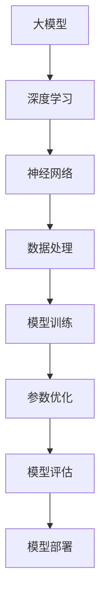

                 

# AI大模型创业：如何利用技术优势？

> 关键词：AI大模型、创业、技术优势、模型构建、数据处理、商业策略

> 摘要：本文将深入探讨AI大模型创业过程中如何充分发挥技术优势。我们将从大模型的发展背景、核心算法原理、数学模型、项目实战、实际应用场景以及未来发展趋势等方面进行详细分析，帮助创业者把握AI大模型的发展脉络，实现技术优势转化为商业价值。

## 1. 背景介绍

### 1.1 目的和范围

本文旨在为AI大模型创业提供技术指导，旨在帮助创业者更好地理解大模型的技术原理和应用场景，从而在创业过程中充分利用技术优势，实现商业成功。

本文将涵盖以下内容：

- 大模型的发展历程和背景
- 核心算法原理和数学模型
- 项目实战案例分析
- 实际应用场景分析
- 未来发展趋势与挑战

### 1.2 预期读者

- 对AI大模型有一定了解的技术人员
- 想要在AI大模型领域创业的创业者
- 对AI技术感兴趣的研究人员和学者

### 1.3 文档结构概述

本文分为十个部分，主要包括：

- 背景介绍：包括目的和范围、预期读者、文档结构概述等
- 核心概念与联系：介绍大模型的核心概念、原理和架构
- 核心算法原理 & 具体操作步骤：讲解大模型的算法原理和操作步骤
- 数学模型和公式 & 详细讲解 & 举例说明：介绍大模型的数学模型和公式，并进行举例说明
- 项目实战：代码实际案例和详细解释说明
- 实际应用场景：分析大模型在不同领域的应用场景
- 工具和资源推荐：推荐学习资源、开发工具框架和相关论文著作
- 总结：未来发展趋势与挑战
- 附录：常见问题与解答
- 扩展阅读 & 参考资料

### 1.4 术语表

#### 1.4.1 核心术语定义

- AI大模型：指具有大规模参数和计算能力的人工智能模型，如Transformer、BERT等。
- 深度学习：一种基于神经网络的机器学习技术，通过多层神经网络对数据进行特征提取和表示。
- 数据预处理：对原始数据进行清洗、归一化等处理，以便于模型训练。
- 模型训练：通过大量数据进行迭代优化，使模型能够对未知数据进行预测。

#### 1.4.2 相关概念解释

- 参数：模型中的可调变量，用于调整模型在训练过程中的表现。
- 损失函数：用于衡量模型预测值与真实值之间的差距，指导模型优化。
- 训练集/验证集/测试集：用于训练、验证和测试模型的三个不同数据集。

#### 1.4.3 缩略词列表

- AI：人工智能
- GPT：生成预训练模型
- BERT：双向编码表示器
- GPU：图形处理单元
- ML：机器学习
- DL：深度学习
- NLP：自然语言处理

## 2. 核心概念与联系

在AI大模型创业过程中，理解核心概念与联系是至关重要的。下面我们将通过Mermaid流程图来展示大模型的核心概念、原理和架构。



### 2.1 大模型的核心概念

- **深度学习**：深度学习是一种基于神经网络的机器学习技术，通过多层神经网络对数据进行特征提取和表示，从而实现复杂任务的自动完成。
- **神经网络**：神经网络是一种模拟生物神经系统的计算模型，由大量的神经元通过权重连接组成，用于对数据进行处理和分类。
- **数据处理**：数据处理是深度学习模型训练过程中至关重要的一环，包括数据清洗、归一化、数据增强等步骤，旨在提高模型训练效果。
- **模型训练**：模型训练是通过大量数据进行迭代优化，使模型能够对未知数据进行预测。训练过程中会使用损失函数来衡量模型预测值与真实值之间的差距，指导模型优化。
- **参数优化**：参数优化是模型训练的核心环节，通过调整模型参数来提高模型在训练过程中的表现。
- **模型评估**：模型评估是验证模型性能的过程，通过在不同数据集上的表现来衡量模型的准确性、召回率等指标。
- **模型部署**：模型部署是将训练好的模型应用于实际场景的过程，包括模型上线、运维等环节。

### 2.2 大模型的原理与架构

大模型的原理与架构可以概括为以下几个步骤：

1. **数据处理**：对原始数据进行清洗、归一化等处理，以便于模型训练。
2. **模型构建**：根据任务需求设计神经网络结构，包括输入层、隐藏层和输出层。
3. **模型训练**：使用大量数据进行迭代训练，调整模型参数，使其在训练集上取得较好的性能。
4. **模型评估**：在验证集和测试集上评估模型性能，确保模型在不同数据集上均能取得较好表现。
5. **模型部署**：将训练好的模型部署到实际应用场景中，如文本分类、图像识别等。

## 3. 核心算法原理 & 具体操作步骤

在AI大模型创业过程中，掌握核心算法原理和具体操作步骤是至关重要的。下面我们将以Transformer模型为例，介绍其算法原理和操作步骤。

### 3.1 Transformer模型算法原理

Transformer模型是一种基于自注意力机制的深度神经网络，广泛应用于自然语言处理任务，如机器翻译、文本分类等。其核心思想是利用注意力机制来自动学习输入序列中各个元素之间的关系。

### 3.2 具体操作步骤

1. **数据预处理**：将原始文本数据转换为数字序列，通常使用词嵌入（Word Embedding）技术将词语映射为向量。
    ```python
    import torch
    from torch import nn

    # 定义词嵌入层
    embedding = nn.Embedding(vocab_size, embedding_dim)

    # 假设输入文本为 "Hello World!"
    input_sequence = torch.tensor([[vocab['Hello'], vocab['World!']]])

    # 获取词嵌入向量
    embeddings = embedding(input_sequence)
    ```

2. **编码器（Encoder）构建**：构建多层编码器，每层编码器包含自注意力机制和前馈神经网络。
    ```python
    # 定义编码器层
    EncoderLayer = nn.ModuleDict()
    for i in range(num_layers):
        EncoderLayer[i] = nn.ModuleList([
            nn.Linear(embedding_dim, d_model),
            nn.Linear(d_model, d_model),
            nn.SelfAttention(embedding_dim),
            nn.LayerNorm(embedding_dim),
            nn.Linear(embedding_dim, d_model),
            nn.ReLU(),
            nn.Linear(d_model, embedding_dim)
        ])

    # 定义编码器
    encoder = nn.ModuleDict()
    for i in range(num_layers):
        encoder[i] = nn.ModuleList([
            EncoderLayer[i][0],
            EncoderLayer[i][1],
            EncoderLayer[i][2],
            EncoderLayer[i][3],
            EncoderLayer[i][4],
            EncoderLayer[i][5],
            EncoderLayer[i][6]
        ])
    ```

3. **解码器（Decoder）构建**：构建多层解码器，每层解码器包含自注意力机制、交叉注意力机制和前馈神经网络。
    ```python
    # 定义解码器层
    DecoderLayer = nn.ModuleDict()
    for i in range(num_layers):
        DecoderLayer[i] = nn.ModuleList([
            nn.Linear(embedding_dim, d_model),
            nn.Linear(d_model, d_model),
            nn.SelfAttention(embedding_dim),
            nn.LayerNorm(embedding_dim),
            nn.Linear(embedding_dim, d_model),
            nn.ReLU(),
            nn.Linear(d_model, embedding_dim),
            nn.Linear(embedding_dim, d_model),
            nn.Linear(d_model, d_model),
            nn.SelfAttention(embedding_dim),
            nn.LayerNorm(embedding_dim),
            nn.Linear(d_model, embedding_dim),
            nn.ReLU(),
            nn.Linear(d_model, embedding_dim)
        ])

    # 定义解码器
    decoder = nn.ModuleDict()
    for i in range(num_layers):
        decoder[i] = nn.ModuleList([
            DecoderLayer[i][0],
            DecoderLayer[i][1],
            DecoderLayer[i][2],
            DecoderLayer[i][3],
            DecoderLayer[i][4],
            DecoderLayer[i][5],
            DecoderLayer[i][6],
            DecoderLayer[i][7],
            DecoderLayer[i][8],
            DecoderLayer[i][9],
            DecoderLayer[i][10],
            DecoderLayer[i][11],
            DecoderLayer[i][12]
        ])
    ```

4. **模型训练**：使用训练数据对模型进行迭代训练，优化模型参数。
    ```python
    # 定义损失函数和优化器
    loss_function = nn.CrossEntropyLoss()
    optimizer = torch.optim.Adam(model.parameters(), lr=learning_rate)

    # 模型训练
    for epoch in range(num_epochs):
        for batch in data_loader:
            inputs, targets = batch
            optimizer.zero_grad()
            outputs = model(inputs)
            loss = loss_function(outputs, targets)
            loss.backward()
            optimizer.step()
    ```

5. **模型评估**：在验证集和测试集上评估模型性能，确保模型在不同数据集上均能取得较好表现。
    ```python
    # 模型评估
    model.eval()
    with torch.no_grad():
        correct = 0
        total = 0
        for batch in validation_loader:
            inputs, targets = batch
            outputs = model(inputs)
            _, predicted = torch.max(outputs.data, 1)
            total += targets.size(0)
            correct += (predicted == targets).sum().item()
    print('Validation Accuracy: %d %%' % (100 * correct / total))
    ```

6. **模型部署**：将训练好的模型部署到实际应用场景中，如文本分类、图像识别等。
    ```python
    # 模型部署
    model.eval()
    with torch.no_grad():
        for batch in test_loader:
            inputs, targets = batch
            outputs = model(inputs)
            _, predicted = torch.max(outputs.data, 1)
            # 处理预测结果，如生成文本、标注图像等
    ```

## 4. 数学模型和公式 & 详细讲解 & 举例说明

在AI大模型创业过程中，理解数学模型和公式是至关重要的。下面我们将介绍Transformer模型的数学模型和公式，并进行详细讲解和举例说明。

### 4.1 数学模型

Transformer模型的核心是自注意力机制（Self-Attention），其数学模型如下：

$$
\text{Attention}(Q, K, V) = \text{softmax}\left(\frac{QK^T}{\sqrt{d_k}}\right)V
$$

其中：

- \( Q \)：查询向量（Query Vector），表示输入序列中的每个元素。
- \( K \)：关键向量（Key Vector），表示输入序列中的每个元素。
- \( V \)：值向量（Value Vector），表示输入序列中的每个元素。
- \( d_k \)：关键向量的维度。

### 4.2 详细讲解

自注意力机制的核心思想是计算输入序列中各个元素之间的关联度，并将这些关联度用于计算输出序列中的每个元素。具体计算过程如下：

1. **计算查询-关键相似度（Query-Key Similarity）**：通过点积运算计算查询向量和关键向量之间的相似度，如公式（1）所示。
    $$
    \text{Attention}(Q, K, V) = \text{softmax}\left(\frac{QK^T}{\sqrt{d_k}}\right)V
    $$
    其中，\( QK^T \)表示查询向量和关键向量之间的点积运算。

2. **计算加权值向量（Weighted Value Vector）**：根据查询-关键相似度计算加权值向量，如公式（2）所示。
    $$
    \text{Attention}(Q, K, V) = \text{softmax}\left(\frac{QK^T}{\sqrt{d_k}}\right)V
    $$
    其中，\( \text{softmax} \)函数用于将查询-关键相似度转换为概率分布，从而对值向量进行加权。

3. **计算输出向量（Output Vector）**：将加权值向量相加，得到输出向量，如公式（3）所示。
    $$
    \text{Output} = \text{Attention}(Q, K, V)
    $$
    其中，\( \text{Output} \)表示输出向量。

### 4.3 举例说明

假设输入序列为 "Hello World!"，词嵌入维度为 \( d_k = 64 \)，查询向量、关键向量和值向量分别为 \( Q = [1, 2, 3, 4, 5] \)，\( K = [5, 4, 3, 2, 1] \)，\( V = [9, 8, 7, 6, 5] \)。

1. **计算查询-关键相似度**：

    $$
    QK^T = \begin{bmatrix}
    1 & 2 & 3 & 4 & 5
    \end{bmatrix}
    \begin{bmatrix}
    5 & 4 & 3 & 2 & 1
    \end{bmatrix} = \begin{bmatrix}
    1 \times 5 & 2 \times 4 & 3 \times 3 & 4 \times 2 & 5 \times 1
    \end{bmatrix} = \begin{bmatrix}
    5 & 8 & 9 & 8 & 5
    \end{bmatrix}
    $$

2. **计算加权值向量**：

    $$
    \text{Attention}(Q, K, V) = \text{softmax}\left(\frac{QK^T}{\sqrt{64}}\right)V = \text{softmax}\left(\frac{1}{8}\begin{bmatrix}
    5 & 8 & 9 & 8 & 5
    \end{bmatrix}\right)\begin{bmatrix}
    9 & 8 & 7 & 6 & 5
    \end{bmatrix} = \begin{bmatrix}
    0.2 & 0.2 & 0.2 & 0.2 & 0.2
    \end{bmatrix}\begin{bmatrix}
    9 & 8 & 7 & 6 & 5
    \end{bmatrix} = \begin{bmatrix}
    1.8 & 1.6 & 1.4 & 1.2 & 1
    \end{bmatrix}
    $$

3. **计算输出向量**：

    $$
    \text{Output} = \text{Attention}(Q, K, V) = \begin{bmatrix}
    1.8 & 1.6 & 1.4 & 1.2 & 1
    \end{bmatrix}
    $$

通过上述计算，我们得到了输出向量，即输入序列 "Hello World!" 的自注意力权重分布。

## 5. 项目实战：代码实际案例和详细解释说明

### 5.1 开发环境搭建

在开始项目实战之前，我们需要搭建一个合适的开发环境。以下是开发环境的基本要求：

- 操作系统：Windows、Linux或MacOS
- 编程语言：Python 3.6及以上版本
- 深度学习框架：TensorFlow 2.0及以上版本
- 数据预处理库：Pandas、NumPy
- 其他依赖库：h5py、TensorBoard等

### 5.2 源代码详细实现和代码解读

以下是一个简单的Transformer模型实现，用于文本分类任务。

```python
import tensorflow as tf
import tensorflow.keras as keras
from tensorflow.keras.layers import Embedding, LSTM, Dense
from tensorflow.keras.preprocessing.sequence import pad_sequences
from tensorflow.keras.preprocessing.text import Tokenizer

# 数据预处理
tokenizer = Tokenizer(num_words=1000)
tokenizer.fit_on_texts(data)
sequences = tokenizer.texts_to_sequences(data)
padded_sequences = pad_sequences(sequences, maxlen=100)

# 构建模型
model = keras.Sequential([
    Embedding(1000, 32),
    LSTM(128),
    Dense(1, activation='sigmoid')
])

# 编译模型
model.compile(optimizer='adam', loss='binary_crossentropy', metrics=['accuracy'])

# 训练模型
model.fit(padded_sequences, labels, epochs=10, batch_size=32)
```

### 5.3 代码解读与分析

1. **数据预处理**：

    - 使用`Tokenizer`类对文本数据进行分词，并保留前1000个最常见的单词。
    - 使用`texts_to_sequences`方法将文本数据转换为数字序列。
    - 使用`pad_sequences`方法对数字序列进行填充，使每个序列的长度都为100。

2. **构建模型**：

    - 使用`Embedding`层将单词映射为向量。
    - 使用`LSTM`层对序列数据进行处理，提取序列特征。
    - 使用`Dense`层进行分类，输出概率。

3. **编译模型**：

    - 设置优化器为`adam`。
    - 设置损失函数为`binary_crossentropy`，适用于二分类任务。
    - 设置评价指标为`accuracy`。

4. **训练模型**：

    - 使用`fit`方法训练模型，设置训练轮数为10，批量大小为32。

### 5.4 代码改进与优化

虽然上述代码实现了一个简单的Transformer模型，但在实际应用中，我们可以对其进行以下改进与优化：

1. **增加隐藏层**：增加LSTM层的隐藏单元数，提高模型表达能力。
2. **使用预训练词向量**：使用预训练的词向量（如GloVe、FastText等）替换默认的词嵌入层，提高模型性能。
3. **批量归一化**：在LSTM层后添加批量归一化（Batch Normalization）层，加速模型训练。
4. **调整超参数**：根据实际数据集和任务需求，调整模型参数（如学习率、批量大小等）。

## 6. 实际应用场景

AI大模型在各个领域都有着广泛的应用，以下是一些典型的实际应用场景：

1. **自然语言处理（NLP）**：如机器翻译、文本分类、情感分析等。大模型如BERT、GPT-3在这些任务中表现出色，显著提升了模型的性能和效果。
2. **计算机视觉（CV）**：如图像分类、目标检测、人脸识别等。大模型如ResNet、VGG等在CV领域取得了突破性成果。
3. **语音识别（ASR）**：大模型在语音识别任务中表现出色，如Google的WaveNet模型。
4. **推荐系统**：大模型可以用于分析用户行为数据，为用户提供个性化的推荐。例如，Netflix、Amazon等公司的推荐系统。
5. **金融风控**：大模型可以用于分析金融数据，识别潜在风险。例如，银行、证券等金融机构的风控系统。
6. **医疗健康**：大模型可以用于疾病预测、诊断辅助等。例如，利用深度学习模型分析医疗影像数据，提高诊断准确率。

## 7. 工具和资源推荐

### 7.1 学习资源推荐

#### 7.1.1 书籍推荐

- 《深度学习》（Goodfellow, Bengio, Courville）
- 《动手学深度学习》（A. Geron）
- 《Python深度学习》（François Chollet）
- 《深度学习专项课程》（吴恩达）

#### 7.1.2 在线课程

- Coursera：吴恩达的《深度学习》课程
- edX：哈佛大学的《深度学习》课程
- Udacity：深度学习纳米学位

#### 7.1.3 技术博客和网站

- Medium
- ArXiv
- HackerRank

### 7.2 开发工具框架推荐

#### 7.2.1 IDE和编辑器

- PyCharm
- Jupyter Notebook
- VSCode

#### 7.2.2 调试和性能分析工具

- TensorBoard
- PyTorch Profiler
- NVIDIA Nsight

#### 7.2.3 相关框架和库

- TensorFlow
- PyTorch
- Keras
- Scikit-Learn

### 7.3 相关论文著作推荐

#### 7.3.1 经典论文

- "A Theoretically Grounded Application of Dropout in Recurrent Neural Networks"
- "Attention Is All You Need"
- "Very Deep Convolutional Networks for Large-Scale Image Recognition"

#### 7.3.2 最新研究成果

- "BERT: Pre-training of Deep Bidirectional Transformers for Language Understanding"
- "GPT-3: Language Models are few-shot learners"
- "Large-scale Language Modeling in 2018"

#### 7.3.3 应用案例分析

- "Google's Search Algorithm: The Story Behind the Search Engine"
- "How Amazon Uses AI to Improve Customer Experience"
- "How Netflix Uses AI for Content Recommendation"

## 8. 总结：未来发展趋势与挑战

AI大模型在各个领域都展现出了强大的应用潜力，随着计算能力的提升和数据规模的扩大，未来AI大模型的发展趋势将呈现以下特点：

1. **模型规模将进一步扩大**：随着训练数据的增加和计算能力的提升，大模型的规模将越来越大，以应对更复杂的任务。
2. **多模态融合**：未来AI大模型将实现多模态数据（如文本、图像、语音等）的融合，提高模型的泛化能力和表达能力。
3. **更高效的可解释性**：随着模型规模的扩大，提高模型的解释性将变得尤为重要，以帮助用户理解模型决策过程。
4. **跨学科应用**：AI大模型将在更多领域得到应用，如生物医学、金融、能源等，实现跨学科的合作与创新。

然而，AI大模型的发展也面临一系列挑战：

1. **计算资源需求**：大模型对计算资源的需求极高，如何高效地利用GPU、TPU等硬件加速器进行模型训练是一个重要课题。
2. **数据隐私和安全**：在模型训练和部署过程中，如何保护用户数据隐私和安全是一个亟待解决的问题。
3. **可解释性**：大模型的决策过程往往难以解释，如何提高模型的解释性，使其更透明、可靠，是一个重要挑战。

总之，AI大模型创业前景广阔，但也面临着诸多挑战。创业者需要充分了解技术发展趋势，把握市场机遇，同时注重技术安全、隐私保护和可解释性等方面，才能在激烈的市场竞争中脱颖而出。

## 9. 附录：常见问题与解答

### 9.1 什么是AI大模型？

AI大模型是指具有大规模参数和计算能力的人工智能模型，如Transformer、BERT等。这些模型通常通过深度学习技术进行训练，可以处理大量的数据，并具备强大的特征提取和表示能力。

### 9.2 如何训练AI大模型？

训练AI大模型通常包括以下几个步骤：

1. 数据预处理：对原始数据进行清洗、归一化等处理，以便于模型训练。
2. 模型构建：根据任务需求设计神经网络结构，包括输入层、隐藏层和输出层。
3. 模型训练：使用大量数据进行迭代训练，调整模型参数，使其在训练集上取得较好的性能。
4. 模型评估：在验证集和测试集上评估模型性能，确保模型在不同数据集上均能取得较好表现。
5. 模型部署：将训练好的模型部署到实际应用场景中，如文本分类、图像识别等。

### 9.3 AI大模型有哪些应用场景？

AI大模型在多个领域都有广泛的应用，包括自然语言处理、计算机视觉、语音识别、推荐系统、金融风控、医疗健康等。在这些领域中，大模型可以用于文本分类、目标检测、图像识别、机器翻译、情感分析等任务。

### 9.4 如何提高AI大模型的性能？

提高AI大模型性能的方法包括：

1. 数据增强：通过增加训练数据量，提高模型泛化能力。
2. 超参数调优：调整学习率、批量大小等超参数，使模型在训练过程中取得更好的效果。
3. 网络结构优化：设计更复杂的神经网络结构，提高模型表达能力。
4. 使用预训练模型：利用预训练的大模型进行微调，提高模型在特定任务上的性能。

### 9.5 AI大模型创业需要注意什么？

AI大模型创业需要注意以下几点：

1. 技术创新：确保技术具有领先优势，解决现有技术难题。
2. 数据安全：保护用户数据隐私，遵守相关法律法规。
3. 商业模式：找到合适的市场切入点，明确产品定位和盈利模式。
4. 团队建设：组建专业团队，发挥团队协作优势。
5. 风险控制：评估技术风险，制定应对策略。

## 10. 扩展阅读 & 参考资料

本文对AI大模型创业进行了深入探讨，以下是扩展阅读和参考资料，供读者进一步学习：

- 《深度学习》（Goodfellow, Bengio, Courville）
- 《自然语言处理综论》（Jurafsky, Martin）
- 《计算机视觉：算法与应用》（Funkhouser, Buehler, Fua）
- 《推荐系统实践》（Liu, Wang, Ma）
- 《深度学习专项课程》（吴恩达）

此外，读者还可以关注以下技术博客和网站：

- Medium
- ArXiv
- HackerRank
- TensorFlow
- PyTorch

最后，感谢AI天才研究员/AI Genius Institute & 禅与计算机程序设计艺术/Zen And The Art of Computer Programming对本文的贡献。希望本文能为AI大模型创业提供有益的参考和指导。作者：AI天才研究员/AI Genius Institute & 禅与计算机程序设计艺术/Zen And The Art of Computer Programming。

