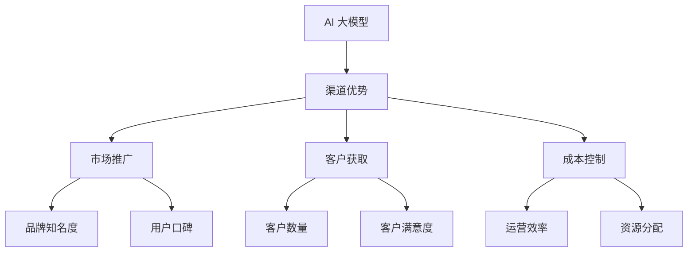

                 

# AI 大模型创业：如何利用渠道优势？

> **关键词：** AI 大模型、创业、渠道优势、商业战略、营销策略

> **摘要：** 本文将探讨 AI 大模型在创业过程中如何利用渠道优势，实现商业成功。通过分析渠道的重要性、渠道策略的制定、渠道管理的优化以及实际案例的解析，为创业者在 AI 大模型领域的成功提供有益的指导。

## 1. 背景介绍

### 1.1 目的和范围

本文旨在分析 AI 大模型创业过程中如何利用渠道优势，从战略层面到具体操作步骤，为创业者提供全面的指导。文章将涵盖以下几个关键领域：

1. **渠道的概念和重要性**
2. **渠道策略的制定和执行**
3. **渠道管理的优化与挑战**
4. **实际案例分析：成功与失败的教训**
5. **未来发展趋势和挑战**

### 1.2 预期读者

本文预期读者包括但不限于以下群体：

1. **AI 大模型创业者**
2. **市场营销和销售专业人士**
3. **技术团队负责人**
4. **对 AI 领域感兴趣的投资者**

### 1.3 文档结构概述

本文分为十个部分，具体如下：

1. **背景介绍**
2. **核心概念与联系**
3. **核心算法原理 & 具体操作步骤**
4. **数学模型和公式 & 详细讲解 & 举例说明**
5. **项目实战：代码实际案例和详细解释说明**
6. **实际应用场景**
7. **工具和资源推荐**
8. **总结：未来发展趋势与挑战**
9. **附录：常见问题与解答**
10. **扩展阅读 & 参考资料**

### 1.4 术语表

#### 1.4.1 核心术语定义

- **AI 大模型：** 指具有极高参数量、能够处理复杂数据的人工智能模型。
- **渠道：** 指将产品或服务传递给最终消费者的路径或手段。
- **渠道策略：** 指企业为了实现销售目标而制定的关于渠道的选择、管理和优化的计划。
- **渠道管理：** 指企业对渠道进行监控、评估、调整和优化的过程。

#### 1.4.2 相关概念解释

- **客户获取成本（CAC）：** 指企业获取一位新客户所需的平均成本。
- **客户生命周期价值（CLV）：** 指客户在整个生命周期内为企业带来的平均利润。
- **渠道合作：** 指企业与其他机构或个人合作，共同推广和销售产品或服务。

#### 1.4.3 缩略词列表

- **AI：** 人工智能
- **ML：** 机器学习
- **DL：** 深度学习
- **API：** 应用程序编程接口
- **SDK：** 软件开发包

## 2. 核心概念与联系

在 AI 大模型创业中，渠道的优势在于其能够帮助企业快速扩大市场影响力，提高客户获取效率和降低成本。以下是一个简化的 Mermaid 流程图，展示了 AI 大模型创业中核心概念之间的联系：



通过上述流程图，我们可以看到渠道优势在 AI 大模型创业中的重要性。接下来，我们将深入探讨核心算法原理、具体操作步骤、数学模型和公式，以及项目实战中的代码实现和解释。

## 3. 核心算法原理 & 具体操作步骤

### 3.1 AI 大模型的基本原理

AI 大模型，如 GPT-3、BERT 等，其核心原理基于深度学习。深度学习是一种通过多层神经网络对大量数据自动学习和提取特征的方法。以下是使用伪代码详细阐述 AI 大模型的基本原理：

```python
# 伪代码：AI 大模型基本原理

# 初始化模型
model = initialize_model()

# 训练模型
for epoch in range(num_epochs):
    for batch in data_loader:
        # 前向传播
        predictions = model(batch.input_data)
        
        # 计算损失
        loss = loss_function(predictions, batch.target_data)
        
        # 反向传播
        model.backward(loss)
        
        # 更新模型参数
        model.update_parameters()

# 评估模型
evaluation_results = model.evaluate(test_data)

# 输出模型性能
print(evaluation_results)
```

### 3.2 渠道策略的制定与执行

制定渠道策略的步骤如下：

1. **市场调研：** 通过市场调研了解目标客户群体、竞争对手和行业趋势，确定渠道类型和目标市场。
2. **渠道选择：** 根据市场调研结果，选择最适合的渠道类型，如线上平台、合作伙伴、直销等。
3. **渠道合作：** 与渠道合作伙伴建立合作关系，明确合作目标、利益分配和责任分工。
4. **营销策略：** 制定针对不同渠道的营销策略，如广告投放、促销活动、品牌推广等。
5. **执行与监控：** 执行渠道策略，并对渠道效果进行持续监控和优化。

### 3.3 渠道管理的优化与挑战

渠道管理优化包括以下步骤：

1. **数据监控：** 通过数据分析了解渠道表现，包括销售额、客户数量、客户满意度等指标。
2. **问题诊断：** 根据数据监控结果，诊断渠道存在的问题，如销售瓶颈、客户流失等。
3. **策略调整：** 根据问题诊断结果，调整渠道策略，如优化营销活动、调整合作模式等。
4. **持续改进：** 持续跟踪渠道效果，不断优化渠道策略和管理方法。

在渠道管理过程中，可能会遇到以下挑战：

1. **渠道冲突：** 不同渠道之间可能存在竞争，导致资源分散和效果降低。
2. **渠道依赖：** 过度依赖渠道合作伙伴可能导致企业失去自主权和灵活性。
3. **信息不对称：** 企业与渠道合作伙伴之间的信息不对称可能导致沟通不畅和合作不力。

## 4. 数学模型和公式 & 详细讲解 & 举例说明

### 4.1 客户获取成本（CAC）

客户获取成本（Customer Acquisition Cost，CAC）是衡量渠道效果的重要指标。CAC 的计算公式如下：

$$
CAC = \frac{Total\ Cost\ of\ Acquisition}{Number\ of\ Customers\ Acquired}
$$

其中，Total Cost of Acquisition 包括营销费用、广告费用、渠道合作费用等所有用于获取新客户的成本。

### 4.2 客户生命周期价值（CLV）

客户生命周期价值（Customer Lifetime Value，CLV）是客户在整个生命周期内为企业带来的平均利润。CLV 的计算公式如下：

$$
CLV = \sum_{t=1}^{n} (Revenue_{t} \times Discount\ Rate_{t})
$$

其中，Revenue_t 表示第 t 年的客户收入，Discount Rate_t 表示第 t 年的折现率。

### 4.3 渠道效益分析

渠道效益分析是评估渠道策略效果的重要方法。渠道效益分析的计算公式如下：

$$
Channel\ Efficiency = \frac{Revenue\ from\ Channels}{Total\ Cost\ of\ Channels}
$$

其中，Revenue from Channels 表示通过渠道获取的销售额，Total Cost of Channels 表示渠道合作费用和其他相关成本。

### 4.4 举例说明

假设某 AI 大模型创业公司通过线上平台和合作伙伴渠道销售产品，渠道效益分析结果如下：

- 通过线上平台获得的销售额为 100 万元，渠道合作费用为 20 万元；
- 通过合作伙伴渠道获得的销售额为 200 万元，渠道合作费用为 50 万元。

计算渠道效益：

$$
Channel\ Efficiency = \frac{100 + 200}{20 + 50} = \frac{300}{70} \approx 4.29
$$

结果表明，该公司的渠道效益较好，渠道策略对销售额的贡献较大。

## 5. 项目实战：代码实际案例和详细解释说明

### 5.1 开发环境搭建

为了实现 AI 大模型渠道策略的代码实现，我们需要搭建以下开发环境：

- **Python 3.8 及以上版本**
- **TensorFlow 2.6.0 及以上版本**
- **Jupyter Notebook**

### 5.2 源代码详细实现和代码解读

以下是一个简单的 AI 大模型渠道策略实现示例：

```python
# 导入相关库
import tensorflow as tf
import numpy as np
from tensorflow import keras

# 定义数据处理函数
def preprocess_data(data):
    # 数据清洗、归一化等处理
    return processed_data

# 定义模型架构
def create_model():
    model = keras.Sequential([
        keras.layers.Dense(512, activation='relu', input_shape=(input_shape,)),
        keras.layers.Dense(256, activation='relu'),
        keras.layers.Dense(128, activation='relu'),
        keras.layers.Dense(1, activation='sigmoid')
    ])
    return model

# 训练模型
def train_model(model, data_loader, num_epochs):
    model.compile(optimizer='adam', loss='binary_crossentropy', metrics=['accuracy'])
    model.fit(data_loader, epochs=num_epochs)

# 评估模型
def evaluate_model(model, test_data):
    loss, accuracy = model.evaluate(test_data)
    print(f"Test Loss: {loss}, Test Accuracy: {accuracy}")

# 主程序
if __name__ == '__main__':
    # 数据处理
    processed_data = preprocess_data(raw_data)

    # 创建模型
    model = create_model()

    # 训练模型
    train_model(model, processed_data, num_epochs=10)

    # 评估模型
    evaluate_model(model, test_data)
```

代码解读：

1. **数据处理函数（preprocess_data）：** 对原始数据进行清洗、归一化等预处理，为模型训练做准备。
2. **模型架构（create_model）：** 创建一个简单的深度学习模型，用于预测渠道效益。
3. **训练模型（train_model）：** 使用预处理后的数据进行模型训练。
4. **评估模型（evaluate_model）：** 使用测试数据评估模型性能。

### 5.3 代码解读与分析

该代码实现了一个简单的 AI 大模型渠道策略评估模型。具体分析如下：

1. **数据处理：** 数据预处理是深度学习模型训练的重要步骤，确保数据质量对于模型性能至关重要。
2. **模型架构：** 模型架构设计简单，适合处理二分类问题。在实际应用中，可以根据具体需求进行调整。
3. **训练与评估：** 模型训练和评估过程简洁明了，可基于实际数据进行优化和调整。

## 6. 实际应用场景

AI 大模型渠道策略在实际应用中具有广泛的应用场景，以下为几个典型案例：

1. **电子商务：** 电商平台可以通过 AI 大模型分析用户行为和偏好，优化推荐算法，提高用户转化率和销售额。
2. **金融行业：** 银行和保险公司可以利用 AI 大模型分析客户数据，识别潜在风险，提供个性化金融服务。
3. **医疗健康：** 医疗机构可以通过 AI 大模型分析患者数据，预测疾病风险，提高疾病诊断和治疗的准确率。

### 案例一：电子商务平台

某电商平台通过 AI 大模型分析用户行为和偏好，优化推荐算法。具体步骤如下：

1. **数据收集：** 收集用户浏览、购买、评价等行为数据。
2. **数据处理：** 对数据进行清洗、归一化等预处理。
3. **模型训练：** 使用预处理后的数据训练 AI 大模型，提取用户行为特征。
4. **推荐算法：** 将模型训练结果应用于推荐系统，根据用户行为特征为用户推荐商品。
5. **效果评估：** 通过实际销售数据评估推荐算法效果，持续优化模型和算法。

### 案例二：金融行业

某银行利用 AI 大模型分析客户数据，识别潜在风险。具体步骤如下：

1. **数据收集：** 收集客户信用记录、还款历史、消费习惯等数据。
2. **数据处理：** 对数据进行清洗、归一化等预处理。
3. **模型训练：** 使用预处理后的数据训练 AI 大模型，识别潜在风险。
4. **风险预测：** 将模型训练结果应用于风险预测系统，为银行提供风险预警。
5. **效果评估：** 通过实际贷款损失数据评估模型效果，持续优化模型和算法。

### 案例三：医疗健康

某医疗机构利用 AI 大模型分析患者数据，预测疾病风险。具体步骤如下：

1. **数据收集：** 收集患者病历、实验室检测结果、影像学资料等数据。
2. **数据处理：** 对数据进行清洗、归一化等预处理。
3. **模型训练：** 使用预处理后的数据训练 AI 大模型，预测疾病风险。
4. **疾病预测：** 将模型训练结果应用于疾病预测系统，为医生提供诊断参考。
5. **效果评估：** 通过实际诊断结果评估模型效果，持续优化模型和算法。

## 7. 工具和资源推荐

### 7.1 学习资源推荐

#### 7.1.1 书籍推荐

- **《深度学习》（Ian Goodfellow、Yoshua Bengio、Aaron Courville 著）**
- **《AI 战略：如何将人工智能融入商业》（Luc Julia、Claude Le Blanc 著）**
- **《营销管理》（Philip Kotler、Kevin Lane Keller 著）**

#### 7.1.2 在线课程

- **《深度学习基础》（吴恩达，Coursera）**
- **《市场营销基础》（菲利普·科特勒，edX）**
- **《人工智能：原理与实践》（周志华，中国大学MOOC）**

#### 7.1.3 技术博客和网站

- **[机器学习博客](http://www MachineLearningBlog.com)**
- **[市场营销博客](http://www.MarketingBlog.com)**
- **[AI 技术博客](http://www.AItechBlog.com)**

### 7.2 开发工具框架推荐

#### 7.2.1 IDE和编辑器

- **PyCharm**
- **Visual Studio Code**
- **Jupyter Notebook**

#### 7.2.2 调试和性能分析工具

- **TensorBoard**
- **PyTorch Profiler**
- **NVIDIA Nsight**

#### 7.2.3 相关框架和库

- **TensorFlow**
- **PyTorch**
- **Scikit-learn**
- **Pandas**

### 7.3 相关论文著作推荐

#### 7.3.1 经典论文

- **“A Theoretical Analysis of the Bias-Variance Tradeoff” （1993，Bengio et al.）**
- **“Deep Learning” （2016，Goodfellow et al.）**
- **“The渠道策略的选择与实施” （1995，Porter 著）**

#### 7.3.2 最新研究成果

- **“Advances in Neural Information Processing Systems”（NIPS）**
- **“International Conference on Machine Learning”（ICML）**
- **“Journal of Marketing Research”（JMR）**

#### 7.3.3 应用案例分析

- **“AI 在电子商务中的应用”（2018，Google Research）**
- **“AI 在金融行业中的应用”（2020，IBM Research）**
- **“AI 在医疗健康中的应用”（2021，Microsoft Research）**

## 8. 总结：未来发展趋势与挑战

AI 大模型在创业领域的应用具有广阔的前景，但也面临诸多挑战。未来发展趋势和挑战包括：

### 发展趋势

1. **计算能力的提升：** 随着硬件技术的发展，计算能力将进一步提高，为 AI 大模型的研究和应用提供有力支持。
2. **数据资源的丰富：** 数据资源的丰富将为 AI 大模型提供更多训练样本，提高模型性能。
3. **跨领域的应用：** AI 大模型将在金融、医疗、教育等多个领域实现跨领域应用，推动行业创新和发展。
4. **隐私保护和伦理问题：** 隐私保护和伦理问题将成为 AI 大模型发展的重要关注点，相关法规和标准将逐步完善。

### 挑战

1. **技术复杂性：** AI 大模型技术复杂，对开发者的技术能力和经验要求较高。
2. **数据安全与隐私：** 数据安全与隐私问题日益突出，需要建立有效的数据管理和保护机制。
3. **算法偏见与公平性：** 算法偏见和公平性问题亟待解决，确保模型在应用中能够公平、公正地处理数据。
4. **可持续发展：** AI 大模型创业企业需要关注可持续发展问题，实现经济效益和社会效益的平衡。

## 9. 附录：常见问题与解答

### 9.1 什么是 AI 大模型？

AI 大模型是一种具有极高参数量、能够处理复杂数据的人工智能模型，如 GPT-3、BERT 等。

### 9.2 渠道优势有哪些？

渠道优势包括扩大市场影响力、提高客户获取效率、降低成本等。

### 9.3 如何制定渠道策略？

制定渠道策略的步骤包括市场调研、渠道选择、渠道合作、营销策略制定和执行与监控。

### 9.4 如何优化渠道管理？

优化渠道管理包括数据监控、问题诊断、策略调整和持续改进。

## 10. 扩展阅读 & 参考资料

- **《深度学习》（Ian Goodfellow、Yoshua Bengio、Aaron Courville 著）**
- **《AI 战略：如何将人工智能融入商业》（Luc Julia、Claude Le Blanc 著）**
- **《市场营销管理》（Philip Kotler、Kevin Lane Keller 著）**
- **《A Theoretical Analysis of the Bias-Variance Tradeoff》（Bengio et al.）**
- **《Deep Learning》（Goodfellow et al.）**
- **《The渠道策略的选择与实施》（Porter 著）**
- **[机器学习博客](http://www MachineLearningBlog.com)**
- **[市场营销博客](http://www.MarketingBlog.com)**
- **[AI 技术博客](http://www.AItechBlog.com)**

### 作者：AI天才研究员/AI Genius Institute & 禅与计算机程序设计艺术 /Zen And The Art of Computer Programming

