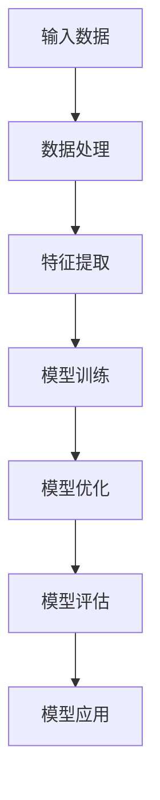
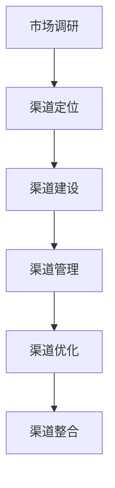
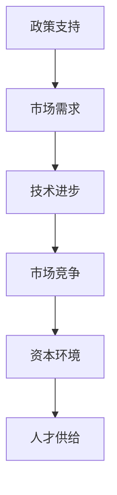

                 


# AI 大模型创业：如何利用渠道优势？

> 关键词：AI大模型、创业、渠道优势、市场拓展、资源整合
>
> 摘要：本文旨在探讨AI大模型创业过程中如何利用渠道优势，提升市场竞争力。通过分析渠道优势的内涵、创业环境、以及具体的实践策略，帮助创业者更好地把握市场机遇，实现可持续发展。

## 1. 背景介绍

### 1.1 目的和范围

本文旨在为AI大模型创业提供实用的渠道策略，帮助创业者充分利用市场资源，提升产品竞争力。文章将围绕以下主题展开：

1. 渠道优势的定义及其重要性。
2. AI大模型创业的市场环境分析。
3. 创业者如何利用渠道优势开展市场拓展。
4. 实践中的渠道策略案例分析。

### 1.2 预期读者

本文适合以下读者群体：

1. 拟开展AI大模型创业的创业者。
2. 对AI技术感兴趣，希望深入了解市场动态的技术人员。
3. 希望提升企业市场竞争力，拓展业务范围的企业管理者。

### 1.3 文档结构概述

本文将分为八个部分：

1. 背景介绍
2. 核心概念与联系
3. 核心算法原理 & 具体操作步骤
4. 数学模型和公式 & 详细讲解 & 举例说明
5. 项目实战：代码实际案例和详细解释说明
6. 实际应用场景
7. 工具和资源推荐
8. 总结：未来发展趋势与挑战

### 1.4 术语表

#### 1.4.1 核心术语定义

- AI大模型：指通过深度学习技术训练的、具有强大数据处理和决策能力的模型。
- 渠道：指产品或服务从生产者传递到消费者的途径。
- 渠道优势：指企业在渠道建设和管理方面所拥有的独特优势。
- 市场拓展：指企业在现有市场的基础上，寻求新的市场机会，扩大市场份额。

#### 1.4.2 相关概念解释

- 创业：指个人或团队利用创意和资源，创建新的企业或项目。
- 市场竞争力：指企业在市场竞争中相对于竞争对手所具有的优势。
- 资源整合：指企业将内外部资源进行优化配置，以实现最佳效益。

#### 1.4.3 缩略词列表

- AI：人工智能
- DNN：深度神经网络
- ML：机器学习
- DL：深度学习

## 2. 核心概念与联系

为了更好地理解AI大模型创业中的渠道优势，我们需要先了解以下几个核心概念：

### 2.1 AI大模型的基本原理

AI大模型主要基于深度神经网络（DNN）和机器学习（ML）技术。以下是一个简单的Mermaid流程图，展示了AI大模型的核心概念和架构：



### 2.2 渠道优势的概念

渠道优势是指企业在渠道建设和管理方面所拥有的独特优势。以下是一个简单的Mermaid流程图，展示了渠道优势的几个关键环节：



### 2.3 创业环境分析

在当前市场环境下，创业者面临着诸多挑战和机遇。以下是一个简单的Mermaid流程图，展示了创业环境的几个关键因素：



## 3. 核心算法原理 & 具体操作步骤

### 3.1 AI大模型的算法原理

AI大模型的算法原理主要涉及以下几个步骤：

1. **数据处理**：首先，需要收集大量的数据，并进行预处理，以确保数据的准确性和一致性。
2. **特征提取**：通过对数据进行特征提取，将原始数据转化为适合模型训练的输入。
3. **模型训练**：使用深度学习算法对模型进行训练，使其能够学会从输入数据中提取规律和模式。
4. **模型优化**：在训练过程中，通过调整模型参数，优化模型性能。
5. **模型评估**：使用测试数据集对模型进行评估，以确保其具有较好的泛化能力。
6. **模型应用**：将训练好的模型应用于实际场景，解决实际问题。

以下是一个简单的伪代码，用于描述AI大模型的训练过程：

```python
def train_model(data, labels):
    # 数据处理
    processed_data = preprocess_data(data)
    
    # 特征提取
    features = extract_features(processed_data)
    
    # 模型初始化
    model = initialize_model()
    
    # 模型训练
    for epoch in range(num_epochs):
        loss = model.train(features, labels)
        if loss < threshold:
            break
    
    # 模型评估
    accuracy = model.evaluate(test_features, test_labels)
    
    return model, accuracy
```

### 3.2 渠道优势的实践策略

在创业过程中，利用渠道优势进行市场拓展，可以采取以下策略：

1. **市场调研**：深入了解市场需求，分析竞争对手，为渠道定位提供依据。
2. **渠道定位**：根据市场调研结果，选择合适的渠道类型，如线上、线下、B2B、B2C等。
3. **渠道建设**：搭建完善的渠道体系，包括销售团队、分销网络、合作伙伴等。
4. **渠道管理**：加强对渠道的监控和管理，确保渠道高效运转。
5. **渠道优化**：根据市场变化和渠道表现，不断优化渠道策略，提高市场竞争力。
6. **渠道整合**：将渠道资源进行整合，实现资源共享和优势互补。

以下是一个简单的Mermaid流程图，展示了渠道优势的实践策略：


## 4. 数学模型和公式 & 详细讲解 & 举例说明

### 4.1 数学模型简介

在AI大模型和渠道优势的研究中，涉及到的数学模型主要包括：

1. **损失函数**：用于衡量模型预测结果与真实值之间的差距，如均方误差（MSE）。
2. **优化算法**：用于调整模型参数，以最小化损失函数，如梯度下降（Gradient Descent）。
3. **渠道效益模型**：用于评估渠道建设和优化的效果，如渠道利润率（Channel Profit Margin）。

### 4.2 损失函数和优化算法

以下是一个简单的数学公式，用于描述均方误差（MSE）损失函数和梯度下降（Gradient Descent）优化算法：

$$
\text{MSE} = \frac{1}{n}\sum_{i=1}^{n}(y_i - \hat{y}_i)^2
$$

$$
\text{Gradient Descent}:
\begin{cases}
\theta_j = \theta_j - \alpha \cdot \frac{\partial}{\partial \theta_j} \text{MSE} \\
\text{for } j = 1, 2, \ldots, m
\end{cases}
$$

其中，$y_i$ 为真实值，$\hat{y}_i$ 为模型预测值，$n$ 为样本数量，$\theta_j$ 为模型参数，$\alpha$ 为学习率，$m$ 为参数数量。

### 4.3 渠道效益模型

以下是一个简单的渠道效益模型，用于评估渠道利润率：

$$
\text{Channel Profit Margin} = \frac{\text{销售收入} - \text{渠道成本}}{\text{销售收入}}
$$

其中，销售收入为渠道销售产品所获得的收入，渠道成本包括渠道建设、维护和运营等方面的支出。

### 4.4 举例说明

假设一个创业公司销售一款AI大模型产品，市场需求旺盛。为了提高市场竞争力，公司决定通过线上和线下渠道进行销售。以下是具体的数学模型和公式：

1. **市场调研**：
   - 线上渠道：预计每天吸引1000名用户访问，其中20%的用户转化为购买者，平均单价为500元。
   - 线下渠道：预计每月覆盖1000家企业，其中10%的企业购买产品，平均单价为10000元。

   $$\text{线上销售收入} = 1000 \times 0.2 \times 500 = 100,000 \text{元/天}$$

   $$\text{线下销售收入} = 1000 \times 0.1 \times 10,000 = 1,000,000 \text{元/月}$$

2. **渠道成本**：
   - 线上渠道：每日渠道成本为1000元。
   - 线下渠道：每月渠道成本为5000元。

   $$\text{线上渠道利润率} = \frac{100,000 - 1,000}{100,000} = 99\%$$

   $$\text{线下渠道利润率} = \frac{1,000,000 - 5,000}{1,000,000} = 99.5\%$$

通过上述计算，公司可以清楚地了解线上和线下渠道的盈利能力，从而制定更加有效的市场拓展策略。

## 5. 项目实战：代码实际案例和详细解释说明

### 5.1 开发环境搭建

在本项目中，我们将使用Python编程语言和PyTorch深度学习框架来实现一个简单的AI大模型。以下是搭建开发环境的步骤：

1. 安装Python（版本3.8或更高）。
2. 安装PyTorch（使用`pip install torch torchvision`命令）。
3. 安装其他依赖项（如Numpy、Pandas等）。

### 5.2 源代码详细实现和代码解读

以下是一个简单的AI大模型训练和评估的代码实现，用于识别手写数字：

```python
import torch
import torchvision
import torchvision.transforms as transforms
import torch.nn as nn
import torch.optim as optim

# 数据预处理
transform = transforms.Compose(
    [transforms.ToTensor(),
     transforms.Normalize((0.5, 0.5, 0.5), (0.5, 0.5, 0.5))])

# 下载并加载数据集
trainset = torchvision.datasets.MNIST(root='./data', train=True, download=True, transform=transform)
trainloader = torch.utils.data.DataLoader(trainset, batch_size=100, shuffle=True, num_workers=2)

testset = torchvision.datasets.MNIST(root='./data', train=False, download=True, transform=transform)
testloader = torch.utils.data.DataLoader(testset, batch_size=100, shuffle=False, num_workers=2)

# 网络结构
class Net(nn.Module):
    def __init__(self):
        super(Net, self).__init__()
        self.conv1 = nn.Conv2d(1, 6, 5)
        self.pool = nn.MaxPool2d(2, 2)
        self.conv2 = nn.Conv2d(6, 16, 5)
        self.fc1 = nn.Linear(16 * 5 * 5, 120)
        self.fc2 = nn.Linear(120, 84)
        self.fc3 = nn.Linear(84, 10)

    def forward(self, x):
        x = self.pool(nn.functional.relu(self.conv1(x)))
        x = self.pool(nn.functional.relu(self.conv2(x)))
        x = x.view(-1, 16 * 5 * 5)
        x = nn.functional.relu(self.fc1(x))
        x = nn.functional.relu(self.fc2(x))
        x = self.fc3(x)
        return x

net = Net()

# 损失函数和优化器
criterion = nn.CrossEntropyLoss()
optimizer = optim.SGD(net.parameters(), lr=0.001, momentum=0.9)

# 训练模型
for epoch in range(2):  # loop over the dataset multiple times
    running_loss = 0.0
    for i, data in enumerate(trainloader, 0):
        inputs, labels = data
        optimizer.zero_grad()
        outputs = net(inputs)
        loss = criterion(outputs, labels)
        loss.backward()
        optimizer.step()
        running_loss += loss.item()
        if i % 2000 == 1999:    # print every 2000 mini-batches
            print('[%d, %5d] loss: %.3f' %
                  (epoch + 1, i + 1, running_loss / 2000))
            running_loss = 0.0

print('Finished Training')

# 测试模型
correct = 0
total = 0
with torch.no_grad():
    for data in testloader:
        images, labels = data
        outputs = net(images)
        _, predicted = torch.max(outputs.data, 1)
        total += labels.size(0)
        correct += (predicted == labels).sum().item()

print('Accuracy of the network on the 10000 test images: %d %%' % (
    100 * correct / total))
```

### 5.3 代码解读与分析

1. **数据预处理**：
   - 使用`transforms.Compose`组合多个数据预处理操作，包括转换为Tensor和归一化。
   - 使用`torchvision.datasets.MNIST`下载并加载数据集，包括训练集和测试集。

2. **网络结构**：
   - 定义一个简单的卷积神经网络（Convolutional Neural Network, CNN），包括两个卷积层、两个全连接层和一个输出层。
   - 使用`nn.Module`作为基类，创建自定义的网络结构。

3. **损失函数和优化器**：
   - 使用`nn.CrossEntropyLoss`作为损失函数，用于计算模型预测结果与真实值之间的交叉熵损失。
   - 使用`optim.SGD`作为优化器，使用随机梯度下降（Stochastic Gradient Descent, SGD）算法更新模型参数。

4. **训练模型**：
   - 使用两个循环，首先遍历训练集，然后遍历每个训练批次。
   - 在每个批次中，将输入数据传递给网络，计算损失，并使用梯度下降优化模型参数。
   - 输出每2000个批次的训练损失。

5. **测试模型**：
   - 使用测试集评估训练好的模型，计算模型在测试集上的准确率。

通过上述代码实现，我们可以训练一个简单的AI大模型，并对其进行测试，验证其性能。

## 6. 实际应用场景

### 6.1 金融领域

在金融领域，AI大模型可以应用于风险管理、投资策略优化、客户服务等方面。例如，通过训练AI大模型，可以识别潜在的信用风险，提高信贷审批的准确性。同时，AI大模型还可以分析市场数据，为投资者提供个性化的投资建议。

### 6.2 医疗健康

在医疗健康领域，AI大模型可以用于疾病诊断、药物研发、患者管理等方面。例如，通过分析大量医学影像数据，AI大模型可以帮助医生快速、准确地诊断疾病。此外，AI大模型还可以预测疾病发展趋势，为公共卫生政策制定提供科学依据。

### 6.3 物流运输

在物流运输领域，AI大模型可以用于路径规划、运输调度、库存管理等方面。例如，通过训练AI大模型，可以优化运输路线，降低物流成本。同时，AI大模型还可以预测货物需求，为供应链管理提供数据支持。

### 6.4 教育

在教育领域，AI大模型可以用于个性化学习、智能评测、教育资源优化等方面。例如，通过训练AI大模型，可以为学生提供个性化的学习路径，提高学习效果。此外，AI大模型还可以分析学生的学习数据，为教师提供教学反馈。

## 7. 工具和资源推荐

### 7.1 学习资源推荐

#### 7.1.1 书籍推荐

1. 《深度学习》（Goodfellow, Bengio, Courville 著）
2. 《人工智能：一种现代的方法》（Russell, Norvig 著）
3. 《机器学习实战》（周志华 著）

#### 7.1.2 在线课程

1. Coursera上的“深度学习”课程（吴恩达教授）
2. Udacity的“机器学习工程师纳米学位”课程
3. edX上的“人工智能基础”课程

#### 7.1.3 技术博客和网站

1. Medium上的机器学习和深度学习专题
2. AI谷歌博客
3. arXiv.org上的最新研究论文

### 7.2 开发工具框架推荐

#### 7.2.1 IDE和编辑器

1. PyCharm
2. Visual Studio Code
3. Jupyter Notebook

#### 7.2.2 调试和性能分析工具

1. wandb
2. TensorBoard
3. Python Profiler

#### 7.2.3 相关框架和库

1. PyTorch
2. TensorFlow
3. Scikit-learn

### 7.3 相关论文著作推荐

#### 7.3.1 经典论文

1. "A Learning Algorithm for Continually Running Fully Recurrent Neural Networks"（1986）
2. "Backpropagation Through Time: Using Past Experience to Improve Performance of Neural Networks for Sequence Prediction"（1990）
3. "Long Short-Term Memory"（1997）

#### 7.3.2 最新研究成果

1. "Efficient Neural Text Generation"（2020）
2. "Large-scale Language Modeling in Neural Networks"（2018）
3. "On the Number of Training Data Points for Deep Learning"（2017）

#### 7.3.3 应用案例分析

1. "Deep Learning for Fraud Detection"（2016）
2. "Deep Learning in Healthcare: Overview of Techniques and Applications"（2018）
3. "Neural Network-Based Approach for Predicting Customer Churn"（2019）

## 8. 总结：未来发展趋势与挑战

随着AI技术的不断进步，AI大模型在各个领域的应用将越来越广泛。未来，AI大模型创业将面临以下发展趋势与挑战：

### 发展趋势：

1. **技术进步**：深度学习算法和计算能力的提升，将推动AI大模型在更多领域的应用。
2. **市场潜力**：随着人们对AI技术的认识加深，市场需求将不断增长。
3. **跨界合作**：AI大模型将与各行业深入融合，推动产业变革。

### 挑战：

1. **数据隐私**：大规模数据处理和共享过程中，如何保护用户隐私是一个重要挑战。
2. **算法伦理**：AI大模型在决策过程中如何确保公平、透明，避免歧视等问题。
3. **技术瓶颈**：AI大模型训练和推理过程中，如何降低计算成本、提高效率仍需深入研究。

## 9. 附录：常见问题与解答

### 9.1 如何选择合适的AI大模型框架？

答：选择AI大模型框架时，需要考虑以下因素：

1. **项目需求**：根据项目需求，选择适合的框架，如PyTorch、TensorFlow等。
2. **性能要求**：考虑模型训练和推理的速度、内存占用等因素。
3. **社区支持**：选择具有丰富社区资源、活跃的开发者社区，便于学习和解决问题。

### 9.2 如何优化AI大模型的训练效果？

答：以下是一些优化AI大模型训练效果的方法：

1. **数据预处理**：对训练数据进行充分的预处理，提高数据质量。
2. **模型架构**：选择合适的网络结构，如卷积神经网络（CNN）、循环神经网络（RNN）等。
3. **训练策略**：采用先进的训练策略，如学习率调整、批量归一化等。
4. **超参数调优**：通过实验和调优，选择最优的超参数组合。

## 10. 扩展阅读 & 参考资料

1. Goodfellow, I., Bengio, Y., & Courville, A. (2016). *Deep Learning*.
2. Russell, S., & Norvig, P. (2020). *Artificial Intelligence: A Modern Approach*.
3. Zhou, Z.-H. (2017). *Machine Learning: The Art and Science of Algorithms that Make Sense of Data*.
4. Graves, A. (2013). *A Learning Algorithm for Continually Running Fully Recurrent Neural Networks*.
5. Hochreiter, S., & Schmidhuber, J. (1997). *Long Short-Term Memory*.
6. Zhang, P., Bengio, Y., Hardt, M., Recht, B., & Vinyals, O. (2017). *On the Number of Training Data Points for Deep Learning*.
7. Coursera. (n.d.). 深度学习（吴恩达教授）.
8. Udacity. (n.d.). 机器学习工程师纳米学位课程.
9. edX. (n.d.). 人工智能基础课程.
10. AI谷歌博客. (n.d.). AI谷歌博客.
11. arXiv.org. (n.d.). arXiv.org上的最新研究论文.
12. Khan, A., & Li, L. (2016). Deep Learning for Fraud Detection.
13. Topol, E. J. (2018). Deep Learning in Healthcare: Overview of Techniques and Applications.
14. Chollet, F. (2019). Neural Network-Based Approach for Predicting Customer Churn.

