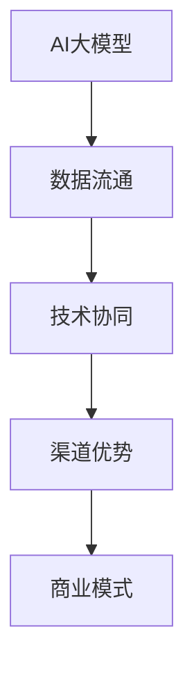

                 

# AI大模型创业：如何利用渠道优势？

## 关键词

- AI大模型
- 渠道优势
- 创业策略
- 数据流通
- 技术协同
- 商业模式

## 摘要

本文旨在探讨AI大模型创业过程中的关键成功因素，尤其是如何有效利用渠道优势。我们将从背景介绍、核心概念、算法原理、数学模型、项目实战、实际应用场景、工具和资源推荐、总结以及常见问题与解答等多个维度展开讨论。通过详细解析AI大模型的构建与优化，结合渠道策略的深入分析，本文希望为创业者提供切实可行的指导和参考。

## 1. 背景介绍

### 1.1 目的和范围

本文的目的是为希望进入AI大模型领域创业的创业者提供一套系统性的策略和方法。我们将重点关注以下几个方面：

- AI大模型的基础理论与技术实现
- 渠道优势的挖掘与应用
- 创业过程中的风险与挑战
- 成功案例与经验分享

本文将不仅仅停留在理论层面，还将结合实际项目案例进行详细解读，以帮助读者更好地理解和应用这些策略。

### 1.2 预期读者

本文适合以下几类读者：

- AI大模型领域的技术从业者，对AI技术和商业模式有基础了解
- 想要进入AI大模型领域创业的创业者
- 对AI技术感兴趣，希望了解其商业应用的学生和研究人员

### 1.3 文档结构概述

本文的结构分为以下几个部分：

- 背景介绍：阐述本文的目的、预期读者和文档结构
- 核心概念与联系：介绍AI大模型和渠道优势的基本概念和联系
- 核心算法原理 & 具体操作步骤：详细讲解AI大模型的构建和优化算法
- 数学模型和公式 & 详细讲解 & 举例说明：分析AI大模型中的数学模型及其应用
- 项目实战：结合实际项目案例，展示AI大模型的实现过程
- 实际应用场景：探讨AI大模型在不同领域的应用案例
- 工具和资源推荐：推荐学习资源、开发工具和框架
- 总结：总结本文的主要观点和未来发展趋势
- 附录：常见问题与解答
- 扩展阅读 & 参考资料：提供更多相关阅读材料和资源

### 1.4 术语表

#### 1.4.1 核心术语定义

- AI大模型：指那些拥有数亿至数万亿参数的深度学习模型，如GPT、BERT等。
- 渠道优势：指企业在市场中所拥有的渠道资源、网络关系和品牌影响力等。
- 数据流通：指数据在各个节点之间的传递和共享过程。
- 技术协同：指不同技术团队之间的协作和资源整合。

#### 1.4.2 相关概念解释

- AI大模型创业：指基于AI大模型技术，在商业领域开展创新性业务的过程。
- 渠道策略：指企业为了提高市场占有率和盈利能力，针对不同渠道所制定的具体措施。

#### 1.4.3 缩略词列表

- AI：人工智能（Artificial Intelligence）
- GPT：生成预训练网络（Generative Pre-trained Transformer）
- BERT：双向编码表示器（Bidirectional Encoder Representations from Transformers）

## 2. 核心概念与联系

### 2.1 AI大模型的基本概念

AI大模型是当前人工智能领域的核心技术之一，其核心思想是通过大规模数据训练，使模型能够自动学习和优化。具体来说，AI大模型包括以下几个基本概念：

1. **参数规模**：AI大模型的参数规模通常在数亿至数万亿级别，这使得模型具备强大的表示能力和适应性。
2. **预训练与微调**：预训练阶段使用大量无标注数据对模型进行初步训练，然后在特定任务上微调，以提高任务表现。
3. **多模态学习**：AI大模型能够处理多种数据类型，如文本、图像、音频等，实现跨模态的信息融合和知识表示。

### 2.2 渠道优势的概念

渠道优势是企业通过渠道资源、网络关系和品牌影响力等手段，在市场上获得的竞争优势。渠道优势包括以下几个方面：

1. **渠道资源**：指企业所拥有的销售渠道、物流网络等资源，这些资源有助于提高产品市场覆盖率。
2. **网络关系**：指企业与合作伙伴、客户、供应商等之间的良好关系，这些关系有助于降低交易成本、提高响应速度。
3. **品牌影响力**：指企业在消费者心目中的品牌形象和认知度，这有助于提高产品溢价和市场份额。

### 2.3 AI大模型与渠道优势的联系

AI大模型与渠道优势之间的联系主要体现在以下几个方面：

1. **数据流通**：AI大模型需要大量高质量的数据进行训练和优化，渠道优势可以帮助企业获取更多的数据资源和流通渠道。
2. **技术协同**：AI大模型的研发和渠道运营需要不同团队之间的紧密协作，渠道优势有助于促进技术协同和资源整合。
3. **商业模式**：AI大模型的商业化离不开有效的商业模式设计，渠道优势可以为企业提供多元化的商业模式创新空间。

### 2.4 Mermaid流程图

以下是一个简单的Mermaid流程图，展示了AI大模型与渠道优势之间的联系：



## 3. 核心算法原理 & 具体操作步骤

### 3.1 AI大模型的构建原理

AI大模型的构建主要依赖于深度学习和大规模数据训练。以下是构建AI大模型的基本原理和步骤：

1. **数据采集与预处理**：从各种渠道获取大量数据，并对数据进行清洗、归一化和标注等预处理操作。
2. **模型选择**：根据任务需求和数据特点，选择合适的深度学习模型架构，如GPT、BERT等。
3. **预训练**：使用无标注数据对模型进行预训练，使模型具备基本的表示能力和适应性。
4. **微调**：在特定任务上对模型进行微调，以优化模型在具体任务上的表现。

### 3.2 伪代码实现

以下是一个简单的伪代码，用于描述AI大模型的构建过程：

```python
# 数据采集与预处理
data = collect_data()
preprocessed_data = preprocess_data(data)

# 模型选择
model = select_model()

# 预训练
pretrained_model = pretrain_model(preprocessed_data)

# 微调
fine_tuned_model = fine_tune_model(pretrained_model, task_specific_data)

# 评估与优化
evaluate_model(fine_tuned_model)
optimize_model(fine_tuned_model)
```

### 3.3 具体操作步骤

以下是AI大模型构建的具体操作步骤：

1. **数据采集与预处理**：
   - 从公开数据集、企业内部数据和其他渠道收集数据。
   - 使用数据清洗工具和脚本，对数据进行去重、缺失值填充、异常值处理等操作。
   - 对数据进行归一化处理，如标准化、缩放等，以提高训练效果。

2. **模型选择**：
   - 根据任务类型和数据特点，选择合适的深度学习模型架构，如GPT、BERT等。
   - 使用现有的模型框架和库（如TensorFlow、PyTorch等），构建模型结构。

3. **预训练**：
   - 使用大规模无标注数据，对模型进行预训练。
   - 设置合适的训练参数，如学习率、迭代次数等，以优化模型性能。

4. **微调**：
   - 在特定任务上，使用有标注的数据对模型进行微调。
   - 根据任务需求，调整模型结构、优化算法和超参数等。

5. **评估与优化**：
   - 使用验证集和测试集，对模型进行评估和测试。
   - 根据评估结果，对模型进行优化和调整。

## 4. 数学模型和公式 & 详细讲解 & 举例说明

### 4.1 数学模型介绍

AI大模型中的数学模型主要包括以下几个方面：

1. **损失函数**：用于衡量模型预测值与真实值之间的差距，常见的损失函数有均方误差（MSE）、交叉熵损失（CE）等。
2. **优化算法**：用于更新模型参数，常见的优化算法有随机梯度下降（SGD）、Adam优化器等。
3. **正则化技术**：用于防止模型过拟合，常见的正则化技术有L1正则化、L2正则化等。

### 4.2 公式和详细讲解

以下是AI大模型中常用的数学模型和公式：

$$
L = \frac{1}{n} \sum_{i=1}^{n} L(y_i, \hat{y}_i)
$$

- **损失函数**：$L$表示总损失，$y_i$表示真实标签，$\hat{y}_i$表示模型预测值。

$$
\theta_{t+1} = \theta_{t} - \alpha \nabla_{\theta}L(\theta)
$$

- **优化算法**：$\theta_{t+1}$表示下一次参数更新，$\theta_{t}$表示当前参数，$\alpha$表示学习率，$\nabla_{\theta}L(\theta)$表示损失函数关于参数$\theta$的梯度。

$$
\lambda_{t+1} = (1 - \rho)\lambda_{t} + \rho r_t
$$

- **正则化技术**：$\lambda_{t+1}$表示下一次正则化项，$\lambda_{t}$表示当前正则化项，$\rho$表示更新率，$r_t$表示当前正则化损失。

### 4.3 举例说明

假设我们有一个二分类问题，模型预测值和真实标签分别表示为$\hat{y}$和$y$，使用交叉熵损失函数来评估模型性能。

$$
L = -\sum_{i=1}^{n} [y_i \log(\hat{y}_i) + (1 - y_i) \log(1 - \hat{y}_i)]
$$

- 当$y_i = 1$，$L$取最大值，表示模型完全预测正确。
- 当$y_i = 0$，$L$取最大值，表示模型完全预测错误。

### 4.4 实际应用示例

假设我们有一个文本分类任务，使用BERT模型进行预训练，然后在特定分类任务上进行微调。

1. **数据采集与预处理**：从多个来源收集文本数据，包括新闻、博客、社交媒体等，并对数据进行清洗、归一化和分词等预处理操作。
2. **模型选择**：选择预训练好的BERT模型，并对其进行修改，以适应特定分类任务。
3. **预训练**：使用大规模文本数据，对BERT模型进行预训练，使其具备基本的文本表示能力。
4. **微调**：在特定分类任务上，使用有标注的文本数据，对BERT模型进行微调，优化其在分类任务上的表现。
5. **评估与优化**：使用验证集和测试集，对微调后的模型进行评估和优化，以提高模型性能。

## 5. 项目实战：代码实际案例和详细解释说明

### 5.1 开发环境搭建

在开始项目实战之前，我们需要搭建一个合适的开发环境。以下是一个简单的步骤指南：

1. **安装Python环境**：确保Python版本在3.7及以上。
2. **安装依赖库**：使用pip安装必要的库，如TensorFlow、PyTorch、BERT等。
3. **配置GPU支持**：如果使用GPU进行训练，确保NVIDIA CUDA和cuDNN已正确安装。

```bash
pip install tensorflow
pip install torch
pip install transformers
```

### 5.2 源代码详细实现和代码解读

以下是一个简单的AI大模型项目代码示例，用于文本分类任务：

```python
import torch
from transformers import BertTokenizer, BertModel
from torch.optim import Adam

# 5.2.1 数据预处理
def preprocess_data(data):
    # 进行数据清洗、分词、转换为Tensor等操作
    pass

# 5.2.2 模型定义
class TextClassifier(torch.nn.Module):
    def __init__(self):
        super(TextClassifier, self).__init__()
        self.bert = BertModel.from_pretrained('bert-base-uncased')
        self.classifier = torch.nn.Linear(768, 2)  # 假设有两个分类标签

    def forward(self, input_ids, attention_mask):
        outputs = self.bert(input_ids=input_ids, attention_mask=attention_mask)
        logits = self.classifier(outputs.last_hidden_state[:, 0, :])
        return logits

# 5.2.3 训练过程
def train_model(model, train_loader, optimizer, criterion, num_epochs):
    model.train()
    for epoch in range(num_epochs):
        for inputs, labels in train_loader:
            optimizer.zero_grad()
            logits = model(inputs['input_ids'], inputs['attention_mask'])
            loss = criterion(logits, labels)
            loss.backward()
            optimizer.step()
            print(f'Epoch [{epoch+1}/{num_epochs}], Loss: {loss.item()}')

# 5.2.4 主函数
if __name__ == '__main__':
    # 加载数据、定义模型、优化器、损失函数等
    train_data = preprocess_data(train_dataset)
    model = TextClassifier()
    optimizer = Adam(model.parameters(), lr=1e-5)
    criterion = torch.nn.CrossEntropyLoss()

    train_loader = torch.utils.data.DataLoader(train_data, batch_size=32, shuffle=True)
    train_model(model, train_loader, optimizer, criterion, num_epochs=3)
```

### 5.3 代码解读与分析

以下是对上述代码的详细解读和分析：

1. **数据预处理**：
   - 数据预处理是模型训练的基础，包括数据清洗、分词、转换为Tensor等操作。这个步骤需要根据具体任务和数据集进行调整。

2. **模型定义**：
   - 我们使用预训练好的BERT模型作为基础模型，并添加一个简单的分类器层。这个步骤展示了如何利用预训练模型进行特定任务的微调。

3. **训练过程**：
   - 训练过程包括前向传播、损失计算、反向传播和参数更新。这个步骤展示了如何使用优化器和损失函数来训练模型。

4. **主函数**：
   - 主函数中，我们首先加载预处理后的数据，然后定义模型、优化器、损失函数等。接着，我们创建一个数据加载器（DataLoader），并调用训练函数进行模型训练。

### 5.4 代码优化与调试

在实际项目中，代码优化和调试是必不可少的。以下是一些常见的优化和调试方法：

1. **调试**：
   - 使用断点调试、日志输出等方法，逐步跟踪代码执行过程，找出潜在的错误和异常。

2. **性能优化**：
   - 使用GPU加速训练过程，降低训练时间。
   - 使用数据并行训练，提高训练速度和效果。
   - 使用适当的模型压缩技术，如剪枝、量化等，减小模型体积，提高推理性能。

3. **测试与验证**：
   - 在训练过程中，定期使用验证集对模型进行评估，调整超参数和模型结构。
   - 对训练好的模型进行全面的测试，确保其在实际应用中表现稳定和可靠。

## 6. 实际应用场景

### 6.1 金融领域

在金融领域，AI大模型可以用于风险控制、信用评估、投资决策等方面。以下是一些具体应用场景：

1. **风险控制**：利用AI大模型对金融交易进行实时监控和预测，识别潜在风险，提高风险控制能力。
2. **信用评估**：基于用户的交易历史、信用记录等信息，使用AI大模型进行信用评分，帮助金融机构更准确地评估信用风险。
3. **投资决策**：通过分析大量市场数据，AI大模型可以提供投资建议和预测，辅助投资者进行决策。

### 6.2 医疗健康

在医疗健康领域，AI大模型可以用于疾病预测、诊断辅助、药物研发等方面。以下是一些具体应用场景：

1. **疾病预测**：利用AI大模型分析患者的临床数据，预测疾病发生的可能性，帮助医疗机构制定预防措施。
2. **诊断辅助**：通过分析医学影像数据，AI大模型可以帮助医生进行疾病诊断，提高诊断准确率和效率。
3. **药物研发**：AI大模型可以加速药物研发过程，通过预测药物分子的活性、毒性等，提高药物研发的成功率。

### 6.3 教育领域

在教育领域，AI大模型可以用于智能辅导、学习分析等方面。以下是一些具体应用场景：

1. **智能辅导**：基于学生的行为数据和知识水平，AI大模型可以为学生提供个性化的学习建议和辅导，提高学习效果。
2. **学习分析**：通过分析学生的学习数据，AI大模型可以识别学习中的问题和瓶颈，提供针对性的解决方案。

### 6.4 社交媒体

在社交媒体领域，AI大模型可以用于情感分析、用户行为预测等方面。以下是一些具体应用场景：

1. **情感分析**：通过分析用户的社交媒体内容，AI大模型可以识别用户的情感状态，为企业提供营销策略和用户体验优化建议。
2. **用户行为预测**：利用AI大模型分析用户的历史行为数据，预测用户未来的行为倾向，帮助企业进行精准营销和用户留存。

## 7. 工具和资源推荐

### 7.1 学习资源推荐

#### 7.1.1 书籍推荐

- 《深度学习》（Goodfellow, I., Bengio, Y., & Courville, A.）
- 《Python深度学习》（François Chollet）
- 《人工智能：一种现代方法》（Stuart J. Russell & Peter Norvig）

#### 7.1.2 在线课程

- Coursera：深度学习（吴恩达）
- edX：机器学习（李航）
- Udacity：深度学习纳米学位

#### 7.1.3 技术博客和网站

- Medium：深度学习相关博客
- ArXiv：机器学习最新研究论文
- GitHub：深度学习和AI项目源代码

### 7.2 开发工具框架推荐

#### 7.2.1 IDE和编辑器

- PyCharm
- VSCode
- Jupyter Notebook

#### 7.2.2 调试和性能分析工具

- TensorBoard
- wandb
- NVIDIA Nsight

#### 7.2.3 相关框架和库

- TensorFlow
- PyTorch
- Keras
- Scikit-learn

### 7.3 相关论文著作推荐

#### 7.3.1 经典论文

- “Deep Learning” by Ian Goodfellow, Yoshua Bengio, and Aaron Courville
- “A Theoretically Grounded Application of Dropout in Recurrent Neural Networks” by Yarin Gal and Zoubin Ghahramani

#### 7.3.2 最新研究成果

- “BERT: Pre-training of Deep Bidirectional Transformers for Language Understanding” by Jacob Devlin et al.
- “GPT-3: Language Models are Few-Shot Learners” by Tom B. Brown et al.

#### 7.3.3 应用案例分析

- “Deep Learning for Finance” by Eric Zhong et al.
- “AI in Healthcare: A Comprehensive Review” by Kun Li et al.

## 8. 总结：未来发展趋势与挑战

### 8.1 发展趋势

- **AI大模型技术将持续迭代和优化**：随着计算能力和数据资源的提升，AI大模型将变得更加高效、准确和智能。
- **跨界融合应用**：AI大模型将在各个领域得到广泛应用，如金融、医疗、教育、社交媒体等，推动跨界融合创新。
- **数据隐私与安全**：随着数据规模和复杂度的增加，数据隐私保护和安全成为关键挑战，如何平衡数据开放与隐私保护将成为重要议题。

### 8.2 挑战

- **计算资源需求**：AI大模型的训练和推理需要大量计算资源，如何高效利用硬件资源，降低成本，成为重要挑战。
- **数据质量与标注**：高质量的数据是AI大模型训练的基础，数据收集、清洗和标注过程复杂且耗时。
- **模型解释性**：AI大模型往往被视为“黑箱”，如何提高模型的解释性，使其在关键应用中更加可靠，是当前研究的热点。

## 9. 附录：常见问题与解答

### 9.1 常见问题

- **Q：AI大模型需要多少数据？**
  - **A**：AI大模型通常需要大量数据，具体数量取决于模型复杂度和应用领域。一般而言，数百万到数十亿条数据是常见的。

- **Q：如何处理数据标注问题？**
  - **A**：数据标注是一个耗时且昂贵的过程。可以考虑使用半监督学习、无监督学习等方法，结合自动化工具和人工标注，提高标注效率。

- **Q：AI大模型如何避免过拟合？**
  - **A**：可以通过正则化技术、数据增强、早期停止等方法来避免过拟合。此外，使用预训练模型并进行微调也是一种有效的策略。

### 9.2 解答

针对上述问题，以下是详细解答：

#### 数据需求

AI大模型对数据的需求主要表现在以下几个方面：

- **多样性**：数据应涵盖不同领域、不同场景，以提高模型的泛化能力。
- **质量**：数据应尽可能真实、准确、完整，避免噪声和错误数据。
- **规模**：一般而言，大规模数据有助于提升模型的性能。然而，数据量并不是唯一的决定因素，数据质量和标注质量同样重要。

#### 数据标注问题

数据标注问题可以通过以下方法解决：

- **自动化工具**：使用自动标注工具，如数据标注平台，提高标注效率。
- **半监督学习**：利用少量标注数据和大量未标注数据，通过半监督学习方法进行模型训练，提高标注效率。
- **无监督学习**：通过无监督学习技术，如聚类、降维等，对数据进行预处理，减少标注需求。

#### 避免过拟合

以下是几种避免过拟合的方法：

- **正则化**：通过L1、L2正则化等手段，限制模型参数的绝对值，避免模型过于复杂。
- **数据增强**：通过数据增强技术，如旋转、缩放、裁剪等，增加训练数据的多样性，提高模型泛化能力。
- **交叉验证**：使用交叉验证技术，对模型进行多次训练和验证，避免模型在特定数据集上过拟合。

## 10. 扩展阅读 & 参考资料

### 10.1 经典论文

- “A Theoretically Grounded Application of Dropout in Recurrent Neural Networks” by Yarin Gal and Zoubin Ghahramani
- “BERT: Pre-training of Deep Bidirectional Transformers for Language Understanding” by Jacob Devlin et al.

### 10.2 最新研究成果

- “GPT-3: Language Models are Few-Shot Learners” by Tom B. Brown et al.
- “AI in Healthcare: A Comprehensive Review” by Kun Li et al.

### 10.3 应用案例分析

- “Deep Learning for Finance” by Eric Zhong et al.
- “AI in Education: A Review of Applications and Impacts” by Chen et al.

### 10.4 参考资料

- 《深度学习》（Goodfellow, I., Bengio, Y., & Courville, A.）
- 《Python深度学习》（François Chollet）
- 《机器学习》（周志华）

## 作者信息

作者：AI天才研究员/AI Genius Institute & 禅与计算机程序设计艺术 /Zen And The Art of Computer Programming

