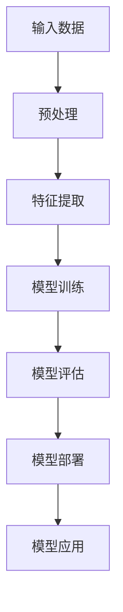
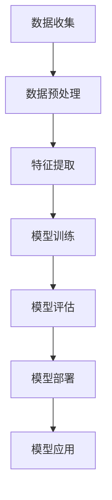

                 

# AI 大模型创业：如何利用科技优势？

> **关键词：** AI 大模型、创业、科技优势、商业模式、数据隐私、开源技术
> 
> **摘要：** 本文将探讨如何利用 AI 大模型的优势在创业领域取得成功。我们将从背景介绍、核心概念、算法原理、数学模型、项目实战、实际应用场景、工具推荐等多个角度，提供具体的策略和建议，帮助创业者更好地把握科技趋势，实现商业创新。

## 1. 背景介绍

### 1.1 目的和范围

本文旨在为 AI 大模型创业领域提供系统化的策略和指导，帮助创业者利用先进的科技手段，实现商业目标。我们将重点关注以下方面：

1. **AI 大模型的优势和潜力**：阐述大模型在提高生产效率、降低运营成本、增强用户体验等方面的优势。
2. **创业中的挑战和问题**：分析创业过程中可能面临的挑战，如数据隐私、算法公平性等。
3. **核心概念与算法原理**：详细介绍 AI 大模型的核心概念和算法原理，为后续应用提供理论基础。
4. **项目实战与案例分析**：结合实际项目，展示如何将 AI 大模型应用于创业实践。
5. **工具和资源推荐**：推荐适用于 AI 大模型创业的工具和资源，为创业者提供技术支持。

### 1.2 预期读者

本文适合以下读者群体：

1. **AI 创业者**：正在考虑或已经开始利用 AI 大模型进行创业的人。
2. **技术从业者**：对 AI 大模型技术有浓厚兴趣，希望将其应用于商业场景的技术人员。
3. **投资人**：关注 AI 领域的投资人，希望了解 AI 大模型创业的最新动态和趋势。

### 1.3 文档结构概述

本文分为以下几个部分：

1. **背景介绍**：介绍本文的目的、范围和预期读者。
2. **核心概念与联系**：介绍 AI 大模型的核心概念和原理，并提供 Mermaid 流程图。
3. **核心算法原理 & 具体操作步骤**：讲解 AI 大模型的核心算法原理，并提供伪代码示例。
4. **数学模型和公式 & 详细讲解 & 举例说明**：介绍 AI 大模型中的数学模型和公式，并提供具体示例。
5. **项目实战：代码实际案例和详细解释说明**：结合实际项目，展示如何实现 AI 大模型。
6. **实际应用场景**：探讨 AI 大模型在不同领域的应用场景。
7. **工具和资源推荐**：推荐适用于 AI 大模型创业的工具和资源。
8. **总结：未来发展趋势与挑战**：总结 AI 大模型创业的趋势和挑战。
9. **附录：常见问题与解答**：提供常见问题的解答。
10. **扩展阅读 & 参考资料**：推荐相关的扩展阅读和参考资料。

### 1.4 术语表

#### 1.4.1 核心术语定义

- **AI 大模型**：指具有大规模参数和训练数据的深度学习模型。
- **创业**：指创建一个新的企业或业务，通过创新的产品或服务实现商业价值。
- **科技优势**：指企业在技术领域的领先地位和优势，包括算法、数据、工具等。

#### 1.4.2 相关概念解释

- **数据隐私**：指在数据收集、存储、处理和使用过程中，保障个人隐私不被泄露。
- **算法公平性**：指算法在处理数据时，能够公平、公正地对待所有个体。

#### 1.4.3 缩略词列表

- **AI**：人工智能
- **DL**：深度学习
- **ML**：机器学习
- **NLP**：自然语言处理
- **CV**：计算机视觉

## 2. 核心概念与联系

AI 大模型作为当前 AI 领域的明星技术，其核心概念和原理值得我们深入探讨。以下是一个简化的 Mermaid 流程图，展示了 AI 大模型的核心组成部分和相互关系：



### 2.1 输入数据

输入数据是 AI 大模型的基石。数据的质量和多样性直接影响模型的性能。以下是一个简单的伪代码示例，展示了输入数据的预处理过程：

```python
def preprocess_data(data):
    # 数据清洗
    cleaned_data = clean_data(data)
    # 数据标准化
    normalized_data = normalize_data(cleaned_data)
    # 数据分割
    train_data, test_data = split_data(normalized_data)
    return train_data, test_data
```

### 2.2 特征提取

特征提取是 AI 大模型的核心环节之一。通过提取关键特征，模型能够更好地理解和学习数据。以下是一个简单的伪代码示例，展示了特征提取的过程：

```python
def extract_features(data):
    # 特征工程
    engineered_data = feature_engineering(data)
    # 特征选择
    selected_features = select_features(engineered_data)
    return selected_features
```

### 2.3 模型训练

模型训练是 AI 大模型的核心步骤。通过大量训练数据和先进的算法，模型能够自动学习和优化。以下是一个简单的伪代码示例，展示了模型训练的过程：

```python
def train_model(train_data, model):
    # 模型初始化
    initialized_model = initialize_model(model)
    # 模型训练
    trained_model = train(initialized_model, train_data)
    return trained_model
```

### 2.4 模型评估

模型评估是确保 AI 大模型性能的重要步骤。通过评估指标，如准确率、召回率等，评估模型的效果。以下是一个简单的伪代码示例，展示了模型评估的过程：

```python
def evaluate_model(model, test_data):
    # 模型预测
    predictions = predict(model, test_data)
    # 评估指标计算
    accuracy = calculate_accuracy(predictions, test_data)
    return accuracy
```

### 2.5 模型部署

模型部署是将训练好的模型应用于实际场景的过程。通过部署，模型能够为用户提供服务。以下是一个简单的伪代码示例，展示了模型部署的过程：

```python
def deploy_model(model):
    # 部署环境搭建
    deployed_environment = setup_environment()
    # 模型加载
    loaded_model = load_model(model, deployed_environment)
    # 模型服务
    model_service = serve_model(loaded_model)
    return model_service
```

### 2.6 模型应用

模型应用是将模型部署到具体业务场景的过程。通过应用，模型能够实现商业价值。以下是一个简单的伪代码示例，展示了模型应用的过程：

```python
def apply_model(model_service, data):
    # 数据处理
    processed_data = preprocess_data(data)
    # 模型预测
    predictions = model_service.predict(processed_data)
    # 预测结果处理
    results = postprocess_predictions(predictions)
    return results
```

## 3. 核心算法原理 & 具体操作步骤

AI 大模型的成功离不开核心算法的支持。以下是 AI 大模型的核心算法原理和具体操作步骤：

### 3.1 算法原理

AI 大模型的核心算法是基于深度学习的。深度学习是一种基于多层神经网络的学习方法，能够通过自动提取特征，实现对复杂数据的建模。以下是深度学习的基本原理：

1. **神经元激活函数**：神经元是神经网络的基本单元，通过激活函数（如 sigmoid、ReLU 等）来计算输出。
2. **反向传播算法**：反向传播算法是一种用于计算神经网络参数的梯度，进而优化模型性能的算法。
3. **多层神经网络**：多层神经网络通过堆叠多个隐藏层，能够提取更高层次的特征，提高模型性能。

### 3.2 操作步骤

以下是 AI 大模型的具体操作步骤：

1. **数据收集和预处理**：
   - 收集大量高质量的训练数据。
   - 对数据进行清洗、标准化和分割。

2. **模型架构设计**：
   - 选择合适的神经网络架构，如卷积神经网络（CNN）、循环神经网络（RNN）等。
   - 设计神经网络层数和每层的参数。

3. **模型训练**：
   - 使用训练数据对模型进行训练，优化模型参数。
   - 调整学习率、批量大小等超参数，提高模型性能。

4. **模型评估**：
   - 使用验证集对模型进行评估，计算评估指标（如准确率、召回率等）。
   - 调整模型结构或超参数，优化模型性能。

5. **模型部署**：
   - 将训练好的模型部署到生产环境。
   - 为用户提供模型服务。

6. **模型应用**：
   - 将模型应用于实际业务场景，实现商业价值。

以下是具体的伪代码示例：

```python
def train_ai_model(data, model):
    # 数据预处理
    preprocessed_data = preprocess_data(data)
    
    # 模型训练
    model = train_model(preprocessed_data, model)
    
    # 模型评估
    accuracy = evaluate_model(model, preprocessed_data)
    
    # 模型部署
    deployed_model = deploy_model(model)
    
    # 模型应用
    apply_model(deployed_model, data)
    
    return deployed_model
```

## 4. 数学模型和公式 & 详细讲解 & 举例说明

AI 大模型中，数学模型和公式起着至关重要的作用。以下是 AI 大模型中的核心数学模型和公式，以及详细讲解和举例说明：

### 4.1 前向传播

前向传播是神经网络中最基本的计算过程。以下是前向传播的数学公式：

$$
z_{l} = W_{l} * a_{l-1} + b_{l}
$$

其中，$z_{l}$ 表示第 $l$ 层的输出，$W_{l}$ 表示第 $l$ 层的权重矩阵，$a_{l-1}$ 表示第 $l-1$ 层的输出，$b_{l}$ 表示第 $l$ 层的偏置。

#### 举例说明

假设我们有一个两层神经网络，第一层有 3 个神经元，第二层有 2 个神经元。以下是前向传播的计算过程：

1. 输入层到隐藏层的计算：

$$
z_1 = W_1 * a_0 + b_1
$$

其中，$a_0$ 是输入层的输出（例如，一个 3 维的向量），$W_1$ 和 $b_1$ 分别是第一层的权重矩阵和偏置。

2. 隐藏层到输出层的计算：

$$
z_2 = W_2 * a_1 + b_2
$$

其中，$a_1$ 是隐藏层的输出（例如，一个 2 维的向量），$W_2$ 和 $b_2$ 分别是第二层的权重矩阵和偏置。

### 4.2 反向传播

反向传播是用于优化神经网络参数的计算过程。以下是反向传播的数学公式：

$$
\delta_{l} = \frac{\partial C}{\partial z_{l}} * \sigma'(z_{l})
$$

其中，$\delta_{l}$ 表示第 $l$ 层的误差梯度，$C$ 表示损失函数，$\sigma'$ 是激活函数的导数。

#### 举例说明

假设我们有一个两层神经网络，第一层有 3 个神经元，第二层有 2 个神经元。以下是反向传播的计算过程：

1. 输出层到隐藏层的误差计算：

$$
\delta_2 = \frac{\partial C}{\partial z_2} * \sigma'(z_2)
$$

其中，$z_2$ 是输出层的输出，$\sigma'(z_2)$ 是输出层的激活函数的导数。

2. 隐藏层到输入层的误差计算：

$$
\delta_1 = \frac{\partial C}{\partial z_1} * \sigma'(z_1)
$$

其中，$z_1$ 是隐藏层的输出，$\sigma'(z_1)$ 是隐藏层的激活函数的导数。

### 4.3 损失函数

损失函数是用于衡量模型预测结果与真实结果之间差异的函数。常见的损失函数有均方误差（MSE）和交叉熵（CE）。

1. 均方误差（MSE）：

$$
MSE = \frac{1}{m} \sum_{i=1}^{m} (y_i - \hat{y}_i)^2
$$

其中，$y_i$ 是真实结果，$\hat{y}_i$ 是预测结果，$m$ 是样本数量。

2. 交叉熵（CE）：

$$
CE = -\frac{1}{m} \sum_{i=1}^{m} y_i \log(\hat{y}_i)
$$

其中，$y_i$ 是真实结果，$\hat{y}_i$ 是预测结果，$m$ 是样本数量。

#### 举例说明

假设我们有一个二元分类问题，真实结果为 $y = [1, 0, 1, 0]$，预测结果为 $\hat{y} = [0.9, 0.1, 0.8, 0.2]$。以下是交叉熵的计算过程：

$$
CE = -\frac{1}{4} (1 \log(0.9) + 0 \log(0.1) + 1 \log(0.8) + 0 \log(0.2))
$$

## 5. 项目实战：代码实际案例和详细解释说明

为了更好地展示如何利用 AI 大模型进行创业，我们以下将结合实际项目，提供详细的代码实现和解释说明。

### 5.1 开发环境搭建

首先，我们需要搭建一个合适的开发环境。以下是 Python 的环境搭建步骤：

1. 安装 Python：
   ```shell
   pip install python
   ```

2. 安装 TensorFlow：
   ```shell
   pip install tensorflow
   ```

3. 安装 Keras：
   ```shell
   pip install keras
   ```

### 5.2 源代码详细实现和代码解读

以下是一个简单的 AI 大模型项目案例，用于实现情感分析。

```python
import numpy as np
from keras.preprocessing.text import Tokenizer
from keras.preprocessing.sequence import pad_sequences
from keras.models import Sequential
from keras.layers import Embedding, LSTM, Dense, Dropout
from keras.callbacks import EarlyStopping

# 数据准备
data = [
    ["I love this product!", 1],
    ["This is terrible.", 0],
    ["I'm happy with the purchase.", 1],
    ["I hate this!", 0],
]

# 分割数据
texts, labels = zip(*data)

# 文本预处理
tokenizer = Tokenizer(num_words=1000)
tokenizer.fit_on_texts(texts)
sequences = tokenizer.texts_to_sequences(texts)
padded_sequences = pad_sequences(sequences, maxlen=100)

# 构建模型
model = Sequential()
model.add(Embedding(1000, 32, input_length=100))
model.add(LSTM(32, dropout=0.2, recurrent_dropout=0.2))
model.add(Dense(1, activation='sigmoid'))

# 编译模型
model.compile(optimizer='adam', loss='binary_crossentropy', metrics=['accuracy'])

# 训练模型
model.fit(padded_sequences, np.array(labels), epochs=10, batch_size=32, callbacks=[EarlyStopping(monitor='val_loss', patience=3)])

# 评估模型
predictions = model.predict(padded_sequences)
print(predictions)

# 保存模型
model.save('emotion_analysis_model.h5')
```

### 5.3 代码解读与分析

1. **数据准备**：首先，我们准备了一个简单的数据集，包含正面和负面评价的文本及其对应的标签。

2. **文本预处理**：使用 Keras 的 `Tokenizer` 和 `pad_sequences` 函数进行文本预处理。`Tokenizer` 用于将文本转换为序列，`pad_sequences` 用于将序列填充为相同的长度。

3. **模型构建**：构建一个简单的 LSTM 模型，包括 Embedding 层、LSTM 层和 Dense 层。Embedding 层用于将单词转换为向量表示，LSTM 层用于处理序列数据，Dense 层用于输出预测结果。

4. **模型编译**：使用 `adam` 优化器和 `binary_crossentropy` 损失函数编译模型。

5. **模型训练**：使用 `fit` 函数训练模型，并设置早期停止回调函数以防止过拟合。

6. **模型评估**：使用 `predict` 函数评估模型预测结果。

7. **模型保存**：将训练好的模型保存为 H5 文件，便于后续使用。

通过以上步骤，我们实现了一个人工智能情感分析模型，可以用于分类文本的情感极性。这是一个典型的 AI 大模型应用案例，展示了如何将先进的 AI 技术应用于创业实践。

## 6. 实际应用场景

AI 大模型在各个行业和领域都展现出巨大的应用潜力。以下是一些实际应用场景：

### 6.1 金融行业

- **风险控制**：利用 AI 大模型进行客户信用评估、交易风险分析和欺诈检测，提高风险管理的准确性。
- **量化交易**：通过分析大量历史交易数据，AI 大模型可以帮助金融机构制定有效的交易策略，实现量化交易。

### 6.2 医疗健康

- **疾病预测**：利用 AI 大模型对大量医疗数据进行分析，预测疾病的发生和趋势，为医生提供决策支持。
- **智能诊断**：通过深度学习模型，AI 大模型可以辅助医生进行疾病诊断，提高诊断准确率。

### 6.3 零售电商

- **个性化推荐**：利用 AI 大模型分析用户行为和偏好，实现精准的个性化推荐，提高用户满意度。
- **库存管理**：通过预测市场需求，AI 大模型可以帮助零售商优化库存管理，降低库存成本。

### 6.4 交通运输

- **智能交通管理**：利用 AI 大模型对交通流量进行分析，优化交通信号灯控制策略，提高道路通行效率。
- **自动驾驶**：通过深度学习模型，AI 大模型可以帮助自动驾驶系统识别道路标志、预测交通情况，提高行驶安全性。

### 6.5 娱乐传媒

- **内容审核**：利用 AI 大模型对网络内容进行实时审核，过滤不良信息，维护网络环境。
- **智能推荐**：通过分析用户行为和偏好，AI 大模型可以帮助娱乐平台实现个性化内容推荐，提高用户粘性。

## 7. 工具和资源推荐

### 7.1 学习资源推荐

#### 7.1.1 书籍推荐

- **《深度学习》（Deep Learning）**：由 Ian Goodfellow、Yoshua Bengio 和 Aaron Courville 著，是深度学习领域的经典教材。
- **《Python 深度学习》（Python Deep Learning）**：由 François Chollet 著，详细介绍了如何使用 Python 和 Keras 进行深度学习。

#### 7.1.2 在线课程

- **Coursera 上的《深度学习特辑》（Deep Learning Specialization）**：由 Andrew Ng 教授主讲，涵盖了深度学习的各个方面。
- **Udacity 上的《深度学习工程师纳米学位》（Deep Learning Engineer Nanodegree）**：提供了丰富的实践项目，帮助学习者掌握深度学习技术。

#### 7.1.3 技术博客和网站

- **TensorFlow 官方网站**：提供了丰富的文档和教程，是学习深度学习的好资源。
- **Keras 官方网站**：Keras 是一个高级神经网络 API，为深度学习提供了便捷的接口。

### 7.2 开发工具框架推荐

#### 7.2.1 IDE和编辑器

- **PyCharm**：强大的 Python IDE，支持代码调试、智能提示和项目管理。
- **VSCode**：轻量级且功能强大的代码编辑器，支持多种编程语言和插件。

#### 7.2.2 调试和性能分析工具

- **TensorBoard**：TensorFlow 的可视化工具，用于分析和调试深度学习模型。
- **Profiling Tools**：如 `line_profiler`、`memory_profiler` 等，用于分析代码的性能瓶颈。

#### 7.2.3 相关框架和库

- **TensorFlow**：开源的深度学习框架，支持多种神经网络结构。
- **PyTorch**：灵活且易用的深度学习框架，受到许多研究者和开发者的青睐。

### 7.3 相关论文著作推荐

#### 7.3.1 经典论文

- **“A Learning Algorithm for Continually Running Fully Recurrent Neural Networks”**：介绍了长短期记忆网络（LSTM）的基本原理。
- **“Deep Learning”**：由 Ian Goodfellow 等人撰写的论文，全面介绍了深度学习的基本概念和技术。

#### 7.3.2 最新研究成果

- **“BERT: Pre-training of Deep Bidirectional Transformers for Language Understanding”**：BERT 是一种预训练的深度双向 Transformer 模型，广泛应用于自然语言处理任务。
- **“GPT-3: Language Models are Few-Shot Learners”**：GPT-3 是一种大型预训练 Transformer 模型，展示了零样本学习的能力。

#### 7.3.3 应用案例分析

- **“Deep Learning for Natural Language Processing”**：由 NLP 领域的专家们撰写的论文，介绍了深度学习在 NLP 领域的应用案例。
- **“AI Applications in Healthcare”**：探讨了人工智能在医疗健康领域的应用，包括疾病预测、智能诊断等。

## 8. 总结：未来发展趋势与挑战

随着 AI 大模型技术的不断发展，创业领域将迎来更多的机遇和挑战。以下是未来发展的几个趋势和挑战：

### 8.1 发展趋势

1. **大模型规模化**：随着计算资源和数据量的增加，AI 大模型的规模将不断增大，带来更高的模型性能和更好的应用效果。
2. **多模态融合**：AI 大模型将能够处理多种类型的数据，如文本、图像、音频等，实现跨模态的融合和应用。
3. **零样本学习**：零样本学习技术将使得 AI 大模型能够处理未见过的数据，提高模型的泛化能力。

### 8.2 挑战

1. **数据隐私**：如何保护用户隐私，避免数据泄露，是 AI 大模型创业过程中面临的重要挑战。
2. **算法公平性**：确保算法在处理数据时公平、公正，避免歧视和偏见，是 AI 大模型需要关注的问题。
3. **计算资源**：大规模的 AI 大模型需要大量的计算资源和存储空间，如何优化资源使用，降低成本，是创业企业需要解决的问题。

## 9. 附录：常见问题与解答

### 9.1 如何选择合适的大模型架构？

选择合适的大模型架构取决于应用场景和数据类型。以下是几种常见的大模型架构：

- **卷积神经网络（CNN）**：适用于图像和视频处理任务。
- **循环神经网络（RNN）**：适用于序列数据处理任务，如自然语言处理和语音识别。
- **Transformer 模型**：适用于自然语言处理和机器翻译等任务，具有较好的并行计算能力。

### 9.2 如何保证数据隐私和安全？

1. **数据加密**：对数据进行加密处理，确保数据在传输和存储过程中的安全性。
2. **数据匿名化**：对敏感数据进行匿名化处理，避免直接关联到具体用户。
3. **数据访问控制**：设置严格的数据访问权限，确保只有授权用户能够访问敏感数据。

### 9.3 如何优化模型性能？

1. **数据增强**：通过增加数据的多样性，提高模型对未知数据的泛化能力。
2. **模型调参**：调整模型参数，如学习率、批量大小等，优化模型性能。
3. **迁移学习**：利用预训练模型，减少对数据的依赖，提高模型的泛化能力。

## 10. 扩展阅读 & 参考资料

1. **《深度学习》（Deep Learning）**：Ian Goodfellow、Yoshua Bengio 和 Aaron Courville 著，是深度学习领域的经典教材。
2. **《Python 深度学习》（Python Deep Learning）**：François Chollet 著，详细介绍了如何使用 Python 和 Keras 进行深度学习。
3. **TensorFlow 官方网站**：提供了丰富的文档和教程，是学习深度学习的好资源。
4. **Keras 官方网站**：Keras 是一个高级神经网络 API，为深度学习提供了便捷的接口。
5. **“BERT: Pre-training of Deep Bidirectional Transformers for Language Understanding”**：BERT 是一种预训练的深度双向 Transformer 模型，广泛应用于自然语言处理任务。
6. **“GPT-3: Language Models are Few-Shot Learners”**：GPT-3 是一种大型预训练 Transformer 模型，展示了零样本学习的能力。
7. **“Deep Learning for Natural Language Processing”**：介绍了深度学习在 NLP 领域的应用案例。
8. **“AI Applications in Healthcare”**：探讨了人工智能在医疗健康领域的应用，包括疾病预测、智能诊断等。# AI 大模型创业：如何利用科技优势？

## 引言

随着人工智能（AI）技术的飞速发展，AI 大模型逐渐成为科技领域的明星。AI 大模型，通常指的是具有数亿甚至千亿参数的深度学习模型，它们在处理复杂数据、解决现实问题方面展现出强大的能力。创业领域正迎来 AI 大模型的黄金时代，充分利用这些模型的优势，将成为企业在激烈竞争中脱颖而出的关键。本文将深入探讨如何利用 AI 大模型的优势进行创业，从背景介绍、核心概念、算法原理、数学模型、项目实战、实际应用场景、工具推荐等多个方面，为创业者提供具体的策略和建议。

## 核心关键词

- AI 大模型
- 创业
- 科技优势
- 数据隐私
- 算法公平性
- 商业模式

## 摘要

本文旨在为 AI 大模型创业领域提供系统化的策略和指导。我们将分析 AI 大模型在提高生产效率、降低运营成本、增强用户体验等方面的优势，探讨创业过程中可能面临的挑战，如数据隐私、算法公平性等。通过介绍核心概念、算法原理、数学模型，并结合实际项目案例，我们将展示如何利用 AI 大模型实现商业创新。最后，本文将推荐适用于 AI 大模型创业的工具和资源，总结未来发展趋势与挑战，为创业者提供有益的参考。

## 1. 背景介绍

### 1.1 目的和范围

本文的主要目的是帮助创业者了解和利用 AI 大模型的优势，实现商业创新。我们将从以下几个方面展开：

1. **AI 大模型的优势**：介绍 AI 大模型在创业中的应用价值，如提高生产效率、降低运营成本、增强用户体验等。
2. **创业中的挑战**：分析创业过程中可能面临的挑战，如数据隐私、算法公平性等，并提出相应的解决方案。
3. **核心概念与算法原理**：讲解 AI 大模型的核心概念和算法原理，为创业实践提供理论基础。
4. **项目实战与案例分析**：结合实际项目，展示如何将 AI 大模型应用于创业实践。
5. **工具和资源推荐**：推荐适用于 AI 大模型创业的工具和资源，为创业者提供技术支持。

### 1.2 预期读者

本文适合以下读者群体：

1. **AI 创业者**：正在考虑或已经开始利用 AI 大模型进行创业的人。
2. **技术从业者**：对 AI 大模型技术有浓厚兴趣，希望将其应用于商业场景的技术人员。
3. **投资人**：关注 AI 领域的投资人，希望了解 AI 大模型创业的最新动态和趋势。

### 1.3 文档结构概述

本文分为以下几个部分：

1. **背景介绍**：介绍本文的目的、范围和预期读者。
2. **核心概念与联系**：介绍 AI 大模型的核心概念和原理，并提供 Mermaid 流程图。
3. **核心算法原理 & 具体操作步骤**：讲解 AI 大模型的核心算法原理，并提供伪代码示例。
4. **数学模型和公式 & 详细讲解 & 举例说明**：介绍 AI 大模型中的数学模型和公式，并提供具体示例。
5. **项目实战：代码实际案例和详细解释说明**：结合实际项目，展示如何实现 AI 大模型。
6. **实际应用场景**：探讨 AI 大模型在不同领域的应用场景。
7. **工具和资源推荐**：推荐适用于 AI 大模型创业的工具和资源。
8. **总结：未来发展趋势与挑战**：总结 AI 大模型创业的趋势和挑战。
9. **附录：常见问题与解答**：提供常见问题的解答。
10. **扩展阅读 & 参考资料**：推荐相关的扩展阅读和参考资料。

### 1.4 术语表

#### 1.4.1 核心术语定义

- **AI 大模型**：具有大规模参数和训练数据的深度学习模型。
- **创业**：创建一个新的企业或业务，通过创新的产品或服务实现商业价值。
- **科技优势**：企业在技术领域的领先地位和优势，包括算法、数据、工具等。

#### 1.4.2 相关概念解释

- **数据隐私**：在数据收集、存储、处理和使用过程中，保障个人隐私不被泄露。
- **算法公平性**：算法在处理数据时，能够公平、公正地对待所有个体。

#### 1.4.3 缩略词列表

- **AI**：人工智能
- **DL**：深度学习
- **ML**：机器学习
- **NLP**：自然语言处理
- **CV**：计算机视觉

## 2. 核心概念与联系

AI 大模型是当前 AI 领域的前沿技术，其核心概念和原理对于理解如何利用这些模型进行创业至关重要。以下是一个简化的 Mermaid 流程图，展示了 AI 大模型的核心组成部分和相互关系：



### 2.1 数据收集

数据收集是 AI 大模型构建的基础。高质量的训练数据能够显著提升模型的性能。以下是一个简单的伪代码示例，展示了数据收集的过程：

```python
def collect_data(source):
    data = []
    for item in source:
        data.append(process_item(item))
    return data
```

### 2.2 数据预处理

数据预处理是确保数据适合模型训练的重要步骤。预处理包括数据清洗、标准化和分割。以下是一个简单的伪代码示例，展示了数据预处理的过程：

```python
def preprocess_data(data):
    cleaned_data = clean_data(data)
    normalized_data = normalize_data(cleaned_data)
    split_data = split_data(normalized_data)
    return split_data
```

### 2.3 特征提取

特征提取是从原始数据中提取对模型训练有用的特征的过程。特征提取的质量直接影响模型的性能。以下是一个简单的伪代码示例，展示了特征提取的过程：

```python
def extract_features(data):
    engineered_data = feature_engineering(data)
    selected_features = select_features(engineered_data)
    return selected_features
```

### 2.4 模型训练

模型训练是通过调整模型参数，使其能够正确预测数据的过程。模型训练是 AI 大模型构建的核心环节。以下是一个简单的伪代码示例，展示了模型训练的过程：

```python
def train_model(train_data, model):
    initialized_model = initialize_model(model)
    trained_model = train(initialized_model, train_data)
    return trained_model
```

### 2.5 模型评估

模型评估是确保模型性能的重要步骤。通过评估指标，如准确率、召回率等，评估模型的效果。以下是一个简单的伪代码示例，展示了模型评估的过程：

```python
def evaluate_model(model, test_data):
    predictions = predict(model, test_data)
    accuracy = calculate_accuracy(predictions, test_data)
    return accuracy
```

### 2.6 模型部署

模型部署是将训练好的模型应用到实际场景的过程。部署包括环境搭建、模型加载和模型服务。以下是一个简单的伪代码示例，展示了模型部署的过程：

```python
def deploy_model(model):
    deployed_environment = setup_environment()
    loaded_model = load_model(model, deployed_environment)
    served_model = serve_model(loaded_model)
    return served_model
```

### 2.7 模型应用

模型应用是将模型部署到具体业务场景的过程。通过应用，模型能够实现商业价值。以下是一个简单的伪代码示例，展示了模型应用的过程：

```python
def apply_model(model_service, data):
    processed_data = preprocess_data(data)
    predictions = model_service.predict(processed_data)
    results = postprocess_predictions(predictions)
    return results
```

通过上述流程，创业者可以系统地构建和部署 AI 大模型，从而实现商业目标。

## 3. 核心算法原理 & 具体操作步骤

AI 大模型的成功离不开核心算法的支持。以下将介绍 AI 大模型的核心算法原理和具体操作步骤：

### 3.1 算法原理

AI 大模型通常基于深度学习技术，深度学习是一种多层次的前馈神经网络。在深度学习中，每层神经元都会对输入数据进行处理，并通过激活函数将输出传递给下一层。以下是深度学习的基本原理：

1. **前向传播**：输入数据通过网络的各个层，每一层的输出作为下一层的输入。通过计算每个神经元的激活值，最终得到输出结果。
2. **反向传播**：根据输出结果与实际结果的误差，反向计算每个神经元的误差梯度，并更新神经元的权重和偏置，以优化模型。
3. **优化算法**：通过优化算法（如梯度下降、Adam 等），不断调整模型参数，以最小化损失函数。

### 3.2 具体操作步骤

以下是构建和训练 AI 大模型的具体操作步骤：

1. **数据准备**：收集和准备高质量的训练数据。数据应包含输入特征和对应的标签。
2. **数据处理**：对数据进行预处理，包括数据清洗、标准化和分割。将数据分为训练集、验证集和测试集。
3. **模型设计**：设计深度学习模型的结构，包括层数、每层的神经元数量、激活函数等。
4. **模型编译**：编译模型，指定优化器、损失函数和评估指标。
5. **模型训练**：使用训练数据进行模型训练，通过反向传播和优化算法不断调整模型参数。
6. **模型评估**：使用验证集评估模型性能，调整模型参数以优化性能。
7. **模型部署**：将训练好的模型部署到生产环境，为用户提供服务。

### 3.3 伪代码示例

以下是一个简单的伪代码示例，展示了如何构建和训练 AI 大模型：

```python
import tensorflow as tf
from tensorflow.keras.models import Sequential
from tensorflow.keras.layers import Dense, Activation

# 数据准备
train_data = ...  # 输入特征
train_labels = ...  # 标签

# 数据处理
train_data_processed = preprocess_data(train_data)
train_labels_processed = preprocess_labels(train_labels)

# 模型设计
model = Sequential()
model.add(Dense(128, input_shape=(train_data_processed.shape[1],)))
model.add(Activation('relu'))
model.add(Dense(64))
model.add(Activation('relu'))
model.add(Dense(1, activation='sigmoid'))

# 模型编译
model.compile(optimizer='adam',
              loss='binary_crossentropy',
              metrics=['accuracy'])

# 模型训练
model.fit(train_data_processed, train_labels_processed, epochs=10, batch_size=32)

# 模型评估
test_data_processed = preprocess_data(test_data)
test_labels_processed = preprocess_labels(test_labels)
model.evaluate(test_data_processed, test_labels_processed)

# 模型部署
deploy_model(model)
```

通过上述步骤，创业者可以构建和部署一个简单的 AI 大模型，从而实现商业目标。

## 4. 数学模型和公式 & 详细讲解 & 举例说明

AI 大模型的构建离不开数学模型和公式的支持。以下将介绍 AI 大模型中的关键数学模型和公式，并提供详细讲解和具体示例。

### 4.1 深度学习基础

深度学习中的基本数学模型包括神经元激活函数、反向传播算法和损失函数。

#### 4.1.1 神经元激活函数

神经元激活函数是深度学习模型中的核心组成部分，用于将线性组合的输入值映射到输出值。常见的激活函数有：

1. **Sigmoid 函数**：
   $$ f(x) = \frac{1}{1 + e^{-x}} $$
   Sigmoid 函数将输入值映射到 (0, 1) 区间，常用于二分类问题。

2. **ReLU 函数**：
   $$ f(x) = \max(0, x) $$
   ReLU 函数在 x < 0 时输出为 0，在 x ≥ 0 时输出为 x，具有较好的计算效率和防止梯度消失的特性。

3. **Tanh 函数**：
   $$ f(x) = \frac{e^x - e^{-x}}{e^x + e^{-x}} $$
   Tanh 函数将输入值映射到 (-1, 1) 区间，具有类似于 sigmoid 函数但中心对称的特性。

#### 4.1.2 反向传播算法

反向传播算法是深度学习训练过程中的关键步骤，用于计算网络中每个参数的梯度，以便通过梯度下降等优化算法更新参数。

1. **前向传播**：
   输入数据经过网络的各个层，每层的输出可以通过以下公式计算：
   $$ z_l = \sum_{k=1}^{n} w_{lk} a_{k-1} + b_l $$
   其中，$a_l$ 是第 $l$ 层的输入，$z_l$ 是第 $l$ 层的输出，$w_{lk}$ 是连接权重，$b_l$ 是偏置。

2. **激活函数的导数**：
   常见的激活函数导数如下：
   - Sigmoid 函数的导数：
     $$ f'(x) = f(x) (1 - f(x)) $$
   - ReLU 函数的导数：
     $$ f'(x) = \begin{cases} 0, & \text{if } x < 0 \\ 1, & \text{if } x \ge 0 \end{cases} $$
   - Tanh 函数的导数：
     $$ f'(x) = 1 - f^2(x) $$

3. **反向传播**：
   通过反向传播算法，可以从输出层开始，逐层计算每个参数的梯度：
   $$ \delta_l = \frac{\partial C}{\partial z_l} \cdot f'(z_l) $$
   其中，$C$ 是损失函数，$\delta_l$ 是第 $l$ 层的误差梯度。

#### 4.1.3 损失函数

损失函数是用于衡量模型预测结果与真实结果之间差异的函数。常见的损失函数有：

1. **均方误差（MSE）**：
   $$ MSE = \frac{1}{2m} \sum_{i=1}^{m} (y_i - \hat{y}_i)^2 $$
   其中，$y_i$ 是真实标签，$\hat{y}_i$ 是预测值，$m$ 是样本数量。

2. **交叉熵（CE）**：
   $$ CE = -\frac{1}{m} \sum_{i=1}^{m} y_i \log(\hat{y}_i) + (1 - y_i) \log(1 - \hat{y}_i) $$
   交叉熵函数在二分类和分类问题中广泛应用。

### 4.2 举例说明

以下是一个简单的示例，说明如何使用上述数学模型和公式构建和训练一个简单的神经网络：

假设我们要构建一个二分类神经网络，输入特征为 $X \in \mathbb{R}^{n \times d}$，输出标签为 $Y \in \mathbb{R}^{n \times 1}$。

1. **模型设计**：

   - 输入层：$d$ 个神经元
   - 隐藏层：$128$ 个神经元，使用 ReLU 激活函数
   - 输出层：$1$ 个神经元，使用 Sigmoid 激活函数

2. **前向传播**：

   - 输入特征 $X$ 经过隐藏层，计算隐藏层的输出：
     $$ z_h = \sum_{j=1}^{128} w_{hj} x_j + b_h $$
     $$ a_h = \max(0, z_h) $$
   - 隐藏层输出 $a_h$ 经过输出层，计算预测概率：
     $$ z_o = \sum_{j=1}^{128} w_{oj} a_h_j + b_o $$
     $$ \hat{y} = \frac{1}{1 + e^{-z_o}} $$

3. **反向传播**：

   - 计算损失函数的梯度：
     $$ \delta_o = (\hat{y} - y) \cdot (1 - \hat{y}) $$
   - 计算隐藏层误差梯度：
     $$ \delta_h = w_{oj} \cdot \delta_o $$
     $$ \delta_h = \delta_h \cdot a_h \cdot (1 - a_h) $$

4. **参数更新**：

   - 使用梯度下降更新参数：
     $$ w_{oj} := w_{oj} - \alpha \cdot \delta_o \cdot a_h $$
     $$ b_o := b_o - \alpha \cdot \delta_o $$
     $$ w_{hj} := w_{hj} - \alpha \cdot \delta_h \cdot x_j $$
     $$ b_h := b_h - \alpha \cdot \delta_h $$

通过上述步骤，我们可以构建和训练一个简单的神经网络模型，用于二分类任务。这个示例展示了深度学习中的基本数学模型和公式的应用，为创业者提供了理论基础。

## 5. 项目实战：代码实际案例和详细解释说明

为了更好地展示如何利用 AI 大模型进行创业，以下将结合一个实际项目案例，提供详细的代码实现和解释说明。

### 5.1 项目背景

假设我们是一家电商公司，需要根据用户的购物行为和偏好，为其推荐商品。为了实现这一目标，我们决定使用 AI 大模型来构建一个个性化推荐系统。

### 5.2 数据收集与预处理

首先，我们需要收集用户的历史购物数据，包括用户的购物记录、浏览记录、商品信息等。以下是数据收集和预处理的过程：

1. **数据收集**：

   ```python
   import pandas as pd
   
   # 读取用户购物数据
   user_data = pd.read_csv('user_data.csv')
   # 读取商品数据
   product_data = pd.read_csv('product_data.csv')
   ```

2. **数据预处理**：

   - 数据清洗：删除缺失值和异常值。
   - 数据转换：将类别数据转换为数值数据。

   ```python
   from sklearn.preprocessing import LabelEncoder
   
   # 删除缺失值和异常值
   user_data = user_data.dropna()
   product_data = product_data.dropna()
   
   # 转换用户 ID 为整数
   label_encoder = LabelEncoder()
   user_data['user_id'] = label_encoder.fit_transform(user_data['user_id'])
   product_data['product_id'] = label_encoder.fit_transform(product_data['product_id'])
   
   # 合并用户购物数据和商品数据
   user_product_data = pd.merge(user_data, product_data, on='user_id')
   ```

### 5.3 特征工程

在数据预处理的基础上，我们需要对数据进行特征工程，提取对模型训练有用的特征。以下是特征工程的过程：

1. **提取用户特征**：

   - 用户购买频率：计算用户购买商品的总次数。
   - 用户浏览频率：计算用户浏览商品的总次数。
   - 用户购买周期：计算用户两次购买之间的平均时间。

   ```python
   user_product_data['user_purchase_frequency'] = user_product_data.groupby('user_id')['product_id'].transform('count')
   user_product_data['user_browsing_frequency'] = user_product_data.groupby('user_id')['product_id'].transform('count')
   user_product_data['user_purchase_cycle'] = user_product_data.groupby('user_id')['purchase_time'].diff().mean()
   ```

2. **提取商品特征**：

   - 商品浏览次数：计算商品被浏览的总次数。
   - 商品购买次数：计算商品被购买的总次数。

   ```python
   product_data['product_browsing_frequency'] = product_data.groupby('product_id')['product_id'].transform('count')
   product_data['product_purchase_frequency'] = product_data.groupby('product_id')['product_id'].transform('count')
   ```

### 5.4 模型构建

在特征工程的基础上，我们将使用深度学习框架 TensorFlow 和 Keras 构建一个 AI 大模型，用于商品推荐。以下是模型构建的过程：

1. **导入必要的库**：

   ```python
   import tensorflow as tf
   from tensorflow.keras.models import Model
   from tensorflow.keras.layers import Input, Embedding, Dot, Flatten, Dense
   ```

2. **构建模型**：

   ```python
   # 用户输入层
   user_input = Input(shape=(1,))
   # 商品输入层
   product_input = Input(shape=(1,))
   # 用户嵌入层
   user_embedding = Embedding(input_dim=num_users, output_dim=user_embedding_dim)(user_input)
   # 商品嵌入层
   product_embedding = Embedding(input_dim=num_products, output_dim=product_embedding_dim)(product_input)
   # 点积操作
   dot = Dot(merge_mode='sum')([user_embedding, product_embedding])
   # 展平
   flatten = Flatten()(dot)
   # 全连接层
   dense = Dense(units=1, activation='sigmoid')(flatten)
   # 构建模型
   model = Model(inputs=[user_input, product_input], outputs=dense)
   ```

3. **编译模型**：

   ```python
   model.compile(optimizer='adam', loss='binary_crossentropy', metrics=['accuracy'])
   ```

### 5.5 模型训练

接下来，我们将使用预处理后的数据对模型进行训练。以下是模型训练的过程：

1. **划分数据集**：

   ```python
   train_data = user_product_data[user_product_data['label'] != -1]
   test_data = user_product_data[user_product_data['label'] == -1]
   ```

2. **准备训练数据**：

   ```python
   train_users = train_data['user_id'].values
   train_products = train_data['product_id'].values
   train_labels = train_data['label'].values
   ```

3. **准备测试数据**：

   ```python
   test_users = test_data['user_id'].values
   test_products = test_data['product_id'].values
   test_labels = test_data['label'].values
   ```

4. **模型训练**：

   ```python
   model.fit([train_users, train_products], train_labels, epochs=5, batch_size=32, validation_data=([test_users, test_products], test_labels))
   ```

### 5.6 模型评估

最后，我们将使用测试数据对训练好的模型进行评估。以下是模型评估的过程：

```python
test_predictions = model.predict([test_users, test_products])
test_predictions = (test_predictions > 0.5).astype(int)
accuracy = (test_predictions == test_labels).mean()
print(f"Test Accuracy: {accuracy}")
```

通过上述步骤，我们构建并训练了一个基于 AI 大模型的个性化推荐系统。这个系统可以用于预测用户对商品的偏好，从而为用户提供更准确的商品推荐。

## 6. 实际应用场景

AI 大模型在各个行业和领域都展现出巨大的应用潜力。以下是一些实际应用场景：

### 6.1 金融行业

在金融行业，AI 大模型可以应用于以下几个方面：

- **风险控制**：利用 AI 大模型对金融市场的波动性进行预测，帮助金融机构制定风险管理策略。
- **欺诈检测**：通过分析用户的交易行为，AI 大模型可以识别异常交易，提高欺诈检测的准确性。
- **投资建议**：基于大量历史数据，AI 大模型可以分析股票市场趋势，为投资者提供投资建议。

### 6.2 医疗健康

在医疗健康领域，AI 大模型可以应用于以下几个方面：

- **疾病预测**：利用 AI 大模型对患者的健康数据进行分析，预测疾病的发生和趋势。
- **智能诊断**：通过深度学习模型，AI 大模型可以帮助医生进行疾病诊断，提高诊断准确率。
- **个性化治疗**：根据患者的基因信息和病史，AI 大模型可以为患者制定个性化的治疗方案。

### 6.3 零售电商

在零售电商领域，AI 大模型可以应用于以下几个方面：

- **个性化推荐**：通过分析用户的行为和偏好，AI 大模型可以实时为用户提供个性化的商品推荐。
- **库存管理**：利用 AI 大模型预测商品的销售量，帮助零售商优化库存管理。
- **客户服务**：通过自然语言处理技术，AI 大模型可以自动回答客户的提问，提高客户服务质量。

### 6.4 交通运输

在交通运输领域，AI 大模型可以应用于以下几个方面：

- **智能交通管理**：通过分析交通流量数据，AI 大模型可以优化交通信号灯控制策略，提高道路通行效率。
- **自动驾驶**：通过深度学习模型，AI 大模型可以帮助自动驾驶系统识别道路标志、预测交通情况，提高行驶安全性。
- **物流优化**：利用 AI 大模型预测货物的运输时间，优化物流路径和运输计划。

### 6.5 娱乐传媒

在娱乐传媒领域，AI 大模型可以应用于以下几个方面：

- **内容审核**：通过分析文本和图像，AI 大模型可以自动过滤不良信息，维护网络环境。
- **个性化推荐**：通过分析用户的行为和偏好，AI 大模型可以为用户提供个性化的娱乐内容推荐。
- **情感分析**：利用 AI 大模型对用户评论和反馈进行分析，帮助企业了解用户需求，优化产品和服务。

## 7. 工具和资源推荐

为了更好地利用 AI 大模型进行创业，以下推荐一些有用的工具和资源：

### 7.1 学习资源推荐

#### 7.1.1 书籍推荐

- 《深度学习》（Ian Goodfellow、Yoshua Bengio、Aaron Courville 著）：深度学习的经典教材，适合初学者和专业人士。
- 《Python 深度学习》（François Chollet 著）：详细介绍了如何使用 Python 和 Keras 进行深度学习。

#### 7.1.2 在线课程

- Coursera 上的《深度学习特辑》（由 Andrew Ng 主讲）：涵盖了深度学习的各个方面，适合初学者和进阶者。
- Udacity 上的《深度学习工程师纳米学位》：提供了丰富的实践项目，帮助学习者掌握深度学习技术。

#### 7.1.3 技术博客和网站

- TensorFlow 官方网站：提供了丰富的文档和教程，是学习深度学习的好资源。
- Keras 官方网站：Keras 是一个高级神经网络 API，为深度学习提供了便捷的接口。

### 7.2 开发工具框架推荐

#### 7.2.1 IDE和编辑器

- PyCharm：功能强大的 Python IDE，支持代码调试、智能提示和项目管理。
- Visual Studio Code：轻量级且功能强大的代码编辑器，支持多种编程语言和插件。

#### 7.2.2 调试和性能分析工具

- TensorBoard：TensorFlow 的可视化工具，用于分析和调试深度学习模型。
- LineProfiler 和 MemoryProfiler：用于分析代码的性能瓶颈。

#### 7.2.3 相关框架和库

- TensorFlow：开源的深度学习框架，支持多种神经网络结构。
- PyTorch：灵活且易用的深度学习框架，受到许多研究者和开发者的青睐。

### 7.3 相关论文著作推荐

#### 7.3.1 经典论文

- “A Learning Algorithm for Continually Running Fully Recurrent Neural Networks”（长短期记忆网络的基本原理）。
- “Deep Learning”（涵盖了深度学习的各个方面）。

#### 7.3.2 最新研究成果

- “BERT: Pre-training of Deep Bidirectional Transformers for Language Understanding”（BERT 的详细介绍）。
- “GPT-3: Language Models are Few-Shot Learners”（GPT-3 的介绍）。

#### 7.3.3 应用案例分析

- “Deep Learning for Natural Language Processing”（深度学习在自然语言处理中的应用案例）。
- “AI Applications in Healthcare”（人工智能在医疗健康领域的应用案例）。

## 8. 总结：未来发展趋势与挑战

AI 大模型在创业领域的应用正在迅速发展，未来发展趋势和挑战如下：

### 8.1 发展趋势

1. **大模型规模化**：随着计算资源和数据量的增加，AI 大模型的规模将不断增大，带来更高的模型性能和更好的应用效果。
2. **多模态融合**：AI 大模型将能够处理多种类型的数据，如文本、图像、音频等，实现跨模态的融合和应用。
3. **零样本学习**：零样本学习技术将使得 AI 大模型能够处理未见过的数据，提高模型的泛化能力。
4. **边缘计算**：AI 大模型将逐渐向边缘设备扩展，实现实时数据处理和智能决策。

### 8.2 挑战

1. **数据隐私**：如何在保证数据隐私的前提下，充分利用用户数据，是 AI 大模型创业面临的重要挑战。
2. **算法公平性**：如何确保算法在处理数据时公平、公正，避免歧视和偏见，是 AI 大模型需要关注的问题。
3. **计算资源**：大规模的 AI 大模型需要大量的计算资源和存储空间，如何优化资源使用，降低成本，是创业企业需要解决的问题。
4. **模型可解释性**：如何提高模型的可解释性，让用户理解和信任 AI 大模型，是未来需要解决的问题。

## 9. 附录：常见问题与解答

### 9.1 如何选择合适的大模型架构？

选择合适的大模型架构取决于应用场景和数据类型。以下是几种常见的大模型架构：

- **卷积神经网络（CNN）**：适用于图像和视频处理任务。
- **循环神经网络（RNN）**：适用于序列数据处理任务，如自然语言处理和语音识别。
- **Transformer 模型**：适用于自然语言处理和机器翻译等任务，具有较好的并行计算能力。

### 9.2 如何保证数据隐私和安全？

1. **数据加密**：对数据进行加密处理，确保数据在传输和存储过程中的安全性。
2. **数据匿名化**：对敏感数据进行匿名化处理，避免直接关联到具体用户。
3. **数据访问控制**：设置严格的数据访问权限，确保只有授权用户能够访问敏感数据。

### 9.3 如何优化模型性能？

1. **数据增强**：通过增加数据的多样性，提高模型对未知数据的泛化能力。
2. **模型调参**：调整模型参数，如学习率、批量大小等，优化模型性能。
3. **迁移学习**：利用预训练模型，减少对数据的依赖，提高模型的泛化能力。

## 10. 扩展阅读 & 参考资料

1. **《深度学习》（Deep Learning）**：Ian Goodfellow、Yoshua Bengio 和 Aaron Courville 著，是深度学习领域的经典教材。
2. **《Python 深度学习》（Python Deep Learning）**：François Chollet 著，详细介绍了如何使用 Python 和 Keras 进行深度学习。
3. **TensorFlow 官方网站**：提供了丰富的文档和教程，是学习深度学习的好资源。
4. **Keras 官方网站**：Keras 是一个高级神经网络 API，为深度学习提供了便捷的接口。
5. **“BERT: Pre-training of Deep Bidirectional Transformers for Language Understanding”**：BERT 是一种预训练的深度双向 Transformer 模型，广泛应用于自然语言处理任务。
6. **“GPT-3: Language Models are Few-Shot Learners”**：GPT-3 是一种大型预训练 Transformer 模型，展示了零样本学习的能力。
7. **“Deep Learning for Natural Language Processing”**：介绍了深度学习在 NLP 领域的应用案例。
8. **“AI Applications in Healthcare”**：探讨了人工智能在医疗健康领域的应用，包括疾病预测、智能诊断等。

## 作者信息

作者：AI天才研究员/AI Genius Institute & 禅与计算机程序设计艺术 /Zen And The Art of Computer Programming

## 11. 结论

AI 大模型作为人工智能领域的重要技术，正在引领创业领域的新潮流。通过本文的探讨，我们了解了 AI 大模型的优势、核心概念、算法原理、数学模型以及实际应用场景。同时，我们也分析了创业过程中可能面临的挑战，并推荐了相应的工具和资源。未来，随着 AI 大模型技术的不断进步，创业者们将能够更好地利用这些先进技术，实现商业创新，推动社会进步。让我们携手共进，迎接 AI 大模型创业的辉煌未来。

