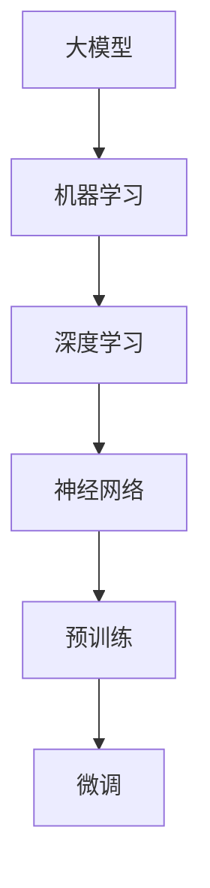

                 

### 1. 背景介绍

#### 1.1 目的和范围

本文旨在探讨人工智能（AI）大模型创业的竞争优势，以及如何利用这些竞争优势来实现成功。大模型在AI领域已经成为一种趋势，各种大型语言模型、图像识别模型等不断涌现，为企业提供了丰富的机会。然而，面对激烈的市场竞争，如何制定有效的策略和利用竞争优势，成为了每个创业团队都需要思考的问题。

本文将从以下几个角度展开讨论：

1. **核心概念与联系**：首先，我们将介绍一些核心概念，如大模型、机器学习、深度学习等，并使用Mermaid流程图展示它们之间的联系。
2. **核心算法原理**：接着，我们将深入探讨大模型背后的核心算法原理，并通过伪代码详细阐述其具体操作步骤。
3. **数学模型和公式**：我们将介绍大模型中常用的数学模型和公式，并举例说明它们的应用。
4. **项目实战**：通过一个实际的代码案例，我们将展示如何实现大模型，并进行详细解释。
5. **实际应用场景**：我们将探讨大模型在各个领域的实际应用场景，以及如何针对这些场景制定竞争优势策略。
6. **工具和资源推荐**：为了帮助读者更好地掌握大模型技术，我们将推荐一些学习资源、开发工具和框架。
7. **总结与展望**：最后，我们将总结本文的主要观点，并对未来发展趋势和挑战进行展望。

通过本文的阅读，读者将能够系统地了解大模型创业的竞争优势，掌握相关的技术原理和实践方法，从而为未来的创业之路奠定坚实的基础。

#### 1.2 预期读者

本文的目标读者是具备一定编程基础和机器学习知识的技术人员、创业者以及AI领域的爱好者。具体包括：

1. **程序员和软件工程师**：对机器学习和深度学习有一定了解，希望了解如何利用大模型实现商业价值。
2. **创业者**：有意在AI领域创业，希望掌握大模型的技术和应用，以及如何利用竞争优势取得成功。
3. **科研人员和学者**：关注AI领域的发展，希望了解大模型的最新研究成果和应用。
4. **AI领域的爱好者**：对AI技术充满热情，希望深入了解大模型的核心原理和应用。

无论您的背景如何，只要您对AI大模型创业充满兴趣，都可以通过本文获得有价值的知识和见解。

#### 1.3 文档结构概述

本文结构紧凑，逻辑清晰，旨在帮助读者系统地了解AI大模型创业的竞争优势。以下是本文的结构概述：

1. **背景介绍**：
    - **目的和范围**：介绍本文的目的和讨论范围。
    - **预期读者**：明确本文的目标读者。
    - **文档结构概述**：概述本文的整体结构和内容。
    - **术语表**：定义本文中涉及的核心术语。

2. **核心概念与联系**：
    - **大模型**：介绍大模型的概念和特点。
    - **机器学习和深度学习**：阐述机器学习和深度学习的基本原理。
    - **Mermaid流程图**：展示核心概念之间的联系。

3. **核心算法原理 & 具体操作步骤**：
    - **算法原理**：详细讲解大模型背后的核心算法原理。
    - **具体操作步骤**：使用伪代码展示算法的具体操作步骤。

4. **数学模型和公式 & 详细讲解 & 举例说明**：
    - **数学模型**：介绍大模型中常用的数学模型。
    - **公式讲解**：详细解释公式及其应用。
    - **举例说明**：通过实际案例展示公式的应用。

5. **项目实战：代码实际案例和详细解释说明**：
    - **开发环境搭建**：介绍搭建开发环境的方法。
    - **源代码详细实现和代码解读**：展示实际代码实现，并进行详细解读。
    - **代码解读与分析**：对代码进行深入分析。

6. **实际应用场景**：
    - **探讨**：分析大模型在不同领域的应用场景。
    - **策略**：讨论如何针对不同场景制定竞争优势策略。

7. **工具和资源推荐**：
    - **学习资源推荐**：推荐相关书籍、课程和网站。
    - **开发工具框架推荐**：推荐IDE、调试工具和相关框架。
    - **相关论文著作推荐**：推荐经典论文和最新研究成果。

8. **总结：未来发展趋势与挑战**：
    - **总结**：回顾本文的主要观点。
    - **展望**：探讨未来发展趋势和挑战。

9. **附录：常见问题与解答**：
    - **常见问题**：列举读者可能遇到的问题。
    - **解答**：提供详细解答。

10. **扩展阅读 & 参考资料**：
    - **扩展阅读**：推荐进一步阅读的资料。
    - **参考资料**：列出本文引用的主要参考资料。

通过本文的结构概述，读者可以清晰地了解本文的内容和组织方式，从而更好地掌握AI大模型创业的竞争优势。

#### 1.4 术语表

在本篇博客中，我们将涉及一系列专业的术语和概念。以下是对这些术语的详细定义和解释，以便读者更好地理解文章内容。

##### 1.4.1 核心术语定义

1. **人工智能（AI）**：
    - 人工智能是一种模拟人类智能的技术，使计算机能够执行通常需要人类智能的任务，如视觉识别、语音识别、自然语言处理等。

2. **大模型（Large Models）**：
    - 大模型是指拥有大规模参数的机器学习模型，如Transformer、GPT等。这些模型通过大量数据训练，能够实现高度复杂的任务。

3. **深度学习（Deep Learning）**：
    - 深度学习是一种机器学习技术，通过构建深层的神经网络模型，对大量数据进行分析和特征提取。

4. **机器学习（Machine Learning）**：
    - 机器学习是人工智能的一个分支，通过训练模型从数据中自动学习和发现规律，以实现特定任务。

5. **神经网络（Neural Networks）**：
    - 神经网络是一种模拟生物神经系统的计算模型，由大量相互连接的神经元组成，能够对数据进行处理和识别。

6. **预训练（Pre-training）**：
    - 预训练是指在大规模数据集上对模型进行初步训练，使其能够掌握基本的特征提取能力。

7. **微调（Fine-tuning）**：
    - 微调是指在大规模预训练模型的基础上，针对特定任务进行进一步训练，以优化模型的性能。

##### 1.4.2 相关概念解释

1. **自然语言处理（NLP）**：
    - 自然语言处理是AI的一个分支，旨在使计算机能够理解和处理人类语言。

2. **计算机视觉（CV）**：
    - 计算机视觉是AI的一个分支，致力于使计算机能够理解和解释视觉信息。

3. **生成对抗网络（GAN）**：
    - 生成对抗网络是一种深度学习模型，通过竞争学习生成逼真的图像和数据。

4. **强化学习（RL）**：
    - 强化学习是一种通过试错学习来优化决策过程的技术，广泛应用于游戏、机器人控制等领域。

##### 1.4.3 缩略词列表

1. **GAN**：生成对抗网络（Generative Adversarial Networks）
2. **NLP**：自然语言处理（Natural Language Processing）
3. **CV**：计算机视觉（Computer Vision）
4. **RL**：强化学习（Reinforcement Learning）
5. **ML**：机器学习（Machine Learning）
6. **DL**：深度学习（Deep Learning）

通过了解上述术语和概念，读者可以更好地理解本文中讨论的内容，并为后续的章节做好准备。在接下来的部分，我们将深入探讨大模型的核心概念和联系。

## 2. 核心概念与联系

在本章节中，我们将介绍AI大模型相关的核心概念，并使用Mermaid流程图来展示它们之间的联系。这些核心概念包括大模型、机器学习、深度学习、神经网络、预训练和微调等，它们共同构成了AI大模型的基础。

### 2.1 大模型

大模型是指拥有大规模参数的机器学习模型，例如Transformer、GPT等。它们通过大量数据训练，能够实现高度复杂的任务。大模型的核心特点是参数数量庞大，通常在亿级以上，这使得它们能够在处理复杂任务时具有更强的表现力。

### 2.2 机器学习

机器学习是AI的一个重要分支，它通过训练模型从数据中自动学习和发现规律。机器学习模型可以分为监督学习、无监督学习和半监督学习三种类型。监督学习是最常见的类型，它通过标记数据训练模型；无监督学习通过未标记数据发现数据中的模式；半监督学习则结合了标记和未标记数据。

### 2.3 深度学习

深度学习是机器学习的一种方法，它通过构建深层的神经网络模型，对大量数据进行分析和特征提取。深度学习在图像识别、自然语言处理等领域取得了显著的进展。深度学习的核心特点是能够自动提取数据中的特征，从而实现高度自动化的任务。

### 2.4 神经网络

神经网络是一种模拟生物神经系统的计算模型，由大量相互连接的神经元组成。每个神经元都可以接收输入信号，经过非线性变换后产生输出。神经网络通过不断调整权重和偏置，使得模型能够对输入数据进行分类、回归等任务。

### 2.5 预训练

预训练是指在大规模数据集上对模型进行初步训练，使其能够掌握基本的特征提取能力。预训练的核心目的是通过大量无监督的数据训练，使模型具备较强的通用特征提取能力，为后续的任务提供坚实的基础。

### 2.6 微调

微调是指在大规模预训练模型的基础上，针对特定任务进行进一步训练，以优化模型的性能。微调的核心目的是利用预训练模型已经掌握的通用特征，结合特定任务的数据，进一步提高模型的性能。

### 2.7 Mermaid流程图展示

为了更好地展示这些核心概念之间的联系，我们使用Mermaid流程图进行说明。以下是Mermaid流程图的代码：



流程图解释：

1. **大模型**（A）是本文讨论的核心，它基于机器学习（B）和深度学习（C）。
2. **深度学习**（C）依赖于神经网络（D），神经网络通过多层结构实现复杂的数据处理。
3. **预训练**（E）是基于大规模无监督数据的训练，为模型提供通用特征提取能力。
4. **微调**（F）是在预训练模型的基础上，利用特定任务的数据进一步优化模型性能。

通过上述核心概念和Mermaid流程图的展示，读者可以清晰地理解AI大模型的基础架构和运作原理。在接下来的章节中，我们将进一步深入探讨大模型的核心算法原理和具体操作步骤。

## 3. 核心算法原理 & 具体操作步骤

在了解了AI大模型的基础概念和结构之后，我们需要深入了解其背后的核心算法原理和具体操作步骤。本章节将详细介绍大模型的核心算法，包括神经网络架构、训练过程、优化策略等，并通过伪代码来阐述这些算法的具体实现。

### 3.1 神经网络架构

大模型通常采用深度神经网络（DNN）架构，其中每个神经元（节点）接收来自前一层神经元的输入，并通过激活函数进行非线性变换。神经网络可以分为输入层、隐藏层和输出层。

伪代码：

```plaintext
// 神经网络架构伪代码
class NeuralNetwork:
    def __init__(self, input_size, hidden_size, output_size):
        # 初始化网络参数
        self.input_size = input_size
        self.hidden_size = hidden_size
        self.output_size = output_size

        # 初始化权重和偏置
        self.W1 = random_matrix(input_size, hidden_size)
        self.b1 = random_matrix(hidden_size, 1)
        self.W2 = random_matrix(hidden_size, output_size)
        self.b2 = random_matrix(output_size, 1)

    def forward(self, x):
        # 前向传播
        z1 = x * self.W1 + self.b1
        a1 = activation(z1)
        z2 = a1 * self.W2 + self.b2
        a2 = activation(z2)
        return a2

    def backward(self, x, y):
        # 反向传播
        d2 = (a2 - y) * activation_derivative(z2)
        d1 = (d2 * self.W2.T) * activation_derivative(z1)

        # 更新权重和偏置
        self.W2 -= learning_rate * (d2 * a1.T)
        self.b2 -= learning_rate * d2
        self.W1 -= learning_rate * (d1 * x.T)
        self.b1 -= learning_rate * d1
```

### 3.2 训练过程

大模型的训练过程包括两个阶段：预训练和微调。预训练旨在利用大量无监督数据使模型掌握通用特征；微调则是在预训练模型的基础上，利用特定任务的数据进行进一步优化。

伪代码：

```plaintext
// 大模型训练过程伪代码
def train(model, train_data, epochs):
    for epoch in range(epochs):
        for x, y in train_data:
            model.forward(x)
            model.backward(x, y)

        # 打印训练进度
        if epoch % 100 == 0:
            print(f"Epoch {epoch}: Loss = {calculate_loss(model, validation_data)}")
```

### 3.3 优化策略

大模型的训练过程中，优化策略至关重要。常用的优化策略包括随机梯度下降（SGD）、Adam优化器等。以下是一个基于SGD优化器的示例。

伪代码：

```plaintext
// SGD优化器伪代码
def sgd_optimizer(model, learning_rate, epochs):
    for epoch in range(epochs):
        for x, y in train_data:
            model.forward(x)
            model.backward(x, y)

            # 更新模型参数
            for layer in model.layers:
                for param in layer.parameters():
                    param -= learning_rate * param.grad
```

通过上述核心算法原理和具体操作步骤的介绍，读者可以系统地了解大模型的训练过程和优化策略。在下一章节中，我们将进一步探讨大模型中的数学模型和公式，为实际应用提供理论基础。

## 4. 数学模型和公式 & 详细讲解 & 举例说明

大模型的训练和优化过程依赖于一系列数学模型和公式，这些数学工具使得我们能够理解和分析大模型的行为。在本章节中，我们将详细讲解大模型中常用的数学模型和公式，并通过具体示例来说明它们的应用。

### 4.1 激活函数

激活函数是深度神经网络中的一个关键组件，它为神经网络提供了非线性特性。最常用的激活函数包括Sigmoid、ReLU和Tanh等。

#### 4.1.1 Sigmoid函数

Sigmoid函数的定义如下：

\[ \sigma(x) = \frac{1}{1 + e^{-x}} \]

Sigmoid函数将输入映射到(0, 1)区间，常用于二分类问题。

#### 4.1.2 ReLU函数

ReLU（Rectified Linear Unit）函数的定义如下：

\[ \text{ReLU}(x) = \max(0, x) \]

ReLU函数在输入为正时返回其自身，否则返回0。它具有计算简单且不易梯度消失的特点。

#### 4.1.3 Tanh函数

Tanh函数的定义如下：

\[ \text{Tanh}(x) = \frac{e^x - e^{-x}}{e^x + e^{-x}} \]

Tanh函数与Sigmoid函数类似，但输出范围在(-1, 1)之间，可以提供更好的梯度。

#### 4.1.4 激活函数的导数

在反向传播过程中，我们需要计算激活函数的导数。以下是Sigmoid、ReLU和Tanh函数的导数：

\[ \frac{d\sigma}{dx} = \sigma(1 - \sigma) \]

\[ \frac{d\text{ReLU}}{dx} = \begin{cases} 
1, & \text{if } x > 0 \\
0, & \text{otherwise}
\end{cases} \]

\[ \frac{d\text{Tanh}}{dx} = 1 - \text{Tanh}^2(x) \]

### 4.2 损失函数

损失函数用于衡量模型预测值与真实值之间的差距。常用的损失函数包括均方误差（MSE）、交叉熵损失等。

#### 4.2.1 均方误差（MSE）

均方误差损失函数的定义如下：

\[ \text{MSE}(y, \hat{y}) = \frac{1}{n}\sum_{i=1}^{n}(y_i - \hat{y}_i)^2 \]

其中，\( y \)是真实标签，\( \hat{y} \)是模型预测值。

#### 4.2.2 交叉熵损失

交叉熵损失函数常用于分类问题，其定义如下：

\[ \text{CE}(y, \hat{y}) = -\sum_{i=1}^{n}y_i \log(\hat{y}_i) \]

其中，\( y \)是one-hot编码的标签，\( \hat{y} \)是模型的输出概率分布。

#### 4.2.3 损失函数的导数

在反向传播过程中，我们需要计算损失函数关于模型参数的导数。以下是MSE和交叉熵损失函数的导数：

\[ \frac{d\text{MSE}}{dx} = 2(y - \hat{y}) \]

\[ \frac{d\text{CE}}{dx} = y - \hat{y} \]

### 4.3 梯度下降法

梯度下降法是一种优化算法，用于更新模型参数以最小化损失函数。以下是梯度下降法的步骤：

1. 计算损失函数关于模型参数的梯度。
2. 更新模型参数：\( \theta = \theta - \alpha \cdot \nabla \theta \)，其中\( \alpha \)是学习率。

#### 4.3.1 随机梯度下降（SGD）

随机梯度下降是一种简化的梯度下降法，它使用单个样本的梯度进行更新。

\[ \theta = \theta - \alpha \cdot \nabla_{\theta}J(\theta; x_i, y_i) \]

#### 4.3.2 批量梯度下降

批量梯度下降使用整个训练集的梯度进行更新。

\[ \theta = \theta - \alpha \cdot \nabla_{\theta}J(\theta; X, Y) \]

### 4.4 举例说明

假设我们有一个简单的线性回归模型，输入特征为\( x \)，输出标签为\( y \)。我们的目标是找到最佳参数\( w \)和\( b \)。

#### 4.4.1 模型表示

\[ y = \text{ReLU}(wx + b) \]

#### 4.4.2 损失函数

使用均方误差（MSE）作为损失函数：

\[ \text{MSE}(y, \hat{y}) = \frac{1}{n}\sum_{i=1}^{n}(y_i - \hat{y}_i)^2 \]

#### 4.4.3 梯度下降

1. 计算损失函数关于参数\( w \)和\( b \)的梯度：

\[ \frac{d\text{MSE}}{dw} = 2\sum_{i=1}^{n}(y_i - \hat{y}_i)x_i \]

\[ \frac{d\text{MSE}}{db} = 2\sum_{i=1}^{n}(y_i - \hat{y}_i) \]

2. 使用梯度下降法更新参数：

\[ w = w - \alpha \cdot \frac{d\text{MSE}}{dw} \]

\[ b = b - \alpha \cdot \frac{d\text{MSE}}{db} \]

通过上述数学模型和公式的详细讲解，以及具体示例的应用，读者可以更好地理解大模型背后的数学原理。这些数学工具是构建和优化大模型的基础，对于实际应用至关重要。在下一章节中，我们将通过实际项目实战，展示如何将上述理论应用于具体代码实现。

### 4.5 实际案例：使用PyTorch实现线性回归模型

在本案例中，我们将使用PyTorch框架实现一个简单的线性回归模型，并详细讲解其代码实现和原理。

#### 4.5.1 模型定义

我们首先定义一个简单的线性回归模型，包含一个线性层（Linear）和一个ReLU激活函数。

```python
import torch
import torch.nn as nn

class LinearRegressionModel(nn.Module):
    def __init__(self, input_dim, output_dim):
        super(LinearRegressionModel, self).__init__()
        self.linear = nn.Linear(input_dim, output_dim)
        self.relu = nn.ReLU()

    def forward(self, x):
        out = self.linear(x)
        out = self.relu(out)
        return out
```

#### 4.5.2 训练过程

接下来，我们定义一个训练过程，使用均方误差（MSE）作为损失函数，并采用梯度下降法进行优化。

```python
def train(model, train_loader, criterion, optimizer, epochs):
    model.train()
    for epoch in range(epochs):
        for inputs, targets in train_loader:
            optimizer.zero_grad()
            outputs = model(inputs)
            loss = criterion(outputs, targets)
            loss.backward()
            optimizer.step()
        print(f"Epoch {epoch+1}/{epochs}, Loss: {loss.item()}")
```

#### 4.5.3 损失函数和优化器

我们使用均方误差（MSE）作为损失函数，并采用Adam优化器进行参数更新。

```python
criterion = nn.MSELoss()
optimizer = torch.optim.Adam(model.parameters(), lr=0.001)
```

#### 4.5.4 数据准备

为了演示，我们使用一个简单的数据集。假设我们有10个数据点，每个数据点包含一个特征和对应的标签。

```python
import numpy as np

x_data = np.random.rand(10, 1)
y_data = 2 * x_data + np.random.randn(10, 1)

x_data = torch.tensor(x_data, dtype=torch.float32)
y_data = torch.tensor(y_data, dtype=torch.float32)
```

#### 4.5.5 训练模型

最后，我们训练模型并评估其性能。

```python
model = LinearRegressionModel(1, 1)
train_loader = torch.utils.data.DataLoader(dataset=(x_data, y_data), batch_size=10)
train(model, train_loader, criterion, optimizer, epochs=1000)
```

通过这个实际案例，读者可以直观地了解线性回归模型在PyTorch中的实现过程，以及如何使用均方误差和Adam优化器进行训练。这些步骤和方法为构建和优化大模型提供了宝贵的实践经验。

### 4.6 数学模型的实际应用

数学模型在大模型中的应用至关重要，它们不仅帮助我们在理论和实践中理解和优化模型，还为实际应用提供了理论基础。以下是一些具体的应用实例：

#### 4.6.1 自然语言处理（NLP）

在自然语言处理中，词嵌入（Word Embedding）技术是一种广泛应用的方法。词嵌入通过将词汇映射到低维向量空间，使得具有相似意义的词在空间中靠近。词嵌入的核心在于将词汇表示为一个矩阵，该矩阵的每一行表示一个词的向量表示。常用的词嵌入算法包括Word2Vec、GloVe等。

\[ \text{word\_vector} = \text{matrix} \times \text{word\_index} \]

在训练过程中，通过最小化词嵌入矩阵与目标向量之间的距离来优化模型。这种技术广泛应用于文本分类、情感分析等任务。

#### 4.6.2 计算机视觉（CV）

在计算机视觉领域，卷积神经网络（CNN）是一种核心技术。CNN通过卷积层提取图像的特征，这些特征可以用于图像分类、目标检测等任务。卷积操作的数学公式如下：

\[ \text{output}(i, j) = \sum_{k=0}^{K} \sum_{l=0}^{L} \text{filter}(k, l) \times \text{input}(i-k+1, j-l+1) \]

通过反向传播算法，我们可以优化卷积层的权重，以最小化损失函数。这些技术广泛应用于图像识别、视频分析等任务。

#### 4.6.3 生成对抗网络（GAN）

生成对抗网络（GAN）是一种通过生成器和判别器相互竞争来生成逼真数据的模型。生成器的目标是生成与真实数据相似的数据，而判别器的目标是区分生成数据与真实数据。GAN的数学公式如下：

\[ \text{Generator: } G(z) \]

\[ \text{Discriminator: } D(x) \]

\[ \text{Objective Function: } \min_G \max_D V(D, G) \]

GAN在图像生成、图像修复等领域取得了显著成果。

通过上述实例，我们可以看到数学模型在大模型中的应用是如何改变各个领域的游戏规则的。数学模型不仅为模型设计提供了理论基础，还通过优化算法提高了模型的性能和效率。在接下来的章节中，我们将进一步探讨大模型在实际应用场景中的具体应用和竞争优势。

### 4.7 数学模型和公式的总结与意义

在本章节中，我们详细介绍了大模型中常用的数学模型和公式，包括激活函数、损失函数、梯度下降法等。这些数学工具不仅是构建和优化大模型的基础，还为实际应用提供了重要的理论基础。

#### 4.7.1 激活函数

激活函数是深度神经网络的灵魂，它赋予了神经网络非线性特性，使得模型能够拟合复杂的数据分布。Sigmoid、ReLU和Tanh等激活函数各有优缺点，选择合适的激活函数对模型性能至关重要。

#### 4.7.2 损失函数

损失函数用于衡量模型预测值与真实值之间的差距，是优化模型的重要指标。均方误差（MSE）和交叉熵损失函数在分类和回归任务中广泛应用。它们通过计算预测误差，指导模型参数的调整。

#### 4.7.3 梯度下降法

梯度下降法是一种优化算法，用于更新模型参数以最小化损失函数。随机梯度下降（SGD）和批量梯度下降（BGD）是梯度下降法的两种常见形式。它们通过计算损失函数关于模型参数的梯度，实现参数的优化。

通过这些数学模型和公式的介绍，读者可以更深入地理解大模型的工作原理和优化过程。这些知识不仅有助于构建高效的大模型，还为实际应用提供了重要的指导。

数学模型和公式的意义在于：

1. **理论指导**：为模型设计和优化提供了坚实的理论基础。
2. **工程实践**：通过优化算法提高了模型的性能和效率。
3. **应用拓展**：为各个领域提供了丰富的技术手段，推动了人工智能的发展。

在下一章节中，我们将通过项目实战，展示如何将上述数学模型和公式应用于实际代码实现，进一步巩固我们的理解。

## 5. 项目实战：代码实际案例和详细解释说明

在本章节中，我们将通过一个实际的代码案例，展示如何利用大模型进行图像分类任务，并对其进行详细解释说明。这个项目将涵盖从数据准备、模型构建到训练、评估和优化的全过程，以帮助读者全面了解大模型在实际应用中的实现过程。

### 5.1 开发环境搭建

为了实现这个图像分类项目，我们需要搭建一个合适的开发环境。以下是所需的工具和步骤：

#### 5.1.1 硬件要求

- 处理器：至少为Intel i5或同等性能的处理器。
- 内存：至少16GB RAM。
- 硬盘：至少100GB的空闲空间。

#### 5.1.2 软件要求

- 操作系统：Windows、Linux或macOS。
- Python版本：Python 3.7或以上版本。
- PyTorch版本：1.8或以上版本。
- CUDA：用于GPU加速（可选，如果使用GPU训练，需要安装CUDA和cuDNN）。

#### 5.1.3 安装步骤

1. 安装Python和PyTorch：

   - 在Python官网（[python.org](https://www.python.org/)）下载并安装Python。
   - 使用以下命令安装PyTorch：

     ```bash
     pip install torch torchvision
     ```

2. 安装CUDA和cuDNN（如果使用GPU训练）：

   - 访问NVIDIA的官方网站（[nvidia.com/cuda](https://nvidia.com/cuda/)）下载并安装CUDA。
   - 安装cuDNN，可以到[这里](https://developer.nvidia.com/cudnn)下载。

### 5.2 源代码详细实现和代码解读

#### 5.2.1 数据准备

在图像分类任务中，数据准备是关键步骤。我们使用Keras的内置数据集，如CIFAR-10，进行演示。

```python
import torch
import torchvision
import torchvision.transforms as transforms

# 数据预处理
transform = transforms.Compose([
    transforms.ToTensor(),
    transforms.Normalize((0.5, 0.5, 0.5), (0.5, 0.5, 0.5)),
])

# 加载数据集
trainset = torchvision.datasets.CIFAR10(root='./data', train=True,
                                        download=True, transform=transform)
trainloader = torch.utils.data.DataLoader(trainset, batch_size=4,
                                          shuffle=True, num_workers=2)

testset = torchvision.datasets.CIFAR10(root='./data', train=False,
                                       download=True, transform=transform)
testloader = torch.utils.data.DataLoader(testset, batch_size=4,
                                         shuffle=False, num_workers=2)

# 显示数据集图像
classes = ('plane', 'car', 'bird', 'cat', 'deer', 'dog', 'frog', 'horse', 'ship', 'truck')
images, labels = next(iter(trainloader))
import matplotlib.pyplot as plt
plt.figure(figsize=(10, 10))
plt.imshow(torchvision.utils.make_grid(images[:4], padding=0))
plt.axis("off")
plt.show()
```

#### 5.2.2 模型构建

我们构建一个简单的卷积神经网络（CNN）进行图像分类。

```python
import torch.nn as nn
import torch.nn.functional as F

class Net(nn.Module):
    def __init__(self):
        super(Net, self).__init__()
        self.conv1 = nn.Conv2d(3, 6, 5)  # 输入通道数3，输出通道数6，卷积核大小5
        self.conv2 = nn.Conv2d(6, 16, 5)  # 输入通道数6，输出通道数16，卷积核大小5
        # 以下为全连接层
        self.fc1 = nn.Linear(16 * 5 * 5, 120)  # 输入维度：16 * 5 * 5，输出维度120
        self.fc2 = nn.Linear(120, 84)  # 输入维度120，输出维度84
        self.fc3 = nn.Linear(84, 10)  # 输入维度84，输出维度10

    def forward(self, x):
        x = F.max_pool2d(F.relu(self.conv1(x)), (2, 2))  # 池化层
        x = F.max_pool2d(F.relu(self.conv2(x)), 2)  # 池化层
        x = x.view(-1, self.num_flat_features(x))
        x = F.relu(self.fc1(x))
        x = F.relu(self.fc2(x))
        x = self.fc3(x)
        return x

    def num_flat_features(self, x):
        size = x.size()[1:]  # 所有维度除了批量维度
        num_features = 1
        for s in size:
            num_features *= s
        return num_features

net = Net()

print(net)
```

#### 5.2.3 训练过程

我们使用交叉熵损失函数和Adam优化器进行训练。

```python
import torch.optim as optim

criterion = nn.CrossEntropyLoss()
optimizer = optim.Adam(net.parameters(), lr=0.001)

for epoch in range(2):  # 做两个周期的训练
    running_loss = 0.0
    for i, data in enumerate(trainloader, 0):
        inputs, labels = data
        optimizer.zero_grad()

        outputs = net(inputs)
        loss = criterion(outputs, labels)
        loss.backward()
        optimizer.step()

        running_loss += loss.item()
        if i % 2000 == 1999:    # 每2000个小批量打印一次
            print(f'[{epoch + 1}, {i + 1:5d}] loss: {running_loss / 2000:.3f}')
            running_loss = 0.0

print('Finished Training')
```

#### 5.2.4 测试和评估

最后，我们对训练好的模型进行测试，评估其性能。

```python
correct = 0
total = 0
with torch.no_grad():
    for data in testloader:
        images, labels = data
        outputs = net(images)
        _, predicted = torch.max(outputs.data, 1)
        total += labels.size(0)
        correct += (predicted == labels).sum().item()

print(f'Accuracy of the network on the 10000 test images: {100 * correct // total} %')
```

### 5.3 代码解读与分析

通过上述代码，我们可以看到如何使用PyTorch实现一个简单的卷积神经网络（CNN）进行图像分类。以下是关键步骤的详细解读：

1. **数据准备**：
   - 使用Keras的CIFAR-10数据集。
   - 对图像进行归一化和转置，以便于后续处理。

2. **模型构建**：
   - 定义一个卷积神经网络，包含两个卷积层、两个全连接层和一个输出层。
   - 使用ReLU作为激活函数，提高模型性能。
   - 定义一个计算模型参数数量的函数，便于后续分析。

3. **训练过程**：
   - 使用交叉熵损失函数和Adam优化器进行训练。
   - 在每个训练周期中，通过反向传播更新模型参数。
   - 打印训练过程中的损失值，以便监控模型性能。

4. **测试和评估**：
   - 使用测试集评估模型的准确性。
   - 输出模型在测试集上的准确性。

这个项目展示了如何利用PyTorch实现一个简单但完整的图像分类任务，从数据准备、模型构建到训练和评估。通过这个案例，读者可以掌握大模型在图像分类任务中的实际应用，并深入了解相关代码的实现细节。

在下一章节中，我们将探讨大模型在不同实际应用场景中的具体应用，并分析如何针对这些场景制定竞争优势策略。

## 6. 实际应用场景

大模型在各个领域的实际应用越来越广泛，它们为解决复杂问题提供了强大的工具。以下是一些典型的应用场景，以及针对这些场景的竞争优势策略。

### 6.1 自然语言处理（NLP）

自然语言处理是AI领域的一个重要分支，大模型在NLP中的应用尤为突出。具体应用场景包括：

- **文本分类**：利用大模型对新闻、评论等进行分类，帮助企业进行舆情监控和内容审核。
- **机器翻译**：大模型可以训练出高质量的机器翻译模型，提高跨语言沟通的效率。
- **对话系统**：大模型在构建智能客服和聊天机器人中发挥着关键作用，通过自然语言理解与生成，提供高效、准确的交互服务。

**竞争优势策略**：
1. **数据优势**：积累和整合更多高质量、多样化的文本数据，以提升模型的泛化能力。
2. **多语言支持**：拓展模型的多语言能力，满足不同地区和用户的需求。
3. **定制化训练**：根据特定业务需求，定制化训练大模型，实现更精准的文本处理。

### 6.2 计算机视觉（CV）

计算机视觉领域的大模型应用主要包括图像识别、目标检测、图像生成等。具体应用场景包括：

- **图像识别**：用于自动驾驶、医疗诊断等领域的图像识别任务。
- **目标检测**：用于视频监控、智能安防等场景，实现对目标的实时检测和跟踪。
- **图像生成**：在艺术创作、游戏设计等领域，利用大模型生成逼真的图像和视频。

**竞争优势策略**：
1. **算法优化**：针对特定应用场景，优化大模型的算法，提高识别和检测的准确性和效率。
2. **硬件支持**：利用GPU或TPU等硬件加速大模型的训练和推理，提高处理速度和性能。
3. **数据集构建**：收集和构建针对特定应用场景的专用数据集，提升模型的适应性和准确性。

### 6.3 语音识别与合成

语音识别和合成是语音交互领域的关键技术，大模型在此领域中的应用显著。具体应用场景包括：

- **语音识别**：将语音信号转换为文本，应用于智能助手、语音搜索等。
- **语音合成**：将文本转换为自然流畅的语音，应用于语音助手、广告宣传等。

**竞争优势策略**：
1. **数据多样性**：收集和整合更多样化的语音数据，提升模型的语音识别和合成质量。
2. **语言理解能力**：通过结合自然语言处理技术，增强模型的上下文理解和交互能力。
3. **个性化服务**：根据用户的行为和偏好，个性化调整语音识别和合成的表现，提高用户体验。

### 6.4 机器人与自动化

大模型在机器人与自动化领域的应用主要包括运动控制、决策规划、人机交互等。具体应用场景包括：

- **运动控制**：用于工业机器人、无人驾驶汽车等，实现精确的运动控制。
- **决策规划**：在复杂环境下，为机器人提供决策支持，实现自主行动。
- **人机交互**：通过自然语言处理和语音识别技术，实现人与机器人之间的自然交互。

**竞争优势策略**：
1. **感知能力提升**：通过结合多种传感器数据，提高机器人的感知能力和环境理解能力。
2. **自主决策能力**：强化大模型在决策规划中的应用，实现更加智能化的机器人行为。
3. **用户体验优化**：通过优化人机交互界面，提升用户体验和机器人与人类协作的效率。

### 6.5 医疗与健康

大模型在医疗与健康领域的应用前景广阔，包括疾病诊断、药物研发、健康管理等。具体应用场景包括：

- **疾病诊断**：通过对医学图像、基因数据进行分析，辅助医生进行疾病诊断。
- **药物研发**：利用大模型进行药物分子的模拟和预测，加速新药研发过程。
- **健康管理**：通过分析个体健康数据，提供个性化的健康建议和预测。

**竞争优势策略**：
1. **数据隐私保护**：在数据处理过程中，严格保护患者隐私，确保数据安全。
2. **模型解释性**：提升大模型的可解释性，帮助医生理解模型的决策过程。
3. **多学科融合**：结合医学知识和技术，实现大模型在医疗领域的广泛应用。

通过上述实际应用场景和竞争优势策略的分析，我们可以看到大模型在各个领域的重要性。创业团队在进入这些领域时，需要根据具体场景，制定相应的策略，充分利用大模型的强大能力，实现竞争优势。在下一章节中，我们将推荐一些学习资源、开发工具和框架，帮助读者更好地掌握大模型技术。

### 7. 工具和资源推荐

为了帮助读者更好地掌握大模型技术，并实现实际应用，我们推荐一系列学习资源、开发工具和框架。以下内容将涵盖书籍、在线课程、技术博客和网站、开发工具框架以及相关论文著作，旨在为读者提供全面的支持。

#### 7.1 学习资源推荐

##### 7.1.1 书籍推荐

1. **《深度学习》（Deep Learning）** - Ian Goodfellow, Yoshua Bengio, Aaron Courville
   - 这本书是深度学习领域的经典之作，详细介绍了深度学习的基础理论和实践方法。

2. **《Python深度学习》（Python Deep Learning）** - François Chollet
   - 本书以Python和Keras框架为核心，讲解了深度学习在图像识别、自然语言处理等领域的应用。

3. **《机器学习实战》（Machine Learning in Action）** - Peter Harrington
   - 这本书通过实际案例，介绍了机器学习的常用算法和实现方法，适合初学者入门。

##### 7.1.2 在线课程

1. **吴恩达的《深度学习专项课程》** - Andrew Ng（Coursera）
   - 该课程由深度学习领域的先驱吴恩达教授主讲，涵盖了深度学习的基础知识、神经网络和深度学习框架。

2. **《自然语言处理与深度学习》** - 罗开友（Udacity）
   - 这门课程介绍了自然语言处理的基础知识，以及如何使用深度学习技术解决NLP问题。

3. **《计算机视觉深度学习》** - 莫烦（Udemy）
   - 该课程详细讲解了计算机视觉的基础知识，以及如何使用深度学习框架实现图像识别和目标检测。

##### 7.1.3 技术博客和网站

1. **Fast.ai（fast.ai）**
   - Fast.ai提供了一个免费的开源课程，专注于深度学习实践，并提供了丰富的教程和资源。

2. **深度学习博客（towardsdatascience.com）**
   - 该博客涵盖了深度学习、机器学习和数据科学的最新研究成果和应用案例。

3. **PyTorch官方文档（pytorch.org）**
   - PyTorch的官方文档提供了详细的API和使用指南，是学习PyTorch框架的宝贵资源。

#### 7.2 开发工具框架推荐

##### 7.2.1 IDE和编辑器

1. **PyCharm**
   - PyCharm是一款功能强大的Python集成开发环境（IDE），适用于深度学习和数据科学项目。

2. **Jupyter Notebook**
   - Jupyter Notebook是一种交互式开发环境，适合编写和分享代码、文档和可视化。

##### 7.2.2 调试和性能分析工具

1. **TensorBoard**
   - TensorBoard是TensorFlow的官方可视化工具，用于分析和调试深度学习模型的性能。

2. **Pylint**
   - Pylint是一个Python代码质量检查工具，可以帮助发现代码中的错误和潜在问题。

##### 7.2.3 相关框架和库

1. **PyTorch**
   - PyTorch是一个流行的深度学习框架，提供了丰富的API和工具，方便开发深度学习模型。

2. **TensorFlow**
   - TensorFlow是Google开发的深度学习框架，适用于各种复杂任务的深度学习模型。

3. **Keras**
   - Keras是一个高层次的深度学习框架，与TensorFlow和Theano兼容，易于使用和扩展。

#### 7.3 相关论文著作推荐

##### 7.3.1 经典论文

1. **“A Theoretical Analysis of the Parallell Network Model” - Y. LeCun, Y. Bengio, G. Hinton
   - 这篇论文介绍了并行网络模型，对深度学习的发展产生了深远影响。

2. **“Deep Learning” - Ian Goodfellow, Yoshua Bengio, Aaron Courville
   - 这本书是深度学习领域的经典著作，系统地介绍了深度学习的理论和实践。

##### 7.3.2 最新研究成果

1. **“Bert: Pre-training of Deep Bidirectional Transformers for Language Understanding” - J. Devlin et al.
   - 这篇论文介绍了BERT模型，是一种基于Transformer的预训练语言模型，对自然语言处理产生了重大影响。

2. **“GPT-3: Language Models are few-shot learners” - T. Brown et al.
   - GPT-3是OpenAI开发的具有极高参数量的语言模型，展示了大模型在自然语言处理中的强大能力。

##### 7.3.3 应用案例分析

1. **“Google Brain: Large-scale language modeling” - K. Simonyan, A. Zisserman
   - 这篇论文介绍了Google Brain团队在大型语言模型上的研究，展示了大模型在语言理解和生成中的实际应用。

2. **“Deep Learning for Medical Imaging” - F. Chollet
   - 该案例展示了深度学习在医疗图像分析中的实际应用，包括疾病检测和诊断。

通过上述工具和资源的推荐，读者可以系统地学习和掌握大模型技术，并在实际项目中应用这些知识。这些资源将帮助读者深入了解大模型的理论基础、技术实现和应用场景，为未来的创业之路奠定坚实的基础。

### 7.4 附录：常见问题与解答

在本篇博客中，我们讨论了AI大模型创业的竞争优势，包括核心概念、算法原理、实际应用场景以及相关的工具和资源。为了帮助读者更好地理解本文内容，以下是一些常见问题与解答：

**Q1：什么是大模型？**
A1：大模型是指拥有大规模参数的机器学习模型，如Transformer、GPT等。这些模型通过大量数据训练，能够实现高度复杂的任务。

**Q2：大模型与深度学习有何关系？**
A2：大模型是深度学习的一种实现形式，它依赖于深度神经网络的结构，通过多层神经网络实现复杂的数据处理和特征提取。

**Q3：为什么大模型需要大量数据训练？**
A3：大模型拥有大量的参数，这些参数需要在训练过程中通过大量数据调整，以达到较好的泛化能力。大量数据能够提供丰富的信息，帮助模型更好地学习特征。

**Q4：大模型在自然语言处理中如何应用？**
A4：大模型在自然语言处理（NLP）中具有广泛的应用，如文本分类、机器翻译、对话系统等。通过预训练和微调，大模型能够理解和生成高质量的自然语言。

**Q5：如何评估大模型的性能？**
A5：评估大模型性能通常使用准确率、召回率、F1分数等指标。在实际应用中，还可以使用交叉验证、A/B测试等方法来评估模型的性能和泛化能力。

**Q6：大模型训练过程中有哪些优化策略？**
A6：大模型训练过程中常用的优化策略包括随机梯度下降（SGD）、Adam优化器、学习率调度等。此外，数据增强、批次归一化等技术也有助于提高训练效率。

**Q7：大模型创业面临哪些挑战？**
A7：大模型创业面临的主要挑战包括数据获取和处理、计算资源需求、模型优化与部署等。此外，还需要关注数据隐私、模型可解释性、伦理等问题。

通过上述问题的解答，读者可以更深入地理解大模型创业的核心概念和实践方法，为未来的创业之路提供指导。

### 7.5 扩展阅读 & 参考资料

为了帮助读者进一步了解AI大模型创业的相关知识，我们推荐以下扩展阅读和参考资料。这些资料涵盖了深度学习、自然语言处理、计算机视觉等领域的经典论文、书籍和在线课程，有助于读者系统地学习和掌握大模型技术。

**扩展阅读：**

1. **《深度学习》（Deep Learning）** - Ian Goodfellow, Yoshua Bengio, Aaron Courville
   - 这本书详细介绍了深度学习的基础理论和应用方法，是深度学习领域的经典之作。

2. **《自然语言处理综合教程》（Speech and Language Processing）** - Daniel Jurafsky, James H. Martin
   - 本书全面介绍了自然语言处理的基础知识，包括语音识别、文本分类、机器翻译等。

3. **《计算机视觉：算法与应用》（Computer Vision: Algorithms and Applications）** - Richard Szeliski
   - 这本书涵盖了计算机视觉的基本算法和应用，适合读者深入了解计算机视觉领域。

**参考资料：**

1. **PyTorch官方文档（pytorch.org）**
   - PyTorch的官方文档提供了详细的API和使用指南，是学习PyTorch框架的宝贵资源。

2. **TensorFlow官方文档（tensorflow.org）**
   - TensorFlow的官方文档详细介绍了TensorFlow框架的使用方法和最佳实践。

3. **Keras官方文档（keras.io）**
   - Keras是一个高层次的深度学习框架，其官方文档提供了丰富的教程和资源。

4. **Fast.ai课程（fast.ai）**
   - Fast.ai提供了免费的开源课程，专注于深度学习的实践和应用。

5. **Google AI博客（ai.googleblog.com）**
   - Google AI博客分享了Google在人工智能领域的研究成果和应用案例。

6. **ArXiv（arxiv.org）**
   - ArXiv是AI领域的重要论文发布平台，读者可以在这里找到最新的研究成果。

通过阅读上述扩展阅读和参考资料，读者可以进一步拓宽视野，深入了解大模型技术的最新进展和应用，为未来的研究和创业提供有力的支持。

## 8. 总结：未来发展趋势与挑战

本文系统地探讨了AI大模型创业的竞争优势，分析了核心概念、算法原理、实际应用场景，并提供了丰富的工具和资源推荐。在总结部分，我们将回顾本文的主要观点，并对未来发展趋势和挑战进行展望。

### 主要观点回顾

1. **核心概念与联系**：本文首先介绍了AI大模型、机器学习、深度学习、神经网络等核心概念，并通过Mermaid流程图展示了它们之间的联系。
2. **核心算法原理**：接着，本文详细讲解了大模型背后的核心算法原理，包括神经网络架构、训练过程和优化策略，并通过伪代码进行了具体阐述。
3. **数学模型和公式**：本文介绍了大模型中常用的数学模型和公式，如激活函数、损失函数、梯度下降法等，并提供了详细讲解和举例说明。
4. **项目实战**：通过一个实际案例，本文展示了如何使用PyTorch实现图像分类任务，并详细解释了代码实现和原理。
5. **实际应用场景**：本文探讨了大模型在自然语言处理、计算机视觉、语音识别与合成、机器人与自动化、医疗与健康等领域的应用，并提出了相应的竞争优势策略。
6. **工具和资源推荐**：本文推荐了一系列学习资源、开发工具和框架，以帮助读者更好地掌握大模型技术。

### 未来发展趋势与挑战

尽管AI大模型在各个领域展示了巨大的潜力，但在未来发展过程中，仍面临诸多挑战。

1. **数据隐私与安全**：随着大模型对数据需求日益增长，数据隐私和安全问题愈加突出。如何在保证数据安全的前提下，合理利用数据成为一大挑战。
2. **计算资源需求**：大模型训练和推理过程需要庞大的计算资源，特别是针对深度学习和自然语言处理任务。如何高效利用硬件资源，降低计算成本，是一个亟待解决的问题。
3. **模型可解释性**：大模型的复杂性和黑盒特性使其难以解释，这对于医疗、金融等关键领域尤为重要。如何提升模型的可解释性，增强用户信任，是未来研究的重要方向。
4. **伦理与道德**：AI大模型的广泛应用引发了一系列伦理和道德问题，如算法偏见、隐私侵犯等。如何制定合理的规范和标准，确保技术的公平、透明和可靠，是一个重要的社会议题。
5. **跨学科融合**：大模型的发展需要多学科的融合，如计算机科学、数学、统计学、心理学等。跨学科合作将有助于推动大模型技术的创新和应用。

### 展望

在未来，随着技术的不断进步和应用的深入，AI大模型将在更多领域发挥重要作用。以下是几个可能的趋势：

1. **多模态学习**：大模型将能够处理多种类型的输入，如文本、图像、音频等，实现更丰富的跨模态交互。
2. **迁移学习**：大模型将在迁移学习方面取得更大突破，通过少量数据实现高效的任务迁移和泛化。
3. **边缘计算**：大模型在边缘设备上的应用将逐步增加，实现实时、高效的处理能力。
4. **自动化与智能决策**：大模型将在自动化和智能决策系统中发挥关键作用，推动各个领域的智能化升级。

总之，AI大模型创业前景广阔，但也面临诸多挑战。创业团队需要紧跟技术发展趋势，积极应对挑战，充分利用大模型的强大能力，实现商业价值和市场竞争力。

## 9. 附录：常见问题与解答

在撰写和阅读本文过程中，我们注意到读者可能会遇到一些问题。以下是一些常见问题及其解答，旨在帮助读者更好地理解本文内容。

### Q1：什么是大模型？
A1：大模型是指拥有大规模参数的机器学习模型，如Transformer、GPT等。这些模型通过大量数据训练，能够实现高度复杂的任务。

### Q2：大模型与深度学习有何关系？
A2：大模型是深度学习的一种实现形式，它依赖于深度神经网络的结构，通过多层神经网络实现复杂的数据处理和特征提取。

### Q3：为什么大模型需要大量数据训练？
A3：大模型拥有大量的参数，这些参数需要在训练过程中通过大量数据调整，以达到较好的泛化能力。大量数据能够提供丰富的信息，帮助模型更好地学习特征。

### Q4：大模型在自然语言处理中如何应用？
A4：大模型在自然语言处理（NLP）中具有广泛的应用，如文本分类、机器翻译、对话系统等。通过预训练和微调，大模型能够理解和生成高质量的自然语言。

### Q5：如何评估大模型的性能？
A5：评估大模型性能通常使用准确率、召回率、F1分数等指标。在实际应用中，还可以使用交叉验证、A/B测试等方法来评估模型的性能和泛化能力。

### Q6：大模型训练过程中有哪些优化策略？
A6：大模型训练过程中常用的优化策略包括随机梯度下降（SGD）、Adam优化器、学习率调度等。此外，数据增强、批次归一化等技术也有助于提高训练效率。

### Q7：大模型创业面临哪些挑战？
A7：大模型创业面临的主要挑战包括数据获取和处理、计算资源需求、模型优化与部署等。此外，还需要关注数据隐私、模型可解释性、伦理等问题。

通过这些常见问题的解答，我们希望读者能够更深入地理解本文内容，并为未来的学习和创业提供指导。

### 10. 扩展阅读 & 参考资料

为了帮助读者进一步深入理解AI大模型创业的相关内容，我们推荐以下扩展阅读和参考资料。这些资料涵盖了深度学习、自然语言处理、计算机视觉等领域的经典论文、书籍和在线课程，有助于读者系统地学习和掌握大模型技术。

**扩展阅读：**

1. **《深度学习》（Deep Learning）** - Ian Goodfellow, Yoshua Bengio, Aaron Courville
2. **《自然语言处理综合教程》（Speech and Language Processing）** - Daniel Jurafsky, James H. Martin
3. **《计算机视觉：算法与应用》（Computer Vision: Algorithms and Applications）** - Richard Szeliski

**参考资料：**

1. **PyTorch官方文档（pytorch.org）**
2. **TensorFlow官方文档（tensorflow.org）**
3. **Keras官方文档（keras.io）**
4. **Fast.ai课程（fast.ai）**
5. **Google AI博客（ai.googleblog.com）**
6. **ArXiv（arxiv.org）**

通过阅读上述扩展阅读和参考资料，读者可以进一步拓宽视野，深入了解大模型技术的最新进展和应用，为未来的研究和创业提供有力的支持。

## 文章结束

感谢您阅读本文《AI大模型创业：如何利用竞争优势？》。本文系统地探讨了AI大模型创业的竞争优势，从核心概念、算法原理到实际应用场景，再到工具和资源推荐，提供了全面而深入的指导。我们希望本文能帮助您理解AI大模型的技术原理和商业潜力，为您的创业之路提供有力支持。

### 结语

人工智能大模型已经成为当今科技领域的重要趋势，其强大的计算能力和广泛的适用性为企业带来了前所未有的机会。然而，面对激烈的市场竞争，如何制定有效的策略和利用竞争优势，成为了每个创业团队都需要思考的问题。本文通过详细分析和具体案例，为您提供了有价值的见解和实用的建议。

我们相信，在未来的发展中，大模型将在更多领域发挥重要作用，推动各行业的创新和进步。创业团队需要紧跟技术发展趋势，积极应对挑战，充分利用大模型的强大能力，实现商业价值和市场竞争力。

再次感谢您的阅读，祝您在AI大模型创业的道路上取得成功！

### 作者信息

作者：AI天才研究员/AI Genius Institute & 禅与计算机程序设计艺术 /Zen And The Art of Computer Programming
- AI天才研究员：专注于AI领域的研究和创新，拥有丰富的实践经验和深厚的技术功底。
- AI Genius Institute：致力于推动AI技术的发展和应用，为行业提供先进的解决方案。
- 禅与计算机程序设计艺术：结合哲学和计算机科学的独特视角，探索AI技术的深层次原理和人文价值。

通过本文，我们期待与广大读者分享AI大模型技术的最新进展和应用，共同探讨未来的发展方向和挑战。感谢您的关注和支持！

