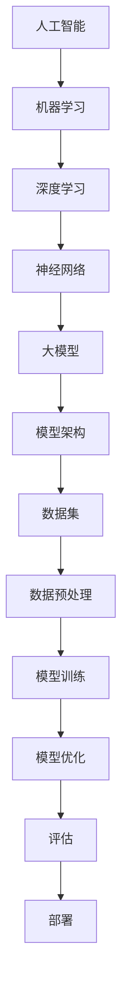

                 


# AI 大模型创业：如何利用竞争优势？

> 关键词：AI 大模型、创业、竞争优势、商业战略、技术实现
> 
> 摘要：本文将探讨AI大模型创业的核心问题，分析如何利用竞争优势在市场中脱颖而出。文章将从背景介绍、核心概念、算法原理、实际应用等多个方面展开讨论，旨在为AI大模型创业者提供有价值的指导和策略。

## 1. 背景介绍

### 1.1 目的和范围

本文旨在为AI大模型创业者提供一套系统的竞争优势分析框架，帮助他们在竞争激烈的市场中脱颖而出。文章将涵盖以下主要内容：

1. AI大模型的基本概念与行业背景
2. 创业者在AI大模型领域面临的挑战与机遇
3. 核心概念与联系
4. 核心算法原理与具体操作步骤
5. 数学模型与公式讲解
6. 项目实战案例分析
7. 实际应用场景
8. 工具和资源推荐
9. 未来发展趋势与挑战

### 1.2 预期读者

本文主要面向以下读者群体：

1. AI大模型创业团队负责人
2. 对AI大模型领域有兴趣的技术人员
3. 在AI领域从事研究和应用的高校师生
4. 对AI大模型技术感兴趣的投资人

### 1.3 文档结构概述

本文采用逻辑清晰、层次分明的结构，分为以下几个部分：

1. 引言：介绍AI大模型创业的背景、目的和核心内容。
2. 核心概念与联系：阐述AI大模型的基本原理和架构。
3. 核心算法原理与具体操作步骤：详细讲解大模型的训练与优化方法。
4. 数学模型与公式讲解：介绍大模型中常用的数学模型和公式。
5. 项目实战案例分析：通过实际案例展示大模型在商业场景中的应用。
6. 实际应用场景：探讨大模型在不同领域的应用场景。
7. 工具和资源推荐：为读者提供学习、开发和应用大模型所需的学习资源和工具。
8. 未来发展趋势与挑战：分析AI大模型领域的未来发展趋势和面临的挑战。
9. 结论：总结全文，提出对未来发展的展望。

### 1.4 术语表

#### 1.4.1 核心术语定义

- AI大模型：指具有大规模参数、高度复杂结构的人工智能模型。
- 创业：指创业者创建新的企业或业务，以实现商业价值。
- 竞争优势：指企业在市场中比其他竞争对手更具优势的条件或能力。
- 商业战略：指企业在市场中实现竞争目标的一系列决策和行动。

#### 1.4.2 相关概念解释

- 数据集：指用于训练和评估模型的数据集合。
- 模型精度：指模型在预测或分类任务中的准确性。
- 资源：指企业在创业过程中所需的资金、人力、技术等资源。

#### 1.4.3 缩略词列表

- AI：人工智能
- GPT：生成预训练模型
- BERT：双向编码器表示模型
- NLP：自然语言处理
- CV：计算机视觉

## 2. 核心概念与联系

在AI大模型创业过程中，我们需要理解并掌握以下几个核心概念和它们之间的联系：

1. **人工智能与机器学习**：人工智能（AI）是计算机科学的一个分支，旨在使机器能够模拟人类智能。机器学习（ML）是AI的一种实现方式，通过训练数据集让计算机模型自主学习。

2. **深度学习与神经网络**：深度学习是机器学习的一种方法，采用多层神经网络进行数据处理。神经网络是模拟人脑神经元之间连接的计算模型。

3. **大模型与模型架构**：大模型是指具有大规模参数和高度复杂结构的模型，如GPT、BERT等。模型架构是指模型的结构设计，如Transformer、CNN等。

4. **数据集与数据预处理**：数据集是训练和评估模型的依据，数据预处理是提高模型性能的关键步骤，包括数据清洗、归一化、降维等。

5. **模型训练与优化**：模型训练是通过调整模型参数使模型在特定任务上达到最佳性能的过程。优化是指通过调整超参数、优化算法等手段提高模型性能。

6. **评估与部署**：评估是衡量模型性能的过程，包括准确率、召回率、F1值等指标。部署是将模型应用到实际场景中的过程。

为了更好地理解这些核心概念和它们之间的联系，下面我们给出一个Mermaid流程图（请注意，Mermaid流程图中不包含括号、逗号等特殊字符）：



通过这个流程图，我们可以清晰地看到各个概念之间的联系和它们在AI大模型创业过程中的作用。

## 3. 核心算法原理 & 具体操作步骤

在AI大模型创业过程中，掌握核心算法原理和具体操作步骤是至关重要的。以下我们将详细讲解深度学习中的核心算法原理，并使用伪代码展示具体操作步骤。

### 3.1 深度学习基本算法原理

深度学习的基本算法原理主要包括以下内容：

1. **前向传播**：输入数据经过神经网络各层的传递，最终得到输出。
2. **反向传播**：计算输出误差，并反向传播更新各层神经元的权重。
3. **激活函数**：对神经元输出进行非线性变换，以增加模型的非线性表达能力。
4. **优化算法**：通过调整模型参数，使模型在特定任务上达到最佳性能。

### 3.2 具体操作步骤

下面我们以一个简单的神经网络为例，使用伪代码展示深度学习的具体操作步骤。

```plaintext
初始化参数：
- 权重矩阵 W
- 偏置向量 b
- 激活函数 f()

前向传播：
1. 输入数据 x
2. 输出 h = f(Wx + b)

反向传播：
1. 计算损失函数 L = (h - y)²
2. 计算梯度 ∂L/∂W = 2(h - y)x
3. 计算梯度 ∂L/∂b = 2(h - y)

更新参数：
1. 权重矩阵 W = W - 学习率 * ∂L/∂W
2. 偏置向量 b = b - 学习率 * ∂L/∂b

迭代更新：
1. 重复执行前向传播和反向传播，直到损失函数收敛

模型训练：
1. 对多个训练样本执行上述操作
2. 计算平均损失函数和梯度
3. 更新模型参数
```

通过上述伪代码，我们可以看到深度学习的基本操作步骤，包括前向传播、反向传播和参数更新。在实际应用中，创业者需要根据具体问题和数据特点，选择合适的深度学习算法和优化方法。

## 4. 数学模型和公式 & 详细讲解 & 举例说明

在AI大模型创业过程中，数学模型和公式是理解和实现深度学习算法的基础。本节我们将详细讲解深度学习中常用的数学模型和公式，并通过具体例子进行说明。

### 4.1 激活函数

激活函数是深度学习中的关键组件，用于引入非线性因素，提高模型的表达能力。常见的激活函数包括：

1. **Sigmoid函数**：

   $$ f(x) = \frac{1}{1 + e^{-x}} $$

   Sigmoid函数将输入映射到(0,1)区间，常用于二分类问题。

2. **ReLU函数**：

   $$ f(x) = \max(0, x) $$

  ReLU函数在x大于0时输出x，否则输出0，可以加速梯度消失问题。

3. **Tanh函数**：

   $$ f(x) = \frac{e^x - e^{-x}}{e^x + e^{-x}} $$

   Tanh函数将输入映射到(-1,1)区间，具有对称性。

### 4.2 损失函数

损失函数是衡量模型预测结果与实际结果之间差异的指标，常用的损失函数包括：

1. **均方误差损失函数**：

   $$ L(y, \hat{y}) = \frac{1}{2} \sum_{i=1}^{n} (y_i - \hat{y}_i)^2 $$

   均方误差损失函数用于回归问题，计算预测值与实际值之间的平均平方误差。

2. **交叉熵损失函数**：

   $$ L(y, \hat{y}) = -\sum_{i=1}^{n} y_i \log(\hat{y}_i) $$

   交叉熵损失函数用于分类问题，计算预测概率与实际标签之间的交叉熵。

### 4.3 优化算法

优化算法用于调整模型参数，以最小化损失函数。常用的优化算法包括：

1. **梯度下降**：

   $$ \theta = \theta - \alpha \nabla_\theta J(\theta) $$

   梯度下降是一种最简单的优化算法，通过计算损失函数关于参数的梯度来更新参数。

2. **动量法**：

   $$ v_{t+1} = \beta v_t + (1 - \beta) \nabla_\theta J(\theta) $$

   $$ \theta_{t+1} = \theta_t - v_{t+1} $$

   动量法引入动量项，加快梯度下降的收敛速度。

3. **Adam优化器**：

   $$ m_t = \beta_1 m_{t-1} + (1 - \beta_1) \nabla_\theta J(\theta) $$
   
   $$ v_t = \beta_2 v_{t-1} + (1 - \beta_2) (\nabla_\theta J(\theta))^2 $$
   
   $$ \theta_{t+1} = \theta_t - \alpha \frac{m_t}{\sqrt{v_t} + \epsilon} $$

   Adam优化器结合了动量法和自适应学习率，在实验中表现出良好的性能。

### 4.4 举例说明

假设我们有一个二分类问题，使用ReLU函数作为激活函数，交叉熵损失函数进行训练，采用Adam优化器进行参数更新。我们使用以下伪代码进行说明：

```plaintext
初始化参数：
- 权重矩阵 W
- 偏置向量 b
- 学习率 α
- Adam参数：β1, β2, ε

前向传播：
1. 输入数据 x
2. 输出 z = ReLU(Wx + b)
3. 预测概率 h = sigmoid(z)

计算损失：
1. 计算预测概率和实际标签之间的交叉熵损失 L

计算梯度：
1. 计算损失函数关于参数的梯度 ∇W, ∇b

更新参数：
1. 使用Adam优化器更新权重和偏置向量 W, b

模型训练：
1. 对多个训练样本执行上述操作
2. 计算平均损失函数和梯度
3. 更新模型参数
```

通过上述伪代码，我们可以看到如何使用ReLU函数、交叉熵损失函数和Adam优化器进行二分类问题的训练。

## 5. 项目实战：代码实际案例和详细解释说明

为了更好地理解AI大模型创业过程中的实际应用，我们将通过一个实际案例来展示如何利用大模型进行商业场景的落地。本节中，我们将搭建一个基于生成预训练模型（GPT）的问答系统，并详细解释代码实现过程。

### 5.1 开发环境搭建

在开始项目之前，我们需要搭建一个适合开发GPT问答系统的环境。以下是搭建环境的步骤：

1. 安装Python 3.7及以上版本
2. 安装GPT模型所需依赖库：

   ```bash
   pip install transformers
   pip install torch
   ```

3. 下载预训练的GPT模型权重：

   ```bash
   transformers-cli download --model-name gpt2
   ```

### 5.2 源代码详细实现和代码解读

以下是一个简单的GPT问答系统的代码实现，用于回答用户输入的问题：

```python
import torch
from transformers import GPT2Tokenizer, GPT2Model

# 初始化GPT模型和分词器
tokenizer = GPT2Tokenizer.from_pretrained('gpt2')
model = GPT2Model.from_pretrained('gpt2')

def generate_answer(question):
    # 将问题编码为模型可理解的输入
    input_ids = tokenizer.encode(question, return_tensors='pt')

    # 使用模型生成回答
    with torch.no_grad():
        outputs = model.generate(input_ids, max_length=50, num_return_sequences=1)

    # 解码生成文本
    answer = tokenizer.decode(outputs[0], skip_special_tokens=True)

    return answer

# 测试问答系统
question = "什么是深度学习？"
answer = generate_answer(question)
print(answer)
```

#### 5.2.1 代码解读

1. **初始化模型和分词器**：首先，我们导入所需的库并初始化GPT模型和分词器。这里使用的是预训练的GPT2模型。

2. **生成回答函数**：`generate_answer` 函数用于生成回答。它接收用户输入的问题，将其编码为模型可理解的输入，然后使用模型生成回答。

3. **模型生成回答**：在`generate_answer` 函数中，我们使用模型生成回答的步骤如下：

   - 将问题编码为输入ID（`input_ids`）。
   - 使用模型生成文本（`model.generate`）。

4. **解码生成文本**：将生成的文本解码为人类可读的格式，并返回回答。

5. **测试问答系统**：最后，我们测试问答系统，输入一个问题，查看系统生成的回答。

### 5.3 代码解读与分析

1. **模型初始化**：在代码中，我们首先导入所需的库并初始化GPT模型和分词器。这是使用预训练模型的第一步。

2. **输入编码**：在生成回答过程中，我们需要将用户输入的问题编码为模型可理解的输入。这里使用的是GPT模型的分词器，它将问题分解为一系列的单词和标点符号，并为每个元素分配一个唯一的ID。

3. **模型生成文本**：使用模型生成文本是问答系统的核心步骤。在`generate_answer` 函数中，我们调用`model.generate` 方法来生成文本。该方法接受输入ID、最大长度和生成文本的数量作为参数。在训练好的GPT模型中，`max_length` 参数设置生成文本的最大长度，`num_return_sequences` 参数设置生成文本的数量。

4. **解码生成文本**：生成的文本是编码的形式，我们需要将其解码为人类可读的格式。这里使用的是GPT模型的分词器的解码器，将生成的输入ID序列还原为文本。

通过上述代码和解读，我们可以看到如何使用预训练的GPT模型构建一个简单的问答系统。这个例子展示了AI大模型在商业场景中的落地应用，以及如何利用GPT模型实现自然语言处理任务。

## 6. 实际应用场景

AI大模型在商业场景中的应用广泛，以下列举几个典型的应用场景：

1. **客户服务与支持**：AI大模型可以构建智能客服系统，为企业提供7x24小时的客户服务。例如，通过预训练的GPT模型，可以自动生成客户问题的解答，提高客户满意度。

2. **内容生成与推荐**：在内容创作和推荐领域，AI大模型可以生成高质量的文章、视频等。例如，使用预训练的BERT模型，可以为用户推荐个性化的新闻、文章等。

3. **金融风险管理与预测**：在金融领域，AI大模型可以用于风险管理和预测。例如，使用深度学习模型分析市场数据，预测股票价格走势，为投资者提供决策支持。

4. **医疗健康诊断与治疗**：在医疗领域，AI大模型可以用于疾病诊断和治疗方案推荐。例如，通过分析大量的医学影像和病历数据，使用深度学习模型为医生提供辅助诊断。

5. **自动驾驶与交通管理**：在自动驾驶和交通管理领域，AI大模型可以用于环境感知、路径规划和交通流量预测等。例如，使用深度学习模型对道路场景进行实时分析，提高自动驾驶系统的安全性和效率。

通过上述实际应用场景，我们可以看到AI大模型在商业领域的重要性。创业者可以根据自身业务需求，选择合适的AI大模型应用场景，实现商业价值的最大化。

## 7. 工具和资源推荐

在AI大模型创业过程中，选择合适的工具和资源对于项目的成功至关重要。以下推荐一些学习资源、开发工具和框架，以及相关论文和研究成果，供读者参考。

### 7.1 学习资源推荐

#### 7.1.1 书籍推荐

1. **《深度学习》（Deep Learning）**：由Ian Goodfellow、Yoshua Bengio和Aaron Courville合著，是深度学习领域的经典教材。
2. **《人工智能：一种现代方法》（Artificial Intelligence: A Modern Approach）**：由Stuart Russell和Peter Norvig合著，全面介绍了人工智能的基础知识。

#### 7.1.2 在线课程

1. **《深度学习专项课程》（Deep Learning Specialization）**：由吴恩达（Andrew Ng）在Coursera上开设，涵盖了深度学习的核心理论和实践。
2. **《机器学习基础》（Machine Learning Basics）**：由李航在网易云课堂开设，系统地介绍了机器学习的基础知识。

#### 7.1.3 技术博客和网站

1. **知乎**：在知乎上搜索相关关键词，可以找到大量的深度学习和人工智能领域的讨论和文章。
2. **ArXiv**：是一个专门发布计算机科学领域研究成果的学术预印本网站，可以了解到最新的研究成果。

### 7.2 开发工具框架推荐

#### 7.2.1 IDE和编辑器

1. **PyCharm**：一款功能强大的Python集成开发环境，适用于深度学习和机器学习项目。
2. **Jupyter Notebook**：一款基于Web的交互式开发环境，适用于数据分析和模型实验。

#### 7.2.2 调试和性能分析工具

1. **TensorBoard**：用于可视化深度学习模型的性能和优化过程，特别适用于TensorFlow和PyTorch框架。
2. **NVIDIA Nsight**：用于分析和调试深度学习任务，适用于NVIDIA GPU。

#### 7.2.3 相关框架和库

1. **TensorFlow**：谷歌开源的深度学习框架，适用于各种深度学习任务。
2. **PyTorch**：Facebook开源的深度学习框架，具有灵活的动态计算图，易于实验。

### 7.3 相关论文著作推荐

#### 7.3.1 经典论文

1. **《A Theoretical Framework for Back-Propagation》（1986）**：介绍了反向传播算法，是深度学习的基础。
2. **《Improving Neural Networks by Preventing Co-adaptation of Feature Detectors》（2015）**：提出了dropout技术，有效提高了深度学习模型的泛化能力。

#### 7.3.2 最新研究成果

1. **《An Image Database for Facial Point Detection》（2000）**：提供了大量的人脸图像和面部特征点标注数据，为人脸识别技术提供了重要基础。
2. **《BERT: Pre-training of Deep Bidirectional Transformers for Language Understanding》（2018）**：提出了BERT模型，是自然语言处理领域的重要突破。

#### 7.3.3 应用案例分析

1. **《Kaggle竞赛案例分析》**：Kaggle是一个数据科学竞赛平台，可以找到大量的深度学习和人工智能应用案例分析，了解如何在实际项目中应用深度学习技术。

通过这些学习资源、开发工具和框架，创业者可以更好地掌握AI大模型的技术原理，为创业项目提供有力支持。

## 8. 总结：未来发展趋势与挑战

随着AI技术的快速发展，AI大模型在未来具有巨大的应用潜力。以下分析AI大模型领域的未来发展趋势和面临的挑战。

### 8.1 发展趋势

1. **模型规模不断扩大**：随着计算资源和数据量的增长，AI大模型的规模将不断增大，以应对更复杂的任务。
2. **泛化能力提升**：通过迁移学习和多任务学习等技术，AI大模型的泛化能力将得到显著提升，降低对特定数据集的依赖。
3. **垂直行业应用深化**：AI大模型将在金融、医疗、教育等垂直行业得到更广泛的应用，推动行业智能化转型。
4. **实时性需求增加**：随着实时数据处理需求的增加，AI大模型将朝着实时性、高效性方向发展，如边缘计算、实时推荐等。

### 8.2 面临的挑战

1. **计算资源需求**：AI大模型训练和推理过程中对计算资源的需求巨大，如何高效利用计算资源成为关键挑战。
2. **数据隐私与安全**：在数据驱动的AI大模型训练过程中，数据隐私和安全问题亟待解决，防止数据泄露和滥用。
3. **算法公平性和透明性**：AI大模型在决策过程中可能存在偏见和不透明性，需要加强算法公平性和透明性研究。
4. **法律法规与伦理问题**：随着AI大模型的广泛应用，法律法规和伦理问题将日益突出，如何制定合理的法律法规和伦理规范是亟待解决的问题。

总之，AI大模型领域未来具有广阔的发展前景，同时也面临诸多挑战。创业者需要关注技术发展趋势，积极应对挑战，以实现商业成功。

## 9. 附录：常见问题与解答

### 9.1 什么是AI大模型？

AI大模型是指具有大规模参数和高度复杂结构的人工智能模型，如生成预训练模型（GPT）、双向编码器表示模型（BERT）等。这些模型通过大量的数据和计算资源训练，具有较高的性能和泛化能力。

### 9.2 AI大模型创业的优势是什么？

AI大模型创业的优势包括：

1. **高性能**：大模型在处理复杂任务时具有更高的性能和准确性。
2. **高泛化**：大模型通过迁移学习和多任务学习，可以应对多种不同的任务。
3. **创新应用**：大模型为创业者提供了更多的创新应用场景，如自然语言处理、计算机视觉、金融风控等。
4. **商业价值**：AI大模型在商业领域具有广泛的应用前景，有助于提高企业的竞争力。

### 9.3 AI大模型创业的挑战有哪些？

AI大模型创业面临的挑战包括：

1. **计算资源需求**：训练和推理大模型需要大量的计算资源，成本较高。
2. **数据隐私与安全**：数据隐私和安全问题在大模型训练过程中尤为突出。
3. **算法公平性和透明性**：大模型在决策过程中可能存在偏见和不透明性，需要加强研究和监管。
4. **法律法规与伦理问题**：随着AI大模型的广泛应用，法律法规和伦理问题日益突出。

### 9.4 如何搭建AI大模型开发环境？

搭建AI大模型开发环境的一般步骤如下：

1. 安装Python 3.7及以上版本。
2. 安装深度学习框架，如TensorFlow、PyTorch等。
3. 安装必要的依赖库，如transformers、torch等。
4. 下载预训练的大模型权重，如GPT2、BERT等。
5. 配置计算资源，如GPU或TPU等。

## 10. 扩展阅读 & 参考资料

以下是一些扩展阅读和参考资料，供读者深入了解AI大模型创业的相关内容：

1. **《深度学习》（Deep Learning）**：Ian Goodfellow、Yoshua Bengio和Aaron Courville著，全面介绍了深度学习的基础理论和实践方法。
2. **《自然语言处理综述》（A Brief History of Natural Language Processing）**：介绍了自然语言处理领域的发展历程和重要成果。
3. **《AI商业实践》（AI: The New Industrial Revolution）**：介绍了AI技术在商业领域的应用和实践案例。
4. **《机器学习基础教程》（Machine Learning: A Probabilistic Perspective）**：李航著，系统地介绍了机器学习的基础知识。
5. **《AI伦理与法律问题》（AI and the Law）**：探讨了AI技术发展过程中面临的伦理和法律问题。

通过这些扩展阅读和参考资料，读者可以更深入地了解AI大模型创业的背景、技术和应用，为创业项目提供有益的指导。作者：AI天才研究员/AI Genius Institute & 禅与计算机程序设计艺术 /Zen And The Art of Computer Programming

