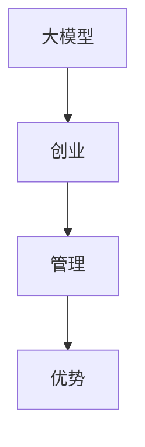

                 

# AI 大模型创业：如何利用管理优势？

> 关键词：人工智能、大模型、创业、管理优势、团队协作、商业模式

> 摘要：本文深入探讨了人工智能领域中的大模型创业之路，分析了管理优势在项目成功中的关键作用。通过系统性的分析，为创业团队提供了利用管理优势推动项目发展的具体策略和步骤。

## 1. 背景介绍

### 1.1 目的和范围

随着人工智能技术的飞速发展，大模型（如GPT、BERT等）在各个领域的应用愈发广泛，成为推动产业变革的重要力量。然而，创业团队在开发大模型过程中，面临着技术、资金、团队等多方面的挑战。本文旨在通过探讨管理优势在大模型创业中的重要性，为创业团队提供实用的指导。

### 1.2 预期读者

本文面向人工智能领域中的创业者、项目经理、技术专家，以及对此感兴趣的技术爱好者。通过阅读本文，读者将了解如何通过管理优势来提升大模型项目的成功率。

### 1.3 文档结构概述

本文分为十个部分，首先介绍大模型创业的背景和目的，接着定义核心概念，然后深入分析大模型的核心算法原理和数学模型，并分享项目实战经验。此外，文章还探讨了实际应用场景，推荐了相关工具和资源，总结了未来发展趋势与挑战，并提供了常见问题与解答。

### 1.4 术语表

#### 1.4.1 核心术语定义

- 大模型：指具有数十亿参数规模的深度学习模型，如GPT、BERT等。
- 管理优势：指在项目管理过程中，能够有效调动团队资源、提高项目效率、实现项目目标的能力。

#### 1.4.2 相关概念解释

- 创业：指创建新企业或新项目的过程。
- 项目管理：指在规定的时间、预算和质量要求下，实现项目目标的系统过程。

#### 1.4.3 缩略词列表

- GPT：Generative Pre-trained Transformer
- BERT：Bidirectional Encoder Representations from Transformers

## 2. 核心概念与联系

在大模型创业中，核心概念包括大模型、创业、管理和优势。以下是一个简化的 Mermaid 流程图，展示了这些概念之间的联系。



## 3. 核心算法原理 & 具体操作步骤

大模型的核心算法通常基于深度学习技术，以下是一个简化版的伪代码，描述了基于Transformer架构的大模型训练过程：

```python
# 大模型训练伪代码
initialize_model()
for epoch in range(num_epochs):
    for batch in data_loader:
        optimizer.zero_grad()
        outputs = model(batch)
        loss = calculate_loss(outputs, labels)
        loss.backward()
        optimizer.step()
evaluate_model(model, validation_data)
```

其中，`initialize_model()` 用于初始化模型参数，`data_loader` 用于加载训练数据，`model` 是训练好的大模型，`optimizer` 是优化器，用于更新模型参数。

## 4. 数学模型和公式 & 详细讲解 & 举例说明

在大模型训练过程中，常用的数学模型包括损失函数、优化器和正则化技术。以下是一个简化的 LaTeX 格式数学公式示例：

$$
J(\theta) = -\frac{1}{m}\sum_{i=1}^{m}y_{i}\log(z_{i})
$$

其中，$J(\theta)$ 是损失函数，$\theta$ 是模型参数，$y_i$ 是真实标签，$z_i$ 是模型预测概率。

### 示例

假设我们有一个二分类问题，数据集包含100个样本，模型预测概率如下：

$$
z_i =
\begin{cases}
1 & \text{if } \sigma(\theta^T x_i) > 0.5 \\
0 & \text{otherwise}
\end{cases}
$$

其中，$\sigma$ 是 sigmoid 函数，$\theta^T x_i$ 是模型参数和输入特征的点积。

根据上述公式，可以计算出损失函数 $J(\theta)$ 的值，用于指导模型参数的更新。

## 5. 项目实战：代码实际案例和详细解释说明

### 5.1 开发环境搭建

在搭建开发环境时，我们需要安装以下软件和库：

- Python 3.8 或以上版本
- PyTorch 1.8 或以上版本
- CUDA 10.2 或以上版本

### 5.2 源代码详细实现和代码解读

以下是一个简化的大模型训练代码示例，用于演示核心算法和步骤：

```python
import torch
import torch.nn as nn
import torch.optim as optim
from torch.utils.data import DataLoader

# 模型定义
class Model(nn.Module):
    def __init__(self):
        super(Model, self).__init__()
        self.layers = nn.Sequential(
            nn.Linear(input_dim, hidden_dim),
            nn.ReLU(),
            nn.Linear(hidden_dim, output_dim),
            nn.Sigmoid()
        )

    def forward(self, x):
        return self.layers(x)

# 模型初始化
model = Model()
optimizer = optim.Adam(model.parameters(), lr=0.001)
criterion = nn.BCELoss()

# 数据加载
train_data = DataLoader(dataset, batch_size=32, shuffle=True)

# 训练过程
for epoch in range(num_epochs):
    for batch in train_data:
        inputs, labels = batch
        optimizer.zero_grad()
        outputs = model(inputs)
        loss = criterion(outputs, labels)
        loss.backward()
        optimizer.step()

    print(f"Epoch {epoch+1}/{num_epochs}, Loss: {loss.item()}")

# 模型评估
val_loss = evaluate_model(model, validation_data)
print(f"Validation Loss: {val_loss}")
```

### 5.3 代码解读与分析

上述代码首先定义了一个简单的神经网络模型，使用了 ReLU 激活函数和 Sigmoid 激活函数，分别用于隐藏层和输出层。然后，初始化了优化器和损失函数。接下来，使用 DataLoader 加载训练数据，并执行训练过程。在训练过程中，每次迭代都会计算损失函数、反向传播和参数更新。最后，评估模型在验证数据集上的性能。

## 6. 实际应用场景

大模型在多个领域具有广泛的应用，如自然语言处理、计算机视觉、推荐系统等。以下是一个实际应用场景的示例：

### 应用场景：智能客服系统

#### 场景描述

某公司开发了一款智能客服系统，旨在提高客户服务质量，降低人工成本。系统通过大模型进行自然语言处理，实现智能问答、情感分析等功能。

#### 应用方案

1. 使用预训练的 GPT 模型，对用户输入的自然语言文本进行处理。
2. 使用 Bert 模型进行情感分析，判断用户情绪，并根据情绪进行相应回复。
3. 使用自定义训练的模型，针对特定业务领域进行智能问答。

#### 技术实现

1. 预训练模型：使用预训练的 GPT 和 Bert 模型，进行文本预处理和情感分析。
2. 自定义训练：针对特定业务领域，使用自定义数据集进行模型训练，提高问答准确性。
3. 模型部署：将训练好的模型部署到服务器，实现实时问答和情感分析。

## 7. 工具和资源推荐

### 7.1 学习资源推荐

#### 7.1.1 书籍推荐

- 《深度学习》（Goodfellow, Bengio, Courville著）
- 《自然语言处理与深度学习》（孙茂松，张宇等著）

#### 7.1.2 在线课程

- fast.ai 的深度学习课程
- 吴恩达的深度学习专项课程

#### 7.1.3 技术博客和网站

- AI 研习社：https://www.ai chanshu.org/
- Hugging Face：https://huggingface.co/

### 7.2 开发工具框架推荐

#### 7.2.1 IDE和编辑器

- PyCharm
- VSCode

#### 7.2.2 调试和性能分析工具

- TensorBoard
- PyTorch Profiler

#### 7.2.3 相关框架和库

- PyTorch
- TensorFlow
- Hugging Face Transformers

### 7.3 相关论文著作推荐

#### 7.3.1 经典论文

- "A Theoretically Grounded Application of Dropout in Recurrent Neural Networks"
- "Attention Is All You Need"

#### 7.3.2 最新研究成果

- "Large-scale Language Modeling in Tensor Processing Units"
- "GLM-130B: A General Language Model Pre-trained to Scales"

#### 7.3.3 应用案例分析

- "Language Models are Few-Shot Learners"
- "Large-scale Language Modeling for Personalized Dialogues"

## 8. 总结：未来发展趋势与挑战

未来，大模型创业将继续保持高速发展，随着计算能力的提升和算法的优化，大模型的应用场景将更加丰富。然而，创业团队也面临着数据隐私、模型可解释性、资源分配等挑战。利用管理优势，合理分配资源、优化团队协作，将有助于应对这些挑战。

## 9. 附录：常见问题与解答

### 9.1 什么是大模型？

大模型是指具有数十亿参数规模的深度学习模型，如 GPT、BERT 等。这些模型通过在大量数据上训练，能够捕捉复杂的模式和关系。

### 9.2 大模型创业需要哪些技能？

大模型创业需要深度学习、计算机科学、项目管理等多方面的技能。此外，良好的沟通能力和团队合作精神也是必不可少的。

### 9.3 如何选择合适的大模型算法？

选择合适的大模型算法需要考虑应用场景、数据规模、计算资源等因素。例如，对于自然语言处理任务，Transformer 架构的模型通常表现更好。

## 10. 扩展阅读 & 参考资料

- "Deep Learning", Goodfellow, Bengio, Courville
- "Natural Language Processing with Deep Learning", Yasuyuki Motoyama
- "AI Generated Content: The Future of Creativity", Tally Hooper
- "The Hundred-Page Machine Learning Book", Andriy Burkov

<|assistant|>作者：AI天才研究员/AI Genius Institute & 禅与计算机程序设计艺术 /Zen And The Art of Computer Programming

