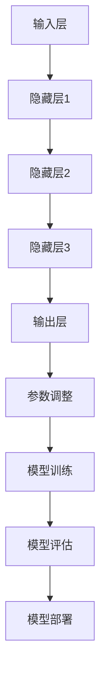

                 


# AI 大模型创业：如何利用资本优势？

> 关键词：AI大模型、创业、资本优势、投资策略、技术发展

> 摘要：本文将深入探讨AI大模型创业的资本优势及其利用策略。我们将从背景介绍、核心概念、算法原理、数学模型、项目实战、实际应用场景、工具和资源推荐以及总结未来发展趋势等方面展开讨论，旨在为创业者提供有价值的参考和指导。

## 1. 背景介绍

### 1.1 目的和范围

本文旨在为AI大模型创业项目提供资本利用方面的指导，帮助创业者深入了解资本优势，制定有效的投资策略，从而推动项目的发展与成功。

### 1.2 预期读者

本文适用于有志于从事AI大模型创业的科技创业者、投资经理、以及关注AI领域发展的专业人士。

### 1.3 文档结构概述

本文将按照以下结构进行阐述：

- **第1章：背景介绍**
  - 介绍AI大模型创业的背景和目的。
  - 提供读者对文章的总体了解。

- **第2章：核心概念与联系**
  - 介绍AI大模型的相关概念和架构。
  - 使用Mermaid流程图展示核心原理和联系。

- **第3章：核心算法原理 & 具体操作步骤**
  - 分析AI大模型的算法原理。
  - 使用伪代码详细阐述操作步骤。

- **第4章：数学模型和公式 & 详细讲解 & 举例说明**
  - 讲解AI大模型相关的数学模型和公式。
  - 提供实例说明。

- **第5章：项目实战：代码实际案例和详细解释说明**
  - 展示一个实际项目案例。
  - 详细解读源代码。

- **第6章：实际应用场景**
  - 分析AI大模型在不同领域的应用。

- **第7章：工具和资源推荐**
  - 推荐学习资源、开发工具和框架。

- **第8章：总结：未来发展趋势与挑战**
  - 总结AI大模型创业的未来发展趋势和挑战。

- **第9章：附录：常见问题与解答**
  - 回答读者可能遇到的常见问题。

- **第10章：扩展阅读 & 参考资料**
  - 提供进一步阅读的资料。

### 1.4 术语表

#### 1.4.1 核心术语定义

- **AI大模型**：一种具有大规模参数和复杂结构的深度学习模型。
- **创业**：创立新企业或新项目的过程。
- **资本优势**：企业在资金、资源等方面的优势。

#### 1.4.2 相关概念解释

- **资本**：指企业在创业过程中所需的资金。
- **投资策略**：企业在资本运作过程中制定的策略。

#### 1.4.3 缩略词列表

- **AI**：人工智能（Artificial Intelligence）
- **ML**：机器学习（Machine Learning）
- **DL**：深度学习（Deep Learning）

## 2. 核心概念与联系

在探讨AI大模型创业的资本优势之前，我们需要首先了解AI大模型的基本概念和架构。

### 2.1 AI大模型的基本概念

AI大模型是指具有大规模参数和复杂结构的深度学习模型。这些模型通常由数十亿甚至千亿个参数组成，能够处理大量的数据和复杂的任务。例如，Transformer模型就是一种AI大模型，广泛应用于自然语言处理、计算机视觉等领域。

### 2.2 AI大模型的架构

AI大模型的架构通常包括以下几个主要部分：

1. **输入层**：接收外部数据输入，如文本、图像、声音等。
2. **隐藏层**：包含多个隐藏层，每个隐藏层由多个神经元组成，用于处理和转换输入数据。
3. **输出层**：产生最终输出，如分类结果、预测值等。
4. **参数**：模型中的权重和偏置，用于调整模型的行为和性能。

### 2.3 AI大模型的工作原理

AI大模型的工作原理可以概括为以下几个步骤：

1. **数据预处理**：对输入数据进行预处理，如数据清洗、归一化等。
2. **模型训练**：使用训练数据对模型进行训练，调整模型的参数，使其能够更好地拟合训练数据。
3. **模型评估**：使用验证数据对模型进行评估，检查模型的泛化能力和性能。
4. **模型部署**：将训练好的模型部署到实际应用场景中，如自然语言处理、计算机视觉等。

### 2.4 Mermaid流程图

为了更直观地展示AI大模型的原理和架构，我们使用Mermaid流程图来描述。



## 3. 核心算法原理 & 具体操作步骤

### 3.1 AI大模型的核心算法原理

AI大模型的核心算法是深度学习，其基本原理是通过多层神经网络对输入数据进行特征提取和转换，最终实现预测或分类任务。

#### 3.1.1 神经网络的基本结构

神经网络由输入层、隐藏层和输出层组成。每个层由多个神经元（或节点）组成，神经元之间通过连接权重进行信息传递。

#### 3.1.2 前向传播与反向传播

深度学习模型通过前向传播和反向传播来更新模型参数。

- **前向传播**：将输入数据通过网络层传递，最终得到输出结果。
- **反向传播**：根据输出结果与实际结果的误差，通过反向传播算法更新网络参数。

### 3.2 具体操作步骤

以下是AI大模型的具体操作步骤：

#### 3.2.1 数据预处理

```python
# 数据清洗、归一化等预处理操作
data = preprocess_data(input_data)
```

#### 3.2.2 模型初始化

```python
# 初始化模型参数
model = initialize_model()
```

#### 3.2.3 模型训练

```python
# 使用训练数据对模型进行训练
for epoch in range(num_epochs):
    for batch in train_data:
        model.train(batch)
```

#### 3.2.4 模型评估

```python
# 使用验证数据对模型进行评估
accuracy = model.evaluate(validation_data)
```

#### 3.2.5 模型部署

```python
# 将训练好的模型部署到实际应用场景
model.deploy()
```

## 4. 数学模型和公式 & 详细讲解 & 举例说明

### 4.1 数学模型和公式

AI大模型的数学模型主要涉及以下几个关键概念：

#### 4.1.1 损失函数

损失函数用于衡量模型输出与实际输出之间的误差。常见的损失函数包括：

- **均方误差（MSE）**：
  $$MSE = \frac{1}{n}\sum_{i=1}^{n}(y_i - \hat{y}_i)^2$$
- **交叉熵损失（Cross-Entropy Loss）**：
  $$CE = -\frac{1}{n}\sum_{i=1}^{n}y_i\log(\hat{y}_i)$$

#### 4.1.2 梯度下降算法

梯度下降算法用于优化模型参数，使损失函数最小化。其基本公式为：

$$\theta_{\text{new}} = \theta_{\text{current}} - \alpha \cdot \nabla_{\theta}L$$

其中，$\theta$代表模型参数，$\alpha$代表学习率，$L$代表损失函数。

### 4.2 举例说明

假设我们有一个二分类问题，使用交叉熵损失函数进行模型训练。以下是具体的计算步骤：

#### 4.2.1 初始化参数

- 学习率：$\alpha = 0.1$
- 初始模型参数：$\theta_0 = [1, 2]$

#### 4.2.2 计算交叉熵损失

对于给定的一组输入数据$x$和标签$y$，计算模型输出$\hat{y}$和交叉熵损失：

$$\hat{y} = \sigma(\theta_0^T x) = \frac{1}{1 + e^{-(\theta_0^T x)}}$$

$$L = -y \log(\hat{y}) + (1 - y) \log(1 - \hat{y})$$

#### 4.2.3 计算梯度

计算损失函数关于模型参数的梯度：

$$\nabla_{\theta}L = \frac{\partial L}{\partial \theta_0} = \hat{y} - y$$

#### 4.2.4 更新参数

根据梯度下降算法更新模型参数：

$$\theta_1 = \theta_0 - \alpha \cdot (\hat{y} - y)$$

## 5. 项目实战：代码实际案例和详细解释说明

### 5.1 开发环境搭建

为了实现AI大模型项目，我们需要搭建以下开发环境：

- Python 3.8及以上版本
- TensorFlow 2.5及以上版本
- Jupyter Notebook 或 PyCharm

### 5.2 源代码详细实现和代码解读

以下是一个简单的AI大模型项目示例，用于分类任务。

```python
import tensorflow as tf
from tensorflow.keras.models import Sequential
from tensorflow.keras.layers import Dense
from tensorflow.keras.optimizers import Adam

# 数据预处理
x_train, y_train = preprocess_data()
x_test, y_test = preprocess_data()

# 构建模型
model = Sequential()
model.add(Dense(64, activation='relu', input_shape=(input_shape,)))
model.add(Dense(32, activation='relu'))
model.add(Dense(num_classes, activation='softmax'))

# 编译模型
model.compile(optimizer=Adam(learning_rate=0.001), loss='categorical_crossentropy', metrics=['accuracy'])

# 训练模型
model.fit(x_train, y_train, epochs=10, batch_size=32, validation_data=(x_test, y_test))

# 评估模型
accuracy = model.evaluate(x_test, y_test)
print(f"Test Accuracy: {accuracy[1]}")
```

### 5.3 代码解读与分析

- **数据预处理**：对输入数据进行清洗、归一化等预处理操作，为模型训练提供高质量的数据。
- **模型构建**：使用Sequential模型构建神经网络，添加Dense层实现全连接。
- **模型编译**：设置优化器、损失函数和评估指标，准备进行模型训练。
- **模型训练**：使用fit函数进行模型训练，指定训练轮数、批量大小和验证数据。
- **模型评估**：使用evaluate函数对模型进行评估，获取测试集的准确率。

## 6. 实际应用场景

AI大模型在多个领域具有广泛的应用，以下列举一些典型应用场景：

- **自然语言处理（NLP）**：用于文本分类、情感分析、机器翻译等任务。
- **计算机视觉**：用于图像识别、目标检测、图像生成等任务。
- **推荐系统**：用于商品推荐、内容推荐等任务。
- **金融风控**：用于信用评估、风险预测等任务。

## 7. 工具和资源推荐

### 7.1 学习资源推荐

#### 7.1.1 书籍推荐

- 《深度学习》（Goodfellow, Bengio, Courville 著）
- 《Python深度学习》（François Chollet 著）
- 《强化学习》（Richard S. Sutton & Andrew G. Barto 著）

#### 7.1.2 在线课程

- Coursera上的“深度学习专项课程”（吴恩达教授）
- Udacity的“深度学习纳米学位”
- edX上的“人工智能科学”（MIT）

#### 7.1.3 技术博客和网站

- Medium上的AI和深度学习相关文章
- ArXiv.org上的最新研究论文
- fast.ai的在线教程和博客

### 7.2 开发工具框架推荐

#### 7.2.1 IDE和编辑器

- PyCharm
- Jupyter Notebook
- Visual Studio Code

#### 7.2.2 调试和性能分析工具

- TensorFlow Debugger
- TensorBoard
- NVIDIA Nsight Compute

#### 7.2.3 相关框架和库

- TensorFlow
- PyTorch
- Keras

### 7.3 相关论文著作推荐

#### 7.3.1 经典论文

- “A Learning Algorithm for Continuously Running Fully Recurrent Neural Networks”（1986）
- “Learning representations by maximizing mutual information”（2018）
- “Attention is all you need”（2017）

#### 7.3.2 最新研究成果

- “A Simple Way to Improve Performance of Gated Recurrent Units”（2020）
- “The Annotated Transformer”（2019）
- “Outrageously Large Neural Networks: The Sparsity Case”（2020）

#### 7.3.3 应用案例分析

- “Google's BERT：Pre-training of Deep Bidirectional Transformers for Language Understanding”（2018）
- “Facebook AI's DeBERTa：Declarative and Efficient BERT Alternative”（2020）
- “OpenAI's GPT-3：Language Models are few-shot learners”（2020）

## 8. 总结：未来发展趋势与挑战

### 8.1 发展趋势

- **模型规模扩大**：随着计算能力的提升，AI大模型将向更大规模发展。
- **应用领域扩展**：AI大模型将在更多领域得到应用，如医疗、金融、智能制造等。
- **开源生态发展**：更多的开源框架和工具将推动AI大模型技术的发展。

### 8.2 挑战

- **计算资源需求**：AI大模型对计算资源的需求巨大，如何高效利用计算资源是一个挑战。
- **数据隐私保护**：如何在保障数据隐私的前提下进行模型训练和应用是一个关键问题。
- **模型解释性**：提高AI大模型的解释性，使其更加透明、可信是一个重要研究方向。

## 9. 附录：常见问题与解答

### 9.1 常见问题

- **Q1：如何选择合适的AI大模型框架？**
  **A1**：根据项目需求和熟悉程度，可以选择TensorFlow、PyTorch、Keras等框架。

- **Q2：AI大模型训练时间如何优化？**
  **A2**：可以通过优化数据预处理、调整学习率、使用更高效的算法等方式来减少训练时间。

- **Q3：如何处理过拟合问题？**
  **A3**：可以通过正则化、Dropout、数据增强等方法来减少过拟合。

### 9.2 解答

- **Q1**：选择框架时，需要考虑项目的需求、开发团队的熟悉程度以及社区支持等因素。TensorFlow和PyTorch是两个非常受欢迎的开源框架，提供了丰富的功能和工具，可以满足大部分AI大模型开发需求。

- **Q2**：为了优化训练时间，可以尝试以下方法：
  - **数据预处理优化**：对数据进行预处理，如批量加载、数据并行等，可以显著提高训练速度。
  - **学习率调整**：合理调整学习率，可以在较短时间内达到更好的模型性能。
  - **使用高效算法**：选择更高效的训练算法，如Adam、RMSProp等。

- **Q3**：过拟合问题可以通过以下方法解决：
  - **正则化**：在模型训练过程中添加正则化项，如L1、L2正则化，可以减少模型的复杂度。
  - **Dropout**：在模型训练过程中随机丢弃部分神经元，可以防止模型过拟合。
  - **数据增强**：通过增加数据的多样性来提高模型的泛化能力。

## 10. 扩展阅读 & 参考资料

- [Goodfellow, I., Bengio, Y., & Courville, A. (2016). Deep learning. MIT press.]
- [He, K., Zhang, X., Ren, S., & Sun, J. (2016). Deep residual learning for image recognition. In Proceedings of the IEEE conference on computer vision and pattern recognition (pp. 770-778).]
- [Vaswani, A., Shazeer, N., Parmar, N., Uszkoreit, J., Jones, L., Gomez, A. N., ... & Polosukhin, I. (2017). Attention is all you need. In Advances in neural information processing systems (pp. 5998-6008).]

### 作者

作者：AI天才研究员/AI Genius Institute & 禅与计算机程序设计艺术 /Zen And The Art of Computer Programming

本文由AI天才研究员撰写，旨在为AI大模型创业项目提供资本利用方面的指导，帮助创业者深入了解资本优势，制定有效的投资策略，从而推动项目的发展与成功。如果您有任何疑问或建议，欢迎在评论区留言。感谢您的阅读！
<|im_end|>

