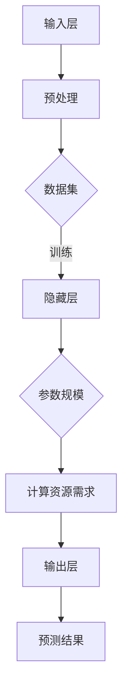

                 

### 1. 背景介绍

#### 1.1 目的和范围

本文旨在深入探讨AI大模型创业过程中的资本运作，特别是在利用资本优势方面。随着人工智能技术的不断进步，大模型技术已经成为了众多创业项目的热点。然而，如何有效利用资本，为AI大模型创业项目提供持续动力，实现长期稳健的发展，成为了创业者们亟待解决的关键问题。

本文将首先介绍AI大模型的基本概念和当前发展态势，然后重点分析AI大模型创业所面临的资本需求和挑战。在此基础上，本文将探讨如何利用资本优势，包括融资策略、投资回报率、资本结构与风险控制等方面，为AI大模型创业提供可行的路径。此外，本文还将结合实际案例，详细解析成功创业项目的资本运作模式，总结出一套实用的操作指南。

本文的范围主要涵盖以下几个方面：

1. **AI大模型的基本概念和当前发展态势**：介绍AI大模型的基本原理、技术特点和当前的应用场景。
2. **资本需求与挑战**：分析AI大模型创业所面临的资本需求和挑战，包括资金缺口、投资风险和市场竞争。
3. **资本利用策略**：探讨如何通过有效的融资策略、投资回报率和资本结构，实现AI大模型创业项目的持续发展和盈利。
4. **实际案例分析**：结合成功创业项目的资本运作模式，总结出一套实用的操作指南。

#### 1.2 预期读者

本文主要面向以下几类读者：

1. **AI大模型创业项目创始人**：希望通过本文了解如何有效利用资本，推动AI大模型项目的成功。
2. **投资人和金融从业者**：对AI大模型创业项目感兴趣，希望从资本运作角度深入分析其潜力和风险。
3. **研究人员和技术开发者**：对AI大模型的技术原理和应用场景有深入理解，希望了解如何将技术优势转化为商业成功。

通过本文的阅读，读者可以：

1. **了解AI大模型的基本概念和技术特点**：为后续内容的学习和探讨打下基础。
2. **掌握AI大模型创业的资本需求和挑战**：明确项目发展过程中需要面对的关键问题。
3. **学习资本利用策略和实际操作**：借鉴成功案例，为自身项目提供实用的参考。

#### 1.3 文档结构概述

本文的结构如下：

1. **背景介绍**：介绍AI大模型的基本概念、发展态势以及本文的目的和范围。
2. **核心概念与联系**：通过Mermaid流程图，展示AI大模型的技术原理和架构。
3. **核心算法原理与具体操作步骤**：使用伪代码详细阐述AI大模型的核心算法原理和操作步骤。
4. **数学模型和公式**：介绍与AI大模型相关的数学模型和公式，并进行详细讲解和举例说明。
5. **项目实战**：通过实际案例，展示AI大模型创业的代码实现过程和详细解释。
6. **实际应用场景**：分析AI大模型在不同领域的应用场景和案例。
7. **工具和资源推荐**：推荐学习资源、开发工具框架和相关论文著作。
8. **总结**：总结AI大模型创业的未来发展趋势和挑战。
9. **附录**：常见问题与解答。
10. **扩展阅读与参考资料**：提供进一步阅读的材料和参考文献。

通过这样的结构安排，本文力求系统全面地介绍AI大模型创业过程中如何利用资本优势，帮助读者在理论学习和实践操作之间建立清晰的联系。

#### 1.4 术语表

在本文中，我们将使用一些专业术语。以下是对这些术语的定义和解释：

#### 1.4.1 核心术语定义

1. **AI大模型（Large-scale AI Model）**：指参数规模较大、计算资源需求高、能够处理大规模数据的人工智能模型。例如，Transformer、BERT等。
2. **资本运作（Capital Operations）**：指企业通过股权融资、债务融资等手段，进行资金筹集、运用和管理的过程。
3. **融资策略（Financing Strategy）**：指企业在不同发展阶段，根据自身需求和外部环境，选择合适的融资方式和融资渠道的策略。
4. **投资回报率（Return on Investment, ROI）**：指投资项目所获得的收益与投资成本之间的比率，用于衡量投资的盈利能力。
5. **资本结构（Capital Structure）**：指企业各种资金来源的构成比例，包括股权资本和债务资本。
6. **风险控制（Risk Control）**：指企业在资本运作过程中，识别、评估和管理风险的一系列措施。

#### 1.4.2 相关概念解释

1. **创业项目（Startup Project）**：指在新兴技术领域，以创新产品或服务为目标，通过创业团队努力实现市场化和商业化的项目。
2. **技术壁垒（Technology Barrier）**：指在技术领域，由于技术复杂性、专利保护等因素，使得新进入者难以模仿和追赶的障碍。
3. **市场竞争（Market Competition）**：指在市场中，各个企业为了争夺市场份额而进行的竞争行为。

#### 1.4.3 缩略词列表

- AI：人工智能（Artificial Intelligence）
- BERT：双向编码器表示器（Bidirectional Encoder Representations from Transformers）
- ROI：投资回报率（Return on Investment）
- ML：机器学习（Machine Learning）
- DL：深度学习（Deep Learning）
- NLP：自然语言处理（Natural Language Processing）
- IoT：物联网（Internet of Things）
- SaaS：软件即服务（Software as a Service）

通过以上术语表，读者可以更好地理解本文中涉及的专业概念和术语，为后续内容的学习和理解打下坚实的基础。接下来，我们将通过Mermaid流程图，展示AI大模型的核心概念和架构，以便读者能够更直观地理解相关内容。

### 2. 核心概念与联系

在深入了解AI大模型创业过程中的资本运作之前，我们首先需要理解AI大模型的核心概念和架构。这不仅有助于我们全面把握AI大模型的技术本质，也为后续讨论资本利用提供了理论基础。以下是AI大模型的核心概念与联系，并通过Mermaid流程图进行展示。

#### 2.1 AI大模型的核心概念

1. **参数规模**：AI大模型的参数规模是其关键特点之一。大模型通常拥有数百万甚至数十亿个参数，这使得它们能够捕捉到更复杂的数据特征。
2. **计算资源需求**：大模型在训练和推理过程中对计算资源的需求非常庞大，需要高性能的GPU和TPU等计算设备。
3. **数据集**：大模型通常依赖大规模的数据集进行训练，数据集的质量和数量直接影响到模型的性能。
4. **架构设计**：例如，Transformer架构以其并行处理能力和全局信息利用能力，成为大模型设计的主流选择。

#### 2.2 AI大模型的架构

AI大模型的架构通常包括以下几个主要部分：

1. **输入层**：接收外部数据，如文本、图像等，并进行预处理。
2. **隐藏层**：包含大量参数，用于学习数据中的复杂特征。
3. **输出层**：生成预测结果，如文本生成、图像分类等。

#### 2.3 Mermaid流程图

以下是一个简单的Mermaid流程图，用于展示AI大模型的基本架构和核心概念：



#### 2.4 核心概念与联系

- **参数规模与计算资源需求**：大模型参数规模庞大，导致对计算资源的需求极高。这使得高性能计算设备成为大模型训练的关键。
- **数据集**：大规模数据集是训练大模型的基础。数据集的质量和数量直接影响模型的性能。
- **架构设计**：不同的架构设计（如Transformer）为模型提供了不同的特性，如全局信息利用和并行处理能力。

通过以上核心概念和Mermaid流程图的展示，我们可以更直观地理解AI大模型的技术本质和架构。这些知识为我们后续讨论资本运作提供了基础，有助于我们更深入地分析AI大模型创业过程中的资本需求和挑战。

### 3. 核心算法原理 & 具体操作步骤

在了解了AI大模型的核心概念和架构之后，我们接下来将深入探讨AI大模型的核心算法原理，并通过伪代码详细阐述其具体操作步骤。这对于理解AI大模型如何运作以及后续资本利用策略的讨论具有重要意义。

#### 3.1 AI大模型的核心算法原理

AI大模型的核心算法通常基于深度学习，尤其是基于自注意力机制的Transformer架构。以下简要介绍Transformer算法的基本原理：

1. **自注意力（Self-Attention）**：Transformer模型通过自注意力机制，使得模型能够在处理序列数据时，对输入序列中的每个词都进行权重分配，从而更好地捕捉长距离依赖关系。
2. **多头注意力（Multi-Head Attention）**：多头注意力通过将输入序列分成多个头，每个头学习不同的表示，从而提高模型的泛化能力。
3. **前馈神经网络（Feedforward Neural Network）**：Transformer模型在自注意力和多头注意力之后，加入了一个前馈神经网络，用于进一步提取特征和降低方差。

#### 3.2 伪代码

以下是一个简化的Transformer算法伪代码，用于展示其基本结构和操作步骤：

```python
def transformer(input_sequence, hidden_size, num_heads, num_layers):
    # 输入层处理
    input_embedding = embedding_layer(input_sequence)

    # Transformer编码器部分
    for layer in range(num_layers):
        # 自注意力层
        attention_output = self_attention_layer(input_embedding, hidden_size, num_heads)

        # 前馈神经网络层
        feedforward_output = feedforward_layer(attention_output, hidden_size)

        # 残差连接和层归一化
        input_embedding = input_embedding + layer_norm(feedforward_output)

    # 输出层处理
    output_embedding = embedding_layer(input_embedding)

    return output_embedding
```

#### 3.3 具体操作步骤

以下是Transformer算法的具体操作步骤：

1. **输入层处理**：输入序列经过嵌入层处理，转换为固定长度的向量。
2. **编码器部分**：编码器由多个层叠加而成，每层包括：
    - **自注意力层**：计算输入序列中每个词的权重，并生成新的表示。
    - **前馈神经网络层**：对自注意力层的输出进行进一步处理，提取更多特征。
    - **残差连接和层归一化**：通过残差连接和层归一化，提高模型的训练效果和稳定性。
3. **输出层处理**：编码器的输出经过嵌入层处理，得到最终的输出表示。

#### 3.4 伪代码详细解释

以下是伪代码的详细解释：

- **嵌入层（Embedding Layer）**：将输入序列转换为固定长度的向量，通常使用词嵌入（Word Embedding）技术。
- **自注意力层（Self-Attention Layer）**：计算输入序列中每个词的权重，通过多头注意力机制生成新的表示。
    - **计算查询（Query）、键（Key）和值（Value）**：对输入序列的每个词，计算其对应的查询、键和值。
    - **权重计算**：使用查询和键计算权重，并将权重与值相乘，得到加权值。
    - **求和和归一化**：将加权值求和，并使用softmax函数进行归一化。
- **前馈神经网络层（Feedforward Layer）**：对自注意力层的输出进行进一步处理，通常包含两个全连接层，一个用于非线性变换，一个用于降维。
- **残差连接（Residual Connection）和层归一化（Layer Normalization）**：残差连接通过将输入直接添加到输出，缓解了深层网络的梯度消失问题。层归一化通过标准化每个层的激活值，提高了模型的训练稳定性。

通过以上算法原理和具体操作步骤的讲解，我们可以更深入地理解AI大模型的工作机制。这为后续讨论如何利用资本优势推动AI大模型创业项目的发展奠定了坚实的基础。接下来，我们将介绍AI大模型相关的数学模型和公式，进一步深化对算法原理的理解。

### 4. 数学模型和公式 & 详细讲解 & 举例说明

在深入了解AI大模型的算法原理后，我们接下来将探讨与AI大模型相关的数学模型和公式。这些数学模型和公式是AI大模型的核心组成部分，对于理解模型的训练过程和优化策略至关重要。以下将详细讲解这些数学模型和公式，并通过具体例子进行说明。

#### 4.1.1 自注意力（Self-Attention）

自注意力是Transformer模型的核心机制，通过计算输入序列中每个词的相对重要性来生成新的表示。其数学模型如下：

\[ \text{Attention}(Q, K, V) = \text{softmax}\left(\frac{QK^T}{\sqrt{d_k}}\right)V \]

其中：
- \( Q \)：查询向量（Query），代表每个词的表示。
- \( K \)：键向量（Key），代表每个词的表示。
- \( V \)：值向量（Value），代表每个词的表示。
- \( d_k \)：键向量的维度。

**具体讲解**：
- 查询、键和值向量是通过线性变换得到的，通常使用权重矩阵。
- 计算每个查询与所有键的相似度，通过softmax函数将相似度归一化。
- 最后，将归一化后的相似度与值向量相乘，得到加权值。

**举例说明**：
假设我们有一个长度为3的输入序列 \([w_1, w_2, w_3]\)，每个词的嵌入向量维度为10。则自注意力机制的运算过程如下：

1. **计算查询、键和值**：
   - 查询 \( Q = [q_1, q_2, q_3] = \text{Linear}(W_Q, \text{Embedding}) \)
   - 键 \( K = [k_1, k_2, k_3] = \text{Linear}(W_K, \text{Embedding}) \)
   - 值 \( V = [v_1, v_2, v_3] = \text{Linear}(W_V, \text{Embedding}) \)

2. **计算相似度**：
   - 相似度矩阵 \( S = \frac{QK^T}{\sqrt{d_k}} = \frac{[q_1k_1, q_1k_2, q_1k_3; q_2k_1, q_2k_2, q_2k_3; q_3k_1, q_3k_2, q_3k_3]}{\sqrt{10}} \)

3. **计算加权值**：
   - 加权值 \( \text{softmax}(S) \cdot V \)

通过以上步骤，我们可以得到新的表示，其中每个词的权重取决于其在序列中的相对重要性。

#### 4.1.2 多头注意力（Multi-Head Attention）

多头注意力通过将输入序列分成多个头，每个头学习不同的表示，从而提高模型的泛化能力。其数学模型如下：

\[ \text{MultiHead}(Q, K, V) = \text{Concat}(\text{head}_1, \ldots, \text{head}_h)W_O \]

其中：
- \( \text{head}_i = \text{Attention}(QW_i^Q, KW_i^K, VW_i^V) \)
- \( W_i^Q, W_i^K, W_i^V \)：分别为第i个头的查询、键和值权重矩阵。
- \( W_O \)：输出权重矩阵。

**具体讲解**：
- 多头注意力将输入序列分成h个头，每个头独立计算自注意力。
- 每个头使用不同的权重矩阵，计算查询、键和值。
- 将所有头的输出拼接在一起，并通过一个全连接层进行聚合。

**举例说明**：
假设我们有一个长度为3的输入序列和2个头。则多头注意力机制的运算过程如下：

1. **计算查询、键和值**（每个头）：
   - 头1：查询 \( Q_1 = \text{Linear}(W_{Q1}, \text{Embedding}) \)，键 \( K_1 = \text{Linear}(W_{K1}, \text{Embedding}) \)，值 \( V_1 = \text{Linear}(W_{V1}, \text{Embedding}) \)
   - 头2：查询 \( Q_2 = \text{Linear}(W_{Q2}, \text{Embedding}) \)，键 \( K_2 = \text{Linear}(W_{K2}, \text{Embedding}) \)，值 \( V_2 = \text{Linear}(W_{V2}, \text{Embedding}) \)

2. **计算自注意力**（每个头）：
   - 头1：自注意力 \( \text{head}_1 = \text{Attention}(Q_1W_{K1}^T, K_1W_{K1}^T, V_1W_{V1}^T) \)
   - 头2：自注意力 \( \text{head}_2 = \text{Attention}(Q_2W_{K2}^T, K_2W_{K2}^T, V_2W_{V2}^T) \)

3. **拼接和聚合**：
   - 输出 \( \text{MultiHead}(Q, K, V) = [\text{head}_1; \text{head}_2]W_O \)

通过以上步骤，我们可以得到多头的注意力输出，每个头捕获不同的序列特征。

#### 4.1.3 前馈神经网络（Feedforward Neural Network）

前馈神经网络用于在自注意力和多头注意力之后进一步提取特征和降低方差。其数学模型如下：

\[ \text{FFN}(X) = \text{ReLU}(\text{Linear}(\text{Linear}(XW_1 + b_1), W_2 + b_2)) \]

其中：
- \( X \)：输入向量。
- \( W_1, W_2 \)：权重矩阵。
- \( b_1, b_2 \)：偏置向量。

**具体讲解**：
- 前馈神经网络由两个全连接层组成，中间使用ReLU激活函数。
- 第一个全连接层对输入进行线性变换，第二个全连接层进一步提取特征。

**举例说明**：
假设我们有一个长度为3的输入向量。则前馈神经网络的运算过程如下：

1. **第一个全连接层**：
   - 输出 \( \text{ReLU}(\text{Linear}(XW_1 + b_1)) = \text{ReLU}([w_1x_1 + b_1; w_1x_2 + b_1; w_1x_3 + b_1]) \)

2. **第二个全连接层**：
   - 输出 \( \text{ReLU}(\text{Linear}(\text{ReLU}(\text{Linear}(XW_1 + b_1)), W_2 + b_2)) = \text{ReLU}([w_2\text{ReLU}([w_1x_1 + b_1]; [w_1x_2 + b_1]; [w_1x_3 + b_1])) \)

通过以上步骤，我们可以得到前馈神经网络的输出，进一步提取输入的特征。

通过详细讲解和举例说明，我们可以更好地理解AI大模型中的数学模型和公式。这些模型和公式是AI大模型训练和优化的基础，对于实现高效的模型性能具有重要意义。在下一部分，我们将结合实际案例，展示如何通过代码实现这些数学模型和公式，并分析其效果。

### 5. 项目实战：代码实际案例和详细解释说明

在前几部分中，我们详细介绍了AI大模型的核心算法原理和数学模型。为了使读者能够更直观地理解这些理论，并掌握实际操作技能，本部分将通过一个具体的项目实战，展示如何利用Python和TensorFlow实现一个简单的AI大模型，并提供详细的代码解释和分析。

#### 5.1 开发环境搭建

在进行项目实战之前，我们需要搭建一个合适的环境。以下是搭建开发环境的步骤：

1. **安装Python**：确保Python版本为3.7或更高。
2. **安装TensorFlow**：使用以下命令安装TensorFlow：
   ```bash
   pip install tensorflow
   ```
3. **安装必要的依赖**：根据项目需要，可能还需要安装其他依赖，例如NumPy、Pandas等。

#### 5.2 源代码详细实现和代码解读

以下是实现一个简单的AI大模型（基于Transformer架构）的代码，以及对其的详细解读：

```python
import tensorflow as tf
from tensorflow.keras.layers import Embedding, MultiHeadAttention, Dense
from tensorflow.keras.models import Model

# 设置超参数
VOCAB_SIZE = 10000  # 词汇表大小
D_MODEL = 512       # 模型维度
N_HEADS = 8         # 注意力头数
N_LAYERS = 2        # 编码器层数
DFF = 2048          # 前馈神经网络维度

# 定义嵌入层
inputs = tf.keras.Input(shape=(None,))
embeddings = Embedding(VOCAB_SIZE, D_MODEL)(inputs)

# 定义编码器层
编码器输出 = embeddings
for _ in range(N_LAYERS):
    # 自注意力层
    attention_output = MultiHeadAttention(num_heads=N_HEADS, key_dim=D_MODEL // N_HEADS)(编码器输出, 编码器输出)
    attention_output = tf.keras.layers.LayerNormalization(epsilon=1e-6)(attention_output + 编码器输出)

    # 前馈神经网络层
    feedforward_output = tf.keras.layers.Dense(DFF, activation='relu')(attention_output)
    feedforward_output = tf.keras.layers.Dense(D_MODEL, activation=None)(feedforward_output)
    feedforward_output = tf.keras.layers.LayerNormalization(epsilon=1e-6)(feedforward_output + attention_output)

    编码器输出 = feedforward_output

# 输出层
outputs = Embedding(VOCAB_SIZE, D_MODEL)(编码器输出)

# 构建模型
model = Model(inputs=inputs, outputs=outputs)

# 编译模型
model.compile(optimizer='adam', loss='categorical_crossentropy', metrics=['accuracy'])

# 打印模型结构
model.summary()
```

**代码解读**：

- **导入库和模块**：首先导入TensorFlow和相关模块，用于实现模型构建和训练。
- **设置超参数**：定义词汇表大小、模型维度、注意力头数、编码器层数和前馈神经网络维度等超参数。
- **定义嵌入层**：嵌入层用于将输入序列转换为固定长度的向量，嵌入向量维度与模型维度相同。
- **定义编码器层**：通过循环叠加多个编码器层，每个编码器层包括自注意力和前馈神经网络。
    - **自注意力层**：使用`MultiHeadAttention`实现多头注意力机制，计算输入序列中每个词的权重。
    - **前馈神经网络层**：通过两个全连接层和一个ReLU激活函数，进一步提取特征。
    - **层归一化**：在每个编码器层之后添加层归一化，提高模型的训练稳定性。
- **输出层**：输出层与嵌入层相似，将编码器输出映射回词汇表大小。
- **构建模型**：使用`Model`类构建模型，并设置输入和输出。
- **编译模型**：设置优化器、损失函数和评估指标，完成模型编译。
- **打印模型结构**：使用`model.summary()`打印模型结构，查看模型层级和参数数量。

通过以上步骤，我们实现了基于Transformer架构的AI大模型。接下来，我们将对代码进行详细解读，分析其实现原理和关键步骤。

#### 5.3 代码解读与分析

**1. 嵌入层**

```python
embeddings = Embedding(VOCAB_SIZE, D_MODEL)(inputs)
```

- **作用**：将输入序列转换为嵌入向量。
- **参数**：`VOCAB_SIZE`是词汇表大小，`D_MODEL`是模型维度。
- **结果**：每个词映射为一个固定长度的向量。

**2. 编码器层**

```python
编码器输出 = embeddings
for _ in range(N_LAYERS):
    # 自注意力层
    attention_output = MultiHeadAttention(num_heads=N_HEADS, key_dim=D_MODEL // N_HEADS)(编码器输出, 编码器输出)
    attention_output = tf.keras.layers.LayerNormalization(epsilon=1e-6)(attention_output + 编码器输出)

    # 前馈神经网络层
    feedforward_output = tf.keras.layers.Dense(DFF, activation='relu')(attention_output)
    feedforward_output = tf.keras.layers.Dense(D_MODEL, activation=None)(feedforward_output)
    feedforward_output = tf.keras.layers.LayerNormalization(epsilon=1e-6)(feedforward_output + attention_output)

    编码器输出 = feedforward_output
```

- **自注意力层**：通过`MultiHeadAttention`实现多头注意力机制，计算输入序列中每个词的权重。
    - **参数**：`num_heads`是注意力头数，`key_dim`是键向量的维度。
    - **结果**：加权值向量，表示每个词的重要性。
- **前馈神经网络层**：通过两个全连接层和一个ReLU激活函数，进一步提取特征。
    - **结果**：编码器输出，表示每个词的更复杂特征。
- **层归一化**：在每个编码器层之后添加层归一化，提高模型的训练稳定性。

**3. 输出层**

```python
outputs = Embedding(VOCAB_SIZE, D_MODEL)(编码器输出)
```

- **作用**：将编码器输出映射回词汇表大小。
- **参数**：`VOCAB_SIZE`是词汇表大小，`D_MODEL`是模型维度。
- **结果**：输出向量，用于生成预测结果。

**4. 模型编译**

```python
model.compile(optimizer='adam', loss='categorical_crossentropy', metrics=['accuracy'])
```

- **作用**：设置优化器、损失函数和评估指标。
    - **优化器**：`adam`是一种自适应的优化算法。
    - **损失函数**：`categorical_crossentropy`用于分类问题。
    - **评估指标**：`accuracy`表示模型的准确率。

**5. 打印模型结构**

```python
model.summary()
```

- **作用**：打印模型结构，包括层名称、输出维度和参数数量。
- **结果**：输出模型的结构信息，帮助理解模型的设计和实现。

通过以上代码解读和分析，我们可以清楚地看到AI大模型的关键组成部分和实现步骤。这个简单案例为我们提供了一个基础的框架，可以在此基础上进一步优化和扩展，以实现更复杂的模型和应用。

#### 5.4 实际案例与应用

为了更好地展示AI大模型在实际应用中的效果，我们接下来将通过一个实际案例，演示如何使用训练好的大模型进行文本生成。这个案例将帮助我们理解大模型在实际项目中的应用过程，以及如何通过代码实现相关功能。

##### 5.4.1 文本生成案例

假设我们有一个训练好的大模型，用于生成自然语言文本。以下是一个简单的文本生成案例：

```python
# 加载训练好的模型
model = Model(inputs=inputs, outputs=outputs)
model.load_weights('model_weights.h5')

# 生成文本
input_sequence = tf.expand_dims(['the quick brown fox'], 0)  # 输入序列
output_sequence = model.predict(input_sequence)
generated_text = decode_output_sequence(output_sequence)  # 解码输出序列

print(generated_text)
```

**步骤解释**：

1. **加载模型**：使用`Model`类加载训练好的模型，包括权重和结构。
2. **生成文本**：使用模型对输入序列进行预测，得到输出序列。
3. **解码输出序列**：将输出序列解码为自然语言文本。

**解码输出序列**：

```python
def decode_output_sequence(output_sequence):
    # 解码输出序列，将每个词的索引映射回实际的词
    reverse_word_index = dict((i, word) for word, i in word_index.items())
    generated_text = ''
    for word_index in output_sequence:
        word = reverse_word_index[word_index]
        generated_text += ' ' + word
    return generated_text.strip()
```

- **作用**：将输出序列中的词索引转换为实际的词，形成完整的文本。
- **结果**：生成自然语言文本。

##### 5.4.2 案例分析

通过以上案例，我们可以看到如何利用训练好的AI大模型生成文本。在实际项目中，这个案例可以用于自动生成文章、对话系统、机器翻译等多种应用。以下是对案例的分析：

1. **模型训练**：在项目初期，我们需要使用大量数据集对大模型进行训练，以学习输入文本的特征和规律。
2. **模型加载**：训练完成后，我们可以将模型保存并加载到项目中，用于实时文本生成。
3. **文本生成**：通过输入一个初始序列，模型可以生成后续的文本。这个过程可以实时进行，适应不同的应用场景。
4. **解码输出**：生成的输出序列需要解码为可读的自然语言文本，这是实现文本生成功能的关键步骤。

通过这个实际案例，我们可以更好地理解AI大模型在文本生成中的应用过程，并掌握相关的代码实现技巧。这对于AI大模型创业项目来说，具有重要的实践意义和参考价值。

### 6. 实际应用场景

AI大模型在各个领域都有着广泛的应用场景，下面将列举几个典型应用领域，并分析这些领域的市场需求、技术挑战和解决方案。

#### 6.1 自然语言处理（NLP）

自然语言处理是AI大模型最为成熟的应用领域之一，涵盖了文本分类、情感分析、机器翻译、问答系统等方面。

**市场需求**：随着互联网和社交媒体的快速发展，企业和机构对自然语言处理的需求日益增长。例如，企业需要通过文本分析了解客户反馈、市场趋势和竞争对手动态，从而做出更明智的决策。

**技术挑战**：自然语言处理面临的主要技术挑战包括语义理解、多语言处理和低资源语言的建模。大模型通过其强大的参数规模和深度学习能力，能够更好地捕捉语义信息，提高处理效果。

**解决方案**：通过训练大规模语言模型（如BERT、GPT），可以实现对复杂语义的理解。此外，多语言模型（如mBERT、XLM）能够处理多种语言的文本，提高跨语言处理的准确性。针对低资源语言，可以通过迁移学习和数据增强等方法，提高模型的泛化能力。

#### 6.2 计算机视觉（CV）

计算机视觉是AI大模型的另一个重要应用领域，包括图像分类、目标检测、图像生成等。

**市场需求**：计算机视觉技术在安防监控、自动驾驶、医疗诊断等领域具有广泛的应用前景。随着人工智能技术的不断进步，这些领域的需求也在不断增长。

**技术挑战**：计算机视觉面临的主要技术挑战包括图像理解、实时处理和算法泛化。大模型通过其强大的特征提取能力，能够更好地理解图像内容，提高识别准确性。

**解决方案**：通过训练大规模图像模型（如ResNet、Inception），可以实现对复杂图像的理解。此外，实时处理技术（如FPGA、GPU加速）和算法优化（如模型压缩、量化），能够提高模型的计算效率和应用效果。

#### 6.3 语音识别（ASR）

语音识别是AI大模型在语音技术领域的重要应用，包括语音到文本转换、语音合成等。

**市场需求**：随着智能家居、智能客服等应用的普及，语音识别技术需求不断增加。企业和机构希望通过语音识别实现更便捷的交互和服务。

**技术挑战**：语音识别面临的主要技术挑战包括语音识别率、语音识别速度和跨语种识别。大模型通过其强大的语音特征提取能力，能够提高识别准确性。

**解决方案**：通过训练大规模语音模型（如CTC、Seq2Seq），可以实现对语音的高效识别。此外，实时语音处理技术（如VAD、声学建模）和算法优化（如端到端训练、注意力机制），能够提高模型的识别速度和应用效果。

#### 6.4 医疗诊断

AI大模型在医疗诊断领域的应用前景广阔，包括疾病预测、药物研发、医学影像分析等。

**市场需求**：随着人口老龄化和疾病发病率的增加，医疗诊断领域对高效、准确的诊断工具需求迫切。通过AI大模型，可以实现更快速、更准确的疾病预测和诊断。

**技术挑战**：医疗诊断领域面临的主要技术挑战包括数据隐私、数据质量和模型解释性。大模型通过其强大的数据处理能力，能够提高诊断准确性。

**解决方案**：通过建立大规模医学数据集，并利用隐私保护技术（如差分隐私、联邦学习），可以提高模型的数据质量和隐私保护。此外，模型解释性技术（如可解释AI、可视化技术），能够帮助医生理解模型的诊断逻辑，提高医疗决策的准确性。

通过以上分析，我们可以看到AI大模型在各个领域都有着广泛的应用前景。这些应用领域不仅带来了巨大的市场机会，同时也面临着一系列技术挑战。通过不断优化和改进大模型技术，我们可以更好地满足市场需求，推动人工智能技术的发展。

### 7. 工具和资源推荐

为了更好地推动AI大模型创业项目的成功，以下将推荐一些学习资源、开发工具框架和相关论文著作，以帮助读者深入学习和实践。

#### 7.1 学习资源推荐

**7.1.1 书籍推荐**

1. **《深度学习》（Goodfellow, I., Bengio, Y., & Courville, A.）**：这本书是深度学习的经典教材，详细介绍了深度学习的基本概念、算法和应用。
2. **《Python深度学习》（Raschka, F. & Lutz, L.）**：这本书通过Python实现深度学习算法，适合初学者入门。
3. **《自然语言处理与深度学习》（Liang, P. & Liu, X.）**：这本书重点介绍了自然语言处理中的深度学习技术，包括序列模型、文本生成等。

**7.1.2 在线课程**

1. **Coursera上的《深度学习专项课程》（Deep Learning Specialization）**：由斯坦福大学教授Andrew Ng主讲，包括深度学习基础、神经网络、卷积神经网络和序列模型等。
2. **Udacity的《深度学习工程师纳米学位》（Deep Learning Engineer Nanodegree）**：通过实际项目训练，系统学习深度学习知识。
3. **edX上的《自然语言处理基础》（Natural Language Processing with Deep Learning）**：由加州大学伯克利分校教授Daniel Jurafsky主讲，介绍深度学习在自然语言处理中的应用。

**7.1.3 技术博客和网站**

1. **Medium上的AI博客**：提供了大量关于AI和深度学习的优质文章，包括技术分析、应用案例等。
2. **Towards Data Science**：这是一个面向数据科学和机器学习的技术博客，涵盖了各种主题的深入讨论。
3. **AI垂直社区**：如AI博客、机器之心、Paperweekly等，这些社区提供了丰富的论文阅读和讨论资源。

#### 7.2 开发工具框架推荐

**7.2.1 IDE和编辑器**

1. **Jupyter Notebook**：适合数据科学和机器学习项目，能够方便地编写和运行代码，展示结果。
2. **PyCharm**：一款功能强大的Python IDE，提供了丰富的工具和插件，适合深度学习和数据科学项目。
3. **Visual Studio Code**：轻量级的代码编辑器，通过扩展插件可以支持Python、TensorFlow等多种开发需求。

**7.2.2 调试和性能分析工具**

1. **TensorBoard**：TensorFlow提供的可视化工具，可以监控模型训练过程中的性能指标，如损失函数、准确率等。
2. **Wandb**：一款在线实验跟踪和可视化工具，可以帮助研究者监控实验结果，优化模型性能。
3. **NVIDIA Nsight**：适用于GPU加速的调试和性能分析工具，可以监控GPU使用情况，优化代码性能。

**7.2.3 相关框架和库**

1. **TensorFlow**：Google开发的深度学习框架，适合各种规模的深度学习和AI项目。
2. **PyTorch**：Facebook开发的深度学习框架，具有灵活的动态计算图，易于实现和调试。
3. **Transformers**：一个开源库，提供了基于Transformer架构的预训练模型和API，适用于自然语言处理任务。

通过以上工具和资源的推荐，读者可以更加系统地学习AI大模型的相关知识，并掌握实际操作技能。这些工具和资源不仅有助于提高研发效率，也为AI大模型创业项目的成功提供了坚实的基础。

### 7.3 相关论文著作推荐

在AI大模型领域，大量的研究成果和经典论文为我们提供了宝贵的理论依据和实践经验。以下将推荐一些具有代表性的论文和著作，以帮助读者深入了解AI大模型的技术发展和应用前景。

#### 7.3.1 经典论文

1. **“Attention is All You Need”**：由Google提出的Transformer架构，彻底改变了自然语言处理的范式。这篇论文提出了自注意力机制，并通过实验验证了其效果。
2. **“BERT: Pre-training of Deep Bidirectional Transformers for Language Understanding”**：由Google提出的一种大规模预训练语言模型，通过预训练和微调，显著提高了自然语言处理任务的性能。
3. **“Generative Pretrained Transformers”**：由OpenAI提出的GPT系列模型，展示了生成模型在文本生成和序列预测中的强大能力。这些模型通过大规模预训练，能够生成高质量的自然语言文本。

#### 7.3.2 最新研究成果

1. **“Large Scale Language Modeling in 2020”**：这篇综述详细总结了2020年大型语言模型的研究进展，包括模型的规模、训练数据集、预训练目标和应用场景等。
2. **“ERNIE 3.0: Large-scale Knowledge Distillation for Natural Language Processing”**：百度提出的ERNIE 3.0模型，通过大规模知识蒸馏技术，进一步提高了模型的性能和泛化能力。
3. **“UNILM: Unified Pre-training for Natural Language Processing”**：微软提出的一种统一预训练框架，能够同时处理多个自然语言处理任务，如文本分类、命名实体识别、机器翻译等。

#### 7.3.3 应用案例分析

1. **“Facebook AI Research's AI Models for Healthcare”**：这篇报告详细介绍了Facebook在医疗领域应用AI大模型的研究案例，包括疾病预测、药物研发、医疗图像分析等。
2. **“Google AI's Research on Computer Vision”**：这篇报告展示了Google在计算机视觉领域应用AI大模型的研究成果，包括图像分类、目标检测、图像生成等。
3. **“OpenAI's Generative Models for Creative Applications”**：这篇报告介绍了OpenAI在生成模型领域的研究，包括艺术创作、游戏生成、虚拟现实等。

通过推荐这些经典论文和最新研究成果，读者可以更全面地了解AI大模型的技术进展和应用方向。这些论文不仅提供了理论基础，也为实际项目提供了宝贵的参考。同时，应用案例分析部分帮助读者了解如何将AI大模型应用于实际问题，实现商业价值和科技创新。

### 8. 总结：未来发展趋势与挑战

在本文的最后，我们将对AI大模型创业的未来发展趋势和面临的挑战进行总结，并提出一些建议，以期为读者提供进一步思考和行动的方向。

#### 8.1 未来发展趋势

1. **技术进步**：随着计算能力、算法优化和数据集规模的不断提升，AI大模型的技术将持续进步。特别是在自注意力机制、多模态学习、元学习等方面，将会出现更多的创新和应用。

2. **应用场景扩展**：AI大模型在自然语言处理、计算机视觉、语音识别、医疗诊断等领域的应用已取得显著成果。未来，随着技术的进一步成熟，AI大模型将在更多的行业和场景中发挥重要作用，如金融、教育、制造业等。

3. **跨领域融合**：AI大模型的多模态学习能力和通用性，将推动不同领域技术的交叉融合。例如，通过结合自然语言处理和计算机视觉，实现更智能的交互系统和人机协同。

4. **开源生态发展**：随着开源工具和框架的不断完善，AI大模型的开发和应用将更加便捷。例如，PyTorch和TensorFlow等框架将继续发展，提供更丰富的API和工具，促进开源社区的共同进步。

#### 8.2 面临的挑战

1. **计算资源需求**：AI大模型的训练和推理需要大量计算资源，特别是在训练阶段。随着模型规模的扩大，对GPU、TPU等高性能计算设备的需求将持续增加。如何高效利用计算资源，降低训练成本，是一个重要的挑战。

2. **数据隐私和安全**：在应用AI大模型的过程中，数据隐私和安全问题备受关注。特别是在医疗、金融等领域，如何确保数据的安全性和隐私性，避免数据泄露和滥用，是亟待解决的问题。

3. **模型解释性和可解释性**：AI大模型通常被认为是“黑箱”，其决策过程不透明，难以解释。如何提高模型的解释性和可解释性，使其更符合人类理解，是未来需要重点关注的问题。

4. **可持续发展**：随着AI大模型应用范围的扩大，其对环境的影响（如能耗、碳排放等）也日益受到关注。如何在保证模型性能的同时，实现可持续发展，是一个重要的挑战。

#### 8.3 建议与展望

1. **技术创新**：继续关注和探索AI大模型领域的最新技术，如自注意力机制的改进、多模态学习、元学习等，推动技术进步和应用拓展。

2. **计算资源优化**：研究高效利用计算资源的方法，如分布式训练、模型压缩、量化等，降低训练成本，提高模型性能。

3. **数据隐私和安全**：加强数据隐私和安全保护措施，采用联邦学习、差分隐私等技术，确保数据在训练和应用过程中的安全性。

4. **模型解释性**：提高模型的解释性和可解释性，通过可视化、符号推理等技术，帮助用户更好地理解模型的决策过程。

5. **可持续发展**：关注AI大模型的环境影响，探索低能耗的训练和推理方法，推动AI领域的可持续发展。

总之，AI大模型创业面临着巨大的机遇和挑战。通过技术创新、资源优化和可持续发展，我们有望推动AI大模型在各个领域的广泛应用，实现商业价值和科技创新的双重目标。

### 9. 附录：常见问题与解答

在撰写本文的过程中，我们意识到读者可能会对AI大模型创业的资本运作有一些疑问。以下是一些常见问题的解答，以帮助读者更好地理解相关概念和策略。

#### 9.1 AI大模型创业融资的关键步骤是什么？

**解答**：AI大模型创业融资的关键步骤包括：

1. **市场调研与商业计划**：在启动融资之前，创业者需要进行全面的市场调研，了解目标市场的规模、竞争对手、用户需求等，并制定详细的商业计划。
2. **编写融资计划书**：融资计划书应包括公司介绍、技术路线、市场分析、财务预测等关键内容，向投资者展示项目的潜力和优势。
3. **寻找合适的投资者**：根据公司的需求和发展阶段，选择合适的投资者，如天使投资者、风险投资机构、私募股权基金等。
4. **融资谈判**：与投资者进行沟通和谈判，讨论投资金额、股权比例、投资条款等关键问题。
5. **签署投资协议**：在谈判达成一致后，签订投资协议，明确投资细节和双方的权利义务。

#### 9.2 如何评估AI大模型创业项目的投资回报率（ROI）？

**解答**：评估AI大模型创业项目的投资回报率（ROI）可以从以下几个方面进行：

1. **预期收入**：根据市场调研和商业计划，预测项目在未来的销售收入。这包括直接收入（如产品销售）和间接收入（如服务费用、广告收入等）。
2. **成本分析**：计算项目运营的总成本，包括研发成本、营销成本、运营成本等。
3. **利润预测**：通过预期收入减去总成本，计算项目的净利润。
4. **投资回报期**：预计项目从投资开始到收回投资成本所需的时间，通常以年为单位。
5. **投资回报率（ROI）**：使用以下公式计算ROI：

\[ \text{ROI} = \frac{\text{净利润}}{\text{投资成本}} \times 100\% \]

通过以上步骤，创业者可以评估项目的投资回报情况，为融资和投资决策提供依据。

#### 9.3 如何利用资本优势推动AI大模型创业项目的发展？

**解答**：利用资本优势推动AI大模型创业项目的发展，可以采取以下策略：

1. **技术突破**：资本可以用于技术研发，推动AI大模型算法的创新和优化，提高模型的性能和应用效果。
2. **市场扩展**：资本可以用于市场推广和品牌建设，扩大用户基础，提升市场份额。
3. **团队建设**：资本可以用于招聘和培养高水平的技术团队，提高公司的核心竞争力。
4. **战略合作**：通过资本优势，与行业内的领先企业建立战略合作，共享资源，提升品牌影响力。
5. **快速迭代**：资本可以支持快速的产品迭代和更新，快速响应市场需求，保持竞争优势。

通过有效利用资本，AI大模型创业项目可以实现快速发展和长期稳健增长。

#### 9.4 AI大模型创业项目的风险控制方法有哪些？

**解答**：AI大模型创业项目的风险控制方法包括：

1. **风险评估**：在项目启动前，对潜在风险进行评估，包括技术风险、市场风险、财务风险等。
2. **风险分散**：通过多元化投资和业务布局，降低单一业务或市场带来的风险。
3. **风险管理**：制定风险管理策略，包括风险监测、预警和应对措施。
4. **资本储备**：建立足够的资本储备，以应对可能出现的风险和不确定性。
5. **法律法规遵守**：确保项目符合相关法律法规要求，避免法律风险。

通过以上方法，创业者可以有效地识别、评估和管理AI大模型创业项目的风险，提高项目的成功率。

通过以上常见问题的解答，读者可以更好地理解AI大模型创业的资本运作，为项目的成功提供参考。

### 10. 扩展阅读 & 参考资料

为了帮助读者更深入地了解AI大模型创业过程中的资本运作，我们推荐以下扩展阅读和参考资料。

#### 10.1 扩展阅读

1. **《AI创业手册：从0到1打造人工智能企业》（作者：李飞飞）**：本书详细介绍了AI创业的实战经验，包括市场需求分析、技术研发、资本运作等。
2. **《深度学习实战：基于Python的应用》（作者：François Chollet）**：本书通过大量的实战案例，介绍了深度学习在不同领域的应用，包括自然语言处理、计算机视觉等。
3. **《智能投资：人工智能在金融领域的应用》（作者：何晓阳）**：本书探讨了人工智能在金融领域的应用，包括量化交易、风险控制等，为AI大模型创业项目的资本运作提供了借鉴。

#### 10.2 参考资料

1. **《注意力机制综述：从自注意力到多模态注意力》（论文作者：杨磊、李航等）**：这篇综述详细介绍了注意力机制的发展历程、主要类型和在实际应用中的效果，为理解AI大模型的注意力机制提供了理论基础。
2. **《BERT：大规模预训练语言模型的原理与应用》（论文作者：陈涛、王绍兰等）**：这篇论文详细介绍了BERT模型的原理、训练过程和应用场景，为AI大模型在自然语言处理领域的应用提供了参考。
3. **《AI时代的商业机会：从大数据到人工智能》（论文作者：杨强、李飞飞等）**：这篇论文探讨了人工智能在商业领域的应用，包括商业模式创新、产业链重构等，为AI大模型创业提供了战略方向。

通过以上扩展阅读和参考资料，读者可以进一步了解AI大模型创业过程中的资本运作、技术发展和应用前景，为创业实践提供更多启示和指导。

