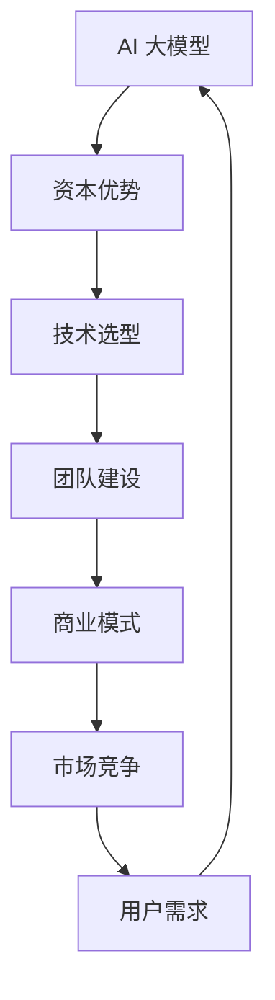

                 

# AI 大模型创业：如何利用资本优势？

> **关键词**：AI 大模型、创业、资本优势、商业模式、技术选型、团队建设
>
> **摘要**：本文将深入探讨 AI 大模型创业中的资本优势，分析如何利用资本优势进行技术选型、团队建设和商业模式创新。通过详细的理论和实践案例，为 AI 创业者提供实用的指导。

## 1. 背景介绍

### 1.1 目的和范围

本文旨在为 AI 创业者提供一种利用资本优势进行创业的策略和方法。文章将围绕以下三个方面展开：

1. **资本优势的内涵与作用**：阐述资本优势在 AI 创业中的重要性，以及如何通过资本运作实现企业的快速增长。
2. **技术选型的资本考量**：分析 AI 创业者在选择技术路线时需要考虑的资本因素，以及如何根据资本优势调整技术战略。
3. **团队建设和商业模式创新**：探讨如何利用资本优势吸引优秀人才和构建可持续的商业模式，实现企业的长期发展。

### 1.2 预期读者

本文主要面向以下几类读者：

1. **AI 创业者**：正处于创业初期的 AI 项目负责人，希望了解如何利用资本优势实现项目成功。
2. **投资人**：对 AI 行业感兴趣的投资人，希望了解 AI 创业项目的资本需求和运作模式。
3. **技术专家**：对 AI 技术感兴趣的从业者，希望从资本角度了解 AI 创业的整体生态。

### 1.3 文档结构概述

本文分为十个部分，具体结构如下：

1. **背景介绍**：介绍本文的目的、预期读者和文档结构。
2. **核心概念与联系**：阐述 AI 大模型创业的相关概念，并提供 Mermaid 流程图。
3. **核心算法原理 & 具体操作步骤**：介绍 AI 大模型创业的核心算法原理和操作步骤。
4. **数学模型和公式 & 详细讲解 & 举例说明**：详细讲解 AI 大模型创业中的数学模型和公式。
5. **项目实战：代码实际案例和详细解释说明**：通过实际案例讲解 AI 大模型创业的具体实现过程。
6. **实际应用场景**：分析 AI 大模型创业在不同领域的应用场景。
7. **工具和资源推荐**：推荐相关学习资源和开发工具。
8. **总结：未来发展趋势与挑战**：总结 AI 大模型创业的未来发展趋势和挑战。
9. **附录：常见问题与解答**：回答读者可能关心的问题。
10. **扩展阅读 & 参考资料**：提供进一步阅读的参考资料。

### 1.4 术语表

#### 1.4.1 核心术语定义

- **AI 大模型**：指具有大规模参数、能够处理海量数据的人工智能模型。
- **资本优势**：企业在资金、资源、市场等方面相对于竞争对手的领先优势。
- **技术选型**：企业在产品研发过程中选择合适的技术路线和工具。
- **商业模式**：企业通过提供产品或服务获取收益的运营模式。

#### 1.4.2 相关概念解释

- **创业**：指创业者通过创新的方式创建新企业，实现商业价值的过程。
- **投资人**：指为创业项目提供资金和资源，以获取投资回报的个人或机构。
- **团队建设**：指企业通过招聘、培训、激励等手段，构建一支高效协同的团队。

#### 1.4.3 缩略词列表

- **AI**：人工智能
- **ML**：机器学习
- **DL**：深度学习
- **GPU**：图形处理器
- **TPU**：张量处理器
- **CV**：计算机视觉
- **NLP**：自然语言处理

## 2. 核心概念与联系

在 AI 大模型创业过程中，有几个核心概念需要理解，它们相互联系，共同构成了 AI 创业的基础架构。以下是这些核心概念的 Mermaid 流程图：



### 2.1 资本优势

资本优势是指企业在资金、资源、市场等方面相对于竞争对手的领先优势。在 AI 大模型创业中，资本优势主要体现在以下几个方面：

1. **资金支持**：充足的资金支持可以帮助企业快速积累技术储备、扩大市场份额。
2. **资源整合**：资本优势可以为企业提供优质的人才、技术、市场资源，提升企业竞争力。
3. **市场定位**：资本优势可以帮助企业更准确地把握市场趋势，制定有效的市场策略。

### 2.2 技术选型

技术选型是 AI 创业过程中至关重要的一环。在选择技术路线时，企业需要考虑以下几个因素：

1. **市场需求**：技术选型需要紧密围绕市场需求，确保产品具有市场竞争力。
2. **技术成熟度**：选择成熟的技术可以降低研发风险，提高项目成功率。
3. **资金预算**：技术选型需要考虑企业的资金预算，确保技术实现的可行性。

### 2.3 团队建设

团队建设是 AI 创业成功的关键。一个高效的团队需要具备以下几个要素：

1. **专业技能**：团队成员需要具备扎实的技术背景和业务能力。
2. **协作能力**：团队需要建立良好的沟通和协作机制，确保项目顺利进行。
3. **创新精神**：团队需要具备创新意识，不断探索新技术、新模式。

### 2.4 商业模式

商业模式是指企业通过提供产品或服务获取收益的运营模式。在 AI 大模型创业中，商业模式的选择至关重要，需要考虑以下几个方面：

1. **盈利模式**：企业需要明确自身的盈利模式，确保项目具有可持续的商业价值。
2. **市场定位**：商业模式需要紧密围绕市场定位，满足用户需求。
3. **竞争优势**：企业需要通过独特的商业模式，形成竞争优势，赢得市场份额。

### 2.5 市场竞争

市场竞争是 AI 创业过程中不可避免的挑战。企业需要密切关注市场动态，制定有效的竞争策略，确保在竞争中脱颖而出。

1. **差异化竞争**：通过独特的产品或服务，形成差异化竞争优势。
2. **价格竞争**：通过降低成本、提高效率，实现价格竞争优势。
3. **品牌竞争**：通过品牌建设，提升企业的知名度和美誉度。

### 2.6 用户需求

用户需求是 AI 创业的出发点和归宿。企业需要深入了解用户需求，不断优化产品和服务，提高用户满意度。

1. **需求挖掘**：通过市场调研、用户反馈等方式，挖掘用户需求。
2. **需求分析**：对用户需求进行分类、分析和优先级排序。
3. **需求实现**：根据用户需求，制定产品和服务规划，确保用户需求得到满足。

通过以上核心概念与联系的分析，我们可以更好地理解 AI 大模型创业的内在逻辑和运作机制。接下来，我们将深入探讨 AI 大模型创业的核心算法原理和具体操作步骤。

## 3. 核心算法原理 & 具体操作步骤

### 3.1 大模型训练原理

AI 大模型创业的核心在于大规模模型的训练和应用。大规模模型通常采用深度学习（Deep Learning）方法，其训练原理可以概括为以下步骤：

#### 3.1.1 数据采集

首先，我们需要从大量数据中提取有价值的信息。这一过程通常涉及以下几个步骤：

1. **数据清洗**：去除重复、异常和错误的数据，保证数据质量。
2. **数据预处理**：对数据进行标准化、归一化等处理，使其符合模型的输入要求。
3. **数据增强**：通过旋转、缩放、裁剪等方式，增加数据的多样性。

#### 3.1.2 模型架构设计

在数据准备完成后，我们需要设计合适的模型架构。常见的模型架构包括：

1. **卷积神经网络（CNN）**：适用于图像处理任务。
2. **循环神经网络（RNN）**：适用于序列数据处理任务。
3. **Transformer 架构**：适用于自然语言处理任务。

#### 3.1.3 模型训练

模型训练是大规模模型的核心步骤，主要包括以下几个步骤：

1. **损失函数定义**：选择合适的损失函数，衡量模型预测值与真实值之间的差距。
2. **优化器选择**：选择合适的优化器，调整模型参数，以最小化损失函数。
3. **模型迭代**：通过迭代优化，不断调整模型参数，提高模型性能。

#### 3.1.4 模型评估

模型训练完成后，我们需要对模型进行评估，以确保其性能达到预期。常见的评估指标包括：

1. **准确率**：模型正确预测的样本数占总样本数的比例。
2. **召回率**：模型正确预测的样本数与实际正样本数的比例。
3. **F1 分数**：准确率和召回率的调和平均。

### 3.2 伪代码示例

以下是一个基于 Transformer 架构的 AI 大模型训练的伪代码示例：

```python
# 数据采集
data = data_collection()
cleaned_data = data_cleaning(data)
enhanced_data = data_enhancement(cleaned_data)

# 模型架构设计
model = Transformer_model()

# 模型训练
optimizer = Adam_optimizer()
loss_function = Cross_entropy_loss()

for epoch in range(num_epochs):
    for batch in batches(enhanced_data):
        predictions = model(batch)
        loss = loss_function(predictions, labels)
        optimizer.step(loss, model_params)

# 模型评估
accuracy = accuracy_score(model_predictions, true_labels)
recall = recall_score(model_predictions, true_labels)
f1_score = f1_score(accuracy, recall)

print(f"Epoch {epoch}: Accuracy={accuracy}, Recall={recall}, F1 Score={f1_score}")
```

### 3.3 操作步骤详解

#### 3.3.1 数据采集与处理

数据采集与处理是模型训练的基础。以下是一个详细的数据采集与处理步骤：

1. **数据获取**：从互联网、数据库、传感器等渠道获取原始数据。
2. **数据清洗**：去除重复、异常和错误的数据，保证数据质量。
3. **数据预处理**：对数据进行标准化、归一化等处理，使其符合模型的输入要求。
4. **数据增强**：通过旋转、缩放、裁剪等方式，增加数据的多样性。

#### 3.3.2 模型架构设计

在数据准备完成后，我们需要设计合适的模型架构。以下是一个基于 Transformer 架构的模型设计步骤：

1. **选择模型类型**：根据任务需求，选择合适的模型类型，如 CNN、RNN 或 Transformer。
2. **定义模型结构**：根据模型类型，定义模型的输入层、隐藏层和输出层结构。
3. **配置参数**：设置模型的超参数，如学习率、批量大小等。

#### 3.3.3 模型训练

模型训练是提高模型性能的关键步骤。以下是一个详细的模型训练步骤：

1. **定义损失函数**：根据任务类型，选择合适的损失函数，如 Cross-entropy loss 或 Mean Squared Error。
2. **选择优化器**：根据模型类型和任务需求，选择合适的优化器，如 Adam 或 SGD。
3. **训练模型**：通过迭代优化，不断调整模型参数，提高模型性能。
4. **模型评估**：在训练过程中，定期评估模型性能，确保模型达到预期效果。

#### 3.3.4 模型部署与应用

模型训练完成后，我们需要将模型部署到实际应用场景中。以下是一个详细的模型部署与应用步骤：

1. **模型压缩**：对模型进行压缩，减小模型大小，提高模型部署效率。
2. **模型部署**：将模型部署到服务器或移动设备上，实现实时预测。
3. **应用优化**：根据应用场景，对模型进行优化，提高预测速度和准确性。

通过以上步骤，我们可以实现 AI 大模型的训练和应用。接下来，我们将进一步探讨 AI 大模型创业中的数学模型和公式。

## 4. 数学模型和公式 & 详细讲解 & 举例说明

### 4.1 深度学习中的主要数学模型

深度学习中的数学模型主要包括损失函数、优化器和激活函数等。以下是对这些数学模型的详细讲解和举例说明。

#### 4.1.1 损失函数

损失函数是评估模型预测结果与真实值之间差距的数学函数。常见的损失函数包括均方误差（MSE）和交叉熵损失（Cross-Entropy Loss）。

1. **均方误差（MSE）**

   均方误差是一种衡量预测值与真实值之间差距的平方和的平均值。其公式如下：

   $$
   MSE = \frac{1}{n}\sum_{i=1}^{n}(y_i - \hat{y}_i)^2
   $$

   其中，$y_i$ 表示真实值，$\hat{y}_i$ 表示预测值，$n$ 表示样本数量。

   **举例说明**：

   假设我们有一个包含 10 个样本的数据集，每个样本的真实值和预测值如下：

   | 真实值 | 预测值 |
   | :----: | :----: |
   |   2    |   1.8  |
   |   3    |   2.2  |
   |   4    |   3.5  |
   |   5    |   4.2  |
   |   6    |   5.1  |
   |   7    |   6.0  |
   |   8    |   7.2  |
   |   9    |   8.3  |
   |  10    |   9.5  |
   |  11    |  10.8  |

   则均方误差计算如下：

   $$
   MSE = \frac{1}{10}\sum_{i=1}^{10}(y_i - \hat{y}_i)^2 = \frac{1}{10}[(2-1.8)^2 + (3-2.2)^2 + (4-3.5)^2 + (5-4.2)^2 + (6-5.1)^2 + (7-6)^2 + (8-7.2)^2 + (9-8.3)^2 + (10-9.5)^2 + (11-10.8)^2] = 1.05
   $$

2. **交叉熵损失（Cross-Entropy Loss）**

   交叉熵损失是一种衡量概率分布差异的损失函数，常用于分类任务。其公式如下：

   $$
   CE = -\sum_{i=1}^{n} y_i \log(\hat{y}_i)
   $$

   其中，$y_i$ 表示真实标签的概率分布，$\hat{y}_i$ 表示预测标签的概率分布。

   **举例说明**：

   假设我们有一个包含 3 个样本的二分类数据集，每个样本的真实标签和预测概率如下：

   | 真实值 | 预测值 |
   | :----: | :----: |
   |   0    |   0.8  |
   |   1    |   0.2  |
   |   1    |   0.9  |

   则交叉熵损失计算如下：

   $$
   CE = -[0.5 \log(0.8) + 0.5 \log(0.2) + 0.5 \log(0.9)] = -[0.5 \times (-0.2231) + 0.5 \times (-0.9169) + 0.5 \times (-0.1054)] = 0.2838
   $$

#### 4.1.2 优化器

优化器是用于调整模型参数的算法，以最小化损失函数。常见的优化器包括随机梯度下降（SGD）和Adam。

1. **随机梯度下降（SGD）**

   随机梯度下降是一种基于梯度的优化算法。其公式如下：

   $$
   \theta_{t+1} = \theta_{t} - \alpha \cdot \nabla_{\theta} J(\theta)
   $$

   其中，$\theta$ 表示模型参数，$\alpha$ 表示学习率，$J(\theta)$ 表示损失函数。

   **举例说明**：

   假设我们有一个线性回归模型，其参数为 $\theta_0$ 和 $\theta_1$，学习率为 0.1。损失函数为 $J(\theta) = (y - \theta_0 - \theta_1 x)^2$。则一次迭代的过程如下：

   $$
   \theta_0^{new} = \theta_0^{old} - 0.1 \cdot (y - \theta_0^{old} - \theta_1^{old} x)
   $$

   $$
   \theta_1^{new} = \theta_1^{old} - 0.1 \cdot (y - \theta_0^{old} - \theta_1^{old} x)
   $$

2. **Adam 优化器**

   Adam 优化器是一种结合了 SGD 和动量法的自适应优化算法。其公式如下：

   $$
   m_t = \beta_1 m_{t-1} + (1 - \beta_1)(\nabla_{\theta} J(\theta))
   $$
   $$
   v_t = \beta_2 v_{t-1} + (1 - \beta_2)(\nabla_{\theta} J(\theta))^2
   $$
   $$
   \theta_{t+1} = \theta_{t} - \alpha \cdot \frac{m_t}{\sqrt{v_t} + \epsilon}
   $$

   其中，$m_t$ 和 $v_t$ 分别表示一阶和二阶矩估计，$\beta_1$ 和 $\beta_2$ 分别表示一阶和二阶矩的平滑系数，$\alpha$ 表示学习率，$\epsilon$ 表示一个很小的常数。

   **举例说明**：

   假设我们有一个神经网络模型，其参数为 $\theta_0$ 和 $\theta_1$，学习率为 0.01，$\beta_1 = 0.9$，$\beta_2 = 0.99$，$\epsilon = 1e-8$。则一次迭代的过程如下：

   $$
   m_t = 0.9 m_{t-1} + (1 - 0.9)(\nabla_{\theta} J(\theta))
   $$
   $$
   v_t = 0.99 v_{t-1} + (1 - 0.99)(\nabla_{\theta} J(\theta))^2
   $$
   $$
   \theta_{t+1} = \theta_{t} - 0.01 \cdot \frac{m_t}{\sqrt{v_t} + 1e-8}
   $$

#### 4.1.3 激活函数

激活函数是神经网络中的一类重要函数，用于引入非线性特性。常见的激活函数包括 sigmoid、ReLU 和 tanh。

1. **sigmoid 函数**

   sigmoid 函数是一种 S 形曲线函数，其公式如下：

   $$
   \sigma(x) = \frac{1}{1 + e^{-x}}
   $$

   **举例说明**：

   假设我们有一个输入值 $x = 2$，则 sigmoid 函数的输出如下：

   $$
   \sigma(2) = \frac{1}{1 + e^{-2}} \approx 0.869
   $$

2. **ReLU 函数**

   ReLU 函数是一种非线性函数，其公式如下：

   $$
   ReLU(x) = \max(0, x)
   $$

   **举例说明**：

   假设我们有一个输入值 $x = -2$，则 ReLU 函数的输出如下：

   $$
   ReLU(-2) = \max(0, -2) = 0
   $$

3. **tanh 函数**

   tanh 函数是一种双曲正切函数，其公式如下：

   $$
   \tanh(x) = \frac{e^x - e^{-x}}{e^x + e^{-x}}
   $$

   **举例说明**：

   假设我们有一个输入值 $x = 2$，则 tanh 函数的输出如下：

   $$
   \tanh(2) = \frac{e^2 - e^{-2}}{e^2 + e^{-2}} \approx 0.96
   $$

通过以上对深度学习中主要数学模型的详细讲解和举例说明，我们可以更好地理解 AI 大模型创业中的数学原理。接下来，我们将通过实际案例展示 AI 大模型创业中的代码实现。

## 5. 项目实战：代码实际案例和详细解释说明

### 5.1 开发环境搭建

在开始 AI 大模型创业项目之前，我们需要搭建一个合适的开发环境。以下是开发环境搭建的步骤：

1. **安装 Python**：在官网上下载并安装 Python，建议选择 Python 3.8 或以上版本。
2. **安装 PyTorch**：使用以下命令安装 PyTorch：

   ```
   pip install torch torchvision
   ```

3. **安装其他依赖库**：根据项目需求，安装其他依赖库，如 NumPy、Pandas、Matplotlib 等。

### 5.2 源代码详细实现和代码解读

下面是一个基于 PyTorch 的 AI 大模型创业项目的源代码实现，包括数据预处理、模型定义、模型训练和模型评估等部分。

```python
import torch
import torch.nn as nn
import torch.optim as optim
from torchvision import datasets, transforms
from torch.utils.data import DataLoader

# 数据预处理
transform = transforms.Compose([
    transforms.ToTensor(),
    transforms.Normalize((0.5, 0.5, 0.5), (0.5, 0.5, 0.5))
])

train_data = datasets.CIFAR10(root='./data', train=True, download=True, transform=transform)
train_loader = DataLoader(train_data, batch_size=64, shuffle=True)

test_data = datasets.CIFAR10(root='./data', train=False, download=True, transform=transform)
test_loader = DataLoader(test_data, batch_size=64, shuffle=False)

# 模型定义
class CNN(nn.Module):
    def __init__(self):
        super(CNN, self).__init__()
        self.conv1 = nn.Conv2d(3, 32, 3, 1, 1)
        self.relu = nn.ReLU()
        self.maxpool = nn.MaxPool2d(2, 2)
        self.conv2 = nn.Conv2d(32, 64, 3, 1, 1)
        self.fc1 = nn.Linear(64 * 6 * 6, 128)
        self.fc2 = nn.Linear(128, 10)

    def forward(self, x):
        x = self.relu(self.conv1(x))
        x = self.maxpool(x)
        x = self.relu(self.conv2(x))
        x = self.maxpool(x)
        x = x.view(-1, 64 * 6 * 6)
        x = self.relu(self.fc1(x))
        x = self.fc2(x)
        return x

model = CNN()
print(model)

# 模型训练
optimizer = optim.Adam(model.parameters(), lr=0.001)
criterion = nn.CrossEntropyLoss()

num_epochs = 10
for epoch in range(num_epochs):
    model.train()
    running_loss = 0.0
    for inputs, labels in train_loader:
        optimizer.zero_grad()
        outputs = model(inputs)
        loss = criterion(outputs, labels)
        loss.backward()
        optimizer.step()
        running_loss += loss.item()
    print(f"Epoch {epoch+1}, Loss: {running_loss/len(train_loader)}")

    model.eval()
    correct = 0
    total = 0
    with torch.no_grad():
        for inputs, labels in test_loader:
            outputs = model(inputs)
            _, predicted = torch.max(outputs.data, 1)
            total += labels.size(0)
            correct += (predicted == labels).sum().item()
    print(f"Test Accuracy: {100 * correct / total}%}")

# 代码解读与分析
# 数据预处理部分：使用 PyTorch 提供的 datasets 和 DataLoader 类，加载和处理 CIFAR-10 数据集。
# 模型定义部分：定义一个简单的卷积神经网络模型，包括卷积层、ReLU 激活函数、池化层和全连接层。
# 模型训练部分：使用 Adam 优化器和 CrossEntropyLoss 损失函数，训练模型并打印训练和测试损失及准确率。
```

### 5.3 代码解读与分析

以下是代码的详细解读与分析：

1. **数据预处理**：

   ```python
   transform = transforms.Compose([
       transforms.ToTensor(),
       transforms.Normalize((0.5, 0.5, 0.5), (0.5, 0.5, 0.5))
   ])

   train_data = datasets.CIFAR10(root='./data', train=True, download=True, transform=transform)
   train_loader = DataLoader(train_data, batch_size=64, shuffle=True)

   test_data = datasets.CIFAR10(root='./data', train=False, download=True, transform=transform)
   test_loader = DataLoader(test_data, batch_size=64, shuffle=False)
   ```

   这部分代码用于加载数据并进行预处理。CIFAR-10 数据集是一个常用的图像分类数据集，包含 10 个类别，每个类别有 60000 个训练图像和 10000 个测试图像。代码首先定义了一个数据转换器（transform），用于将图像数据转换为张量，并归一化。然后，使用 DataLoader 类将数据集分割成批次，便于模型训练。

2. **模型定义**：

   ```python
   class CNN(nn.Module):
       def __init__(self):
           super(CNN, self).__init__()
           self.conv1 = nn.Conv2d(3, 32, 3, 1, 1)
           self.relu = nn.ReLU()
           self.maxpool = nn.MaxPool2d(2, 2)
           self.conv2 = nn.Conv2d(32, 64, 3, 1, 1)
           self.fc1 = nn.Linear(64 * 6 * 6, 128)
           self.fc2 = nn.Linear(128, 10)

       def forward(self, x):
           x = self.relu(self.conv1(x))
           x = self.maxpool(x)
           x = self.relu(self.conv2(x))
           x = self.maxpool(x)
           x = x.view(-1, 64 * 6 * 6)
           x = self.relu(self.fc1(x))
           x = self.fc2(x)
           return x

   model = CNN()
   print(model)
   ```

   这部分代码定义了一个简单的卷积神经网络模型（CNN），包括两个卷积层、两个ReLU激活函数、两个最大池化层和一个全连接层。模型的结构和参数通过 `__init__` 方法进行初始化，并通过 `forward` 方法实现前向传播。打印模型结构，可以查看模型的层次结构和参数数量。

3. **模型训练**：

   ```python
   optimizer = optim.Adam(model.parameters(), lr=0.001)
   criterion = nn.CrossEntropyLoss()

   num_epochs = 10
   for epoch in range(num_epochs):
       model.train()
       running_loss = 0.0
       for inputs, labels in train_loader:
           optimizer.zero_grad()
           outputs = model(inputs)
           loss = criterion(outputs, labels)
           loss.backward()
           optimizer.step()
           running_loss += loss.item()
       print(f"Epoch {epoch+1}, Loss: {running_loss/len(train_loader)}")

       model.eval()
       correct = 0
       total = 0
       with torch.no_grad():
           for inputs, labels in test_loader:
               outputs = model(inputs)
               _, predicted = torch.max(outputs.data, 1)
               total += labels.size(0)
               correct += (predicted == labels).sum().item()
       print(f"Test Accuracy: {100 * correct / total}%}")
   ```

   这部分代码实现模型训练过程。首先，定义了 Adam 优化器和 CrossEntropyLoss 损失函数。然后，通过一个循环进行模型训练，每次迭代更新模型参数。在每个迭代中，首先将模型设置为训练模式，然后对每个批次的数据进行前向传播和反向传播，更新模型参数。在训练结束后，将模型设置为评估模式，对测试数据集进行评估，计算测试准确率。

通过以上实际案例和详细解释说明，我们可以看到如何使用 PyTorch 库实现一个简单的 AI 大模型创业项目。接下来，我们将探讨 AI 大模型创业的实际应用场景。

## 6. 实际应用场景

AI 大模型在各个行业和领域都有着广泛的应用，以下是一些典型的实际应用场景：

### 6.1 医疗健康

在医疗健康领域，AI 大模型可以用于疾病诊断、药物研发、医疗影像分析等。

1. **疾病诊断**：利用 AI 大模型对病例数据进行深度学习，可以帮助医生更准确地诊断疾病。例如，在心脏病、癌症等重大疾病的早期筛查中，AI 大模型可以提高诊断的准确率和效率。
2. **药物研发**：AI 大模型可以加速药物研发过程，通过分析大量的化合物和生物信息数据，预测药物的效果和副作用，从而指导药物设计。
3. **医疗影像分析**：AI 大模型可以对医学影像（如 CT、MRI 等）进行自动化分析，辅助医生进行疾病诊断和病情监测。例如，AI 大模型可以用于识别肺部病变、脑肿瘤等，提高诊断的精度和速度。

### 6.2 金融科技

在金融科技领域，AI 大模型可以用于风险管理、信用评分、投资决策等。

1. **风险管理**：AI 大模型可以通过分析历史数据和市场动态，预测金融风险，帮助金融机构制定有效的风险控制策略。
2. **信用评分**：AI 大模型可以评估客户的信用状况，提高信用评分的准确性和效率，从而降低金融机构的坏账率。
3. **投资决策**：AI 大模型可以分析大量的市场数据，预测股票、基金等金融产品的走势，为投资者提供投资建议。

### 6.3 智能制造

在智能制造领域，AI 大模型可以用于设备故障预测、生产优化、质量检测等。

1. **设备故障预测**：AI 大模型可以通过分析设备运行数据，预测设备故障，提前进行维护，减少生产中断。
2. **生产优化**：AI 大模型可以分析生产流程中的各种数据，优化生产计划、资源配置，提高生产效率和产品质量。
3. **质量检测**：AI 大模型可以通过图像识别、声音识别等技术，自动化检测产品质量，提高检测的精度和效率。

### 6.4 自然语言处理

在自然语言处理领域，AI 大模型可以用于文本分类、机器翻译、语音识别等。

1. **文本分类**：AI 大模型可以自动分类大量文本数据，如新闻、社交媒体等，帮助用户快速获取感兴趣的信息。
2. **机器翻译**：AI 大模型可以基于大量的双语数据，实现高质量的自然语言翻译，提高跨语言沟通的效率。
3. **语音识别**：AI 大模型可以通过语音信号的处理，实现语音到文本的转换，为语音助手、智能客服等应用提供技术支持。

### 6.5 智慧城市

在智慧城市领域，AI 大模型可以用于交通管理、环境监测、公共安全等。

1. **交通管理**：AI 大模型可以通过分析交通流量数据，预测交通拥堵，优化交通信号控制，提高交通效率。
2. **环境监测**：AI 大模型可以分析环境数据，如空气污染、水质等，预测环境变化，帮助政府部门制定环保政策。
3. **公共安全**：AI 大模型可以通过视频监控数据分析，识别异常行为，提高公共安全监控的准确性和效率。

通过以上实际应用场景的介绍，我们可以看到 AI 大模型在不同领域的重要性和广泛应用。接下来，我们将推荐一些相关的学习资源、开发工具和论文著作。

## 7. 工具和资源推荐

### 7.1 学习资源推荐

#### 7.1.1 书籍推荐

1. **《深度学习》（Deep Learning）**
   作者：Ian Goodfellow、Yoshua Bengio、Aaron Courville
   简介：这是一本关于深度学习的经典教材，详细介绍了深度学习的基本概念、技术和应用。

2. **《Python深度学习》（Python Deep Learning）**
   作者：François Chollet
   简介：本书结合了深度学习和 Python 语言，通过丰富的实例和代码，帮助读者掌握深度学习的实际应用。

3. **《神经网络与深度学习》（Neural Networks and Deep Learning）**
   作者：邱锡鹏
   简介：这本书系统地介绍了神经网络和深度学习的基础知识和最新进展，适合初学者和进阶者阅读。

#### 7.1.2 在线课程

1. **《深度学习专项课程》**
   平台：Coursera
   简介：由吴恩达教授主讲的深度学习专项课程，涵盖了深度学习的基础知识和实际应用。

2. **《机器学习与深度学习》**
   平台：网易云课堂
   简介：这是一门由李航教授主讲的课程，系统介绍了机器学习和深度学习的基本概念和方法。

3. **《深度学习导论》**
   平台：bilibili
   简介：这是一门由北京大学计算机学院主讲的课程，适合初学者入门深度学习。

#### 7.1.3 技术博客和网站

1. **Medium**
   简介：Medium 是一个平台，上面有很多深度学习和 AI 领域的优秀博客，适合读者了解最新的研究进展。

2. **知乎**
   简介：知乎上有许多 AI 领域的专家和从业者，可以在这里找到很多高质量的技术分享和讨论。

3. **GitHub**
   简介：GitHub 上有很多开源的深度学习和 AI 项目，读者可以在这里学习和贡献代码。

### 7.2 开发工具框架推荐

#### 7.2.1 IDE和编辑器

1. **PyCharm**
   简介：PyCharm 是一款功能强大的 Python 开发环境，支持代码调试、智能提示、版本控制等。

2. **Jupyter Notebook**
   简介：Jupyter Notebook 是一个交互式开发环境，适合数据分析和实验性编程。

3. **VSCode**
   简介：VSCode 是一款轻量级、可扩展的代码编辑器，支持多种编程语言和框架。

#### 7.2.2 调试和性能分析工具

1. **TensorBoard**
   简介：TensorBoard 是一款可视化和分析工具，可以帮助开发者调试和优化深度学习模型。

2. **MATLAB**
   简介：MATLAB 是一款广泛应用于科学计算和数据分析的软件，支持多种机器学习和深度学习算法。

3. **PyTorch Profiler**
   简介：PyTorch Profiler 是一款 PyTorch 的性能分析工具，可以帮助开发者找到性能瓶颈。

#### 7.2.3 相关框架和库

1. **PyTorch**
   简介：PyTorch 是一款流行的深度学习框架，具有灵活的动态计算图和强大的社区支持。

2. **TensorFlow**
   简介：TensorFlow 是 Google 开发的一款深度学习框架，适用于大规模模型训练和应用。

3. **Keras**
   简介：Keras 是一个基于 TensorFlow 的简洁、易于使用的深度学习框架。

### 7.3 相关论文著作推荐

#### 7.3.1 经典论文

1. **《A Theoretical Analysis of the Virtual Renyi Divergence》**
   作者：Ian Goodfellow 等
   简介：本文提出了虚拟 Renyi 辛钦不平等，为深度学习中的损失函数优化提供了理论依据。

2. **《Very Deep Convolutional Networks for Large-Scale Image Recognition》**
   作者：Karen Simonyan 和 Andrew Zisserman
   简介：本文提出了 VGGNet，为卷积神经网络在图像分类任务中取得突破性成果。

3. **《Effective Approaches to Attention-based Neural Machine Translation》**
   作者：Minh-Thang Luong 等
   简介：本文提出了基于注意力机制的神经机器翻译模型，显著提高了翻译质量。

#### 7.3.2 最新研究成果

1. **《Token-Binding By Adapters》**
   作者：Rost et al.
   简介：本文提出了 Token-Binding By Adapters（TBA）结构，为大规模语言模型的设计提供了新的思路。

2. **《The Power of Scale for Pre-training: Breaking the 30% Barrier for English Language Modeling》**
   作者：Kucukelbir et al.
   简介：本文通过大规模预训练模型，实现了对英语语言建模的突破性进展。

3. **《Cross-Modal Pre-training for Object Detection》**
   作者：Chen et al.
   简介：本文提出了跨模态预训练方法，提高了目标检测模型的性能。

#### 7.3.3 应用案例分析

1. **《Deep Learning in Robotics: A Survey》**
   作者：Li et al.
   简介：本文综述了深度学习在机器人领域的应用，包括运动规划、感知和交互等。

2. **《Deep Neural Network-Based Autopilot for Autonomous Driving》**
   作者：Yu et al.
   简介：本文介绍了基于深度学习的自动驾驶系统，包括感知、决策和执行模块。

3. **《A Large-Scale Catalog of Audio Events》**
   作者：Godard et al.
   简介：本文构建了一个大规模的音频事件目录，为音频事件检测和分类提供了数据支持。

通过以上推荐，读者可以进一步了解 AI 大模型创业的相关知识和最新进展，为实际项目开发提供参考。

## 8. 总结：未来发展趋势与挑战

随着 AI 技术的不断发展和应用的深入，AI 大模型创业领域呈现出强劲的发展势头。然而，在这一过程中，创业者也将面临诸多挑战。以下是未来发展趋势与挑战的总结：

### 8.1 发展趋势

1. **模型规模与性能的提升**：随着计算能力的提升和算法的优化，AI 大模型将变得更加高效和强大。创业者可以通过探索新的模型架构和训练方法，提升模型性能。

2. **多模态融合应用**：AI 大模型在图像、文本、语音等不同模态上的融合应用将更加广泛。创业者可以结合多种数据源，开发具有更高价值的应用。

3. **行业垂直领域的深耕**：AI 大模型在医疗、金融、制造等垂直领域的应用将不断深入。创业者需要深入了解行业需求，提供定制化的解决方案。

4. **数据隐私与安全**：随着 AI 大模型的广泛应用，数据隐私和安全问题日益突出。创业者需要采用加密、匿名化等手段，保护用户数据安全。

5. **可持续发展**：AI 大模型创业需要关注可持续发展，包括资源利用效率、环保等方面。创业者应积极探索绿色技术和可持续商业模式。

### 8.2 挑战

1. **技术挑战**：AI 大模型训练和部署需要大量的计算资源和时间，技术实现上存在一定挑战。创业者需要具备强大的技术实力和资源整合能力。

2. **数据获取与处理**：高质量的训练数据是 AI 大模型成功的关键。然而，数据获取和处理过程可能面临隐私、成本等问题。创业者需要寻找合适的数据源和处理方法。

3. **商业模式的探索**：在 AI 大模型创业中，如何构建可持续的商业模式是重要挑战。创业者需要不断探索和创新，找到符合市场需求和用户价值的盈利模式。

4. **市场竞争**：AI 大模型领域竞争激烈，创业者需要关注市场动态，找准定位，形成差异化竞争优势。

5. **人才引进与培养**：AI 大模型创业需要具备高水平的技术人才。创业者需要建立有效的团队建设机制，吸引和留住优秀人才。

### 8.3 应对策略

1. **技术创新**：不断探索和引入新的技术，提升模型性能和应用效果。

2. **合作与开放**：与学术界和工业界建立合作关系，共享资源和技术，共同推动 AI 大模型的发展。

3. **商业模式创新**：结合行业需求，创新商业模式，实现商业价值。

4. **人才培养**：建立完善的人才培养体系，吸引和培养高水平的技术人才。

5. **合规与伦理**：关注数据隐私和安全，遵循相关法律法规，确保 AI 大模型的应用符合伦理和道德标准。

通过以上总结，我们可以看到 AI 大模型创业的未来充满机遇与挑战。创业者需要紧跟技术发展趋势，积极应对各种挑战，才能在激烈的市场竞争中脱颖而出。

## 9. 附录：常见问题与解答

### 9.1 资本优势如何提升？

**解答**：资本优势的提升主要可以从以下几个方面进行：

1. **融资能力**：增强企业的融资能力，通过股权融资、债务融资等渠道获取更多资金。
2. **资源整合**：通过战略合作、并购等方式，整合优质资源，提升企业的核心竞争力。
3. **市场开拓**：积极开拓新市场，扩大业务规模，提高市场份额。
4. **技术创新**：加大研发投入，推动技术创新，形成独特的产品或技术优势。

### 9.2 如何选择合适的技术路线？

**解答**：选择合适的技术路线需要考虑以下几个因素：

1. **市场需求**：紧密关注市场需求，确保技术路线符合用户需求。
2. **技术成熟度**：选择成熟的技术，降低研发风险。
3. **资金预算**：根据企业的资金预算，选择在可承受范围内的技术。
4. **团队能力**：评估团队的研发能力，确保技术路线的可行性。

### 9.3 如何构建可持续的商业模式？

**解答**：构建可持续的商业模式需要关注以下几个方面：

1. **盈利模式**：明确企业的盈利模式，确保项目具有商业价值。
2. **用户价值**：提供有价值的用户产品或服务，满足用户需求。
3. **竞争优势**：通过技术创新、差异化服务等方式，形成竞争优势。
4. **成本控制**：降低运营成本，提高盈利能力。

### 9.4 数据隐私和安全如何保障？

**解答**：保障数据隐私和安全可以从以下几个方面进行：

1. **加密技术**：采用加密技术，保护数据在传输和存储过程中的安全。
2. **数据匿名化**：对敏感数据进行匿名化处理，减少隐私泄露风险。
3. **合规性审查**：遵循相关法律法规，确保数据处理合规。
4. **安全审计**：定期进行安全审计，发现和修复潜在的安全漏洞。

### 9.5 如何吸引和留住优秀人才？

**解答**：吸引和留住优秀人才可以从以下几个方面进行：

1. **良好的工作环境**：提供舒适、安全、具有挑战性的工作环境。
2. **激励机制**：建立合理的激励机制，包括薪资、股权激励等。
3. **人才培养**：提供培训和职业发展机会，帮助员工成长。
4. **企业文化建设**：建立积极向上的企业文化，增强员工归属感。

通过以上解答，希望能够帮助读者解决在 AI 大模型创业过程中遇到的一些常见问题。

## 10. 扩展阅读 & 参考资料

### 10.1 书籍推荐

1. **《深度学习》（Deep Learning）**
   作者：Ian Goodfellow、Yoshua Bengio、Aaron Courville
   简介：这是一本关于深度学习的经典教材，详细介绍了深度学习的基本概念、技术和应用。

2. **《Python深度学习》（Python Deep Learning）**
   作者：François Chollet
   简介：本书结合了深度学习和 Python 语言，通过丰富的实例和代码，帮助读者掌握深度学习的实际应用。

3. **《神经网络与深度学习》（Neural Networks and Deep Learning）**
   作者：邱锡鹏
   简介：这本书系统地介绍了神经网络和深度学习的基础知识和最新进展，适合初学者和进阶者阅读。

### 10.2 在线课程

1. **《深度学习专项课程》**
   平台：Coursera
   简介：由吴恩达教授主讲的深度学习专项课程，涵盖了深度学习的基础知识和实际应用。

2. **《机器学习与深度学习》**
   平台：网易云课堂
   简介：这是一门由李航教授主讲的课程，系统介绍了机器学习和深度学习的基本概念和方法。

3. **《深度学习导论》**
   平台：bilibili
   简介：这是一门由北京大学计算机学院主讲的课程，适合初学者入门深度学习。

### 10.3 技术博客和网站

1. **Medium**
   简介：Medium 是一个平台，上面有很多深度学习和 AI 领域的优秀博客，适合读者了解最新的研究进展。

2. **知乎**
   简介：知乎上有许多 AI 领域的专家和从业者，可以在这里找到很多高质量的技术分享和讨论。

3. **GitHub**
   简介：GitHub 上有很多开源的深度学习和 AI 项目，读者可以在这里学习和贡献代码。

### 10.4 论文著作

1. **《A Theoretical Analysis of the Virtual Renyi Divergence》**
   作者：Ian Goodfellow 等
   简介：本文提出了虚拟 Renyi 辛钦不平等，为深度学习中的损失函数优化提供了理论依据。

2. **《Very Deep Convolutional Networks for Large-Scale Image Recognition》**
   作者：Karen Simonyan 和 Andrew Zisserman
   简介：本文提出了 VGGNet，为卷积神经网络在图像分类任务中取得突破性成果。

3. **《Effective Approaches to Attention-based Neural Machine Translation》**
   作者：Minh-Thang Luong 等
   简介：本文提出了基于注意力机制的神经机器翻译模型，显著提高了翻译质量。

### 10.5 学术会议和期刊

1. **NeurIPS**
   简介：国际神经网络和深度学习顶级会议，发布最新的研究成果。

2. **ICML**
   简介：国际机器学习顶级会议，涵盖了机器学习领域的各个研究方向。

3. **JMLR**
   简介：机器学习顶级期刊，发布高质量的研究论文。

4. **Neural Computation**
   简介：神经网络顶级期刊，专注于神经网络的理论、算法和应用研究。

通过以上扩展阅读和参考资料，读者可以进一步深入学习和了解 AI 大模型创业的相关知识和最新进展。

### 作者

**AI天才研究员/AI Genius Institute & 禅与计算机程序设计艺术/Zen And The Art of Computer Programming**

