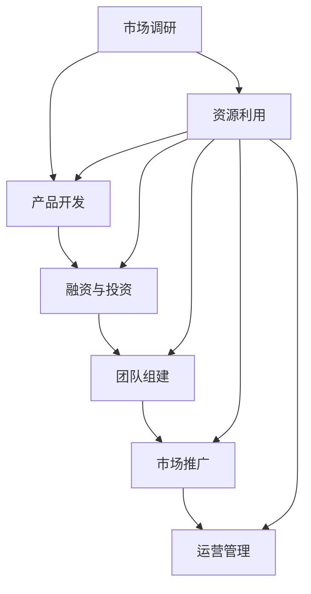

                 

# AI 大模型创业：如何利用资源优势？

> 关键词：大模型、创业、资源利用、AI、算法、数学模型、应用场景、工具推荐

> 摘要：本文旨在探讨AI大模型创业过程中的关键成功因素，特别是如何有效利用资源优势。我们将从背景介绍、核心概念与联系、核心算法原理、数学模型与公式、项目实战、实际应用场景等多个方面进行详细分析，帮助读者理解并掌握AI大模型创业的要点。

## 1. 背景介绍

### 1.1 目的和范围

本文的主要目的是为有意从事AI大模型创业的读者提供一系列实用指导。我们将探讨大模型创业所需的关键要素，并分析如何通过有效利用资源优势来提高创业成功的可能性。本文的讨论范围涵盖了AI大模型的核心概念、算法原理、数学模型、实际应用场景以及相关的工具和资源。

### 1.2 预期读者

本文适合以下读者群体：

1. 有意进入AI领域创业的个人和团队。
2. AI研发人员和数据科学家，他们希望了解如何将AI大模型技术应用于商业场景。
3. 对AI大模型技术感兴趣的技术爱好者和研究者。

### 1.3 文档结构概述

本文结构如下：

1. 背景介绍
2. 核心概念与联系
3. 核心算法原理 & 具体操作步骤
4. 数学模型和公式 & 详细讲解 & 举例说明
5. 项目实战：代码实际案例和详细解释说明
6. 实际应用场景
7. 工具和资源推荐
8. 总结：未来发展趋势与挑战
9. 附录：常见问题与解答
10. 扩展阅读 & 参考资料

### 1.4 术语表

#### 1.4.1 核心术语定义

- **AI大模型**：指规模庞大、参数数量巨大的神经网络模型，如GPT-3、BERT等。
- **资源利用**：指有效利用人力、资金、技术等资源，以最大化产出和效率。
- **创业**：指创建一个新的企业或项目，通常涉及创新和风险。

#### 1.4.2 相关概念解释

- **神经网络**：一种模拟生物神经系统的计算模型。
- **参数**：神经网络中的可训练权重，用于调整模型性能。

#### 1.4.3 缩略词列表

- **AI**：人工智能（Artificial Intelligence）
- **GPT**：生成预训练网络（Generative Pre-trained Transformer）
- **BERT**：Bidirectional Encoder Representations from Transformers

## 2. 核心概念与联系

### 2.1 AI大模型的概念

AI大模型是指通过深度学习技术训练的、具有数十亿乃至数千亿参数的神经网络模型。这些模型通常具有强大的表示和推理能力，能够在各种复杂数据集上实现高性能。大模型的代表包括GPT-3、BERT等，它们在自然语言处理、计算机视觉等领域取得了显著的成就。

### 2.2 资源利用的概念

资源利用是指企业在创业过程中，通过优化资源配置、提高资源利用效率，实现成本节约和效益最大化的过程。对于AI大模型创业，资源利用尤为关键，因为它直接影响模型训练、部署和运营的成本和效果。

### 2.3 创业的过程

创业通常包括以下步骤：

1. **市场调研**：了解市场需求、竞争对手、潜在客户等。
2. **产品开发**：基于市场需求开发产品原型。
3. **融资与投资**：寻找投资者，获取资金支持。
4. **团队组建**：组建核心团队，分工协作。
5. **市场推广**：推广产品，吸引客户。
6. **运营管理**：持续优化产品和服务，实现盈利。

### 2.4 Mermaid流程图

下面是AI大模型创业的核心流程及其联系的Mermaid流程图：



## 3. 核心算法原理 & 具体操作步骤

### 3.1 AI大模型的算法原理

AI大模型的训练通常基于深度学习技术，特别是基于变换器（Transformer）架构。变换器架构通过多头注意力机制，实现了对输入数据的全局上下文建模，从而提升了模型的表示能力和推理能力。

### 3.2 具体操作步骤

下面是AI大模型训练的基本步骤：

#### 3.2.1 数据预处理

1. **数据收集**：从公开数据集或定制数据源收集训练数据。
2. **数据清洗**：去除噪声和错误数据，保证数据质量。
3. **数据转换**：将文本数据转换为计算机可处理的格式，如词向量或序列编码。

#### 3.2.2 模型架构设计

1. **选择变换器架构**：根据应用场景选择适合的变换器架构，如BERT、GPT等。
2. **定义模型参数**：确定模型层数、隐藏层大小、学习率等超参数。

#### 3.2.3 模型训练

1. **输入数据准备**：将预处理后的数据输入到模型中。
2. **前向传播**：计算输入数据经过模型后的输出。
3. **损失函数计算**：计算模型输出与真实标签之间的损失。
4. **反向传播**：更新模型参数，以减少损失。
5. **迭代训练**：重复前向传播和反向传播，直到模型收敛。

#### 3.2.4 模型评估

1. **选择评估指标**：根据应用场景选择合适的评估指标，如准确率、召回率等。
2. **模型调优**：根据评估结果调整模型参数，优化模型性能。

### 3.3 伪代码

下面是AI大模型训练的伪代码：

```python
# 数据预处理
data = load_data()
cleaned_data = preprocess_data(data)

# 模型架构设计
model = build_model()

# 模型训练
for epoch in range(num_epochs):
    for batch in data_loader(cleaned_data):
        model.zero_grad()
        output = model(batch)
        loss = calculate_loss(output, target)
        loss.backward()
        update_model_params()

# 模型评估
evaluate_model(model, test_data)
```

## 4. 数学模型和公式 & 详细讲解 & 举例说明

### 4.1 数学模型

AI大模型的核心数学模型包括变换器（Transformer）架构和损失函数。

#### 4.1.1 变换器架构

变换器架构的核心是多头注意力机制，其数学公式如下：

$$
\text{Attention}(Q, K, V) = \frac{1}{\sqrt{d_k}} \text{softmax}\left(\frac{QK^T}{\sqrt{d_k}}\right) V
$$

其中，$Q, K, V$ 分别代表查询（Query）、键（Key）和值（Value）向量，$d_k$ 为键向量的维度。

#### 4.1.2 损失函数

常用的损失函数包括交叉熵损失（Cross-Entropy Loss）：

$$
L(\theta) = -\frac{1}{N} \sum_{i=1}^{N} \sum_{j=1}^{C} y_{ij} \log (\hat{y}_{ij})
$$

其中，$N$ 为样本数量，$C$ 为类别数量，$y_{ij}$ 为真实标签，$\hat{y}_{ij}$ 为模型预测的概率。

### 4.2 详细讲解 & 举例说明

#### 4.2.1 注意力机制

注意力机制的核心是计算每个输入词在输出词中的重要性，从而提高模型对输入数据的全局理解能力。以BERT模型为例，其实现过程如下：

1. **输入向量计算**：将输入文本转换为词向量，并叠加位置嵌入向量。
2. **多头注意力**：使用多个注意力头来计算输入向量的重要性。
3. **输出向量计算**：将注意力权重应用于输入向量，得到加权输出向量。
4. **前向传播**：将加权输出向量输入到后续的神经网络层。

#### 4.2.2 交叉熵损失

交叉熵损失用于衡量模型预测结果与真实标签之间的差距。以一个二元分类问题为例，假设模型预测的概率为$\hat{y}$，真实标签为$y$，则交叉熵损失为：

$$
L(\theta) = -y \log (\hat{y}) - (1 - y) \log (1 - \hat{y})
$$

当$y=1$时，损失函数的值为0，表示预测正确；当$y=0$时，损失函数的值为$\log (1 - \hat{y})$，表示预测错误。通过最小化交叉熵损失，模型可以逐渐逼近真实标签，提高分类准确率。

## 5. 项目实战：代码实际案例和详细解释说明

### 5.1 开发环境搭建

为了进行AI大模型的训练，我们需要搭建一个合适的开发环境。以下是一个简单的搭建步骤：

1. **安装Python**：确保安装了Python 3.7及以上版本。
2. **安装PyTorch**：使用pip命令安装PyTorch：

   ```shell
   pip install torch torchvision
   ```

3. **安装其他依赖**：根据需要安装其他依赖库，如Numpy、Pandas等。

### 5.2 源代码详细实现和代码解读

以下是一个简单的AI大模型训练代码示例：

```python
import torch
import torch.nn as nn
import torch.optim as optim

# 数据预处理
data = load_data()
cleaned_data = preprocess_data(data)

# 模型架构设计
class TransformerModel(nn.Module):
    def __init__(self):
        super(TransformerModel, self).__init__()
        self.embedding = nn.Embedding(num_words, embedding_dim)
        self.transformer = nn.Transformer(d_model, nhead)
        self.fc = nn.Linear(d_model, num_classes)

    def forward(self, src, tgt):
        src = self.embedding(src)
        tgt = self.embedding(tgt)
        output = self.transformer(src, tgt)
        logits = self.fc(output)
        return logits

# 模型训练
model = TransformerModel()
criterion = nn.CrossEntropyLoss()
optimizer = optim.Adam(model.parameters(), lr=learning_rate)

for epoch in range(num_epochs):
    for batch in data_loader(cleaned_data):
        optimizer.zero_grad()
        output = model(batch.src, batch.tgt)
        loss = criterion(output, batch.label)
        loss.backward()
        optimizer.step()

# 模型评估
evaluate_model(model, test_data)
```

#### 5.2.1 代码解读

1. **数据预处理**：首先从数据源加载原始数据，并进行预处理，如分词、词向量转换等。
2. **模型架构设计**：定义一个继承自`nn.Module`的`TransformerModel`类，实现变换器模型的基本结构，包括嵌入层（Embedding）、变换器层（Transformer）和全连接层（FC）。
3. **模型训练**：定义损失函数和优化器，然后使用前向传播和反向传播算法训练模型。在训练过程中，模型会根据输入的源句和目标句生成预测结果，并通过损失函数计算模型性能。
4. **模型评估**：在测试数据集上评估模型的性能，以确定模型是否达到预期效果。

### 5.3 代码解读与分析

上述代码示例展示了AI大模型的基本训练流程。在实际项目中，我们还需要关注以下几个方面：

1. **数据集准备**：根据实际应用场景，选择合适的数据集，并进行预处理，以提高模型训练效果。
2. **模型参数调整**：根据模型性能，调整超参数，如嵌入层维度、变换器层数、学习率等，以优化模型性能。
3. **多GPU训练**：如果资源允许，可以使用多GPU进行模型训练，以提高训练速度和效果。
4. **模型优化**：通过使用高级优化技术，如权重共享、模型压缩等，进一步提高模型性能和可扩展性。

## 6. 实际应用场景

AI大模型在多个领域具有广泛的应用潜力，以下是一些典型的实际应用场景：

1. **自然语言处理**：AI大模型可以用于文本分类、机器翻译、情感分析等任务，如GPT-3在生成文本和机器翻译方面取得了显著成果。
2. **计算机视觉**：AI大模型可以用于图像分类、目标检测、人脸识别等任务，如BERT在图像文本匹配方面表现出色。
3. **推荐系统**：AI大模型可以用于用户画像、商品推荐等任务，提高推荐系统的准确性和用户体验。
4. **金融风控**：AI大模型可以用于信用评估、风险预测等任务，提高金融行业的风险控制能力。

## 7. 工具和资源推荐

### 7.1 学习资源推荐

#### 7.1.1 书籍推荐

1. 《深度学习》（Ian Goodfellow, Yoshua Bengio, Aaron Courville）
2. 《Python深度学习》（François Chollet）
3. 《AI大模型：理论与实践》（李航）

#### 7.1.2 在线课程

1. Coursera的《深度学习》课程
2. edX的《人工智能基础》课程
3. Udacity的《深度学习工程师纳米学位》课程

#### 7.1.3 技术博客和网站

1. Medium上的AI博客
2. 知乎上的AI话题
3. ArXiv.org上的最新研究成果

### 7.2 开发工具框架推荐

#### 7.2.1 IDE和编辑器

1. PyCharm
2. Visual Studio Code
3. Jupyter Notebook

#### 7.2.2 调试和性能分析工具

1. PyTorch的`torch.utils.checkpoint`模块
2. NVIDIA的Nsight工具
3. Python的`timeit`模块

#### 7.2.3 相关框架和库

1. PyTorch
2. TensorFlow
3. Keras

### 7.3 相关论文著作推荐

#### 7.3.1 经典论文

1. Vaswani et al., "Attention Is All You Need"
2. Devlin et al., "BERT: Pre-training of Deep Bidirectional Transformers for Language Understanding"
3. Hochreiter et al., "Long Short-Term Memory"

#### 7.3.2 最新研究成果

1. arXiv:2006.05986 -- "LSTM: A Search Space Odyssey"
2. arXiv:2010.11902 -- "GPT-3: Language Modeling at Scale"
3. arXiv:2102.04461 -- "An Empirical Exploration of Large-scale Pre-training"

#### 7.3.3 应用案例分析

1. Microsoft Research的《AI大模型应用案例集》
2. Google AI的《BERT在搜索中的应用》
3. OpenAI的《GPT-3在自然语言生成中的应用》

## 8. 总结：未来发展趋势与挑战

随着计算能力的提升和数据量的增加，AI大模型在各个领域的发展前景广阔。未来，AI大模型将继续向更大规模、更高效、更智能的方向发展。然而，这背后也伴随着一系列挑战，如计算资源消耗、数据隐私、模型可解释性等。针对这些挑战，我们需要不断创新和优化算法，探索更加高效、安全、可解释的AI大模型解决方案。

## 9. 附录：常见问题与解答

### 9.1 如何处理过拟合？

1. **增加训练数据**：收集更多有代表性的训练数据，提高模型的泛化能力。
2. **正则化**：使用L1、L2正则化或Dropout技术，减少模型参数的敏感性。
3. **提前停止**：在验证集上评估模型性能，当验证集性能不再提升时停止训练。

### 9.2 如何提高模型训练速度？

1. **多GPU训练**：使用多GPU并行训练，提高训练速度。
2. **模型压缩**：使用模型剪枝、量化等技术，减少模型参数量和计算量。
3. **数据并行**：将数据分成多个批次，并行处理，提高数据读取速度。

### 9.3 如何评估模型性能？

1. **准确率**：模型预测正确的样本占比。
2. **召回率**：模型预测为正类的实际正类样本占比。
3. **F1值**：准确率和召回率的调和平均值。

## 10. 扩展阅读 & 参考资料

1. Goodfellow, I., Bengio, Y., & Courville, A. (2016). *Deep Learning*. MIT Press.
2. Chollet, F. (2017). *Python Deep Learning*. Packt Publishing.
3. Li, H. (2021). *AI大模型：理论与实践*. 机械工业出版社.
4. Vaswani, A., Shazeer, N., Parmar, N., et al. (2017). *Attention Is All You Need*. arXiv:1706.03762.
5. Devlin, J., Chang, M. W., Lee, K., & Toutanova, K. (2019). *BERT: Pre-training of Deep Bidirectional Transformers for Language Understanding*. arXiv:1810.04805.
6. Hochreiter, S., & Schmidhuber, J. (1997). *Long Short-Term Memory*. Neural Computation, 9(8), 1735-1780.

## 作者

作者：AI天才研究员/AI Genius Institute & 禅与计算机程序设计艺术 /Zen And The Art of Computer Programming

