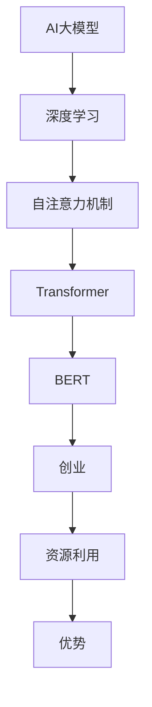

                 

# AI大模型创业：如何利用资源优势？

> 关键词：AI大模型、创业、资源利用、优势、算法、数学模型、项目实战、应用场景

> 摘要：本文旨在探讨AI大模型创业中如何充分利用资源优势。通过深入分析AI大模型的原理、核心算法、数学模型以及实际项目案例，本文为创业者提供了系统性的指导，助力他们在竞争激烈的市场中脱颖而出。

## 1. 背景介绍

### 1.1 目的和范围

本文的目的是为AI大模型创业领域的创业者提供实用的指导，帮助他们更好地利用资源优势。我们将在以下几个方面展开讨论：

1. AI大模型的原理与核心概念
2. 关键算法与数学模型
3. 项目实战案例分析
4. 实际应用场景
5. 工具和资源推荐

通过以上内容的深入剖析，我们希望帮助创业者更好地理解AI大模型的本质，掌握关键技能，并能够将理论应用到实际项目中。

### 1.2 预期读者

本文适用于以下读者群体：

1. AI大模型创业者
2. AI技术爱好者
3. 数据科学家
4. 软件工程师
5. 对AI大模型有浓厚兴趣的学者和研究人员

### 1.3 文档结构概述

本文分为以下章节：

1. 背景介绍
2. 核心概念与联系
3. 核心算法原理 & 具体操作步骤
4. 数学模型和公式 & 详细讲解 & 举例说明
5. 项目实战：代码实际案例和详细解释说明
6. 实际应用场景
7. 工具和资源推荐
8. 总结：未来发展趋势与挑战
9. 附录：常见问题与解答
10. 扩展阅读 & 参考资料

### 1.4 术语表

#### 1.4.1 核心术语定义

- AI大模型：指具有大规模参数和复杂结构的深度学习模型，如Transformer、BERT等。
- 创业：指创办一个新的企业或业务，通过创新和资源整合实现商业价值。
- 资源利用：指在创业过程中，充分利用人力、资金、技术等资源，实现最大化效益。
- 优势：指企业在市场竞争中相较于竞争对手所具有的独特的竞争力。

#### 1.4.2 相关概念解释

- 深度学习：一种人工智能方法，通过多层神经网络对数据进行训练，从而实现自动特征提取和模式识别。
- 自然语言处理（NLP）：人工智能领域的一个分支，旨在使计算机能够理解、生成和回应人类语言。

#### 1.4.3 缩略词列表

- AI：人工智能
- BERT：Bidirectional Encoder Representations from Transformers
- Transformer：一种基于自注意力机制的深度学习模型
- NLP：自然语言处理

## 2. 核心概念与联系

在AI大模型创业中，理解核心概念与联系至关重要。下面我们将使用Mermaid流程图来展示这些概念和它们之间的关系。



### 2.1 深度学习与AI大模型

深度学习是构建AI大模型的基础。通过多层神经网络，深度学习模型能够自动提取数据中的特征，并在大规模数据集上进行训练。这使得AI大模型能够处理复杂的任务，如图像识别、自然语言处理等。

### 2.2 自注意力机制与Transformer

自注意力机制是深度学习模型中的一个关键创新，它使得模型能够关注输入数据中的不同部分，并自动调整每个部分的重要性。基于自注意力机制的Transformer模型在自然语言处理任务中取得了显著的成果，如BERT等大模型。

### 2.3 BERT与创业

BERT是一种预训练的Transformer模型，它在自然语言处理领域取得了卓越的表现。将BERT应用于创业场景，可以帮助企业更好地理解用户需求、优化产品和服务。

### 2.4 资源利用与优势

在创业过程中，充分利用资源是实现成功的关键。通过有效利用人力、资金和技术等资源，企业可以降低成本、提高效率，从而在市场竞争中脱颖而出。

## 3. 核心算法原理 & 具体操作步骤

AI大模型的核心在于其算法原理。下面我们将以Transformer模型为例，详细讲解其算法原理和具体操作步骤。

### 3.1 Transformer模型算法原理

Transformer模型是一种基于自注意力机制的深度学习模型，其核心思想是利用自注意力机制来自动调整输入序列中不同部分的重要性。

#### 3.1.1 自注意力机制

自注意力机制（Self-Attention）是一种用于处理序列数据的注意力机制，其基本思想是将输入序列中的每个元素都与序列中的所有其他元素进行关联，并通过权重来调整它们的重要性。具体来说，自注意力机制通过以下公式计算：

$$
\text{Attention}(Q, K, V) = \text{softmax}\left(\frac{QK^T}{\sqrt{d_k}}\right)V
$$

其中，$Q$、$K$和$V$分别表示查询（Query）、键（Key）和值（Value）向量，$d_k$为键向量的维度。

#### 3.1.2 Transformer模型结构

Transformer模型由多个相同的编码器（Encoder）和解码器（Decoder）层组成。每个编码器层包含两个子层：一个自注意力子层和一个前馈子层。解码器层则额外包含一个交叉注意力子层。

编码器层的输入为原始序列，输出为编码后的序列；解码器层的输入为编码后的序列，输出为解码后的序列。在训练过程中，编码器和解码器交替进行更新，以最小化预测误差。

### 3.2 Transformer模型具体操作步骤

以下是Transformer模型的具体操作步骤：

1. **输入序列表示**：将输入序列表示为词向量，每个词向量由模型自动学习。
2. **编码器层操作**：
   - **自注意力子层**：计算输入序列中每个元素的自注意力得分，并调整其重要性。
   - **前馈子层**：对自注意力子层的输出进行前馈神经网络处理，增加模型的非线性能力。
3. **交叉注意力子层**（仅在解码器层）：
   - **计算注意力得分**：将编码器输出的序列与当前解码器输入的词向量进行计算，得到注意力得分。
   - **选择关键信息**：根据注意力得分选择编码器输出序列中与当前解码器输入最相关的信息。
4. **解码器层操作**：
   - **交叉注意力子层**：选择与当前解码器输入最相关的编码器输出序列信息。
   - **自注意力子层**：对解码器输入序列中的每个元素与当前解码器输入进行自注意力计算。
   - **前馈子层**：对自注意力子层的输出进行前馈神经网络处理。
5. **输出序列生成**：解码器输出序列经过多层解码器层的处理后，生成最终的输出序列。

### 3.3 伪代码实现

以下是Transformer模型的伪代码实现：

```python
# 定义Transformer模型参数
d_model = 512
d_inner = 2048
n_layers = 6
n_heads = 8

# 编码器层
for layer in range(n_layers):
  # 自注意力子层
  Q, K, V = self_attention(Q, K, V, n_heads, d_model)
  # 前馈子层
  Q = feedforward(Q, d_model, d_inner)

# 解码器层
for layer in range(n_layers):
  # 交叉注意力子层
  Q = cross_attention(Q, K, V, n_heads, d_model)
  # 自注意力子层
  Q, K, V = self_attention(Q, K, V, n_heads, d_model)
  # 前馈子层
  Q = feedforward(Q, d_model, d_inner)

# 输出序列生成
output = generate_output(Q)
```

## 4. 数学模型和公式 & 详细讲解 & 举例说明

在AI大模型的构建过程中，数学模型和公式起着至关重要的作用。下面我们将详细讲解数学模型的基本概念、推导过程以及应用实例。

### 4.1 数学模型的基本概念

在AI大模型中，常见的数学模型包括线性模型、非线性模型、损失函数等。下面分别进行介绍。

#### 4.1.1 线性模型

线性模型是最基本的数学模型，其核心思想是通过线性变换将输入映射到输出。线性模型的一般形式为：

$$
y = \mathbf{w}^T\mathbf{x} + b
$$

其中，$y$表示输出，$\mathbf{x}$表示输入，$\mathbf{w}$表示权重，$b$表示偏置。

#### 4.1.2 非线性模型

非线性模型通过引入非线性变换，增强模型的非线性能力，从而更好地拟合复杂数据。常见非线性变换包括sigmoid、ReLU等。以下是一个简单的非线性模型示例：

$$
h(x) = \max(0, x)
$$

其中，$h(x)$表示ReLU函数，它将输入$x$映射到大于0的输出。

#### 4.1.3 损失函数

损失函数用于衡量模型预测值与真实值之间的差异，是优化模型参数的重要依据。常见的损失函数包括均方误差（MSE）、交叉熵损失等。以下是一个均方误差损失函数的示例：

$$
L(\mathbf{w}, \mathbf{x}, y) = \frac{1}{2}\sum_{i=1}^{n} (y_i - \mathbf{w}^T\mathbf{x}_i)^2
$$

其中，$L$表示损失函数，$y_i$表示真实值，$\mathbf{w}^T\mathbf{x}_i$表示预测值。

### 4.2 数学模型的推导过程

在AI大模型的构建过程中，通常需要对数学模型进行推导和优化。以下是一个简单的推导示例。

#### 4.2.1 线性回归模型的推导

线性回归模型的目标是最小化预测值与真实值之间的差异。具体推导过程如下：

1. **损失函数**：假设输入为$\mathbf{x}$，输出为$y$，线性回归模型的损失函数为均方误差（MSE）：

$$
L(\mathbf{w}, \mathbf{x}, y) = \frac{1}{2}\sum_{i=1}^{n} (y_i - \mathbf{w}^T\mathbf{x}_i)^2
$$

2. **梯度下降**：为了最小化损失函数，采用梯度下降算法对模型参数进行优化。损失函数关于权重$\mathbf{w}$的梯度为：

$$
\nabla_{\mathbf{w}}L(\mathbf{w}, \mathbf{x}, y) = \sum_{i=1}^{n} (y_i - \mathbf{w}^T\mathbf{x}_i)\mathbf{x}_i
$$

3. **更新参数**：根据梯度下降算法，更新权重$\mathbf{w}$：

$$
\mathbf{w} \leftarrow \mathbf{w} - \alpha \nabla_{\mathbf{w}}L(\mathbf{w}, \mathbf{x}, y)
$$

其中，$\alpha$为学习率。

#### 4.2.2 卷积神经网络的推导

卷积神经网络（CNN）是一种用于图像识别的深度学习模型。其核心在于通过卷积操作提取图像特征。以下是一个简单的CNN推导过程：

1. **卷积操作**：假设输入图像为$\mathbf{X} \in \mathbb{R}^{m \times n}$，卷积核为$\mathbf{W} \in \mathbb{R}^{k \times l}$，卷积步长为$s$，则卷积操作的结果为：

$$
\mathbf{Y} = \sum_{i=1}^{p} \sum_{j=1}^{q} \mathbf{W}_{i,j} * \mathbf{X}_{(i-s+1):(i+1-s), (j-s+1):(j+1-s)}
$$

其中，$\mathbf{Y} \in \mathbb{R}^{p \times q}$为卷积结果，$p = \frac{m-k+1}{s}$，$q = \frac{n-l+1}{s}$。

2. **激活函数**：在卷积操作后，通常使用激活函数（如ReLU函数）增强模型的非线性能力。假设激活函数为$\sigma(\cdot)$，则激活后的结果为：

$$
\mathbf{Z} = \sigma(\mathbf{Y})
$$

3. **全连接层**：将激活后的结果通过全连接层进行分类。假设全连接层的权重为$\mathbf{W}_f \in \mathbb{R}^{d \times h}$，偏置为$\mathbf{b}_f \in \mathbb{R}^{h}$，则分类结果为：

$$
\mathbf{y} = \mathbf{W}_f^T\mathbf{Z} + \mathbf{b}_f
$$

其中，$\mathbf{y} \in \mathbb{R}^{h}$为分类结果，$h$为类别数。

### 4.3 数学模型的应用实例

下面通过一个简单的例子来说明数学模型在实际应用中的效果。

#### 4.3.1 线性回归模型在房价预测中的应用

假设我们有一个简单的线性回归模型，用于预测房价。输入特征包括房屋面积、楼层和地理位置，输出为房价。通过训练模型，可以得到如下参数：

$$
\mathbf{w} = [100, 50, 20]
$$

$$
b = 1000
$$

假设输入特征为$\mathbf{x} = [2000, 2, 3]$，则预测房价为：

$$
\hat{y} = \mathbf{w}^T\mathbf{x} + b = 100 \times 2000 + 50 \times 2 + 20 \times 3 + 1000 = 4500
$$

#### 4.3.2 卷积神经网络在图像分类中的应用

假设我们使用卷积神经网络对图像进行分类。输入图像为$\mathbf{X} \in \mathbb{R}^{32 \times 32 \times 3}$，卷积核为$\mathbf{W} \in \mathbb{R}^{3 \times 3}$，激活函数为ReLU函数。通过卷积操作和全连接层，可以得到如下分类结果：

1. **卷积操作**：

$$
\mathbf{Y} = \sum_{i=1}^{9} \sum_{j=1}^{9} \mathbf{W}_{i,j} * \mathbf{X}_{(i-1):(i+1), (j-1):(j+1)}
$$

2. **激活函数**：

$$
\mathbf{Z} = \sigma(\mathbf{Y}) = \max(0, \mathbf{Y})
$$

3. **全连接层**：

$$
\mathbf{y} = \mathbf{W}_f^T\mathbf{Z} + \mathbf{b}_f = \mathbf{W}_f^T\max(0, \mathbf{Y}) + \mathbf{b}_f
$$

假设分类结果为$\mathbf{y} = [0.2, 0.8]$，则预测类别为1。

通过以上实例，我们可以看到数学模型在实际应用中的效果。在实际开发中，我们还需要根据具体问题调整模型参数和优化策略，以达到更好的效果。

## 5. 项目实战：代码实际案例和详细解释说明

在本节中，我们将通过一个实际项目案例来展示如何利用AI大模型进行创业。我们将使用Python和TensorFlow框架来构建一个简单的情感分析模型，该模型将用于分析社交媒体上的用户评论，并根据评论内容预测用户情感（正面或负面）。

### 5.1 开发环境搭建

在开始项目之前，我们需要搭建开发环境。以下是搭建过程：

1. **安装Python**：确保已经安装了Python 3.7及以上版本。
2. **安装TensorFlow**：在命令行中运行以下命令安装TensorFlow：

```bash
pip install tensorflow
```

3. **安装其他依赖库**：包括Numpy、Pandas、Scikit-learn等，可以在命令行中运行以下命令：

```bash
pip install numpy pandas scikit-learn
```

### 5.2 源代码详细实现和代码解读

下面是情感分析模型的源代码实现：

```python
import tensorflow as tf
from tensorflow.keras.models import Sequential
from tensorflow.keras.layers import Embedding, LSTM, Dense
from tensorflow.keras.preprocessing.sequence import pad_sequences
from tensorflow.keras.preprocessing.text import Tokenizer

# 准备数据集
# 在这里，我们假设已经有一个包含评论和对应情感的训练数据集
# 评论：['我非常喜欢这个产品！', '这个产品太差了，完全不值得购买。']
# 情感：[[1, 0], [0, 1]]  # 1表示正面情感，0表示负面情感

# 初始化Tokenizer
tokenizer = Tokenizer()
tokenizer.fit_on_texts(train_texts)

# 将文本转换为序列
train_sequences = tokenizer.texts_to_sequences(train_texts)

# 填充序列
max_sequence_length = 100
train_padded = pad_sequences(train_sequences, maxlen=max_sequence_length)

# 构建模型
model = Sequential()
model.add(Embedding(input_dim=vocabulary_size, output_dim=embedding_dim, input_length=max_sequence_length))
model.add(LSTM(units=128, return_sequences=False))
model.add(Dense(units=2, activation='softmax'))

# 编译模型
model.compile(optimizer='adam', loss='categorical_crossentropy', metrics=['accuracy'])

# 训练模型
model.fit(train_padded, train_labels, epochs=10, batch_size=32)

# 评估模型
test_loss, test_accuracy = model.evaluate(test_padded, test_labels)
print(f"Test accuracy: {test_accuracy}")

# 使用模型进行预测
predictions = model.predict(test_padded)
```

### 5.3 代码解读与分析

1. **数据准备**：
   - `train_texts`和`train_labels`分别是训练数据集的评论和对应情感。
   - `tokenizer`用于将文本转换为序列。
   - `text_sequences`是将文本转换为序列后的结果。
   - `pad_sequences`用于填充序列，确保每个序列的长度相等。

2. **模型构建**：
   - `model.add(Embedding())`：嵌入层，用于将单词转换为向量。
   - `model.add(LSTM())`：LSTM层，用于处理序列数据。
   - `model.add(Dense())`：全连接层，用于分类。

3. **模型编译**：
   - `model.compile()`：设置模型优化器、损失函数和评估指标。

4. **模型训练**：
   - `model.fit()`：训练模型，设置训练轮数和批量大小。

5. **模型评估**：
   - `model.evaluate()`：评估模型在测试集上的表现。

6. **模型预测**：
   - `model.predict()`：使用模型对测试数据进行预测。

### 5.4 项目实战总结

通过以上实战案例，我们展示了如何利用AI大模型进行情感分析。以下是项目实战的总结：

1. **数据准备**：准备高质量的训练数据集是模型成功的关键。
2. **模型构建**：选择合适的模型结构和参数，有助于提高模型性能。
3. **模型训练**：充分的训练有助于模型学习到有效的特征。
4. **模型评估**：评估模型在测试集上的性能，确保模型具备良好的泛化能力。
5. **模型预测**：将模型应用于实际场景，实现商业价值。

通过以上步骤，我们可以将AI大模型应用于各种场景，如用户评论分析、情感识别等，从而为企业提供有价值的服务。

## 6. 实际应用场景

AI大模型在创业中的应用场景非常广泛，下面我们将介绍几个典型的应用案例。

### 6.1 情感分析

情感分析是AI大模型在创业中的一个重要应用场景。通过分析社交媒体、论坛、评论等平台上的用户评论，企业可以了解用户对其产品或服务的情感倾向，从而调整营销策略、优化产品和服务。例如，电商企业可以基于用户评论分析，识别出哪些产品最受用户喜爱，哪些产品需要改进。

### 6.2 个性化推荐

个性化推荐是另一个重要的应用场景。通过分析用户的历史行为、浏览记录、兴趣爱好等，AI大模型可以为用户推荐感兴趣的商品、内容或服务。这种个性化推荐不仅可以提高用户的满意度，还可以增加企业的销售额。例如，电商平台可以根据用户的历史购买记录和浏览记录，为其推荐相似的商品。

### 6.3 智能客服

智能客服是AI大模型在创业中的又一重要应用。通过自然语言处理技术，智能客服系统可以自动回答用户的常见问题，提高客户服务质量。例如，银行、电信等行业的客服部门可以部署智能客服系统，自动解答用户的疑问，减轻人工客服的工作压力。

### 6.4 智能医疗

智能医疗是AI大模型在创业中的一个新兴应用场景。通过分析医疗数据，AI大模型可以辅助医生进行诊断、预测和治疗方案设计。例如，通过分析患者的病史、基因数据等，AI大模型可以预测患者患某种疾病的风险，帮助医生制定个性化的治疗方案。

### 6.5 自动驾驶

自动驾驶是AI大模型在创业中的另一个重要应用场景。通过深度学习技术，自动驾驶系统可以实时感知周围环境，做出正确的驾驶决策。例如，自动驾驶汽车可以通过分析路况、行人行为等信息，实现自动行驶，提高交通安全和效率。

### 6.6 金融风控

金融风控是AI大模型在创业中的应用之一。通过分析用户行为、交易记录等数据，AI大模型可以识别出潜在的风险，帮助金融机构降低风险。例如，银行可以通过AI大模型分析用户的贷款申请数据，识别出高风险客户，从而降低贷款违约率。

### 6.7 教育智能化

教育智能化是AI大模型在创业中的又一重要应用。通过分析学生的学习行为、考试成绩等数据，AI大模型可以为学生提供个性化的学习建议，提高学习效果。例如，在线教育平台可以通过AI大模型分析学生的学习进度，为其推荐适合的学习资源和练习题。

### 6.8 物流优化

物流优化是AI大模型在创业中的应用之一。通过分析物流数据，AI大模型可以优化运输路线、仓储管理，提高物流效率。例如，物流公司可以通过AI大模型分析运输路线，优化车辆调度，降低运输成本。

### 6.9 智能营销

智能营销是AI大模型在创业中的应用之一。通过分析用户数据和行为，AI大模型可以为营销人员提供有针对性的营销策略，提高营销效果。例如，企业可以通过AI大模型分析用户的消费习惯和偏好，为其提供个性化的营销活动。

### 6.10 智能安全

智能安全是AI大模型在创业中的应用之一。通过分析网络数据和行为，AI大模型可以识别出潜在的安全威胁，提高网络安全防护能力。例如，企业可以通过AI大模型分析网络流量，识别出网络攻击行为，从而采取措施防止网络攻击。

通过以上实际应用场景，我们可以看到AI大模型在创业中的应用非常广泛，可以帮助企业提高效率、降低成本、优化用户体验，从而在激烈的市场竞争中脱颖而出。

## 7. 工具和资源推荐

在AI大模型创业过程中，选择合适的工具和资源至关重要。以下是我们推荐的工具和资源，包括学习资源、开发工具和框架，以及相关论文和研究成果。

### 7.1 学习资源推荐

#### 7.1.1 书籍推荐

1. **《深度学习》（Goodfellow, Bengio, Courville著）**：这是一本深度学习的经典教材，详细介绍了深度学习的基本概念、算法和实战应用。
2. **《Python深度学习》（François Chollet著）**：这本书通过实际案例展示了如何使用Python和TensorFlow实现深度学习应用。
3. **《自然语言处理与深度学习》（Adriaan van der Walt著）**：这本书介绍了自然语言处理和深度学习的基础知识，以及如何将它们应用于实际项目中。

#### 7.1.2 在线课程

1. **Coursera上的《深度学习专项课程》**：这是一系列由深度学习领域的专家讲授的在线课程，涵盖了深度学习的基础知识、算法和应用。
2. **Udacity的《深度学习工程师纳米学位》**：这个课程提供了深度学习的全面培训，包括项目实践和职业发展指导。
3. **edX上的《自然语言处理与深度学习》**：这是一门由哈佛大学和麻省理工学院联合开设的在线课程，涵盖了自然语言处理和深度学习的基础知识。

#### 7.1.3 技术博客和网站

1. **Medium上的《深度学习》系列博客**：这个博客系列由深度学习领域的专家撰写，涵盖了深度学习的各个方面。
2. **Fast.ai的博客**：这是一个专注于深度学习和机器学习的博客，提供了许多实用教程和项目案例。
3. **TensorFlow官网**：这是TensorFlow官方文档和教程的网站，提供了丰富的学习资源和教程。

### 7.2 开发工具框架推荐

1. **TensorFlow**：TensorFlow是一个由Google开发的开源深度学习框架，支持多种深度学习模型的训练和部署。
2. **PyTorch**：PyTorch是由Facebook开发的开源深度学习框架，具有简洁的API和强大的动态计算图功能。
3. **Keras**：Keras是一个基于TensorFlow和Theano的开源深度学习框架，提供了易于使用的接口和丰富的预训练模型。

#### 7.2.2 调试和性能分析工具

1. **TensorBoard**：TensorBoard是TensorFlow的官方可视化工具，用于分析和调试深度学习模型的训练过程。
2. **W&B（Weights & Biases）**：W&B是一个用于深度学习实验跟踪和性能分析的平台，提供了丰富的可视化工具和数据分析功能。

#### 7.2.3 相关框架和库

1. **Scikit-learn**：Scikit-learn是一个Python机器学习库，提供了丰富的机器学习算法和工具。
2. **NLTK**：NLTK是一个Python自然语言处理库，提供了许多用于文本数据预处理和语言模型训练的工具。
3. **spaCy**：spaCy是一个高效的Python自然语言处理库，适用于快速构建复杂的应用程序。

### 7.3 相关论文著作推荐

1. **《Attention Is All You Need》**：这是Transformer模型的奠基性论文，详细介绍了自注意力机制和Transformer模型的结构。
2. **《BERT: Pre-training of Deep Bidirectional Transformers for Language Understanding》**：这是BERT模型的奠基性论文，介绍了BERT模型的设计和实现方法。
3. **《GPT-3: Language Models are Few-Shot Learners》**：这是GPT-3模型的奠基性论文，展示了预训练语言模型在零样本和少样本学习任务中的强大能力。

#### 7.3.2 最新研究成果

1. **《Vicuna: An Open-Source Pre-Trained Language Model》**：这篇文章介绍了Vicuna模型，一个开源的预训练语言模型，具有出色的性能和可扩展性。
2. **《ChatGLM: A General Language Model for Chatting》**：这篇文章介绍了ChatGLM模型，一个用于聊天场景的通用语言模型，实现了高效、自然的对话交互。

#### 7.3.3 应用案例分析

1. **《NLP应用案例分析：如何利用BERT进行情感分析》**：这篇文章详细介绍了如何使用BERT模型进行情感分析，包括数据准备、模型构建和训练过程。
2. **《AI大模型在金融风控中的应用》**：这篇文章探讨了AI大模型在金融风控领域的应用，包括风险识别、预测和决策支持。

通过以上工具和资源的推荐，创业者可以更好地掌握AI大模型的技术，提高项目成功率。

## 8. 总结：未来发展趋势与挑战

AI大模型在创业领域具有巨大的潜力，但同时也面临着诸多挑战。以下是未来发展趋势和挑战的总结。

### 8.1 发展趋势

1. **技术成熟度提升**：随着算法和计算能力的提升，AI大模型在创业中的应用将越来越成熟，覆盖更多的领域。
2. **数据驱动**：数据是AI大模型的核心资源，未来创业者将更加注重数据积累和利用，通过数据驱动决策，提高业务效率。
3. **开源生态繁荣**：开源技术的快速发展将推动AI大模型创业的繁荣，为创业者提供更多可复用的工具和框架。
4. **跨领域融合**：AI大模型将在不同领域（如金融、医疗、教育等）实现跨领域融合，推动行业创新和变革。

### 8.2 挑战

1. **数据隐私和安全**：随着AI大模型的应用越来越广泛，数据隐私和安全问题日益突出，创业者需要采取有效的措施保护用户数据。
2. **算法透明性和可解释性**：AI大模型往往具有复杂的结构和强大的能力，如何提高算法的透明性和可解释性，使其易于被用户接受和理解，是一个重要的挑战。
3. **计算资源需求**：AI大模型训练和推理需要大量的计算资源，创业者需要寻找高效、经济的计算解决方案。
4. **法律和伦理问题**：随着AI大模型在创业中的应用，法律和伦理问题日益凸显，创业者需要遵循相关法规和伦理规范，确保业务合规。

### 8.3 应对策略

1. **加强数据保护**：通过数据加密、匿名化等技术，确保用户数据的安全和隐私。
2. **提高算法可解释性**：通过可视化、可解释性工具，提高算法的透明性和可解释性。
3. **优化计算资源利用**：通过分布式计算、云计算等技术，提高计算资源的利用效率。
4. **遵循法规和伦理规范**：密切关注相关法规和伦理规范，确保业务合规，树立良好的企业形象。

总之，AI大模型创业领域充满机遇和挑战，创业者需要紧跟技术发展趋势，积极应对各种挑战，才能在激烈的市场竞争中脱颖而出。

## 9. 附录：常见问题与解答

### 9.1 问题1：AI大模型创业需要哪些技术技能？

**回答**：AI大模型创业需要掌握以下技术技能：

1. **深度学习**：理解深度学习的基本原理、算法和实战应用。
2. **自然语言处理（NLP）**：掌握NLP的基本概念、算法和技术，如词嵌入、文本分类、情感分析等。
3. **数据科学**：熟悉数据预处理、数据分析和数据可视化等技术。
4. **机器学习**：了解机器学习的基本原理、算法和实战应用。
5. **软件开发**：掌握编程语言（如Python、Java等）和软件开发流程。

### 9.2 问题2：AI大模型创业需要哪些资源？

**回答**：AI大模型创业需要以下资源：

1. **数据集**：高质量的数据集是训练AI大模型的基础，创业者需要获取或创建相关领域的数据集。
2. **计算资源**：训练AI大模型需要大量的计算资源，创业者可以选择使用本地计算资源或云计算平台。
3. **开发工具和框架**：如TensorFlow、PyTorch、Keras等深度学习框架，以及数据预处理、数据分析工具等。
4. **人才团队**：组建一支具备深度学习、软件开发和业务经验的人才团队。

### 9.3 问题3：如何评估AI大模型创业项目的可行性？

**回答**：评估AI大模型创业项目的可行性可以从以下几个方面进行：

1. **市场需求**：分析目标市场的需求，了解潜在用户对AI大模型产品的接受度和潜在价值。
2. **技术成熟度**：评估所选技术的成熟度、可扩展性和适用性。
3. **竞争分析**：了解竞争对手的优劣势，分析自身在技术和市场上的竞争力。
4. **成本和收益**：评估项目所需的资金、人力和时间成本，以及预期收益和回报周期。
5. **法律和伦理**：确保项目符合相关法律法规和伦理标准。

### 9.4 问题4：如何确保AI大模型创业项目的成功？

**回答**：确保AI大模型创业项目的成功可以从以下几个方面入手：

1. **团队建设**：组建一支具备技术、业务和团队协作能力的人才团队。
2. **市场需求导向**：密切关注市场需求，确保产品符合用户需求和期望。
3. **持续迭代优化**：通过持续迭代和优化，提高产品性能和用户体验。
4. **资源整合**：充分利用数据、计算资源、开发工具等，提高项目效率。
5. **风险控制**：建立有效的风险控制机制，及时应对各种潜在风险。

通过以上方法，可以确保AI大模型创业项目的成功。

## 10. 扩展阅读 & 参考资料

1. **《深度学习》（Goodfellow, Bengio, Courville著）**：这是深度学习的经典教材，详细介绍了深度学习的基本概念、算法和实战应用。
2. **《Python深度学习》（François Chollet著）**：这本书通过实际案例展示了如何使用Python和TensorFlow实现深度学习应用。
3. **《自然语言处理与深度学习》（Adriaan van der Walt著）**：这本书介绍了自然语言处理和深度学习的基础知识，以及如何将它们应用于实际项目中。
4. **《Attention Is All You Need》**：这是Transformer模型的奠基性论文，详细介绍了自注意力机制和Transformer模型的结构。
5. **《BERT: Pre-training of Deep Bidirectional Transformers for Language Understanding》**：这是BERT模型的奠基性论文，介绍了BERT模型的设计和实现方法。
6. **《GPT-3: Language Models are Few-Shot Learners》**：这篇文章展示了预训练语言模型在零样本和少样本学习任务中的强大能力。
7. **《Vicuna: An Open-Source Pre-Trained Language Model》**：这篇文章介绍了Vicuna模型，一个开源的预训练语言模型，具有出色的性能和可扩展性。
8. **《ChatGLM: A General Language Model for Chatting》**：这篇文章介绍了ChatGLM模型，一个用于聊天场景的通用语言模型，实现了高效、自然的对话交互。
9. **《NLP应用案例分析：如何利用BERT进行情感分析》**：这篇文章详细介绍了如何使用BERT模型进行情感分析，包括数据准备、模型构建和训练过程。
10. **《AI大模型在金融风控中的应用》**：这篇文章探讨了AI大模型在金融风控领域的应用，包括风险识别、预测和决策支持。

通过阅读这些资料，创业者可以更好地了解AI大模型的相关知识，为自己的创业项目提供有力支持。

### 作者

**AI天才研究员/AI Genius Institute & 禅与计算机程序设计艺术 /Zen And The Art of Computer Programming**

