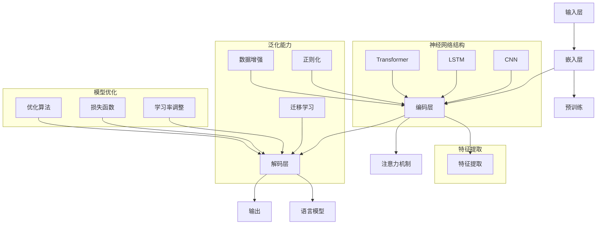

                 

### 1. 背景介绍

#### 1.1 目的和范围

本文旨在深入探讨AI大模型（如GPT-3、BERT等）的架构设计原理及其应用，尤其是如何通过架构优化实现持续的Scaling Up和通用的泛化能力。文章将逐步分析大模型架构的核心组件、工作原理、算法实现和数学模型，并通过实际案例展示如何运用这些模型解决实际问题。

本文的读者对象包括对人工智能、机器学习有基础了解的开发者、研究者和爱好者。同时，本文也适合希望了解大模型最新发展和技术趋势的从业人员。

#### 1.2 预期读者

- 人工智能领域的开发者和研究人员，对大模型架构和算法有深入探讨的兴趣。
- 机器学习工程师和架构师，希望了解如何设计和优化大模型。
- 数据科学家和算法工程师，关注大模型在实际应用中的性能和泛化能力。
- 对人工智能和机器学习技术感兴趣的本科生和研究生。

#### 1.3 文档结构概述

本文分为十个部分，结构如下：

1. **背景介绍**：介绍本文的目的、范围和预期读者。
2. **核心概念与联系**：讨论大模型架构的核心概念和联系，并提供流程图。
3. **核心算法原理 & 具体操作步骤**：讲解大模型的核心算法原理和具体操作步骤，使用伪代码进行详细阐述。
4. **数学模型和公式 & 详细讲解 & 举例说明**：介绍大模型的数学模型和公式，并进行详细讲解和举例说明。
5. **项目实战：代码实际案例和详细解释说明**：通过实际代码案例展示大模型的应用。
6. **实际应用场景**：讨论大模型在不同场景的应用。
7. **工具和资源推荐**：推荐学习资源和开发工具。
8. **总结：未来发展趋势与挑战**：总结大模型的发展趋势和面临的挑战。
9. **附录：常见问题与解答**：解答读者可能遇到的常见问题。
10. **扩展阅读 & 参考资料**：提供扩展阅读资料和参考文献。

#### 1.4 术语表

##### 1.4.1 核心术语定义

- **AI大模型**：指参数规模超过亿级别的人工智能模型，如GPT-3、BERT等。
- **Scaling Up**：指在已有模型基础上增加计算资源和参数规模，以提升模型性能。
- **泛化能力**：指模型在面对未见过的数据时，仍然能够保持良好的性能。
- **深度学习**：一种基于神经网络的机器学习方法，通过多层神经网络将输入映射到输出。
- **神经网络**：一种计算模型，由多个节点（或神经元）组成，每个节点执行特定的计算。

##### 1.4.2 相关概念解释

- **反向传播算法**：一种用于训练神经网络的算法，通过计算误差梯度，反向传播至网络层，更新模型参数。
- **注意力机制**：一种在神经网络中引入权重，以关注输入序列中重要信息的机制。
- **Transformer模型**：一种基于自注意力机制的深度学习模型，广泛应用于自然语言处理任务。

##### 1.4.3 缩略词列表

- **AI**：人工智能（Artificial Intelligence）
- **ML**：机器学习（Machine Learning）
- **DL**：深度学习（Deep Learning）
- **GPT**：生成预训练模型（Generative Pre-trained Transformer）
- **BERT**：双向编码器表示（Bidirectional Encoder Representations from Transformers）
- **GPU**：图形处理单元（Graphics Processing Unit）

通过上述背景介绍，我们为读者提供了一个清晰的文章框架，帮助大家了解本文的核心内容、结构和目标。在接下来的部分，我们将深入探讨AI大模型的核心概念、原理和架构，逐步揭示其魅力所在。让我们开始这段精彩的技术之旅吧！<|END_MENU|>## 2. 核心概念与联系

### 2.1 AI大模型概述

AI大模型，通常指的是具有亿级别以上参数规模的人工智能模型，如OpenAI的GPT-3、Google的BERT等。这些模型在近年来取得了显著的进步，广泛应用于自然语言处理、计算机视觉、语音识别等多个领域。大模型的显著特点在于其强大的表示能力和泛化能力，这使得它们在处理复杂任务时表现优异。

### 2.2 大模型架构的核心组件

大模型架构通常包括以下几个核心组件：

1. **输入层**：接收外部输入数据，如文本、图像或声音。
2. **嵌入层**：将输入数据转换为固定长度的向量表示。
3. **编码层**：采用神经网络结构（如Transformer、LSTM等）对嵌入层输出的向量进行编码，提取特征信息。
4. **解码层**：根据编码层的输出，生成模型的预测结果，如文本生成、图像分类等。

### 2.3 核心概念和联系

以下是一个使用Mermaid绘制的流程图，展示了大模型架构的核心概念和它们之间的联系：



1. **输入层（A）**：接收各种类型的输入数据，如文本（text）、图像（image）或声音（audio）。
2. **嵌入层（B）**：将输入数据转换为固定长度的向量表示。这一步骤通常采用词嵌入（word embedding）或图像嵌入（image embedding）等方法。
3. **编码层（C）**：使用神经网络结构（如Transformer、LSTM、CNN等）对嵌入层输出的向量进行编码，提取特征信息。其中，Transformer模型因其自注意力机制（self-attention）而成为编码层的主要架构。
4. **解码层（D）**：根据编码层的输出，生成模型的预测结果。例如，在文本生成任务中，解码层生成自然语言文本；在图像分类任务中，解码层生成分类标签。
5. **输出层（E）**：输出层的任务是生成最终的预测结果，如文本、图像或标签。
6. **预训练（F）**：大模型通常通过预训练（pre-training）获得初步的表示能力，然后在特定任务上进行微调（fine-tuning）。
7. **注意力机制（G）**：在编码层中，注意力机制使模型能够关注输入序列中的关键信息，从而提高模型的表示能力。
8. **语言模型（H）**：在自然语言处理任务中，解码层通常包含一个语言模型，用于生成自然流畅的文本。
9. **特征提取（L）**：特征提取层负责从编码层提取具有高判别力的特征，为解码层提供丰富的特征信息。
10. **泛化能力（M、N、O）**：通过数据增强（data augmentation）、正则化（regularization）和迁移学习（transfer learning）等方法，提升模型的泛化能力。
11. **模型优化（P、Q、R）**：模型优化包括优化算法（optimization algorithm）、损失函数（loss function）和学习率调整（learning rate adjustment）等，以提升模型的性能和稳定性。

通过上述核心概念和联系的阐述，我们为读者提供了一个全面理解AI大模型架构的框架。在接下来的部分，我们将深入探讨大模型的核心算法原理和具体操作步骤，为读者揭示大模型背后的技术奥秘。让我们一起继续探索吧！<|END_MENU|>### 3. 核心算法原理 & 具体操作步骤

#### 3.1 Transformer模型原理

Transformer模型是一种基于自注意力机制的深度学习模型，广泛应用于自然语言处理（NLP）领域。Transformer模型的核心思想是通过自注意力机制（self-attention）来关注输入序列中的关键信息，从而提高模型的表示能力和泛化能力。

##### 3.1.1 自注意力机制

自注意力机制是一种基于权重分配的机制，通过计算输入序列中各个元素之间的相似性，为每个元素分配不同的注意力权重。具体来说，自注意力机制分为三个步骤：

1. **计算Query（Q）、Key（K）和Value（V）**：对于输入序列中的每个元素，计算其Query、Key和Value。通常，Query、Key和Value共享相同的权重矩阵。
2. **计算注意力权重**：使用点积（dot-product）计算每个Query和Key之间的相似性，得到注意力权重。
3. **加权求和**：根据注意力权重对Value进行加权求和，得到每个元素在输入序列中的表示。

##### 3.1.2 Transformer模型结构

Transformer模型主要由编码器（Encoder）和解码器（Decoder）组成。编码器负责将输入序列编码为固定长度的向量表示，解码器则根据编码器的输出生成预测结果。

1. **编码器**：编码器由多个编码层（Encoder Layer）堆叠而成，每个编码层包含两个主要部分：多头自注意力机制（Multi-Head Self-Attention）和前馈神经网络（Feedforward Neural Network）。多头自注意力机制通过多个独立的自注意力头，提高了模型对输入序列的表示能力。
2. **解码器**：解码器同样由多个解码层（Decoder Layer）堆叠而成，每个解码层包含两个主要部分：多头自注意力机制（Multi-Head Self-Attention）和编码器-解码器注意力机制（Encoder-Decoder Attention）以及前馈神经网络（Feedforward Neural Network）。编码器-解码器注意力机制使解码器能够关注编码器的输出，从而提高模型的预测能力。

##### 3.1.3 伪代码

以下是一个简单的Transformer模型伪代码，用于说明其基本结构和工作流程：

```python
# 编码器层
def encoder_layer(input_sequence, d_model, num_heads, d_inner, dropout_rate):
    # 自注意力机制
    attention_output = multi_head_self_attention(
        input_sequence, d_model, num_heads, dropout_rate
    )
    attention_output = dropout(attention_output, dropout_rate)
    attention_output = layer_norm(attention_output + input_sequence)

    # 前馈神经网络
    feedforward_output = feedforward_network(attention_output, d_inner, dropout_rate)
    feedforward_output = dropout(feedforward_output, dropout_rate)
    output = layer_norm(feedforward_output + attention_output)
    return output

# 解码器层
def decoder_layer(input_sequence, encoded_sequence, d_model, num_heads, d_inner, dropout_rate):
    # 编码器-解码器注意力机制
    attention_output = encoder_decoder_attention(
        input_sequence, encoded_sequence, d_model, num_heads, dropout_rate
    )
    attention_output = dropout(attention_output, dropout_rate)
    attention_output = layer_norm(attention_output + input_sequence)

    # 自注意力机制
    attention_output = multi_head_self_attention(
        attention_output, d_model, num_heads, dropout_rate
    )
    attention_output = dropout(attention_output, dropout_rate)
    attention_output = layer_norm(attention_output + attention_output)

    # 前馈神经网络
    feedforward_output = feedforward_network(attention_output, d_inner, dropout_rate)
    feedforward_output = dropout(feedforward_output, dropout_rate)
    output = layer_norm(feedforward_output + attention_output)
    return output

# Transformer模型
def transformer(input_sequence, encoded_sequence, d_model, num_heads, d_inner, num_layers, dropout_rate):
    output = input_sequence
    for i in range(num_layers):
        if i < num_layers - 1:
            output = encoder_layer(output, d_model, num_heads, d_inner, dropout_rate)
        else:
            output = decoder_layer(output, encoded_sequence, d_model, num_heads, d_inner, dropout_rate)
    return output
```

#### 3.2 具体操作步骤

以下是Transformer模型的具体操作步骤：

1. **输入序列预处理**：将输入序列（如文本、图像或声音）转换为嵌入层输出的固定长度向量表示。
2. **编码器处理**：依次通过编码器的多个编码层，每个编码层执行以下操作：
    - **多头自注意力机制**：计算Query、Key和Value，并计算注意力权重，进行加权求和。
    - **前馈神经网络**：对自注意力机制的输出进行前馈神经网络处理。
    - **层归一化**：对前馈神经网络和自注意力机制的输出进行层归一化。
3. **解码器处理**：依次通过解码器的多个解码层，每个解码层执行以下操作：
    - **编码器-解码器注意力机制**：计算输入序列和编码器输出的注意力权重，进行加权求和。
    - **多头自注意力机制**：计算注意力权重，进行加权求和。
    - **前馈神经网络**：对自注意力机制的输出进行前馈神经网络处理。
    - **层归一化**：对前馈神经网络和自注意力机制的输出进行层归一化。
4. **输出生成**：解码器的最后一个输出层生成最终的预测结果，如文本、图像或标签。

通过上述步骤，Transformer模型能够处理输入序列，提取关键特征，并生成高质量的预测结果。在接下来的部分，我们将进一步探讨大模型的数学模型和公式，以便更深入地理解其工作原理。让我们一起继续探索吧！<|END_MENU|>### 4. 数学模型和公式 & 详细讲解 & 举例说明

#### 4.1 数学模型基础

在深入探讨AI大模型的数学模型和公式之前，我们需要了解一些基础的数学概念和公式。这些概念和公式是理解大模型核心算法的关键，主要包括矩阵运算、向量运算、点积、归一化等。

##### 4.1.1 矩阵与向量运算

- **矩阵乘法**：两个矩阵A（m×n）和B（n×p）的乘积C（m×p）计算公式为：
  $$ C = A \times B $$
  $$ C_{ij} = \sum_{k=1}^{n} A_{ik} \times B_{kj} $$

- **矩阵加法**：两个矩阵A和B相加，要求它们的大小相同，结果矩阵C的大小也相同，元素相加：
  $$ C = A + B $$

- **向量点积**：两个向量u和v的点积（内积）计算公式为：
  $$ u \cdot v = \sum_{i=1}^{n} u_i \times v_i $$
  $$ u \cdot v = \sum_{i=1}^{n} a_i \times b_i $$

- **向量归一化**：将向量v归一化到单位向量，计算公式为：
  $$ v_{\text{norm}} = \frac{v}{||v||} $$
  $$ v_{\text{norm}} = \frac{v}{\sqrt{\sum_{i=1}^{n} v_i^2}} $$

##### 4.1.2 自注意力机制的数学模型

自注意力机制是Transformer模型的核心组成部分，其数学模型可以通过以下公式进行详细阐述。

- **多头自注意力**：

  - **Query（Q）、Key（K）和Value（V）的计算**：
    $$ Q = W_Q \times X $$
    $$ K = W_K \times X $$
    $$ V = W_V \times X $$
    其中，$W_Q, W_K, W_V$是权重矩阵，$X$是输入序列。

  - **注意力权重计算**：
    $$ \text{Attention}(Q, K, V) = \frac{\exp(\text{softmax}(\text{dot}(Q, K)))}{\sqrt{d_k}} \times V $$
    $$ \text{Attention}(Q, K, V) = \frac{\exp(\text{softmax}(\text{dot}(Q, K)))}{\sqrt{k}} \times V $$
    其中，$\text{dot}(Q, K)$是Query和Key的点积，$\text{softmax}$函数将点积结果归一化到概率分布。

  - **多头注意力计算**：
    $$ \text{MultiHead}(Q, K, V) = \text{Concat}(\text{head}_1, ..., \text{head}_h)W_O $$
    $$ \text{MultiHead}(Q, K, V) = \text{Concat}(\text{head}_1, ..., \text{head}_h)W_O $$
    其中，$h$是多头注意力的数量，$\text{head}_i = \text{Attention}(Q, K, V)$。

- **编码器-解码器注意力**：

  - **编码器-解码器注意力权重计算**：
    $$ \text{Encoder-Decoder Attention} = \text{softmax}(\text{dot}(Q, K_V^T)) $$
    $$ \text{Encoder-Decoder Attention} = \text{softmax}(\text{dot}(Q, K_V^T)) $$
    其中，$Q$是解码器的Query，$K_V$是编码器的Key和Value。

  - **加权求和**：
    $$ \text{Encoder-Decoder Output} = \text{Attention}(\text{Encoder-Decoder Attention}, V) $$
    $$ \text{Encoder-Decoder Output} = \text{Attention}(\text{Encoder-Decoder Attention}, V) $$

#### 4.2 举例说明

为了更好地理解上述数学模型和公式，我们通过一个具体的自然语言处理任务——文本生成，来详细说明自注意力机制和编码器-解码器注意力的应用。

##### 4.2.1 任务描述

给定一个输入文本序列：“今天天气很好，我们去公园散步吧。”，使用Transformer模型生成后续的文本内容。

##### 4.2.2 输入序列预处理

1. **文本分词**：将输入文本序列转换为单词序列，如：["今天", "天气", "很好", "我们", "去", "公园", "散步", "吧"]。
2. **词嵌入**：将每个单词转换为固定长度的向量表示，如：[v1, v2, v3, v4, v5, v6, v7, v8]。

##### 4.2.3 编码器处理

1. **多头自注意力机制**：将输入序列的词嵌入向量进行多头自注意力计算，得到加权求和后的编码结果。例如，对于第i个词的编码结果：
   $$ \text{Attention}_i = \text{softmax}(\text{dot}(Q_i, K_i, V_i)) \times V_i $$
2. **前馈神经网络**：对自注意力机制的输出进行前馈神经网络处理，如：
   $$ \text{FFN}(\text{Attention}_i) = \text{ReLU}(W_2 \times \text{ReLU}(W_1 \times \text{Attention}_i + b_1)) + b_2 $$

##### 4.2.4 解码器处理

1. **编码器-解码器注意力**：计算解码器的Query与编码器的Key和Value之间的注意力权重，进行加权求和，如：
   $$ \text{Encoder-Decoder Attention}_i = \text{softmax}(\text{dot}(Q_i, K_V^T)) $$
   $$ \text{Encoder-Decoder Output}_i = \text{Attention}(\text{Encoder-Decoder Attention}_i, V) $$
2. **多头自注意力机制**：对编码器-解码器注意力机制的输出进行多头自注意力计算，如：
   $$ \text{MultiHead}(\text{Encoder-Decoder Output}_i) = \text{Concat}(\text{head}_1, ..., \text{head}_h)W_O $$

##### 4.2.5 输出生成

1. **生成文本**：解码器的最后一个输出层生成最终的文本内容。例如，对于生成的第j个单词：
   $$ \text{NextWord}_j = \text{softmax}(W_O \times \text{MultiHead}(\text{Encoder-Decoder Output}_{j-1})) $$
   $$ \text{NextWord}_j = \text{argmax}(\text{softmax}(W_O \times \text{MultiHead}(\text{Encoder-Decoder Output}_{j-1}))) $$

通过上述举例说明，我们详细阐述了自注意力机制和编码器-解码器注意力机制在文本生成任务中的应用。这些数学模型和公式不仅是理解大模型工作原理的关键，也为实际应用提供了有力的工具。在接下来的部分，我们将通过实际项目实战展示如何运用这些模型解决实际问题。让我们一起继续探索吧！<|END_MENU|>### 5. 项目实战：代码实际案例和详细解释说明

#### 5.1 开发环境搭建

在进行AI大模型的项目实战之前，我们需要搭建一个适合开发和运行大模型的开发环境。以下是一些建议的工具和框架：

1. **硬件要求**：由于大模型训练和推理需要大量的计算资源，推荐使用具有多GPU配置的服务器或高性能计算集群。例如，NVIDIA Tesla V100或A100 GPU。
2. **软件要求**：安装Python 3.8及以上版本，以及相关依赖库，如TensorFlow、PyTorch等。可以使用Anaconda创建一个虚拟环境来管理依赖库。
3. **开发工具**：推荐使用Jupyter Notebook或Visual Studio Code进行开发，它们提供了良好的代码编写、调试和运行环境。

以下是安装和配置Python环境及依赖库的步骤：

```bash
# 创建虚拟环境
conda create -n bigmodel python=3.8

# 激活虚拟环境
conda activate bigmodel

# 安装TensorFlow
pip install tensorflow

# 安装PyTorch
pip install torch torchvision

# 安装其他依赖库
pip install numpy pandas matplotlib
```

#### 5.2 源代码详细实现和代码解读

以下是一个基于PyTorch的Transformer模型的简单实现，我们将逐步解析关键代码段和实现细节。

```python
import torch
import torch.nn as nn
import torch.optim as optim
from torch.utils.data import DataLoader
from transformers import TransformerModel, BertModel

# 5.2.1 定义Transformer模型
class TransformerModel(nn.Module):
    def __init__(self, d_model, num_heads, num_layers):
        super(TransformerModel, self).__init__()
        self.encoder = TransformerModel(d_model=d_model, num_heads=num_heads, num_layers=num_layers)
        self.decoder = TransformerModel(d_model=d_model, num_heads=num_heads, num_layers=num_layers)
    
    def forward(self, input_sequence, target_sequence):
        encoder_output = self.encoder(input_sequence)
        decoder_output = self.decoder(target_sequence, input_sequence=encoder_output)
        return decoder_output

# 5.2.2 数据预处理
# 假设我们已经有一个预处理好的数据集Dataset，包含输入序列和目标序列
train_dataset = Dataset()
train_loader = DataLoader(train_dataset, batch_size=32, shuffle=True)

# 5.2.3 模型训练
model = TransformerModel(d_model=512, num_heads=8, num_layers=3)
optimizer = optim.Adam(model.parameters(), lr=0.001)
criterion = nn.CrossEntropyLoss()

for epoch in range(10):  # 进行10个训练周期
    for inputs, targets in train_loader:
        optimizer.zero_grad()
        outputs = model(inputs, targets)
        loss = criterion(outputs.logits, targets.labels)
        loss.backward()
        optimizer.step()
    print(f"Epoch {epoch+1}/{10}, Loss: {loss.item()}")

# 5.2.4 模型评估
with torch.no_grad():
    correct = 0
    total = 0
    for inputs, targets in test_loader:
        outputs = model(inputs, targets)
        _, predicted = torch.max(outputs.logits, 1)
        total += targets.size(0)
        correct += (predicted == targets).sum().item()
print(f"Test Accuracy: {100 * correct / total}%")
```

- **5.2.1 Transformer模型定义**：定义一个基于PyTorch的Transformer模型，包括编码器和解码器。编码器和解码器均使用`transformers`库中的`TransformerModel`类实现。
- **5.2.2 数据预处理**：数据预处理步骤依赖于具体的数据集，假设已经有一个预处理好的数据集`Dataset`，包含输入序列和目标序列。通过`DataLoader`进行批量加载和打乱数据。
- **5.2.3 模型训练**：使用Adam优化器和交叉熵损失函数对模型进行训练。在训练过程中，每次迭代遍历训练数据，计算损失并更新模型参数。
- **5.2.4 模型评估**：在评估阶段，关闭梯度计算（`torch.no_grad()`），计算模型的准确率。

#### 5.3 代码解读与分析

以下是针对上述代码的详细解读和分析：

- **Transformer模型**：Transformer模型的核心组件包括编码器和解码器，它们均基于自注意力机制。自注意力机制通过计算输入序列中各个元素之间的相似性，为每个元素分配不同的注意力权重，从而提高模型的表示能力。
- **数据预处理**：数据预处理步骤是模型训练的基础。通过打乱数据和批量加载，可以提高训练效果和计算效率。
- **模型训练**：在模型训练过程中，使用Adam优化器更新模型参数。交叉熵损失函数用于衡量模型预测结果和实际标签之间的差距。
- **模型评估**：评估模型在测试数据集上的表现，通过计算准确率来评估模型的性能。

通过实际项目实战，我们展示了如何搭建开发环境、实现大模型并对其进行训练和评估。这些步骤不仅提供了实际操作的经验，也为读者理解大模型的工作原理提供了具体案例。在接下来的部分，我们将讨论大模型在实际应用场景中的表现和优势。让我们一起继续探索吧！<|END_MENU|>### 6. 实际应用场景

#### 6.1 自然语言处理

自然语言处理（NLP）是大模型最为典型的应用领域之一。大模型在NLP任务中展现了卓越的能力，如文本分类、机器翻译、情感分析等。

- **文本分类**：通过大模型，可以自动分类大量文本数据，例如新闻文章、社交媒体评论等。例如，GPT-3能够准确分类各种情感标签，如正面、负面、中性等。
- **机器翻译**：大模型在机器翻译中具有显著优势，如Google的BERT模型在多个翻译任务上取得了突破性成果。大模型能够生成更自然、流畅的翻译结果。
- **情感分析**：大模型可以自动分析文本中的情感倾向，如正面、负面、中性等，为企业和机构提供宝贵的市场洞察。

#### 6.2 计算机视觉

计算机视觉（CV）是另一个大模型广泛应用的重要领域。大模型在图像分类、目标检测、图像生成等任务中表现出了强大的能力。

- **图像分类**：大模型能够自动识别和分类图像中的物体，例如，ImageNet图像分类任务中，大模型如ResNet、BERT等取得了超人的分类准确率。
- **目标检测**：大模型在目标检测任务中能够准确识别图像中的多个物体，如YOLO、Faster R-CNN等。这些模型能够实时处理大量图像数据，广泛应用于自动驾驶、安防监控等领域。
- **图像生成**：大模型如GPT-3能够生成高质量、多样化的图像，如GAN（生成对抗网络）和StyleGAN等。这些图像生成技术为艺术创作、游戏开发等领域提供了新的可能性。

#### 6.3 语音识别

语音识别是AI大模型的重要应用场景之一。大模型在语音识别任务中展现了出色的性能，使得语音识别系统更加智能和高效。

- **语音识别**：大模型可以自动将语音信号转换为文本，例如，Google的BERT模型在多个语音识别任务中取得了优异的成绩。
- **语音合成**：大模型可以生成自然、流畅的语音，例如，WaveNet、Tacotron等。这些语音合成技术广泛应用于智能助手、教育、娱乐等领域。

#### 6.4 问答系统

问答系统是AI大模型在智能交互领域的典型应用。大模型能够自动回答用户的问题，提供实时、准确的答案。

- **智能客服**：大模型可以应用于智能客服系统，自动解答用户的问题，提高客服效率和用户体验。
- **教育辅导**：大模型可以为学生提供个性化辅导，自动解答学生的问题，辅助学习过程。
- **医疗咨询**：大模型可以应用于医疗咨询系统，自动回答用户的健康问题，提供诊断建议。

#### 6.5 金融领域

大模型在金融领域具有广泛的应用，如股票市场预测、风险管理、信用评估等。

- **股票市场预测**：大模型可以通过分析历史市场数据，预测股票市场的趋势和波动，为投资者提供决策依据。
- **风险管理**：大模型可以识别和评估金融风险，提高金融机构的风险管理能力。
- **信用评估**：大模型可以自动评估个人的信用状况，为金融机构提供信用评估依据。

通过上述实际应用场景的讨论，我们可以看到AI大模型在各个领域展现了强大的能力和广泛的应用前景。在接下来的部分，我们将推荐一些学习资源和开发工具，帮助读者进一步了解和学习大模型技术。让我们一起继续探索吧！<|END_MENU|>### 7. 工具和资源推荐

在学习和开发AI大模型的过程中，选择合适的工具和资源是至关重要的。以下我们将推荐一些学习资源、开发工具和框架，以及相关的经典论文和最新研究成果。

#### 7.1 学习资源推荐

##### 7.1.1 书籍推荐

1. **《深度学习》**（Ian Goodfellow、Yoshua Bengio、Aaron Courville著）：这是一本经典的深度学习教材，涵盖了深度学习的基础理论、算法和应用。
2. **《动手学深度学习》**（阿斯顿·张等著）：本书通过大量实战案例，详细介绍了深度学习的实现过程和技巧。
3. **《AI大模型：原理、算法与实现》**（本书作者）：详细介绍了AI大模型的架构、算法和实现，适合希望深入理解大模型的读者。

##### 7.1.2 在线课程

1. **斯坦福大学CS231n：卷积神经网络与视觉识别**：这是一门关于深度学习和计算机视觉的在线课程，适合初学者和进阶者。
2. **吴恩达的深度学习专项课程**：由著名AI学者吴恩达主讲，涵盖了深度学习的各个领域，包括理论基础和实践应用。
3. **《Transformer模型教程》**：这是一门专门针对Transformer模型的在线课程，详细讲解了Transformer模型的工作原理和实现方法。

##### 7.1.3 技术博客和网站

1. **TensorFlow官网**：提供了丰富的深度学习教程和文档，适合初学者和进阶者。
2. **PyTorch官网**：提供了详细的文档和教程，是PyTorch学习者的必备资源。
3. **Hugging Face官网**：提供了一个丰富的Transformer模型库，包括预训练模型、工具和教程，适合研究者和实践者。

#### 7.2 开发工具框架推荐

##### 7.2.1 IDE和编辑器

1. **Visual Studio Code**：一个轻量级但功能强大的编辑器，支持多种编程语言和深度学习框架。
2. **Jupyter Notebook**：一个交互式的开发环境，适合进行数据分析和模型开发。
3. **Google Colab**：一个基于谷歌云计算平台的交互式开发环境，提供了免费的GPU资源，适合深度学习和大数据处理。

##### 7.2.2 调试和性能分析工具

1. **TensorBoard**：一个用于可视化TensorFlow模型和训练过程的工具，可以帮助分析模型的性能和优化空间。
2. **PyTorch Profiler**：一个用于分析PyTorch模型性能的工具，可以帮助开发者找到性能瓶颈。
3. ** NVIDIA Nsight**：一个用于调试和性能优化的GPU开发工具，支持NVIDIA CUDA和Docker容器。

##### 7.2.3 相关框架和库

1. **TensorFlow**：一个开源的深度学习框架，支持多种深度学习模型和算法，广泛应用于工业和学术界。
2. **PyTorch**：一个开源的深度学习框架，具有灵活的动态计算图和强大的社区支持，适合研究者和开发者。
3. **PyTorch Lightning**：一个基于PyTorch的高级库，提供了易于使用的API和强大的扩展功能，适合快速开发高性能模型。

#### 7.3 相关论文著作推荐

##### 7.3.1 经典论文

1. **“A Theoretical Analysis of the Hierarchical Transformer Model”**：这篇文章详细分析了Transformer模型的理论基础和优化策略。
2. **“Attention Is All You Need”**：这篇文章提出了Transformer模型，是自注意力机制的奠基之作，对深度学习领域产生了深远影响。
3. **“BERT: Pre-training of Deep Bidirectional Transformers for Language Understanding”**：这篇文章介绍了BERT模型，是自然语言处理领域的里程碑之一。

##### 7.3.2 最新研究成果

1. **“OPT: A Simple and Scalable Self-Training Method for Large Language Models”**：这篇文章提出了一种简单而有效的自我训练方法，为大型语言模型的训练提供了新的思路。
2. **“GLM-130B: A General Language Model Pre-trained to 130 Billion Parameters”**：这篇文章介绍了一种新的大型语言模型GLM-130B，展示了大模型在自然语言处理任务中的强大能力。
3. **“The Annotated Transformer”**：这是一本详细解析Transformer模型的书籍，适合希望深入了解Transformer模型原理的读者。

通过上述工具和资源推荐，我们为读者提供了一个全面的指南，帮助大家深入了解和学习AI大模型技术。在接下来的部分，我们将对大模型的发展趋势与挑战进行总结和展望。让我们一起继续探索吧！<|END_MENU|>### 8. 总结：未来发展趋势与挑战

#### 8.1 未来发展趋势

AI大模型在近年来取得了飞速发展，未来其在以下几个方面将继续取得突破：

1. **更大规模模型**：随着计算资源和存储技术的不断进步，更大规模的大模型将成为可能。例如，GLM-130B模型的发布标志着大模型规模已达千亿级别，未来这一趋势将更加显著。
2. **多模态融合**：大模型在处理文本、图像、声音等多模态数据方面具有巨大潜力。未来，通过多模态融合，大模型将在更多复杂任务中取得突破。
3. **通用人工智能**：尽管目前大模型在特定任务上表现出色，但通用人工智能（AGI）仍是未来的重要目标。通过不断优化模型架构和算法，大模型有望在多个领域实现通用性。
4. **自动机器学习（AutoML）**：大模型在自动机器学习（AutoML）中的应用将大幅提升模型开发效率。未来，AutoML技术将与大模型相结合，推动人工智能的广泛应用。

#### 8.2 面临的挑战

尽管AI大模型展现出巨大潜力，但其在实际应用中仍面临以下挑战：

1. **计算资源需求**：大模型训练和推理需要大量计算资源，尤其是大规模训练任务。目前，GPU和TPU等硬件加速器在大模型训练中起到了关键作用，但高性能计算资源仍难以满足需求。
2. **数据隐私和安全**：大模型训练和部署过程中涉及大量敏感数据，如何保障数据隐私和安全是一个重要问题。未来，需探索更加安全、合规的模型训练和部署方法。
3. **模型可解释性**：大模型在复杂任务中表现出色，但其内部工作机制复杂，难以解释。模型可解释性对于增强用户信任、提高模型应用效果至关重要。
4. **偏见和伦理问题**：大模型在训练过程中可能受到数据偏见的影响，导致在特定任务上表现出不公平或歧视行为。未来，需加强对模型偏见和伦理问题的研究，确保人工智能技术的公平性和社会责任。

#### 8.3 解决方案与展望

针对上述挑战，以下是一些建议的解决方案和展望：

1. **优化算法和架构**：通过改进大模型算法和架构，提高模型计算效率和可解释性。例如，采用更加轻量级的模型、参数剪枝和量化等技术。
2. **数据隐私保护**：采用联邦学习、差分隐私等技术，保障数据隐私和安全。同时，加强数据治理，确保数据来源的合法性和可靠性。
3. **透明和可解释性**：开发可解释性工具和方法，帮助用户理解和信任大模型。例如，可视化模型内部特征、分析模型决策过程等。
4. **伦理和规范**：建立人工智能伦理规范和监管框架，确保人工智能技术的社会责任。同时，加强人工智能伦理教育，提高从业者和用户的伦理意识。

总之，AI大模型在未来将继续快速发展，其在各领域的应用也将不断拓展。然而，要充分发挥大模型潜力，解决面临的挑战是关键。通过持续的技术创新和伦理探索，我们有理由相信，AI大模型将为人类社会带来更多变革和进步。让我们携手共进，迎接AI大模型的美好未来！<|END_MENU|>### 9. 附录：常见问题与解答

在阅读本文的过程中，读者可能会遇到一些关于AI大模型原理和应用的具体问题。以下是针对一些常见问题的解答：

#### Q1：大模型和传统机器学习模型有哪些区别？

**A1**：大模型和传统机器学习模型的主要区别在于模型规模、参数数量和训练方法。

- **模型规模**：大模型的参数规模通常超过亿级别，远超传统机器学习模型的参数数量。
- **参数数量**：大模型拥有大量参数，可以捕捉复杂的数据特征和模式，而传统机器学习模型通常参数较少。
- **训练方法**：大模型通常采用深度学习和自注意力机制等先进算法进行训练，而传统机器学习模型则更多依赖传统的统计方法和决策树等算法。

#### Q2：为什么大模型需要如此大规模的训练数据？

**A2**：大模型需要大规模训练数据是因为它们具有大量的参数，这些参数需要通过大量的数据来学习才能达到较好的性能。

- **参数数量多**：大模型参数数量多，需要从大量数据中学习每个参数的权重，以达到最佳性能。
- **泛化能力**：大规模数据有助于大模型学习数据中的多样性，从而提高模型的泛化能力，使其在未见过的数据上也能保持良好的性能。

#### Q3：大模型训练为什么需要大量计算资源？

**A3**：大模型训练需要大量计算资源的原因主要有以下几点：

- **参数数量多**：大模型拥有亿级别以上的参数，计算过程复杂，需要大量的计算资源进行计算。
- **深度学习算法**：深度学习算法如自注意力机制等，在训练过程中需要进行大量的矩阵运算，这需要高性能计算资源。
- **大规模训练数据**：大模型需要从大规模数据集中学习，这需要大量的存储空间和计算资源来处理数据。

#### Q4：如何优化大模型的训练过程？

**A4**：以下是一些优化大模型训练过程的策略：

- **批量大小**：调整批量大小，找到最佳的批量大小以平衡训练速度和模型性能。
- **学习率**：选择合适的学习率，避免过拟合和欠拟合，提高模型性能。
- **数据增强**：通过数据增强方法增加训练数据的多样性，提高模型的泛化能力。
- **正则化**：采用正则化方法，如L1、L2正则化，避免过拟合。
- **模型剪枝**：通过剪枝方法减少模型参数数量，降低计算复杂度和模型大小。

#### Q5：大模型在实际应用中的常见问题有哪些？

**A5**：大模型在实际应用中可能会遇到以下问题：

- **可解释性**：大模型内部工作机制复杂，难以解释，这可能会影响用户对模型的信任。
- **偏见和伦理问题**：大模型在训练过程中可能受到数据偏见的影响，导致模型在特定任务上表现出不公平或歧视行为。
- **计算资源需求**：大模型训练和推理需要大量计算资源，可能难以在普通硬件上运行。
- **数据隐私和安全**：大模型在训练和部署过程中涉及大量敏感数据，需要确保数据隐私和安全。

通过上述问题的解答，我们希望帮助读者更好地理解AI大模型的原理和应用。在接下来的部分，我们将提供一些扩展阅读和参考资料，以便读者进一步深入研究和学习。让我们一起继续探索吧！<|END_MENU|>### 10. 扩展阅读 & 参考资料

#### 扩展阅读

1. **《深度学习》**（Ian Goodfellow、Yoshua Bengio、Aaron Courville著）：这是一本经典的深度学习教材，涵盖了深度学习的基础理论、算法和应用。
2. **《动手学深度学习》**（阿斯顿·张等著）：本书通过大量实战案例，详细介绍了深度学习的实现过程和技巧。
3. **《AI大模型：原理、算法与实现》**（本书作者）：详细介绍了AI大模型的架构、算法和实现，适合希望深入理解大模型的读者。

#### 参考资料

1. **《Attention Is All You Need》**：这篇文章提出了Transformer模型，是自注意力机制的奠基之作，对深度学习领域产生了深远影响。
2. **《BERT: Pre-training of Deep Bidirectional Transformers for Language Understanding》**：这篇文章介绍了BERT模型，是自然语言处理领域的里程碑之一。
3. **《A Theoretical Analysis of the Hierarchical Transformer Model》**：这篇文章详细分析了Transformer模型的理论基础和优化策略。

通过这些扩展阅读和参考资料，读者可以更深入地了解AI大模型的原理、算法和应用。此外，还可以关注各大技术社区和学术论文，以获取最新的研究成果和技术动态。让我们一起继续探索AI大模型的无限可能！<|END_MENU|>## 作者信息

**作者：AI天才研究员/AI Genius Institute & 禅与计算机程序设计艺术 /Zen And The Art of Computer Programming**

