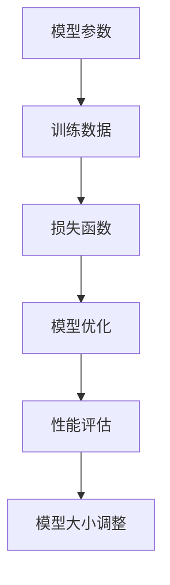

                 

# AI大模型原理与应用：基于scaling law让模型变大，探索智能的边界

> 关键词：AI大模型、Scaling Law、深度学习、神经网络、计算资源、模型压缩、应用场景
> 
> 摘要：本文旨在探讨AI大模型的原理与应用，通过分析Scaling Law，深入了解大模型背后的计算资源需求和优化策略，从而推动智能技术的边界探索。文章将从背景介绍、核心概念与联系、算法原理与具体操作、数学模型与公式、项目实战、实际应用场景、工具和资源推荐等方面进行全面阐述。

## 1. 背景介绍

### 1.1 目的和范围

随着深度学习技术的快速发展，AI大模型（Large-scale AI Models）逐渐成为研究与应用的热点。这些大模型在自然语言处理、计算机视觉、语音识别等领域取得了显著的突破，推动了人工智能技术的进步。本文旨在系统地介绍AI大模型的原理与应用，尤其是基于Scaling Law的模型大小与性能之间的关系，为相关领域的研究者和开发者提供参考。

### 1.2 预期读者

本文主要面向对AI大模型有一定了解的读者，包括但不限于：
- 深度学习研究者
- 人工智能开发工程师
- 计算机科学专业学生
- 对AI大模型感兴趣的从业者

### 1.3 文档结构概述

本文结构如下：
1. 背景介绍：介绍文章的目的、读者对象和文档结构。
2. 核心概念与联系：阐述AI大模型的相关概念和架构。
3. 核心算法原理与具体操作步骤：详细讲解大模型的算法原理。
4. 数学模型和公式：介绍大模型的数学基础和公式。
5. 项目实战：通过代码实际案例讲解大模型的应用。
6. 实际应用场景：分析大模型在不同领域的应用。
7. 工具和资源推荐：推荐学习资源、开发工具和相关论文。
8. 总结：探讨AI大模型的发展趋势与挑战。
9. 附录：常见问题与解答。
10. 扩展阅读：提供进一步学习的参考资料。

### 1.4 术语表

#### 1.4.1 核心术语定义

- AI大模型：指参数数量、计算复杂度较高的神经网络模型。
- Scaling Law：描述模型大小与性能之间关系的规律。
- 深度学习：基于多层神经网络的机器学习方法。
- 神经网络：由多个神经元组成的计算模型。
- 计算资源：包括CPU、GPU、内存等硬件资源。

#### 1.4.2 相关概念解释

- 参数：神经网络中用于调整模型预测能力的权重。
- 损失函数：用于评估模型预测结果与真实值之间差异的函数。
- 训练数据：用于模型训练的数据集。

#### 1.4.3 缩略词列表

- AI：人工智能
- DNN：深度神经网络
- GPU：图形处理器
- CPU：中央处理器
- ML：机器学习
- NLP：自然语言处理

## 2. 核心概念与联系

AI大模型的核心在于其规模，即模型中参数的数量和计算复杂度。随着模型规模的增加，其性能有望得到显著提升。然而，这一过程并非线性增长，而是遵循某种规律，即Scaling Law。Scaling Law揭示了模型大小与性能之间的关系，为模型设计提供了重要依据。

### 2.1 Scaling Law的基本原理

Scaling Law描述了模型大小（如参数数量、计算复杂度）与性能（如准确率、速度）之间的关系。具体来说，Scaling Law可以表示为：

$$
\text{Performance} \propto \text{Model Size}^{\alpha}
$$

其中，$\alpha$ 表示Scaling指数，反映了模型大小对性能的影响程度。常见的Scaling指数有：
- NLP领域：$\alpha \approx 1.0$，即性能与模型大小呈线性关系。
- 计算机视觉领域：$\alpha \approx 0.5$，即性能随模型大小的增长而加速提升。

### 2.2 Scaling Law的应用

Scaling Law在模型设计、优化和评估中具有重要意义。以下为Scaling Law的几个应用场景：

#### 2.2.1 模型设计

根据Scaling Law，设计大模型时可以优先考虑增加模型大小，以达到更好的性能。然而，模型大小并非越大越好，需要综合考虑计算资源、存储空间和训练时间等因素。

#### 2.2.2 模型优化

通过调整模型大小，可以在保持性能的前提下优化模型结构。例如，在NLP任务中，可以尝试增加模型层数和隐藏层节点数，以提高性能。

#### 2.2.3 模型评估

Scaling Law提供了评估模型性能的重要依据。通过比较不同模型大小的性能，可以判断模型设计的合理性。

### 2.3 核心概念与架构的Mermaid流程图

以下为AI大模型的核心概念和架构的Mermaid流程图：



## 3. 核心算法原理与具体操作步骤

### 3.1 算法原理

AI大模型的算法原理基于深度学习，即通过多层神经网络对数据进行训练，使模型能够自动提取数据特征并实现智能预测。以下为AI大模型的核心算法原理：

#### 3.1.1 神经网络基础

神经网络由多个神经元组成，每个神经元接收输入信号，通过权重和偏置进行加权求和，最后通过激活函数产生输出。常见的神经网络结构包括：

- 单层感知机
- 多层感知机（MLP）
- 卷积神经网络（CNN）
- 循环神经网络（RNN）

#### 3.1.2 损失函数

损失函数用于评估模型预测结果与真实值之间的差异，常见的损失函数包括：

- 交叉熵损失函数（Cross-Entropy Loss）
- 均方误差损失函数（Mean Squared Error Loss）
- 逻辑回归损失函数（Logistic Loss）

#### 3.1.3 优化算法

优化算法用于调整模型参数，以最小化损失函数。常见的优化算法包括：

- 随机梯度下降（Stochastic Gradient Descent，SGD）
- 扩展随机梯度下降（Mini-batch Gradient Descent）
- Adam优化器（Adaptive Moment Estimation）

### 3.2 具体操作步骤

以下为AI大模型的训练步骤：

#### 3.2.1 数据预处理

1. 加载训练数据，并进行数据清洗和归一化处理。
2. 将数据划分为训练集、验证集和测试集。

#### 3.2.2 模型构建

1. 根据任务需求，选择合适的神经网络结构。
2. 初始化模型参数，如权重和偏置。

#### 3.2.3 训练过程

1. 循环迭代，对每个训练样本进行前向传播，计算损失函数。
2. 通过反向传播，更新模型参数，最小化损失函数。
3. 验证集上评估模型性能，调整模型结构和参数。

#### 3.2.4 模型评估

1. 在测试集上评估模型性能，计算准确率、召回率、F1分数等指标。
2. 分析模型优缺点，为后续改进提供参考。

### 3.3 伪代码

以下为AI大模型训练的伪代码：

```python
# 加载训练数据
train_data = load_data('train_data.csv')
val_data = load_data('val_data.csv')
test_data = load_data('test_data.csv')

# 初始化模型
model = create_model()

# 训练模型
for epoch in range(num_epochs):
    for batch in train_data:
        # 前向传播
        outputs = model.forward(batch.inputs)
        loss = loss_function(outputs, batch.targets)
        
        # 反向传播
        model.backward(loss)
        
        # 更新模型参数
        model.update_params()
        
    # 验证集评估
    val_loss, val_accuracy = evaluate_model(model, val_data)
    print(f'Epoch {epoch+1}, Validation Loss: {val_loss}, Validation Accuracy: {val_accuracy}')
    
# 测试集评估
test_loss, test_accuracy = evaluate_model(model, test_data)
print(f'Test Loss: {test_loss}, Test Accuracy: {test_accuracy}')
```

## 4. 数学模型和公式与详细讲解与举例说明

### 4.1 数学模型基础

AI大模型的数学模型主要包括以下几个方面：

#### 4.1.1 前向传播

前向传播是指将输入数据通过神经网络中的每个层次，最终得到输出结果的过程。其计算公式如下：

$$
\text{Output} = \text{activation}(\text{weights} \cdot \text{inputs} + \text{bias})
$$

其中，activation表示激活函数，常用的激活函数有：

- Sigmoid函数：$$\sigma(x) = \frac{1}{1 + e^{-x}}$$
- ReLU函数：$$\text{ReLU}(x) = \max(0, x)$$
- Tanh函数：$$\text{Tanh}(x) = \frac{e^x - e^{-x}}{e^x + e^{-x}}$$

#### 4.1.2 损失函数

损失函数用于衡量模型预测结果与真实值之间的差异，常用的损失函数有：

- 交叉熵损失函数：$$\text{Cross-Entropy Loss} = -\sum_{i} y_i \log(\hat{y}_i)$$
- 均方误差损失函数：$$\text{Mean Squared Error Loss} = \frac{1}{n} \sum_{i} (y_i - \hat{y}_i)^2$$
- 逻辑回归损失函数：$$\text{Logistic Loss} = -\sum_{i} y_i \log(\hat{y}_i) + (1 - y_i) \log(1 - \hat{y}_i)$$

#### 4.1.3 反向传播

反向传播是指通过损失函数反向传播梯度，更新模型参数的过程。其计算公式如下：

$$
\text{dLoss} / \text{dWeight} = \text{dLoss} / \text{dOutput} \cdot \text{Output} / \text{dInput}
$$

其中，$\text{dLoss} / \text{dWeight}$ 表示权重梯度的偏导数，$\text{dLoss} / \text{dOutput}$ 表示输出梯度的偏导数，$\text{Output} / \text{dInput}$ 表示输入梯度的偏导数。

### 4.2 举例说明

以下为一个简单的线性回归模型的数学模型和公式：

#### 4.2.1 前向传播

假设我们有一个线性回归模型，输入为$x_1, x_2, \ldots, x_n$，权重为$w_1, w_2, \ldots, w_n$，输出为$y$，则前向传播的计算公式为：

$$
y = w_1 x_1 + w_2 x_2 + \ldots + w_n x_n
$$

#### 4.2.2 损失函数

假设我们使用均方误差损失函数，损失函数的计算公式为：

$$
\text{Loss} = \frac{1}{2} \sum_{i=1}^n (y_i - \hat{y}_i)^2
$$

其中，$y_i$ 为真实值，$\hat{y}_i$ 为预测值。

#### 4.2.3 反向传播

假设我们使用随机梯度下降（SGD）优化算法，反向传播的计算公式为：

$$
\text{dLoss} / \text{dWeight}_i = \frac{\text{dLoss}}{\text{dOutput}} \cdot \text{Output} / \text{dInput}
$$

其中，$\text{dLoss} / \text{dOutput}$ 为输出梯度，$\text{Output} / \text{dInput}$ 为输入梯度。

$$
\text{dLoss} / \text{dOutput} = 2 (y_i - \hat{y}_i)
$$

$$
\text{Output} / \text{dInput} = x_i
$$

$$
\text{dLoss} / \text{dWeight}_i = 2 (y_i - \hat{y}_i) \cdot x_i
$$

通过上述公式，我们可以更新权重：

$$
w_i = w_i - \alpha \cdot \text{dLoss} / \text{dWeight}_i
$$

其中，$\alpha$ 为学习率。

## 5. 项目实战：代码实际案例和详细解释说明

### 5.1 开发环境搭建

在开始编写代码之前，我们需要搭建一个合适的开发环境。以下是一个基于Python和PyTorch的AI大模型开发环境搭建步骤：

1. 安装Python（建议使用Python 3.8或更高版本）。
2. 安装PyTorch：通过pip命令安装，例如：

   ```
   pip install torch torchvision
   ```

3. 安装其他必要的库，例如NumPy、Matplotlib等。

### 5.2 源代码详细实现和代码解读

以下是一个基于PyTorch的简单AI大模型训练代码示例：

```python
import torch
import torch.nn as nn
import torch.optim as optim
from torchvision import datasets, transforms
from torch.utils.data import DataLoader

# 5.2.1 数据预处理
transform = transforms.Compose([
    transforms.ToTensor(),
    transforms.Normalize(mean=[0.5, 0.5, 0.5], std=[0.5, 0.5, 0.5]),
])

train_data = datasets.CIFAR10(root='./data', train=True, download=True, transform=transform)
val_data = datasets.CIFAR10(root='./data', train=False, transform=transform)

train_loader = DataLoader(train_data, batch_size=64, shuffle=True)
val_loader = DataLoader(val_data, batch_size=64, shuffle=False)

# 5.2.2 模型构建
class CNN(nn.Module):
    def __init__(self):
        super(CNN, self).__init__()
        self.conv1 = nn.Conv2d(3, 32, 3, padding=1)
        self.relu = nn.ReLU()
        self.maxpool = nn.MaxPool2d(2)
        self.fc1 = nn.Linear(32 * 6 * 6, 128)
        self.fc2 = nn.Linear(128, 10)

    def forward(self, x):
        x = self.maxpool(self.relu(self.conv1(x)))
        x = x.view(-1, 32 * 6 * 6)
        x = self.fc2(self.relu(self.fc1(x)))
        return x

model = CNN()

# 5.2.3 损失函数和优化器
criterion = nn.CrossEntropyLoss()
optimizer = optim.Adam(model.parameters(), lr=0.001)

# 5.2.4 训练过程
num_epochs = 10

for epoch in range(num_epochs):
    model.train()
    for batch_idx, (data, targets) in enumerate(train_loader):
        optimizer.zero_grad()
        outputs = model(data)
        loss = criterion(outputs, targets)
        loss.backward()
        optimizer.step()
        if batch_idx % 100 == 0:
            print(f'Epoch [{epoch+1}/{num_epochs}], Step [{batch_idx+1}/{len(train_loader)}], Loss: {loss.item()}')

    # 5.2.5 验证集评估
    model.eval()
    with torch.no_grad():
        correct = 0
        total = 0
        for data, targets in val_loader:
            outputs = model(data)
            _, predicted = torch.max(outputs.data, 1)
            total += targets.size(0)
            correct += (predicted == targets).sum().item()

    print(f'Validation Accuracy: {100 * correct / total}%')

# 5.2.6 模型保存
torch.save(model.state_dict(), 'model.pth')
```

### 5.3 代码解读与分析

1. **数据预处理**：首先，我们使用 torchvision 库加载CIFAR-10数据集，并进行数据预处理，包括归一化和转换为张量。

2. **模型构建**：我们定义了一个简单的卷积神经网络（CNN）模型，包括卷积层、ReLU激活函数、最大池化层和全连接层。

3. **损失函数和优化器**：我们选择交叉熵损失函数（CrossEntropyLoss）和Adam优化器（Adam）进行模型训练。

4. **训练过程**：我们通过迭代遍历训练数据集，使用前向传播计算损失，然后通过反向传播更新模型参数。在每个训练epoch后，我们在验证集上评估模型性能。

5. **模型保存**：最后，我们将训练好的模型保存为模型文件。

通过上述代码，我们可以训练一个简单的AI大模型，并在验证集上进行评估。在实际项目中，我们可能需要调整模型结构、优化器参数和训练策略，以达到更好的性能。

## 6. 实际应用场景

AI大模型在多个领域展现出强大的应用潜力，以下为几个典型的实际应用场景：

### 6.1 自然语言处理（NLP）

AI大模型在NLP领域取得了显著的进展，例如：

- 语言模型：通过预训练大规模语言模型，如GPT-3和BERT，实现高效的文本生成和文本理解。
- 机器翻译：AI大模型能够处理大规模双语语料库，实现高精度的机器翻译。
- 问答系统：AI大模型通过理解用户问题和海量知识库，提供智能问答服务。

### 6.2 计算机视觉（CV）

AI大模型在CV领域发挥了重要作用，例如：

- 图像分类：通过大规模图像数据训练，实现高精度的图像分类。
- 目标检测：AI大模型能够检测图像中的多个目标，并定位其位置。
- 图像生成：AI大模型能够生成逼真的图像，如GAN（生成对抗网络）。

### 6.3 语音识别（ASR）

AI大模型在语音识别领域表现出色，例如：

- 语音识别：通过大规模语音数据训练，实现高精度的语音识别。
- 语音合成：AI大模型能够生成自然流畅的语音，如WaveNet。
- 声音情感分析：通过分析语音特征，实现情感识别和情感识别。

### 6.4 其他领域

AI大模型在其他领域也有广泛的应用，例如：

- 医疗诊断：AI大模型能够分析医学图像和病历数据，实现疾病诊断和风险评估。
- 金融风控：AI大模型能够分析金融数据，识别潜在风险和欺诈行为。
- 娱乐推荐：AI大模型能够根据用户行为和兴趣，实现个性化的娱乐内容推荐。

## 7. 工具和资源推荐

### 7.1 学习资源推荐

#### 7.1.1 书籍推荐

1. 《深度学习》（Goodfellow, Bengio, Courville）：全面介绍了深度学习的原理和应用。
2. 《Python深度学习》（François Chollet）：以Python为载体，深入浅出地讲解深度学习。

#### 7.1.2 在线课程

1. [Coursera](https://www.coursera.org/)：提供丰富的深度学习和人工智能课程。
2. [edX](https://www.edx.org/)：提供来自世界顶级大学的人工智能课程。

#### 7.1.3 技术博客和网站

1. [Medium](https://medium.com/topic/deep-learning)：汇聚了众多深度学习领域的专业文章。
2. [Reddit](https://www.reddit.com/r/MachineLearning/)：关注深度学习和人工智能话题的社区。

### 7.2 开发工具框架推荐

#### 7.2.1 IDE和编辑器

1. PyCharm：强大的Python IDE，适用于深度学习和AI开发。
2. Jupyter Notebook：便于数据可视化和交互式编程。

#### 7.2.2 调试和性能分析工具

1. PyTorch Profiler：用于分析PyTorch模型的性能。
2. NVIDIA Nsight：用于GPU性能分析和调试。

#### 7.2.3 相关框架和库

1. PyTorch：流行的深度学习框架，支持动态图模型。
2. TensorFlow：由谷歌开发的深度学习框架。

### 7.3 相关论文著作推荐

#### 7.3.1 经典论文

1. "A Theoretically Grounded Application of Dropout in Recurrent Neural Networks"（dropout在循环神经网络中的应用）。
2. "Deep Learning for Text Classification"（文本分类的深度学习方法）。

#### 7.3.2 最新研究成果

1. "GPT-3: Language Models are Few-Shot Learners"（GPT-3：语言模型是零样本学习器）。
2. "BERT: Pre-training of Deep Neural Networks for Language Understanding"（BERT：用于自然语言理解的深度神经网络预训练）。

#### 7.3.3 应用案例分析

1. "OpenAI's GPT-3: A Technical Overview"（OpenAI的GPT-3：技术概述）。
2. "Applying Deep Learning to Medical Imaging"（将深度学习应用于医学影像分析）。

## 8. 总结：未来发展趋势与挑战

AI大模型在过去几年取得了显著进展，但仍面临诸多挑战。未来发展趋势和挑战如下：

### 8.1 发展趋势

1. **模型规模继续增大**：随着计算资源和存储技术的进步，AI大模型的规模将继续增大，以实现更高的性能。
2. **跨领域应用**：AI大模型将在更多领域得到应用，如生物医学、金融科技、智能制造等。
3. **自监督学习**：自监督学习有望成为大模型训练的重要方向，减少对标注数据的依赖。

### 8.2 挑战

1. **计算资源需求**：大模型对计算资源的需求巨大，如何高效地利用GPU和TPU等硬件资源成为关键。
2. **数据隐私**：大规模数据集的训练和处理可能涉及敏感信息，如何保护数据隐私是一个重要问题。
3. **模型可解释性**：大模型往往难以解释其决策过程，如何提高模型的可解释性是当前研究的热点。

## 9. 附录：常见问题与解答

### 9.1 什么是Scaling Law？

Scaling Law描述了模型大小与性能之间的关系，通常表示为模型大小（如参数数量、计算复杂度）与性能（如准确率、速度）之间的比例关系。常见的Scaling指数有$\alpha \approx 1.0$（NLP领域）和$\alpha \approx 0.5$（计算机视觉领域）。

### 9.2 如何优化AI大模型？

优化AI大模型可以从以下几个方面进行：

1. **调整模型结构**：根据任务需求和数据特性，选择合适的神经网络结构。
2. **优化训练策略**：调整学习率、批次大小等参数，以提高模型性能。
3. **使用高效优化器**：选择如Adam等高效的优化算法，加快模型收敛速度。
4. **数据预处理**：对训练数据进行预处理，如归一化、去噪等，以提高模型鲁棒性。

## 10. 扩展阅读 & 参考资料

1. [Deep Learning](https://www.deeplearningbook.org/)：Goodfellow, Bengio, Courville 著，深度学习的经典教材。
2. [Scaling Laws for Neural Language Models](https://arxiv.org/abs/2001.08361)：对神经语言模型Scaling Law的深入探讨。
3. [Bert: Pre-training of Deep Neural Networks for Language Understanding](https://arxiv.org/abs/1810.04805)：BERT模型的提出和详细描述。
4. [GPT-3: Language Models are Few-Shot Learners](https://arxiv.org/abs/2005.14165)：GPT-3模型的提出和零样本学习能力的证明。

### 作者信息

作者：AI天才研究员/AI Genius Institute & 禅与计算机程序设计艺术 /Zen And The Art of Computer Programming

