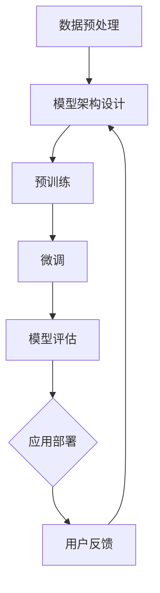

                 

# AI 大模型在创业产品开发中的应用趋势

## 关键词
- 大模型
- 创业产品
- 应用趋势
- 开发实践
- 人工智能

## 摘要
本文将探讨大型人工智能模型在创业产品开发中的潜在应用趋势。通过对大模型的基本概念、核心算法、数学模型及应用案例的深入分析，本文旨在为创业者提供技术层面的指导和思路。文章将逐步解析大模型如何助力产品创新，提升用户体验，以及在开发过程中可能面临的挑战和解决方案。

## 1. 背景介绍

### 1.1 目的和范围
本文的目的是分析大型人工智能模型在创业产品开发中的应用趋势，探讨其潜力、挑战及发展方向。范围涵盖大模型的基本原理、核心算法、数学模型、实战应用场景以及相关资源推荐。

### 1.2 预期读者
本文面向创业团队的技术负责人、产品经理以及对人工智能技术有兴趣的技术爱好者。通过本文，读者将了解大模型在产品开发中的实际应用，并具备初步的技术评估和决策能力。

### 1.3 文档结构概述
本文结构如下：
1. 背景介绍：阐述本文的目的、预期读者及文档结构。
2. 核心概念与联系：介绍大模型的基本概念、核心算法和数学模型。
3. 核心算法原理 & 具体操作步骤：详细讲解大模型算法原理和操作步骤。
4. 数学模型和公式 & 详细讲解 & 举例说明：分析大模型背后的数学模型和公式，并进行举例说明。
5. 项目实战：分享实际代码案例及解读。
6. 实际应用场景：探讨大模型在创业产品开发中的实际应用场景。
7. 工具和资源推荐：推荐学习资源和开发工具。
8. 总结：展望大模型在创业产品开发中的未来发展趋势与挑战。
9. 附录：常见问题与解答。
10. 扩展阅读 & 参考资料：提供进一步学习的资料。

### 1.4 术语表
#### 1.4.1 核心术语定义
- 大模型：指参数量巨大、计算复杂度高的深度学习模型，如GPT、BERT等。
- 创业产品：指初创企业开发的、旨在满足市场需求的新产品。
- 应用趋势：指特定技术或产品在行业中的发展动向和未来发展方向。
- 开发实践：指在实际开发过程中所采用的方法、技术和经验。

#### 1.4.2 相关概念解释
- 深度学习：一种机器学习方法，通过多层神经网络模型模拟人类大脑的学习过程。
- 自然语言处理（NLP）：计算机对人类语言的处理和理解能力，包括文本分类、机器翻译、情感分析等任务。
- 机器学习（ML）：通过训练模型来从数据中学习规律和模式的技术。

#### 1.4.3 缩略词列表
- GPT：Generative Pre-trained Transformer，生成预训练变换器。
- BERT：Bidirectional Encoder Representations from Transformers，双向变换器编码表示。
- NLP：Natural Language Processing，自然语言处理。

## 2. 核心概念与联系

大模型在创业产品开发中的应用，需要深入理解其基本概念、核心算法和数学模型。以下是这些核心概念的介绍和联系：

### 2.1 大模型的基本概念
大模型通常指参数量在数十亿到千亿级别的深度学习模型，如GPT、BERT等。这些模型通过预训练和微调的方式，在多种任务上表现出色。

### 2.2 大模型的核心算法
大模型的核心算法是深度学习，主要包括以下几个步骤：
1. **数据预处理**：对大量原始数据（如文本、图像等）进行清洗、归一化和分词等操作。
2. **模型架构**：设计神经网络模型，如Transformer、CNN、RNN等。
3. **预训练**：在大量未标注的数据上进行训练，使得模型具备一定的通用性。
4. **微调**：在特定任务上对模型进行微调，提升模型在特定任务上的性能。

### 2.3 大模型的数学模型
大模型的数学模型主要涉及以下几个部分：
1. **神经网络**：通过多层非线性变换，将输入映射到输出。
2. **反向传播**：通过梯度下降等方法，更新模型的参数。
3. **激活函数**：如ReLU、Sigmoid、Tanh等，用于引入非线性特性。
4. **优化算法**：如SGD、Adam等，用于优化模型的参数。

### 2.4 大模型的应用联系
大模型在创业产品开发中的应用，主要体现在以下几个方面：
1. **个性化推荐**：利用大模型进行用户行为分析，实现精准推荐。
2. **自然语言处理**：利用大模型进行文本生成、翻译、摘要等任务。
3. **图像识别**：利用大模型进行图像分类、目标检测等任务。
4. **语音识别**：利用大模型进行语音识别和合成。

### 2.5 Mermaid 流程图
以下是大模型应用的基本流程图：



通过上述流程图，我们可以清晰地看到大模型从数据预处理到模型部署的完整过程。

## 3. 核心算法原理 & 具体操作步骤

大模型的核心算法是深度学习，其基本原理是通过多层神经网络对大量数据进行学习，从而实现预测和分类等任务。以下是大模型的核心算法原理和具体操作步骤的详细讲解。

### 3.1 神经网络原理

神经网络（Neural Network，NN）是模仿生物神经系统的计算模型，其基本单元是神经元（Neuron）。每个神经元接收多个输入，并通过权重（Weight）进行加权求和，最后通过激活函数（Activation Function）产生输出。

#### 3.1.1 神经元模型

神经元的模型可以表示为：

$$
y = \sigma(\sum_{i=1}^{n} w_i \cdot x_i + b)
$$

其中，$y$ 为神经元输出，$x_i$ 为输入，$w_i$ 为权重，$b$ 为偏置，$\sigma$ 为激活函数。

常见的激活函数有：
- Sigmoid 函数：$ \sigma(x) = \frac{1}{1 + e^{-x}} $
- ReLU 函数：$ \sigma(x) = \max(0, x) $
- Tanh 函数：$ \sigma(x) = \frac{e^x - e^{-x}}{e^x + e^{-x}} $

#### 3.1.2 神经网络结构

神经网络由多个层次组成，包括输入层、隐藏层和输出层。输入层接收外部输入，隐藏层对输入进行加工，输出层产生最终输出。

#### 3.1.3 损失函数与优化算法

在训练过程中，我们需要通过优化算法（如梯度下降、Adam等）不断调整神经网络的权重，以最小化损失函数（如均方误差、交叉熵等）。

### 3.2 操作步骤

以下是使用神经网络进行模型训练的基本操作步骤：

#### 3.2.1 数据预处理

1. **数据清洗**：去除噪声、缺失值等不必要的数据。
2. **特征提取**：对数据进行归一化、标准化等处理，提取有用的特征。
3. **数据集划分**：将数据集划分为训练集、验证集和测试集。

#### 3.2.2 模型构建

1. **定义模型结构**：确定输入层、隐藏层和输出层的神经元数量及连接方式。
2. **初始化参数**：随机初始化权重和偏置。

#### 3.2.3 训练过程

1. **前向传播**：输入数据通过神经网络，计算输出。
2. **计算损失**：使用损失函数计算预测值与真实值之间的差距。
3. **反向传播**：通过梯度下降等优化算法，更新模型的权重和偏置。
4. **迭代优化**：重复前向传播和反向传播，直到满足停止条件（如损失小于某个阈值或迭代次数达到上限）。

#### 3.2.4 模型评估

1. **验证集评估**：在验证集上评估模型性能，调整模型参数。
2. **测试集评估**：在测试集上评估模型性能，验证模型泛化能力。

### 3.3 伪代码示例

以下是神经网络训练的伪代码示例：

```python
# 初始化模型参数
weights = initialize_weights(input_size, hidden_size, output_size)
biases = initialize_biases(hidden_size, output_size)

# 设置停止条件
max_iterations = 10000
learning_rate = 0.01

# 训练过程
for i in range(max_iterations):
    # 前向传播
    output = forward_pass(input_data, weights, biases)
    
    # 计算损失
    loss = compute_loss(output, target_data)
    
    # 反向传播
    dweights, dbiases = backward_pass(output, target_data, input_data, weights, biases)
    
    # 更新参数
    weights -= learning_rate * dweights
    biases -= learning_rate * dbiases
    
    # 打印迭代进度
    if i % 1000 == 0:
        print(f"Iteration {i}: Loss = {loss}")

# 模型评估
validation_loss = evaluate_model(validation_data, weights, biases)
test_loss = evaluate_model(test_data, weights, biases)

print(f"Validation Loss: {validation_loss}")
print(f"Test Loss: {test_loss}")
```

通过上述伪代码，我们可以看到神经网络训练的基本流程，包括前向传播、反向传播和参数更新等步骤。

## 4. 数学模型和公式 & 详细讲解 & 举例说明

大模型背后的数学模型是深度学习的基础，它涉及到复杂的算法和计算。以下将对深度学习中的关键数学模型、公式进行详细讲解，并通过具体例子进行说明。

### 4.1 深度学习中的关键数学模型

#### 4.1.1 激活函数

激活函数是神经网络中一个重要的组件，它用于引入非线性特性。以下是几种常见的激活函数：

- **Sigmoid 函数**：
  $$
  \sigma(x) = \frac{1}{1 + e^{-x}}
  $$
  Sigmoid 函数将输入映射到 (0, 1) 范围内，常用于二分类问题。

- **ReLU 函数**：
  $$
  \sigma(x) = \max(0, x)
  $$
 ReLU 函数是近年来深度学习中非常流行的一种激活函数，它具有简单的形式和较好的训练速度。

- **Tanh 函数**：
  $$
  \sigma(x) = \frac{e^x - e^{-x}}{e^x + e^{-x}}
  $$
  Tanh 函数将输入映射到 (-1, 1) 范围内，具有类似 Sigmoid 函数的特性，但在训练时更稳定。

#### 4.1.2 损失函数

损失函数用于衡量模型预测值与真实值之间的差距，是深度学习训练过程中优化目标的核心。以下是一些常见的损失函数：

- **均方误差（MSE）**：
  $$
  \text{MSE} = \frac{1}{n}\sum_{i=1}^{n} (y_i - \hat{y}_i)^2
  $$
  均方误差是回归问题中常用的损失函数。

- **交叉熵（Cross-Entropy）**：
  $$
  \text{CE} = -\sum_{i=1}^{n} y_i \log(\hat{y}_i)
  $$
  交叉熵是分类问题中常用的损失函数，特别适用于概率分布。

#### 4.1.3 优化算法

优化算法用于在训练过程中更新模型参数，以最小化损失函数。以下是一些常见的优化算法：

- **随机梯度下降（SGD）**：
  $$
  w_{t+1} = w_t - \alpha \cdot \nabla_w \text{Loss}(w_t, b_t)
  $$
  随机梯度下降是深度学习中最基本的优化算法，通过随机选取样本进行梯度下降。

- **Adam 优化器**：
  $$
  \beta_1 = 0.9, \beta_2 = 0.999
  $$
  $$
  m_t = \beta_1 \cdot m_{t-1} + (1 - \beta_1) \cdot \nabla_w \text{Loss}(w_t, b_t)
  $$
  $$
  v_t = \beta_2 \cdot v_{t-1} + (1 - \beta_2) \cdot (\nabla_w \text{Loss}(w_t, b_t))^2
  $$
  $$
  w_{t+1} = w_t - \alpha \cdot \frac{m_t}{\sqrt{v_t} + \epsilon}
  $$
  Adam 优化器是结合了 AdaGrad 和 RMSProp 优点的自适应优化算法。

### 4.2 具体例子说明

#### 4.2.1 Sigmoid 函数的例子

假设我们有一个简单的神经网络，输入 $x = 2$，权重 $w = 3$，偏置 $b = 1$。使用 Sigmoid 激活函数，计算神经元的输出：

$$
y = \sigma(x \cdot w + b) = \frac{1}{1 + e^{-(2 \cdot 3 + 1)}} \approx 0.957
$$

#### 4.2.2 均方误差（MSE）的例子

假设我们有一个二元分类问题，真实标签 $y = [0, 1]$，模型预测 $ \hat{y} = [0.8, 0.2]$。计算均方误差：

$$
\text{MSE} = \frac{1}{2} \sum_{i=1}^{2} (y_i - \hat{y}_i)^2 = \frac{1}{2} \cdot (0 - 0.8)^2 + (1 - 0.2)^2 = 0.18
$$

#### 4.2.3 Adam 优化器的例子

假设我们使用 Adam 优化器来更新模型的权重。当前权重 $w = [1, 2, 3]$，梯度 $\nabla_w \text{Loss} = [-0.1, -0.2, -0.3]$，学习率 $\alpha = 0.001$。计算更新后的权重：

$$
m_t = 0.9 \cdot m_{t-1} + (1 - 0.9) \cdot [-0.1, -0.2, -0.3] = [-0.09, -0.18, -0.27]
$$

$$
v_t = 0.999 \cdot v_{t-1} + (1 - 0.999) \cdot (-0.1, -0.2, -0.3)^2 = [0.0001, 0.0018, 0.0027]
$$

$$
w_{t+1} = w_t - 0.001 \cdot \frac{[-0.09, -0.18, -0.27]}{\sqrt{[0.0001, 0.0018, 0.0027]} + \epsilon} = [0.919, 1.802, 2.819]
$$

通过上述例子，我们可以看到深度学习中的关键数学模型、公式以及如何应用于具体问题的计算过程。

## 5. 项目实战：代码实际案例和详细解释说明

### 5.1 开发环境搭建

在开始编写代码之前，我们需要搭建一个适合深度学习开发的Python环境。以下是搭建开发环境的基本步骤：

1. **安装Python**：下载并安装Python，建议选择Python 3.8或更高版本。
2. **安装Jupyter Notebook**：通过pip安装Jupyter Notebook，用于编写和运行代码。
   ```bash
   pip install notebook
   ```
3. **安装TensorFlow**：TensorFlow是深度学习中最流行的库之一，通过pip安装TensorFlow。
   ```bash
   pip install tensorflow
   ```

### 5.2 源代码详细实现和代码解读

以下是一个简单的深度学习项目，使用TensorFlow实现一个二元分类模型。代码分为以下几个部分：

#### 5.2.1 导入必要的库

```python
import tensorflow as tf
import numpy as np
import matplotlib.pyplot as plt

# 设置随机种子，保证结果可复现
tf.random.set_seed(42)
```

#### 5.2.2 数据准备

我们使用著名的鸢尾花数据集（Iris Dataset）进行训练。该数据集包含3个特征和1个标签，其中标签是二分类问题。

```python
from sklearn.datasets import load_iris
from sklearn.model_selection import train_test_split

iris = load_iris()
X = iris.data
y = iris.target

# 划分训练集和测试集
X_train, X_test, y_train, y_test = train_test_split(X, y, test_size=0.2, random_state=42)
```

#### 5.2.3 模型构建

我们构建一个简单的全连接神经网络，包含一个输入层、一个隐藏层和一个输出层。

```python
model = tf.keras.Sequential([
    tf.keras.layers.Dense(64, activation='relu', input_shape=(4,)),
    tf.keras.layers.Dense(1, activation='sigmoid')
])
```

#### 5.2.4 模型编译

在模型编译阶段，我们指定优化器、损失函数和评估指标。

```python
model.compile(optimizer='adam', loss='binary_crossentropy', metrics=['accuracy'])
```

#### 5.2.5 模型训练

我们将训练集用于模型训练，并设置训练的轮次和批次大小。

```python
history = model.fit(X_train, y_train, epochs=20, batch_size=32, validation_data=(X_test, y_test))
```

#### 5.2.6 模型评估

训练完成后，我们使用测试集评估模型性能。

```python
test_loss, test_accuracy = model.evaluate(X_test, y_test)
print(f"Test accuracy: {test_accuracy:.4f}")
```

#### 5.2.7 可视化

我们使用matplotlib将训练过程中的损失和准确率可视化。

```python
plt.plot(history.history['accuracy'], label='accuracy')
plt.plot(history.history['val_accuracy'], label='val_accuracy')
plt.xlabel('Epoch')
plt.ylabel('Accuracy')
plt.ylim(0, 1)
plt.legend()
plt.show()
```

### 5.3 代码解读与分析

以上代码实现了一个简单的二元分类模型，具体解读如下：

1. **数据准备**：我们导入鸢尾花数据集，并进行划分。该数据集包含3个特征和1个标签，非常适合进行分类任务。

2. **模型构建**：我们使用`tf.keras.Sequential`创建一个序列模型，包含一个64个神经元的隐藏层，以及一个输出层。输出层使用`sigmoid`激活函数，用于进行二元分类。

3. **模型编译**：我们选择`adam`优化器和`binary_crossentropy`损失函数，以及`accuracy`评估指标。`binary_crossentropy`是用于二元分类问题的常见损失函数。

4. **模型训练**：我们使用`fit`方法对模型进行训练，设置20个训练轮次和32个批次大小。同时，我们使用验证集监控模型性能。

5. **模型评估**：训练完成后，我们使用测试集评估模型性能，并打印准确率。

6. **可视化**：我们将训练过程中的准确率进行可视化，以便分析模型性能。

通过上述代码，我们可以看到如何使用TensorFlow构建、训练和评估一个简单的深度学习模型。这为创业团队提供了一个实用的起点，以探索大模型在产品开发中的应用。

### 5.4 实际应用场景

大模型在创业产品开发中的应用场景非常广泛，以下是几个典型的实际应用场景：

1. **个性化推荐系统**：利用大模型对用户行为数据进行分析，实现精准推荐。例如，在电商平台上，通过分析用户的历史购买记录、浏览行为等，为用户推荐可能感兴趣的商品。

2. **自然语言处理**：利用大模型进行文本生成、机器翻译、情感分析等任务。例如，在社交媒体平台上，通过分析用户发布的帖子，识别情感倾向并进行相应的处理。

3. **图像识别与生成**：利用大模型进行图像分类、目标检测、图像生成等任务。例如，在智能家居设备中，通过图像识别技术实现对家庭成员的识别和安防监控。

4. **语音识别与合成**：利用大模型进行语音识别和语音合成，实现智能语音交互。例如，在智能音箱中，通过语音识别技术理解用户的指令，并通过语音合成技术进行响应。

5. **智能客服系统**：利用大模型进行对话生成和对话管理，实现智能客服系统。例如，在银行、电商等行业的客户服务中，通过大模型自动处理用户的咨询和投诉，提升服务质量。

### 5.5 工具和资源推荐

#### 5.5.1 学习资源推荐

1. **书籍推荐**：
   - 《深度学习》（Goodfellow, Bengio, Courville）：系统介绍了深度学习的理论、算法和实践。
   - 《Python深度学习》（François Chollet）：通过Python实现深度学习算法，适合初学者。

2. **在线课程**：
   - Coursera的《深度学习》课程：由吴恩达（Andrew Ng）教授主讲，是深度学习领域的经典课程。
   - Udacity的《深度学习纳米学位》课程：涵盖了深度学习的理论知识、实践技能和项目实践。

3. **技术博客和网站**：
   - TensorFlow官方文档：详细介绍了TensorFlow的使用方法和API。
   - Medium上的深度学习博客：提供了大量的深度学习教程、研究和应用案例。

#### 5.5.2 开发工具框架推荐

1. **IDE和编辑器**：
   - PyCharm：强大的Python开发IDE，支持多种深度学习框架。
   - Jupyter Notebook：交互式的Python编程环境，适合进行数据分析和模型训练。

2. **调试和性能分析工具**：
   - TensorBoard：TensorFlow的可视化工具，用于分析和优化模型性能。
   - TensorRT：NVIDIA推出的推理优化库，用于加速深度学习模型。

3. **相关框架和库**：
   - TensorFlow：Google推出的开源深度学习框架，适用于多种深度学习任务。
   - PyTorch：Facebook开源的深度学习框架，具有灵活的动态图特性。
   - Keras：基于TensorFlow和Theano的开源深度学习库，简化了深度学习模型构建和训练。

#### 5.5.3 相关论文著作推荐

1. **经典论文**：
   - “A Theoretical Analysis of the Crammer-Singer Classifier”（2001）：对支持向量机的理论分析。
   - “Deep Learning”（2016）：Goodfellow、Bengio和Courville合著，深度学习的奠基性著作。

2. **最新研究成果**：
   - “An Image Database for Testing Content-Based Image Retrieval Algorithms”（1998）：用于图像检索算法测试的标准数据集。
   - “Generative Adversarial Nets”（2014）：Ian Goodfellow等人提出的生成对抗网络。

3. **应用案例分析**：
   - “Deep Learning in Computer Vision”（2017）：综述了深度学习在计算机视觉领域的应用案例。
   - “Deep Learning for Natural Language Processing”（2018）：介绍了深度学习在自然语言处理领域的最新进展。

通过上述资源，读者可以深入了解大模型的理论基础和应用实践，为创业产品的开发提供有力的支持。

## 6. 总结：未来发展趋势与挑战

大模型在创业产品开发中的应用前景广阔，但同时也面临诸多挑战。以下是未来发展趋势与挑战的总结：

### 6.1 未来发展趋势

1. **模型规模持续增大**：随着计算资源和数据量的增加，大模型的规模将不断增大，以支持更复杂的任务和更丰富的应用场景。

2. **模型多样化**：除了现有的语言模型、图像模型外，大模型的应用将扩展到更多领域，如语音识别、推荐系统、医学诊断等。

3. **模型优化与压缩**：为了提高大模型的性能和可部署性，研究者将致力于模型优化与压缩技术，如参数共享、量化、剪枝等。

4. **联邦学习与隐私保护**：为了解决数据隐私问题，联邦学习和差分隐私等技术在创业产品中的应用将逐渐普及。

5. **跨模态融合**：大模型在多模态数据（如文本、图像、语音）上的融合应用，将实现更强大的智能交互和场景理解能力。

### 6.2 挑战与解决方案

1. **计算资源需求**：大模型训练需要大量的计算资源和时间，创业团队需要寻找合适的云计算服务或优化硬件配置。

2. **数据质量和隐私**：创业团队在收集和使用数据时，需要确保数据质量，同时保护用户隐私，遵守相关法律法规。

3. **模型可解释性**：大模型在决策过程中的透明度和可解释性，是创业团队需要重点关注的问题，以增强用户信任。

4. **模型安全和攻击**：随着大模型的应用，模型安全和对抗攻击将成为重要挑战，需要采用相应的安全防护措施。

5. **技能和人才短缺**：大模型开发和应用需要专业的技术人才，创业团队需要通过培训、招聘等方式来应对人才短缺问题。

### 6.3 发展建议

1. **注重技术创新**：创业团队应不断关注大模型领域的前沿技术，积极进行技术创新，提升产品竞争力。

2. **战略合作**：与高校、研究机构和企业建立战略合作关系，共同推动大模型技术的发展和应用。

3. **用户参与**：通过用户调研和反馈，了解用户需求和期望，不断优化产品功能和服务。

4. **持续投入**：加大在技术、人才和资源上的投入，确保大模型项目的顺利推进和持续发展。

5. **合规经营**：严格遵守相关法律法规，确保数据安全和用户隐私，树立良好的企业形象。

## 7. 附录：常见问题与解答

### 7.1 大模型为什么需要大规模数据？

大模型之所以需要大规模数据，是因为深度学习模型的训练过程依赖于从数据中学习特征和规律。大规模数据能够提供更丰富的信息，有助于模型更好地泛化到未见过的数据，从而提高模型的性能和鲁棒性。

### 7.2 如何处理大模型训练过程中的计算资源问题？

处理大模型训练过程中的计算资源问题，可以从以下几个方面进行：

1. **使用云计算服务**：利用云平台提供的GPU、TPU等高性能计算资源，进行分布式训练。
2. **优化模型架构**：采用更高效的模型架构，如轻量级网络和压缩技术，降低计算需求。
3. **数据预处理**：提前对数据进行预处理，如特征提取、归一化等，减少计算量。
4. **硬件升级**：采购高性能硬件，如高性能GPU、服务器等，提高计算能力。

### 7.3 如何保证大模型训练的数据质量？

保证大模型训练的数据质量，可以从以下几个方面进行：

1. **数据清洗**：去除噪声、缺失值和异常值，确保数据的准确性。
2. **数据标注**：使用专业的数据标注团队，对数据进行高质量的标注。
3. **数据增强**：通过数据增强技术，如旋转、缩放、裁剪等，增加数据的多样性。
4. **数据监控**：建立数据监控机制，及时发现和处理数据质量问题。

### 7.4 大模型训练过程中如何避免过拟合？

避免大模型训练过程中过拟合，可以从以下几个方面进行：

1. **正则化**：采用L1、L2正则化等技术，限制模型参数的规模。
2. **交叉验证**：使用交叉验证技术，评估模型在验证集上的性能，避免过拟合。
3. **dropout**：在神经网络中引入dropout技术，随机丢弃部分神经元，降低模型的依赖性。
4. **早期停止**：在训练过程中，根据验证集的性能动态调整训练轮次，防止模型过度拟合。

## 8. 扩展阅读 & 参考资料

### 8.1 书籍推荐

- 《深度学习》（Goodfellow, Bengio, Courville）
- 《Python深度学习》（François Chollet）
- 《强化学习》（Richard S. Sutton and Andrew G. Barto）
- 《计算机视觉：算法与应用》（Shawn Newsam）

### 8.2 在线课程

- Coursera的《深度学习》课程
- Udacity的《深度学习纳米学位》课程
- edX的《深度学习基础》课程

### 8.3 技术博客和网站

- TensorFlow官方文档
- PyTorch官方文档
- Medium上的深度学习博客

### 8.4 开发工具框架推荐

- TensorFlow
- PyTorch
- Keras
- PyTorch Lightning

### 8.5 相关论文著作推荐

- “A Theoretical Analysis of the Crammer-Singer Classifier”（2001）
- “Deep Learning”（2016）
- “Generative Adversarial Nets”（2014）
- “Attention Is All You Need”（2017）

通过以上书籍、在线课程、技术博客、开发工具和论文著作，读者可以进一步深入了解大模型在创业产品开发中的应用，为项目实践提供丰富的知识储备。

