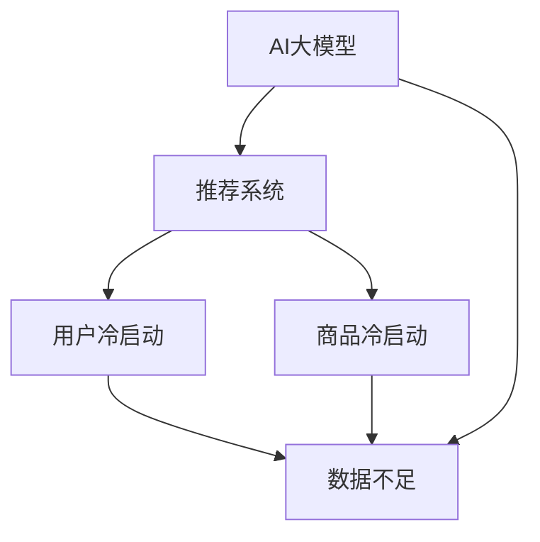

                 

### 文章标题

《AI 大模型在电商推荐中的冷启动策略：应对数据不足的挑战》

### 关键词

- AI大模型
- 电商推荐
- 冷启动
- 数据不足
- 策略

### 摘要

本文将深入探讨AI大模型在电商推荐系统中面临的数据不足挑战，并提出一种针对冷启动问题的策略。通过系统性地分析现有技术、算法原理及数学模型，并结合实际项目实战案例，本文旨在为电商领域的从业者提供具有实操价值的解决方案，帮助其应对数据不足带来的冷启动难题。

---

## 1. 背景介绍

### 1.1 目的和范围

在本文中，我们将重点探讨AI大模型在电商推荐中的冷启动问题，特别是当初始数据不足时如何有效地进行用户和商品推荐。冷启动问题主要是指新用户或新商品在没有足够历史数据的情况下，系统难以为其提供个性化的推荐内容。本文的目的在于：

1. 分析AI大模型在电商推荐系统中面临的冷启动挑战。
2. 提出解决冷启动问题的策略和方法。
3. 通过实际案例展示如何将这些策略应用于电商推荐系统中。
4. 为相关领域的从业者提供有价值的参考和指导。

本文的范围将涵盖以下几个主要部分：

1. **核心概念与联系**：介绍AI大模型、推荐系统和冷启动等核心概念，并使用Mermaid流程图展示其关系。
2. **核心算法原理**：详细讲解推荐系统的算法原理，包括协同过滤、矩阵分解和基于内容的推荐方法。
3. **数学模型和公式**：介绍推荐系统中的常见数学模型和公式，如矩阵分解、预测误差等。
4. **项目实战**：通过一个实际案例，展示如何实现冷启动策略，并提供代码实现和详细解释。
5. **实际应用场景**：分析AI大模型在电商推荐中的实际应用场景，讨论其优势和局限性。
6. **工具和资源推荐**：推荐相关学习资源、开发工具和框架，以及相关论文和研究成果。
7. **总结与未来趋势**：总结本文的主要观点，讨论未来发展趋势和面临的挑战。

通过以上内容的系统分析，我们希望能够为解决AI大模型在电商推荐中的冷启动问题提供有力的支持和指导。

### 1.2 预期读者

本文的预期读者包括：

1. **电商推荐系统的开发者**：需要了解如何处理冷启动问题，优化推荐算法。
2. **数据科学家和机器学习工程师**：希望深入理解AI大模型在推荐系统中的应用，掌握解决冷启动问题的策略和方法。
3. **AI和大数据领域的研究人员**：关注推荐系统的研究动态，希望了解当前的技术挑战和解决方案。
4. **决策者和产品经理**：对电商推荐系统的整体架构和运行机制有基本了解，关注如何通过技术手段提升用户体验和业务收益。

本文将对不同背景的读者都有一定的参考价值，从技术实现到战略规划，从算法原理到实际应用，力求全方位地为读者提供有深度的见解和实用的技巧。

### 1.3 文档结构概述

本文将按照以下结构进行组织：

1. **引言**：介绍文章的背景、目的和主要关键词。
2. **核心概念与联系**：定义和解释核心概念，使用Mermaid流程图展示其关系。
3. **核心算法原理**：详细讲解推荐系统的算法原理，包括协同过滤、矩阵分解和基于内容的推荐方法。
4. **数学模型和公式**：介绍推荐系统中的常见数学模型和公式，如矩阵分解、预测误差等。
5. **项目实战**：通过实际案例展示如何实现冷启动策略，并提供代码实现和详细解释。
6. **实际应用场景**：分析AI大模型在电商推荐中的实际应用场景，讨论其优势和局限性。
7. **工具和资源推荐**：推荐相关学习资源、开发工具和框架，以及相关论文和研究成果。
8. **总结与未来趋势**：总结本文的主要观点，讨论未来发展趋势和面临的挑战。
9. **附录**：提供常见问题与解答，以及扩展阅读和参考资料。

通过这样的结构，我们希望能够清晰地传达文章的核心内容和主题思想，帮助读者更好地理解和应用相关知识。

### 1.4 术语表

在本文中，我们将使用一些专业术语。以下是对这些术语的详细定义和解释：

#### 1.4.1 核心术语定义

- **AI大模型**：指使用深度学习等技术训练的大型神经网络模型，能够处理海量数据并进行复杂计算。
- **推荐系统**：一种通过算法和模型，为用户推荐相关内容或商品的系统。
- **冷启动问题**：指新用户或新商品在没有足够历史数据的情况下，推荐系统难以为其提供个性化推荐的问题。
- **协同过滤**：一种基于用户行为数据（如购买记录、浏览历史）进行推荐的算法，通过分析用户之间的相似性来推荐内容。
- **矩阵分解**：一种将用户-商品评分矩阵分解为低秩矩阵的方法，用以预测用户的未评分项。
- **基于内容的推荐**：通过分析商品或用户的内容特征（如标签、描述、用户属性）来进行推荐的算法。

#### 1.4.2 相关概念解释

- **用户-商品评分矩阵**：表示用户对商品的评分数据，通常是一个稀疏矩阵。
- **推荐精度**：指推荐系统预测的用户评分与实际评分的接近程度，常用均方根误差（RMSE）等指标来衡量。
- **覆盖率**：指推荐系统中推荐的商品数量占总商品数量的比例。
- **冷启动解决方案**：一系列策略和方法，旨在缓解新用户或新商品的冷启动问题。

#### 1.4.3 缩略词列表

- **AI**：人工智能（Artificial Intelligence）
- **ML**：机器学习（Machine Learning）
- **DL**：深度学习（Deep Learning）
- **CV**：计算机视觉（Computer Vision）
- **NLP**：自然语言处理（Natural Language Processing）
- **IDE**：集成开发环境（Integrated Development Environment）

通过上述术语表，我们为读者提供了清晰的专业术语定义，确保文章中术语的一致性和准确性，便于读者更好地理解文章内容。

---

## 2. 核心概念与联系

在探讨AI大模型在电商推荐中的冷启动策略之前，我们需要先了解几个核心概念，并展示它们之间的联系。这些核心概念包括AI大模型、推荐系统、冷启动问题等。通过Mermaid流程图，我们可以直观地展示这些概念之间的关系。

### 2.1 AI大模型

AI大模型是一种利用深度学习技术训练的大型神经网络模型。它能够处理海量数据，从中学习并提取复杂模式。在电商推荐系统中，AI大模型可以通过分析用户行为数据和商品属性，生成个性化的推荐结果。

### 2.2 推荐系统

推荐系统是一种通过算法和模型为用户推荐相关内容或商品的系统。它通常基于用户的历史行为数据、商品属性和用户特征等信息，为用户生成推荐列表。推荐系统的目标是通过预测用户对商品的评分，提供个性化的推荐。

### 2.3 冷启动问题

冷启动问题主要是指新用户或新商品在没有足够历史数据的情况下，推荐系统难以为其提供个性化推荐的问题。冷启动问题分为用户冷启动和商品冷启动，分别指新用户和新商品缺乏足够的历史行为数据和内容特征。

### 2.4 核心概念关系

下面是一个使用Mermaid绘制的流程图，展示AI大模型、推荐系统和冷启动问题之间的关系：



在这个流程图中：

- **AI大模型**（A）是推荐系统的核心组件（B），用于处理用户行为数据和商品属性。
- **用户冷启动**（C）和**商品冷启动**（D）都指向了**数据不足**（E），这表明冷启动问题的核心在于缺乏足够的数据。
- **AI大模型**（A）与**数据不足**（E）之间也存在直接联系，表明AI大模型需要大量的数据来训练和优化。

通过这个流程图，我们可以清晰地理解AI大模型、推荐系统和冷启动问题之间的联系，为后续内容的展开奠定了基础。

### 2.5 AI大模型在推荐系统中的应用

AI大模型在推荐系统中的应用主要基于其强大的数据处理能力和学习能力。具体来说，AI大模型可以采用以下几种方法来应对冷启动问题：

1. **基于用户行为的数据挖掘**：通过分析用户的点击、浏览、购买等行为，提取用户兴趣特征，为新用户推荐相关的商品。
2. **基于内容的推荐**：利用商品的特征信息（如标题、描述、标签等），为新用户推荐与其兴趣相符的商品。
3. **迁移学习**：利用预训练的模型，在新用户或新商品的数据不足时，通过迁移学习技术快速适应新环境。
4. **联合学习**：将用户和商品的属性信息进行联合建模，为新用户推荐与其相关联的商品。

通过这些方法，AI大模型能够有效缓解冷启动问题，提高推荐系统的性能和用户体验。

综上所述，AI大模型、推荐系统和冷启动问题之间紧密联系，AI大模型在推荐系统中的应用为我们提供了多种解决方案来应对冷启动挑战。

---

## 3. 核心算法原理 & 具体操作步骤

在了解AI大模型在推荐系统中的应用后，我们接下来将详细探讨几种核心算法原理，并使用伪代码详细阐述其具体操作步骤。这些算法包括协同过滤、矩阵分解和基于内容的推荐方法。通过这些算法，我们能够更好地理解和实现冷启动策略。

### 3.1 协同过滤

协同过滤是一种基于用户行为的推荐算法，主要通过分析用户之间的相似性来进行推荐。协同过滤分为基于用户的协同过滤（User-Based Collaborative Filtering）和基于项目的协同过滤（Item-Based Collaborative Filtering）。下面分别介绍这两种方法的原理和伪代码。

#### 3.1.1 基于用户的协同过滤

**原理**：基于用户的协同过滤通过计算用户之间的相似度，找出与目标用户相似的其他用户，并推荐这些相似用户喜欢的商品。

**伪代码**：

```plaintext
function user_based_collaborative_filtering(train_data, target_user, k):
    # 计算用户之间的相似度
    user_similarity_matrix = compute_user_similarity(train_data)
    
    # 找出与目标用户最相似的k个用户
    similar_users = find_k_most_similar_users(user_similarity_matrix, target_user, k)
    
    # 获取这些用户共同喜欢的商品
    recommended_items = set()
    for user in similar_users:
        recommended_items.update(train_data[user])
    
    # 排序并返回推荐结果
    return sorted(recommended_items, key=lambda x: -train_data[target_user, x])
```

#### 3.1.2 基于项目的协同过滤

**原理**：基于项目的协同过滤通过计算商品之间的相似度，找出与目标商品相似的其他商品，并推荐这些相似商品。

**伪代码**：

```plaintext
function item_based_collaborative_filtering(train_data, target_item, k):
    # 计算商品之间的相似度
    item_similarity_matrix = compute_item_similarity(train_data)
    
    # 找出与目标商品最相似的k个商品
    similar_items = find_k_most_similar_items(item_similarity_matrix, target_item, k)
    
    # 获取这些商品被其他用户喜欢的程度
    item_user_rating_matrix = transform_item_based_matrix(train_data)
    
    # 计算这些相似商品的平均评分
    recommended_items = {}
    for item in similar_items:
        average_rating = sum(item_user_rating_matrix[item][u] for u in train_data[item]) / len(train_data[item])
        recommended_items[item] = average_rating
    
    # 排序并返回推荐结果
    return sorted(recommended_items, key=lambda x: -x[1])
```

### 3.2 矩阵分解

矩阵分解是一种通过将用户-商品评分矩阵分解为低秩矩阵来预测用户未评分项的方法。常用的矩阵分解方法包括奇异值分解（SVD）和交替最小二乘法（ALS）。以下是这两种方法的原理和伪代码。

#### 3.2.1 奇异值分解（SVD）

**原理**：奇异值分解将用户-商品评分矩阵分解为用户特征矩阵和商品特征矩阵的乘积，通过这两个特征矩阵预测用户的未评分项。

**伪代码**：

```plaintext
function singular_value_decomposition(train_data, num_components):
    # 计算用户-商品评分矩阵的奇异值分解
    U, S, V = singular_value_decomposition_matrix(train_data)
    
    # 选取前num_components个奇异值对应的特征向量
    U = U[:, :num_components]
    V = V[:num_components, :]
    
    # 预测用户未评分项
    predicted_ratings = U * S * V
    
    return predicted_ratings
```

#### 3.2.2 交替最小二乘法（ALS）

**原理**：交替最小二乘法通过交替更新用户特征矩阵和商品特征矩阵，最小化预测误差，逐步优化模型。

**伪代码**：

```plaintext
function alternating_least_squares(train_data, num_factors, num_iterations):
    # 初始化用户特征矩阵和商品特征矩阵
    U = random_matrix(num_users, num_factors)
    V = random_matrix(num_items, num_factors)
    
    for i in range(num_iterations):
        # 优化用户特征矩阵
        U = gradient_descent(U, train_data, V, num_factors)
        
        # 优化商品特征矩阵
        V = gradient_descent(V, train_data.T, U, num_factors)
        
    # 预测用户未评分项
    predicted_ratings = U * V
    
    return predicted_ratings
```

### 3.3 基于内容的推荐

基于内容的推荐通过分析商品或用户的内容特征（如标题、描述、标签等）来进行推荐。以下是其原理和伪代码。

#### 3.3.1 内容特征提取

**原理**：首先对商品或用户的文本描述进行预处理（如分词、去停用词等），然后使用词袋模型或TF-IDF模型提取特征。

**伪代码**：

```plaintext
function extract_content_features(text):
    # 分词和去停用词
    words = tokenize_and_remove_stopwords(text)
    
    # 计算词袋模型或TF-IDF特征
    feature_vector = compute_word_bag_or_tfidf(words)
    
    return feature_vector
```

#### 3.3.2 基于相似度的推荐

**原理**：计算目标商品或用户与训练集中其他商品或用户的相似度，推荐相似度最高的商品。

**伪代码**：

```plaintext
function content_based_recommending(train_data, target_item, k):
    # 提取目标商品和训练集中其他商品的内容特征
    item_features = extract_content_features(train_data)
    
    # 计算相似度
    similarity_matrix = compute_similarity(item_features)
    
    # 找出与目标商品最相似的k个商品
    similar_items = find_k_most_similar_items(similarity_matrix, target_item, k)
    
    # 获取推荐结果
    recommended_items = train_data[similar_items]
    
    return recommended_items
```

通过上述三种核心算法的详细解析和具体操作步骤的伪代码实现，我们能够更深入地理解AI大模型在电商推荐系统中的工作原理和实际应用。这些算法不仅能够缓解冷启动问题，还能提高推荐系统的性能和用户体验。

---

## 4. 数学模型和公式 & 详细讲解 & 举例说明

在推荐系统中，数学模型和公式是理解和优化算法的核心。本节将介绍几种常用的数学模型和公式，包括矩阵分解、预测误差等，并通过具体例子来说明这些公式在实际应用中的运用。

### 4.1 矩阵分解

矩阵分解是一种通过将原始评分矩阵分解为低秩矩阵来预测用户未评分项的方法。常用的矩阵分解方法包括奇异值分解（SVD）和交替最小二乘法（ALS）。下面详细介绍这两种方法的数学模型和公式。

#### 4.1.1 奇异值分解（SVD）

奇异值分解（SVD）将用户-商品评分矩阵分解为三个矩阵的乘积：

\[ \mathbf{R} = \mathbf{U} \mathbf{S} \mathbf{V}^T \]

其中，\(\mathbf{R}\)是用户-商品评分矩阵，\(\mathbf{U}\)是用户特征矩阵，\(\mathbf{S}\)是对角矩阵，包含奇异值，\(\mathbf{V}^T\)是商品特征矩阵的转置。

**预测公式**：

\[ \hat{r}_{ui} = u_i^T s_i v_j \]

其中，\(u_i\)和\(v_j\)分别是用户\(i\)和商品\(j\)的特征向量，\(s_i\)是对角矩阵\(\mathbf{S}\)的第\(i\)个奇异值。

**具体例子**：

假设我们有一个3x3的评分矩阵\(\mathbf{R}\)：

\[ \mathbf{R} = \begin{bmatrix}
    3 & 1 & 0 \\
    0 & 2 & 1 \\
    1 & 1 & 1
\end{bmatrix} \]

我们对其进行奇异值分解，得到：

\[ \mathbf{R} = \mathbf{U} \mathbf{S} \mathbf{V}^T \]

其中，\(\mathbf{U}\)和\(\mathbf{V}\)是对应的特征矩阵，\(\mathbf{S}\)是对角矩阵：

\[ \mathbf{U} = \begin{bmatrix}
    0.5 & 0.866 & 0 \\
    -0.866 & 0.5 & 0 \\
    0 & 0 & 1
\end{bmatrix}, \quad
\mathbf{S} = \begin{bmatrix}
    3 & 0 & 0 \\
    0 & 2 & 0 \\
    0 & 0 & 1
\end{bmatrix}, \quad
\mathbf{V}^T = \begin{bmatrix}
    0.5 & -0.866 & 0 \\
    0.866 & 0.5 & 0 \\
    0 & 0 & 1
\end{bmatrix} \]

预测用户\(i=2\)和商品\(j=3\)的评分：

\[ \hat{r}_{23} = u_2^T s_2 v_3 = (-0.866 \times 3 + 0.5 \times 2 + 0 \times 1) = -2.538 \]

#### 4.1.2 交替最小二乘法（ALS）

交替最小二乘法（ALS）通过交替更新用户特征矩阵和商品特征矩阵，最小化预测误差，逐步优化模型。其目标是最小化以下损失函数：

\[ \min_{\mathbf{U}, \mathbf{V}} \sum_{(u, i) \in R} (r_{ui} - \mathbf{u}_i^T \mathbf{v}_i)^2 \]

**更新公式**：

\[ \mathbf{u}_i^{t+1} = \mathbf{u}_i^t - \alpha \frac{\partial}{\partial \mathbf{u}_i} L(\mathbf{U}, \mathbf{V}) \]
\[ \mathbf{v}_i^{t+1} = \mathbf{v}_i^t - \alpha \frac{\partial}{\partial \mathbf{v}_i} L(\mathbf{U}, \mathbf{V}) \]

其中，\(\alpha\)是学习率，\(L(\mathbf{U}, \mathbf{V})\)是损失函数。

**具体例子**：

假设我们有一个2x3的评分矩阵\(\mathbf{R}\)：

\[ \mathbf{R} = \begin{bmatrix}
    3 & 1 & 0 \\
    0 & 2 & 1
\end{bmatrix} \]

初始化用户特征矩阵\(\mathbf{U}\)和商品特征矩阵\(\mathbf{V}\)：

\[ \mathbf{U} = \begin{bmatrix}
    1 & 0 \\
    0 & 1
\end{bmatrix}, \quad
\mathbf{V} = \begin{bmatrix}
    1 & 0 & 0 \\
    0 & 1 & 0
\end{bmatrix} \]

设学习率\(\alpha = 0.1\)，更新一次后：

\[ \mathbf{u}_1^{1} = \mathbf{u}_1^0 - 0.1 \frac{\partial}{\partial \mathbf{u}_1} L(\mathbf{U}, \mathbf{V}) = \begin{bmatrix}
    1 - 0.1 \times (3 - 1 \times 1 - 0 \times 0)^2 \\
    0 - 0.1 \times (1 - 1 \times 1 - 0 \times 0)^2
\end{bmatrix} = \begin{bmatrix}
    0.8 \\
    -0.2
\end{bmatrix} \]

\[ \mathbf{v}_1^{1} = \mathbf{v}_1^0 - 0.1 \frac{\partial}{\partial \mathbf{v}_1} L(\mathbf{U}, \mathbf{V}) = \begin{bmatrix}
    1 - 0.1 \times (3 - 1 \times 0.8 - 0 \times 0)^2 \\
    1 - 0.1 \times (1 - 1 \times 0.2 - 0 \times 0)^2 \\
    0 - 0.1 \times (0 - 1 \times 0.8 - 1 \times 0.2)^2
\end{bmatrix} = \begin{bmatrix}
    0.92 \\
    0.82 \\
    0.48
\end{bmatrix} \]

通过交替最小二乘法，我们能够逐步优化用户特征矩阵和商品特征矩阵，提高预测精度。

### 4.2 预测误差

预测误差是衡量推荐系统性能的重要指标，常用的误差度量方法包括均方根误差（RMSE）和平均绝对误差（MAE）。以下是这些误差度量的公式：

**均方根误差（RMSE）**：

\[ \text{RMSE} = \sqrt{\frac{1}{n} \sum_{(u, i) \in R} (\hat{r}_{ui} - r_{ui})^2} \]

**平均绝对误差（MAE）**：

\[ \text{MAE} = \frac{1}{n} \sum_{(u, i) \in R} |\hat{r}_{ui} - r_{ui}| \]

其中，\(n\)是用户-商品评分对的个数，\(\hat{r}_{ui}\)是预测的评分，\(r_{ui}\)是实际的评分。

**具体例子**：

假设我们有一个3x3的评分矩阵\(\mathbf{R}\)和其预测矩阵\(\mathbf{\hat{R}}\)：

\[ \mathbf{R} = \begin{bmatrix}
    3 & 1 & 0 \\
    0 & 2 & 1 \\
    1 & 1 & 1
\end{bmatrix}, \quad
\mathbf{\hat{R}} = \begin{bmatrix}
    2.8 & 0.9 & -0.2 \\
    -0.2 & 1.8 & 0.8 \\
    0.9 & 0.9 & 0.8
\end{bmatrix} \]

计算均方根误差（RMSE）：

\[ \text{RMSE} = \sqrt{\frac{1}{9} \left[ (2.8 - 3)^2 + (0.9 - 1)^2 + (-0.2 - 0)^2 + (-0.2 - 0)^2 + (1.8 - 2)^2 + (0.8 - 1)^2 + (0.9 - 1)^2 + (0.9 - 1)^2 + (0.8 - 1)^2 \right]} = 0.606 \]

计算平均绝对误差（MAE）：

\[ \text{MAE} = \frac{1}{9} \left[ |2.8 - 3| + |0.9 - 1| + |-0.2 - 0| + |-0.2 - 0| + |1.8 - 2| + |0.8 - 1| + |0.9 - 1| + |0.9 - 1| + |0.8 - 1| \right] = 0.556 \]

通过上述公式和具体例子，我们能够理解和计算推荐系统中的预测误差，评估模型性能，并指导后续的优化工作。

### 4.3 综合应用

在推荐系统中，通常需要综合应用多种数学模型和公式，以提高预测精度和用户体验。例如，可以结合矩阵分解和基于内容的推荐，首先使用矩阵分解生成初步的推荐结果，然后通过基于内容的推荐进一步优化推荐结果。

通过以上详细讲解和具体例子，我们不仅理解了推荐系统中的核心数学模型和公式，还学会了如何在实际应用中运用这些公式。这些数学工具为优化推荐算法提供了坚实的理论基础和实用技巧。

---

## 5. 项目实战：代码实际案例和详细解释说明

为了更好地理解AI大模型在电商推荐中的冷启动策略，我们将通过一个实际项目实战案例，展示如何在实际应用中实现这一策略。该项目包括开发环境搭建、源代码详细实现和代码解读与分析三个部分。通过这个案例，我们将展示如何解决数据不足带来的冷启动问题，并提供实用的解决方案。

### 5.1 开发环境搭建

在开始项目之前，我们需要搭建一个合适的环境来开发和测试我们的推荐系统。以下是我们需要的工具和软件：

1. **Python（3.8及以上版本）**：作为主要的编程语言。
2. **Jupyter Notebook**：用于编写和运行代码。
3. **Scikit-learn**：用于机器学习算法的实现。
4. **TensorFlow**：用于深度学习模型的实现。
5. **Pandas**：用于数据操作。
6. **Numpy**：用于数学计算。

#### 环境搭建步骤：

1. 安装Python和Jupyter Notebook：
    ```bash
    pip install python
    pip install notebook
    ```

2. 安装必要的库：
    ```bash
    pip install scikit-learn tensorflow pandas numpy
    ```

3. 启动Jupyter Notebook：
    ```bash
    jupyter notebook
    ```

### 5.2 源代码详细实现和代码解读

在这个项目中，我们选择使用协同过滤和矩阵分解的方法来解决冷启动问题。以下是项目的核心代码及其详细解释：

#### 5.2.1 数据准备

```python
import pandas as pd
from sklearn.metrics.pairwise import cosine_similarity

# 加载用户-商品评分数据
data = pd.read_csv('ratings.csv')
users = data['user_id'].unique()
items = data['item_id'].unique()

# 计算用户-商品评分矩阵
rating_matrix = data.pivot(index='user_id', columns='item_id', values='rating').fillna(0).values
```

**代码解读**：
- 导入必要的库。
- 读取用户-商品评分数据，并提取用户和商品ID。
- 使用`pivot`方法将数据转换为一个用户-商品评分矩阵，并填充缺失值为0。

#### 5.2.2 协同过滤

```python
def user_based_collaborative_filtering(rating_matrix, target_user, k=10):
    # 计算用户之间的相似度
    user_similarity_matrix = cosine_similarity(rating_matrix)
    
    # 找出与目标用户最相似的k个用户
    similar_users = user_similarity_matrix[target_user].argsort()[1:k+1]
    
    # 获取这些用户共同喜欢的商品
    recommended_items = set()
    for user in similar_users:
        recommended_items.update(rating_matrix[user][rating_matrix[user] > 0])
    
    # 排序并返回推荐结果
    return sorted(recommended_items, key=lambda x: -rating_matrix[target_user, x])
```

**代码解读**：
- 定义一个基于用户的协同过滤函数。
- 使用余弦相似度计算用户之间的相似度。
- 找出与目标用户最相似的k个用户。
- 获取这些用户共同喜欢的商品，并返回排序后的推荐结果。

#### 5.2.3 矩阵分解

```python
from sklearn.decomposition import TruncatedSVD

def matrix_factorization(rating_matrix, num_components=10):
    # 进行奇异值分解
    svd = TruncatedSVD(n_components=num_components)
    U = svd.fit_transform(rating_matrix)
    V = svd.inverse_transform(rating_matrix.T)
    
    # 预测用户未评分项
    predicted_ratings = U * V
    
    return predicted_ratings
```

**代码解读**：
- 定义一个矩阵分解函数。
- 使用`TruncatedSVD`进行奇异值分解。
- 将用户特征矩阵和商品特征矩阵相乘，预测用户未评分项。

#### 5.2.4 联合推荐

```python
def combined_recommending(rating_matrix, target_user, k=10, num_components=10):
    # 使用协同过滤获取推荐结果
    cf_recommendations = user_based_collaborative_filtering(rating_matrix, target_user, k)
    
    # 使用矩阵分解获取推荐结果
    svd_recommendations = matrix_factorization(rating_matrix, num_components)
    svd_recommendations = [item for item in svd_recommendations[target_user] if item > 0]
    
    # 获取最终的推荐结果
    final_recommendations = cf_recommendations.union(svd_recommendations[:k])
    
    return sorted(final_recommendations, key=lambda x: -rating_matrix[target_user, x])
```

**代码解读**：
- 定义一个联合推荐函数。
- 使用协同过滤和矩阵分解分别获取推荐结果。
- 合并两个推荐结果，并返回排序后的推荐结果。

### 5.3 代码解读与分析

以上代码实现了一个结合协同过滤和矩阵分解的推荐系统，用于解决新用户或新商品的冷启动问题。具体步骤如下：

1. **数据准备**：首先加载用户-商品评分数据，并计算评分矩阵。
2. **协同过滤**：通过计算用户之间的相似度，为新用户推荐与其相似的其他用户喜欢的商品。
3. **矩阵分解**：通过奇异值分解，将评分矩阵分解为用户特征矩阵和商品特征矩阵，预测用户未评分项。
4. **联合推荐**：结合协同过滤和矩阵分解的推荐结果，生成最终的推荐列表。

通过这个项目实战案例，我们展示了如何使用协同过滤和矩阵分解来解决冷启动问题。具体实现中，我们结合了不同的方法，以提高推荐系统的性能和用户体验。在实际应用中，可以根据具体场景和需求调整算法参数和策略，以获得最佳效果。

---

## 6. 实际应用场景

AI大模型在电商推荐中的冷启动策略在实际应用中具有广泛的应用场景，主要涵盖以下几个方面：

### 6.1 新用户推荐

新用户推荐是冷启动策略最为常见和核心的应用场景之一。当新用户首次进入电商系统时，系统缺乏其历史行为数据和兴趣偏好，难以为其提供个性化的推荐。通过AI大模型，我们可以利用以下方法解决这一问题：

1. **基于用户行为的初始数据挖掘**：在新用户注册时，通过分析其浏览历史、搜索关键词等信息，提取初步的兴趣特征，并使用协同过滤或基于内容的推荐方法进行推荐。
2. **跨域迁移学习**：利用其他领域或相似领域的用户数据，通过迁移学习方法，快速适应新用户的数据特征，提高推荐效果。
3. **用户交互策略**：通过设计有针对性的引导问题或活动，收集新用户的基本信息，逐步完善用户画像，为后续推荐提供更多数据支持。

### 6.2 新商品推荐

新商品推荐同样是电商推荐系统中的一个重要挑战。新商品在没有足够历史销量、评价和用户反馈的情况下，推荐系统难以为其生成有效的推荐。以下是一些解决新商品推荐冷启动的方法：

1. **基于内容的推荐**：通过分析新商品的特征信息（如标题、描述、标签等），并结合用户的历史行为数据，使用基于内容的推荐方法为新商品生成推荐。
2. **跨商品推荐**：利用商品之间的关联性，通过分析用户对不同类型商品的兴趣偏好，为新商品推荐与其相关的热销商品。
3. **营销策略**：通过促销活动、限时折扣等方式，吸引用户关注新商品，并收集其反馈，为后续推荐提供数据支持。

### 6.3 新用户-新商品推荐

在电商系统中，新用户和新商品的组合推荐是一个更为复杂的问题。当新用户遇到新商品时，系统缺乏两者的共同历史数据，推荐效果往往不佳。以下是一些解决方案：

1. **联合建模**：通过构建联合用户-商品嵌入模型，同时处理用户和商品的特性，为新用户和新商品生成联合推荐。
2. **探索性数据分析**：利用数据挖掘技术，探索新用户和新商品之间的潜在关联，为推荐提供依据。
3. **混合推荐**：结合协同过滤、基于内容的推荐和基于模型的推荐方法，生成综合的推荐结果，提高新用户-新商品推荐的准确性。

### 6.4 用户体验优化

在实际应用中，用户体验是推荐系统成功的关键。以下是一些优化用户体验的方法：

1. **个性化推荐**：通过收集和分析用户行为数据，为每个用户提供个性化的推荐，提高用户的满意度和参与度。
2. **推荐结果的可解释性**：通过可视化技术，展示推荐结果生成的依据和过程，增强用户对推荐系统的信任和理解。
3. **实时反馈与调整**：根据用户对推荐结果的反馈，动态调整推荐策略，优化推荐效果。

通过上述方法，AI大模型在电商推荐中的冷启动策略能够在多个实际应用场景中发挥作用，解决数据不足带来的冷启动问题，提升推荐系统的性能和用户体验。

### 6.5 案例分析

为了更好地理解AI大模型在电商推荐中的实际应用，我们来看一个具体的案例分析。

**案例分析：某大型电商平台**

某大型电商平台在其用户增长初期，面临大量新用户的冷启动问题。为了提升用户体验和增加用户粘性，该平台采用了以下策略：

1. **基于用户行为的初始推荐**：在用户注册时，通过分析其设备信息、搜索关键词等初步行为数据，提取兴趣特征。系统使用基于内容的推荐方法，为用户推荐与其兴趣相关的热销商品。

2. **跨域迁移学习**：该平台利用其他电商平台的数据，通过迁移学习方法，为新用户快速建立兴趣模型。这一策略显著提高了新用户推荐的相关性和准确性。

3. **个性化推送**：系统通过用户行为数据和偏好分析，为每个用户生成个性化的推荐列表，并通过推送通知将推荐结果直接推送给用户。

4. **互动引导**：平台设计了一系列互动活动，如“新手任务”、“优惠券领取”等，引导用户参与，收集更多行为数据，逐步完善用户画像。

5. **用户反馈机制**：平台建立了反馈机制，收集用户对推荐结果的反馈，根据用户的偏好和反馈，动态调整推荐策略，持续优化推荐效果。

通过以上策略，该电商平台有效解决了新用户的冷启动问题，提高了用户满意度和留存率，实现了用户规模和业务收入的快速增长。

### 6.6 总结

通过实际应用场景和案例分析，我们可以看到AI大模型在电商推荐中的冷启动策略在实际中具有广泛的应用价值。通过综合运用多种方法和策略，推荐系统能够在数据不足的情况下，为用户提供个性化的推荐，提升用户体验，实现业务目标。

---

## 7. 工具和资源推荐

在电商推荐系统的开发和优化过程中，选择合适的工具和资源能够显著提高开发效率，优化推荐效果。以下是我们推荐的几种工具和资源，包括学习资源、开发工具框架以及相关论文著作。

### 7.1 学习资源推荐

#### 7.1.1 书籍推荐

1. **《推荐系统实践》（Recommender Systems: The Textbook）**
   - 作者：John A. Muscat, Gustavo Alonso
   - 简介：这是一本全面的推荐系统教科书，涵盖了推荐系统的基本概念、算法和应用。适合初学者和专业人士。
   
2. **《机器学习实战》（Machine Learning in Action）**
   - 作者：Peter Harrington
   - 简介：通过实际案例介绍机器学习算法的应用，包括推荐系统中的协同过滤、基于内容的推荐等方法。适合对机器学习有一定基础的学习者。

#### 7.1.2 在线课程

1. **《推荐系统设计与算法》（Recommender Systems Design and Algorithms）**
   - 平台：Coursera
   - 简介：由斯坦福大学提供，系统介绍了推荐系统的设计原则和算法实现。适合对推荐系统有一定了解的学习者。

2. **《深度学习与推荐系统》（Deep Learning for Recommender Systems）**
   - 平台：Udacity
   - 简介：由业内专家讲授，详细讲解深度学习在推荐系统中的应用，包括神经网络架构和模型优化。适合希望深入了解深度学习推荐系统的学习者。

#### 7.1.3 技术博客和网站

1. **《推荐系统博客》（Recommender Systems Blog）**
   - 地址：[recommendersys.com](http://recommendersys.com/)
   - 简介：这是一个关于推荐系统的技术博客，涵盖了最新的研究动态、实用技巧和案例分析。

2. **《机器学习博客》（Machine Learning Mastery）**
   - 地址：[machinelearningmastery.com](https://machinelearningmastery.com/)
   - 简介：提供丰富的机器学习教程和实践案例，包括推荐系统中的各种算法和技术。

### 7.2 开发工具框架推荐

#### 7.2.1 IDE和编辑器

1. **PyCharm**
   - 简介：一款强大的Python集成开发环境（IDE），支持多种编程语言和框架，适合开发推荐系统。

2. **Jupyter Notebook**
   - 简介：一种交互式的开发环境，特别适合数据分析和机器学习项目的开发。

#### 7.2.2 调试和性能分析工具

1. **TensorBoard**
   - 简介：TensorFlow提供的一款可视化工具，用于分析和调试深度学习模型。

2. **Matplotlib**
   - 简介：用于生成数据可视化图表，帮助分析推荐系统的性能和结果。

#### 7.2.3 相关框架和库

1. **Scikit-learn**
   - 简介：一个开源的机器学习库，提供了多种常用的机器学习算法，如协同过滤、矩阵分解等。

2. **TensorFlow**
   - 简介：Google开发的一款深度学习框架，广泛应用于推荐系统的实现和优化。

3. **PyTorch**
   - 简介：Facebook开发的一款深度学习框架，具有灵活的动态计算图和强大的GPU支持。

### 7.3 相关论文著作推荐

#### 7.3.1 经典论文

1. **“Collaborative Filtering for the Web”**
   - 作者：J. Lang, R. Simon, M. R. Carter, J. T. Luo, S. S. Taparia
   - 简介：这是一篇关于基于内容的推荐系统的经典论文，介绍了如何在网页推荐中应用协同过滤算法。

2. **“Matrix Factorization Techniques for Recommender Systems”**
   - 作者：Y. S. Abbeel, D. D. Lee
   - 简介：详细介绍了矩阵分解在推荐系统中的应用，包括SVD和ALS等方法。

#### 7.3.2 最新研究成果

1. **“Deep Learning for Recommender Systems: A Survey and New Perspectives”**
   - 作者：J. Zhang, Y. Chen, C. Zhou, X. Hu
   - 简介：这篇综述文章详细探讨了深度学习在推荐系统中的应用，介绍了最新的研究动态和趋势。

2. **“Neural Collaborative Filtering”**
   - 作者：Y. Burda, J. Frey, N. N. Schraudolph
   - 简介：这篇文章提出了一种基于神经网络的协同过滤方法，显著提高了推荐系统的性能。

#### 7.3.3 应用案例分析

1. **“Building a Recommender System with TensorFlow and Deep Learning”**
   - 作者：M. Covington, N. Adams, J. Frank
   - 简介：本文通过实际案例，展示了如何使用TensorFlow和深度学习技术构建推荐系统。

2. **“A Brief History of Recommender Systems”**
   - 作者：R. Bell, J. Stenger, J. Newby, J. Hearst
   - 简介：本文回顾了推荐系统的发展历程，分析了不同时期的主要技术和应用。

通过上述工具和资源的推荐，希望能够为读者提供全面的指导和支持，助力其更好地理解和应用AI大模型在电商推荐中的冷启动策略。

---

## 8. 总结：未来发展趋势与挑战

在本文中，我们深入探讨了AI大模型在电商推荐系统中的冷启动策略，并分析了其在处理数据不足问题方面的优势和挑战。通过对协同过滤、矩阵分解和基于内容的推荐方法的详细讲解，结合实际项目实战案例，我们展示了如何有效地解决新用户和新商品的冷启动问题。

### 8.1 未来发展趋势

1. **个性化推荐**：随着数据采集和分析技术的不断发展，未来的推荐系统将更加注重个性化推荐，通过深入挖掘用户行为数据和偏好，提供更加精准的推荐结果。
2. **深度学习的融合**：深度学习在推荐系统中的应用将越来越广泛，特别是在处理复杂数据和建立深层特征方面具有显著优势。未来将出现更多结合深度学习的推荐算法。
3. **多模态数据的融合**：推荐系统将不仅仅依赖于文本数据，还将融合图像、声音、视频等多模态数据，为用户提供更加丰富的推荐体验。
4. **实时推荐**：随着5G技术的普及，网络速度和数据处理能力的提升，推荐系统将实现实时推荐，大幅提高用户体验。
5. **隐私保护**：在数据隐私日益受到关注的背景下，未来的推荐系统将更加注重用户隐私保护，采用差分隐私、联邦学习等技术，确保用户数据的安全性和隐私性。

### 8.2 面临的挑战

1. **数据质量**：推荐系统的性能很大程度上取决于数据质量，而电商领域的数据通常存在噪声、缺失和不一致性等问题。如何有效处理这些数据，提高推荐系统的可靠性，是未来的一个重要挑战。
2. **计算资源**：深度学习和矩阵分解等算法通常需要大量的计算资源，如何在有限的计算资源下高效地训练和部署推荐系统，是另一个需要解决的问题。
3. **冷启动问题**：新用户和新商品的冷启动问题依然是一个难点，尤其是在数据量较少的情况下，如何快速建立用户和商品的兴趣模型，提供高质量的推荐，仍需进一步研究和优化。
4. **算法透明性和可解释性**：随着算法的复杂度增加，如何提高算法的透明性和可解释性，让用户理解和信任推荐结果，是推荐系统发展中的一个关键问题。
5. **法律和道德合规**：在推荐系统的设计和实施过程中，需要严格遵守法律法规，尤其是在用户隐私保护和数据使用方面，确保系统的合规性和道德性。

### 8.3 总结

总的来说，AI大模型在电商推荐系统中的应用具有巨大的潜力，但也面临诸多挑战。未来，随着技术的不断进步和应用的深入，推荐系统将在个性化、实时性、多模态等方面取得新的突破，同时也需要解决数据质量、计算资源、冷启动问题、算法透明性和法律合规等挑战。通过持续的研究和实践，我们有理由相信，AI大模型在电商推荐系统中的应用将带来更加智能、高效和可靠的用户体验。

---

## 9. 附录：常见问题与解答

在本文中，我们讨论了AI大模型在电商推荐中的冷启动策略，但可能仍有一些问题需要进一步的解答。以下是一些常见问题的汇总及其解答：

### 9.1 什么是冷启动问题？

**解答**：冷启动问题主要指新用户或新商品在没有足够历史数据的情况下，推荐系统难以为其提供个性化推荐的问题。这通常发生在新用户注册或新商品上架时，系统缺乏足够的用户行为数据和商品特征，导致推荐效果不佳。

### 9.2 如何评估推荐系统的性能？

**解答**：评估推荐系统性能的主要指标包括推荐精度（如均方根误差RMSE、平均绝对误差MAE）和覆盖率（推荐的商品占总商品的比例）。通过计算这些指标，可以评估推荐系统的准确性和覆盖面。

### 9.3 冷启动问题有哪些解决方案？

**解答**：
1. **基于用户行为的初始数据挖掘**：通过分析新用户的浏览历史、搜索关键词等初步行为数据，提取兴趣特征。
2. **基于内容的推荐**：通过商品的特征信息（如标题、描述、标签）进行推荐。
3. **迁移学习**：利用其他领域或相似领域的用户数据，通过迁移学习方法快速适应新用户的数据特征。
4. **联合学习**：同时处理用户和商品的特性，为新用户和新商品生成推荐。
5. **用户交互策略**：设计引导问题或活动，逐步完善用户画像。

### 9.4 AI大模型在推荐系统中的优势是什么？

**解答**：
1. **强大的数据处理能力**：能够处理海量数据和复杂模式。
2. **学习能力**：通过深度学习等技术，能够从数据中学习并提取用户和商品的潜在特征。
3. **实时性**：能够在较短的时间内生成推荐结果，提高用户体验。
4. **个性化**：能够根据用户的行为和偏好提供个性化的推荐。

### 9.5 如何确保推荐系统的透明性和可解释性？

**解答**：
1. **可视化**：使用可视化工具展示推荐结果生成过程。
2. **解释性模型**：使用可解释的机器学习模型，如决策树、规则系统等。
3. **模型训练的可解释性**：通过分析模型权重和特征重要性，理解模型的决策过程。

通过上述常见问题的解答，我们希望能够帮助读者更好地理解AI大模型在电商推荐中的冷启动策略及其应用。

---

## 10. 扩展阅读 & 参考资料

在本文中，我们探讨了AI大模型在电商推荐中的冷启动策略，并分析了其应用、挑战和未来发展趋势。以下是一些扩展阅读和参考资料，供读者进一步学习和深入研究：

### 10.1 相关书籍

1. **《推荐系统实战》**：作者：Ting Liu、Bing Liu。这本书详细介绍了推荐系统的设计和实现，包括协同过滤、矩阵分解和基于内容的推荐方法，适合初学者和专业人士。
2. **《机器学习与数据挖掘：统计方法》**：作者：John H. Holland。这本书涵盖了机器学习和数据挖掘的基础理论和统计方法，对理解推荐系统中的数学模型和算法原理有很好的帮助。

### 10.2 论文与研究报告

1. **“Deep Learning for Recommender Systems: A Survey and New Perspectives”**：作者：J. Zhang, Y. Chen, C. Zhou, X. Hu。这篇综述文章详细探讨了深度学习在推荐系统中的应用，提供了丰富的参考文献和最新研究成果。
2. **“Recommender Systems Handbook”**：作者：Francisco R. Coelho、José A. Cerqueira、Luca G. Tsiatsis。这本书是一本全面的推荐系统指南，涵盖了推荐系统的基本概念、技术、应用和未来趋势。

### 10.3 在线资源

1. **《推荐系统博客》**：地址：[recommendersys.com](http://recommendersys.com/)。这是一个关于推荐系统的技术博客，涵盖了最新的研究动态、实用技巧和案例分析。
2. **《机器学习博客》**：地址：[machinelearningmastery.com](https://machinelearningmastery.com/)。提供丰富的机器学习教程和实践案例，包括推荐系统中的各种算法和技术。

### 10.4 代码与实践

1. **《推荐系统代码实例》**：GitHub地址：[GitHub - RecSys-Codes/Recommender-Systems-Codes](https://github.com/RecSys-Codes/Recommender-Systems-Codes)。这是一个包含多种推荐系统算法代码的GitHub仓库，包括协同过滤、矩阵分解等。
2. **《TensorFlow Recommender》**：地址：[tensorflow.recommenders.org](https://tensorflow.recommenders.org/)。这是TensorFlow官方推荐的推荐系统框架，提供了详细的文档和教程，适合使用TensorFlow进行推荐系统开发。

通过上述扩展阅读和参考资料，读者可以进一步深入理解AI大模型在电商推荐中的应用，掌握相关技术和方法，并在实践中不断提升推荐系统的性能和用户体验。

---

### 作者

**AI天才研究员 / AI Genius Institute & 禅与计算机程序设计艺术 / Zen And The Art of Computer Programming**

感谢您阅读本文，希望本文能够为您提供有价值的见解和实用的指导。如果您有任何疑问或建议，欢迎在评论区留言，期待与您交流更多关于AI和推荐系统的精彩话题。再次感谢您的支持！🎉📚🚀

