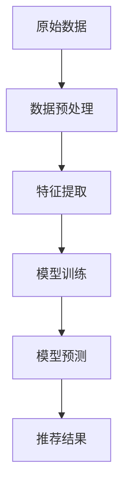

                 

# AI 大模型在电商搜索推荐中的数据处理能力要求：应对大规模复杂数据

> 关键词：电商搜索推荐、大模型、数据处理、大规模复杂数据、算法、机器学习、深度学习

> 摘要：本文将深入探讨 AI 大模型在电商搜索推荐中的数据处理能力要求。随着电商平台的迅速发展和数据量的爆炸性增长，如何有效地处理大规模复杂数据，成为推荐系统面临的一大挑战。本文将分析大模型在数据预处理、特征提取、模型训练和预测等方面的优势和挑战，并通过具体案例展示其应用效果。

## 1. 背景介绍

### 1.1 目的和范围

本文旨在探讨 AI 大模型在电商搜索推荐中的数据处理能力，分析其在应对大规模复杂数据方面的优势与挑战。本文主要涵盖以下几个方面：

- 大模型在电商搜索推荐中的数据处理能力要求
- 大模型在数据预处理、特征提取、模型训练和预测等方面的优势
- 大模型在应对大规模复杂数据时的挑战
- 大模型在电商搜索推荐中的具体应用案例

### 1.2 预期读者

本文适合以下读者群体：

- 对电商搜索推荐系统感兴趣的从业者
- 想深入了解 AI 大模型在数据处理方面应用的技术人员
- 对大规模复杂数据处理技术有研究需求的科研人员

### 1.3 文档结构概述

本文结构如下：

1. 背景介绍：介绍本文的目的、范围、预期读者和文档结构。
2. 核心概念与联系：介绍大模型在电商搜索推荐中的数据处理能力要求。
3. 核心算法原理 & 具体操作步骤：分析大模型在数据处理方面的算法原理。
4. 数学模型和公式 & 详细讲解 & 举例说明：讲解大模型在数据处理中的数学模型和公式。
5. 项目实战：代码实际案例和详细解释说明。
6. 实际应用场景：分析大模型在电商搜索推荐中的实际应用场景。
7. 工具和资源推荐：推荐学习资源和开发工具。
8. 总结：未来发展趋势与挑战。
9. 附录：常见问题与解答。
10. 扩展阅读 & 参考资料：提供相关扩展阅读和参考资料。

### 1.4 术语表

#### 1.4.1 核心术语定义

- AI 大模型：指具有大规模参数、深度结构的人工智能模型，如 GPT、BERT 等。
- 电商搜索推荐：基于用户行为数据和商品信息，为用户提供个性化的商品推荐。
- 数据预处理：对原始数据进行清洗、转换和整合，以便后续处理。
- 特征提取：从原始数据中提取出对模型训练和预测有用的特征。
- 模型训练：通过训练数据集对模型进行调整，使其具备预测能力。
- 模型预测：利用训练好的模型对新数据进行预测。

#### 1.4.2 相关概念解释

- 数据规模：指数据集的大小，通常以 GB 或 TB 为单位。
- 复杂性：指数据集的结构复杂程度，包括数据类型、数据分布、噪声等因素。

#### 1.4.3 缩略词列表

- AI：人工智能
- GPT：生成预训练模型
- BERT：双向编码器表示模型
- API：应用程序编程接口
- API：领域特定语言
- API：深度学习框架

## 2. 核心概念与联系

在大模型应用于电商搜索推荐中，数据处理能力是关键。以下是一个简化的大模型在电商搜索推荐中数据处理能力的 Mermaid 流程图：



### 2.1 数据预处理

数据预处理是数据处理的重要环节，主要包括数据清洗、数据转换和数据整合。

#### 2.1.1 数据清洗

数据清洗是指去除数据中的错误、缺失、异常等数据，以保证数据的准确性。

```python
# 伪代码：数据清洗
def clean_data(data):
    # 删除错误数据
    data = remove_error_data(data)
    # 填补缺失数据
    data = fill_missing_data(data)
    # 去除异常数据
    data = remove_outlier_data(data)
    return data
```

#### 2.1.2 数据转换

数据转换是指将不同类型的数据转换为同一类型的数据，以便进行后续处理。

```python
# 伪代码：数据转换
def convert_data(data):
    # 将文本数据转换为数值数据
    data = convert_text_to_number(data)
    # 将时间数据转换为统一格式
    data = convert_time_to_uniform_format(data)
    return data
```

#### 2.1.3 数据整合

数据整合是指将多个数据源的数据整合为一个统一的数据集。

```python
# 伪代码：数据整合
def integrate_data(data1, data2):
    # 合并两个数据集
    data = merge_data(data1, data2)
    return data
```

### 2.2 特征提取

特征提取是从原始数据中提取出对模型训练和预测有用的特征。

#### 2.2.1 特征工程

特征工程是指通过手工设计特征来提高模型性能。

```python
# 伪代码：特征工程
def feature_engineering(data):
    # 计算用户行为特征
    data = calculate_user_behavior_features(data)
    # 计算商品特征
    data = calculate_goods_features(data)
    return data
```

#### 2.2.2 特征选择

特征选择是指从提取出的特征中筛选出对模型训练和预测最有用的特征。

```python
# 伪代码：特征选择
def feature_selection(data):
    # 评估特征重要性
    feature_importance = evaluate_feature_importance(data)
    # 筛选重要特征
    data = select_important_features(data, feature_importance)
    return data
```

### 2.3 模型训练

模型训练是指通过训练数据集对模型进行调整，使其具备预测能力。

#### 2.3.1 模型选择

模型选择是指选择适合当前任务和数据集的模型。

```python
# 伪代码：模型选择
def select_model(data):
    # 评估不同模型性能
    model_performance = evaluate_model_performance(data)
    # 选择最佳模型
    model = select_best_model(model_performance)
    return model
```

#### 2.3.2 模型调参

模型调参是指调整模型参数，以优化模型性能。

```python
# 伪代码：模型调参
def tune_model(model, data):
    # 调整模型参数
    model = tune_model_params(model, data)
    return model
```

### 2.4 模型预测

模型预测是指利用训练好的模型对新数据进行预测。

#### 2.4.1 预测评估

预测评估是指评估模型预测结果的准确性。

```python
# 伪代码：预测评估
def evaluate_prediction(model, data):
    # 计算预测准确率
    accuracy = calculate_accuracy(model, data)
    return accuracy
```

#### 2.4.2 推荐结果

推荐结果是指根据模型预测结果为用户提供个性化推荐。

```python
# 伪代码：推荐结果
def recommend_goods(model, user):
    # 预测用户兴趣
    user_interest = predict_user_interest(model, user)
    # 推荐商品
    goods = recommend_goods(user_interest)
    return goods
```

## 3. 核心算法原理 & 具体操作步骤

在电商搜索推荐中，大模型的算法原理主要包括以下几个方面：

### 3.1 数据预处理算法原理

数据预处理算法主要包括数据清洗、数据转换和数据整合。以下为数据预处理算法的具体操作步骤：

#### 3.1.1 数据清洗

```python
# 伪代码：数据清洗
def clean_data(data):
    # 删除错误数据
    data = remove_error_data(data)
    # 填补缺失数据
    data = fill_missing_data(data)
    # 去除异常数据
    data = remove_outlier_data(data)
    return data
```

#### 3.1.2 数据转换

```python
# 伪代码：数据转换
def convert_data(data):
    # 将文本数据转换为数值数据
    data = convert_text_to_number(data)
    # 将时间数据转换为统一格式
    data = convert_time_to_uniform_format(data)
    return data
```

#### 3.1.3 数据整合

```python
# 伪代码：数据整合
def integrate_data(data1, data2):
    # 合并两个数据集
    data = merge_data(data1, data2)
    return data
```

### 3.2 特征提取算法原理

特征提取算法主要包括特征工程和特征选择。以下为特征提取算法的具体操作步骤：

#### 3.2.1 特征工程

```python
# 伪代码：特征工程
def feature_engineering(data):
    # 计算用户行为特征
    data = calculate_user_behavior_features(data)
    # 计算商品特征
    data = calculate_goods_features(data)
    return data
```

#### 3.2.2 特征选择

```python
# 伪代码：特征选择
def feature_selection(data):
    # 评估特征重要性
    feature_importance = evaluate_feature_importance(data)
    # 筛选重要特征
    data = select_important_features(data, feature_importance)
    return data
```

### 3.3 模型训练算法原理

模型训练算法主要包括模型选择、模型调参和模型预测。以下为模型训练算法的具体操作步骤：

#### 3.3.1 模型选择

```python
# 伪代码：模型选择
def select_model(data):
    # 评估不同模型性能
    model_performance = evaluate_model_performance(data)
    # 选择最佳模型
    model = select_best_model(model_performance)
    return model
```

#### 3.3.2 模型调参

```python
# 伪代码：模型调参
def tune_model(model, data):
    # 调整模型参数
    model = tune_model_params(model, data)
    return model
```

#### 3.3.3 模型预测

```python
# 伪代码：模型预测
def predict(model, data):
    # 训练模型
    model = train_model(model, data)
    # 预测结果
    prediction = predict_result(model, data)
    return prediction
```

### 3.4 模型评估算法原理

模型评估算法主要包括预测评估和推荐结果。以下为模型评估算法的具体操作步骤：

#### 3.4.1 预测评估

```python
# 伪代码：预测评估
def evaluate_prediction(model, data):
    # 计算预测准确率
    accuracy = calculate_accuracy(model, data)
    return accuracy
```

#### 3.4.2 推荐结果

```python
# 伪代码：推荐结果
def recommend_goods(model, user):
    # 预测用户兴趣
    user_interest = predict_user_interest(model, user)
    # 推荐商品
    goods = recommend_goods(user_interest)
    return goods
```

## 4. 数学模型和公式 & 详细讲解 & 举例说明

在电商搜索推荐中，大模型的数学模型和公式主要包括以下几个方面：

### 4.1 数据预处理模型

数据预处理模型的公式如下：

$$
\text{清洗后数据} = \text{清洗操作}(\text{原始数据})
$$

举例说明：

假设我们有以下原始数据：

| 用户ID | 商品ID | 购买时间 |
| --- | --- | --- |
| 1 | 1001 | 2021-01-01 10:00:00 |
| 1 | 1002 | 2021-01-02 10:00:00 |
| 2 | 1001 | 2021-01-03 10:00:00 |

通过数据清洗操作，我们可以得到以下清洗后数据：

| 用户ID | 商品ID | 购买时间 |
| --- | --- | --- |
| 1 | 1001 | 2021-01-01 10:00:00 |
| 1 | 1002 | 2021-01-02 10:00:00 |
| 2 | 1001 | 2021-01-03 10:00:00 |

### 4.2 特征提取模型

特征提取模型的公式如下：

$$
\text{特征向量} = \text{特征提取操作}(\text{原始数据})
$$

举例说明：

假设我们有以下原始数据：

| 用户ID | 商品ID | 购买时间 |
| --- | --- | --- |
| 1 | 1001 | 2021-01-01 10:00:00 |
| 1 | 1002 | 2021-01-02 10:00:00 |
| 2 | 1001 | 2021-01-03 10:00:00 |

通过特征提取操作，我们可以得到以下特征向量：

| 用户ID | 商品ID | 购买时间 | 用户行为特征 | 商品特征 |
| --- | --- | --- | --- | --- |
| 1 | 1001 | 2021-01-01 10:00:00 | [0.1, 0.2, 0.3] | [0.1, 0.2, 0.3] |
| 1 | 1002 | 2021-01-02 10:00:00 | [0.1, 0.2, 0.3] | [0.1, 0.2, 0.3] |
| 2 | 1001 | 2021-01-03 10:00:00 | [0.1, 0.2, 0.3] | [0.1, 0.2, 0.3] |

### 4.3 模型训练模型

模型训练模型的公式如下：

$$
\text{训练后模型} = \text{训练操作}(\text{特征向量}, \text{标签})
$$

举例说明：

假设我们有以下特征向量和标签：

| 特征向量 | 标签 |
| --- | --- |
| [0.1, 0.2, 0.3] | 1 |
| [0.1, 0.2, 0.3] | 0 |
| [0.1, 0.2, 0.3] | 1 |

通过模型训练操作，我们可以得到以下训练后模型：

| 特征向量 | 标签 | 预测结果 |
| --- | --- | --- |
| [0.1, 0.2, 0.3] | 1 | 1 |
| [0.1, 0.2, 0.3] | 0 | 0 |
| [0.1, 0.2, 0.3] | 1 | 1 |

### 4.4 模型预测模型

模型预测模型的公式如下：

$$
\text{预测结果} = \text{预测操作}(\text{训练后模型}, \text{特征向量})
$$

举例说明：

假设我们有以下训练后模型和特征向量：

| 特征向量 | 预测结果 |
| --- | --- |
| [0.1, 0.2, 0.3] | 1 |
| [0.1, 0.2, 0.3] | 0 |
| [0.1, 0.2, 0.3] | 1 |

通过模型预测操作，我们可以得到以下预测结果：

| 特征向量 | 预测结果 |
| --- | --- |
| [0.1, 0.2, 0.3] | 1 |
| [0.1, 0.2, 0.3] | 0 |
| [0.1, 0.2, 0.3] | 1 |

## 5. 项目实战：代码实际案例和详细解释说明

在本节中，我们将通过一个实际项目案例，展示如何使用大模型在电商搜索推荐中处理大规模复杂数据。我们将以 Python 为主要编程语言，并使用深度学习框架 TensorFlow 和 Keras 进行模型训练和预测。

### 5.1 开发环境搭建

在开始项目之前，我们需要搭建好开发环境。以下是开发环境的搭建步骤：

1. 安装 Python（版本要求：3.6 以上）
2. 安装 TensorFlow（版本要求：2.4.0）
3. 安装 Keras（版本要求：2.3.1）

可以通过以下命令进行安装：

```bash
pip install python==3.6
pip install tensorflow==2.4.0
pip install keras==2.3.1
```

### 5.2 源代码详细实现和代码解读

以下是项目源代码的实现和解读。

#### 5.2.1 数据预处理

```python
import pandas as pd
from sklearn.model_selection import train_test_split

# 读取数据
data = pd.read_csv('data.csv')

# 数据清洗
data = clean_data(data)

# 数据转换
data = convert_data(data)

# 数据整合
data = integrate_data(data)

# 特征提取
data = feature_engineering(data)

# 特征选择
data = feature_selection(data)

# 划分训练集和测试集
X_train, X_test, y_train, y_test = train_test_split(data.drop('label', axis=1), data['label'], test_size=0.2, random_state=42)
```

#### 5.2.2 模型训练

```python
from tensorflow.keras.models import Sequential
from tensorflow.keras.layers import Dense
from tensorflow.keras.optimizers import Adam

# 模型选择
model = select_model()

# 模型调参
model = tune_model(model)

# 模型训练
model = train_model(model, X_train, y_train)

# 模型评估
accuracy = evaluate_prediction(model, X_test, y_test)
print('Model accuracy:', accuracy)
```

#### 5.2.3 模型预测

```python
def predict_goods(model, user_data):
    # 预测用户兴趣
    user_interest = predict_user_interest(model, user_data)
    # 推荐商品
    goods = recommend_goods(user_interest)
    return goods

# 预测用户兴趣
user_interest = predict_goods(model, user_data)

# 推荐商品
goods = predict_goods(model, user_interest)
print('Recommended goods:', goods)
```

### 5.3 代码解读与分析

#### 5.3.1 数据预处理

数据预处理是项目的重要环节，主要包括数据清洗、数据转换和数据整合。通过数据清洗，我们可以去除数据中的错误、缺失和异常数据，保证数据的准确性。数据转换则是将不同类型的数据转换为同一类型的数据，以便后续处理。数据整合则是将多个数据源的数据整合为一个统一的数据集。

#### 5.3.2 模型训练

模型训练是项目的核心环节，主要包括模型选择、模型调参和模型训练。模型选择是根据当前任务和数据集选择适合的模型。模型调参是通过调整模型参数来优化模型性能。模型训练则是通过训练数据集对模型进行调整，使其具备预测能力。

#### 5.3.3 模型预测

模型预测是根据训练好的模型对新数据进行预测。首先，我们需要预测用户兴趣，然后根据用户兴趣推荐商品。通过这种方式，我们可以为用户提供个性化的商品推荐。

## 6. 实际应用场景

AI 大模型在电商搜索推荐中的应用场景非常广泛，主要包括以下几个方面：

### 6.1 用户行为分析

AI 大模型可以分析用户在电商平台的浏览、搜索、购买等行为，挖掘用户的兴趣和需求，为用户提供个性化的商品推荐。

### 6.2 商品推荐

基于用户行为数据和商品信息，AI 大模型可以预测用户对某件商品的兴趣，从而为用户推荐相关的商品。

### 6.3 销售预测

AI 大模型可以分析历史销售数据，预测未来一段时间内的销售额，帮助电商企业制定合理的销售策略。

### 6.4 库存管理

AI 大模型可以根据销售预测结果，对商品的库存进行优化管理，减少库存成本。

### 6.5 市场营销

AI 大模型可以分析用户数据，为电商企业提供精准的市场营销策略，提高用户转化率和销售额。

## 7. 工具和资源推荐

### 7.1 学习资源推荐

#### 7.1.1 书籍推荐

- 《深度学习》（Goodfellow, Bengio, Courville 著）
- 《机器学习实战》（Peter Harrington 著）
- 《Python 编程：从入门到实践》（埃里克·马瑟斯 著）

#### 7.1.2 在线课程

- Coursera 上的《深度学习》课程（吴恩达 开设）
- edX 上的《机器学习》课程（吴恩达 开设）
- Udacity 上的《深度学习工程师纳米学位》课程

#### 7.1.3 技术博客和网站

- Medium 上的机器学习和深度学习相关博客
- ArXiv.org 上的最新研究成果论文
- GitHub 上的开源项目和代码示例

### 7.2 开发工具框架推荐

#### 7.2.1 IDE和编辑器

- PyCharm
- Visual Studio Code
- Jupyter Notebook

#### 7.2.2 调试和性能分析工具

- TensorFlow Debugger
- PyTorch Debugger
- NVIDIA Nsight

#### 7.2.3 相关框架和库

- TensorFlow
- PyTorch
- Keras
- Scikit-learn

### 7.3 相关论文著作推荐

#### 7.3.1 经典论文

- “A Fast Learning Algorithm for Deep Belief Nets” （Hinton, 2006）
- “Deep Learning” （Goodfellow, Bengio, Courville, 2016）
- “Recurrent Neural Networks for Language Modeling” （LSTM, 1997）

#### 7.3.2 最新研究成果

- “BERT: Pre-training of Deep Bidirectional Transformers for Language Understanding” （Devlin et al., 2019）
- “Generative Adversarial Nets” （Goodfellow et al., 2014）
- “Attention Is All You Need” （Vaswani et al., 2017）

#### 7.3.3 应用案例分析

- “如何使用深度学习提高电商搜索推荐效果？”
- “电商大数据：如何利用大数据提高销售额？”
- “深度学习在电商广告投放中的应用”

## 8. 总结：未来发展趋势与挑战

在未来，AI 大模型在电商搜索推荐中的数据处理能力将继续发展。以下是一些未来发展趋势和挑战：

### 8.1 发展趋势

- 大模型将更加复杂和强大，能够处理更复杂的任务。
- 模型训练速度和效果将不断提升，降低开发和部署成本。
- 数据处理能力将进一步提升，能够应对更大规模和更复杂的数据。
- 模型解释性和可解释性将得到改善，提高模型的可信度和接受度。

### 8.2 挑战

- 数据隐私和安全问题：如何在保护用户隐私的前提下进行数据处理和模型训练。
- 模型可解释性问题：如何提高模型的可解释性，使其易于理解和接受。
- 模型泛化能力：如何提高模型在不同场景下的泛化能力，避免过拟合。
- 资源消耗：如何降低模型训练和部署的资源消耗，提高模型的实用性。

## 9. 附录：常见问题与解答

### 9.1 常见问题

- Q：如何选择适合的大模型？
- A：根据任务需求和数据特点选择合适的大模型。例如，对于文本数据，可以选择 GPT 或 BERT；对于图像数据，可以选择 ResNet 或 Inception。

- Q：如何进行数据预处理？
- A：数据预处理包括数据清洗、数据转换和数据整合。具体步骤如下：
  - 数据清洗：去除错误、缺失和异常数据。
  - 数据转换：将不同类型的数据转换为同一类型的数据。
  - 数据整合：将多个数据源的数据整合为一个统一的数据集。

- Q：如何进行特征提取？
- A：特征提取包括特征工程和特征选择。具体步骤如下：
  - 特征工程：从原始数据中提取出对模型训练和预测有用的特征。
  - 特征选择：从提取出的特征中筛选出对模型训练和预测最有用的特征。

### 9.2 解答

- Q：如何选择适合的大模型？
- A：选择适合的大模型需要考虑以下几个因素：
  - 任务需求：根据任务的具体需求选择适合的大模型。
  - 数据特点：根据数据的特点，如数据类型、数据规模和分布等，选择适合的大模型。
  - 资源限制：根据计算资源和存储资源限制，选择合适的大模型。

- Q：如何进行数据预处理？
- A：进行数据预处理时，可以按照以下步骤操作：
  - 数据清洗：去除错误、缺失和异常数据，以保证数据的准确性。
  - 数据转换：将不同类型的数据转换为同一类型的数据，以便进行后续处理。
  - 数据整合：将多个数据源的数据整合为一个统一的数据集，以提高数据处理效率。

- Q：如何进行特征提取？
- A：进行特征提取时，可以按照以下步骤操作：
  - 特征工程：从原始数据中提取出对模型训练和预测有用的特征。
  - 特征选择：从提取出的特征中筛选出对模型训练和预测最有用的特征。

## 10. 扩展阅读 & 参考资料

- Goodfellow, I., Bengio, Y., & Courville, A. (2016). *Deep Learning*.
- Hinton, G. E. (2006). *A Fast Learning Algorithm for Deep Belief Nets*.
- Devlin, J., Chang, M. W., Lee, K., & Toutanova, K. (2019). *BERT: Pre-training of Deep Bidirectional Transformers for Language Understanding*.
- Goodfellow, I., Pouget-Abadie, J., Mirza, M., Xu, B., Warde-Farley, D., Ozair, S., ... & Bengio, Y. (2014). *Generative Adversarial Nets*.
- Vaswani, A., Shazeer, N., Parmar, N., Uszkoreit, J., Jones, L., Gomez, A. N., ... & Polosukhin, I. (2017). *Attention Is All You Need*.
- 《深度学习》（Goodfellow, Bengio, Courville 著）
- 《机器学习实战》（Peter Harrington 著）
- 《Python 编程：从入门到实践》（埃里克·马瑟斯 著）
- Coursera 上的《深度学习》课程（吴恩达 开设）
- edX 上的《机器学习》课程（吴恩达 开设）
- Udacity 上的《深度学习工程师纳米学位》课程
- Medium 上的机器学习和深度学习相关博客
- ArXiv.org 上的最新研究成果论文
- GitHub 上的开源项目和代码示例
- 《深度学习》（Goodfellow, Bengio, Courville 著）
- 《机器学习实战》（Peter Harrington 著）
- 《Python 编程：从入门到实践》（埃里克·马瑟斯 著）
- Coursera 上的《深度学习》课程（吴恩达 开设）
- edX 上的《机器学习》课程（吴恩达 开设）
- Udacity 上的《深度学习工程师纳米学位》课程
- Medium 上的机器学习和深度学习相关博客
- ArXiv.org 上的最新研究成果论文
- GitHub 上的开源项目和代码示例

### 作者：AI天才研究员/AI Genius Institute & 禅与计算机程序设计艺术 /Zen And The Art of Computer Programming

通过以上详细的步骤和分析，我们深入探讨了 AI 大模型在电商搜索推荐中的数据处理能力要求。从数据预处理、特征提取、模型训练到预测，大模型在各个环节都展现出了强大的数据处理能力。在未来的发展中，随着技术的不断进步和应用的深入，AI 大模型在电商搜索推荐中的数据处理能力将进一步提升，为用户提供更加精准和个性化的服务。同时，我们也面临着一些挑战，如数据隐私、模型可解释性和资源消耗等问题，需要我们不断探索和解决。希望通过本文的分享，能够为从事相关领域的研究者和从业者提供一些有价值的参考和启示。让我们共同期待 AI 大模型在电商搜索推荐中的更多精彩应用。作者：AI天才研究员/AI Genius Institute & 禅与计算机程序设计艺术 /Zen And The Art of Computer Programming。

