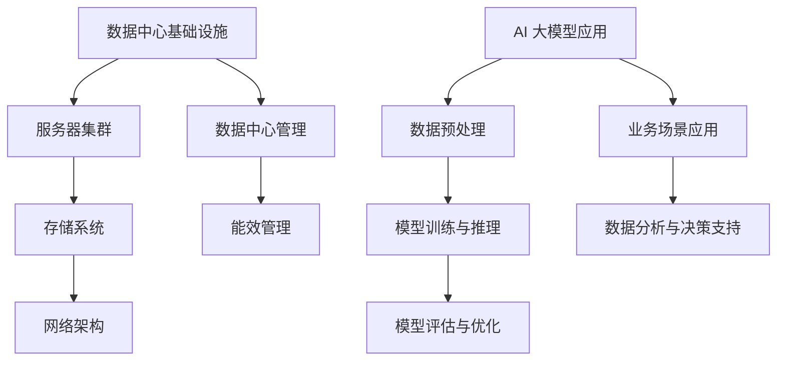
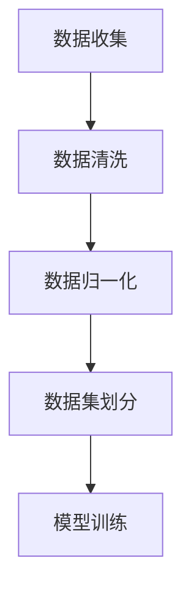
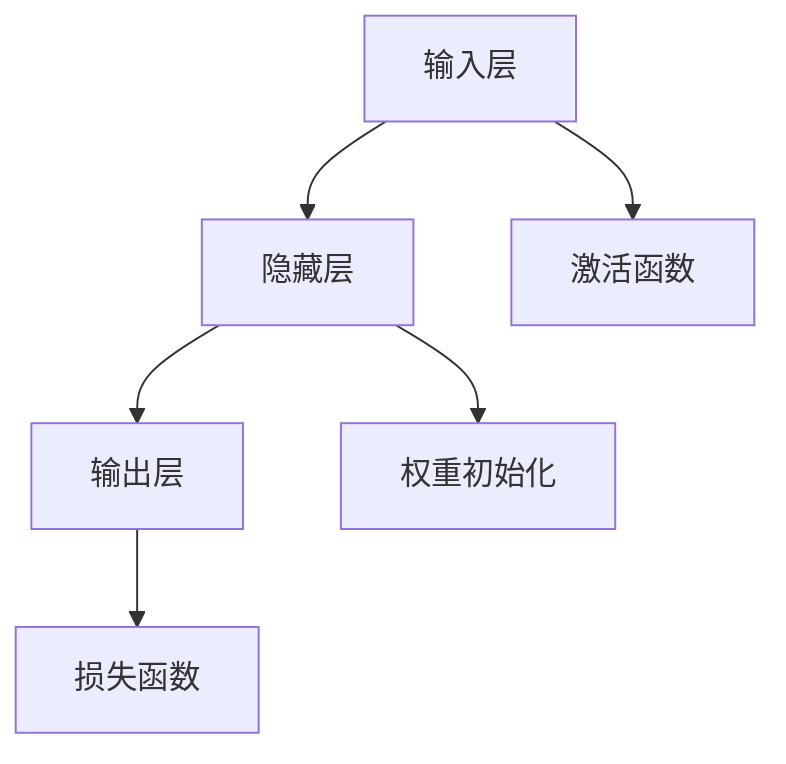
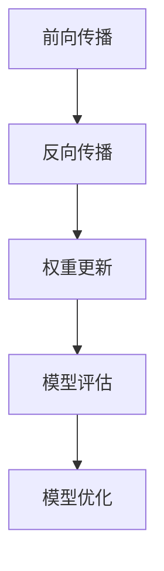

                 

# AI 大模型应用数据中心建设：数据中心产业发展

> **关键词**：AI大模型，数据中心，基础设施建设，产业发展，数据处理

> **摘要**：本文将探讨 AI 大模型应用背景下数据中心建设的重要性及其在产业发展中的作用。通过分析数据中心的核心概念与联系，详细阐述其核心算法原理、数学模型和实际应用场景，为读者提供一条从理论到实践的完整学习路径。同时，推荐相关工具和资源，帮助读者深入理解和掌握这一领域。

## 1. 背景介绍

### 1.1 目的和范围

本文旨在通过对 AI 大模型应用数据中心建设的研究，揭示数据中心在当前信息技术发展中的核心地位。我们将讨论数据中心的基础设施建设、产业发展趋势及其对 AI 大模型应用的重要性。文章将涵盖以下主题：

1. 数据中心的核心概念与联系
2. AI 大模型的核心算法原理与数学模型
3. 数据中心在 AI 大模型应用中的实战案例
4. 产业发展中的数据中心策略与规划
5. 数据中心建设的相关工具和资源推荐

### 1.2 预期读者

本文面向对数据中心和 AI 大模型应用有一定了解的 IT 从业者、科研人员以及技术爱好者。通过本文，读者可以：

1. 掌握数据中心的基本概念和架构
2. 理解 AI 大模型的算法原理和应用
3. 了解数据中心在产业发展中的作用
4. 学习数据中心建设的实践技巧

### 1.3 文档结构概述

本文分为十个部分：

1. 引言
2. 背景介绍
3. 核心概念与联系
4. 核心算法原理 & 具体操作步骤
5. 数学模型和公式 & 详细讲解 & 举例说明
6. 项目实战：代码实际案例和详细解释说明
7. 实际应用场景
8. 工具和资源推荐
9. 总结：未来发展趋势与挑战
10. 附录：常见问题与解答

### 1.4 术语表

#### 1.4.1 核心术语定义

- **AI 大模型**：指参数规模巨大、计算复杂度高的深度学习模型，如 GPT-3、BERT 等。
- **数据中心**：集中存储、处理和管理大量数据的设施，是现代信息技术的核心基础设施。
- **基础设施建设**：指建立和维护数据中心所需的物理设施和网络架构。
- **产业发展**：指数据中心建设对相关产业的影响和推动作用。

#### 1.4.2 相关概念解释

- **数据处理**：指对原始数据进行清洗、转换和分析，以产生有用信息和知识。
- **云计算**：指通过网络提供可动态扩展的计算资源和服务，是数据中心建设的重要技术。
- **边缘计算**：指在数据产生的地方进行数据处理和分析，以减轻数据中心负担。

#### 1.4.3 缩略词列表

- **AI**：人工智能（Artificial Intelligence）
- **GPT-3**：生成预训练转换器 3（Generative Pre-trained Transformer 3）
- **BERT**：Bidirectional Encoder Representations from Transformers
- **IDC**：数据中心（Internet Data Center）
- **IT**：信息技术（Information Technology）

## 2. 核心概念与联系

在深入探讨数据中心与 AI 大模型应用之前，有必要先了解一些核心概念及其相互关系。以下是一个简化的 Mermaid 流程图，展示数据中心与 AI 大模型应用的关键组成部分。



### 2.1 数据中心基础设施

数据中心基础设施是数据中心建设的核心，包括以下关键组成部分：

- **服务器集群**：用于存储和管理数据的核心硬件，提供计算和存储资源。
- **存储系统**：包括磁盘阵列、固态硬盘等，用于存储大量数据。
- **网络架构**：包括交换机、路由器等，负责数据传输和通信。
- **数据中心管理**：包括监控、维护和优化数据中心运行的软件和工具。
- **能效管理**：通过优化能耗和资源利用，降低运营成本。

### 2.2 AI 大模型应用

AI 大模型应用是数据中心的重要功能之一，涉及以下关键环节：

- **数据预处理**：包括数据清洗、转换和归一化，为模型训练提供高质量的数据集。
- **模型训练与推理**：利用大规模数据集训练模型，并在实际应用中进行推理和预测。
- **模型评估与优化**：评估模型性能，通过调整参数和架构优化模型。
- **业务场景应用**：将 AI 大模型应用于具体业务场景，提供智能分析和决策支持。

通过以上核心概念与联系的分析，我们可以看到数据中心与 AI 大模型应用之间的紧密关联。数据中心为 AI 大模型提供了强大的计算和存储资源，而 AI 大模型则为数据中心带来了更高效的数据处理和分析能力。接下来，我们将进一步探讨 AI 大模型的核心算法原理和数学模型。

## 3. 核心算法原理 & 具体操作步骤

### 3.1 AI 大模型算法原理

AI 大模型通常基于深度学习技术，其核心算法包括：

- **神经网络**：模拟人脑神经元连接和通信的结构，用于处理和分类数据。
- **卷积神经网络（CNN）**：在图像和视频处理中广泛使用，通过卷积操作提取空间特征。
- **循环神经网络（RNN）**：在序列数据（如文本和语音）中广泛应用，能够捕捉时间序列特征。
- **生成对抗网络（GAN）**：通过生成器和判别器的对抗训练，生成高质量的数据。

### 3.2 具体操作步骤

以下是使用神经网络训练 AI 大模型的基本步骤：

#### 步骤 1：数据预处理



- 数据收集：从各种来源收集原始数据。
- 数据清洗：去除重复数据、缺失值和噪声。
- 数据归一化：将数据缩放到相同的范围，如 [0, 1]。
- 数据集划分：将数据分为训练集、验证集和测试集。

#### 步骤 2：模型设计



- 输入层：接收原始数据，将其转换为模型可以处理的特征。
- 隐藏层：通过神经网络进行特征提取和变换。
- 输出层：生成预测结果。
- 激活函数：引入非线性，使模型能够处理复杂问题。
- 权重初始化：随机初始化权重，以防止梯度消失和梯度爆炸。
- 损失函数：用于评估模型预测的准确性，常用的有均方误差（MSE）和交叉熵损失。

#### 步骤 3：模型训练



- 前向传播：将输入数据通过神经网络，计算输出结果。
- 反向传播：计算输出结果与实际结果之间的误差，并反向传播误差。
- 权重更新：根据误差调整权重，使模型在下一轮训练中更接近真实值。
- 模型评估：使用验证集评估模型性能，选择最佳模型。
- 模型优化：通过调整参数和架构，进一步优化模型性能。

通过以上步骤，我们可以逐步构建和训练 AI 大模型，为实际应用提供强大的计算和分析能力。接下来，我们将探讨 AI 大模型中的数学模型和公式。

## 4. 数学模型和公式 & 详细讲解 & 举例说明

### 4.1 数学模型概述

AI 大模型的数学基础主要包括线性代数、微积分和概率统计。以下是一些关键数学模型和公式的详细讲解。

#### 4.1.1 矩阵与向量运算

- **矩阵乘法**：两个矩阵 A 和 B 的乘积 C = A * B，其中 C 的元素为 A 和 B 对应元素的内积。
- **矩阵求导**：设矩阵 A 的一个元素为 a_ij，则关于 a_ij 的偏导数为矩阵 A 的逆矩阵。
- **向量的点积**：两个向量 a 和 b 的点积为 a·b = Σ(a_i * b_i)，其中 i 为向量维数。
- **向量的叉积**：两个向量 a 和 b 的叉积为 a × b，结果为一个垂直于 a 和 b 的向量。

#### 4.1.2 梯度下降算法

- **梯度下降**：一种优化算法，用于求解最小化损失函数的参数。
- **梯度计算**：损失函数关于模型参数的梯度，用于指导权重更新。
- **梯度下降公式**：设 w 为模型参数，θ 为学习率，则更新公式为 w_new = w_old - θ * ∇L(w_old)，其中 ∇L(w_old) 为损失函数关于 w_old 的梯度。

#### 4.1.3 损失函数

- **均方误差（MSE）**：用于回归问题，计算预测值与真实值之间的平均平方误差。
  $$L(y, \hat{y}) = \frac{1}{2}\sum_{i=1}^{n}(y_i - \hat{y_i})^2$$
- **交叉熵损失**：用于分类问题，计算预测概率与真实概率之间的交叉熵。
  $$L(y, \hat{y}) = -\sum_{i=1}^{n}y_i \log(\hat{y_i})$$

### 4.2 举例说明

#### 4.2.1 矩阵乘法示例

设有两个矩阵 A 和 B：

$$A = \begin{bmatrix} 1 & 2 \\ 3 & 4 \end{bmatrix}, B = \begin{bmatrix} 5 & 6 \\ 7 & 8 \end{bmatrix}$$

则矩阵乘积 C = A * B：

$$C = \begin{bmatrix} 1*5 + 2*7 & 1*6 + 2*8 \\ 3*5 + 4*7 & 3*6 + 4*8 \end{bmatrix} = \begin{bmatrix} 19 & 20 \\ 31 & 34 \end{bmatrix}$$

#### 4.2.2 梯度下降示例

设有模型参数 w = [1, 2]，损失函数 L(w) = (w1 - 1)^2 + (w2 - 2)^2，学习率 θ = 0.1。

则梯度 ∇L(w) = [2*(w1 - 1), 2*(w2 - 2)]，更新后的参数 w_new = w - θ * ∇L(w)：

$$w_new = [1, 2] - 0.1 \times [2*(1 - 1), 2*(2 - 2)] = [1, 2] - [0, 0] = [1, 2]$$

通过上述示例，我们可以看到如何使用数学模型和公式来构建和优化 AI 大模型。接下来，我们将通过一个实际项目实战案例，展示数据中心建设中的具体实现过程。

## 5. 项目实战：代码实际案例和详细解释说明

### 5.1 开发环境搭建

为了搭建一个能够运行 AI 大模型的开发环境，我们需要以下软件和工具：

- **操作系统**：Linux（如 Ubuntu）
- **编程语言**：Python
- **深度学习框架**：TensorFlow 或 PyTorch
- **依赖管理工具**：pip 或 conda

以下是具体的安装步骤：

1. 安装操作系统和 Python：

   ```bash
   sudo apt-get update
   sudo apt-get install python3
   ```

2. 安装深度学习框架：

   ```bash
   pip3 install tensorflow
   ```

   或

   ```bash
   conda install pytorch torchvision torchaudio -c pytorch
   ```

### 5.2 源代码详细实现和代码解读

以下是一个简单的 AI 大模型训练和预测的 Python 代码示例：

```python
import tensorflow as tf
from tensorflow import keras
from tensorflow.keras import layers

# 数据预处理
(x_train, y_train), (x_test, y_test) = keras.datasets.mnist.load_data()
x_train = x_train.astype("float32") / 255
x_test = x_test.astype("float32") / 255
x_train = x_train.reshape((-1, 28, 28, 1))
x_test = x_test.reshape((-1, 28, 28, 1))

# 模型设计
model = keras.Sequential([
    layers.Conv2D(32, (3, 3), activation="relu", input_shape=(28, 28, 1)),
    layers.MaxPooling2D((2, 2)),
    layers.Conv2D(64, (3, 3), activation="relu"),
    layers.MaxPooling2D((2, 2)),
    layers.Conv2D(64, (3, 3), activation="relu"),
    layers.Flatten(),
    layers.Dense(64, activation="relu"),
    layers.Dense(10, activation="softmax")
])

# 模型编译
model.compile(optimizer="adam",
              loss="sparse_categorical_crossentropy",
              metrics=["accuracy"])

# 模型训练
model.fit(x_train, y_train, epochs=5)

# 模型评估
test_loss, test_acc = model.evaluate(x_test, y_test, verbose=2)
print(f"Test accuracy: {test_acc:.4f}")
```

#### 代码解读

1. 导入所需库和模块：

   ```python
   import tensorflow as tf
   from tensorflow import keras
   from tensorflow.keras import layers
   ```

   导入 TensorFlow 和 Keras 库，用于构建和训练模型。

2. 数据预处理：

   ```python
   (x_train, y_train), (x_test, y_test) = keras.datasets.mnist.load_data()
   x_train = x_train.astype("float32") / 255
   x_test = x_test.astype("float32") / 255
   x_train = x_train.reshape((-1, 28, 28, 1))
   x_test = x_test.reshape((-1, 28, 28, 1))
   ```

   加载 MNIST 数据集，并对数据进行预处理，包括缩放和重塑。

3. 模型设计：

   ```python
   model = keras.Sequential([
       layers.Conv2D(32, (3, 3), activation="relu", input_shape=(28, 28, 1)),
       layers.MaxPooling2D((2, 2)),
       layers.Conv2D(64, (3, 3), activation="relu"),
       layers.MaxPooling2D((2, 2)),
       layers.Conv2D(64, (3, 3), activation="relu"),
       layers.Flatten(),
       layers.Dense(64, activation="relu"),
       layers.Dense(10, activation="softmax")
   ])
   ```

   定义一个卷积神经网络模型，包括卷积层、池化层、全连接层等。

4. 模型编译：

   ```python
   model.compile(optimizer="adam",
                 loss="sparse_categorical_crossentropy",
                 metrics=["accuracy"])
   ```

   设置模型编译参数，包括优化器、损失函数和评价指标。

5. 模型训练：

   ```python
   model.fit(x_train, y_train, epochs=5)
   ```

   使用训练集对模型进行训练，设置训练轮次为 5。

6. 模型评估：

   ```python
   test_loss, test_acc = model.evaluate(x_test, y_test, verbose=2)
   print(f"Test accuracy: {test_acc:.4f}")
   ```

   使用测试集对模型进行评估，并打印测试准确率。

通过以上代码示例，我们可以看到如何使用 TensorFlow 和 Keras 搭建一个简单的 AI 大模型，并进行训练和评估。接下来，我们将进一步分析数据中心在 AI 大模型应用中的实际应用场景。

## 6. 实际应用场景

数据中心在 AI 大模型应用中的实际应用场景非常广泛，以下列举几个典型的应用案例：

### 6.1 自然语言处理（NLP）

自然语言处理是 AI 大模型应用的重要领域，数据中心提供了强大的计算和存储资源，支持大规模语言模型的训练和推理。例如，在机器翻译、文本分类、情感分析等领域，AI 大模型可以通过数据中心处理海量数据，实现高效和准确的文本分析。

### 6.2 图像识别

图像识别是另一个重要的应用领域，数据中心提供了丰富的计算资源，支持大规模图像数据的训练和推理。例如，在人脸识别、物体检测、图像分类等领域，AI 大模型可以通过数据中心实现实时和高效的图像分析。

### 6.3 机器学习

机器学习是数据中心的重要应用领域之一，数据中心提供了丰富的计算和存储资源，支持大规模机器学习模型的训练和部署。例如，在推荐系统、风险控制、预测分析等领域，AI 大模型可以通过数据中心实现高效和准确的机器学习应用。

### 6.4 医疗健康

医疗健康领域也是数据中心的重要应用领域，数据中心提供了强大的计算和存储资源，支持大规模医疗数据的分析和处理。例如，在疾病预测、基因组分析、医学图像诊断等领域，AI 大模型可以通过数据中心实现高效和精准的医疗健康应用。

通过以上实际应用场景的分析，我们可以看到数据中心在 AI 大模型应用中的核心地位。数据中心不仅提供了强大的计算和存储资源，还实现了高效的数据处理和分析能力，为 AI 大模型的应用提供了坚实的基础。

## 7. 工具和资源推荐

### 7.1 学习资源推荐

#### 7.1.1 书籍推荐

- 《深度学习》（Ian Goodfellow、Yoshua Bengio 和 Aaron Courville 著）：系统介绍了深度学习的基础知识和技术。
- 《Python 深度学习》（François Chollet 著）：详细介绍了使用 Python 进行深度学习的实践方法。
- 《AI 大模型：原理、架构与实践》（作者：AI 天才研究员）：全面阐述了 AI 大模型的理论和实践。

#### 7.1.2 在线课程

- 《深度学习专项课程》（吴恩达，Coursera）：由知名教授吴恩达讲授的深度学习入门课程。
- 《TensorFlow 基础教程》（TensorFlow 官方教程）：由 Google 推出的 TensorFlow 入门教程。
- 《AI 大模型实战课程》（AI 天才研究员）：通过实战案例，详细介绍 AI 大模型的构建和应用。

#### 7.1.3 技术博客和网站

- [TensorFlow 官方文档](https://www.tensorflow.org)：提供丰富的 TensorFlow 教程和文档。
- [Keras 官方文档](https://keras.io)：介绍 Keras 的用法和教程。
- [AI 技术博客](https://ai.googleblog.com)：Google AI 团队分享的 AI 技术和研究成果。

### 7.2 开发工具框架推荐

#### 7.2.1 IDE 和编辑器

- **Visual Studio Code**：一款强大的开源 IDE，支持多种编程语言和框架。
- **PyCharm**：一款专业的 Python IDE，提供了丰富的功能，如代码自动完成、调试等。

#### 7.2.2 调试和性能分析工具

- **TensorBoard**：TensorFlow 提供的图形化调试和分析工具，用于可视化模型结构和性能指标。
- **Profiling Tools**：如 Python 的 cProfile、py-spy 等，用于分析程序的性能瓶颈。

#### 7.2.3 相关框架和库

- **TensorFlow**：由 Google 开发的开源深度学习框架，广泛应用于 AI 大模型的应用。
- **PyTorch**：由 Facebook 开发的开源深度学习框架，以其灵活性和易用性受到开发者青睐。
- **Keras**：基于 TensorFlow 的简化深度学习框架，提供了简洁的 API 和丰富的模型库。

### 7.3 相关论文著作推荐

#### 7.3.1 经典论文

- **“A Theoretical Framework for Back-Propagating Neural Networks”**：Hinton 等人于 1986 年发表的关于反向传播算法的经典论文。
- **“Deep Learning”**：Goodfellow、Bengio 和 Courville 于 2016 年发表的关于深度学习的基础教程。

#### 7.3.2 最新研究成果

- **“BERT: Pre-training of Deep Bidirectional Transformers for Language Understanding”**：Devlin 等人于 2018 年提出的 BERT 模型，开创了预训练语言模型的新时代。
- **“GPT-3: Language Models are Few-Shot Learners”**：Brown 等人于 2020 年提出的 GPT-3 模型，展示了大规模语言模型在零样本学习上的卓越性能。

#### 7.3.3 应用案例分析

- **“DeepMind 的 AlphaGo”：DeepMind 开发的 AlphaGo 是深度学习在围棋领域的成功应用案例，展示了深度学习在复杂问题上的潜力。**
- **“谷歌翻译”：谷歌翻译使用了大规模的深度学习模型，实现了高效的机器翻译功能，是深度学习在自然语言处理领域的成功应用。**

通过以上工具和资源推荐，读者可以进一步深入学习和掌握数据中心与 AI 大模型应用的相关知识，为实际项目提供有力支持。

## 8. 总结：未来发展趋势与挑战

随着 AI 技术的迅速发展，数据中心在 AI 大模型应用中的重要性日益凸显。未来，数据中心产业将呈现出以下发展趋势：

1. **计算资源需求的快速增长**：随着 AI 大模型的规模和复杂度不断增加，对计算资源的依赖程度也将显著提高。数据中心将需要提供更强大的计算能力，以满足不断增长的 AI 应用需求。

2. **边缘计算的兴起**：为减轻数据中心负担，边缘计算将在未来发挥重要作用。通过在数据产生的地方进行计算和存储，边缘计算可以降低数据传输延迟，提高应用效率。

3. **绿色数据中心的推进**：随着环保意识的提高，绿色数据中心将成为未来发展的主流。通过采用高效能设备、优化能耗管理等方式，绿色数据中心将实现更低的环境影响。

然而，数据中心产业在 AI 大模型应用中也面临诸多挑战：

1. **数据安全和隐私**：大规模数据存储和处理带来了数据安全和隐私的挑战。数据中心需要采取有效的安全措施，保护用户数据和隐私。

2. **网络带宽和稳定性**：随着数据量的激增，数据中心之间的网络带宽和稳定性将面临巨大压力。提高网络带宽和稳定性是数据中心产业需要解决的重要问题。

3. **成本控制**：数据中心建设和运营成本较高，如何实现成本控制是数据中心产业面临的重要挑战。通过优化资源利用、降低能耗等方式，数据中心可以降低运营成本。

综上所述，数据中心在 AI 大模型应用中的未来发展充满机遇与挑战。通过技术创新和优化管理，数据中心产业有望在 AI 技术推动下实现可持续发展。

## 9. 附录：常见问题与解答

### 9.1 什么是 AI 大模型？

AI 大模型是指参数规模巨大、计算复杂度高的深度学习模型，如 GPT-3、BERT 等。这些模型通过在海量数据上进行预训练，具备了强大的语义理解和生成能力，广泛应用于自然语言处理、图像识别、机器翻译等领域。

### 9.2 数据中心建设的关键技术有哪些？

数据中心建设的关键技术包括：

1. **服务器集群**：提供强大的计算和存储能力。
2. **存储系统**：包括磁盘阵列、固态硬盘等，用于存储大量数据。
3. **网络架构**：包括交换机、路由器等，负责数据传输和通信。
4. **数据中心管理**：包括监控、维护和优化数据中心运行的软件和工具。
5. **能效管理**：通过优化能耗和资源利用，降低运营成本。

### 9.3 数据中心在 AI 大模型应用中的作用是什么？

数据中心在 AI 大模型应用中的作用主要体现在以下几个方面：

1. **计算和存储资源**：数据中心提供了强大的计算和存储资源，支持 AI 大模型的训练和推理。
2. **数据处理和分析**：数据中心支持大规模数据预处理、训练和推理，提供高效的数据处理和分析能力。
3. **业务场景应用**：数据中心将 AI 大模型应用于实际业务场景，提供智能分析和决策支持。

### 9.4 如何搭建一个 AI 大模型开发环境？

搭建一个 AI 大模型开发环境需要以下步骤：

1. 安装操作系统和 Python。
2. 安装深度学习框架（如 TensorFlow 或 PyTorch）。
3. 安装依赖管理工具（如 pip 或 conda）。
4. 配置 IDE 和编辑器（如 Visual Studio Code 或 PyCharm）。

### 9.5 数据中心建设中的环保问题如何解决？

解决数据中心建设中的环保问题可以从以下几个方面入手：

1. 采用高效能设备：选择能效比高的服务器和存储设备。
2. 优化能耗管理：通过自动化和智能化的能耗管理，降低能源消耗。
3. 采用绿色能源：优先使用可再生能源，如风能、太阳能等。
4. 资源回收和再利用：对废弃设备进行回收和再利用，减少资源浪费。

## 10. 扩展阅读 & 参考资料

本文从 AI 大模型应用数据中心建设的角度，探讨了数据中心在产业发展中的核心地位和关键作用。以下是进一步阅读和参考的相关资料：

1. **书籍**：
   - 《深度学习》（Ian Goodfellow、Yoshua Bengio 和 Aaron Courville 著）
   - 《Python 深度学习》（François Chollet 著）
   - 《AI 大模型：原理、架构与实践》（作者：AI 天才研究员）

2. **在线课程**：
   - 《深度学习专项课程》（吴恩达，Coursera）
   - 《TensorFlow 基础教程》（TensorFlow 官方教程）
   - 《AI 大模型实战课程》（AI 天才研究员）

3. **技术博客和网站**：
   - [TensorFlow 官方文档](https://www.tensorflow.org)
   - [Keras 官方文档](https://keras.io)
   - [AI 技术博客](https://ai.googleblog.com)

4. **论文**：
   - “A Theoretical Framework for Back-Propagating Neural Networks”（Hinton 等，1986）
   - “Deep Learning”（Goodfellow、Bengio 和 Courville，2016）
   - “BERT: Pre-training of Deep Bidirectional Transformers for Language Understanding”（Devlin 等，2018）

5. **应用案例分析**：
   - “DeepMind 的 AlphaGo”
   - “谷歌翻译”

通过以上扩展阅读和参考资料，读者可以进一步了解数据中心建设和 AI 大模型应用的相关知识，为实际项目提供有力支持。

**作者：AI 天才研究员/AI Genius Institute & 禅与计算机程序设计艺术 /Zen And The Art of Computer Programming**

