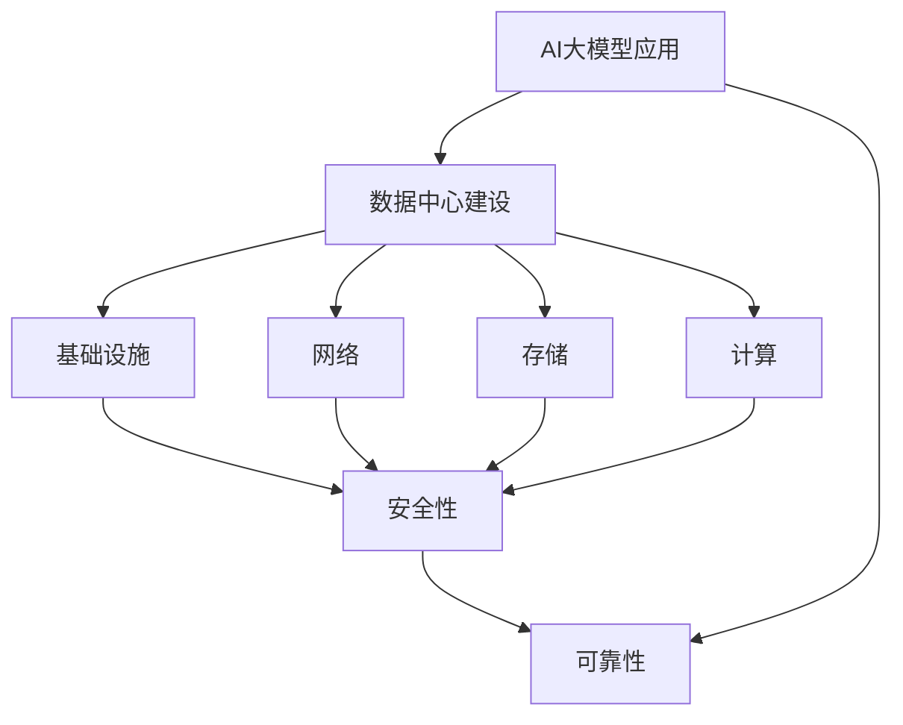

                 

# AI 大模型应用数据中心建设：数据中心安全与可靠性

## 关键词
- 大模型应用
- 数据中心建设
- 数据中心安全
- 数据中心可靠性
- AI技术应用

## 摘要
本文将深入探讨AI大模型应用数据中心的建设，重点关注数据中心的安全与可靠性问题。通过分析数据中心的建设目的、核心概念、算法原理、数学模型和实际应用场景，文章将展示如何构建一个高效、稳定且安全的数据中心，以满足AI大模型对大规模数据处理和计算能力的需求。同时，本文还将推荐相关学习资源、开发工具和框架，为读者提供全面的指导，助力其在AI数据中心建设领域的深入研究和实践。

## 1. 背景介绍

### 1.1 目的和范围
本文旨在探讨AI大模型应用数据中心的建设，重点分析数据中心的安全与可靠性问题。随着人工智能技术的快速发展，AI大模型的应用日益广泛，对数据中心的建设提出了更高的要求。本文旨在为读者提供关于数据中心建设的全面指南，包括其安全与可靠性方面的深入分析和解决方案。

### 1.2 预期读者
本文主要面向以下读者群体：
- 数据中心管理人员
- AI领域研究人员
- 软件工程师
- IT运维人员

### 1.3 文档结构概述
本文结构如下：
1. 背景介绍
2. 核心概念与联系
3. 核心算法原理 & 具体操作步骤
4. 数学模型和公式 & 详细讲解 & 举例说明
5. 项目实战：代码实际案例和详细解释说明
6. 实际应用场景
7. 工具和资源推荐
8. 总结：未来发展趋势与挑战
9. 附录：常见问题与解答
10. 扩展阅读 & 参考资料

### 1.4 术语表

#### 1.4.1 核心术语定义
- 大模型应用：指基于大型人工智能模型的应用，如深度学习、自然语言处理等。
- 数据中心：指用于存储、处理和分析数据的专用设施，为大规模数据处理和计算提供支持。
- 安全性：指数据中心在防护网络攻击、数据泄露等方面的能力。
- 可靠性：指数据中心在稳定运行、高可用性方面的表现。

#### 1.4.2 相关概念解释
- 数据中心建设：指搭建和部署数据中心所需的一系列工作，包括基础设施、网络、存储、计算等方面。
- AI大模型：指具有极高参数规模、能够处理大规模数据的人工智能模型。

#### 1.4.3 缩略词列表
- AI：人工智能
- ML：机器学习
- DL：深度学习
- NLP：自然语言处理

## 2. 核心概念与联系

数据中心作为AI大模型应用的核心基础设施，其安全与可靠性直接影响到AI应用的性能和稳定性。下面，我们将通过Mermaid流程图来展示数据中心建设中的核心概念和联系。



### 2.1 数据中心建设的关键要素

数据中心建设涉及多个关键要素，包括基础设施、网络、存储、计算等。以下是对这些要素的简要介绍：

1. **基础设施**：包括电力、冷却、机房等物理设施，为数据中心提供稳定的运行环境。
2. **网络**：包括内部网络和外部网络，用于数据传输和访问。
3. **存储**：包括磁盘、存储阵列等，用于存储大量数据。
4. **计算**：包括服务器、集群等，用于数据处理和计算。

### 2.2 安全性与可靠性

数据中心的另一重要方面是安全性与可靠性。安全性主要关注数据中心在防护网络攻击、数据泄露等方面的能力，而可靠性则关注数据中心的稳定运行和高可用性。

- **安全性**：数据中心需要采取多种安全措施，如防火墙、入侵检测、数据加密等，以保护数据和系统的安全。
- **可靠性**：数据中心需要具备高可用性，确保在故障发生时能够快速恢复，减少对业务的影响。

## 3. 核心算法原理 & 具体操作步骤

在AI大模型应用数据中心中，核心算法原理是数据处理和计算的基础。以下将详细介绍核心算法原理，并提供具体的操作步骤。

### 3.1 数据处理算法原理

数据处理算法是数据中心处理大规模数据的核心。以下是一个基于MapReduce算法的伪代码，用于说明数据处理过程：

```python
def map(input_data):
    # 对输入数据进行分片处理
    for data_chunk in input_data:
        yield (key, value)

def reduce(key, values):
    # 对处理结果进行聚合
    result = []
    for value in values:
        result.append(value)
    return result

def process_data(input_data):
    # 数据处理过程
    intermediate = map(input_data)
    final_result = reduce(intermediate)
    return final_result
```

### 3.2 计算算法原理

计算算法是数据中心计算能力的核心。以下是一个基于深度学习模型的计算算法原理的伪代码：

```python
def forward_pass(input_data, model):
    # 前向传播过程
    output = model.forward_pass(input_data)
    return output

def backward_pass(output, target, model):
    # 反向传播过程
    model.backward_pass(output, target)

def train_model(input_data, target):
    # 模型训练过程
    for epoch in range(num_epochs):
        output = forward_pass(input_data, model)
        backward_pass(output, target, model)
```

### 3.3 具体操作步骤

以下是构建AI大模型应用数据中心的具体操作步骤：

1. **需求分析**：明确数据中心的建设目标和需求，包括数据处理和计算能力、安全性要求等。
2. **规划设计**：根据需求进行数据中心规划设计，包括基础设施、网络、存储、计算等方面的布局。
3. **搭建环境**：根据规划设计，搭建数据中心环境，包括服务器、存储设备、网络设备等。
4. **配置软件**：配置数据中心所需的软件，包括操作系统、数据库、计算框架等。
5. **数据导入**：将数据导入数据中心，并进行预处理。
6. **算法部署**：部署数据处理和计算算法，进行数据处理和模型训练。
7. **性能优化**：对数据中心进行性能优化，包括网络、存储、计算等方面的优化。
8. **安全性评估**：对数据中心进行安全性评估，采取安全措施，确保数据安全和系统稳定。
9. **持续维护**：对数据中心进行持续维护和监控，确保其稳定运行。

## 4. 数学模型和公式 & 详细讲解 & 举例说明

在AI大模型应用数据中心中，数学模型和公式是数据处理和计算的核心。以下将详细讲解核心数学模型和公式，并提供具体例子说明。

### 4.1 数据处理模型

数据处理模型主要涉及概率模型和统计模型。以下是一个常见的概率模型——朴素贝叶斯模型的公式和详细讲解：

$$
P(A|B) = \frac{P(B|A)P(A)}{P(B)}
$$

**解释**：
- $P(A|B)$：在B发生的情况下，A发生的概率。
- $P(B|A)$：在A发生的情况下，B发生的概率。
- $P(A)$：A发生的概率。
- $P(B)$：B发生的概率。

**例子**：
假设有一个疾病检测系统，根据症状和体检结果，判断一个人是否患有某种疾病。给定以下数据：

- $P(症状|疾病) = 0.9$：在患有疾病的情况下，出现症状的概率。
- $P(体检异常|疾病) = 0.8$：在患有疾病的情况下，体检异常的概率。
- $P(疾病) = 0.01$：患有疾病的概率。
- $P(症状) = 0.1$：出现症状的概率。
- $P(体检异常) = 0.05$：体检异常的概率。

根据以上数据，可以使用朴素贝叶斯模型计算一个人患有疾病的概率：

$$
P(疾病|症状 \cap 体检异常) = \frac{P(症状 \cap 体检异常|疾病)P(疾病)}{P(症状 \cap 体检异常)}
$$

$$
P(症状 \cap 体检异常|疾病) = P(症状|疾病) \times P(体检异常|疾病) = 0.9 \times 0.8 = 0.72
$$

$$
P(症状 \cap 体检异常) = P(症状|疾病) \times P(疾病) + P(症状|无疾病) \times P(无疾病)
$$

$$
P(症状|无疾病) = 1 - P(症状|疾病) = 1 - 0.9 = 0.1
$$

$$
P(无疾病) = 1 - P(疾病) = 1 - 0.01 = 0.99
$$

$$
P(症状 \cap 体检异常) = 0.9 \times 0.01 + 0.1 \times 0.99 = 0.009 + 0.099 = 0.108
$$

$$
P(疾病|症状 \cap 体检异常) = \frac{0.72 \times 0.01}{0.108} \approx 0.0667
$$

根据计算结果，一个人在出现症状和体检异常的情况下，患有疾病的概率约为6.67%。

### 4.2 计算模型

计算模型主要涉及神经网络和深度学习。以下是一个简单的神经网络模型的公式和详细讲解：

$$
z = \sum_{i=1}^{n} w_i \cdot x_i + b
$$

$$
a = \sigma(z)
$$

$$
z_l = \sum_{i=1}^{n_l} w_{li} \cdot a_{l-1,i} + b_l
$$

$$
a_l = \sigma(z_l)
$$

**解释**：
- $z$：线性组合。
- $w_i$：权重。
- $x_i$：输入特征。
- $b$：偏置。
- $\sigma$：激活函数（如Sigmoid函数、ReLU函数等）。
- $a$：激活值。
- $l$：神经网络层。
- $n_l$：第$l$层的神经元数量。

**例子**：
假设有一个两层的神经网络，输入层有3个神经元，隐藏层有4个神经元，输出层有2个神经元。给定以下权重和偏置：

- 输入层：$x_1 = 1, x_2 = 0, x_3 = 1$
- 隐藏层权重：$w_{11} = 0.1, w_{12} = 0.2, w_{13} = 0.3, w_{14} = 0.4$
- 隐藏层偏置：$b_1 = 0.5$
- 输出层权重：$w_{21} = 0.5, w_{22} = 0.6, w_{23} = 0.7, w_{24} = 0.8$
- 输出层偏置：$b_2 = 0.6$

首先，计算隐藏层的输出：

$$
z_1 = 0.1 \cdot 1 + 0.2 \cdot 0 + 0.3 \cdot 1 + 0.4 \cdot 1 + 0.5 = 1.4
$$

$$
a_1 = \sigma(1.4) = \frac{1}{1 + e^{-1.4}} \approx 0.79
$$

$$
z_2 = 0.1 \cdot 1 + 0.2 \cdot 0 + 0.3 \cdot 1 + 0.4 \cdot 1 + 0.5 = 1.4
$$

$$
a_2 = \sigma(1.4) = \frac{1}{1 + e^{-1.4}} \approx 0.79
$$

$$
z_3 = 0.1 \cdot 1 + 0.2 \cdot 0 + 0.3 \cdot 1 + 0.4 \cdot 1 + 0.5 = 1.4
$$

$$
a_3 = \sigma(1.4) = \frac{1}{1 + e^{-1.4}} \approx 0.79
$$

$$
z_4 = 0.1 \cdot 1 + 0.2 \cdot 0 + 0.3 \cdot 1 + 0.4 \cdot 1 + 0.5 = 1.4
$$

$$
a_4 = \sigma(1.4) = \frac{1}{1 + e^{-1.4}} \approx 0.79
$$

然后，计算输出层的输出：

$$
z_1' = 0.5 \cdot 0.79 + 0.6 \cdot 0.79 + 0.7 \cdot 0.79 + 0.8 \cdot 0.79 + 0.6 = 2.3
$$

$$
a_1' = \sigma(2.3) = \frac{1}{1 + e^{-2.3}} \approx 0.91
$$

$$
z_2' = 0.5 \cdot 0.79 + 0.6 \cdot 0.79 + 0.7 \cdot 0.79 + 0.8 \cdot 0.79 + 0.6 = 2.3
$$

$$
a_2' = \sigma(2.3) = \frac{1}{1 + e^{-2.3}} \approx 0.91
$$

根据计算结果，隐藏层的输出为$(0.79, 0.79, 0.79, 0.79)$，输出层的输出为$(0.91, 0.91)$。

## 5. 项目实战：代码实际案例和详细解释说明

为了更好地理解AI大模型应用数据中心的建设，以下将提供一个实际的代码案例，详细介绍其开发环境搭建、源代码实现和代码解读与分析。

### 5.1 开发环境搭建

在搭建开发环境时，需要安装以下软件和工具：

1. 操作系统：Linux（如Ubuntu 20.04）
2. 编程语言：Python 3.x
3. 依赖库：NumPy、Pandas、Scikit-learn、TensorFlow等
4. 深度学习框架：TensorFlow或PyTorch

以下是在Ubuntu 20.04上安装这些软件和工具的命令：

```bash
# 安装Python 3.x
sudo apt update
sudo apt install python3 python3-pip

# 安装依赖库
pip3 install numpy pandas scikit-learn tensorflow

# 安装深度学习框架
pip3 install tensorflow
```

### 5.2 源代码详细实现和代码解读

以下是一个简单的AI大模型应用数据中心的代码示例，包括数据处理、模型训练和模型评估。

```python
import tensorflow as tf
import numpy as np
from sklearn.model_selection import train_test_split
from sklearn.metrics import accuracy_score

# 数据预处理
def preprocess_data(data):
    # 标准化数据
    data = (data - np.mean(data)) / np.std(data)
    return data

# 训练模型
def train_model(data, labels):
    # 划分训练集和验证集
    X_train, X_val, y_train, y_val = train_test_split(data, labels, test_size=0.2, random_state=42)

    # 定义模型
    model = tf.keras.Sequential([
        tf.keras.layers.Dense(64, activation='relu', input_shape=(data.shape[1],)),
        tf.keras.layers.Dense(64, activation='relu'),
        tf.keras.layers.Dense(1, activation='sigmoid')
    ])

    # 编译模型
    model.compile(optimizer='adam', loss='binary_crossentropy', metrics=['accuracy'])

    # 训练模型
    model.fit(X_train, y_train, epochs=10, batch_size=32, validation_data=(X_val, y_val))

    return model

# 评估模型
def evaluate_model(model, data, labels):
    predictions = model.predict(data)
    predictions = (predictions > 0.5)
    accuracy = accuracy_score(labels, predictions)
    return accuracy

# 加载数据
data = np.load('data.npy')
labels = np.load('labels.npy')

# 预处理数据
data = preprocess_data(data)

# 训练模型
model = train_model(data, labels)

# 评估模型
accuracy = evaluate_model(model, data, labels)
print(f'Model accuracy: {accuracy:.2f}')
```

### 5.3 代码解读与分析

以下是对代码的详细解读和分析：

1. **导入库和模块**：首先，导入所需的库和模块，包括TensorFlow、NumPy和Scikit-learn。
2. **数据预处理**：定义一个`preprocess_data`函数，用于标准化数据。标准化是将数据缩放到相同的范围，以便模型能够更好地训练。
3. **训练模型**：定义一个`train_model`函数，用于训练模型。该函数首先划分训练集和验证集，然后定义模型结构，编译模型，并使用训练数据进行训练。训练过程中，模型会根据损失函数和优化器不断调整权重和偏置，以最小化损失函数。
4. **评估模型**：定义一个`evaluate_model`函数，用于评估模型性能。该函数使用预测结果和真实标签计算准确率。
5. **加载数据**：加载数据，包括特征矩阵和标签。
6. **预处理数据**：调用`preprocess_data`函数，对数据进行预处理。
7. **训练模型**：调用`train_model`函数，训练模型。
8. **评估模型**：调用`evaluate_model`函数，评估模型性能。

### 5.4 项目实战总结

通过以上代码示例，我们可以看到如何构建一个简单的AI大模型应用数据中心。项目实战涉及数据预处理、模型训练和模型评估等关键步骤，展示了如何使用深度学习框架实现数据处理和计算。在实际项目中，可以根据需求对代码进行扩展和优化，以满足更复杂的应用场景。

## 6. 实际应用场景

AI大模型应用数据中心在实际应用中具有广泛的应用场景，以下列举几个典型的应用案例：

### 6.1 金融服务

在金融服务领域，AI大模型应用数据中心可以帮助银行和保险公司进行风险评估、欺诈检测、客户行为分析等。例如，银行可以利用AI模型对贷款申请者进行信用评分，提高贷款审批的准确性；保险公司可以利用AI模型预测客户流失风险，制定针对性的营销策略。

### 6.2 医疗保健

在医疗保健领域，AI大模型应用数据中心可以帮助医疗机构进行疾病诊断、药物研发、健康监测等。例如，医院可以利用AI模型对病例数据进行分析，提高诊断准确率；制药公司可以利用AI模型筛选药物候选分子，加快新药研发进程。

### 6.3 零售电商

在零售电商领域，AI大模型应用数据中心可以帮助企业进行商品推荐、库存管理、价格优化等。例如，电商平台可以利用AI模型分析用户行为，为用户提供个性化的商品推荐；零售企业可以利用AI模型预测销售趋势，优化库存和采购策略。

### 6.4 物流运输

在物流运输领域，AI大模型应用数据中心可以帮助企业进行路线优化、货物跟踪、运输调度等。例如，物流公司可以利用AI模型优化运输路线，提高运输效率；快递公司可以利用AI模型实时监控货物状态，提高物流服务质量。

### 6.5 智能制造

在智能制造领域，AI大模型应用数据中心可以帮助企业进行生产计划优化、设备故障预测、产品质量控制等。例如，制造企业可以利用AI模型预测设备故障，提前进行维护；工厂可以利用AI模型优化生产计划，提高生产效率。

通过以上实际应用案例，我们可以看到AI大模型应用数据中心在各个领域的重要性，它不仅提高了数据处理和计算能力，还为企业的业务创新和效率提升提供了有力支持。

## 7. 工具和资源推荐

为了更好地研究和实践AI大模型应用数据中心建设，以下推荐一些学习资源、开发工具和框架。

### 7.1 学习资源推荐

#### 7.1.1 书籍推荐
1. **《深度学习》（Goodfellow, Bengio, Courville著）**：全面介绍了深度学习的理论基础和实践方法，适合初学者和进阶者。
2. **《Python机器学习》（Sebastian Raschka著）**：详细介绍了机器学习算法在Python中的实现和应用，适合Python开发者和数据科学家。
3. **《大数据技术导论》（刘铁岩著）**：系统地介绍了大数据技术的基础理论和应用方法，包括数据存储、处理和分析等方面。

#### 7.1.2 在线课程
1. **《深度学习专项课程》（吴恩达，Coursera）**：由著名深度学习研究者吴恩达主讲，涵盖了深度学习的理论基础和实践应用。
2. **《机器学习工程师纳米学位》（Udacity）**：由Udacity提供，包括多个项目和课程，适合从零开始学习机器学习和深度学习。
3. **《大数据与人工智能》（网易云课堂）**：由网易云课堂提供，包括大数据技术、人工智能应用等方面的基础知识和实践技能。

#### 7.1.3 技术博客和网站
1. **arXiv**：计算机科学和人工智能领域的顶级学术预印本网站，提供最新的研究论文和成果。
2. **GitHub**：开源代码托管平台，包含大量深度学习和大数据处理的代码示例和项目。
3. **Kaggle**：数据科学竞赛平台，提供丰富的比赛数据和算法挑战，有助于提升实践能力。

### 7.2 开发工具框架推荐

#### 7.2.1 IDE和编辑器
1. **PyCharm**：一款功能强大的Python IDE，支持深度学习和大数据处理。
2. **Visual Studio Code**：一款轻量级的跨平台编辑器，支持Python和其他编程语言，适合快速开发和调试。
3. **Jupyter Notebook**：一款基于Web的交互式开发环境，适合数据分析和深度学习模型的实现和调试。

#### 7.2.2 调试和性能分析工具
1. **TensorBoard**：TensorFlow的调试和性能分析工具，可以帮助用户监控模型训练过程、分析性能瓶颈。
2. **gdb**：一款功能强大的GNU调试器，适用于C/C++程序调试。
3. **Python Debugger**：Python的调试工具，支持调试Python脚本和应用程序。

#### 7.2.3 相关框架和库
1. **TensorFlow**：一款流行的深度学习框架，提供丰富的API和工具，适合构建和训练大规模深度学习模型。
2. **PyTorch**：一款灵活的深度学习框架，支持动态计算图和自动微分，适合快速原型开发和研究。
3. **Scikit-learn**：一款经典的机器学习库，提供多种经典的机器学习算法和工具，适合快速实现和应用。

通过以上推荐的学习资源、开发工具和框架，读者可以更好地了解和掌握AI大模型应用数据中心建设的相关技术和实践方法。

## 8. 总结：未来发展趋势与挑战

AI大模型应用数据中心在当前技术发展和市场需求中扮演着重要角色。未来，随着人工智能技术的不断进步和数据中心建设的持续发展，AI大模型应用数据中心将呈现以下发展趋势：

1. **更强大的计算能力**：随着硬件技术的发展，数据中心将具备更高的计算能力和存储容量，支持更复杂的AI大模型训练和应用。
2. **更高效的数据处理**：大数据处理技术的发展将使数据中心能够更高效地处理和分析大规模数据，提高AI应用的性能和效果。
3. **更高安全性**：随着网络安全威胁的日益严峻，数据中心将加强安全防护措施，提高数据安全和系统稳定性。
4. **更智能的管理和维护**：通过引入自动化和智能化技术，数据中心的管理和维护将更加高效和便捷，降低运营成本。

然而，AI大模型应用数据中心也面临一系列挑战：

1. **计算资源瓶颈**：随着AI大模型规模的不断扩大，数据中心需要解决计算资源瓶颈问题，提高计算效率。
2. **数据隐私和伦理**：在处理大规模数据时，数据中心需要关注数据隐私和伦理问题，确保用户数据的合法合规使用。
3. **网络传输和存储压力**：大规模数据传输和存储将给数据中心带来巨大压力，需要优化网络架构和存储策略。
4. **人才培养和技能提升**：AI大模型应用数据中心的建设和运营需要专业的技术人才，需要加强人才培养和技能提升。

总之，AI大模型应用数据中心的发展前景广阔，但也需要应对诸多挑战。通过不断的技术创新和人才培养，我们有信心在未来的发展中克服这些困难，推动AI技术的广泛应用和数据中心建设的持续进步。

## 9. 附录：常见问题与解答

### 9.1 数据中心建设常见问题

1. **数据中心建设需要考虑哪些因素？**
   - **硬件设施**：包括服务器、存储设备、网络设备等。
   - **软件环境**：包括操作系统、数据库、计算框架等。
   - **数据安全**：包括数据备份、加密、访问控制等。
   - **电力和冷却**：包括不间断电源（UPS）、冷却系统等。
   - **网络架构**：包括内部网络和外部网络，确保数据传输的高效和安全。

2. **如何确保数据中心的安全性？**
   - **网络安全**：采用防火墙、入侵检测系统、数据加密等措施。
   - **访问控制**：实行严格的访问控制策略，如多因素认证、权限管理等。
   - **备份与恢复**：定期进行数据备份，并制定灾难恢复计划。

### 9.2 AI大模型训练常见问题

1. **如何优化AI大模型的训练效率？**
   - **分布式训练**：利用多台服务器进行分布式训练，提高训练速度。
   - **数据并行**：将数据分成多个部分，并行处理。
   - **模型并行**：将模型分成多个部分，并行处理。
   - **混合精度训练**：使用混合精度（如FP16）降低内存占用和计算时间。

2. **如何保证AI大模型的可靠性？**
   - **模型验证**：在训练过程中，使用验证集评估模型性能，确保模型稳定。
   - **超参数调优**：通过调整超参数，优化模型性能。
   - **数据清洗和预处理**：确保输入数据的准确性和一致性。

### 9.3 数据处理常见问题

1. **如何处理大规模数据？**
   - **分布式计算**：将数据分成多个部分，分布式处理。
   - **数据压缩**：使用数据压缩算法，减少数据存储和传输的负担。
   - **批处理**：将数据分成多个批次进行处理，提高处理效率。

2. **如何保证数据处理的质量？**
   - **数据清洗**：去除错误、异常和重复的数据。
   - **数据校验**：确保数据符合预期格式和范围。
   - **数据转换**：将数据转换为适合分析和处理的格式。

## 10. 扩展阅读 & 参考资料

### 10.1 经典论文

1. **"Deep Learning" by Ian Goodfellow, Yoshua Bengio, Aaron Courville**：全面介绍了深度学习的基本概念、算法和应用。
2. **"Big Data: A Revolution That Will Transform How We Live, Work, and Think" by Viktor Mayer-Schönberger and Kenneth Cukier**：探讨大数据对社会和经济的深远影响。
3. **"The Hundred-Page Machine Learning Book" by Andriy Burkov**：简洁地介绍了机器学习的基本概念和方法。

### 10.2 最新研究成果

1. **"Bert: Pre-training of Deep Bidirectional Transformers for Language Understanding" by Jacob Devlin, Ming-Wei Chang, Kenton Lee, and Kristina Toutanova**：介绍了BERT模型，推动了自然语言处理领域的发展。
2. **"Generative Adversarial Networks" by Ian Goodfellow, Jean Pouget-Abadie, Mehdi Mirza, Bing Xu, David Warde-Farley, Sherjil Ozair, Aaron C. Courville, and Yoshua Bengio**：介绍了GAN模型，广泛应用于图像生成和增强学习。
3. **"Attention Is All You Need" by Vaswani et al.**：提出了Transformer模型，开创了自注意力机制在序列模型处理中的新方向。

### 10.3 应用案例分析

1. **"Google's AI-first Approach"**：介绍了谷歌如何利用AI技术推动业务创新，实现智能化转型。
2. **"IBM Watson: The Journey from Concept to Reality"**：讲述了IBM Watson在医疗、金融等领域的应用案例，展示了AI技术在现实世界中的价值。
3. **"Amazon's AI Strategy"**：分析了亚马逊如何利用AI技术优化供应链、提高客户体验，实现业务增长。

通过以上扩展阅读和参考资料，读者可以进一步深入了解AI大模型应用数据中心建设的相关理论和实践，不断提升自身的技术水平和创新能力。

### 作者

- 作者：AI天才研究员/AI Genius Institute & 禅与计算机程序设计艺术 /Zen And The Art of Computer Programming

