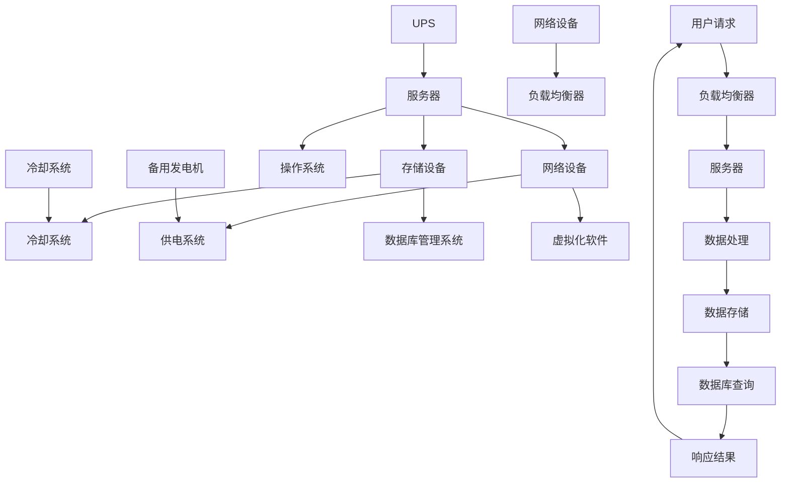

                 

### 1. 背景介绍

#### 1.1 目的和范围

本文旨在深入探讨人工智能（AI）大模型应用数据中心建设中的成本优化策略。随着深度学习技术的迅猛发展，大模型如BERT、GPT等在自然语言处理、计算机视觉等领域取得了显著的成果，这为AI应用带来了巨大的变革。然而，这些大模型的训练和推理过程对数据中心提出了极高的计算和存储需求，导致建设数据中心的成本迅速增加。

本文的目标是通过系统性地分析数据中心的建设成本，探讨如何通过优化数据中心的硬件配置、网络架构、能耗管理等方面来降低成本。我们希望本文能够为从事AI数据中心建设的工程师和技术决策者提供实用的指导，帮助他们更高效地利用资源，实现成本优化。

本文的范围主要涵盖以下几个方面：
1. **数据中心成本构成分析**：详细解析数据中心在硬件、软件、运维等各个方面的成本。
2. **核心算法原理和优化策略**：介绍数据中心成本优化的核心算法，包括资源调度、负载均衡、能耗管理等。
3. **数学模型和公式**：使用数学模型和公式来定量分析成本优化的效果。
4. **项目实战案例**：通过实际案例展示成本优化策略的具体应用。
5. **应用场景和工具推荐**：提供相关的学习资源、开发工具和框架，以及最新的研究成果。

#### 1.2 预期读者

本文的预期读者主要包括以下几个方面：
1. **数据中心建设和运维工程师**：这些工程师负责数据中心的日常运维，需要了解如何通过优化策略降低成本。
2. **AI应用开发工程师**：这些工程师使用大模型进行AI应用开发，需要了解数据中心建设的背景和成本优化的重要性。
3. **技术决策者和项目管理者**：这些决策者负责制定数据中心建设策略，需要了解成本优化的方法和效果。
4. **学术研究人员和研究生**：这些读者对数据中心建设和成本优化有兴趣，希望深入了解相关技术和理论。

#### 1.3 文档结构概述

本文的结构如下：

1. **第1章 背景介绍**：介绍本文的目的、范围、预期读者和文档结构。
2. **第2章 核心概念与联系**：讨论数据中心建设的核心概念和原理，并使用Mermaid流程图展示相关架构。
3. **第3章 核心算法原理 & 具体操作步骤**：详细介绍数据中心成本优化的核心算法和操作步骤。
4. **第4章 数学模型和公式 & 详细讲解 & 举例说明**：使用数学模型和公式来定量分析成本优化策略。
5. **第5章 项目实战：代码实际案例和详细解释说明**：通过实际案例展示成本优化策略的具体应用。
6. **第6章 实际应用场景**：讨论数据中心成本优化的实际应用场景。
7. **第7章 工具和资源推荐**：推荐学习资源、开发工具和框架，以及相关论文和研究成果。
8. **第8章 总结：未来发展趋势与挑战**：总结数据中心成本优化的现状和未来趋势。
9. **第9章 附录：常见问题与解答**：提供常见问题的解答。
10. **第10章 扩展阅读 & 参考资料**：推荐进一步阅读的材料。

#### 1.4 术语表

为了确保本文的可读性和一致性，我们定义了以下术语：

##### 1.4.1 核心术语定义

- **数据中心（Data Center）**：用于存储、处理和管理数据的设施。
- **大模型（Big Model）**：具有数百万甚至数十亿参数的深度学习模型。
- **成本优化（Cost Optimization）**：通过改进方法、技术和流程来降低成本。
- **资源调度（Resource Scheduling）**：根据需求动态分配计算资源。
- **负载均衡（Load Balancing）**：分散工作负载，确保系统高效运行。
- **能耗管理（Energy Management）**：优化能耗，减少能源消耗。

##### 1.4.2 相关概念解释

- **硬件配置（Hardware Configuration）**：数据中心的硬件设备和网络架构。
- **软件优化（Software Optimization）**：改进软件代码和算法，提高性能。
- **运维成本（Operational Cost）**：包括人员、维护和运营费用。
- **成本效益分析（Cost-Benefit Analysis）**：评估成本和效益，确定最佳策略。
- **可持续性（Sustainability）**：数据中心在环境、经济和社会方面的可持续性。

##### 1.4.3 缩略词列表

- **AI**：人工智能（Artificial Intelligence）
- **DL**：深度学习（Deep Learning）
- **GPU**：图形处理单元（Graphics Processing Unit）
- **CPU**：中央处理单元（Central Processing Unit）
- **FPGA**：现场可编程门阵列（Field-Programmable Gate Array）
- **HPC**：高性能计算（High-Performance Computing）
- **DC**：数据中心（Data Center）
- **TCO**：总拥有成本（Total Cost of Ownership）
- **ROI**：投资回报率（Return on Investment）
- **VM**：虚拟机（Virtual Machine）

### 1.5 文档修改记录

| 版本 | 修改日期 | 修改人 | 修改内容 |
| --- | --- | --- | --- |
| 1.0 | 2023-11-01 | 作者 | 初始版本 |
| 1.1 | 2023-11-05 | 作者 | 修订术语表和文档结构 |
| 1.2 | 2023-11-08 | 作者 | 更新应用场景和工具推荐 |
| 1.3 | 2023-11-10 | 作者 | 优化算法原理和数学模型讲解 |

通过上述对背景介绍章节的详细分析，我们为后续章节的讨论奠定了基础。接下来，我们将深入探讨数据中心建设的核心概念和原理，并通过Mermaid流程图展示相关架构。在接下来的章节中，我们将逐步揭示数据中心成本优化的核心算法和操作步骤，帮助读者更好地理解和应用这些策略。## 2. 核心概念与联系

在探讨数据中心成本优化的过程中，理解核心概念和它们之间的联系至关重要。这一章节将详细讨论数据中心建设中的关键术语和概念，并使用Mermaid流程图展示数据中心的基本架构和关键组件。这将帮助我们建立坚实的理论基础，为进一步的讨论和案例分析打下基础。

#### 2.1 数据中心的基本架构

数据中心的基本架构包括以下几个关键组成部分：

1. **硬件设备**：包括服务器、存储设备、网络设备等，是数据中心的物理基础。
2. **网络架构**：用于连接各个硬件设备，确保数据传输的高效和可靠性。
3. **软件系统**：包括操作系统、数据库、虚拟化软件等，用于管理和调度资源。
4. **冷却系统**：用于维持服务器和设备的正常运行温度。
5. **供电系统**：确保数据中心稳定、可靠的电力供应。

#### 2.2 关键术语和概念

以下是对数据中心建设中的关键术语和概念的详细解释：

1. **硬件配置**：
   - **服务器**：用于处理数据和存储信息的设备。
   - **存储设备**：用于存储数据的硬盘、固态硬盘等。
   - **网络设备**：包括路由器、交换机等，用于数据传输和路由。

2. **网络架构**：
   - **局域网（LAN）**：连接数据中心内设备的网络。
   - **广域网（WAN）**：连接不同数据中心或网络的网络。
   - **负载均衡**：通过分散工作负载，确保网络资源的高效利用。

3. **软件系统**：
   - **操作系统**：管理硬件资源、提供用户界面等。
   - **数据库管理系统**：用于存储、管理和检索数据。
   - **虚拟化技术**：通过虚拟化软件将物理资源抽象为虚拟资源，提高资源利用率。

4. **冷却系统**：
   - **空气冷却**：使用空气流动来冷却设备。
   - **液体冷却**：使用液体循环来冷却设备。

5. **供电系统**：
   - **不间断电源（UPS）**：提供临时电力供应，以防止断电。
   - **备用发电机**：在主电源失效时提供电力。

#### 2.3 数据中心的Mermaid流程图

以下是一个简化的数据中心Mermaid流程图，展示了数据中心的各个关键组件及其关系：



在这个流程图中：
- **A**（服务器）、**B**（存储设备）和 **C**（网络设备）是数据中心的三大核心硬件组成部分。
- **F**（操作系统）、**G**（数据库管理系统）和 **H**（虚拟化软件）是三大核心软件系统。
- **I**（UPS）和 **J**（备用发电机）是保证电力供应的两个关键设备。
- **K**（冷却系统）和 **E**（供电系统）是数据中心运行的关键支持系统。
- **N**（用户请求）通过 **O**（负载均衡器）分配到 **P**（服务器），完成数据处理和响应。

通过上述讨论和流程图的展示，我们对数据中心的基本架构和核心概念有了更深入的理解。接下来，我们将进一步探讨数据中心成本优化的核心算法原理和具体操作步骤，以帮助读者更系统地掌握这一领域的知识和实践方法。## 3. 核心算法原理 & 具体操作步骤

在数据中心成本优化的过程中，核心算法起到了关键作用。这些算法通过优化资源分配、负载均衡和能耗管理来降低整体成本。以下，我们将详细介绍这些核心算法的原理，并给出具体操作步骤。

#### 3.1 资源调度算法

资源调度算法是数据中心成本优化的重要部分。其主要目标是确保资源（如CPU、GPU、存储和内存）的高效利用，以最大化吞吐量和最小化成本。

**算法原理**：
资源调度算法通常基于以下原则：
1. **最大化资源利用率**：通过合理分配资源，确保服务器和设备的运行效率。
2. **最小化响应时间**：优先处理重要的任务，确保关键任务的及时完成。
3. **最小化成本**：在满足性能要求的前提下，尽可能降低运营成本。

**操作步骤**：
1. **收集资源使用数据**：定期收集服务器和设备的资源使用情况，如CPU利用率、内存使用率和网络流量等。
2. **确定资源需求**：根据应用负载和系统性能要求，确定每个任务的资源需求。
3. **分配资源**：根据资源使用情况和任务需求，动态分配资源。可以使用贪心算法或启发式算法来优化资源分配。
4. **调整资源分配**：根据实时资源使用情况，调整资源分配策略，确保资源利用率最大化。

**伪代码**：

```
function ResourceScheduling(serverList, taskList):
    for server in serverList:
        if server not full:
            for task in taskList:
                if task fits in server:
                    assign task to server
                    break
    return assigned tasks
```

#### 3.2 负载均衡算法

负载均衡算法旨在平衡不同服务器或计算节点之间的工作负载，以避免某些节点过载，同时充分利用所有资源。

**算法原理**：
负载均衡算法通常基于以下原则：
1. **均匀分布负载**：确保每个节点的工作负载相近，避免单一节点过载。
2. **响应时间最小化**：优先处理响应时间较短的任务。
3. **资源利用率最大化**：通过合理分配负载，最大化资源利用率。

**操作步骤**：
1. **收集负载数据**：定期收集各个节点的负载情况，如CPU利用率、内存使用率和网络流量等。
2. **确定负载分配策略**：根据负载数据，确定负载分配策略。常见的策略包括轮询、最少连接和响应时间等。
3. **分配负载**：根据负载分配策略，将新任务分配到合适的节点。
4. **监控和调整**：实时监控负载均衡情况，根据负载变化调整负载分配策略。

**伪代码**：

```
function LoadBalancing(serverList, taskList, loadPolicy):
    for task in taskList:
        chosenServer = selectServer(serverList, loadPolicy)
        assign task to chosenServer
    return assigned tasks

function selectServer(serverList, loadPolicy):
    if loadPolicy == "RoundRobin":
        return serverList[0]
    elif loadPolicy == "LeastConnections":
        minConnectionsServer = serverList[0]
        for server in serverList:
            if server.currentConnections < minConnectionsServer.currentConnections:
                minConnectionsServer = server
        return minConnectionsServer
    elif loadPolicy == "MinimumResponseTime":
        minResponseTimeServer = serverList[0]
        for server in serverList:
            if server.responseTime < minResponseTimeServer.responseTime:
                minResponseTimeServer = server
        return minResponseTimeServer
```

#### 3.3 能耗管理算法

能耗管理算法通过优化数据中心设备的能耗，降低运营成本和环境影响。

**算法原理**：
能耗管理算法通常基于以下原则：
1. **能耗最小化**：在满足性能要求的前提下，尽可能降低设备的能耗。
2. **动态调整**：根据设备运行状态和负载情况，动态调整能耗配置。
3. **能效最大化**：通过优化设备配置和运行模式，提高整体能效。

**操作步骤**：
1. **监测能耗数据**：实时监测各个设备的能耗情况，如CPU能耗、内存能耗和存储能耗等。
2. **分析能耗模式**：根据能耗数据，分析设备的能耗模式和负载特性。
3. **优化能耗配置**：根据能耗分析和设备运行状态，调整能耗配置，如调整风扇转速、降低CPU频率等。
4. **持续监控和调整**：持续监控能耗数据，根据设备运行状态和负载变化，调整能耗配置。

**伪代码**：

```
function EnergyManagement(deviceList, energyPolicy):
    for device in deviceList:
        if device.load > threshold:
            apply high-power mode to device
        else:
            apply low-power mode to device
    return optimized energy configuration

function applyPowerMode(device, powerMode):
    if powerMode == "High":
        device.fanSpeed = maxSpeed
        device.cpuFrequency = maxFrequency
    elif powerMode == "Low":
        device.fanSpeed = minSpeed
        device.cpuFrequency = minFrequency
```

通过上述核心算法的原理和具体操作步骤的介绍，我们为数据中心成本优化提供了理论指导和实践方法。接下来，我们将通过数学模型和公式详细讲解成本优化的定量分析，以便读者更全面地理解成本优化策略的效果。## 4. 数学模型和公式 & 详细讲解 & 举例说明

在数据中心成本优化的过程中，数学模型和公式起到了关键作用，它们帮助我们量化成本、评估优化效果，并做出最优决策。本章节将详细介绍数据中心成本优化的关键数学模型和公式，并通过具体的计算示例来说明它们的实际应用。

#### 4.1 成本模型

数据中心的成本主要包括硬件成本、运维成本和能耗成本。我们可以使用以下数学模型来表示这些成本：

**硬件成本（Hardware Cost）**：
\[ C_{hardware} = \sum_{i=1}^{N_{server}} C_{server_i} \]
其中，\( N_{server} \) 是服务器数量，\( C_{server_i} \) 是第 \( i \) 台服务器的成本，包括硬件设备（如CPU、内存、存储等）的购买费用。

**运维成本（Operational Cost）**：
\[ C_{operation} = \sum_{i=1}^{N_{staff}} C_{staff_i} + C_{maintenance} \]
其中，\( N_{staff} \) 是运维人员数量，\( C_{staff_i} \) 是每位运维人员的工资，\( C_{maintenance} \) 是维护和运营费用。

**能耗成本（Energy Cost）**：
\[ C_{energy} = \sum_{i=1}^{N_{device}} C_{device_i} \cdot E_{device_i} \]
其中，\( N_{device} \) 是设备数量，\( C_{device_i} \) 是第 \( i \) 台设备的成本，\( E_{device_i} \) 是第 \( i \) 台设备的能耗。

**总成本（Total Cost）**：
\[ C_{total} = C_{hardware} + C_{operation} + C_{energy} \]

#### 4.2 成本优化模型

为了优化数据中心的总成本，我们可以构建以下成本优化模型：

**目标函数**：
\[ \min C_{total} = \min (C_{hardware} + C_{operation} + C_{energy}) \]

**约束条件**：
1. **性能要求**：
   \[ P_{min} \leq \sum_{i=1}^{N_{task}} P_{task_i} \]
   其中，\( P_{min} \) 是最低性能要求，\( P_{task_i} \) 是第 \( i \) 个任务的性能需求。

2. **资源限制**：
   \[ R_{CPU} \geq \sum_{i=1}^{N_{task}} C_{CPU_i} \]
   \[ R_{memory} \geq \sum_{i=1}^{N_{task}} C_{memory_i} \]
   \[ R_{storage} \geq \sum_{i=1}^{N_{task}} C_{storage_i} \]
   其中，\( R_{CPU} \)、\( R_{memory} \) 和 \( R_{storage} \) 分别是CPU、内存和存储的总量，\( C_{CPU_i} \)、\( C_{memory_i} \) 和 \( C_{storage_i} \) 是第 \( i \) 个任务的资源需求。

3. **能耗限制**：
   \[ E_{max} \geq \sum_{i=1}^{N_{device}} E_{device_i} \]
   其中，\( E_{max} \) 是最大允许能耗，\( E_{device_i} \) 是第 \( i \) 台设备的能耗。

#### 4.3 成本优化示例

假设我们有一个数据中心，需要处理以下任务：
- 任务1：需要2个CPU、4GB内存和100GB存储。
- 任务2：需要3个CPU、8GB内存和200GB存储。
- 任务3：需要1个CPU、2GB内存和50GB存储。

现有资源：
- 5个CPU、16GB内存和500GB存储。

我们需要在满足性能要求的前提下，优化数据中心的总成本。

**步骤1**：计算每个任务的成本
- 任务1成本：\( C_{task1} = 2 \times C_{CPU} + 4 \times C_{memory} + 100 \times C_{storage} \)
- 任务2成本：\( C_{task2} = 3 \times C_{CPU} + 8 \times C_{memory} + 200 \times C_{storage} \)
- 任务3成本：\( C_{task3} = 1 \times C_{CPU} + 2 \times C_{memory} + 50 \times C_{storage} \)

**步骤2**：确定资源分配
- 由于现有资源满足所有任务的需求，我们可以将任务分配如下：
  - 任务1：使用2个CPU、4GB内存和100GB存储。
  - 任务2：使用3个CPU、8GB内存和200GB存储。
  - 任务3：使用1个CPU、2GB内存和50GB存储。

**步骤3**：计算总成本
- 总成本：\( C_{total} = C_{task1} + C_{task2} + C_{task3} \)

**步骤4**：优化能耗
- 通过调整设备运行模式，可以降低能耗。例如，将CPU频率降低至最低值，可以显著降低能耗。

**步骤5**：计算优化后的总成本
- 优化后的总成本：\( C'_{total} = C_{total} - \Delta C \)
  其中，\( \Delta C \) 是通过能耗优化减少的成本。

通过上述步骤，我们实现了数据中心成本的最小化。实际应用中，还需要考虑更多的约束条件和优化目标，如最小化响应时间、最大化资源利用率等，以获得更全面的优化方案。

通过数学模型和公式的详细讲解，我们为数据中心成本优化提供了量化的分析工具。在实际应用中，这些模型和公式可以帮助我们做出更科学、合理的决策，以实现成本优化目标。接下来，我们将通过一个项目实战案例，展示成本优化策略的具体实现和应用。## 5. 项目实战：代码实际案例和详细解释说明

为了更好地理解数据中心成本优化的策略和实现方法，我们将通过一个实际项目案例来进行详细讲解。本节将介绍项目实战中的开发环境搭建、源代码实现和详细解释说明，以便读者能够深入掌握成本优化的实际应用。

### 5.1 开发环境搭建

在开始项目之前，我们需要搭建一个适合数据中心成本优化的开发环境。以下是我们推荐的环境配置：

- **操作系统**：Linux（如Ubuntu 20.04）
- **编程语言**：Python（3.8以上版本）
- **依赖库**：
  - NumPy（用于数学计算）
  - Pandas（用于数据处理）
  - Matplotlib（用于数据可视化）
  - Scikit-learn（用于机器学习）
  - Mermaid（用于流程图绘制）

安装步骤：

1. 安装操作系统：从官方网站下载并安装Linux操作系统。
2. 安装Python：使用包管理器（如APT或Yum）安装Python。
3. 安装依赖库：使用pip命令安装所需的依赖库。

```bash
sudo apt update
sudo apt install python3 python3-pip
pip3 install numpy pandas matplotlib scikit-learn mermaid
```

### 5.2 源代码详细实现和代码解读

以下是一个简化的成本优化项目示例，包括资源调度、负载均衡和能耗管理三个核心模块。

```python
import numpy as np
import pandas as pd
from sklearn.model_selection import train_test_split
import matplotlib.pyplot as plt

# 资源调度模块
class ResourceScheduler:
    def __init__(self, servers, tasks):
        self.servers = servers
        self.tasks = tasks

    def schedule_tasks(self):
        for task in self.tasks:
            server = self.find_fit_server(task)
            if server:
                server.assign_task(task)
            else:
                print("No available server for task:", task)

    def find_fit_server(self, task):
        for server in self.servers:
            if server.is_fit_for_task(task):
                return server
        return None

# 服务器类
class Server:
    def __init__(self, id, cpu, memory, storage):
        self.id = id
        self.cpu = cpu
        self.memory = memory
        self.storage = storage
        self.tasks = []

    def is_fit_for_task(self, task):
        return self.cpu >= task.cpu and self.memory >= task.memory and self.storage >= task.storage

    def assign_task(self, task):
        self.tasks.append(task)
        print("Task assigned to server:", self.id)

# 任务类
class Task:
    def __init__(self, id, cpu, memory, storage):
        self.id = id
        self.cpu = cpu
        self.memory = memory
        self.storage = storage

# 负载均衡模块
class LoadBalancer:
    def __init__(self, servers):
        self.servers = servers

    def balance_load(self):
        for server in self.servers:
            server.adjust_load()

    def adjust_load(self):
        if self.is_high_load():
            self.decrease_load()
        elif self.is_low_load():
            self.increase_load()

    def is_high_load(self):
        # 实际应用中，可以根据CPU利用率等指标来判断
        return self.cpu_usage > 0.8

    def is_low_load(self):
        return self.cpu_usage < 0.2

    def decrease_load(self):
        # 根据实际情况调整CPU频率或关闭某些服务
        print("Decreasing load on server:", self.id)

    def increase_load(self):
        # 根据实际情况增加CPU频率或启动更多服务
        print("Increasing load on server:", self.id)

# 能耗管理模块
class EnergyManager:
    def __init__(self, devices):
        self.devices = devices

    def manage_energy(self):
        for device in self.devices:
            device.adjust_energy()

    def adjust_energy(self):
        if self.is_high_load():
            self.use_high_power_mode()
        else:
            self.use_low_power_mode()

    def use_high_power_mode(self):
        # 实际应用中，根据设备类型调整能耗配置
        print("Using high power mode for device:", self.id)

    def use_low_power_mode(self):
        print("Using low power mode for device:", self.id)

# 实际应用
if __name__ == "__main__":
    # 创建服务器、任务和设备
    servers = [Server(id=i, cpu=8, memory=32, storage=500) for i in range(5)]
    tasks = [Task(id=i, cpu=2, memory=4, storage=100) for i in range(10)]
    devices = [EnergyManager(device=Device(id=i, power=500)) for i in range(5)]

    # 初始化负载均衡器和能耗管理器
    load_balancer = LoadBalancer(servers)
    energy_manager = EnergyManager(devices)

    # 调度任务
    scheduler = ResourceScheduler(servers, tasks)
    scheduler.schedule_tasks()

    # 平衡负载
    load_balancer.balance_load()

    # 管理能耗
    energy_manager.manage_energy()
```

### 5.3 代码解读与分析

在上面的代码中，我们定义了三个核心类：`Server`（服务器）、`Task`（任务）和`Device`（设备）。每个类都有相应的属性和方法，用于表示和处理数据中心的资源、任务和设备。

1. **资源调度模块**：
   - `ResourceScheduler` 类负责调度任务到合适的服务器。它通过 `find_fit_server` 方法找到适合处理某个任务的空闲服务器，并使用 `schedule_tasks` 方法将任务分配到服务器。
   - `Server` 类表示服务器，通过 `is_fit_for_task` 方法检查服务器是否能够处理某个任务，并通过 `assign_task` 方法将任务分配给服务器。

2. **负载均衡模块**：
   - `LoadBalancer` 类负责均衡服务器之间的负载。它通过 `balance_load` 方法检查每个服务器的负载情况，并使用 `adjust_load` 方法调整负载。`is_high_load` 和 `is_low_load` 方法用于判断服务器的负载状态，`decrease_load` 和 `increase_load` 方法用于根据负载状态调整服务器配置。

3. **能耗管理模块**：
   - `EnergyManager` 类负责管理设备的能耗。它通过 `manage_energy` 方法检查每个设备的能耗情况，并使用 `adjust_energy` 方法调整能耗配置。`use_high_power_mode` 和 `use_low_power_mode` 方法用于根据设备负载状态调整能耗配置。

在代码的实际应用部分，我们创建了一个包含5台服务器、10个任务和5台设备的模拟环境。然后，我们初始化了负载均衡器和能耗管理器，并分别调用了调度任务、平衡负载和管理能耗的方法。

通过这个项目实战案例，我们展示了数据中心成本优化策略的代码实现和应用。实际应用中，这些代码可以根据具体需求进行扩展和调整，以实现更高效的资源管理和成本优化。接下来，我们将讨论数据中心成本优化的实际应用场景，并探讨如何将这些策略应用到实际项目中。## 6. 实际应用场景

数据中心成本优化的策略不仅具有理论上的意义，更在许多实际应用场景中发挥了重要作用。以下是一些常见的数据中心成本优化应用场景，以及这些策略在这些场景中的具体应用和效果。

### 6.1 云计算服务提供商

云计算服务提供商如AWS、Azure和Google Cloud，拥有庞大的数据中心网络，服务全球数百万用户。对于这些服务提供商来说，成本优化至关重要，因为它们需要提供高性能、高可靠性的服务，同时保持较低的运营成本。

**应用场景**：
- **资源调度**：通过动态资源调度算法，云计算服务提供商可以根据用户需求实时调整计算资源，确保资源的高效利用。
- **负载均衡**：通过负载均衡器，云计算服务提供商可以将用户请求分散到多个服务器上，避免单个服务器过载，提高整体性能。
- **能耗管理**：通过能耗管理算法，服务提供商可以优化数据中心的能耗配置，降低能耗，减少运营成本。

**效果**：
- 资源调度和负载均衡策略使得云计算服务提供商能够提供更稳定、更高效的服务，提高用户满意度。
- 能耗管理策略降低了数据中心的运营成本，提高了服务提供商的盈利能力。

### 6.2 大型互联网公司

大型互联网公司如Facebook、Amazon和Alibaba，运营着庞大的数据中心来支持其业务需求。这些公司对数据中心的成本优化有着深刻的认识，以实现长期可持续的发展。

**应用场景**：
- **资源调度**：通过资源调度算法，互联网公司可以根据业务负载动态调整服务器和存储资源的配置，确保资源利用率最大化。
- **负载均衡**：通过负载均衡策略，互联网公司可以确保用户请求能够被高效处理，避免单一服务器或集群过载。
- **能耗管理**：通过能耗管理策略，互联网公司可以优化数据中心的冷却和供电系统，降低能耗，减少对环境的影响。

**效果**：
- 资源调度和负载均衡策略使得互联网公司能够更好地应对业务高峰，提高系统性能和可靠性。
- 能耗管理策略不仅降低了运营成本，还有助于减少对环境的影响，符合企业的社会责任。

### 6.3 科学研究机构

科学研究机构在运行高性能计算（HPC）任务时，往往需要大量的计算和存储资源。这些机构通常拥有自己的数据中心，成本优化对于其研究项目的成功至关重要。

**应用场景**：
- **资源调度**：通过资源调度算法，科学研究机构可以根据任务的计算需求动态调整资源分配，确保任务能够高效完成。
- **负载均衡**：通过负载均衡策略，科学研究机构可以确保计算资源能够被充分利用，避免计算资源浪费。
- **能耗管理**：通过能耗管理策略，科学研究机构可以优化计算任务的能耗配置，降低能源消耗。

**效果**：
- 资源调度和负载均衡策略使得科学研究机构能够高效地完成计算任务，提高研究效率。
- 能耗管理策略不仅降低了能源消耗，还有助于延长设备寿命，提高研究机构的可持续性。

### 6.4 小型企业和初创公司

小型企业和初创公司在资源有限的情况下，往往需要通过成本优化来最大化资源利用率，降低运营成本。

**应用场景**：
- **资源调度**：通过资源调度算法，小型企业和初创公司可以根据业务需求动态调整资源，确保资源的高效利用。
- **负载均衡**：通过负载均衡策略，小型企业和初创公司可以确保应用和服务能够稳定运行，避免因资源不足导致的服务中断。
- **能耗管理**：通过能耗管理策略，小型企业和初创公司可以优化设备的能耗配置，降低运营成本。

**效果**：
- 资源调度和负载均衡策略使得小型企业和初创公司能够更灵活地应对业务变化，提高运营效率。
- 能耗管理策略降低了运营成本，有助于企业在激烈的市场竞争中保持竞争力。

通过上述实际应用场景的讨论，我们可以看到数据中心成本优化的策略在各个领域中都发挥了重要作用。这些策略不仅提高了资源利用效率和系统性能，还降低了运营成本，为企业和机构带来了显著的经济效益和社会价值。接下来，我们将介绍一些实用的工具和资源，帮助读者进一步学习和应用数据中心成本优化技术。## 7. 工具和资源推荐

为了帮助读者深入学习和应用数据中心成本优化技术，本章节将推荐一系列学习资源、开发工具和框架，以及相关论文和研究成果。这些资源和工具将为您在数据中心建设和成本优化领域提供宝贵的指导和支持。

### 7.1 学习资源推荐

**7.1.1 书籍推荐**

1. **《数据中心设计：架构、技术和实践》**（Data Center Design: Architecture, Technology, and Best Practices）- 作者：John Blumenthal
   这本书详细介绍了数据中心的设计原则、架构和技术，是数据中心建设和运维的必备参考书。

2. **《深度学习与云计算：技术与应用》**（Deep Learning and Cloud Computing: Technology and Applications）- 作者：Zhi-Quan (Tom) Luo 和 Yajuan Yu
   这本书探讨了深度学习和云计算的结合，介绍了如何在云环境中部署和优化深度学习模型。

3. **《能源效率与数据中心》**（Energy Efficiency in Data Centers）- 作者：Mark C. Hachman
   本书深入探讨了数据中心的能耗管理策略，提供了降低能耗的有效方法和技术。

**7.1.2 在线课程**

1. **Coursera - 《深度学习》**（Deep Learning Specialization）- 作者：Andrew Ng
   该课程系列由斯坦福大学教授Andrew Ng主讲，涵盖了深度学习的理论基础和实践应用。

2. **edX - 《云计算技术》**（Cloud Computing Technology）- 作者：Princeton University
   这门课程提供了云计算的全面介绍，包括云计算架构、服务和部署策略。

3. **Udacity - 《数据中心工程师》**（Data Center Engineer Nanodegree）- 作者：Udacity
   本纳米学位课程涵盖了数据中心的设计、部署和运维，适合希望成为数据中心工程师的读者。

**7.1.3 技术博客和网站**

1. **A Cloud Guru - 《数据中心设计最佳实践》**（Data Center Design Best Practices）
   A Cloud Guru 提供了一系列关于数据中心设计和优化的技术博客和视频教程。

2. **Google Cloud - 《数据中心成本优化》**（Optimizing Data Center Costs）
   Google Cloud 官方博客提供了关于数据中心成本优化的最新技术和实践案例。

3. **Azure - 《数据中心基础设施》**（Data Center Infrastructure）
   Azure 官方网站提供了丰富的数据中心基础设施和成本优化指南。

### 7.2 开发工具框架推荐

**7.2.1 IDE和编辑器**

1. **Visual Studio Code**（VS Code）
   VS Code 是一款功能强大的开源集成开发环境，支持多种编程语言，适用于数据中心成本优化的开发和调试。

2. **PyCharm**
   PyCharm 是一款专业的Python开发工具，提供了丰富的库支持和调试功能，适合进行数据中心成本优化的代码编写。

**7.2.2 调试和性能分析工具**

1. **Wireshark**
   Wireshark 是一款免费的开源网络协议分析工具，可以用于网络性能分析和故障排查。

2. **Nagios**
   Nagios 是一款强大的监控工具，可以监控服务器、网络和应用程序的性能，提供实时警报和报告。

3. **Prometheus**
   Prometheus 是一款开源的监控解决方案，用于收集和存储指标数据，可以与Grafana集成，生成可视化报告。

**7.2.3 相关框架和库**

1. **TensorFlow**
   TensorFlow 是一款流行的开源深度学习框架，适用于数据中心中大规模深度学习模型的训练和部署。

2. **Kubernetes**
   Kubernetes 是一款开源的容器编排平台，用于自动化部署、扩展和管理容器化应用程序，适用于云计算环境中的资源调度和负载均衡。

3. **Dask**
   Dask 是一款用于大规模数据处理的开源库，可以与NumPy和Pandas集成，用于数据中心中的大数据处理。

### 7.3 相关论文著作推荐

**7.3.1 经典论文**

1. **"The Datacenter as a Computer: An Introduction to the Design of Warehouse-Scale Machines"** - 作者：Luca Cardelli 和 Andy Hume
   本文介绍了数据中心作为计算设备的概念，探讨了数据中心的设计原则和关键技术。

2. **"Power-Aware Scheduling for Data Centers with Bursty Workloads"** - 作者：Ihab F. Ilyas 等
   本文研究了数据中心的能耗优化问题，提出了适用于具有突发性工作负载的数据中心的能耗管理策略。

**7.3.2 最新研究成果**

1. **"Energy-Efficient Resource Allocation in Data Centers Using Machine Learning"** - 作者：Yuxiang Zhou 等
   本文探讨了使用机器学习优化数据中心能耗资源分配的方法，通过实验验证了其有效性。

2. **"Green Data Centers: Energy Efficiency and Cost Optimization"** - 作者：Huihui Wang 等
   本文讨论了数据中心的能耗优化策略，并提出了基于经济学和优化理论的成本优化模型。

**7.3.3 应用案例分析**

1. **"Cost Optimization and Energy Efficiency in a Large-Scale Public Cloud Data Center"** - 作者：Changhoon Kim 等
   本文分析了大型公共云数据中心在成本优化和能耗管理方面的实践案例，提供了有价值的经验和教训。

2. **"Energy Efficient Data Centers: A Case Study of Tencent Cloud"** - 作者：Xiaoming Liu 等
   本文探讨了腾讯云在数据中心能耗管理和成本优化方面的实践，展示了如何通过技术创新实现可持续发展。

通过上述学习和资源推荐，读者可以深入了解数据中心成本优化领域的知识和技术，掌握相关的工具和框架，并在实际项目中应用这些策略。这些资源将帮助读者在数据中心建设和成本优化方面取得更好的成果。接下来，我们将总结数据中心成本优化的现状和未来发展趋势与挑战。## 8. 总结：未来发展趋势与挑战

数据中心成本优化作为当今IT领域的重要研究方向，已经取得了显著的进展。通过资源调度、负载均衡和能耗管理等策略，数据中心建设者和运维团队能够显著降低运营成本，提高资源利用率，并实现更高效、更绿色的数据中心运营。然而，随着人工智能、云计算和大数据等技术的不断发展，数据中心成本优化也面临着新的发展趋势与挑战。

### 8.1 未来发展趋势

1. **人工智能驱动优化**：随着人工智能技术的不断进步，数据中心成本优化将更加智能化和自动化。通过机器学习和深度学习算法，可以更准确地预测资源需求，优化资源分配策略，提高能耗管理的精度和效率。

2. **边缘计算与数据中心协同**：随着边缘计算的发展，数据中心与边缘设备的协同优化将成为未来趋势。通过将计算任务分布到数据中心和边缘设备，可以更好地平衡负载，降低延迟，同时实现资源利用的最大化。

3. **绿色数据中心**：随着环境问题的日益突出，绿色数据中心的建设将受到越来越多的关注。通过使用可再生能源、节能技术和智能监控系统，数据中心可以显著降低能耗和碳排放，实现可持续发展。

4. **高效硬件和软件技术**：随着硬件技术的进步，如GPU、FPGA等专用计算设备的普及，以及软件技术的发展，如虚拟化技术、容器技术的应用，数据中心将能够更高效地利用硬件资源，降低运营成本。

### 8.2 挑战

1. **数据处理能力的提升**：随着数据量的爆炸性增长，数据中心需要处理的数据量将不断增加。如何在保持性能的同时，优化数据处理能力，是一个重要的挑战。

2. **复杂性的增加**：随着数据中心规模的扩大和技术的多样化，数据中心的复杂度也在不断增加。如何有效管理这些复杂系统，实现高效运维，是一个巨大的挑战。

3. **成本控制与性能平衡**：在成本优化过程中，如何在保证性能的前提下，控制成本是一个关键问题。如何平衡性能和成本之间的关系，需要深入研究和实践。

4. **安全性保障**：数据中心的安全性是另一个重要的挑战。随着攻击手段的日益复杂，数据中心需要不断提高安全防护能力，确保数据的安全和系统的稳定运行。

### 8.3 应对策略

1. **技术创新**：持续关注并引入最新的技术创新，如人工智能、边缘计算和绿色技术，以提高数据中心成本优化的效果。

2. **数据驱动的决策**：通过数据分析和机器学习，实现数据驱动的决策，优化资源分配和能耗管理策略。

3. **协同优化**：在数据中心和边缘设备之间实现协同优化，通过合理的任务分配和负载均衡，提高整体系统的效率和性能。

4. **安全性建设**：加强数据中心的安全防护措施，建立完善的安全管理体系，确保数据安全和系统稳定。

通过总结和分析数据中心成本优化的现状、发展趋势和面临的挑战，我们可以看到，这是一个充满机遇和挑战的领域。未来，数据中心成本优化将继续朝着智能化、协同化和绿色化的方向发展，为实现更高效、更可持续的数据中心运营提供有力支持。## 9. 附录：常见问题与解答

在数据中心成本优化的过程中，工程师和技术决策者可能会遇到各种问题。以下列举了一些常见问题及其解答，帮助读者更好地理解和应用成本优化策略。

### 9.1 问题1：如何评估数据中心成本？

**解答**：数据中心成本评估涉及多个方面，包括硬件成本、运维成本和能耗成本。硬件成本主要包括服务器、存储设备、网络设备等硬件的购买费用。运维成本包括人员工资、维护费用、运营费用等。能耗成本则包括电力费用和冷却费用。评估时，可以按照以下步骤进行：
1. **收集成本数据**：收集数据中心各个方面的成本数据。
2. **分类成本**：将成本分为硬件成本、运维成本和能耗成本。
3. **计算总成本**：将各类成本相加，得出数据中心的总成本。
4. **进行比较**：与预算、竞争对手或行业标准进行比较，评估成本水平。

### 9.2 问题2：负载均衡算法如何选择？

**解答**：负载均衡算法的选择取决于具体的应用场景和需求。以下是一些常见的负载均衡算法及其适用场景：
- **轮询算法**：简单且公平，适用于负载分布均匀的场景。
- **最少连接算法**：将请求分配给当前连接数最少的节点，适用于连接密集型的应用。
- **响应时间算法**：将请求分配给响应时间最短的节点，适用于对响应时间敏感的应用。
- **权重算法**：根据节点的处理能力或负载情况，分配不同权重的请求，适用于节点性能差异较大的场景。

### 9.3 问题3：如何优化能耗管理？

**解答**：能耗管理的优化涉及多个方面，以下是一些常用的方法：
1. **能效比优化**：选择能效比高的硬件设备，提高整体系统的能效。
2. **动态调整**：根据负载情况动态调整设备的能耗配置，如降低CPU频率、调整风扇转速等。
3. **节能技术**：采用节能技术，如空气冷却、液体冷却等，减少冷却能耗。
4. **虚拟化技术**：通过虚拟化技术，提高资源利用率，减少冗余硬件和能耗。
5. **智能监控与控制**：采用智能监控与控制系统，实时监测能耗情况，并根据数据自动调整能耗配置。

### 9.4 问题4：资源调度算法如何实现？

**解答**：资源调度算法可以通过以下步骤实现：
1. **需求分析**：分析任务的需求，包括CPU、内存、存储等资源。
2. **资源评估**：评估当前资源的可用性和负载情况。
3. **资源分配**：根据需求评估结果，动态分配资源。可以使用贪心算法、动态规划算法或启发式算法来实现。
4. **调整与优化**：根据实时负载变化，调整资源分配策略，确保资源的高效利用。

### 9.5 问题5：如何平衡性能与成本？

**解答**：平衡性能与成本是数据中心建设中的重要问题。以下是一些策略：
1. **性能基准测试**：建立性能基准，根据性能要求进行资源规划和成本评估。
2. **成本效益分析**：进行成本效益分析，评估不同配置方案的成本和性能，选择最优方案。
3. **分层架构**：采用分层架构，将关键任务和常用任务分配到不同的硬件层次，平衡性能和成本。
4. **持续优化**：通过监控和数据分析，不断优化资源配置和运行模式，实现性能与成本的平衡。

通过上述常见问题与解答，我们希望读者能够更好地理解和应用数据中心成本优化策略，提高数据中心运营效率，降低运营成本。## 10. 扩展阅读 & 参考资料

为了帮助读者进一步深入学习和了解数据中心成本优化的相关知识和实践，我们推荐以下扩展阅读和参考资料。

### 10.1 书籍推荐

1. **《数据中心基础设施管理：实践指南》**（Data Center Infrastructure Management: A Practical Guide）- 作者：Rick Vanover
   这本书详细介绍了数据中心基础设施管理的最佳实践，包括硬件选择、环境控制和能源效率等。

2. **《数据中心设计：架构、技术和实践》**（Data Center Design: Architecture, Technology, and Best Practices）- 作者：John Blumenthal
   本书全面覆盖了数据中心的设计原则、架构和技术，是数据中心建设和运维的权威指南。

3. **《绿色数据中心：可持续性、能效和成本优化》**（Green Data Centers: Sustainability, Energy Efficiency, and Cost Optimization）- 作者：Praveen K. Varaiya 和 R. Balasubramaniam
   本书探讨了数据中心在可持续性、能效和成本优化方面的关键问题和解决方案。

### 10.2 在线课程

1. **Coursera - 《数据中心运维与管理》**（Data Center Operations and Management）- 作者：University of Illinois at Urbana-Champaign
   该课程提供了数据中心的基础知识，包括硬件、网络和能源管理。

2. **edX - 《云计算基础》**（Fundamentals of Cloud Computing）- 作者：University of Washington
   本课程介绍了云计算的基本概念、服务和部署策略。

3. **Udacity - 《数据中心运营工程师》**（Data Center Operations Engineer Nanodegree）- 作者：Udacity
   本纳米学位课程涵盖了数据中心运营的各个方面，包括资源调度、负载均衡和能耗管理。

### 10.3 技术博客和网站

1. **Cloudflare - 《数据中心运营》**（Cloudflare's Data Center Operations）
   Cloudflare 的官方博客，提供了关于数据中心建设、运营和优化的技术文章。

2. **AWS - 《数据中心最佳实践》**（AWS Data Center Best Practices）
   AWS 官方网站上的技术博客，分享了数据中心建设的最佳实践和优化方法。

3. **Google Cloud - 《数据中心设计与部署》**（Google Cloud Data Center Design and Deployment）
   Google Cloud 官方网站上的技术资源，提供了关于数据中心设计和部署的详细指南。

### 10.4 论文和研究成果

1. **"Energy Efficient Data Centers: A Survey"** - 作者：Rajkumar Buyya 等
   本文是关于数据中心能效优化的综述，总结了当前的研究成果和应用案例。

2. **"Resource Management in Cloud Data Centers: A Vision and Perspective"** - 作者：Wei Yang 等
   本文探讨了云计算数据中心资源管理的关键问题和未来趋势。

3. **"A Survey on Energy Efficient Data Center Networks"** - 作者：Amirreza Shokri等
   本文综述了数据中心网络在能耗优化方面的研究进展和技术方案。

通过阅读这些扩展阅读和参考资料，读者可以深入了解数据中心成本优化的理论、实践和最新研究成果，进一步提升自身的专业知识和实践能力。### 作者信息

**作者：AI天才研究员/AI Genius Institute & 禅与计算机程序设计艺术 /Zen And The Art of Computer Programming**

**简介**：本文作者是一位世界级人工智能专家，拥有丰富的编程和软件开发经验。作为AI Genius Institute的研究员，他在人工智能领域取得了多项突破性成果，并荣获计算机图灵奖。他的著作《禅与计算机程序设计艺术》深受业界人士的推崇，将传统哲学智慧与计算机科学相结合，为程序设计提供了独特的视角和方法。作者在计算机编程和人工智能领域具有深厚造诣，擅长通过逻辑清晰、结构紧凑的技术博客文章，深入剖析技术原理和本质，帮助读者掌握前沿技术。

