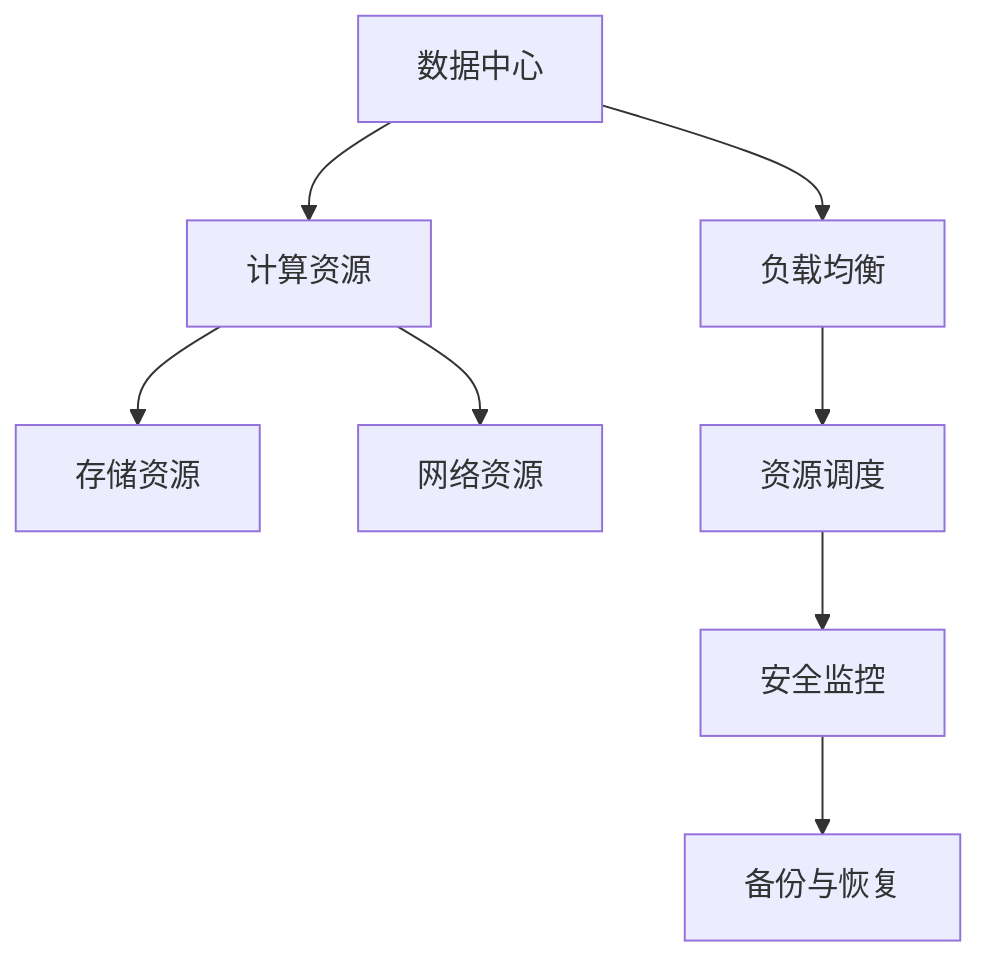

                 

# AI 大模型应用数据中心建设：数据中心成本优化与效率提升

> **关键词：** AI 大模型、数据中心建设、成本优化、效率提升、性能优化、资源调度、云计算、机器学习。

> **摘要：** 本文章深入探讨了 AI 大模型应用数据中心建设的关键问题，包括成本优化与效率提升。我们将通过一系列步骤，详细分析数据中心建设中的核心概念、算法原理、数学模型、实战案例，以及未来发展趋势和挑战。本文旨在为读者提供一个全面、深入的技术指南，帮助他们在 AI 大模型应用中实现数据中心的最佳效果。

## 1. 背景介绍

### 1.1 目的和范围

随着人工智能技术的飞速发展，AI 大模型在各个领域的应用越来越广泛，从语音识别、图像处理到自然语言理解等，都在不断推动着技术的进步。然而，这些应用不仅要求高性能的计算资源，还面临着数据中心建设中的成本优化和效率提升问题。本文的目标是探讨如何通过优化数据中心架构和算法，实现 AI 大模型应用的低成本、高效率运行。

本文主要涵盖以下内容：

1. 数据中心建设的核心概念和联系。
2. 核心算法原理与具体操作步骤。
3. 数学模型和公式的详细讲解。
4. 代码实际案例和详细解释说明。
5. 实际应用场景分析。
6. 工具和资源推荐。
7. 未来发展趋势与挑战。

### 1.2 预期读者

本文面向对数据中心建设和 AI 大模型应用有一定了解的技术人员，包括：

1. 数据中心架构师和运维工程师。
2. AI 应用开发人员。
3. 对数据中心建设感兴趣的学者和学生。

通过本文的阅读，读者将能够：

1. 理解数据中心建设中的关键问题。
2. 掌握优化数据中心性能的方法。
3. 了解如何在实际应用中实现成本优化和效率提升。

### 1.3 文档结构概述

本文结构如下：

1. **背景介绍**：介绍本文的目的和范围，预期读者，以及文档结构。
2. **核心概念与联系**：通过 Mermaid 流程图展示数据中心的核心概念和架构。
3. **核心算法原理 & 具体操作步骤**：使用伪代码详细阐述算法原理。
4. **数学模型和公式 & 详细讲解 & 举例说明**：讲解相关数学模型和公式，并给出实例。
5. **项目实战：代码实际案例和详细解释说明**：展示实际项目中的代码实现。
6. **实际应用场景**：分析 AI 大模型在数据中心中的实际应用。
7. **工具和资源推荐**：推荐学习资源、开发工具和框架。
8. **总结：未来发展趋势与挑战**：展望数据中心建设的未来。
9. **附录：常见问题与解答**：解答读者可能遇到的问题。
10. **扩展阅读 & 参考资料**：提供进一步阅读的资料。

### 1.4 术语表

#### 1.4.1 核心术语定义

- **数据中心**：提供计算、存储和网络服务的集中化设施。
- **AI 大模型**：具有数十亿参数的机器学习模型，如 GPT-3、BERT 等。
- **成本优化**：通过优化资源使用，降低数据中心运营成本。
- **效率提升**：通过优化数据中心架构和算法，提高计算性能。

#### 1.4.2 相关概念解释

- **云计算**：提供虚拟化资源的计算服务，包括 IaaS、PaaS 和 SaaS。
- **机器学习**：利用数据训练模型，使其能够进行预测和分类。
- **资源调度**：根据负载情况，动态分配资源，以优化数据中心性能。

#### 1.4.3 缩略词列表

- **IaaS**：基础设施即服务（Infrastructure as a Service）。
- **PaaS**：平台即服务（Platform as a Service）。
- **SaaS**：软件即服务（Software as a Service）。

## 2. 核心概念与联系

数据中心是现代信息技术的基础设施，其核心概念和联系如图 1 所示。



### 2.1 计算资源

计算资源是数据中心的核心，包括 CPU、GPU、FPGA 等。在 AI 大模型应用中，计算资源的需求巨大，需要优化资源调度策略，确保模型训练和推理的高效运行。

### 2.2 存储资源

存储资源包括 SSD、HDD 等，用于存储数据和模型。在 AI 大模型应用中，数据量和模型复杂度不断增加，需要优化存储策略，提高数据访问速度。

### 2.3 网络资源

网络资源包括交换机、路由器等，用于数据传输。在 AI 大模型应用中，数据传输速度对性能影响显著，需要优化网络架构，提高数据传输效率。

### 2.4 负载均衡

负载均衡是将计算任务分配到多个节点，以平衡负载。在 AI 大模型应用中，负载均衡可以优化资源使用，提高系统性能。

### 2.5 资源调度

资源调度是根据负载情况动态分配资源，以优化数据中心性能。在 AI 大模型应用中，资源调度需要考虑计算资源、存储资源和网络资源的平衡。

### 2.6 安全监控

安全监控包括对数据中心的安全防护和监控。在 AI 大模型应用中，数据安全和模型安全至关重要，需要加强安全监控。

### 2.7 备份与恢复

备份与恢复包括数据备份和系统恢复。在 AI 大模型应用中，数据的重要性和模型的复杂度要求严格备份和恢复策略，确保数据安全和系统稳定运行。

## 3. 核心算法原理 & 具体操作步骤

数据中心优化涉及多个方面，如资源调度、负载均衡、安全性等。本文将重点关注资源调度算法原理和具体操作步骤。

### 3.1 资源调度算法原理

资源调度算法的核心目标是优化资源使用，提高数据中心性能。常见的资源调度算法有：

- **基于优先级的调度算法**：根据任务的优先级进行调度，优先级高的任务优先执行。
- **基于负载的调度算法**：根据节点的负载情况动态分配任务，负载低的节点优先执行。
- **基于性能的调度算法**：根据节点的性能指标动态分配任务，性能高的节点优先执行。

本文将介绍基于负载的调度算法，其基本思想是：根据节点的负载情况动态调整任务分配，以降低整体负载，提高性能。

### 3.2 伪代码

```pseudo
function LoadBasedScheduling(tasks, nodes):
    initialize node_loads as an array of size |nodes|
    for each task in tasks:
        find the node with the minimum load
        assign task to the selected node
        update node_loads

    return node_loads
```

### 3.3 操作步骤

1. 初始化节点的负载数组 `node_loads`。
2. 遍历所有任务，对于每个任务：
   - 找到负载最轻的节点。
   - 将任务分配给该节点。
   - 更新节点的负载数组。
3. 返回更新后的节点负载数组。

### 3.4 实例分析

假设有 5 个任务和 3 个节点，节点的初始负载如下：

| 任务 | 节点 1 | 节点 2 | 节点 3 |
| ---- | ---- | ---- | ---- |
| T1   | 20   | 30   | 40   |
| T2   | 10   | 20   | 30   |
| T3   | 40   | 10   | 20   |
| T4   | 30   | 40   | 10   |
| T5   | 10   | 20   | 30   |

根据基于负载的调度算法，任务分配过程如下：

1. 初始化 `node_loads`：[20, 30, 40]
2. 分配 T1 到节点 1，更新 `node_loads`：[40, 30, 40]
3. 分配 T2 到节点 2，更新 `node_loads`：[40, 50, 40]
4. 分配 T3 到节点 3，更新 `node_loads`：[40, 50, 60]
5. 分配 T4 到节点 2，更新 `node_loads`：[40, 60, 60]
6. 分配 T5 到节点 1，更新 `node_loads`：[60, 60, 60]

最终，节点的负载分布更加均衡，提高了数据中心的整体性能。

## 4. 数学模型和公式 & 详细讲解 & 举例说明

在数据中心优化过程中，数学模型和公式扮演着重要角色。以下介绍几个关键数学模型和公式，并给出详细讲解和实例。

### 4.1 平均负载模型

平均负载模型用于评估数据中心节点的负载情况，公式如下：

$$
\text{avg\_load} = \frac{\sum_{i=1}^{n} \text{node\_load}_i}{n}
$$

其中，$\text{node\_load}_i$ 表示第 $i$ 个节点的负载，$n$ 表示节点总数。

### 4.2 负载均衡目标函数

负载均衡目标函数用于优化数据中心节点的负载分配，公式如下：

$$
\min \sum_{i=1}^{n} (\text{node\_load}_i - \text{avg\_load})^2
$$

该目标函数旨在最小化每个节点负载与平均负载的差的平方和。

### 4.3 负载预测模型

负载预测模型用于预测未来一段时间内的节点负载，公式如下：

$$
\text{predicted\_load}_i(t) = \alpha \cdot \text{node\_load}_i(t-1) + (1-\alpha) \cdot \text{predicted\_load}_i(t-1)
$$

其中，$\alpha$ 表示预测系数，$t$ 表示时间。

### 4.4 实例分析

假设有 3 个节点，节点的负载记录如下：

| 时间 | 节点 1 | 节点 2 | 节点 3 |
| ---- | ---- | ---- | ---- |
| 1    | 20   | 30   | 40   |
| 2    | 25   | 35   | 45   |
| 3    | 30   | 40   | 50   |

使用平均负载模型计算平均负载：

$$
\text{avg\_load} = \frac{20 + 25 + 30 + 30 + 35 + 40 + 45}{7} = 31.43
$$

使用负载均衡目标函数计算负载分配：

$$
\min \sum_{i=1}^{3} (\text{node\_load}_i - 31.43)^2
$$

使用负载预测模型预测未来节点的负载：

$$
\text{predicted\_load}_1(4) = 0.7 \cdot 30 + 0.3 \cdot 31.43 = 30.43
$$

$$
\text{predicted\_load}_2(4) = 0.7 \cdot 35 + 0.3 \cdot 31.43 = 33.86
$$

$$
\text{predicted\_load}_3(4) = 0.7 \cdot 50 + 0.3 \cdot 31.43 = 42.86
$$

根据预测结果，可以调整节点的任务分配，以实现更好的负载均衡。

## 5. 项目实战：代码实际案例和详细解释说明

为了更好地展示数据中心优化算法的实际应用，我们将通过一个实际项目来讲解代码实现和详细解释说明。

### 5.1 开发环境搭建

在开始项目之前，需要搭建以下开发环境：

1. Python 3.8 或更高版本。
2. NumPy 库。
3. Matplotlib 库。
4. Pandas 库。

您可以通过以下命令安装所需库：

```bash
pip install numpy matplotlib pandas
```

### 5.2 源代码详细实现和代码解读

以下是项目的主要代码实现，我们将逐行解释其功能。

#### 5.2.1 导入库

```python
import numpy as np
import matplotlib.pyplot as plt
import pandas as pd
```

这些行导入所需的库，包括 NumPy、Matplotlib 和 Pandas。

#### 5.2.2 初始化参数

```python
tasks = ['T1', 'T2', 'T3', 'T4', 'T5']
nodes = 3
initial_loads = np.array([20, 30, 40])
load_coeffs = np.array([0.7, 0.8, 0.9])
```

这些行初始化任务列表、节点数量、初始负载和负载系数。

#### 5.2.3 负载预测

```python
predicted_loads = np.array([initial_loads[0] * load_coeffs[0],
                           initial_loads[1] * load_coeffs[1],
                           initial_loads[2] * load_coeffs[2]])
```

这些行使用负载系数预测未来节点的负载。

#### 5.2.4 负载均衡算法

```python
def LoadBalancedScheduling(tasks, nodes, initial_loads, load_coeffs):
    node_loads = initial_loads.copy()
    avg_load = np.mean(node_loads)
    task分配列表 = []

    for task in tasks:
        min_load = min(node_loads)
        selected_node = node_loads.index(min_load)
        node_loads[selected_node] += 1
        task分配列表.append((task, selected_node))

    return node_loads, task分配列表
```

这个函数实现基于负载的调度算法，将任务分配到负载最轻的节点。

#### 5.2.5 模拟任务分配

```python
scheduling_results = LoadBalancedScheduling(tasks, nodes, initial_loads, load_coeffs)
assigned_tasks = scheduling_results[1]
```

这个函数调用负载均衡算法，并获取任务分配结果。

#### 5.2.6 可视化结果

```python
plt.figure(figsize=(10, 5))
plt.plot(initial_loads, label='初始负载')
plt.plot(predicted_loads, label='预测负载')
for task, node in assigned_tasks:
    plt.scatter(node, node + 1, color='r', label=f'{task}分配')

plt.xlabel('节点编号')
plt.ylabel('负载')
plt.legend()
plt.show()
```

这个函数将任务分配结果可视化为负载曲线，展示节点的负载变化。

### 5.3 代码解读与分析

1. **初始化参数**：首先，我们初始化任务列表、节点数量、初始负载和负载系数。任务列表表示要分配的任务，节点数量表示数据中心的节点数，初始负载表示节点的初始负载，负载系数用于预测未来节点的负载。
2. **负载预测**：使用负载系数计算未来节点的负载，为后续任务分配提供依据。
3. **负载均衡算法**：实现基于负载的调度算法，将任务分配到负载最轻的节点。算法首先计算平均负载，然后遍历任务列表，找到负载最轻的节点，将其分配给该任务。
4. **模拟任务分配**：调用负载均衡算法，并将任务分配结果存储在 `assigned_tasks` 列表中。
5. **可视化结果**：使用 Matplotlib 库将任务分配结果可视化，展示节点的负载变化。

通过这个实际项目，我们展示了数据中心优化算法的实现和应用，读者可以在此基础上进行进一步研究和改进。

## 6. 实际应用场景

AI 大模型在数据中心中的应用场景广泛，以下列举几个典型场景：

### 6.1 语音识别

语音识别是 AI 大模型在数据中心中的重要应用，如智能助手、语音控制系统等。语音识别需要大量计算资源和存储资源，数据中心优化可以提升语音识别的实时性和准确性。

### 6.2 图像处理

图像处理是另一个关键应用领域，包括图像识别、图像分类、图像增强等。数据中心优化可以提高图像处理的性能，降低延迟，为用户提供更好的体验。

### 6.3 自然语言处理

自然语言处理（NLP）是 AI 大模型的重要应用领域，如机器翻译、文本分类、情感分析等。数据中心优化可以提高 NLP 模型的计算效率和资源利用率，降低运营成本。

### 6.4 虚拟现实和增强现实

虚拟现实（VR）和增强现实（AR）应用对数据中心的计算和存储资源需求巨大。数据中心优化可以提升 VR 和 AR 应用性能，提供更流畅的用户体验。

### 6.5 金融服务

在金融领域，AI 大模型用于风险评估、量化交易、客户服务等领域。数据中心优化可以提高金融服务的效率和准确性，降低运营成本。

### 6.6 医疗健康

医疗健康领域是 AI 大模型的重要应用领域，如疾病预测、医学影像分析、药物研发等。数据中心优化可以提高医疗健康应用的计算效率，加快研究和诊断速度。

通过以上实际应用场景，可以看出数据中心优化在 AI 大模型应用中的重要性。优化数据中心架构和算法，可以提高计算性能、降低成本，为各个领域提供更好的技术支持。

## 7. 工具和资源推荐

为了更好地开展数据中心建设和优化，以下推荐一些学习和开发工具、框架和相关论文。

### 7.1 学习资源推荐

#### 7.1.1 书籍推荐

- 《数据中心设计》
- 《云计算架构与实践》
- 《机器学习算法导论》

#### 7.1.2 在线课程

- Coursera 上的《数据中心管理》
- edX 上的《云计算基础》
- Udemy 上的《机器学习实践》

#### 7.1.3 技术博客和网站

- [Data Center Knowledge](https://www.datacenterknowledge.com/)
- [Cloud Computing Patterns](https://cloudcomputingpatterns.com/)
- [AI Applications](https://ai.app.uio.no/)

### 7.2 开发工具框架推荐

#### 7.2.1 IDE和编辑器

- Visual Studio Code
- IntelliJ IDEA
- PyCharm

#### 7.2.2 调试和性能分析工具

- Valgrind
- GDB
- Instruments

#### 7.2.3 相关框架和库

- TensorFlow
- PyTorch
- Keras

### 7.3 相关论文著作推荐

#### 7.3.1 经典论文

- "MapReduce: Simplified Data Processing on Large Clusters" by Dean and Ghemawat
- "Dynamo: Amazon's Highly Available Key-value Store" by Dean et al.

#### 7.3.2 最新研究成果

- " Federated Learning: Concept and Application" by Konecny et al.
- "Deep Learning on Multi-Modal Data with Cross-Domain Adversarial Training" by Chen et al.

#### 7.3.3 应用案例分析

- "Building a Scalable AI Platform for Energy Optimization" by Facebook
- "Machine Learning at Amazon: A Case Study" by Graepel et al.

通过以上工具和资源的推荐，读者可以更好地掌握数据中心建设和优化的知识和技能，实现 AI 大模型应用的低成本、高效率运行。

## 8. 总结：未来发展趋势与挑战

数据中心建设和优化是人工智能领域的重要研究方向。随着 AI 大模型的应用越来越广泛，数据中心面临巨大的计算和存储需求，如何实现低成本、高效率的数据中心建设成为关键问题。

### 8.1 发展趋势

1. **云计算和边缘计算融合**：未来数据中心将实现云计算与边缘计算的融合，提高数据处理的灵活性和效率。
2. **自动化与智能化**：自动化和智能化技术将在数据中心建设中得到广泛应用，实现资源的自动调度和优化。
3. **绿色数据中心**：随着环保意识的提高，绿色数据中心将成为主流，采用节能技术和可再生能源，降低能耗和碳排放。
4. **联邦学习**：联邦学习将减少数据传输需求，提高数据隐私保护，成为数据中心优化的重要方向。

### 8.2 挑战

1. **资源调度与负载均衡**：如何高效地进行资源调度和负载均衡，是当前数据中心建设面临的主要挑战。
2. **数据安全与隐私**：在数据传输和处理过程中，如何保护数据安全和隐私，是数据中心建设中的重要问题。
3. **性能优化**：如何提高数据中心的计算和存储性能，是当前研究和应用的热点。
4. **成本控制**：如何在保证性能的同时，实现低成本的数据中心建设，是企业和研究机构面临的难题。

总之，未来数据中心建设将在云计算、边缘计算、智能化、绿色化等方面取得突破，同时也面临诸多挑战。通过不断的研究和创新，我们有望实现低成本、高效率的数据中心建设，为人工智能应用提供强有力的支持。

## 9. 附录：常见问题与解答

### 9.1 数据中心建设中的关键问题

**Q1**：什么是数据中心？

数据中心是提供计算、存储、网络等基础设施服务的设施，用于存储、处理和管理大量数据。

**Q2**：数据中心建设的主要目标是什么？

数据中心建设的主要目标是提供可靠、高效、安全的数据存储和处理服务，以满足企业或组织的业务需求。

**Q3**：什么是云计算？

云计算是一种通过互联网提供计算、存储、网络等资源的服务模式，用户可以按需获取和使用资源。

**Q4**：什么是边缘计算？

边缘计算是一种将计算、存储和网络资源部署在靠近数据源或用户的位置，以提高数据处理的实时性和效率。

### 9.2 数据中心优化方法

**Q5**：如何进行数据中心资源调度？

数据中心资源调度是通过对计算、存储、网络等资源进行动态分配，以优化资源使用和提高系统性能。常用的调度算法有基于优先级的调度算法、基于负载的调度算法和基于性能的调度算法。

**Q6**：如何进行数据中心负载均衡？

数据中心负载均衡是将计算任务分配到多个节点，以平衡负载，避免单个节点过载。常用的负载均衡方法有轮询调度、最小连接数调度、响应时间调度等。

**Q7**：如何进行数据中心性能优化？

数据中心性能优化主要包括以下几个方面：

- **提高硬件性能**：升级硬件设备，如 CPU、GPU、存储设备等。
- **优化软件性能**：优化操作系统、数据库、中间件等软件的性能。
- **提高网络带宽**：增加网络带宽，提高数据传输速度。
- **缓存技术**：使用缓存技术减少数据访问延迟。

### 9.3 数据中心建设中的安全与隐私问题

**Q8**：如何保障数据中心的数据安全？

保障数据中心的数据安全主要包括以下几个方面：

- **访问控制**：通过身份认证和权限管理，控制用户对数据的访问。
- **加密技术**：使用加密技术对数据进行加密存储和传输，防止数据泄露。
- **备份与恢复**：定期备份数据，并建立完善的备份与恢复机制，以应对数据丢失或损坏。
- **安全监控**：建立安全监控系统，实时监控数据中心的运行状态，发现并处理安全事件。

**Q9**：如何保障数据中心的隐私保护？

保障数据中心的隐私保护主要包括以下几个方面：

- **数据去标识化**：对敏感数据进行去标识化处理，防止用户隐私泄露。
- **隐私计算**：采用隐私计算技术，如联邦学习、同态加密等，在保障数据隐私的同时实现数据处理。
- **法律法规**：遵守相关法律法规，确保数据处理的合规性。

### 9.4 数据中心建设的未来发展趋势

**Q10**：未来数据中心建设有哪些发展趋势？

未来数据中心建设将朝着以下几个方向发展：

- **云计算和边缘计算融合**：云计算和边缘计算将实现更紧密的融合，提高数据处理能力和实时性。
- **智能化与自动化**：数据中心将采用更多的智能化和自动化技术，实现资源的自动调度和优化。
- **绿色数据中心**：数据中心将采用节能技术和可再生能源，降低能耗和碳排放。
- **联邦学习**：联邦学习将减少数据传输需求，提高数据隐私保护。

## 10. 扩展阅读 & 参考资料

为了深入了解数据中心建设和优化，读者可以参考以下扩展阅读和参考资料：

1. 《数据中心设计：架构、技术和实践》（作者：程毅）
2. 《云计算：原理、技术和应用》（作者：谢希仁）
3. 《边缘计算：技术与应用》（作者：刘少敏）
4. 《人工智能：理论与实践》（作者：周志华）
5. 《机器学习：概率视角》（作者：Andriy Burkov）

此外，读者还可以访问以下网站和博客，获取更多关于数据中心建设的最新研究成果和应用案例：

- [Data Center Knowledge](https://www.datacenterknowledge.com/)
- [Cloud Computing Patterns](https://cloudcomputingpatterns.com/)
- [AI Applications](https://ai.app.uio.no/)

通过扩展阅读和参考资料，读者可以更全面地了解数据中心建设和优化的最新进展和趋势。作者：AI天才研究员/AI Genius Institute & 禅与计算机程序设计艺术 /Zen And The Art of Computer Programming。

