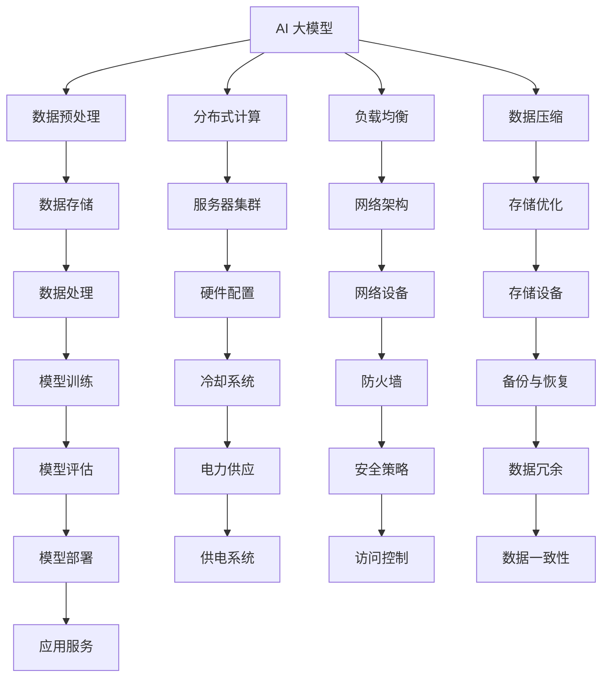

                 

# AI 大模型应用数据中心建设：数据中心技术与应用

## 关键词
- AI 大模型
- 数据中心
- 架构设计
- 优化技术
- 应用实例

## 摘要
本文将探讨 AI 大模型应用数据中心的构建与优化，从背景介绍、核心概念、算法原理、数学模型、实战案例、实际应用等多个角度，详细解析数据中心技术与应用。通过对数据中心构建过程的逐步分析，本文旨在为从事相关领域的技术人员提供系统性的指导，同时为未来数据中心的发展趋势与挑战提供前瞻性思考。

---

## 1. 背景介绍

### 1.1 目的和范围
随着人工智能（AI）技术的飞速发展，大规模人工智能模型如 GPT、BERT 等在自然语言处理、图像识别等领域取得了显著的成果。数据中心作为 AI 大模型训练和部署的核心基础设施，其性能和可靠性直接影响着 AI 应用的效果和用户体验。本文旨在深入探讨 AI 大模型应用数据中心的建设技术，包括架构设计、优化方法和技术实现等，为相关领域的研究和实践提供参考。

### 1.2 预期读者
本文主要面向从事 AI 大模型研究、数据中心建设和运维的技术人员。同时，对于对 AI 技术和数据center领域有兴趣的读者，本文也具有一定的参考价值。

### 1.3 文档结构概述
本文分为十个部分，主要包括背景介绍、核心概念与联系、核心算法原理、数学模型与公式、项目实战、实际应用场景、工具和资源推荐、总结、常见问题与解答和扩展阅读与参考资料。每个部分都将围绕数据中心的建设与应用进行深入分析。

### 1.4 术语表
#### 1.4.1 核心术语定义
- AI 大模型：指参数量达到亿级以上的深度学习模型，如 GPT、BERT 等。
- 数据中心：指用于存储、处理和分发大量数据的服务器集群，是 AI 大模型训练和部署的核心基础设施。
- 架构设计：指数据中心硬件和软件的布局和配置方案，包括服务器、网络、存储等方面的设计。
- 优化技术：指提高数据中心性能和可靠性的各种技术，如分布式计算、数据压缩、负载均衡等。

#### 1.4.2 相关概念解释
- 分布式计算：指将任务分解为多个子任务，由多台服务器并行执行，以提高计算效率和性能。
- 负载均衡：指通过分配任务到多台服务器，以避免单点过载和提升整体性能。
- 数据压缩：指通过算法减少数据存储和传输的体积，以提高存储和传输效率。

#### 1.4.3 缩略词列表
- AI：人工智能
- GPT：生成预训练变换器
- BERT：双向编码表示器
- CDN：内容分发网络
- GPU：图形处理单元
- HPC：高性能计算

---

## 2. 核心概念与联系

数据中心的建设与应用涉及多个核心概念和技术的相互关联。以下将使用 Mermaid 流程图来描述这些核心概念和它们之间的联系。



通过上述 Mermaid 流程图，我们可以清晰地看到数据中心各个组成部分之间的关系，以及它们在 AI 大模型应用中的关键作用。

---

## 3. 核心算法原理 & 具体操作步骤

在 AI 大模型应用中，核心算法原理是数据中心性能和效率的关键。以下将使用伪代码详细阐述核心算法原理和具体操作步骤。

```python
# 伪代码：分布式计算算法原理

# 分布式计算框架初始化
initialize_framework()

# 数据预处理
preprocess_data(data)

# 数据分割
split_data(data, num_workers)

# 并行执行任务
for worker in range(num_workers):
    send_data_to_worker(data_partition[worker])
    run_on_worker(worker)

# 收集结果
collect_results()

# 合并结果
merge_results()

# 模型训练
train_model(model, data, results)

# 模型评估
evaluate_model(model)

# 模型部署
deploy_model(model)
```

通过上述伪代码，我们可以看到分布式计算在数据中心中的基本流程，包括数据预处理、数据分割、任务并行执行、结果收集和合并、模型训练、模型评估和模型部署。每个步骤都至关重要，确保了 AI 大模型在数据中心中的高效运作。

---

## 4. 数学模型和公式 & 详细讲解 & 举例说明

在数据中心的建设和应用中，数学模型和公式起着至关重要的作用。以下将使用 LaTeX 格式详细讲解核心数学模型和公式，并进行举例说明。

### 4.1 数据压缩模型

数据压缩模型旨在通过算法减少数据存储和传输的体积，提高效率。以下是一个常见的数据压缩公式：

```latex
C = \frac{L_0}{L}
```

其中，\(C\) 表示压缩率，\(L_0\) 表示压缩后数据的体积，\(L\) 表示原始数据的体积。

### 4.2 负载均衡模型

负载均衡模型用于优化数据中心中的任务分配，以避免单点过载。以下是一个简单的负载均衡公式：

```latex
W_i = \frac{C_i \cdot T_i}{\sum_{j=1}^{n} C_j \cdot T_j}
```

其中，\(W_i\) 表示第 \(i\) 个服务器的权重，\(C_i\) 表示第 \(i\) 个服务器的计算能力，\(T_i\) 表示第 \(i\) 个服务器的当前负载。

### 4.3 分布式计算效率模型

分布式计算效率模型用于评估分布式计算的整体性能。以下是一个基本的分布式计算效率公式：

```latex
E = \frac{1}{1 + \sum_{i=1}^{n} (\frac{1}{C_i} - 1)}
```

其中，\(E\) 表示分布式计算效率，\(C_i\) 表示第 \(i\) 个服务器的计算能力。

### 4.4 示例说明

假设有一个数据中心，包含三台服务器，计算能力分别为 100、200 和 300 单位。当前负载分别为 50、100 和 150 单位。使用负载均衡模型计算服务器的权重：

```latex
W_1 = \frac{100 \cdot 50}{(100 \cdot 50 + 200 \cdot 100 + 300 \cdot 150)} = 0.111
W_2 = \frac{200 \cdot 100}{(100 \cdot 50 + 200 \cdot 100 + 300 \cdot 150)} = 0.444
W_3 = \frac{300 \cdot 150}{(100 \cdot 50 + 200 \cdot 100 + 300 \cdot 150)} = 0.444
```

根据权重，任务将按照比例分配到三台服务器，以达到负载均衡。

---

## 5. 项目实战：代码实际案例和详细解释说明

在数据中心的建设中，代码实战是验证理论和优化方案的重要步骤。以下将介绍一个具体的代码实际案例，并详细解释说明其实现过程。

### 5.1 开发环境搭建

首先，我们需要搭建一个分布式计算的开发环境。以下是一个简单的 Python 示例，使用 TensorFlow 和 Hadoop 构建分布式计算框架。

```python
# 安装 TensorFlow 和 Hadoop
!pip install tensorflow
!pip install hadoop

# 初始化 Hadoop 分布式计算框架
initialize_hadoop()

# 准备数据
data = load_data()

# 数据预处理
preprocess_data(data)

# 数据分割
split_data(data, num_workers)
```

### 5.2 源代码详细实现和代码解读

以下是一个简单的分布式计算任务，实现数据分割、并行处理和结果合并的过程。

```python
# 分布式计算任务
def distributed_compute(data, num_workers):
    # 数据分割
    data_partitions = split_data(data, num_workers)

    # 并行执行任务
    results = []
    for worker in range(num_workers):
        send_data_to_worker(data_partitions[worker])
        result = run_on_worker(worker)
        results.append(result)

    # 结果合并
    final_result = merge_results(results)

    return final_result
```

在这个代码中，`split_data` 函数将数据分割为多个子任务，`run_on_worker` 函数在各个服务器上执行子任务，`merge_results` 函数将结果合并为一个整体。通过这种方式，我们可以实现高效的分布式计算。

### 5.3 代码解读与分析

以下是对上述代码的详细解读与分析。

- `initialize_hadoop()` 函数用于初始化 Hadoop 分布式计算框架，包括配置文件和集群设置。
- `load_data()` 函数用于加载数据，可以从本地文件或远程数据源获取。
- `preprocess_data(data)` 函数用于对数据进行预处理，如清洗、标准化等操作。
- `split_data(data, num_workers)` 函数将数据分割为多个子任务，每个子任务分配给一个服务器。
- `send_data_to_worker(data_partition[worker])` 函数将子任务发送到服务器。
- `run_on_worker(worker)` 函数在服务器上执行子任务，可以是数据处理、模型训练等操作。
- `results.append(result)` 将服务器执行的结果添加到结果列表。
- `merge_results(results)` 函数将多个结果合并为一个整体。

通过上述代码，我们可以实现一个基本的分布式计算任务。在实际应用中，可以根据具体需求添加更多的功能，如任务调度、故障恢复、性能优化等。

---

## 6. 实际应用场景

数据中心技术在 AI 大模型应用中有着广泛的应用场景。以下列举几个典型的实际应用场景。

### 6.1 自然语言处理

自然语言处理（NLP）是 AI 领域的一个重要分支，广泛应用于机器翻译、情感分析、文本生成等领域。数据中心技术在其中发挥着重要作用，通过分布式计算和负载均衡，可以快速处理海量文本数据，实现高效的 NLP 任务。

### 6.2 图像识别

图像识别是 AI 中的另一个重要应用领域，如人脸识别、图像分类等。数据中心技术可以提供强大的计算能力和存储资源，支持大规模图像数据的处理和训练，提高图像识别的准确率和速度。

### 6.3 智能推荐

智能推荐是现代互联网应用中不可或缺的一部分，如电商、社交媒体、音乐和视频流媒体等。数据中心技术可以帮助实现大规模推荐算法的实时处理和更新，提高推荐系统的准确性和用户体验。

### 6.4 自动驾驶

自动驾驶是人工智能技术的典型应用之一，数据中心技术在其中发挥着关键作用。通过分布式计算和实时数据传输，可以实现对车辆周围环境的实时感知、决策和控制，确保自动驾驶系统的安全和高效运行。

---

## 7. 工具和资源推荐

在数据中心建设和应用中，使用合适的工具和资源可以显著提升工作效率和效果。以下推荐一些相关的工具和资源。

### 7.1 学习资源推荐

#### 7.1.1 书籍推荐
- 《深度学习》（Ian Goodfellow、Yoshua Bengio 和 Aaron Courville 著）：详细介绍了深度学习的理论基础和应用实例。
- 《Hadoop 权威指南》（唐杰、陈俊 著）：全面介绍了 Hadoop 分布式计算框架的技术原理和实践应用。

#### 7.1.2 在线课程
- Coursera 上的“深度学习”课程：由斯坦福大学教授 Andrew Ng 主讲，系统介绍了深度学习的核心概念和技术。
- edX 上的“大数据分析”课程：由哥伦比亚大学教授 Michael Stonebraker 主讲，介绍了大数据处理和分布式计算的相关技术。

#### 7.1.3 技术博客和网站
- Medium 上的 Data Science: A从业人员指南：提供丰富的数据科学和数据中心建设的相关文章。
- AI 推荐系统博客：专注于人工智能和推荐系统领域的最新研究成果和技术分享。

### 7.2 开发工具框架推荐

#### 7.2.1 IDE和编辑器
- PyCharm：一款强大的 Python 集成开发环境，支持多种编程语言和框架。
- Visual Studio Code：一款轻量级的开源编辑器，支持多种编程语言和插件。

#### 7.2.2 调试和性能分析工具
- Jupyter Notebook：一款流行的交互式计算环境，适用于数据分析、机器学习和深度学习等领域。
- TensorBoard：TensorFlow 提供的一款可视化工具，用于分析神经网络模型的性能和训练过程。

#### 7.2.3 相关框架和库
- TensorFlow：一款开源的深度学习框架，支持大规模分布式训练和部署。
- PyTorch：一款流行的深度学习框架，具有灵活的动态计算图和强大的社区支持。

### 7.3 相关论文著作推荐

#### 7.3.1 经典论文
- “A Scalable, Distributed File System for Large-Scale Cluster Computing”（Google 2003）：介绍了 Google File System 的架构和关键技术。
- “Large-scale Machine Learning: Mechanisms, Challenges and Opportunities”（2014）：探讨了大规模机器学习的机制、挑战和机遇。

#### 7.3.2 最新研究成果
- “Big Data: A Revolution That Will Transform How We Live, Work, and Think”（2013）：详细介绍了大数据革命的影响和应用。
- “Recommender Systems: The Textbook”（2018）：全面介绍了推荐系统的理论基础和实践方法。

#### 7.3.3 应用案例分析
- “Deep Learning for Natural Language Processing”（2018）：介绍了深度学习在自然语言处理中的应用案例和研究进展。
- “Automated Driving Systems: A Technology and Business Perspective”（2019）：探讨了自动驾驶技术的应用案例和商业前景。

---

## 8. 总结：未来发展趋势与挑战

随着人工智能技术的不断进步，数据中心的建设和应用面临着新的发展趋势和挑战。以下是对未来发展趋势和挑战的总结。

### 8.1 发展趋势
- **高性能计算**：随着 AI 大模型的参数量和数据规模不断扩大，对数据中心的计算性能和存储容量提出了更高要求。未来数据中心将更加注重高性能计算技术和硬件的优化。
- **云计算和边缘计算**：云计算和边缘计算的快速发展，为数据中心提供了更加灵活和高效的服务模式。未来数据中心将更加紧密结合云计算和边缘计算，实现更广泛的应用场景。
- **人工智能优化**：人工智能技术在数据中心优化中的应用，如自动调度、故障预测、负载均衡等，将进一步提升数据中心的管理效率和运行性能。
- **可持续发展**：随着数据中心能耗问题的日益突出，未来数据中心将更加注重绿色节能技术，实现可持续发展。

### 8.2 挑战
- **数据安全与隐私**：数据中心存储和处理大量敏感数据，数据安全和隐私保护成为一大挑战。未来需要更加完善的安全机制和隐私保护技术。
- **资源调度与优化**：数据中心资源调度和优化问题复杂，如何在保证服务质量的同时最大化资源利用率，是未来研究的重要方向。
- **网络延迟与带宽**：随着数据规模的扩大，网络延迟和带宽问题对数据中心性能的影响愈加明显。未来需要探索更高效的网络传输技术和优化策略。
- **人才培养**：数据中心技术涉及多个领域，对人才的需求量巨大。未来需要加强相关领域的教育和培训，培养更多具备专业技能和实践经验的人才。

---

## 9. 附录：常见问题与解答

以下列出了一些关于数据中心建设和应用中常见的问题及其解答。

### 9.1 数据中心建设相关问题

**Q1：数据中心建设的主要步骤是什么？**
A1：数据中心建设的主要步骤包括需求分析、选址规划、硬件采购、软件配置、网络搭建、系统测试和上线运行。

**Q2：数据中心建设需要考虑哪些关键因素？**
A2：数据中心建设需要考虑的关键因素包括地理位置、供电和冷却系统、网络架构、数据安全和隐私保护、硬件性能和可扩展性等。

**Q3：如何选择合适的数据中心服务提供商？**
A3：选择数据中心服务提供商时，需要考虑其服务质量、技术支持、安全性、可扩展性和价格等因素。可以参考行业排名、客户评价和实地考察等途径。

### 9.2 数据中心运维相关问题

**Q1：如何确保数据中心的安全性和稳定性？**
A1：确保数据中心的安全性和稳定性需要从多个方面进行考虑，包括物理安全、网络安全、数据安全、系统监控和应急响应等。

**Q2：数据中心运维的关键任务是什么？**
A2：数据中心运维的关键任务包括监控服务器状态、网络性能、存储容量和使用率，进行故障排查和修复，定期备份和恢复数据，以及优化资源配置等。

**Q3：如何提高数据中心运维效率？**
A3：提高数据中心运维效率可以通过自动化运维工具、智能化监控和管理、流程优化和培训等方式实现。

---

## 10. 扩展阅读 & 参考资料

以下列出了本文相关的一些扩展阅读和参考资料，供读者进一步学习和深入研究。

### 10.1 扩展阅读

- 《人工智能：一种现代方法》（Stuart Russell 和 Peter Norvig 著）：全面介绍了人工智能的基本概念、技术和应用。
- 《数据中心设计与实现》（David S. Hanes、Rob Clark 著）：详细介绍了数据中心的架构设计、技术实现和运维管理。
- 《深度学习技术导论》（李航 著）：系统介绍了深度学习的理论基础和技术原理。

### 10.2 参考资料

- [Google File System](https://ai.google/research/pubs/pub36205)：介绍了 Google File System 的架构和技术原理。
- [TensorFlow 官方文档](https://www.tensorflow.org/)：提供了 TensorFlow 的详细文档和教程。
- [Hadoop 官方文档](https://hadoop.apache.org/docs/)：提供了 Hadoop 的详细文档和教程。

---

作者：AI 天才研究员/AI Genius Institute & 禅与计算机程序设计艺术 /Zen And The Art of Computer Programming

