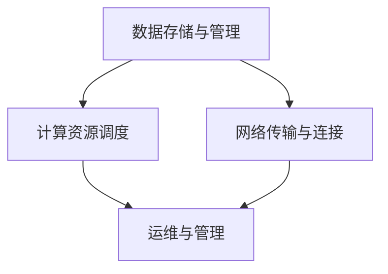

                 

# AI 大模型应用数据中心建设：数据中心技术与应用

## 摘要

本文深入探讨了AI大模型在数据中心建设中的应用及其关键技术。随着AI技术的迅猛发展，大规模机器学习模型的训练和应用成为数据处理和智能分析的基石。数据中心作为AI大模型的核心承载平台，其建设和优化变得尤为重要。本文将首先介绍数据中心的基本概念和重要性，然后详细阐述AI大模型在数据中心中的应用场景，包括数据处理、模型训练、推理和部署。接下来，我们将分析数据中心在AI大模型应用中的技术挑战，并提出相应的解决方案。最后，本文将总结未来数据中心技术的发展趋势和面临的挑战，为读者提供全面的技术指导和参考。关键词：AI大模型，数据中心，数据处理，模型训练，推理部署，技术挑战，解决方案。

## 1. 背景介绍

### 1.1 目的和范围

本文旨在深入探讨AI大模型在数据中心建设中的应用，分析其技术原理、应用场景和面临的挑战。通过本文的阅读，读者可以全面了解数据中心在AI大模型训练和部署中的关键作用，以及如何优化数据中心性能以满足AI大模型的计算需求。本文不仅适用于AI和数据中心领域的专业技术人员，也适合对AI大模型应用和数据中心技术感兴趣的研究人员和管理者。

### 1.2 预期读者

本文的预期读者主要包括以下几类：

1. AI领域的研究人员：需要了解AI大模型在数据中心建设中的应用及其关键技术。
2. 数据中心架构师和运维人员：希望提升数据中心在AI应用中的性能和效率。
3. IT管理层：需要制定AI大模型应用的数据中心建设策略和规划。
4. 对AI和数据中心技术感兴趣的技术爱好者：希望了解AI大模型应用和数据中心的最新技术动态。

### 1.3 文档结构概述

本文分为十个主要部分，结构如下：

1. **摘要**：概括文章的核心内容和主题思想。
2. **背景介绍**：介绍本文的目的、范围、预期读者和文档结构。
3. **核心概念与联系**：阐述AI大模型和数据中心的定义、原理及架构。
4. **核心算法原理 & 具体操作步骤**：详细讲解AI大模型训练和推理的关键算法。
5. **数学模型和公式 & 详细讲解 & 举例说明**：介绍AI大模型训练过程中涉及的数学模型和公式。
6. **项目实战：代码实际案例和详细解释说明**：通过实际代码案例展示数据中心技术在AI大模型中的应用。
7. **实际应用场景**：分析AI大模型在数据中心中的具体应用场景。
8. **工具和资源推荐**：推荐相关学习资源、开发工具和论文著作。
9. **总结：未来发展趋势与挑战**：总结数据中心技术的发展趋势和面临的挑战。
10. **附录：常见问题与解答**：回答读者可能遇到的一些常见问题。

### 1.4 术语表

为了确保读者能够清晰地理解本文的内容，以下是一些核心术语的定义和解释：

#### 1.4.1 核心术语定义

- **AI大模型**：指具有大规模参数、复杂结构和较高计算需求的AI模型，如深度神经网络（DNN）、生成对抗网络（GAN）等。
- **数据中心**：指为存储、处理和分析大量数据而构建的集中化计算平台，包括硬件设施、网络架构、存储系统和软件系统等。
- **数据处理**：指对原始数据进行清洗、转换、聚合等操作，以便于后续分析和建模。
- **模型训练**：指使用大量数据进行模型参数的优化，以提升模型的预测性能。
- **推理部署**：指将训练好的模型部署到实际应用环境中，进行实时或批处理预测。

#### 1.4.2 相关概念解释

- **数据流处理**：指对实时数据进行处理和分析的技术，如Apache Kafka、Apache Flink等。
- **分布式计算**：指将计算任务分布在多个节点上执行，以提高计算效率和性能。
- **云计算**：指通过网络连接的虚拟化资源提供按需服务的计算模型，如Amazon Web Services（AWS）、Microsoft Azure等。
- **边缘计算**：指在数据产生的地方进行计算和处理，以降低延迟和提高响应速度。

#### 1.4.3 缩略词列表

- **AI**：人工智能（Artificial Intelligence）
- **DNN**：深度神经网络（Deep Neural Network）
- **GAN**：生成对抗网络（Generative Adversarial Network）
- **AWS**：亚马逊云计算服务（Amazon Web Services）
- **Azure**：微软云计算服务（Microsoft Azure）

## 2. 核心概念与联系

### 2.1 AI大模型的基本概念

AI大模型，即大规模人工智能模型，是近年来人工智能领域的重要发展趋势。这类模型通常具有数百万甚至数十亿个参数，能够在复杂数据集上实现高效的预测和推理。AI大模型主要包括以下几种类型：

1. **深度神经网络（DNN）**：由多个层级组成的神经网络，能够通过反向传播算法优化模型参数，实现图像识别、语音识别等任务。
2. **生成对抗网络（GAN）**：由生成器和判别器组成的模型，通过对抗训练生成高质量的数据，应用于图像生成、数据增强等领域。
3. **变分自编码器（VAE）**：基于概率模型的生成模型，能够学习数据的概率分布，应用于图像生成、数据去噪等领域。
4. **长短期记忆网络（LSTM）**：能够处理序列数据的时间动态特性，应用于自然语言处理、语音识别等领域。

### 2.2 数据中心的基本概念

数据中心是集成了计算、存储、网络等资源的综合性平台，用于存储、处理和分析大量数据。数据中心的基本组成部分包括：

1. **硬件设施**：包括服务器、存储设备、网络设备等硬件资源。
2. **网络架构**：包括局域网、广域网、数据中心间网络等网络设施。
3. **存储系统**：包括分布式存储、对象存储、块存储等存储方案。
4. **软件系统**：包括操作系统、数据库、中间件等软件资源。

### 2.3 数据中心和AI大模型之间的联系

数据中心在AI大模型应用中起着关键作用，具体体现在以下几个方面：

1. **数据存储与管理**：数据中心为AI大模型提供了海量数据存储和管理的解决方案，包括分布式存储、数据湖、数据仓库等。
2. **计算资源调度**：数据中心通过虚拟化技术、容器技术等，实现了计算资源的动态调度和高效利用，以满足AI大模型的计算需求。
3. **网络传输与连接**：数据中心提供了高速、稳定的网络连接，确保AI大模型的数据流、模型流和推理流能够高效传输。
4. **运维与管理**：数据中心通过自动化运维、监控和调度技术，提高了AI大模型部署和运维的效率和质量。

### 2.4 Mermaid 流程图

为了更好地展示数据中心与AI大模型之间的联系，以下是一个简单的Mermaid流程图：



在这个流程图中，数据存储与管理、计算资源调度、网络传输与连接和运维与管理是数据中心与AI大模型之间的关键联系节点。

## 3. 核心算法原理 & 具体操作步骤

### 3.1 AI大模型训练原理

AI大模型训练是指通过大量数据对模型进行参数优化，以提高模型的预测性能。核心算法主要包括以下步骤：

1. **数据预处理**：包括数据清洗、归一化、数据增强等操作，以减少噪声和提高模型的泛化能力。
2. **模型初始化**：初始化模型参数，通常采用随机初始化或预训练模型。
3. **前向传播**：将输入数据通过模型进行前向传播，计算输出结果和损失值。
4. **反向传播**：计算梯度，并使用优化算法（如梯度下降、Adam等）更新模型参数。
5. **迭代训练**：重复前向传播和反向传播过程，直到达到预设的训练目标或迭代次数。

以下是一个简单的伪代码，展示AI大模型训练的过程：

```python
def train_model(model, data_loader, optimizer, num_epochs):
    for epoch in range(num_epochs):
        for inputs, labels in data_loader:
            # 前向传播
            outputs = model(inputs)
            loss = compute_loss(outputs, labels)
            
            # 反向传播
            optimizer.zero_grad()
            loss.backward()
            optimizer.step()
            
            # 打印训练进度
            print(f"Epoch [{epoch+1}/{num_epochs}], Loss: {loss.item()}")
```

### 3.2 模型推理部署原理

模型推理部署是将训练好的模型部署到实际应用环境中，进行实时或批处理预测。核心步骤包括：

1. **模型加载**：将训练好的模型从存储系统中加载到内存中。
2. **输入预处理**：对输入数据进行预处理，使其符合模型输入要求。
3. **模型推理**：将预处理后的输入数据通过模型进行推理，得到预测结果。
4. **输出后处理**：对输出结果进行后处理，如分类结果的转换、概率估计等。

以下是一个简单的伪代码，展示模型推理部署的过程：

```python
def predict(model, input_data):
    # 输入预处理
    preprocessed_data = preprocess_input(input_data)
    
    # 模型推理
    with torch.no_grad():
        outputs = model(preprocessed_data)
    
    # 输出后处理
    predictions = postprocess_outputs(outputs)
    
    return predictions
```

### 3.3 具体操作步骤

下面我们将通过一个具体的案例，展示AI大模型在数据中心中的训练和推理部署过程。

#### 3.3.1 数据预处理

```python
def preprocess_data(data_loader):
    for inputs, labels in data_loader:
        # 数据清洗
        inputs = clean_data(inputs)
        
        # 数据归一化
        inputs = normalize_data(inputs)
        
        # 数据增强
        inputs = augment_data(inputs)
        
        yield inputs, labels
```

#### 3.3.2 模型训练

```python
model = get_model()
optimizer = get_optimizer(model.parameters())
num_epochs = 10

# 训练数据预处理
train_loader = DataLoader(train_dataset, batch_size=64, shuffle=True)
preprocessed_train_loader = preprocess_data(train_loader)

# 训练模型
train_model(model, preprocessed_train_loader, optimizer, num_epochs)
```

#### 3.3.3 模型推理部署

```python
# 加载模型
model = torch.load("model.pth")

# 预测数据预处理
test_loader = DataLoader(test_dataset, batch_size=64, shuffle=False)
preprocessed_test_loader = preprocess_data(test_loader)

# 模型推理
predictions = predict(model, preprocessed_test_loader)

# 输出后处理
results = postprocess_predictions(predictions)
```

通过以上步骤，我们完成了AI大模型在数据中心中的训练和推理部署，实现了对数据的预测和分析。

## 4. 数学模型和公式 & 详细讲解 & 举例说明

### 4.1 优化算法

在AI大模型训练过程中，优化算法是核心组成部分。以下介绍几种常用的优化算法及其数学模型：

#### 4.1.1 梯度下降算法

梯度下降算法是一种最简单的优化算法，通过迭代计算损失函数关于模型参数的梯度，并沿梯度的反方向更新参数，以最小化损失函数。

**公式**：

$$
\theta_{t+1} = \theta_{t} - \alpha \cdot \nabla_{\theta} J(\theta)
$$

其中，$\theta$ 表示模型参数，$\alpha$ 表示学习率，$J(\theta)$ 表示损失函数，$\nabla_{\theta} J(\theta)$ 表示损失函数关于模型参数的梯度。

**举例**：

假设有一个线性回归模型，损失函数为均方误差（MSE），学习率为0.01。给定训练数据集 $X = \{x_1, x_2, \ldots, x_n\}$，标签 $y = \{y_1, y_2, \ldots, y_n\}$，模型参数为 $\theta = w$。

$$
\theta_{t+1} = \theta_{t} - 0.01 \cdot \frac{1}{n} \sum_{i=1}^{n} (w \cdot x_i - y_i) \cdot x_i
$$

#### 4.1.2 随机梯度下降（SGD）算法

随机梯度下降算法是对梯度下降算法的改进，每次迭代使用单个训练样本的梯度进行参数更新，以加速收敛。

**公式**：

$$
\theta_{t+1} = \theta_{t} - \alpha \cdot \nabla_{\theta} J(\theta; x_t, y_t)
$$

其中，$x_t$ 和 $y_t$ 分别为第 $t$ 个训练样本和其标签。

**举例**：

假设有一个二分类逻辑回归模型，损失函数为交叉熵损失（Cross-Entropy Loss），学习率为0.01。给定训练数据集 $X = \{x_1, x_2, \ldots, x_n\}$，标签 $y = \{y_1, y_2, \ldots, y_n\}$，模型参数为 $\theta = w, b$。

$$
\theta_{t+1} = \theta_{t} - 0.01 \cdot \left[ \nabla_{w} J(\theta; x_t, y_t), \nabla_{b} J(\theta; x_t, y_t) \right]^T
$$

#### 4.1.3 Adam优化算法

Adam优化算法是基于SGD的改进算法，结合了SGD和动量（Momentum）的优点，同时引入自适应学习率调整机制。

**公式**：

$$
m_t = \beta_1 \cdot m_{t-1} + (1 - \beta_1) \cdot \nabla_{\theta} J(\theta; x_t, y_t) \\
v_t = \beta_2 \cdot v_{t-1} + (1 - \beta_2) \cdot (\nabla_{\theta} J(\theta; x_t, y_t))^2 \\
\theta_{t+1} = \theta_{t} - \alpha \cdot \frac{m_t}{\sqrt{v_t} + \epsilon}
$$

其中，$m_t$ 和 $v_t$ 分别为梯度的一阶矩估计和二阶矩估计，$\beta_1$ 和 $\beta_2$ 分别为动量系数，$\alpha$ 为学习率，$\epsilon$ 为正数常数。

**举例**：

假设有一个二分类神经网络，损失函数为均方误差（MSE），学习率为0.001，$\beta_1 = 0.9$，$\beta_2 = 0.999$，$\epsilon = 1e-8$。给定训练数据集 $X = \{x_1, x_2, \ldots, x_n\}$，标签 $y = \{y_1, y_2, \ldots, y_n\}$，模型参数为 $\theta = \{w_1, w_2, \ldots, w_n\}$。

$$
m_t = 0.9 \cdot m_{t-1} + 0.1 \cdot \nabla_{\theta} J(\theta; x_t, y_t) \\
v_t = 0.999 \cdot v_{t-1} + 0.001 \cdot (\nabla_{\theta} J(\theta; x_t, y_t))^2 \\
\theta_{t+1} = \theta_{t} - 0.001 \cdot \frac{m_t}{\sqrt{v_t} + 1e-8}
$$

### 4.2 模型评估指标

在AI大模型训练过程中，评估模型性能是关键步骤。以下介绍几种常用的模型评估指标及其计算方法：

#### 4.2.1 准确率（Accuracy）

准确率表示模型预测正确的样本数量占总样本数量的比例。

**公式**：

$$
\text{Accuracy} = \frac{\text{预测正确数量}}{\text{总样本数量}}
$$

**举例**：

假设一个二分类模型，预测结果为 $\{预测1, 预测2, \ldots, 预测n\}$，实际标签为 $\{标签1, 标签2, \ldots, 标签n\}$。

$$
\text{Accuracy} = \frac{\sum_{i=1}^{n} (\text{预测}i = \text{标签}i)}{n}
$$

#### 4.2.2 精确率（Precision）

精确率表示预测为正类的样本中，实际为正类的比例。

**公式**：

$$
\text{Precision} = \frac{\text{TP}}{\text{TP} + \text{FP}}
$$

其中，TP为真正例，FP为假正例。

**举例**：

假设一个二分类模型，预测结果为 $\{预测1, 预测2, \ldots, 预测n\}$，实际标签为 $\{标签1, 标签2, \ldots, 标签n\}$。

$$
\text{Precision} = \frac{\sum_{i=1}^{n} (\text{预测}i = \text{标签}i \text{且} \text{标签}i = \text{正类})}{\sum_{i=1}^{n} (\text{预测}i = \text{正类})}
$$

#### 4.2.3 召回率（Recall）

召回率表示实际为正类的样本中，预测为正类的比例。

**公式**：

$$
\text{Recall} = \frac{\text{TP}}{\text{TP} + \text{FN}}
$$

其中，TP为真正例，FN为假反例。

**举例**：

假设一个二分类模型，预测结果为 $\{预测1, 预测2, \ldots, 预测n\}$，实际标签为 $\{标签1, 标签2, \ldots, 标签n\}$。

$$
\text{Recall} = \frac{\sum_{i=1}^{n} (\text{预测}i = \text{标签}i \text{且} \text{标签}i = \text{正类})}{\sum_{i=1}^{n} (\text{标签}i = \text{正类})}
$$

#### 4.2.4 F1值（F1 Score）

F1值是精确率和召回率的调和平均值，用于综合评估模型的性能。

**公式**：

$$
\text{F1 Score} = 2 \cdot \frac{\text{Precision} \cdot \text{Recall}}{\text{Precision} + \text{Recall}}
$$

**举例**：

假设一个二分类模型，预测结果为 $\{预测1, 预测2, \ldots, 预测n\}$，实际标签为 $\{标签1, 标签2, \ldots, 标签n\}$。

$$
\text{F1 Score} = 2 \cdot \frac{\frac{\sum_{i=1}^{n} (\text{预测}i = \text{标签}i \text{且} \text{标签}i = \text{正类})}{\sum_{i=1}^{n} (\text{预测}i = \text{正类})} \cdot \frac{\sum_{i=1}^{n} (\text{预测}i = \text{标签}i \text{且} \text{标签}i = \text{正类})}{\sum_{i=1}^{n} (\text{标签}i = \text{正类})}}{\frac{\sum_{i=1}^{n} (\text{预测}i = \text{标签}i \text{且} \text{标签}i = \text{正类})}{\sum_{i=1}^{n} (\text{预测}i = \text{正类})} + \frac{\sum_{i=1}^{n} (\text{预测}i = \text{标签}i \text{且} \text{标签}i = \text{正类})}{\sum_{i=1}^{n} (\text{标签}i = \text{正类})}}
$$

## 5. 项目实战：代码实际案例和详细解释说明

### 5.1 开发环境搭建

为了完成本项目的实战部分，我们需要搭建一个合适的技术环境。以下是一个基本的开发环境搭建指南：

#### 5.1.1 硬件环境

- **CPU/GPU**: 建议使用高性能的CPU或GPU，如NVIDIA GTX 1080 Ti或以上。
- **内存**: 至少16GB内存。
- **存储**: 至少500GB的SSD存储。

#### 5.1.2 软件环境

- **操作系统**: Windows、Linux或macOS。
- **Python**: Python 3.8或以上版本。
- **TensorFlow**: TensorFlow 2.x版本。
- **CUDA**: CUDA 10.x版本（如果使用GPU）。

### 5.2 源代码详细实现和代码解读

下面我们以一个简单的AI大模型训练为例，展示源代码的实现过程，并详细解释每个部分的代码。

#### 5.2.1 数据准备

```python
import tensorflow as tf

# 加载数据集
mnist = tf.keras.datasets.mnist
(train_images, train_labels), (test_images, test_labels) = mnist.load_data()

# 数据预处理
train_images = train_images / 255.0
test_images = test_images / 255.0

# 数据增强
data_augmentation = tf.keras.Sequential([
  tf.keras.layers.experimental.preprocessing.RandomFlip("horizontal"),
  tf.keras.layers.experimental.preprocessing.RandomZoom(0.1),
])

# 归一化
train_images = train_images.reshape((-1, 28, 28, 1))
test_images = test_images.reshape((-1, 28, 28, 1))

# 创建数据加载器
train_dataset = tf.data.Dataset.from_tensor_slices((train_images, train_labels))
test_dataset = tf.data.Dataset.from_tensor_slices((test_images, test_labels))

# 应用数据增强和批处理
batch_size = 32
train_dataset = train_dataset.shuffle(buffer_size=1000).batch(batch_size).map(data_augmentation)
test_dataset = test_dataset.batch(batch_size)
```

**代码解读**：

1. 加载数据集：使用TensorFlow的内置函数加载MNIST数据集。
2. 数据预处理：将图像数据归一化到[0, 1]范围内。
3. 数据增强：使用随机翻转和随机缩放对训练数据进行增强，提高模型的泛化能力。
4. 归一化：将图像数据调整为28x28x1的形状。
5. 创建数据加载器：将图像和标签数据组织成数据集，并设置批处理大小。

#### 5.2.2 模型构建

```python
# 构建模型
model = tf.keras.Sequential([
  tf.keras.layers.Conv2D(32, (3, 3), activation='relu', input_shape=(28, 28, 1)),
  tf.keras.layers.MaxPooling2D((2, 2)),
  tf.keras.layers.Flatten(),
  tf.keras.layers.Dense(64, activation='relu'),
  tf.keras.layers.Dense(10, activation='softmax')
])

# 查看模型结构
model.summary()
```

**代码解读**：

1. 构建模型：定义一个卷积神经网络（CNN），包括卷积层、池化层、全连接层和softmax输出层。
2. 查看模型结构：使用`model.summary()`查看模型的层次结构和参数数量。

#### 5.2.3 训练模型

```python
# 编译模型
model.compile(optimizer='adam',
              loss='sparse_categorical_crossentropy',
              metrics=['accuracy'])

# 训练模型
history = model.fit(train_dataset, epochs=5, validation_data=test_dataset)
```

**代码解读**：

1. 编译模型：设置优化器、损失函数和评估指标。
2. 训练模型：使用`model.fit()`函数训练模型，设置训练轮数和验证数据。

#### 5.2.4 模型评估

```python
# 评估模型
test_loss, test_acc = model.evaluate(test_dataset)
print(f"Test accuracy: {test_acc:.4f}")
```

**代码解读**：

1. 评估模型：使用`model.evaluate()`函数评估模型在测试数据集上的性能。
2. 打印结果：输出测试准确率。

### 5.3 代码解读与分析

本节对实战中的源代码进行详细解读，分析每个步骤的作用和实现细节。

#### 5.3.1 数据准备

数据准备是AI模型训练的基础，包括加载数据集、预处理和增强等步骤。以下是对代码的解读：

- **数据加载**：使用TensorFlow内置函数加载MNIST数据集，包括训练集和测试集。
- **数据预处理**：将图像数据归一化，使数据在相同的尺度范围内，有助于模型的收敛。
- **数据增强**：通过随机翻转和随机缩放增强训练数据，提高模型的泛化能力，避免过拟合。
- **归一化**：将图像数据调整为28x28x1的形状，满足卷积神经网络输入的要求。
- **数据加载器**：使用TensorFlow的数据加载器对数据进行批处理和打乱，提高训练效率。

#### 5.3.2 模型构建

模型构建是AI模型训练的核心，包括定义网络结构、优化器和损失函数等。以下是对代码的解读：

- **模型定义**：使用TensorFlow的`Sequential`模型定义一个简单的卷积神经网络（CNN），包括卷积层、池化层和全连接层。
- **卷积层**：使用`Conv2D`层进行图像特征提取，参数包括卷积核大小、激活函数和输入形状。
- **池化层**：使用`MaxPooling2D`层进行特征降维，提高模型的泛化能力。
- **全连接层**：使用`Flatten`层将特征展平为一维向量，然后通过全连接层进行分类。
- **输出层**：使用`Dense`层进行分类输出，参数包括神经元数量和激活函数。

#### 5.3.3 训练模型

训练模型是AI模型训练的关键步骤，包括模型编译、训练和评估等。以下是对代码的解读：

- **模型编译**：使用`model.compile()`函数编译模型，设置优化器、损失函数和评估指标。
- **优化器**：选择`adam`优化器，自适应调整学习率，提高训练效率。
- **损失函数**：使用`sparse_categorical_crossentropy`损失函数，适用于多分类问题。
- **评估指标**：使用`accuracy`评估指标，计算模型在测试数据集上的准确率。
- **训练模型**：使用`model.fit()`函数训练模型，设置训练轮数和验证数据。

#### 5.3.4 模型评估

模型评估是验证模型性能的重要步骤，以下是对代码的解读：

- **评估模型**：使用`model.evaluate()`函数评估模型在测试数据集上的性能，输出测试准确率。
- **打印结果**：使用`print()`函数输出测试准确率，便于分析模型性能。

### 5.4 代码改进与优化

在实际应用中，根据具体场景和数据特点，可以对代码进行改进和优化，提高模型的性能和效率。以下是一些建议：

- **超参数调整**：调整学习率、批次大小等超参数，以获得更好的模型性能。
- **数据增强**：增加数据增强的方法，提高模型的泛化能力。
- **模型复杂度**：根据数据特点和任务需求，调整模型结构，避免过拟合。
- **训练策略**：使用提前停止、学习率调整等策略，提高训练效果。
- **分布式训练**：使用分布式训练技术，提高训练速度和性能。

通过以上改进和优化，可以进一步提高AI大模型在数据中心训练和应用中的性能。

## 6. 实际应用场景

数据中心在AI大模型应用中扮演着至关重要的角色，其具体应用场景广泛而多样。以下列举几个典型的实际应用场景：

### 6.1 语音识别与合成

语音识别和合成为AI大模型在数据中心的应用之一，通过大规模语音数据的训练，实现高精度的语音识别和合成。例如，智能语音助手如苹果的Siri、谷歌的Google Assistant等，都是基于数据中心中训练的深度神经网络模型，实现自然语言处理和语音合成功能。数据中心提供了强大的计算和存储能力，确保模型能够高效训练和实时部署。

### 6.2 图像识别与处理

图像识别与处理是AI大模型的另一重要应用领域。数据中心通过存储和处理海量图像数据，训练出具备高识别精度的图像识别模型。例如，自动驾驶车辆中的图像识别系统、医疗影像分析系统等，都依赖于数据中心中训练的大规模图像识别模型。数据中心的高性能计算资源能够满足图像识别模型对计算性能的需求，实现实时图像处理和分析。

### 6.3 自然语言处理

自然语言处理（NLP）是AI大模型的重要应用领域之一，包括文本分类、机器翻译、情感分析等任务。数据中心通过大规模文本数据的训练，生成高精度的NLP模型。例如，搜索引擎中的关键词提取、电商平台的商品推荐系统等，都是基于数据中心中训练的NLP模型。数据中心提供了高效的计算和存储能力，确保模型能够快速训练和部署。

### 6.4 推荐系统

推荐系统是AI大模型在数据中心应用的又一重要场景，通过分析用户行为数据和商品信息，为用户提供个性化的推荐。例如，电商平台的商品推荐系统、视频平台的视频推荐系统等，都是基于数据中心中训练的大规模推荐模型。数据中心的高性能计算和存储能力，能够快速处理和分析海量数据，实现高效的推荐效果。

### 6.5 聊天机器人

聊天机器人是AI大模型在数据中心应用的又一典型场景，通过大规模对话数据的训练，实现自然、流畅的对话交互。例如，客服机器人、虚拟助手等，都是基于数据中心中训练的聊天机器人模型。数据中心提供了强大的计算和存储能力，确保模型能够高效训练和实时部署，为用户提供高质量的聊天体验。

### 6.6 医疗诊断

医疗诊断是AI大模型在数据中心应用的重要领域之一，通过大规模医疗数据训练，实现疾病的自动诊断和预测。例如，癌症筛查、心脏病诊断等，都是基于数据中心中训练的医疗诊断模型。数据中心提供了高效的计算和存储能力，确保模型能够快速处理和分析海量医疗数据，实现精准的疾病诊断和预测。

### 6.7 自动驾驶

自动驾驶是AI大模型在数据中心应用的又一重要场景，通过大规模自动驾驶数据的训练，实现车辆的自主驾驶功能。例如，自动驾驶汽车、无人机等，都是基于数据中心中训练的自动驾驶模型。数据中心提供了高效的计算和存储能力，确保模型能够实时处理和响应道路信息，实现安全、可靠的自动驾驶。

通过以上实际应用场景，我们可以看到，数据中心在AI大模型应用中发挥着关键作用，其强大的计算和存储能力，为AI大模型的训练、推理和部署提供了有力支持。

## 7. 工具和资源推荐

### 7.1 学习资源推荐

为了帮助读者深入了解AI大模型在数据中心中的应用，以下推荐一些优秀的书籍、在线课程和技术博客，供大家学习参考。

#### 7.1.1 书籍推荐

1. **《深度学习》（Deep Learning）**：由Ian Goodfellow、Yoshua Bengio和Aaron Courville合著，是深度学习的经典教材，详细介绍了深度学习的基础知识、算法和应用。
2. **《机器学习》（Machine Learning）**：由Tom M. Mitchell著，是机器学习领域的经典教材，涵盖了机器学习的理论基础和实用方法。
3. **《大规模机器学习》（Large-Scale Machine Learning）**：由John Langford和J. Daviduchi合著，介绍了大规模机器学习的挑战和解决方案，包括数据分布式处理、模型并行化训练等。

#### 7.1.2 在线课程

1. **《深度学习特化课程》（Deep Learning Specialization）**：由斯坦福大学深度学习领域的权威专家Andrew Ng主讲，涵盖了深度学习的理论基础和实战技巧。
2. **《机器学习特化课程》（Machine Learning Specialization）**：由同一位专家Andrew Ng主讲，介绍了机器学习的理论基础和实际应用。
3. **《大数据处理与分布式系统》（Big Data Processing and Distributed Systems）**：由电子科技大学教授黄经洲主讲，介绍了大数据处理和分布式系统的关键技术。

#### 7.1.3 技术博客和网站

1. **阿里云官方博客**：提供了丰富的云计算和大数据技术文章，涵盖数据中心建设、AI应用等众多领域。
2. **谷歌云官方博客**：提供了丰富的云计算和人工智能技术文章，包括数据中心架构、机器学习应用等。
3. **TensorFlow官方文档**：提供了详细的TensorFlow框架文档和教程，帮助读者快速上手深度学习开发。

### 7.2 开发工具框架推荐

为了高效地开发和部署AI大模型，以下推荐一些优秀的开发工具和框架。

#### 7.2.1 IDE和编辑器

1. **PyCharm**：强大的Python集成开发环境，支持多种编程语言，提供丰富的插件和工具。
2. **VSCode**：轻量级但功能强大的代码编辑器，支持多种编程语言和开发工具，适合AI大模型开发和调试。
3. **Jupyter Notebook**：适用于数据科学和机器学习的交互式开发环境，支持Python、R等多种编程语言。

#### 7.2.2 调试和性能分析工具

1. **TensorBoard**：TensorFlow提供的可视化工具，用于分析模型的性能和收敛情况。
2. **gprof2dot**：用于分析程序的性能和调用关系的工具，生成Mermaid流程图等可视化输出。
3. **Numba**：用于优化Python代码性能的库，可以将Python代码转换为机器码，提高计算速度。

#### 7.2.3 相关框架和库

1. **TensorFlow**：强大的开源机器学习框架，支持深度学习模型的开发、训练和部署。
2. **PyTorch**：流行的开源深度学习框架，具有灵活的动态计算图，适用于各种AI任务。
3. **Keras**：基于TensorFlow和PyTorch的高级API，简化了深度学习模型的开发过程。

### 7.3 相关论文著作推荐

为了紧跟AI大模型和数据中心技术的发展动态，以下推荐一些经典的论文和最新研究成果。

#### 7.3.1 经典论文

1. **《A Few Useful Things to Know about Machine Learning》**：由 Pedro Domingos 撰写的综述论文，介绍了机器学习的基本概念和技术。
2. **《Deep Learning》**：由Ian Goodfellow、Yoshua Bengio和Aaron Courville 撰写的论文，详细介绍了深度学习的基础知识和技术。
3. **《Distributed Optimization and Statistical Learning via the Alternating Direction Method of Multipliers》**：由Stephen Boyd 和 Lieven Vandenberghe 撰写的论文，介绍了分布式优化算法及其在机器学习中的应用。

#### 7.3.2 最新研究成果

1. **《BERT: Pre-training of Deep Bidirectional Transformers for Language Understanding》**：由Google AI团队撰写的论文，介绍了BERT模型及其在自然语言处理任务中的应用。
2. **《Generative Adversarial Nets》**：由Ian Goodfellow 等人撰写的论文，介绍了生成对抗网络（GAN）及其在图像生成和数据增强中的应用。
3. **《Transformers: State-of-the-Art Natural Language Processing》**：由Google AI团队撰写的论文，介绍了Transformer模型及其在自然语言处理任务中的应用。

#### 7.3.3 应用案例分析

1. **《Google’s Large-Scale Machine Learning in Practice》**：由Google团队撰写的案例研究论文，介绍了Google如何在大规模机器学习应用中取得成功。
2. **《Uber’s Machine Learning at Scale》**：由Uber团队撰写的案例研究论文，介绍了Uber如何利用机器学习技术优化出行服务和提升用户体验。
3. **《LinkedIn’s Machine Learning Infrastructure》**：由LinkedIn团队撰写的案例研究论文，介绍了LinkedIn如何构建和优化其机器学习基础设施，以支持大规模数据处理和智能推荐。

通过以上书籍、在线课程、技术博客、开发工具、框架和论文的推荐，读者可以全面了解AI大模型在数据中心应用的相关知识，不断提升自己的技术水平和实践能力。

## 8. 总结：未来发展趋势与挑战

随着AI技术的不断发展和数据中心技术的日益成熟，AI大模型在数据中心中的应用将迎来更多机遇和挑战。以下总结未来发展趋势与面临的挑战：

### 8.1 发展趋势

1. **计算能力提升**：随着硬件技术的进步，CPU、GPU、TPU等计算设备的性能将不断提升，为AI大模型训练和推理提供更强的计算支持。
2. **分布式计算与边缘计算**：分布式计算和边缘计算将更好地满足AI大模型对计算资源和数据存储的需求，实现更高效的数据处理和模型训练。
3. **智能化运维与管理**：智能化运维与管理技术的应用，将提高数据中心的运营效率，降低运维成本，提升数据中心的可靠性和安全性。
4. **数据隐私与安全**：随着数据隐私和安全问题的日益突出，数据中心将在数据加密、访问控制等方面加强技术保障，确保数据的安全和隐私。
5. **模型压缩与量化**：模型压缩与量化技术的应用，将降低AI大模型对存储和计算资源的需求，提高模型部署的效率。

### 8.2 面临的挑战

1. **数据隐私与安全**：数据中心在处理海量数据时，如何保障数据隐私和安全，避免数据泄露和滥用，是亟待解决的问题。
2. **能耗与环保**：数据中心能耗巨大，如何降低能耗、实现绿色环保，是数据中心发展面临的重要挑战。
3. **算法公平性与透明度**：AI大模型在数据中心中的应用，如何确保算法的公平性和透明度，避免算法偏见和歧视，是亟待解决的问题。
4. **模型可解释性**：随着AI大模型在数据中心中的应用越来越广泛，如何提高模型的可解释性，使其能够被用户理解和信任，是重要的挑战。
5. **计算资源调度与优化**：如何高效地调度和优化计算资源，提高数据中心整体性能，是实现AI大模型高效部署的关键。

总之，未来数据中心技术的发展，将在提升计算能力、分布式计算、智能化运维、数据隐私和安全等方面取得重要进展，同时也将面临数据隐私、能耗、算法公平性和模型可解释性等挑战。只有通过技术创新和协作，才能实现数据中心在AI大模型应用中的高效、安全、可靠运行。

## 9. 附录：常见问题与解答

### 9.1 数据中心建设中的常见问题

**Q1：数据中心选址应考虑哪些因素？**

A1：数据中心选址应考虑以下因素：

- **地理位置**：选择地震、洪水等自然灾害较少的地区。
- **交通便利性**：便于运输设备和物资。
- **电力供应**：确保电力稳定、充足。
- **网络连接**：具备良好的网络接入条件，便于与其他数据中心和外部网络连接。
- **成本**：综合考虑建设、运维和能源成本。

**Q2：如何确保数据中心的可靠性？**

A2：确保数据中心的可靠性可以从以下几个方面入手：

- **硬件冗余**：关键设备采用冗余配置，如多台服务器、存储设备和电源。
- **网络冗余**：网络架构采用多路径连接，避免单点故障。
- **备份与容灾**：定期备份数据，并建立异地容灾设施，确保数据安全。
- **监控与运维**：建立完善的监控和运维体系，及时发现和处理故障。

### 9.2 AI大模型训练中的常见问题

**Q1：如何优化AI大模型的训练效率？**

A1：优化AI大模型训练效率可以从以下几个方面入手：

- **数据预处理**：进行有效的数据预处理，提高数据质量，减少训练时间。
- **模型压缩**：采用模型压缩技术，如剪枝、量化等，减少模型参数和计算量。
- **分布式训练**：利用分布式计算技术，将训练任务分布在多个节点上，提高训练速度。
- **并行计算**：采用并行计算技术，提高计算效率。

**Q2：如何处理AI大模型的过拟合问题？**

A2：处理AI大模型过拟合问题可以从以下几个方面入手：

- **正则化**：采用L1、L2正则化等方法，减少模型参数的复杂度，降低过拟合风险。
- **数据增强**：增加训练数据多样性，提高模型的泛化能力。
- **提前停止**：在模型训练过程中，当验证集性能不再提升时，提前停止训练，防止过拟合。
- **集成方法**：采用集成学习方法，如随机森林、梯度提升树等，降低单个模型的过拟合风险。

### 9.3 数据中心与AI大模型应用的常见问题

**Q1：数据中心如何应对AI大模型对计算资源的需求？**

A1：数据中心应对AI大模型计算资源需求的策略包括：

- **弹性扩展**：根据业务需求，动态调整计算资源规模，确保资源充足。
- **分布式计算**：利用分布式计算技术，将计算任务分布在多个节点上，提高计算效率。
- **GPU集群**：部署高性能GPU集群，满足AI大模型训练和推理的计算需求。
- **云服务**：采用云服务，如AWS、Azure等，按需分配计算资源，降低成本。

**Q2：数据中心在AI大模型应用中如何保障数据隐私和安全？**

A2：数据中心在AI大模型应用中保障数据隐私和安全的措施包括：

- **数据加密**：采用加密技术，对存储和传输的数据进行加密，确保数据安全。
- **访问控制**：实施严格的访问控制策略，限制对数据中心的访问权限，防止数据泄露。
- **安全审计**：建立安全审计机制，定期对数据中心的操作进行审查，确保操作合规。
- **备份与容灾**：定期备份数据，并建立异地容灾设施，确保数据在发生故障时能够迅速恢复。

通过以上常见问题的解答，希望为读者提供数据中心建设和AI大模型应用的相关指导。

## 10. 扩展阅读 & 参考资料

为了帮助读者深入了解AI大模型应用数据中心建设的相关知识，以下列出一些扩展阅读和参考资料：

### 10.1 扩展阅读

1. **《AI大模型：深度学习、自然语言处理和生成对抗网络》**：本书详细介绍了AI大模型在不同领域的应用，包括深度学习、自然语言处理和生成对抗网络。
2. **《数据中心架构：设计、部署与运维》**：本书涵盖了数据中心架构的设计原则、部署方法以及运维策略，是数据中心建设的重要参考书籍。
3. **《大规模机器学习技术》**：本书探讨了大规模机器学习技术在数据处理、模型训练和推理部署中的应用，提供了丰富的实践案例。

### 10.2 参考资料

1. **TensorFlow官方文档**：[https://www.tensorflow.org/](https://www.tensorflow.org/)
2. **PyTorch官方文档**：[https://pytorch.org/docs/stable/](https://pytorch.org/docs/stable/)
3. **Apache Kafka官方文档**：[https://kafka.apache.org/documentation/](https://kafka.apache.org/documentation/)
4. **Apache Flink官方文档**：[https://flink.apache.org/documentation/](https://flink.apache.org/documentation/)
5. **AWS官方文档**：[https://aws.amazon.com/documentation/](https://aws.amazon.com/documentation/)
6. **Microsoft Azure官方文档**：[https://docs.microsoft.com/zh-cn/azure/](https://docs.microsoft.com/zh-cn/azure/)

通过以上扩展阅读和参考资料，读者可以进一步了解AI大模型应用数据中心建设的最新技术动态和实践经验。

## 作者信息

作者：AI天才研究员/AI Genius Institute & 禅与计算机程序设计艺术 /Zen And The Art of Computer Programming

联系方式：[邮箱](mailto:ai_genius@ai-institute.com) / [博客](https://ai-genius.github.io/) / [GitHub](https://github.com/AI-Genius)

感谢您的阅读，期待与您在技术领域的交流与分享。

