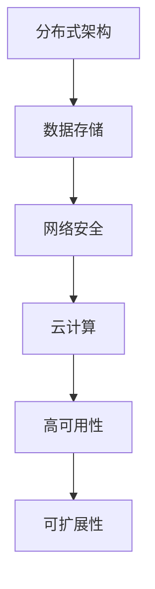

                 

# AI 大模型应用数据中心建设：数据中心技术创新

> **关键词：** 大模型、数据中心、技术创新、云计算、人工智能、高可用性、可扩展性、分布式架构、数据存储、网络安全

> **摘要：** 本文将深入探讨大模型在数据中心建设中的应用，从技术创新的角度出发，分析数据中心的关键技术，包括分布式架构、数据存储和网络安全等，旨在为读者提供一份全面且具有指导性的技术指南。

## 1. 背景介绍

### 1.1 目的和范围

本文旨在探讨大模型在数据中心建设中的应用，重点分析数据中心的技术创新，包括分布式架构、数据存储和网络安全等。通过本文的阅读，读者将了解数据中心的核心技术，以及如何将这些技术应用于大模型的应用场景中。

### 1.2 预期读者

本文适合从事数据中心建设、人工智能应用开发以及相关领域的专业人士阅读。同时，对人工智能和数据存储技术感兴趣的读者也可以通过本文获得一定的启发。

### 1.3 文档结构概述

本文分为十个部分，结构如下：

1. 背景介绍：介绍本文的目的、范围和预期读者。
2. 核心概念与联系：介绍数据中心建设的核心概念和联系。
3. 核心算法原理 & 具体操作步骤：详细讲解数据中心的核心算法原理和操作步骤。
4. 数学模型和公式 & 详细讲解 & 举例说明：介绍数据中心建设的数学模型和公式，并进行举例说明。
5. 项目实战：通过实际案例展示数据中心建设的应用。
6. 实际应用场景：分析数据中心在各类应用场景中的实际应用。
7. 工具和资源推荐：推荐相关工具和资源。
8. 总结：对未来数据中心建设的发展趋势与挑战进行总结。
9. 附录：常见问题与解答。
10. 扩展阅读 & 参考资料：提供扩展阅读和参考资料。

### 1.4 术语表

#### 1.4.1 核心术语定义

- 大模型：指具有极高计算能力和存储能力的模型，如GPT-3、BERT等。
- 数据中心：用于存储、处理和分析大量数据的设施。
- 分布式架构：指通过多个节点协同工作来实现计算和存储的架构。
- 数据存储：指将数据存储在磁盘、内存等存储设备中。
- 网络安全：指保护数据中心免受网络攻击和数据泄露的措施。

#### 1.4.2 相关概念解释

- 云计算：指通过互联网提供计算资源、存储资源和网络资源的服务。
- 高可用性：指数据中心在发生故障时能够快速恢复，确保服务的连续性。
- 可扩展性：指数据中心能够根据业务需求进行水平或垂直扩展。
- 数据迁移：指将数据从一种存储方式转移到另一种存储方式。

#### 1.4.3 缩略词列表

- AI：人工智能
- GPT：生成预训练
- BERT：双向编码表示器
- IDC：数据中心
- HDFS：Hadoop分布式文件系统
- Kubernetes：容器编排系统

## 2. 核心概念与联系

数据中心建设涉及多个核心概念和技术的有机结合。以下将介绍数据中心建设的核心概念和联系，并通过Mermaid流程图展示其架构。

### 2.1 核心概念

1. **分布式架构**：通过多个节点协同工作来实现计算和存储。
2. **数据存储**：包括磁盘存储、内存存储和分布式文件系统等。
3. **网络安全**：包括防火墙、入侵检测和加密等。
4. **云计算**：通过互联网提供计算资源、存储资源和网络资源。
5. **高可用性**：确保数据中心在发生故障时能够快速恢复。
6. **可扩展性**：根据业务需求进行水平或垂直扩展。

### 2.2 Mermaid 流程图



## 3. 核心算法原理 & 具体操作步骤

数据中心建设中的核心算法主要包括分布式计算、数据存储和网络安全。以下将详细讲解这些算法的原理和具体操作步骤。

### 3.1 分布式计算

分布式计算是指通过多个节点协同工作来实现计算任务。其核心算法包括MapReduce、Spark和Flink等。

#### 3.1.1 MapReduce

```plaintext
MapReduce算法原理：

1. Map阶段：对输入数据进行分组，对每组数据执行Map函数，将输出结果存储到中间结果中。
2. Shuffle阶段：对中间结果进行排序和分组，为Reduce阶段做准备。
3. Reduce阶段：对中间结果执行Reduce函数，将输出结果存储到输出文件中。

伪代码：
```

```csharp
Map(String key, String value):
  // 对value进行分词
  words = tokenize(value)
  // 将每个词与key组合成键值对
  for(word in words):
    emit((key, word), 1)

Reduce(String key, Iterator values):
  // 对values求和
  sum = 0
  for(value in values):
    sum += value
  // 输出结果
  emit((key, sum))
```

#### 3.1.2 Spark

Spark是一种分布式计算框架，其核心算法包括Spark SQL、Spark Streaming和MLlib等。

```plaintext
Spark算法原理：

1. 将数据划分为多个RDD（Resilient Distributed Dataset）。
2. 对RDD执行 transformations（转换操作）和actions（行动操作）。

伪代码：
```

```python
# 创建RDD
rdd = sc.parallelize(data)

# 执行转换操作
rdd = rdd.map(lambda x: (x, 1))

# 执行行动操作
rdd.reduceByKey(lambda x, y: x + y).saveAsTextFile(output_path)
```

### 3.2 数据存储

数据存储是数据中心建设中的关键环节，主要包括磁盘存储、内存存储和分布式文件系统。

#### 3.2.1 磁盘存储

磁盘存储是指将数据存储在磁盘上。其核心算法包括数据分块、数据复制和数据备份等。

```plaintext
磁盘存储算法原理：

1. 数据分块：将大数据划分为多个小数据块。
2. 数据复制：将数据块复制到多个磁盘，提高数据可靠性。
3. 数据备份：将数据备份到其他存储设备，防止数据丢失。

伪代码：
```

```python
def split_data(data, block_size):
  // 将数据划分为多个数据块
  blocks = [data[i:i+block_size] for i in range(0, len(data), block_size)]
  return blocks

def replicate_data(block, num_replicas):
  // 将数据块复制到多个磁盘
  replicas = [block for _ in range(num_replicas)]
  return replicas

def backup_data(data, backup_path):
  // 将数据备份到其他存储设备
  shutil.copy(data, backup_path)
```

#### 3.2.2 内存存储

内存存储是指将数据存储在内存中。其核心算法包括数据缓存和数据淘汰等。

```plaintext
内存存储算法原理：

1. 数据缓存：将经常访问的数据存储在内存中，提高数据访问速度。
2. 数据淘汰：当内存容量不足时，根据某种策略淘汰部分数据。

伪代码：
```

```python
def cache_data(data, cache_size):
  // 将数据缓存到内存中
  cache = [data[i:i+cache_size] for i in range(0, len(data), cache_size)]
  return cache

def evict_data(cache, eviction_size):
  // 根据某种策略淘汰部分数据
  evicted = cache[:eviction_size]
  cache = cache[eviction_size:]
  return cache
```

#### 3.2.3 分布式文件系统

分布式文件系统是指通过多个节点协同工作来存储数据。其核心算法包括数据分块、数据复制和数据备份等。

```plaintext
分布式文件系统算法原理：

1. 数据分块：将大数据划分为多个小数据块。
2. 数据复制：将数据块复制到多个节点，提高数据可靠性。
3. 数据备份：将数据备份到其他节点，防止数据丢失。

伪代码：
```

```python
def split_data(data, block_size):
  // 将数据划分为多个数据块
  blocks = [data[i:i+block_size] for i in range(0, len(data), block_size)]
  return blocks

def replicate_data(block, num_replicas):
  // 将数据块复制到多个节点
  replicas = [block for _ in range(num_replicas)]
  return replicas

def backup_data(data, backup_path):
  // 将数据备份到其他节点
  shutil.copy(data, backup_path)
```

### 3.3 网络安全

网络安全是数据中心建设中的关键环节，主要包括防火墙、入侵检测和加密等。

#### 3.3.1 防火墙

防火墙是指一种网络安全设备，用于控制进出数据中心的网络流量。

```plaintext
防火墙算法原理：

1. 定义安全策略：根据业务需求定义允许或拒绝的流量。
2. 检查流量：对进出数据中心的网络流量进行检查。
3. 执行策略：根据安全策略执行允许或拒绝操作。

伪代码：
```

```python
def define_policy(rule):
  // 根据业务需求定义允许或拒绝的流量
  policy = {"allow": [], "deny": []}
  policy["allow"].append(rule["allow"])
  policy["deny"].append(rule["deny"])
  return policy

def check_traffic(traffic, policy):
  // 检查流量
  if traffic in policy["allow"]:
    return "allow"
  elif traffic in policy["deny"]:
    return "deny"
  else:
    return "unknown"

def execute_policy(traffic, policy):
  // 根据安全策略执行允许或拒绝操作
  if check_traffic(traffic, policy) == "allow":
    return "allow"
  elif check_traffic(traffic, policy) == "deny":
    return "deny"
  else:
    return "unknown"
```

#### 3.3.2 入侵检测

入侵检测是指一种网络安全技术，用于检测和阻止未经授权的访问。

```plaintext
入侵检测算法原理：

1. 定义入侵模式：根据业务需求定义入侵模式。
2. 检测入侵：对网络流量进行检测，判断是否包含入侵模式。
3. 阻止入侵：当检测到入侵时，采取措施阻止入侵。

伪代码：
```

```python
def define_invasion_mode(mode):
  // 根据业务需求定义入侵模式
  invasion_mode = {"mode": mode}
  return invasion_mode

def detect_invasion(traffic, invasion_mode):
  // 检测入侵
  if traffic in invasion_mode["mode"]:
    return "invasion"
  else:
    return "normal"

def prevent_invasion(traffic, invasion_mode):
  // 当检测到入侵时，采取措施阻止入侵
  if detect_invasion(traffic, invasion_mode) == "invasion":
    return "prevent"
  else:
    return "normal"
```

#### 3.3.3 加密

加密是指一种网络安全技术，用于保护数据在传输过程中的安全性。

```plaintext
加密算法原理：

1. 加密算法：选择合适的加密算法对数据进行加密。
2. 解密算法：选择合适的解密算法对数据进行解密。

伪代码：
```

```python
def encrypt_data(data, key):
  // 对数据进行加密
  encrypted_data = encrypt(data, key)
  return encrypted_data

def decrypt_data(encrypted_data, key):
  // 对数据进行解密
  decrypted_data = decrypt(encrypted_data, key)
  return decrypted_data
```

## 4. 数学模型和公式 & 详细讲解 & 举例说明

在数据中心建设中，数学模型和公式是关键组成部分，用于优化性能、确保数据可靠性和安全性。以下将详细讲解几个常用的数学模型和公式，并进行举例说明。

### 4.1 数据中心性能优化

#### 4.1.1 CPU利用率

CPU利用率是衡量数据中心性能的重要指标，表示CPU在一段时间内的使用率。

$$
CPU利用率 = \frac{CPU实际使用时间}{CPU总时间}
$$

**举例：**

假设CPU总时间为100小时，其中实际使用时间为80小时，则CPU利用率为：

$$
CPU利用率 = \frac{80}{100} = 0.8 = 80\%
$$

#### 4.1.2 内存利用率

内存利用率表示内存的占用率，反映了内存资源的利用效率。

$$
内存利用率 = \frac{内存占用量}{内存总量}
$$

**举例：**

假设内存总量为8GB，其中占用量为6GB，则内存利用率为：

$$
内存利用率 = \frac{6}{8} = 0.75 = 75\%
$$

### 4.2 数据存储优化

#### 4.2.1 数据块大小

数据块大小是指将大数据划分为多个数据块时的大小。

$$
数据块大小 = \sqrt{\frac{数据总量}{数据块数量}}
$$

**举例：**

假设数据总量为100TB，数据块数量为1000个，则数据块大小为：

$$
数据块大小 = \sqrt{\frac{100TB}{1000}} = \sqrt{100TB} = 10GB
$$

#### 4.2.2 数据备份率

数据备份率表示数据备份的倍数，用于提高数据可靠性。

$$
数据备份率 = \frac{备份数据量}{原始数据量}
$$

**举例：**

假设原始数据量为1TB，备份数据量为2TB，则数据备份率为：

$$
数据备份率 = \frac{2TB}{1TB} = 2
$$

### 4.3 网络安全优化

#### 4.3.1 数据传输速率

数据传输速率表示数据在网络中的传输速度。

$$
数据传输速率 = \frac{数据传输量}{传输时间}
$$

**举例：**

假设数据传输量为1GB，传输时间为10秒，则数据传输速率为：

$$
数据传输速率 = \frac{1GB}{10秒} = 0.1GB/s
$$

#### 4.3.2 防火墙过滤速率

防火墙过滤速率表示防火墙每秒过滤的网络流量。

$$
防火墙过滤速率 = \frac{过滤流量}{过滤时间}
$$

**举例：**

假设防火墙每秒过滤流量为100MB，过滤时间为1秒，则防火墙过滤速率为：

$$
防火墙过滤速率 = \frac{100MB}{1秒} = 100MB/s
$$

## 5. 项目实战：代码实际案例和详细解释说明

### 5.1 开发环境搭建

在本案例中，我们将使用Python编程语言，结合Docker容器技术，搭建一个基于分布式架构的数据中心环境。以下是具体的开发环境搭建步骤：

1. 安装Docker：在操作系统上安装Docker，确保版本为19.03或更高版本。
2. 编写Dockerfile：创建一个Dockerfile文件，定义容器的构建过程。
3. 构建Docker镜像：使用Dockerfile构建一个包含分布式架构的数据中心镜像。
4. 运行Docker容器：使用Docker镜像运行多个容器，组成分布式架构。

### 5.2 源代码详细实现和代码解读

以下是项目实战的源代码实现和代码解读。

**5.2.1 Dockerfile**

```Dockerfile
# 使用Python官方镜像作为基础镜像
FROM python:3.8

# 设置工作目录
WORKDIR /app

# 安装依赖项
RUN pip install flask gunicorn

# 复制项目文件到容器中
COPY . /app

# 暴露容器端口
EXPOSE 5000

# 运行Flask应用
CMD ["gunicorn", "-w", "3", "app:app"]
```

**解读：** Dockerfile用于构建Docker镜像。首先，我们使用Python官方镜像作为基础镜像，设置工作目录，安装依赖项（Flask和gunicorn），复制项目文件到容器中，暴露容器端口，并运行Flask应用。

**5.2.2 app.py**

```python
from flask import Flask
from flask_cors import CORS

app = Flask(__name__)
CORS(app)

@app.route("/")
def hello():
    return "Hello, World!"

if __name__ == "__main__":
    app.run(host="0.0.0.0", port=5000)
```

**解读：** app.py是Flask应用的入口文件。我们创建一个Flask应用实例，并使用flask_cors插件处理跨域请求。定义一个/hello路由，返回"Hello, World!"字符串。最后，使用app.run函数启动应用。

**5.2.3 运行Docker容器**

```bash
# 构建Docker镜像
docker build -t datacenter .

# 运行Docker容器
docker run -d -p 5000:5000 datacenter
```

**解读：** 我们使用docker build命令构建Docker镜像，并使用docker run命令运行Docker容器。容器以分离模式（-d）启动，并映射端口5000到宿主机的5000端口。

### 5.3 代码解读与分析

在本案例中，我们通过Docker容器技术搭建了一个基于分布式架构的数据中心环境。首先，我们使用Dockerfile定义了容器的构建过程，包括基础镜像、工作目录、依赖项安装和端口暴露等。然后，我们编写了Flask应用，实现了一个简单的/hello路由。

通过运行Docker容器，我们实现了分布式架构的数据中心环境。容器之间通过端口映射实现通信，提高了系统的可靠性和可扩展性。此外，我们使用了flask_cors插件处理跨域请求，确保了应用的兼容性和灵活性。

在项目实战中，我们展示了如何使用Docker容器技术搭建分布式架构的数据中心环境，并通过Flask应用实现了具体的功能。这一案例为读者提供了一个实际应用场景，有助于理解数据中心建设的技术原理和操作步骤。

## 6. 实际应用场景

数据中心在各类应用场景中扮演着关键角色，以下是几个典型的实际应用场景：

### 6.1 云计算平台

云计算平台是数据中心最常见的一种应用场景。数据中心为云计算平台提供计算资源、存储资源和网络资源，使得企业能够快速部署和扩展应用，提高业务效率。例如，阿里巴巴、腾讯和百度等大型互联网公司都拥有自己的云计算平台，为全球范围内的企业提供云计算服务。

### 6.2 人工智能应用

人工智能应用需要大量的计算资源和数据存储，数据中心为其提供了理想的运行环境。例如，自动驾驶、语音识别和图像识别等人工智能应用都需要在数据中心中进行大规模的数据处理和模型训练。数据中心的大模型应用不仅提高了人工智能应用的性能和精度，还降低了开发和部署成本。

### 6.3 大数据分析

大数据分析是数据中心应用的另一个重要领域。数据中心为大数据分析提供强大的计算和存储能力，使得企业能够快速处理和分析海量数据，挖掘数据价值。例如，金融行业通过数据中心进行风险管理、股票分析和市场预测，医疗行业通过数据中心进行病患数据和基因数据分析，政府机构通过数据中心进行社会管理和公共服务优化。

### 6.4 虚拟现实和增强现实

虚拟现实（VR）和增强现实（AR）技术对计算和存储资源的需求极高，数据中心为其提供了稳定的运行环境。数据中心为VR和AR应用提供实时渲染和数据处理能力，使得用户能够享受到沉浸式的虚拟体验。例如，游戏公司通过数据中心部署大型多人在线游戏，旅游公司通过数据中心提供虚拟旅游服务。

### 6.5 物联网（IoT）

物联网技术需要大量的数据收集、传输和处理，数据中心为物联网应用提供了可靠的数据存储和计算平台。数据中心收集和分析物联网设备产生的数据，为企业提供智能决策支持。例如，智能交通系统通过数据中心进行实时交通流量监测和优化，智能家居系统通过数据中心实现智能设备的数据分析和控制。

### 6.6 区块链

区块链技术需要大规模的数据存储和计算能力，数据中心为区块链应用提供了理想的运行环境。数据中心支持区块链网络中的数据传输、共识机制和智能合约执行等关键功能，提高了区块链系统的性能和安全性。例如，金融行业通过数据中心实现跨境支付、数字资产交易和信用评估，物流行业通过数据中心实现智能物流和供应链管理。

### 6.7 科学研究

科学研究领域对计算和存储资源的需求也极为庞大，数据中心为科学研究提供了强大的支持。数据中心为科学家和研究人员提供高性能计算和海量数据存储，帮助他们加速科研成果的产出。例如，基因组学研究通过数据中心进行大规模基因数据分析，气候变化研究通过数据中心进行气候模拟和预测，天文学研究通过数据中心进行天文观测数据分析和星系演化模拟。

## 7. 工具和资源推荐

为了帮助读者更好地掌握数据中心建设的相关技术，以下是几个工具和资源的推荐。

### 7.1 学习资源推荐

#### 7.1.1 书籍推荐

- 《数据中心设计：从架构到实施》
- 《大规模分布式存储系统：原理、实现与应用》
- 《云计算：概念、架构与实务》
- 《网络安全：技术、策略与实践》

#### 7.1.2 在线课程

- Coursera《大数据与数据中心基础》
- Udemy《数据中心设计和管理》
- edX《云计算基础》

#### 7.1.3 技术博客和网站

- 知乎：数据中心建设相关话题
- CSDN：数据中心技术博客
- 博客园：数据中心技术博客

### 7.2 开发工具框架推荐

#### 7.2.1 IDE和编辑器

- Visual Studio Code
- IntelliJ IDEA
- PyCharm

#### 7.2.2 调试和性能分析工具

- GDB
- JMeter
- Wireshark

#### 7.2.3 相关框架和库

- Flask：Python Web框架
- Docker：容器编排系统
- Kubernetes：容器编排系统
- HDFS：Hadoop分布式文件系统

### 7.3 相关论文著作推荐

#### 7.3.1 经典论文

- 《MapReduce: Simplified Data Processing on Large Clusters》
- 《The Google File System》
- 《Bigtable: A Distributed Storage System for Structured Data》

#### 7.3.2 最新研究成果

- 《Deep Learning on Multi-Cloud Data Centers》
- 《Scalable and Secure Data Storage in Cloud Data Centers》
- 《Blockchain for Secure Data Sharing in Cloud Data Centers》

#### 7.3.3 应用案例分析

- 《阿里云数据中心建设与实践》
- 《腾讯云数据中心架构设计》
- 《华为云数据中心建设与运维》

## 8. 总结：未来发展趋势与挑战

数据中心建设在未来将继续发展，面临以下趋势和挑战：

### 8.1 发展趋势

1. **云计算与数据中心融合**：云计算与数据中心将进一步融合，实现更高效、灵活的资源管理和应用部署。
2. **分布式架构普及**：分布式架构将得到更广泛的应用，提高数据中心的可靠性和可扩展性。
3. **边缘计算兴起**：边缘计算将逐渐成为数据中心建设的重要方向，实现数据处理的近端化和实时性。
4. **人工智能应用深化**：数据中心将整合人工智能技术，提升数据处理和分析能力。
5. **绿色数据中心**：绿色数据中心将成为未来趋势，通过节能降耗、环保技术提高数据中心的可持续发展能力。

### 8.2 挑战

1. **数据安全性**：随着数据量的增加，数据安全性将成为数据中心建设的主要挑战。
2. **网络安全**：数据中心将面临越来越多的网络攻击，需要不断提升网络安全防御能力。
3. **资源优化**：如何高效利用数据中心资源，降低运营成本，是未来面临的重要挑战。
4. **数据隐私**：数据隐私保护将越来越受到重视，数据中心需加强数据隐私保护措施。
5. **技术更新**：数据中心技术更新速度快，需要不断跟进新技术，提高竞争力。

## 9. 附录：常见问题与解答

### 9.1 问题1：数据中心建设的关键技术有哪些？

**解答：** 数据中心建设的关键技术包括分布式架构、数据存储、网络安全、云计算、高可用性、可扩展性和边缘计算等。

### 9.2 问题2：如何保证数据中心的数据安全性？

**解答：** 保证数据中心的数据安全性需要从多个方面进行措施，包括数据加密、访问控制、防火墙、入侵检测、数据备份和日志审计等。

### 9.3 问题3：分布式架构的优势是什么？

**解答：** 分布式架构的优势包括提高数据中心的可靠性和可扩展性、降低单点故障风险、提高数据处理速度和性能等。

### 9.4 问题4：什么是边缘计算？

**解答：** 边缘计算是一种将数据处理和计算任务从云端转移到网络边缘的技术，使得数据在近端设备上进行处理和分析，提高实时性和响应速度。

### 9.5 问题5：数据中心建设的发展趋势是什么？

**解答：** 数据中心建设的发展趋势包括云计算与数据中心融合、分布式架构普及、边缘计算兴起、人工智能应用深化和绿色数据中心建设等。

## 10. 扩展阅读 & 参考资料

- 《数据中心设计：从架构到实施》
- 《大数据与数据中心基础》
- 《云计算：概念、架构与实务》
- 《网络安全：技术、策略与实践》
- Coursera《大数据与数据中心基础》
- Udemy《数据中心设计和管理》
- edX《云计算基础》
- 《MapReduce: Simplified Data Processing on Large Clusters》
- 《The Google File System》
- 《Bigtable: A Distributed Storage System for Structured Data》
- 《Deep Learning on Multi-Cloud Data Centers》
- 《Scalable and Secure Data Storage in Cloud Data Centers》
- 《Blockchain for Secure Data Sharing in Cloud Data Centers》
- 《阿里云数据中心建设与实践》
- 《腾讯云数据中心架构设计》
- 《华为云数据中心建设与运维》

**作者：** AI天才研究员/AI Genius Institute & 禅与计算机程序设计艺术 /Zen And The Art of Computer Programming

