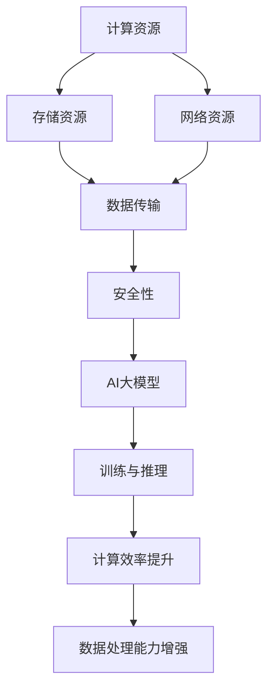

                 

# AI 大模型应用数据中心建设：数据中心技术创新

> **关键词：** AI大模型、数据中心建设、技术创新、云计算、高性能计算、数据存储、数据传输、网络安全

> **摘要：** 本文将深入探讨AI大模型在数据中心建设中的应用及其带来的技术创新。通过分析数据中心的基础设施、核心算法、数学模型和实际应用场景，本文旨在为读者提供一个全面、深入的指南，帮助他们更好地理解并利用AI大模型推动数据中心的发展。

## 1. 背景介绍

### 1.1 目的和范围

本文旨在分析AI大模型在数据中心建设中的应用，探讨其在提升数据处理能力、优化资源利用率和保障数据安全性等方面的创新点。文章将覆盖数据中心基础设施、核心算法原理、数学模型以及实际应用场景等多个方面，旨在为读者提供一个系统的技术指南。

### 1.2 预期读者

本文适合对数据中心建设和AI技术有一定了解的读者，包括数据中心架构师、AI研究人员、软件开发工程师等。同时，对于对AI大模型及其应用感兴趣的其他技术人员和研究人员，本文也具有一定的参考价值。

### 1.3 文档结构概述

本文分为八个主要部分：

1. 背景介绍：包括目的和范围、预期读者、文档结构概述等。
2. 核心概念与联系：介绍数据中心的基础设施和AI大模型的核心概念，并通过Mermaid流程图展示两者之间的联系。
3. 核心算法原理 & 具体操作步骤：详细阐述AI大模型的核心算法原理和操作步骤。
4. 数学模型和公式 & 详细讲解 & 举例说明：介绍AI大模型相关的数学模型，并给出具体例子进行讲解。
5. 项目实战：代码实际案例和详细解释说明。
6. 实际应用场景：探讨AI大模型在数据中心建设的实际应用场景。
7. 工具和资源推荐：推荐相关学习资源和开发工具。
8. 总结：未来发展趋势与挑战。

### 1.4 术语表

#### 1.4.1 核心术语定义

- **数据中心**：一种专门用于存储、处理和管理大量数据的设施。
- **AI大模型**：一种具有大规模参数和复杂结构的机器学习模型。
- **云计算**：一种通过网络提供计算资源和服务的能力。
- **高性能计算**：一种利用先进计算技术和硬件，实现高速数据处理的能力。
- **数据存储**：将数据存储在持久化设备上的过程。
- **数据传输**：在网络中传输数据的过程。
- **网络安全**：保障网络系统和数据免受恶意攻击和破坏的措施。

#### 1.4.2 相关概念解释

- **分布式计算**：一种将计算任务分布在多个计算节点上，通过通信网络进行协调和处理的计算模式。
- **集群**：一种由多个计算节点组成的计算系统，通过共享资源，实现高性能计算和容错能力。
- **数据湖**：一种用于存储大量结构化和非结构化数据的数据存储设施。
- **容器化**：一种将应用程序及其依赖项打包到容器中的技术，实现应用程序的部署和运行环境的隔离。

#### 1.4.3 缩略词列表

- **AI**：人工智能（Artificial Intelligence）
- **ML**：机器学习（Machine Learning）
- **DL**：深度学习（Deep Learning）
- **GPU**：图形处理器（Graphics Processing Unit）
- **CPU**：中央处理器（Central Processing Unit）
- **TPU**：张量处理器（Tensor Processing Unit）
- **HDFS**：Hadoop分布式文件系统（Hadoop Distributed File System）
- **Kubernetes**：一个用于容器编排的开源平台

## 2. 核心概念与联系

### 2.1 数据中心基础设施

数据中心是现代信息社会的重要基础设施，它为各种应用提供了强大的计算、存储和数据处理能力。数据中心通常由以下几个关键组成部分构成：

- **计算资源**：包括服务器、存储设备和网络设备等，用于处理和管理数据。
- **存储资源**：用于存储大量数据，包括磁盘阵列、固态硬盘和分布式文件系统等。
- **网络资源**：包括局域网、广域网和互联网等，用于数据传输和通信。
- **电源和冷却系统**：保证数据中心正常运行的关键设施，确保设备的稳定供电和温度控制。
- **安全系统**：包括防火墙、入侵检测系统和数据加密等，保障数据的安全和隐私。

### 2.2 AI大模型

AI大模型是指具有大规模参数和复杂结构的机器学习模型。这些模型通常通过深度学习技术训练而成，能够在各种任务中表现出出色的性能。AI大模型的核心特点包括：

- **大规模参数**：AI大模型通常包含数十亿甚至数万亿个参数，使其能够捕捉到数据中的复杂模式和规律。
- **深度结构**：AI大模型通常采用深度神经网络结构，通过层层传递和变换，实现对数据的复杂建模。
- **自主学习能力**：AI大模型能够通过大量数据自动学习和优化参数，提高模型的性能。

### 2.3 数据中心与AI大模型之间的联系

数据中心与AI大模型之间存在密切的联系，两者共同推动了信息技术的发展。以下是一些关键联系：

- **计算资源**：AI大模型的训练和推理过程需要大量计算资源，数据中心提供了高性能计算服务器和GPU等硬件资源，为AI大模型提供了强大的计算能力。
- **存储资源**：AI大模型在训练和推理过程中需要处理海量数据，数据中心提供了高效的存储解决方案，如分布式文件系统和数据湖，确保数据的快速访问和存储。
- **数据传输**：数据中心提供了高速网络资源，确保AI大模型在训练和推理过程中能够快速传输数据，提高计算效率。
- **安全性**：数据中心的安全系统为AI大模型提供了安全保障，防止数据泄露和恶意攻击。

### 2.4 Mermaid流程图

以下是一个简化的Mermaid流程图，展示了数据中心基础设施与AI大模型之间的联系：



## 3. 核心算法原理 & 具体操作步骤

### 3.1 AI大模型的核心算法原理

AI大模型的核心算法原理是基于深度学习技术。深度学习是一种通过多层神经网络模型对数据进行自动特征提取和分类的机器学习方法。深度学习模型通常包括以下几个关键组成部分：

- **输入层**：接收外部输入数据，如图像、文本或语音等。
- **隐藏层**：对输入数据进行特征提取和变换，逐层传递，捕捉数据的复杂模式和规律。
- **输出层**：根据隐藏层的输出，生成预测结果，如分类标签、概率分布等。

### 3.2 具体操作步骤

以下是一个简化的AI大模型训练和推理的步骤：

#### 3.2.1 数据预处理

- **数据收集**：从各种数据源收集原始数据。
- **数据清洗**：去除噪声、异常值和缺失值，确保数据质量。
- **数据归一化**：将不同尺度的数据进行归一化处理，使数据具有相似的分布。

#### 3.2.2 模型构建

- **网络架构设计**：设计深度神经网络的层次结构，包括输入层、隐藏层和输出层。
- **损失函数选择**：根据具体任务选择合适的损失函数，如交叉熵损失、均方误差等。
- **优化器选择**：选择合适的优化算法，如随机梯度下降（SGD）、Adam等。

#### 3.2.3 训练过程

- **初始化参数**：随机初始化模型的参数。
- **前向传播**：将输入数据通过神经网络进行前向传播，计算输出。
- **计算损失**：计算预测结果与真实标签之间的损失值。
- **反向传播**：根据损失函数计算梯度，通过反向传播更新模型参数。
- **迭代优化**：重复上述步骤，逐步优化模型参数。

#### 3.2.4 模型评估

- **验证集评估**：在验证集上评估模型的性能，选择性能最优的模型。
- **测试集评估**：在测试集上评估模型的泛化能力。

#### 3.2.5 模型部署

- **模型导出**：将训练完成的模型导出为可部署的格式。
- **模型推理**：使用部署的模型对新的输入数据进行推理和预测。

### 3.3 伪代码

以下是一个简化的AI大模型训练过程的伪代码：

```python
# 初始化参数
W, b = initialize_parameters()

# 迭代优化
for epoch in range(num_epochs):
    for sample in data_loader:
        # 前向传播
        z = forward_pass(sample, W, b)
        
        # 计算损失
        loss = compute_loss(z, target)
        
        # 反向传播
        dW, db = backward_pass(z, target)
        
        # 更新参数
        W, b = update_parameters(W, b, dW, db)

# 验证集评估
validate_model(validate_data_loader)

# 模型部署
deploy_model(model)
```

## 4. 数学模型和公式 & 详细讲解 & 举例说明

### 4.1 数学模型

AI大模型的核心数学模型是深度神经网络（Deep Neural Network，DNN）。DNN由多层神经元组成，每层神经元接收前一层神经元的输出，通过激活函数进行非线性变换，最终输出预测结果。DNN的数学模型可以表示为：

$$
y = \sigma(W_n \cdot z_{n-1} + b_n)
$$

其中，$y$为输出，$\sigma$为激活函数，$W_n$为权重矩阵，$z_{n-1}$为前一层神经元的输出，$b_n$为偏置向量。

### 4.2 公式讲解

以下是对DNN数学模型中关键公式的详细讲解：

#### 4.2.1 前向传播

前向传播是DNN计算过程中的一个关键步骤，用于计算每层神经元的输出。前向传播的公式可以表示为：

$$
z_n = W_n \cdot a_{n-1} + b_n
$$

其中，$z_n$为第$n$层的输入，$a_{n-1}$为前一层神经元的输出，$W_n$为权重矩阵，$b_n$为偏置向量。

#### 4.2.2 反向传播

反向传播是DNN优化过程中的一个关键步骤，用于计算模型参数的梯度。反向传播的公式可以表示为：

$$
\frac{\partial J}{\partial W_n} = \frac{\partial L}{\partial z_n} \cdot \frac{\partial z_n}{\partial W_n}
$$

$$
\frac{\partial J}{\partial b_n} = \frac{\partial L}{\partial z_n}
$$

其中，$J$为损失函数，$L$为每层神经元的损失值，$\frac{\partial J}{\partial W_n}$和$\frac{\partial J}{\partial b_n}$分别为权重矩阵和偏置向量的梯度。

#### 4.2.3 激活函数

激活函数是DNN中的一个关键组件，用于引入非线性变换，使DNN具有更好的表达能力。常用的激活函数包括：

- **Sigmoid函数**：$f(x) = \frac{1}{1 + e^{-x}}$
- **ReLU函数**：$f(x) = \max(0, x)$
- **Tanh函数**：$f(x) = \frac{e^x - e^{-x}}{e^x + e^{-x}}$

### 4.3 举例说明

以下是一个简化的DNN模型的前向传播和反向传播的例子：

#### 4.3.1 前向传播

假设有一个简单的DNN模型，包含两层神经元，输入为$(x_1, x_2)$，权重矩阵$W_1$和$W_2$分别为：

$$
W_1 = \begin{bmatrix}
0.1 & 0.2 \\
0.3 & 0.4
\end{bmatrix}
$$

$$
W_2 = \begin{bmatrix}
0.5 & 0.6 \\
0.7 & 0.8
\end{bmatrix}
$$

输入$(x_1, x_2) = (2, 3)$，偏置向量$b_1$和$b_2$分别为$(0, 0)$。采用ReLU函数作为激活函数。

- **第一层**：

$$
z_1 = W_1 \cdot a_0 + b_1 = \begin{bmatrix}
0.1 & 0.2 \\
0.3 & 0.4
\end{bmatrix} \cdot \begin{bmatrix}
2 \\
3
\end{bmatrix} + \begin{bmatrix}
0 \\
0
\end{bmatrix} = \begin{bmatrix}
0.4 \\
1.2
\end{bmatrix}
$$

$$
a_1 = \sigma(z_1) = \begin{bmatrix}
0.4 \\
1.2
\end{bmatrix}
$$

- **第二层**：

$$
z_2 = W_2 \cdot a_1 + b_2 = \begin{bmatrix}
0.5 & 0.6 \\
0.7 & 0.8
\end{bmatrix} \cdot \begin{bmatrix}
0.4 \\
1.2
\end{bmatrix} + \begin{bmatrix}
0 \\
0
\end{bmatrix} = \begin{bmatrix}
0.34 \\
0.94
\end{bmatrix}
$$

$$
a_2 = \sigma(z_2) = \begin{bmatrix}
0.34 \\
0.94
\end{bmatrix}
$$

#### 4.3.2 反向传播

假设输出层为单神经元，实际标签为$y = 0.3$，损失函数为均方误差（MSE）：

$$
L = \frac{1}{2} (y - a_2)^2
$$

- **计算输出层梯度**：

$$
\frac{\partial L}{\partial a_2} = 2(y - a_2)
$$

$$
\frac{\partial L}{\partial z_2} = \frac{\partial L}{\partial a_2} \cdot \frac{\partial a_2}{\partial z_2} = 2(y - a_2)
$$

- **计算第二层梯度**：

$$
\frac{\partial L}{\partial a_1} = \frac{\partial L}{\partial z_2} \cdot \frac{\partial z_2}{\partial a_1} = 2(y - a_2) \cdot \frac{\partial a_2}{\partial z_2}
$$

$$
\frac{\partial L}{\partial z_1} = \frac{\partial L}{\partial a_1} \cdot \frac{\partial a_1}{\partial z_1} = 2(y - a_2) \cdot \frac{\partial a_2}{\partial z_2} \cdot \frac{\partial a_1}{\partial z_1}
$$

- **更新参数**：

$$
\Delta W_2 = \frac{\partial L}{\partial z_2} \cdot a_1 = 2(y - a_2) \cdot a_1
$$

$$
\Delta b_2 = \frac{\partial L}{\partial z_2} = 2(y - a_2)
$$

$$
\Delta W_1 = \frac{\partial L}{\partial z_1} \cdot a_0 = 2(y - a_2) \cdot a_1 \cdot a_0
$$

$$
\Delta b_1 = \frac{\partial L}{\partial z_1} = 2(y - a_2) \cdot a_1
$$

## 5. 项目实战：代码实际案例和详细解释说明

### 5.1 开发环境搭建

为了实现AI大模型在数据中心的建设，我们需要搭建一个适合开发和部署的环境。以下是一个简单的开发环境搭建步骤：

- **安装Python**：确保Python版本为3.7及以上。
- **安装TensorFlow**：使用pip安装TensorFlow库。
  ```bash
  pip install tensorflow
  ```
- **安装Jupyter Notebook**：安装Jupyter Notebook，方便进行交互式编程和调试。
  ```bash
  pip install jupyter
  ```
- **安装相关依赖**：根据项目需求，安装其他相关依赖，如NumPy、Pandas等。

### 5.2 源代码详细实现和代码解读

以下是一个简单的AI大模型训练和推理的代码实现：

```python
import tensorflow as tf
import numpy as np

# 设置超参数
input_shape = (784,)
hidden_units = 256
output_shape = 10
learning_rate = 0.001
num_epochs = 10

# 函数：构建DNN模型
def build_model(input_shape, hidden_units, output_shape):
    model = tf.keras.Sequential([
        tf.keras.layers.Dense(hidden_units, activation='relu', input_shape=input_shape),
        tf.keras.layers.Dense(output_shape, activation='softmax')
    ])
    model.compile(optimizer=tf.keras.optimizers.Adam(learning_rate=learning_rate),
                  loss='categorical_crossentropy',
                  metrics=['accuracy'])
    return model

# 函数：训练DNN模型
def train_model(model, x_train, y_train, num_epochs):
    model.fit(x_train, y_train, epochs=num_epochs, batch_size=64)

# 函数：评估DNN模型
def evaluate_model(model, x_test, y_test):
    loss, accuracy = model.evaluate(x_test, y_test)
    print(f"Test accuracy: {accuracy:.4f}")

# 加载数据集
(x_train, y_train), (x_test, y_test) = tf.keras.datasets.mnist.load_data()

# 数据预处理
x_train = x_train.reshape(-1, 784).astype(np.float32) / 255.0
x_test = x_test.reshape(-1, 784).astype(np.float32) / 255.0
y_train = tf.keras.utils.to_categorical(y_train, 10)
y_test = tf.keras.utils.to_categorical(y_test, 10)

# 构建模型
model = build_model(input_shape, hidden_units, output_shape)

# 训练模型
train_model(model, x_train, y_train, num_epochs)

# 评估模型
evaluate_model(model, x_test, y_test)
```

### 5.3 代码解读与分析

以下是对上述代码的详细解读与分析：

- **导入库和设置超参数**：首先导入所需的库，包括TensorFlow、NumPy等。然后设置DNN模型的超参数，如输入形状、隐藏层单元数、输出形状、学习率等。

- **构建DNN模型**：定义`build_model`函数，用于构建DNN模型。模型采用`tf.keras.Sequential`结构，包含一个全连接层（`Dense`）和一个softmax层（`Dense`），并使用ReLU函数作为激活函数。模型编译时，指定优化器为Adam，损失函数为交叉熵损失，评估指标为准确率。

- **训练DNN模型**：定义`train_model`函数，用于训练DNN模型。该函数使用`model.fit`方法进行模型训练，传入训练数据、标签、训练轮数和批量大小。

- **评估DNN模型**：定义`evaluate_model`函数，用于评估DNN模型的性能。该函数使用`model.evaluate`方法计算测试数据上的损失和准确率。

- **加载数据集**：使用TensorFlow内置的MNIST数据集进行演示。数据集包括训练数据和测试数据，需要对其进行预处理，如重塑形状、归一化等。

- **数据预处理**：对训练数据和测试数据进行归一化处理，将输入数据从0-255范围缩放到0-1范围，并将标签转换为独热编码。

- **构建模型**：调用`build_model`函数，构建DNN模型。

- **训练模型**：调用`train_model`函数，训练DNN模型，指定训练轮数为10。

- **评估模型**：调用`evaluate_model`函数，评估DNN模型在测试数据上的性能。

## 6. 实际应用场景

### 6.1 人工智能助手

数据中心中的AI大模型可以应用于人工智能助手，如智能客服、智能语音助手等。通过深度学习技术，AI大模型可以理解用户的查询意图，提供准确的答复和建议。这种应用场景可以大幅提升用户体验和效率。

### 6.2 图像识别与处理

数据中心中的AI大模型可以应用于图像识别与处理，如图像分类、目标检测、图像增强等。通过大规模训练和优化，AI大模型可以实现对图像的精细理解和处理，从而为图像处理领域带来革命性变革。

### 6.3 自然语言处理

数据中心中的AI大模型可以应用于自然语言处理，如文本分类、情感分析、机器翻译等。通过深度学习技术，AI大模型可以捕捉到语言中的复杂模式和规律，从而为自然语言处理领域提供强大的支持。

### 6.4 金融风控

数据中心中的AI大模型可以应用于金融风控，如信用评估、欺诈检测等。通过深度学习技术，AI大模型可以识别出潜在的风险因素，为金融机构提供准确的风险评估和决策支持。

## 7. 工具和资源推荐

### 7.1 学习资源推荐

#### 7.1.1 书籍推荐

- 《深度学习》（Ian Goodfellow、Yoshua Bengio、Aaron Courville著）：系统介绍了深度学习的基础知识和技术。
- 《Python机器学习》（Sebastian Raschka、Vahid Mirjalili著）：通过实际案例，深入讲解了机器学习在Python中的实现。

#### 7.1.2 在线课程

- 《深度学习专项课程》（吴恩达，Coursera）：由深度学习领域权威吴恩达教授主讲，系统介绍了深度学习的基础知识和应用。
- 《机器学习专项课程》（吴恩达，Coursera）：由深度学习领域权威吴恩达教授主讲，全面讲解了机器学习的基础知识和应用。

#### 7.1.3 技术博客和网站

- [机器学习社区](https://www.mlcommunity.cn/): 提供丰富的机器学习和深度学习相关文章和资源。
- [Kaggle](https://www.kaggle.com/): 一个提供数据集和竞赛的平台，适合进行机器学习和深度学习实践。

### 7.2 开发工具框架推荐

#### 7.2.1 IDE和编辑器

- PyCharm：一款功能强大的Python IDE，支持多种编程语言。
- Jupyter Notebook：一款交互式计算环境，方便进行数据分析和模型训练。

#### 7.2.2 调试和性能分析工具

- TensorBoard：TensorFlow的官方可视化工具，用于分析和调试深度学习模型。
- NVIDIA Nsight Compute：用于分析GPU性能和优化深度学习模型。

#### 7.2.3 相关框架和库

- TensorFlow：一款流行的深度学习框架，提供丰富的API和工具。
- PyTorch：一款流行的深度学习框架，具有动态计算图和灵活的API。

### 7.3 相关论文著作推荐

#### 7.3.1 经典论文

- "A Theoretical Framework for Back-Propagation"（1986，Paul Werbos）：介绍了反向传播算法的基本原理。
- "Deep Learning"（2015，Ian Goodfellow、Yoshua Bengio、Aaron Courville）：系统介绍了深度学习的基础知识和应用。

#### 7.3.2 最新研究成果

- "An Efficient Method for Large-Scale Machine Learning"（2012，Stochastic Gradient Descent，SGD）：介绍了随机梯度下降算法在大型数据集上的高效应用。
- "Attention Is All You Need"（2017，Transformer模型）：提出了Transformer模型，在序列建模任务中取得了突破性成果。

#### 7.3.3 应用案例分析

- "Deep Learning in Autonomous Driving"（自动驾驶领域）：介绍了深度学习在自动驾驶中的应用，包括感知、规划和控制等方面。
- "Deep Learning for Healthcare"（医疗领域）：介绍了深度学习在医疗诊断、治疗规划和个性化医疗等方面的应用。

## 8. 总结：未来发展趋势与挑战

### 8.1 未来发展趋势

1. **大规模计算能力提升**：随着硬件技术的不断发展，数据中心将拥有更强大的计算能力，支持更大规模、更复杂的AI大模型训练和推理。

2. **分布式计算和边缘计算**：分布式计算和边缘计算将逐渐普及，为数据中心提供更灵活、高效的计算和存储解决方案。

3. **数据隐私和安全**：随着数据隐私和安全问题的日益凸显，数据中心将加强对数据安全和隐私的保护，采用更加先进的安全技术和加密算法。

4. **跨领域应用**：AI大模型在各个领域的应用将越来越广泛，包括金融、医疗、教育、智能制造等，为各行业带来创新和变革。

### 8.2 挑战

1. **数据质量和隐私**：数据中心需要处理海量、多样的数据，如何保证数据的质量和隐私成为一个重要挑战。

2. **计算资源优化**：如何高效地利用数据中心中的计算资源，提高计算效率，降低能耗成为关键问题。

3. **模型解释性和可解释性**：随着AI大模型的应用越来越广泛，如何确保模型的解释性和可解释性，使其更好地被人类理解和接受成为挑战。

4. **法律法规和伦理**：AI大模型在数据中心的应用涉及法律法规和伦理问题，如何制定相应的政策和规范，保障数据的合理使用和公平公正成为关键挑战。

## 9. 附录：常见问题与解答

### 9.1 什么是数据中心？

数据中心是一种专门用于存储、处理和管理大量数据的设施。它通常包括计算资源、存储资源、网络资源、电源和冷却系统等关键组成部分，为各种应用提供强大的计算、存储和数据处理能力。

### 9.2 什么是AI大模型？

AI大模型是指具有大规模参数和复杂结构的机器学习模型。这些模型通常通过深度学习技术训练而成，能够在各种任务中表现出出色的性能，如图像识别、自然语言处理、机器翻译等。

### 9.3 什么

### 9.3.1 什么是反向传播算法？

反向传播算法是深度学习训练过程中的一个关键步骤，用于计算模型参数的梯度。该算法通过前向传播计算输出，然后通过反向传播计算损失函数关于模型参数的梯度，从而更新模型参数，优化模型性能。

### 9.3.2 什么是深度神经网络？

深度神经网络（Deep Neural Network，DNN）是一种具有多层神经元结构的神经网络。通过多层神经元的传递和变换，DNN可以捕捉到数据的复杂模式和规律，实现高级特征提取和分类。

## 10. 扩展阅读 & 参考资料

- [《深度学习》](https://www.deeplearningbook.org/)
- [《Python机器学习》](https://python-machine-learning-book.com/)
- [《深度学习专项课程》](https://www.coursera.org/learn/deep-learning)
- [《机器学习专项课程》](https://www.coursera.org/learn/machine-learning)
- [TensorFlow官方文档](https://www.tensorflow.org/)
- [PyTorch官方文档](https://pytorch.org/)
- [Kaggle](https://www.kaggle.com/)
- [机器学习社区](https://www.mlcommunity.cn/)

