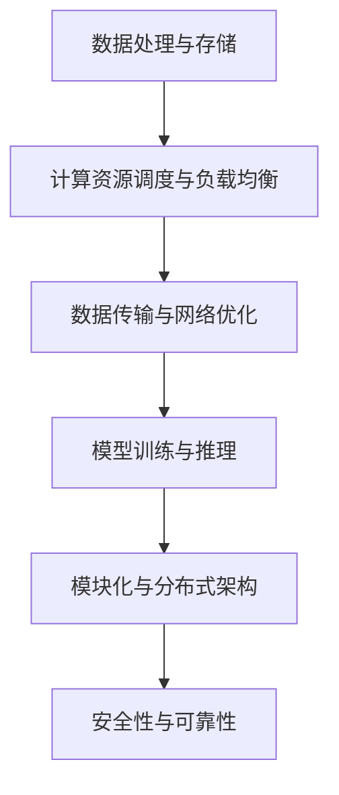

                 

# AI 大模型应用数据中心建设：数据中心技术创新

> 关键词：AI大模型、数据中心建设、技术创新、数据处理、性能优化

> 摘要：本文旨在探讨AI大模型应用数据中心建设的现状和未来发展趋势。通过分析数据中心技术创新的核心概念和原理，详细阐述数据中心建设中的关键算法、数学模型和实际应用场景。同时，推荐一系列相关工具和资源，帮助读者深入了解并掌握数据中心技术创新的实际应用。

## 1. 背景介绍

### 1.1 目的和范围

本文将围绕AI大模型应用数据中心建设这一主题，探讨数据中心技术创新的相关内容。通过分析核心概念和原理，详细阐述数据中心建设中的关键技术和应用场景。旨在为读者提供一份系统、全面的参考指南，帮助他们在数据中心建设中实现技术创新。

### 1.2 预期读者

本文适合对数据中心建设、AI大模型技术有一定了解的读者，包括：

- 数据中心架构师和项目经理
- AI研发工程师和技术专家
- 对数据中心技术创新感兴趣的技术爱好者

### 1.3 文档结构概述

本文将分为以下八个部分：

1. 背景介绍：介绍本文的目的、预期读者和文档结构。
2. 核心概念与联系：分析数据中心技术创新的核心概念和架构。
3. 核心算法原理 & 具体操作步骤：讲解数据中心建设中的关键算法和操作步骤。
4. 数学模型和公式 & 详细讲解 & 举例说明：阐述数据中心建设中的数学模型和公式。
5. 项目实战：代码实际案例和详细解释说明。
6. 实际应用场景：介绍数据中心技术创新在各个领域的应用。
7. 工具和资源推荐：推荐学习资源和开发工具。
8. 总结：未来发展趋势与挑战。

### 1.4 术语表

#### 1.4.1 核心术语定义

- AI大模型：一种能够处理大规模数据、实现高效计算和智能推理的深度学习模型。
- 数据中心：一种为存储、处理、交换和管理数据而设计的设施。
- 技术创新：在数据中心建设中引入新的技术、方法或架构，以提高性能、效率和可靠性。

#### 1.4.2 相关概念解释

- 数据处理：对数据进行分析、转换和存储的过程。
- 性能优化：通过优化算法、架构和硬件等手段提高数据中心的性能。
- 模型训练：通过大量数据训练AI大模型，使其具备智能推理能力。

#### 1.4.3 缩略词列表

- AI：人工智能（Artificial Intelligence）
- 大模型（Large Model）：指规模较大的深度学习模型
- 数据中心（Data Center）
- GPU：图形处理器（Graphics Processing Unit）
- CPU：中央处理器（Central Processing Unit）

## 2. 核心概念与联系

在数据中心技术创新中，核心概念和原理是理解其架构和实现的关键。以下是对数据中心技术创新的核心概念和架构的详细解释。

### 2.1 数据处理与存储

数据处理和存储是数据中心技术的基石。数据处理包括数据的收集、清洗、转换和存储等过程。存储方面，数据中心通常采用分布式存储系统，如HDFS（Hadoop分布式文件系统）或Ceph，以提高数据存储的可靠性和性能。

### 2.2 计算资源调度与负载均衡

计算资源调度与负载均衡是数据中心技术创新的重要方面。通过合理分配计算资源，实现负载均衡，可以提高数据中心的整体性能。调度算法如轮询调度、最小连接数调度等，是实现计算资源调度与负载均衡的关键。

### 2.3 数据传输与网络优化

数据传输与网络优化是提高数据中心性能的重要因素。网络优化包括数据压缩、数据加密和数据传输速率优化等。常见的数据传输协议有TCP/IP、HTTP/2等，而网络优化技术如CDN（内容分发网络）和DNS（域名系统）等，有助于提高数据传输速度和网络可靠性。

### 2.4 模型训练与推理

模型训练与推理是数据中心技术创新的核心。模型训练通过大量数据训练AI大模型，使其具备智能推理能力。训练过程中，常用的算法包括卷积神经网络（CNN）、循环神经网络（RNN）和Transformer等。推理过程中，模型需要对输入数据进行快速、准确的处理，以实现高效的应用。

### 2.5 模块化与分布式架构

模块化与分布式架构是数据中心技术创新的关键。通过模块化设计，可以将数据中心划分为多个功能模块，实现灵活的扩展和部署。分布式架构则通过将计算任务分布在多个节点上，提高数据中心的计算性能和容错能力。

### 2.6 安全性与可靠性

安全性与可靠性是数据中心技术创新的重要保障。数据中心需要采取一系列安全措施，如数据加密、身份认证和访问控制等，确保数据安全和用户隐私。同时，通过冗余设计和故障转移等机制，提高数据中心的可靠性和稳定性。

### 2.7 Mermaid 流程图

以下是一个简单的Mermaid流程图，展示数据中心技术创新的核心概念和架构：



## 3. 核心算法原理 & 具体操作步骤

数据中心技术创新中的核心算法是实现数据处理、模型训练和推理等任务的关键。以下将对核心算法的原理和具体操作步骤进行详细阐述。

### 3.1 数据处理算法

数据处理算法主要包括数据清洗、数据转换和数据存储等步骤。

#### 3.1.1 数据清洗

数据清洗是指去除数据中的噪声、异常值和重复数据等，以提高数据质量。常用的数据清洗算法包括：

- 填空算法：用平均值、中位数或最接近的值填充缺失值。
- 去除异常值：通过统计方法或基于阈值的规则去除异常值。

```python
def fill_missing_values(data):
    # 计算平均值
    mean = sum(data) / len(data)
    # 用平均值填充缺失值
    data = [mean if x is None else x for x in data]
    return data

def remove_outliers(data, threshold=3):
    # 计算平均值和标准差
    mean = sum(data) / len(data)
    std = sqrt(sum((x - mean) ** 2 for x in data) / len(data))
    # 去除大于阈值的异常值
    data = [x for x in data if abs(x - mean) <= threshold * std]
    return data
```

#### 3.1.2 数据转换

数据转换是指将数据转换为适合处理和分析的格式。常用的数据转换方法包括：

- 数据类型转换：如将字符串转换为数值类型。
- 数据归一化：将数据缩放到特定范围，如0到1之间。
- 数据离散化：将连续数据划分为多个离散区间。

```python
def convert_data_type(data):
    # 将字符串转换为数值类型
    data = [float(x) for x in data]
    return data

def normalize_data(data):
    # 将数据缩放到0到1之间
    min_value = min(data)
    max_value = max(data)
    return [(x - min_value) / (max_value - min_value) for x in data]

def discretize_data(data, bins=5):
    # 将数据划分为多个离散区间
    min_value = min(data)
    max_value = max(data)
    bin_width = (max_value - min_value) / bins
    intervals = [(min_value + i * bin_width, min_value + (i + 1) * bin_width) for i in range(bins)]
    return [intervals.index((x, x + bin_width)) for x in data]
```

#### 3.1.3 数据存储

数据存储是将处理后的数据存储到合适的存储系统，如HDFS或Ceph。以下是一个简单的HDFS存储示例：

```python
import hdfs

# 连接HDFS
client = hdfs.InsecureClient('http://hdfs-namenode:50070', user='hdfs')

# 创建目录
client.makedirs('/data/processed')

# 存储数据
with open('processed_data.csv', 'w') as file:
    for data in processed_data:
        file.write(f"{data}\n")

client.upload('/data/processed/processed_data.csv', 'processed_data.csv')
```

### 3.2 模型训练算法

模型训练算法是数据中心技术创新的核心。以下以卷积神经网络（CNN）为例，介绍模型训练的基本原理和操作步骤。

#### 3.2.1 基本原理

CNN是一种用于图像处理的深度学习模型，通过卷积、池化和全连接等操作实现图像特征的提取和分类。

- 卷积：通过卷积核在输入图像上滑动，计算卷积结果。
- 池化：将卷积结果划分为多个区域，计算每个区域的平均或最大值。
- 全连接：将池化结果映射到输出类别。

#### 3.2.2 操作步骤

1. 数据预处理：将图像数据转换为适合输入CNN的格式，如归一化、裁剪等。
2. 构建CNN模型：使用深度学习框架（如TensorFlow或PyTorch）构建CNN模型。
3. 模型训练：通过反向传播算法训练模型，优化模型参数。
4. 模型评估：使用验证集评估模型性能，调整模型参数。
5. 模型部署：将训练好的模型部署到数据中心，实现图像分类任务。

```python
import tensorflow as tf

# 数据预处理
def preprocess_image(image):
    image = tf.cast(image, dtype=tf.float32)
    image = tf.reshape(image, [224, 224, 3])
    image = tf.keras.applications.vgg16.preprocess_input(image)
    return image

# 构建CNN模型
model = tf.keras.Sequential([
    tf.keras.layers.Conv2D(32, (3, 3), activation='relu', input_shape=(224, 224, 3)),
    tf.keras.layers.MaxPooling2D((2, 2)),
    tf.keras.layers.Conv2D(64, (3, 3), activation='relu'),
    tf.keras.layers.MaxPooling2D((2, 2)),
    tf.keras.layers.Conv2D(128, (3, 3), activation='relu'),
    tf.keras.layers.MaxPooling2D((2, 2)),
    tf.keras.layers.Flatten(),
    tf.keras.layers.Dense(128, activation='relu'),
    tf.keras.layers.Dense(num_classes, activation='softmax')
])

# 模型训练
model.compile(optimizer='adam', loss='categorical_crossentropy', metrics=['accuracy'])
model.fit(train_images, train_labels, epochs=10, validation_data=(val_images, val_labels))

# 模型评估
test_loss, test_acc = model.evaluate(test_images, test_labels)
print(f"Test accuracy: {test_acc}")

# 模型部署
model.save('/data/model/cnn_model.h5')
```

### 3.3 模型推理算法

模型推理算法是指使用训练好的模型对输入数据进行分类或预测。以下以卷积神经网络（CNN）为例，介绍模型推理的基本原理和操作步骤。

#### 3.3.1 基本原理

CNN模型推理过程中，通过卷积、池化和全连接等操作，将输入图像映射到输出类别。

#### 3.3.2 操作步骤

1. 输入预处理：将输入图像转换为适合模型输入的格式。
2. 模型加载：加载训练好的CNN模型。
3. 模型推理：使用模型对输入图像进行分类或预测。
4. 输出处理：对模型输出进行处理，如计算概率、阈值化等。

```python
# 输入预处理
def preprocess_image(image):
    image = tf.cast(image, dtype=tf.float32)
    image = tf.reshape(image, [224, 224, 3])
    image = tf.keras.applications.vgg16.preprocess_input(image)
    return image

# 模型加载
model = tf.keras.models.load_model('/data/model/cnn_model.h5')

# 模型推理
def predict_image(image):
    processed_image = preprocess_image(image)
    prediction = model.predict(processed_image)
    return prediction

# 输出处理
def get_prediction_label(prediction):
    label = tf.argmax(prediction).numpy()
    return label
```

## 4. 数学模型和公式 & 详细讲解 & 举例说明

数据中心技术创新中的数学模型和公式是理解核心算法原理和实现的关键。以下将详细讲解一些常用的数学模型和公式，并通过实例进行说明。

### 4.1 卷积神经网络（CNN）

卷积神经网络（CNN）是一种用于图像处理的深度学习模型，其基本原理是通过卷积、池化和全连接等操作，提取图像特征并进行分类。

#### 4.1.1 卷积操作

卷积操作是CNN的核心操作之一，通过卷积核在输入图像上滑动，计算卷积结果。卷积操作的数学公式如下：

$$
\text{output}_{ij} = \sum_{k=1}^{C} \text{weight}_{ikj} \cdot \text{input}_{ij}
$$

其中，$C$表示卷积核数量，$i$和$j$表示输出特征图的位置，$\text{weight}_{ikj}$和$\text{input}_{ij}$分别表示卷积核和输入图像的元素。

#### 4.1.2 池化操作

池化操作用于减小特征图的大小，同时保留重要特征。常见的池化操作有最大池化和平均池化。最大池化的数学公式如下：

$$
\text{output}_{ij} = \max(\text{input}_{i \cdot s + j})
$$

其中，$s$表示池化窗口的大小。

#### 4.1.3 全连接操作

全连接操作将特征图映射到输出类别。全连接操作的数学公式如下：

$$
\text{output}_{i} = \sum_{j=1}^{H \cdot W \cdot C} \text{weight}_{ij} \cdot \text{input}_{j} + \text{bias}_{i}
$$

其中，$H$、$W$和$C$分别表示特征图的高度、宽度和通道数，$\text{weight}_{ij}$和$\text{bias}_{i}$分别表示权重和偏置。

#### 4.1.4 举例说明

以下是一个简单的CNN模型，用于图像分类：

```python
import tensorflow as tf

model = tf.keras.Sequential([
    tf.keras.layers.Conv2D(32, (3, 3), activation='relu', input_shape=(224, 224, 3)),
    tf.keras.layers.MaxPooling2D((2, 2)),
    tf.keras.layers.Conv2D(64, (3, 3), activation='relu'),
    tf.keras.layers.MaxPooling2D((2, 2)),
    tf.keras.layers.Conv2D(128, (3, 3), activation='relu'),
    tf.keras.layers.MaxPooling2D((2, 2)),
    tf.keras.layers.Flatten(),
    tf.keras.layers.Dense(128, activation='relu'),
    tf.keras.layers.Dense(num_classes, activation='softmax')
])

# 模型编译
model.compile(optimizer='adam', loss='categorical_crossentropy', metrics=['accuracy'])

# 模型训练
model.fit(train_images, train_labels, epochs=10, validation_data=(val_images, val_labels))

# 模型评估
test_loss, test_acc = model.evaluate(test_images, test_labels)
print(f"Test accuracy: {test_acc}")
```

### 4.2 反向传播算法

反向传播算法是深度学习模型训练的核心算法，通过计算损失函数关于模型参数的梯度，优化模型参数。

#### 4.2.1 梯度计算

梯度计算是反向传播算法的关键步骤，用于计算损失函数关于模型参数的梯度。梯度计算公式如下：

$$
\frac{\partial \text{loss}}{\partial \text{weight}} = \frac{\partial \text{output}}{\partial \text{weight}} \cdot \frac{\partial \text{loss}}{\partial \text{output}}
$$

其中，$\frac{\partial \text{loss}}{\partial \text{weight}}$表示损失函数关于权重的梯度，$\frac{\partial \text{output}}{\partial \text{weight}}$表示输出关于权重的梯度，$\frac{\partial \text{loss}}{\partial \text{output}}$表示损失函数关于输出的梯度。

#### 4.2.2 梯度下降

梯度下降是一种优化算法，通过更新模型参数以减小损失函数。梯度下降公式如下：

$$
\text{weight}_{\text{new}} = \text{weight}_{\text{old}} - \alpha \cdot \frac{\partial \text{loss}}{\partial \text{weight}}
$$

其中，$\alpha$表示学习率。

#### 4.2.3 举例说明

以下是一个简单的反向传播算法实现：

```python
import tensorflow as tf

# 模型定义
model = tf.keras.Sequential([
    tf.keras.layers.Dense(128, activation='relu', input_shape=(784,)),
    tf.keras.layers.Dense(10, activation='softmax')
])

# 模型编译
model.compile(optimizer='adam', loss='categorical_crossentropy', metrics=['accuracy'])

# 模型训练
model.fit(x_train, y_train, epochs=10, batch_size=32, validation_data=(x_val, y_val))

# 模型评估
test_loss, test_acc = model.evaluate(x_test, y_test)
print(f"Test accuracy: {test_acc}")
```

## 5. 项目实战：代码实际案例和详细解释说明

在数据中心技术创新的实践中，以下将展示一个基于TensorFlow的卷积神经网络（CNN）项目，用于图像分类。项目将包括开发环境搭建、源代码实现和代码解读与分析。

### 5.1 开发环境搭建

在开始项目之前，需要搭建一个合适的开发环境。以下是搭建开发环境的步骤：

1. 安装Python环境：Python 3.6及以上版本。
2. 安装TensorFlow：通过pip安装TensorFlow库，命令如下：

```bash
pip install tensorflow
```

3. 安装其他依赖库：如NumPy、Pandas等，命令如下：

```bash
pip install numpy pandas
```

4. 准备数据集：下载并解压一个图像分类数据集，如CIFAR-10。

### 5.2 源代码详细实现和代码解读

以下是一个简单的CNN图像分类项目的源代码，包括模型定义、模型编译、模型训练和模型评估。

```python
import tensorflow as tf
import numpy as np
import matplotlib.pyplot as plt

# 加载数据集
(x_train, y_train), (x_test, y_test) = tf.keras.datasets.cifar10.load_data()

# 数据预处理
x_train = x_train.astype('float32') / 255.0
x_test = x_test.astype('float32') / 255.0
y_train = tf.keras.utils.to_categorical(y_train, 10)
y_test = tf.keras.utils.to_categorical(y_test, 10)

# 模型定义
model = tf.keras.Sequential([
    tf.keras.layers.Conv2D(32, (3, 3), activation='relu', input_shape=(32, 32, 3)),
    tf.keras.layers.MaxPooling2D((2, 2)),
    tf.keras.layers.Conv2D(64, (3, 3), activation='relu'),
    tf.keras.layers.MaxPooling2D((2, 2)),
    tf.keras.layers.Conv2D(128, (3, 3), activation='relu'),
    tf.keras.layers.MaxPooling2D((2, 2)),
    tf.keras.layers.Flatten(),
    tf.keras.layers.Dense(128, activation='relu'),
    tf.keras.layers.Dense(10, activation='softmax')
])

# 模型编译
model.compile(optimizer='adam', loss='categorical_crossentropy', metrics=['accuracy'])

# 模型训练
model.fit(x_train, y_train, batch_size=64, epochs=10, validation_data=(x_test, y_test))

# 模型评估
test_loss, test_acc = model.evaluate(x_test, y_test)
print(f"Test accuracy: {test_acc}")

# 预测图像
img = x_test[0]
prediction = model.predict(img.reshape(1, 32, 32, 3))
predicted_class = np.argmax(prediction)

# 可视化预测结果
plt.imshow(img.reshape(32, 32, 3))
plt.title(f"Predicted class: {predicted_class}")
plt.show()
```

### 5.3 代码解读与分析

1. 数据预处理：

   加载CIFAR-10数据集，并进行归一化和转置操作。归一化将图像数据缩放到0到1之间，以适应模型的输入要求。转置操作将图像的高度和宽度调整到正确的顺序。

2. 模型定义：

   定义一个简单的CNN模型，包括卷积层、池化层、全连接层等。卷积层用于提取图像特征，池化层用于减小特征图的大小，全连接层用于分类。

3. 模型编译：

   使用adam优化器和categorical_crossentropy损失函数，并设置accuracy为评估指标。

4. 模型训练：

   使用fit方法训练模型，设置batch_size为64，epochs为10，并在验证集上进行验证。

5. 模型评估：

   使用evaluate方法评估模型在测试集上的性能，输出测试准确率。

6. 预测图像：

   使用predict方法对输入图像进行预测，并使用argmax函数获取预测的类别。可视化预测结果，展示图像和预测类别。

通过以上代码实现，我们可以看到CNN模型在图像分类任务上的应用。在实际项目中，可以根据需求调整模型结构、超参数和训练策略，以获得更好的性能。

## 6. 实际应用场景

数据中心技术创新在各个领域具有广泛的应用，以下列举一些实际应用场景。

### 6.1 医疗领域

数据中心技术创新在医疗领域具有巨大的应用潜力。通过大规模数据处理和深度学习模型训练，可以实现疾病预测、诊断和治疗方案推荐。以下是一些具体应用场景：

- 疾病预测：利用历史病例数据，训练深度学习模型，预测患者患某种疾病的风险。
- 诊断辅助：利用医学图像（如CT、MRI）和深度学习模型，辅助医生进行疾病诊断。
- 治疗方案推荐：根据患者的病史和基因数据，推荐个性化的治疗方案。

### 6.2 金融领域

金融领域对数据中心技术创新的需求也日益增长。通过大数据分析和深度学习模型，可以实现风险控制、欺诈检测、投资策略推荐等。

- 风险控制：利用历史交易数据和深度学习模型，识别潜在的风险因素，实时监控风险。
- 欺诈检测：通过分析交易数据和行为模式，识别异常交易和欺诈行为。
- 投资策略推荐：利用大数据分析和深度学习模型，为投资者提供个性化的投资策略。

### 6.3 物流领域

物流领域中的数据中心技术创新，可以提升物流运输效率、降低成本。以下是一些具体应用场景：

- 运输路线优化：通过实时数据分析，为运输车辆规划最优路线，降低运输时间和成本。
- 货物跟踪：利用传感器和物联网技术，实时跟踪货物位置，提高物流透明度。
- 库存管理：通过大数据分析和预测，优化库存水平，降低库存成本。

### 6.4 能源领域

能源领域的数据中心技术创新，可以促进可再生能源的优化利用、能源需求的预测和节能减排。以下是一些具体应用场景：

- 可再生能源优化：通过实时监测和数据分析，优化可再生能源的发电和调度。
- 能源需求预测：利用历史数据和深度学习模型，预测未来能源需求，为能源调度提供依据。
- 节能减排：通过实时监测和分析，识别能源浪费环节，提出节能减排措施。

### 6.5 其他领域

除了上述领域，数据中心技术创新在农业、制造、交通、教育等领域也具有广泛的应用。以下列举一些其他领域应用场景：

- 农业领域：利用大数据和深度学习模型，实现作物生长预测、病虫害监测和农业产量预测。
- 制造领域：通过实时数据分析和预测，实现生产过程优化、设备维护和故障预测。
- 交通领域：利用大数据分析和深度学习模型，实现交通流量预测、道路拥堵检测和智能交通管理。
- 教育领域：通过学习数据分析，实现个性化教学、学生行为分析和教育质量提升。

## 7. 工具和资源推荐

为了帮助读者深入了解并掌握数据中心技术创新的相关知识，以下推荐一系列学习资源、开发工具和论文著作。

### 7.1 学习资源推荐

#### 7.1.1 书籍推荐

- 《深度学习》（Deep Learning），作者：Ian Goodfellow、Yoshua Bengio、Aaron Courville
- 《Python深度学习》（Deep Learning with Python），作者：François Chollet
- 《数据科学实战》（Data Science from Scratch），作者：Joel Grus

#### 7.1.2 在线课程

- Coursera上的“深度学习”课程：[深度学习](https://www.coursera.org/specializations/deep_learning)
- edX上的“大数据技术与应用”课程：[大数据技术与应用](https://www.edx.cn/course/hit-64101x)

#### 7.1.3 技术博客和网站

- Medium上的“AI和深度学习”博客：[AI and Deep Learning](https://towardsdatascience.com/)
- 知乎上的“AI技术”话题：[AI技术](https://www.zhihu.com/topic/20035897)

### 7.2 开发工具框架推荐

#### 7.2.1 IDE和编辑器

- PyCharm：一款功能强大的Python IDE，支持TensorFlow和Keras。
- Jupyter Notebook：一款流行的交互式编程环境，适用于数据分析和模型训练。

#### 7.2.2 调试和性能分析工具

- TensorBoard：TensorFlow提供的可视化工具，用于分析和调试模型性能。
- Py-Spy：一款Python性能分析工具，帮助识别性能瓶颈。

#### 7.2.3 相关框架和库

- TensorFlow：一款广泛使用的深度学习框架，支持多种模型和算法。
- Keras：一款高层次的深度学习框架，基于TensorFlow实现。
- NumPy：一款用于数值计算的Python库，提供丰富的矩阵运算功能。

### 7.3 相关论文著作推荐

#### 7.3.1 经典论文

- “A Fast Learning Algorithm for Deep Belief Nets”, 作者： Geoffrey Hinton、Osama Fateh等
- “Deep Learning”, 作者：Ian Goodfellow、Yoshua Bengio、Aaron Courville

#### 7.3.2 最新研究成果

- “Adversarial Examples, Explained”，作者：Ian J. Goodfellow等
- “Generative Adversarial Nets”，作者：Ian Goodfellow等

#### 7.3.3 应用案例分析

- “Google's AI Strategy: From Machine Learning to Neural Networks”，作者：Jeff Dean等
- “AI in Healthcare: The Future of Medicine”，作者：Michael L. Milken等

## 8. 总结：未来发展趋势与挑战

数据中心技术创新正成为人工智能领域的重要推动力，未来发展趋势和挑战如下：

### 8.1 发展趋势

1. 大模型与专用芯片的结合：大模型在数据处理和智能推理方面具有优势，而专用芯片可以提供高效的计算能力，两者结合将推动数据中心技术的创新。
2. 跨领域协同发展：数据中心技术创新不仅涉及人工智能，还涉及大数据、云计算、物联网等领域。跨领域协同发展将提高数据中心技术的整体水平。
3. 数据隐私与安全：随着数据中心技术的应用场景越来越广泛，数据隐私和安全问题日益突出。未来将出现更多数据加密、隐私保护技术，以保障数据中心的安全运行。

### 8.2 挑战

1. 计算能力与能耗平衡：数据中心技术需要在高计算能力和低能耗之间找到平衡点，以实现绿色环保、可持续发展。
2. 模型可解释性与透明度：随着深度学习模型的广泛应用，模型的可解释性和透明度成为重要问题。如何提高模型的可解释性，使其更容易被人类理解和接受，是一个重要的挑战。
3. 数据质量管理与处理：数据中心技术的核心是数据处理，数据质量直接影响模型的性能。如何高效地处理和管理数据，是一个长期而重要的挑战。

## 9. 附录：常见问题与解答

### 9.1 数据中心建设中的关键技术

- 数据处理技术：包括数据清洗、数据转换和数据存储等。
- 计算资源调度与负载均衡：通过合理分配计算资源，实现负载均衡，提高数据中心的性能。
- 数据传输与网络优化：提高数据传输速度和网络可靠性，降低数据传输成本。
- 模型训练与推理：通过深度学习模型训练和推理，实现高效的数据处理和智能推理。
- 模块化与分布式架构：通过模块化和分布式设计，提高数据中心的灵活性和可扩展性。
- 安全性与可靠性：采取一系列安全措施，保障数据安全和用户隐私，提高数据中心的可靠性。

### 9.2 数据中心技术应用的挑战

- 数据质量：数据质量直接影响模型的性能，如何高效地处理和管理数据，是一个重要的挑战。
- 数据隐私与安全：随着数据中心技术的应用场景越来越广泛，数据隐私和安全问题日益突出。
- 计算能力与能耗平衡：如何在高计算能力和低能耗之间找到平衡点，实现绿色环保、可持续发展。
- 模型可解释性与透明度：如何提高模型的可解释性，使其更容易被人类理解和接受。

### 9.3 数据中心技术发展趋势

- 大模型与专用芯片的结合：大模型在数据处理和智能推理方面具有优势，而专用芯片可以提供高效的计算能力，两者结合将推动数据中心技术的创新。
- 跨领域协同发展：数据中心技术创新不仅涉及人工智能，还涉及大数据、云计算、物联网等领域。跨领域协同发展将提高数据中心技术的整体水平。
- 数据隐私与安全：未来将出现更多数据加密、隐私保护技术，以保障数据中心的安全运行。

## 10. 扩展阅读 & 参考资料

- 《深度学习》（Deep Learning），作者：Ian Goodfellow、Yoshua Bengio、Aaron Courville
- 《Python深度学习》（Deep Learning with Python），作者：François Chollet
- 《数据科学实战》（Data Science from Scratch），作者：Joel Grus
- Coursera上的“深度学习”课程：[深度学习](https://www.coursera.org/specializations/deep_learning)
- edX上的“大数据技术与应用”课程：[大数据技术与应用](https://www.edx.cn/course/hit-64101x)
- Medium上的“AI和深度学习”博客：[AI and Deep Learning](https://towardsdatascience.com/)
- 知乎上的“AI技术”话题：[AI技术](https://www.zhihu.com/topic/20035897)
- TensorFlow官方文档：[TensorFlow官方文档](https://www.tensorflow.org/)
- Keras官方文档：[Keras官方文档](https://keras.io/)
- 《深度学习入门》（Deep Learning Book），作者：Ian Goodfellow、Yoshua Bengio、Aaron Courville
- 《深度学习实践指南》（Deep Learning Specialization），作者：Andrew Ng等
- 《大规模数据处理技术》（Massive Data Processing Technology），作者：王恩东等
- 《大数据技术导论》（Introduction to Big Data Technology），作者：李航等
- 《人工智能：一种现代的方法》（Artificial Intelligence: A Modern Approach），作者：Stuart Russell、Peter Norvig

## 作者信息

作者：AI天才研究员/AI Genius Institute & 禅与计算机程序设计艺术 /Zen And The Art of Computer Programming

