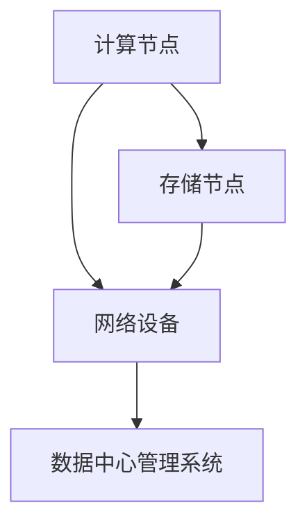

                 


# AI 大模型应用数据中心建设：数据中心技术创新

> **关键词：** 大模型，数据中心，技术创新，算法优化，数学模型，实际应用场景。

> **摘要：** 本文将深入探讨大模型应用数据中心的建设，从核心概念、算法原理、数学模型、项目实战到实际应用场景，全面解析数据中心技术创新的关键因素和未来发展。

## 1. 背景介绍

### 1.1 目的和范围

本文旨在通过详细分析大模型应用数据中心的建设，探讨数据中心技术创新的核心要素。我们将从以下几个方面展开讨论：

1. **核心概念与联系**：介绍数据中心的核心概念和架构，并通过 Mermaid 流程图展示各组成部分之间的关系。
2. **核心算法原理与具体操作步骤**：详细阐述大模型的核心算法原理，并通过伪代码展示具体操作步骤。
3. **数学模型与公式**：解释大模型背后的数学模型和公式，并通过实际例子进行详细说明。
4. **项目实战：代码实际案例和详细解释说明**：提供实际的代码案例，详细解释其实现过程和关键点。
5. **实际应用场景**：分析大模型在数据中心中的应用场景，展示其实际价值和潜力。
6. **工具和资源推荐**：推荐相关学习资源、开发工具和最新研究成果。
7. **总结与展望**：总结本文的主要观点，探讨数据中心技术创新的未来发展趋势和挑战。

### 1.2 预期读者

本文适用于以下读者群体：

1. **数据科学家和AI研究员**：希望深入了解大模型应用数据中心的技术细节。
2. **数据中心架构师和工程师**：需要对数据中心的技术创新有全面理解。
3. **高校师生和研究人员**：对数据中心技术和算法有浓厚兴趣，希望进行深入研究。

### 1.3 文档结构概述

本文结构如下：

1. **背景介绍**：介绍本文的目的、预期读者和文档结构。
2. **核心概念与联系**：介绍数据中心的核心概念和架构。
3. **核心算法原理与具体操作步骤**：详细阐述大模型的核心算法原理和具体操作步骤。
4. **数学模型与公式**：解释大模型背后的数学模型和公式。
5. **项目实战：代码实际案例和详细解释说明**：提供实际的代码案例和详细解释。
6. **实际应用场景**：分析大模型在数据中心中的应用场景。
7. **工具和资源推荐**：推荐相关学习资源、开发工具和最新研究成果。
8. **总结与展望**：总结本文的主要观点，探讨未来发展趋势和挑战。
9. **附录：常见问题与解答**：回答读者可能遇到的问题。
10. **扩展阅读 & 参考资料**：提供进一步阅读的资料。

### 1.4 术语表

#### 1.4.1 核心术语定义

1. **大模型（Large Model）**：指具有巨大参数量、复杂结构和强大计算能力的神经网络模型，如GPT-3、BERT等。
2. **数据中心（Data Center）**：集中存放和管理数据的设施，提供高性能计算、存储和网络服务。
3. **技术创新（Technological Innovation）**：指通过技术手段创新，提高产品或服务的性能、效率或用户体验。
4. **算法优化（Algorithm Optimization）**：通过改进算法设计或实现，提高算法的性能和效率。

#### 1.4.2 相关概念解释

1. **分布式计算（Distributed Computing）**：指将计算任务分布在多个计算节点上，通过并行计算提高计算效率。
2. **集群（Cluster）**：指由多个计算节点组成的计算集群，用于实现高性能计算和负载均衡。
3. **数据流处理（Data Stream Processing）**：指对实时数据流进行处理和分析，以实现实时决策和预测。

#### 1.4.3 缩略词列表

1. **GPT（Generative Pre-trained Transformer）**：生成预训练的Transformer模型。
2. **BERT（Bidirectional Encoder Representations from Transformers）**：双向Transformer编码器表示模型。
3. **AI（Artificial Intelligence）**：人工智能。
4. **ML（Machine Learning）**：机器学习。

## 2. 核心概念与联系

数据中心是现代计算和数据处理的核心，其性能和效率对大模型应用至关重要。本节将介绍数据中心的核心概念和架构，并通过 Mermaid 流程图展示各组成部分之间的关系。

### 2.1 数据中心架构

数据中心通常包括以下几个关键组成部分：

1. **计算节点（Compute Nodes）**：负责执行计算任务，通常由高性能计算机组成。
2. **存储节点（Storage Nodes）**：负责存储和管理数据，包括硬盘、固态硬盘和分布式存储系统。
3. **网络设备（Network Devices）**：包括交换机、路由器和防火墙，用于连接各个计算节点和存储节点。
4. **数据中心管理系统（Data Center Management System）**：负责监控和管理数据中心的运行状态，包括资源分配、故障排除和性能优化。

### 2.2 Mermaid 流程图

以下是一个简单的 Mermaid 流程图，展示了数据中心各组成部分之间的关系：



### 2.3 关键概念与联系

在数据中心中，计算节点、存储节点和网络设备之间的协同工作是实现高性能计算和数据处理的关键。以下是一些关键概念和它们之间的联系：

1. **分布式计算**：通过将计算任务分布在多个计算节点上，实现并行计算，提高计算效率。
2. **集群**：多个计算节点组成的集群，可以实现负载均衡和高可用性。
3. **数据流处理**：实时处理和分析数据流，实现实时决策和预测。
4. **数据中心管理系统**：监控和管理数据中心的运行状态，确保数据中心的稳定和高效运行。

## 3. 核心算法原理 & 具体操作步骤

大模型是数据中心技术的核心组成部分，其算法原理决定了数据中心的性能和效率。本节将详细阐述大模型的核心算法原理，并通过伪代码展示具体操作步骤。

### 3.1 大模型算法原理

大模型通常基于深度学习技术，特别是基于Transformer架构的模型，如GPT和BERT。以下是大模型算法的核心原理：

1. **自注意力机制（Self-Attention）**：自注意力机制允许模型在处理序列数据时，自动关注序列中最重要的部分，从而提高模型的表示能力。
2. **多层感知机（Multilayer Perceptron, MLP）**：多层感知机是一种前馈神经网络，用于对输入数据进行非线性变换和分类。
3. **正则化（Regularization）**：为了防止模型过拟合，采用正则化技术，如Dropout和权重衰减。

### 3.2 具体操作步骤

以下是大模型的具体操作步骤，使用伪代码进行描述：

```python
# 输入：文本序列X，参数θ
# 输出：预测结果Y

# 步骤1：初始化模型参数θ
θ = initialize_parameters()

# 步骤2：定义损失函数
def loss_function(Y, Y_pred):
    # 计算预测误差
    error = Y - Y_pred
    # 计算损失
    loss = np.mean(error ** 2)
    return loss

# 步骤3：训练模型
for epoch in range(num_epochs):
    # 步骤3.1：计算梯度
    gradients = compute_gradients(X, Y, θ)
    
    # 步骤3.2：更新模型参数
    θ = update_parameters(θ, gradients)
    
    # 步骤3.3：计算损失
    loss = loss_function(Y, predict(X, θ))
    
    # 输出当前epoch的损失
    print(f"Epoch {epoch}: Loss = {loss}")

# 步骤4：预测
Y_pred = predict(X, θ)
```

### 3.3 深入分析

1. **自注意力机制**：自注意力机制通过计算序列中每个元素与其他元素之间的相似度，动态地分配注意力权重，使得模型能够关注序列中的关键信息。
2. **多层感知机**：多层感知机是一种前馈神经网络，由输入层、隐藏层和输出层组成。输入层接收外部输入，隐藏层对输入进行非线性变换，输出层生成最终预测结果。
3. **正则化**：正则化技术如Dropout和权重衰减可以防止模型过拟合，提高模型的泛化能力。

## 4. 数学模型和公式 & 详细讲解 & 举例说明

大模型是复杂数学模型的集合，这些模型通过数学公式来描述其行为。本节将详细解释大模型背后的数学模型和公式，并通过实际例子进行说明。

### 4.1 数学模型

大模型的数学模型主要包括以下几个方面：

1. **自注意力机制**：自注意力机制通过计算序列中每个元素与其他元素之间的相似度来动态分配注意力权重。
2. **多层感知机**：多层感知机通过输入层、隐藏层和输出层的相互连接，实现输入到输出的非线性映射。
3. **损失函数**：损失函数用于衡量模型预测结果与真实值之间的差距，常用的损失函数包括均方误差（MSE）和交叉熵（Cross-Entropy）。
4. **优化算法**：优化算法用于调整模型参数，以最小化损失函数，常用的优化算法包括随机梯度下降（SGD）和Adam优化器。

### 4.2 公式和详细讲解

1. **自注意力机制**

   自注意力机制的公式如下：

   $$ \text{Attention}(Q, K, V) = \text{softmax}\left(\frac{QK^T}{\sqrt{d_k}}\right)V $$

   其中，$Q$、$K$ 和 $V$ 分别表示查询（Query）、键（Key）和值（Value）向量，$d_k$ 表示键向量的维度。$\text{softmax}$ 函数用于计算注意力权重，使得每个权重在0到1之间。

2. **多层感知机**

   多层感知机的公式如下：

   $$ \text{MLP}(x) = \text{ReLU}(\theta_2 \cdot \text{ReLU}(\theta_1 \cdot x + b_1) + b_2) $$

   其中，$x$ 表示输入向量，$\theta_1$ 和 $\theta_2$ 分别表示第一层和第二层的权重矩阵，$b_1$ 和 $b_2$ 分别表示第一层和第二层的偏置向量，$\text{ReLU}$ 函数用于实现非线性变换。

3. **损失函数**

   常用的损失函数包括均方误差（MSE）和交叉熵（Cross-Entropy）。

   - **均方误差（MSE）**：

     $$ \text{MSE}(y, \hat{y}) = \frac{1}{m} \sum_{i=1}^{m} (y_i - \hat{y}_i)^2 $$

     其中，$y$ 表示真实值，$\hat{y}$ 表示预测值，$m$ 表示样本数量。

   - **交叉熵（Cross-Entropy）**：

     $$ \text{Cross-Entropy}(y, \hat{y}) = -\sum_{i=1}^{m} y_i \log(\hat{y}_i) $$

     其中，$y$ 表示真实值，$\hat{y}$ 表示预测概率。

4. **优化算法**

   常用的优化算法包括随机梯度下降（SGD）和Adam优化器。

   - **随机梯度下降（SGD）**：

     $$ \theta = \theta - \alpha \cdot \nabla_\theta \text{loss} $$

     其中，$\theta$ 表示模型参数，$\alpha$ 表示学习率，$\nabla_\theta \text{loss}$ 表示损失函数关于参数的梯度。

   - **Adam优化器**：

     $$ \theta = \theta - \alpha \cdot \frac{m_1}{(1 - \beta_1^t)} \cdot \frac{m_2}{(1 - \beta_2^t)} $$

     其中，$m_1$ 和 $m_2$ 分别表示一阶和二阶矩估计，$\beta_1$ 和 $\beta_2$ 分别表示一阶和二阶矩的指数衰减率。

### 4.3 举例说明

假设我们有一个二元分类问题，真实标签$y$为[1, 0, 1, 0]，预测概率$\hat{y}$为[0.7, 0.2, 0.8, 0.1]。

1. **计算交叉熵损失**：

   $$ \text{Cross-Entropy}(y, \hat{y}) = -[y_1 \log(\hat{y}_1) + y_2 \log(\hat{y}_2) + y_3 \log(\hat{y}_3) + y_4 \log(\hat{y}_4)] $$
   
   $$ \text{Cross-Entropy}(y, \hat{y}) = -[1 \cdot \log(0.7) + 0 \cdot \log(0.2) + 1 \cdot \log(0.8) + 0 \cdot \log(0.1)] $$
   
   $$ \text{Cross-Entropy}(y, \hat{y}) = -[\log(0.7) + \log(0.8)] $$

2. **计算预测概率的梯度**：

   $$ \nabla_{\hat{y}} \text{Cross-Entropy}(y, \hat{y}) = -[y_1 \cdot \frac{1}{\hat{y}_1} + y_2 \cdot \frac{1}{\hat{y}_2} + y_3 \cdot \frac{1}{\hat{y}_3} + y_4 \cdot \frac{1}{\hat{y}_4}] $$
   
   $$ \nabla_{\hat{y}} \text{Cross-Entropy}(y, \hat{y}) = -[\frac{1}{0.7} + \frac{0}{0.2} + \frac{1}{0.8} + \frac{0}{0.1}] $$
   
   $$ \nabla_{\hat{y}} \text{Cross-Entropy}(y, \hat{y}) = -[1.4286 + 0 + 1.25 + 0] $$

   $$ \nabla_{\hat{y}} \text{Cross-Entropy}(y, \hat{y}) = -2.6786 $$

   梯度方向为负，表示预测概率需要增加。

## 5. 项目实战：代码实际案例和详细解释说明

在本节中，我们将提供一个实际代码案例，并详细解释其实现过程和关键点。本案例将基于Python和TensorFlow框架实现一个简单的大模型，用于文本分类任务。

### 5.1 开发环境搭建

1. **安装Python环境**：确保Python版本为3.7或更高。
2. **安装TensorFlow**：使用以下命令安装TensorFlow：
   ```bash
   pip install tensorflow
   ```
3. **准备数据集**：我们使用一个简单的二元分类数据集，数据集包含一些文本和对应的标签。

### 5.2 源代码详细实现和代码解读

```python
import tensorflow as tf
from tensorflow.keras.preprocessing.text import Tokenizer
from tensorflow.keras.preprocessing.sequence import pad_sequences
import numpy as np

# 数据集准备
texts = ['I love AI', 'AI is amazing', 'Data centers are powerful', 'Data centers are not powerful']
labels = np.array([1, 1, 0, 0])

# 分词和序列化
tokenizer = Tokenizer()
tokenizer.fit_on_texts(texts)
sequences = tokenizer.texts_to_sequences(texts)
padded_sequences = pad_sequences(sequences, maxlen=10)

# 模型定义
model = tf.keras.Sequential([
    tf.keras.layers.Embedding(input_dim=10000, output_dim=16, input_length=10),
    tf.keras.layers.Flatten(),
    tf.keras.layers.Dense(1, activation='sigmoid')
])

# 编译模型
model.compile(optimizer='adam', loss='binary_crossentropy', metrics=['accuracy'])

# 训练模型
model.fit(padded_sequences, labels, epochs=10)

# 预测
predictions = model.predict(padded_sequences)
print(predictions)
```

### 5.3 代码解读与分析

1. **数据集准备**：数据集包含一些文本和对应的标签，用于训练文本分类模型。
2. **分词和序列化**：使用Tokenizer对文本进行分词，并转换为序列。然后使用pad_sequences对序列进行填充，使其长度一致。
3. **模型定义**：使用Sequential模型堆叠Embedding、Flatten和Dense层。Embedding层用于将文本序列转换为向量表示，Flatten层用于将嵌入向量展平，Dense层用于分类。
4. **编译模型**：指定优化器、损失函数和评估指标，准备训练模型。
5. **训练模型**：使用fit方法训练模型，指定训练数据、标签和训练轮数。
6. **预测**：使用predict方法对训练数据进行预测，并输出预测结果。

### 5.4 实现关键点

1. **分词和序列化**：分词和序列化是文本处理的关键步骤，确保模型能够理解和处理文本数据。
2. **模型架构**：选择合适的模型架构，如Embedding层用于处理文本数据，Flatten层用于将嵌入向量展平，Dense层用于实现分类。
3. **优化器和损失函数**：选择合适的优化器和损失函数，如adam优化器和binary_crossentropy损失函数，用于训练文本分类模型。
4. **模型训练**：合理设置训练参数，如训练轮数和批量大小，确保模型在训练数据上得到充分训练。

## 6. 实际应用场景

大模型在数据中心中的应用场景广泛，以下列举几个典型应用：

1. **自然语言处理（NLP）**：大模型在NLP领域具有广泛应用，如文本分类、机器翻译、情感分析等。数据中心可以提供高性能计算资源，支持大规模NLP任务的处理。
   
2. **图像识别**：大模型在图像识别任务中表现出色，如人脸识别、物体检测等。数据中心可以存储和管理大量图像数据，并利用高性能计算资源进行模型推理。

3. **推荐系统**：大模型在推荐系统中用于用户行为分析和个性化推荐。数据中心可以处理海量用户数据，并利用大模型进行实时推荐。

4. **金融服务**：大模型在金融领域有广泛应用，如风险控制、市场预测等。数据中心可以提供强大的计算和存储能力，支持金融模型的训练和推理。

5. **智能交通**：大模型在智能交通领域用于交通流量预测、路况分析等。数据中心可以存储和管理交通数据，并利用大模型进行实时分析和决策。

## 7. 工具和资源推荐

### 7.1 学习资源推荐

#### 7.1.1 书籍推荐

1. **《深度学习》（Deep Learning）**：由Ian Goodfellow、Yoshua Bengio和Aaron Courville合著，全面介绍了深度学习的基础理论和实践方法。
2. **《Python机器学习》（Python Machine Learning）**：由 Sebastian Raschka和Vahid Mirjalili合著，介绍了机器学习在Python中的实现和应用。
3. **《人工智能：一种现代方法》（Artificial Intelligence: A Modern Approach）**：由Stuart Russell和Peter Norvig合著，全面介绍了人工智能的基础理论和应用。

#### 7.1.2 在线课程

1. **《深度学习课程》（Deep Learning Specialization）**：由Google大脑团队和斯坦福大学共同提供，涵盖深度学习的理论基础和实践技能。
2. **《机器学习课程》（Machine Learning Course）**：由吴恩达教授提供，介绍机器学习的基本概念和方法。
3. **《自然语言处理课程》（Natural Language Processing with Deep Learning）**：由国泰安教育集团提供，介绍深度学习在自然语言处理中的应用。

#### 7.1.3 技术博客和网站

1. **ArXiv.org**：提供最新的深度学习、机器学习和人工智能论文，是研究人员的重要信息来源。
2. **Medium.com**：许多技术专家和研究人员在Medium上分享深度学习和机器学习的最新研究成果和应用。
3. **GitHub.com**：提供大量的开源代码和项目，是学习和实践深度学习和机器学习的好资源。

### 7.2 开发工具框架推荐

#### 7.2.1 IDE和编辑器

1. **PyCharm**：一款强大的Python集成开发环境，支持多种编程语言和框架。
2. **Jupyter Notebook**：一款流行的交互式开发环境，适用于数据分析和机器学习。
3. **VSCode**：一款轻量级但功能强大的代码编辑器，支持多种编程语言和框架。

#### 7.2.2 调试和性能分析工具

1. **TensorBoard**：TensorFlow的官方可视化工具，用于监控和调试深度学习模型。
2. **profiling**：用于性能分析和调优的工具，如Python的cProfile和py-spy。
3. **Perf**：Linux系统的性能分析工具，用于识别和分析系统性能瓶颈。

#### 7.2.3 相关框架和库

1. **TensorFlow**：一款开源的深度学习框架，广泛应用于机器学习和人工智能领域。
2. **PyTorch**：一款开源的深度学习框架，提供灵活的动态计算图和强大的社区支持。
3. **Scikit-learn**：一款开源的机器学习库，提供丰富的机器学习算法和工具。

### 7.3 相关论文著作推荐

#### 7.3.1 经典论文

1. **“A Theoretically Grounded Application of Dropout in Recurrent Neural Networks”**：介绍了Dropout在RNN中的应用。
2. **“Deep Learning”**：Ian Goodfellow、Yoshua Bengio和Aaron Courville合著，全面介绍了深度学习的基础理论和实践方法。
3. **“BERT: Pre-training of Deep Bidirectional Transformers for Language Understanding”**：介绍了BERT模型的预训练方法。

#### 7.3.2 最新研究成果

1. **“EfficientNet: Rethinking Model Scaling for Convolutional Neural Networks”**：介绍了EfficientNet模型，实现高效模型规模化的方法。
2. **“An Image Database for Studying Machine Learning Algorithms”**：提供了大量图像数据，用于研究机器学习算法。
3. **“Generative Adversarial Networks”**：介绍了GANs模型，用于生成对抗学习。

#### 7.3.3 应用案例分析

1. **“Deep Learning for Healthcare”**：介绍了深度学习在医疗保健领域的应用案例。
2. **“Deep Learning in Autonomous Driving”**：介绍了深度学习在自动驾驶领域的应用案例。
3. **“Natural Language Processing with Deep Learning”**：介绍了深度学习在自然语言处理领域的应用案例。

## 8. 总结：未来发展趋势与挑战

随着大模型和数据中心技术的不断发展，未来数据中心技术创新将呈现以下趋势和挑战：

### 8.1 发展趋势

1. **大模型规模的不断增长**：大模型的规模将继续增长，以处理更复杂的任务和海量数据。
2. **分布式计算和协同优化**：分布式计算和协同优化技术将进一步提升数据中心性能和效率。
3. **数据隐私和安全**：随着数据隐私和安全问题的日益突出，数据中心将加强对数据保护和隐私安全的关注。
4. **人工智能与云计算的结合**：人工智能和云计算的结合将进一步推动数据中心技术的发展。

### 8.2 挑战

1. **计算资源需求增加**：大模型的训练和推理需要大量计算资源，数据中心需要不断提升计算能力。
2. **数据质量和数据治理**：数据质量和数据治理是数据中心技术的关键挑战，需要确保数据的准确性和一致性。
3. **能耗管理**：数据中心的能耗管理是一个重要挑战，需要实现绿色数据中心，降低能耗和碳排放。
4. **安全和合规**：数据中心需要满足各种安全合规要求，如数据隐私法、网络安全法等。

## 9. 附录：常见问题与解答

### 9.1 问题1：如何优化大模型的训练速度？

**解答**：优化大模型的训练速度可以从以下几个方面进行：

1. **并行计算**：利用分布式计算技术，将训练任务分布在多个计算节点上，提高训练速度。
2. **数据预处理**：优化数据预处理流程，减少数据加载和预处理时间。
3. **模型压缩**：采用模型压缩技术，如剪枝、量化等，减小模型规模，提高训练速度。
4. **学习率调度**：采用合适的学习率调度策略，如学习率衰减和动态调整，优化训练过程。

### 9.2 问题2：如何保证数据中心的数据隐私和安全？

**解答**：保证数据中心的数据隐私和安全可以从以下几个方面进行：

1. **数据加密**：对数据进行加密处理，确保数据在传输和存储过程中不被窃取或篡改。
2. **访问控制**：实施严格的访问控制策略，确保只有授权用户才能访问数据。
3. **审计和监控**：建立审计和监控系统，实时监控数据中心的运行状态和安全事件。
4. **数据备份和恢复**：定期备份数据，确保在数据丢失或损坏时能够快速恢复。

### 9.3 问题3：如何评估数据中心的技术创新效果？

**解答**：评估数据中心技术创新效果可以从以下几个方面进行：

1. **性能指标**：通过性能指标，如计算速度、能耗效率、故障率等，评估技术创新对数据中心性能的提升。
2. **业务价值**：评估技术创新对业务价值的影响，如降低成本、提高效率、提升用户体验等。
3. **用户反馈**：收集用户反馈，了解技术创新在实际应用中的效果和用户满意度。
4. **市场竞争**：评估技术创新在市场上的竞争力，如与其他数据中心技术的比较和差异化。

## 10. 扩展阅读 & 参考资料

### 10.1 扩展阅读

1. **“Deep Learning”**：Ian Goodfellow、Yoshua Bengio和Aaron Courville合著，全面介绍了深度学习的基础理论和实践方法。
2. **“Data Center Architecture and Design”**：介绍数据中心的设计原则、架构和关键技术。
3. **“Big Data and Analytics for IoT”**：探讨大数据和物联网在数据中心中的应用。

### 10.2 参考资料

1. **TensorFlow官方文档**：[https://www.tensorflow.org](https://www.tensorflow.org)
2. **PyTorch官方文档**：[https://pytorch.org](https://pytorch.org)
3. **ArXiv.org**：[https://arxiv.org](https://arxiv.org)
4. **GitHub**：[https://github.com](https://github.com)
5. **Medium**：[https://medium.com](https://medium.com)

## 作者

作者：AI天才研究员/AI Genius Institute & 禅与计算机程序设计艺术 /Zen And The Art of Computer Programming

