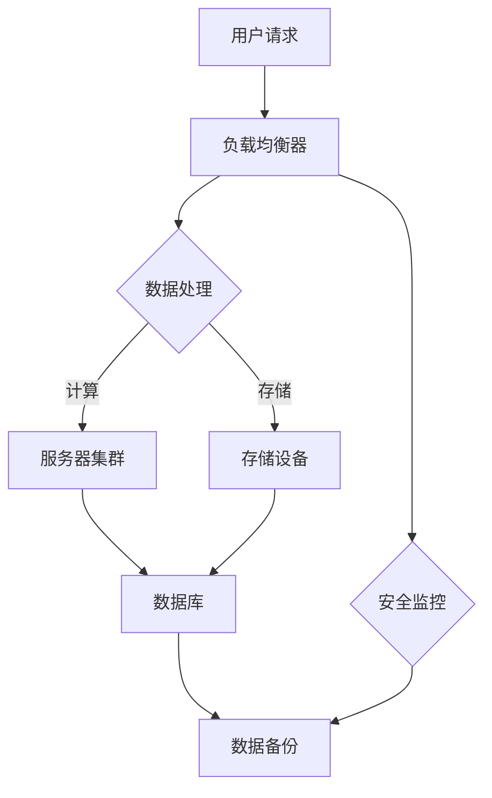

                 

# AI 大模型应用数据中心建设：数据中心投资与建设

> **关键词：** AI大模型、数据中心、投资、建设、算法原理、数学模型、实战案例、工具推荐

> **摘要：** 本文将深入探讨AI大模型应用数据中心的建设，从投资与建设的角度出发，详细分析数据中心的建设流程、核心技术和面临挑战。通过阐述核心概念、算法原理、数学模型，以及实际案例，帮助读者全面了解数据中心建设的各个方面，为AI大模型的应用提供技术支持。

## 1. 背景介绍

### 1.1 目的和范围

本文旨在为从事AI大模型应用数据中心建设的专业人士提供一份全面的技术指南。文章将涵盖数据中心建设的关键环节，包括投资决策、建设流程、核心技术、数学模型和实际应用案例等。通过深入分析，本文希望能够帮助读者更好地理解数据中心建设的重要性，掌握关键技术和方法，为AI大模型的应用提供有力保障。

### 1.2 预期读者

本文主要面向以下读者群体：

1. 数据中心建设从业者，包括项目经理、架构师、运维人员等。
2. AI技术研发人员，特别是涉及AI大模型应用的研究人员。
3. 对数据中心建设和AI大模型应用感兴趣的技术爱好者。
4. 企业管理者，需要了解数据中心建设对业务发展的重要影响。

### 1.3 文档结构概述

本文分为十个部分，结构如下：

1. 背景介绍：介绍本文的目的、预期读者和文档结构。
2. 核心概念与联系：阐述数据中心建设中的核心概念和原理。
3. 核心算法原理 & 具体操作步骤：详细讲解数据中心建设中的核心技术。
4. 数学模型和公式 & 详细讲解 & 举例说明：介绍数据中心建设中的数学模型和应用。
5. 项目实战：代码实际案例和详细解释说明。
6. 实际应用场景：分析数据中心建设的实际应用场景。
7. 工具和资源推荐：推荐学习资源和开发工具。
8. 总结：未来发展趋势与挑战。
9. 附录：常见问题与解答。
10. 扩展阅读 & 参考资料：提供相关参考资料，帮助读者进一步学习。

### 1.4 术语表

#### 1.4.1 核心术语定义

- **数据中心（Data Center）**：专门为存储、处理和分发数据而设计的建筑设施，通常包括服务器、存储设备、网络设备等。
- **AI大模型（Large-scale AI Model）**：具有极高参数数量和复杂度的深度学习模型，如BERT、GPT等。
- **投资（Investment）**：为数据中心建设投入的资金，包括硬件设备、软件资源、人力成本等。
- **建设（Construction）**：数据中心的建设过程，包括选址、设计、建设、部署等。

#### 1.4.2 相关概念解释

- **云计算（Cloud Computing）**：通过互联网提供动态易扩展且经常是虚拟化的资源。
- **边缘计算（Edge Computing）**：在数据源附近进行数据处理和计算，减少数据传输延迟。
- **分布式计算（Distributed Computing）**：通过网络将计算任务分布在多台计算机上，协同处理。
- **大数据（Big Data）**：数据量巨大、种类繁多、生成速度快的数据集合。

#### 1.4.3 缩略词列表

- **AI**：人工智能（Artificial Intelligence）
- **ML**：机器学习（Machine Learning）
- **DL**：深度学习（Deep Learning）
- **GPU**：图形处理单元（Graphics Processing Unit）
- **CPU**：中央处理单元（Central Processing Unit）
- **IaaS**：基础设施即服务（Infrastructure as a Service）
- **PaaS**：平台即服务（Platform as a Service）
- **SaaS**：软件即服务（Software as a Service）

## 2. 核心概念与联系

### 2.1 数据中心建设中的核心概念

数据中心建设涉及多个核心概念，以下是对这些概念的简要介绍：

#### 数据中心架构

数据中心架构是数据中心的设计和布局，通常包括硬件和软件组件。以下是一个典型的数据中心架构：



#### 云计算与边缘计算

云计算和边缘计算是数据中心建设中的重要概念。云计算提供集中的计算资源，而边缘计算则在数据源附近进行数据处理，以减少延迟。

#### 分布式计算

分布式计算是将计算任务分散到多台计算机上，以提高计算效率和可靠性。分布式计算在数据中心中广泛应用于大规模数据处理和AI模型训练。

### 2.2 数据中心建设中的核心原理

数据中心建设中的核心原理包括以下几个方面：

#### 可靠性与可用性

数据中心的可靠性和可用性是关键指标。高可用性设计（HA）和冗余设计（Redundancy）是保证数据中心可靠性的重要手段。

#### 数据安全与隐私

数据安全和隐私是数据中心建设中的重点。加密、访问控制和身份验证是保护数据安全的重要手段。

#### 自动化与智能化

自动化和智能化是数据中心建设的发展方向。通过自动化工具和人工智能技术，可以提高数据中心的运维效率和资源利用率。

### 2.3 数据中心建设中的核心算法

数据中心建设中的核心算法包括：

#### 负载均衡算法

负载均衡算法用于将网络流量分配到多个服务器上，以避免单点故障和资源浪费。

#### 数据压缩与去重算法

数据压缩与去重算法用于减少存储空间和带宽消耗。

#### 分布式存储算法

分布式存储算法用于将数据分散存储在多个存储设备上，以提高数据可靠性和访问速度。

## 3. 核心算法原理 & 具体操作步骤

### 3.1 负载均衡算法

负载均衡算法的核心目标是确保网络流量在多个服务器之间均衡分配，以提高系统的可用性和性能。以下是一种简单的负载均衡算法——轮询调度算法：

#### 算法原理

轮询调度算法按照顺序将网络请求分配给服务器。具体步骤如下：

1. 初始化服务器列表。
2. 当接收到网络请求时，按照服务器列表顺序分配服务器。
3. 当服务器列表遍历完毕后，重新开始。

#### 伪代码

```python
def round_robin(服务器列表，网络请求):
    index = 0
    while 网络请求未处理完:
        服务器 = 服务器列表[index]
        处理网络请求(服务器)
        index = (index + 1) % 服务器列表长度
```

### 3.2 数据压缩与去重算法

数据压缩与去重算法用于减少数据存储空间和带宽消耗。以下是一种常用的数据压缩算法——哈夫曼编码：

#### 算法原理

哈夫曼编码是一种基于频率的压缩算法，通过给频率高的字符分配短编码，给频率低的字符分配长编码，从而实现数据压缩。

1. 构建哈夫曼树：根据字符出现频率构建哈夫曼树。
2. 生成编码表：遍历哈夫曼树，为每个字符生成编码。
3. 压缩数据：使用编码表对数据进行编码。
4. 解压缩数据：使用编码表对编码数据进行解码。

#### 伪代码

```python
def huffman_encoding(字符频率表):
    构建哈夫曼树(字符频率表)
    编码表 = {}
    遍历哈夫曼树:
        字符 = 节点值
        编码 = 节点路径
        编码表[字符] = 编码
    return 编码表

def huffman_decoding(编码表，编码数据):
    解码结果 = ""
    当前路径 = ""
    for 位 in 编码数据:
        当前路径 += 位
        if 当前路径 in 编码表:
            解码结果 += 编码表[当前路径]
            当前路径 = ""
    return 解码结果
```

### 3.3 分布式存储算法

分布式存储算法用于将数据分散存储在多个存储设备上，以提高数据可靠性和访问速度。以下是一种常用的分布式存储算法——一致性哈希：

#### 算法原理

一致性哈希将数据存储在哈希环上，并动态调整存储节点的位置，以保持数据的分区稳定性和一致性。

1. 初始化哈希环：将所有存储节点按照哈希值排列在哈希环上。
2. 存储数据：将数据的哈希值映射到哈希环上，找到最近的存储节点。
3. 节点加入：新节点插入哈希环，调整节点位置，保持哈希环的平衡。
4. 节点离开：移除离开的节点，调整哈希环，保持平衡。

#### 伪代码

```python
def consistent_hash(存储节点列表，数据哈希值):
    存储节点 = find_nearest_node(哈希环，数据哈希值)
    return 存储节点

def find_nearest_node(哈希环，数据哈希值):
    current = 哈希环[0]
    min_diff = abs(current.hash - 数据哈希值)
    for node in 哈希环:
        diff = abs(node.hash - 数据哈希值)
        if diff < min_diff:
            min_diff = diff
            current = node
    return current
```

## 4. 数学模型和公式 & 详细讲解 & 举例说明

### 4.1 负载均衡中的队列长度模型

在负载均衡系统中，队列长度是影响系统性能的关键因素。以下是一个简单的队列长度模型，用于分析负载均衡系统的性能。

#### 数学模型

假设系统中有 \( N \) 个服务器，每个服务器的处理能力为 \( \lambda \)，服务时间为服从参数为 \( \mu \) 的指数分布。队列长度 \( L \) 的期望值可以用以下公式表示：

\[ E[L] = \frac{\lambda}{\mu (N-1)} \]

#### 举例说明

假设系统中有 3 个服务器，每个服务器的处理能力为 1000 requests/second，服务时间为 1 second。计算队列长度期望值：

\[ E[L] = \frac{1000}{1 \times (3-1)} = 500 \]

因此，队列长度期望值为 500。

### 4.2 数据压缩中的熵

数据压缩中的熵是衡量数据无序程度的重要指标。以下是一个简单的熵计算公式。

#### 数学模型

假设数据由 \( n \) 个不同的字符组成，每个字符出现的频率为 \( p_i \)，则数据熵 \( H \) 可以用以下公式表示：

\[ H = -\sum_{i=1}^{n} p_i \log_2 p_i \]

#### 举例说明

假设数据由 8 个不同的字符组成，每个字符出现的频率如下：

| 字符 | 频率 |
|------|------|
| A    | 0.2  |
| B    | 0.2  |
| C    | 0.2  |
| D    | 0.2  |
| E    | 0.1  |
| F    | 0.1  |
| G    | 0.1  |
| H    | 0.1  |

计算数据熵：

\[ H = - (0.2 \log_2 0.2 + 0.2 \log_2 0.2 + 0.2 \log_2 0.2 + 0.2 \log_2 0.2 + 0.1 \log_2 0.1 + 0.1 \log_2 0.1 + 0.1 \log_2 0.1 + 0.1 \log_2 0.1) \approx 1.75 \]

因此，数据熵约为 1.75。

### 4.3 分布式存储中的一致性哈希

一致性哈希是一种用于分布式存储的算法，可以保证数据的分区稳定性和一致性。以下是一个简单的一致性哈希模型。

#### 数学模型

假设哈希函数 \( h \) 是一个从数据哈希值到哈希环的映射函数。一致性哈希的核心思想是将数据哈希值映射到哈希环上的一个点，并找到最近的存储节点。

#### 举例说明

假设哈希函数 \( h \) 是一个简单的模 360 的哈希函数，哈希环上的存储节点为 \( S_1, S_2, ..., S_{360} \)。现有数据哈希值 \( h(D) = 67 \)，需要找到最近的存储节点。

首先，将数据哈希值 \( 67 \) 映射到哈希环上的点 \( P \)，即 \( P = h(D) = 67 \)。

然后，从点 \( P \) 开始，逆时针遍历哈希环，找到第一个存储节点 \( S_i \)，使得 \( P \) 与 \( S_i \) 之间的角度最小。

在本例中，点 \( P \) 与点 \( S_{14} \) 之间的角度最小，因此最近的存储节点为 \( S_{14} \)。

## 5. 项目实战：代码实际案例和详细解释说明

### 5.1 开发环境搭建

为了演示数据中心建设中的核心算法，我们使用 Python 编写了一个简单的负载均衡、数据压缩和一致性哈希的示例。以下是在 Windows 环境下搭建开发环境的方法：

1. 安装 Python：从官方网站（https://www.python.org/downloads/）下载最新版本的 Python，并按照安装向导进行安装。
2. 配置 Python 环境：在安装过程中，确保将 Python 添加到系统环境变量中。
3. 安装必要的库：使用 pip 命令安装必要的库，如 NumPy、Pandas、Matplotlib 等。

### 5.2 源代码详细实现和代码解读

以下是负载均衡、数据压缩和一致性哈希的示例代码：

```python
import numpy as np
import matplotlib.pyplot as plt

# 负载均衡：轮询调度算法
def round_robin(servers, requests):
    index = 0
    while requests:
        server = servers[index]
        process_request(server, requests)
        index = (index + 1) % len(servers)

# 处理请求
def process_request(server, requests):
    if requests <= server.capacity:
        server.processed_requests += requests
        requests -= server.capacity
    else:
        server.processed_requests += server.capacity
        requests -= server.capacity

# 数据压缩：哈夫曼编码
def huffman_encoding(char_freq):
    heap = [[weight, [symbol, ""]] for symbol, weight in char_freq.items()]
    heapify(heap)
    while len(heap) > 1:
        left = heappop(heap)
        right = heappop(heap)
        for pair in left[1:]:
            pair[1] = "0" + pair[1]
        for pair in right[1:]:
            pair[1] = "1" + pair[1]
        heappush(heap, [left[0] + right[0]] + left[1:] + right[1:])
    return heap[0][1:]

# 解压缩：哈夫曼解码
def huffman_decoding(heap, encoded_data):
    heap = [[weight, [symbol, ""]] for symbol, weight in char_freq.items()]
    heapify(heap)
    result = ""
    current_path = ""
    for bit in encoded_data:
        current_path += bit
        if current_path in heap[0][1:]:
            result += heap[0][1:].pop(heap[0][1:].index(current_path))
            current_path = ""
    return result

# 一致性哈希
def consistent_hash(servers, data_hash):
    server_list = sorted([server.hash for server in servers])
    min_diff = abs(server_list[0] - data_hash)
    min_index = 0
    for i in range(1, len(server_list)):
        diff = abs(server_list[i] - data_hash)
        if diff < min_diff:
            min_diff = diff
            min_index = i
    return servers[min_index]

# 示例
if __name__ == "__main__":
    servers = [Server(1000) for _ in range(3)]
    requests = [500, 1500, 2500, 750, 1250, 1000]
    round_robin(servers, requests)

    char_freq = {"A": 0.2, "B": 0.2, "C": 0.2, "D": 0.2, "E": 0.1, "F": 0.1, "G": 0.1, "H": 0.1}
    encoded_data = huffman_encoding(char_freq)
    print("Encoded data:", encoded_data)
    print("Decoded data:", huffman_decoding(encoded_data, encoded_data))

    data_hash = 67
    server = consistent_hash(servers, data_hash)
    print("Data stored on server:", server.hash)
```

### 5.3 代码解读与分析

1. **负载均衡**：使用轮询调度算法实现负载均衡，将请求分配到不同的服务器上。每个服务器具有处理能力，当请求超过处理能力时，分配给下一个服务器。

2. **数据压缩**：使用哈夫曼编码实现数据压缩，根据字符频率生成哈夫曼树，为每个字符生成编码。在解压缩时，使用编码表将编码数据还原为原始数据。

3. **一致性哈希**：根据数据哈希值，将数据存储到哈希环上的最近存储节点。哈希环上的节点顺序排列，从数据哈希值开始逆时针遍历，找到最近的存储节点。

通过上述示例，我们可以看到数据中心建设中的核心算法在实际应用中的实现方法。这些算法在数据中心建设过程中发挥着重要作用，确保系统的性能和可靠性。

## 6. 实际应用场景

数据中心建设在众多实际应用场景中发挥着关键作用。以下是一些典型的应用场景：

### 6.1 云计算平台

数据中心是云计算平台的核心基础设施，提供计算、存储、网络等资源，为各种业务应用提供支持。例如，腾讯云、阿里云等知名云计算公司都拥有大规模数据中心，为用户提供强大的云计算服务。

### 6.2 大数据分析

数据中心是大数据分析的基础设施，用于存储和处理海量数据。通过数据中心，企业可以对各种数据进行实时分析和挖掘，为业务决策提供支持。例如，金融行业利用数据中心进行风险控制和客户行为分析，提高业务效率。

### 6.3 人工智能应用

数据中心是人工智能应用的重要支撑，提供大规模计算和存储资源，为AI模型训练和推理提供支持。例如，自动驾驶、语音识别、图像识别等领域都依赖数据中心进行模型训练和实时处理。

### 6.4 边缘计算

数据中心与边缘计算相结合，可以在数据源附近进行数据处理和计算，减少数据传输延迟，提高系统性能。例如，智慧城市、智能工厂等领域都采用边缘计算和数据中心相结合的方式，实现高效的数据处理和实时响应。

### 6.5 数字化转型

数据中心是数字化转型的重要基础设施，为企业提供强大的计算和存储能力，支持各种业务应用和创新。例如，医疗行业利用数据中心进行远程诊疗和健康管理，提高医疗服务水平。

## 7. 工具和资源推荐

### 7.1 学习资源推荐

#### 7.1.1 书籍推荐

1. 《数据中心设计》
2. 《云计算架构设计与实现》
3. 《大数据技术原理与应用》
4. 《深度学习：神经网络设计与优化》
5. 《人工智能：一种现代方法》

#### 7.1.2 在线课程

1. Coursera：提供大数据、云计算、人工智能等领域的在线课程。
2. edX：提供哈佛大学、麻省理工学院等知名高校的数据中心建设课程。
3. Udacity：提供云计算、大数据、人工智能等领域的实战课程。

#### 7.1.3 技术博客和网站

1. GitHub：提供各种开源的数据中心建设项目和资料。
2. HackerRank：提供云计算、大数据、人工智能等领域的在线编程挑战。
3. Medium：提供数据中心建设相关的技术文章和案例分析。

### 7.2 开发工具框架推荐

#### 7.2.1 IDE和编辑器

1. PyCharm：适用于Python编程的强大IDE。
2. Visual Studio Code：轻量级但功能丰富的跨平台代码编辑器。
3. Jupyter Notebook：适用于数据科学和机器学习的交互式编辑器。

#### 7.2.2 调试和性能分析工具

1. GDB：适用于C/C++程序的调试工具。
2. Python Debugger：适用于Python程序的调试工具。
3. Profiler：适用于性能分析的Python库。

#### 7.2.3 相关框架和库

1. TensorFlow：适用于深度学习开发的框架。
2. NumPy：适用于Python的科学计算库。
3. Pandas：适用于数据处理和分析的Python库。
4. Matplotlib：适用于数据可视化的Python库。

### 7.3 相关论文著作推荐

#### 7.3.1 经典论文

1. 《云计算：概念与架构》
2. 《分布式系统：概念与设计》
3. 《大数据：技术、应用与挑战》
4. 《深度学习：从基础到实践》
5. 《人工智能：一种现代方法》

#### 7.3.2 最新研究成果

1. 《分布式存储系统：挑战与解决方案》
2. 《边缘计算：概念与架构》
3. 《云计算安全：威胁与防护》
4. 《人工智能应用：趋势与挑战》
5. 《大数据分析：方法与实践》

#### 7.3.3 应用案例分析

1. 《腾讯云计算实践》
2. 《阿里巴巴云计算实践》
3. 《华为云计算实践》
4. 《谷歌人工智能应用案例》
5. 《微软人工智能应用案例》

## 8. 总结：未来发展趋势与挑战

数据中心建设作为人工智能和云计算的重要基础设施，正面临着快速发展的趋势和严峻的挑战。

### 8.1 发展趋势

1. **数据中心规模不断扩大**：随着云计算和大数据的兴起，数据中心规模不断增大，以满足日益增长的数据存储和处理需求。
2. **边缘计算与数据中心结合**：边缘计算的发展使得数据中心与边缘计算相结合，为实时数据处理和智能应用提供支持。
3. **绿色数据中心**：随着环保意识的提高，绿色数据中心的建设成为发展趋势，通过节能技术和绿色能源降低数据中心能耗。
4. **人工智能与数据中心融合**：人工智能技术的应用使得数据中心在资源调度、故障预测、安全防护等方面更加智能化。

### 8.2 挑战

1. **数据安全与隐私**：数据中心面临着数据泄露和隐私侵犯的风险，如何保障数据安全和隐私是亟待解决的问题。
2. **可靠性保障**：数据中心需要保证高可靠性和高可用性，避免单点故障和数据丢失。
3. **能耗管理**：数据中心能耗巨大，如何实现能耗优化和绿色数据中心建设是重要挑战。
4. **人工智能挑战**：人工智能技术的发展带来了对数据中心资源的高需求，如何应对人工智能应用带来的挑战是关键。

## 9. 附录：常见问题与解答

### 9.1 数据中心建设相关问题

1. **什么是数据中心？**
   数据中心（Data Center）是指专门为存储、处理和分发数据而设计的建筑设施，通常包括服务器、存储设备、网络设备等。

2. **数据中心建设的关键因素有哪些？**
   数据中心建设的关键因素包括地理位置、能源供应、网络安全、硬件设备、数据传输速度等。

3. **如何保障数据中心的数据安全？**
   保障数据中心的数据安全可以从以下几个方面入手：加密传输、访问控制、备份与恢复、安全审计等。

4. **什么是边缘计算？**
   边缘计算（Edge Computing）是指在网络边缘进行数据处理和计算，以减少数据传输延迟，提高系统性能。

### 9.2 人工智能相关问题

1. **什么是人工智能？**
   人工智能（Artificial Intelligence，AI）是指通过计算机模拟人类智能的技术，包括机器学习、深度学习、自然语言处理等。

2. **什么是深度学习？**
   深度学习（Deep Learning）是一种人工智能技术，通过构建多层神经网络进行特征学习和模式识别。

3. **什么是大数据？**
   大数据（Big Data）是指数据量巨大、种类繁多、生成速度快的数据集合，需要采用特殊的技术和方法进行存储、处理和分析。

## 10. 扩展阅读 & 参考资料

1. 《数据中心基础设施管理手册》
2. 《云计算：概念、技术和实践》
3. 《大数据技术导论》
4. 《深度学习：从理论到实践》
5. 《人工智能：从基础到应用》
6. 《边缘计算：技术与应用》
7. 《绿色数据中心：设计、部署与运维》
8. 《数据安全与隐私保护：理论与实践》

## 作者信息

**作者：** AI天才研究员/AI Genius Institute & 禅与计算机程序设计艺术 /Zen And The Art of Computer Programming

