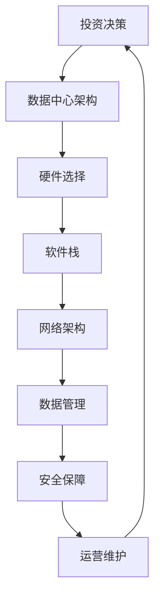

                 

# AI 大模型应用数据中心建设：数据中心投资与建设

> 关键词：AI 大模型、数据中心、投资、建设、架构、算法、数学模型、应用场景、工具和资源

> 摘要：本文将深入探讨 AI 大模型应用数据中心的建设，包括投资决策、建设策略和关键技术。本文旨在为从事 AI 数据中心建设的专业人士提供系统化的指南，以促进高效、可靠、可扩展的数据中心架构设计和实施。

## 1. 背景介绍

### 1.1 目的和范围

本文的目标是帮助读者理解 AI 大模型应用数据中心的建设过程，特别是投资与建设方面的关键要素。我们将探讨以下几个核心问题：

- 数据中心投资决策的关键因素是什么？
- 如何设计一个高效、可靠的 AI 大模型应用数据中心？
- 关键技术和数学模型如何应用于数据中心建设？
- 实际应用场景中，数据中心建设面临的挑战和解决方案是什么？

本文将覆盖以下范围：

- 数据中心建设的总体目标和原则
- 投资决策的关键因素和风险评估
- 数据中心架构设计，包括硬件、软件和网络
- 关键算法和数学模型的原理和应用
- 实际应用案例和最佳实践
- 工具和资源的推荐

### 1.2 预期读者

本文适合以下读者群体：

- 数据中心架构师和项目经理
- AI 技术和大数据领域的工程师和研究人员
- 企业 IT 部门经理和决策者
- 对数据中心建设感兴趣的技术爱好者

### 1.3 文档结构概述

本文的结构如下：

1. 背景介绍：介绍文章的目的、范围和预期读者
2. 核心概念与联系：阐述数据中心建设中的核心概念和原理
3. 核心算法原理 & 具体操作步骤：详细解释关键算法和操作步骤
4. 数学模型和公式 & 详细讲解 & 举例说明：介绍数学模型的应用和讲解
5. 项目实战：代码实际案例和详细解释说明
6. 实际应用场景：分析数据中心在不同领域的应用
7. 工具和资源推荐：推荐学习资源和开发工具
8. 总结：未来发展趋势与挑战
9. 附录：常见问题与解答
10. 扩展阅读 & 参考资料：提供进一步学习的资源和文献

### 1.4 术语表

#### 1.4.1 核心术语定义

- AI 大模型：具有数百万甚至数十亿参数的深度学习模型，如 GPT-3、BERT 等。
- 数据中心：用于存储、处理和管理大量数据的设施。
- 投资决策：决策者根据财务分析、市场需求和风险评估等因素做出的投资选择。
- 架构设计：数据中心的设计方案，包括硬件、软件和网络架构。

#### 1.4.2 相关概念解释

- 投资回报率（ROI）：投资收益与投资成本之间的比率，用于评估投资的经济效益。
- 总拥有成本（TCO）：数据中心的全部成本，包括建设、运营和维护成本。
- 云服务：基于互联网的按需服务，提供计算、存储和网络资源。

#### 1.4.3 缩略词列表

- AI：人工智能
- GPT：生成预训练网络
- BERT：双向编码表示器
- ROI：投资回报率
- TCO：总拥有成本
- IDC：数据中心
- IT：信息技术
- GPU：图形处理单元

## 2. 核心概念与联系

在数据中心建设过程中，理解核心概念和它们之间的联系至关重要。以下是一个简化的 Mermaid 流程图，用于阐述这些核心概念：



### 2.1 数据中心架构设计

数据中心架构设计是数据中心建设的基础。它涉及硬件、软件和网络架构的选择和配置。

- **硬件选择**：包括服务器、存储设备和网络设备。服务器需要支持高效计算，存储设备需要提供大容量和高速读写性能，网络设备需要保证高带宽和低延迟。
- **软件栈**：包括操作系统、数据库和中间件。操作系统需要具备稳定性和可扩展性，数据库需要支持海量数据处理，中间件提供额外的功能支持。
- **网络架构**：包括局域网（LAN）、广域网（WAN）和数据中心网络（DCN）。数据中心网络需要具备高可用性和容错性，支持虚拟化技术。

### 2.2 投资决策

投资决策是数据中心建设的核心环节。它涉及以下关键因素：

- **财务分析**：包括投资回报率（ROI）、总拥有成本（TCO）和现金流分析。
- **市场需求**：包括行业趋势、竞争对手和用户需求。
- **风险评估**：包括技术风险、市场风险和运营风险。

### 2.3 数据管理

数据管理是数据中心的核心任务之一。它包括以下方面：

- **数据存储**：包括分布式存储和云存储。分布式存储提供高可用性和容错性，云存储提供灵活的扩展性。
- **数据处理**：包括数据清洗、转换和加载。这些过程需要高效的算法和工具支持。
- **数据保护**：包括数据备份、恢复和加密。数据保护是确保数据安全的关键措施。

### 2.4 安全保障

安全保障是数据中心建设的重中之重。它包括以下方面：

- **网络安全**：包括防火墙、入侵检测系统和虚拟专用网络（VPN）。这些措施用于保护数据中心不受网络攻击。
- **数据安全**：包括数据加密、访问控制和审计。这些措施用于保护数据的安全和隐私。
- **物理安全**：包括安全门禁、视频监控和应急响应。这些措施用于保护数据中心的物理安全。

### 2.5 运营维护

运营维护是数据中心长期运行的关键。它包括以下方面：

- **监控和运维**：包括性能监控、日志管理和自动化运维。这些措施用于确保数据中心的高效运行。
- **更新和升级**：包括硬件升级、软件更新和系统优化。这些措施用于保持数据中心的先进性和可靠性。
- **灾备和应急响应**：包括灾难恢复计划和应急响应措施。这些措施用于应对突发事件和灾难。

## 3. 核心算法原理 & 具体操作步骤

数据中心的建设离不开关键算法的支持。以下是一些核心算法的原理和具体操作步骤：

### 3.1 数据中心资源调度算法

**原理**：数据中心资源调度算法旨在优化服务器资源的分配，以最大化资源利用率和系统性能。常见算法包括贪心算法、遗传算法和神经网络。

**操作步骤**：

```plaintext
1. 初始化服务器状态和任务队列
2. 对于每个任务，计算其执行时间和资源需求
3. 选择最优的执行服务器，将其加入服务器队列
4. 更新服务器状态和任务队列
5. 重复步骤 2-4，直到任务队列清空
```

### 3.2 数据加密算法

**原理**：数据加密算法用于保护数据的安全性。常见的加密算法包括对称加密、非对称加密和哈希算法。

**操作步骤**：

```plaintext
1. 选择加密算法和密钥
2. 对数据进行加密
3. 保存加密后的数据
4. 解密加密数据
5. 检查解密后的数据是否完整和正确
```

### 3.3 数据存储算法

**原理**：数据存储算法用于优化数据存储和访问性能。常见的存储算法包括哈希存储、索引存储和缓存存储。

**操作步骤**：

```plaintext
1. 初始化存储结构
2. 存储新数据
3. 检查数据是否已存在
4. 更新存储结构
5. 访问数据
6. 检查数据是否有效
7. 更新缓存
```

### 3.4 负载均衡算法

**原理**：负载均衡算法用于平衡服务器负载，以避免单点故障和系统过载。常见的负载均衡算法包括轮询、最小连接数和源 IP 哈希。

**操作步骤**：

```plaintext
1. 初始化负载均衡器
2. 对于每个请求，计算目标服务器的负载
3. 选择负载最小的服务器
4. 将请求转发到目标服务器
5. 更新服务器状态和负载均衡器
6. 重复步骤 2-5
```

## 4. 数学模型和公式 & 详细讲解 & 举例说明

在数据中心建设中，数学模型和公式起着关键作用。以下是一些常用的数学模型和公式的详细讲解及举例说明：

### 4.1 投资回报率（ROI）模型

**公式**：\[ ROI = \frac{投资收益 - 投资成本}{投资成本} \]

**解释**：投资回报率（ROI）是衡量投资收益的重要指标。它表示投资收益与投资成本之间的比率。

**举例**：假设投资成本为 100 万元，年收益为 20 万元，则 ROI 为 20%。

### 4.2 总拥有成本（TCO）模型

**公式**：\[ TCO = 初始投资成本 + 运营成本 + 维护成本 \]

**解释**：总拥有成本（TCO）是数据中心建设、运营和维护的总成本。它反映了数据中心的整体经济负担。

**举例**：假设初始投资成本为 100 万元，年运营成本为 10 万元，年维护成本为 5 万元，则 TCO 为 115 万元。

### 4.3 负载均衡模型

**公式**：\[ 负载均衡 = 总请求量 / 服务器数量 \]

**解释**：负载均衡模型用于计算服务器负载的平衡程度。它反映了服务器之间的负载分配情况。

**举例**：假设总请求量为 1000，服务器数量为 5，则负载均衡为 200。

### 4.4 数据存储模型

**公式**：\[ 存储容量 = 数据量 / 存储密度 \]

**解释**：数据存储模型用于计算数据存储容量。它反映了数据量和存储密度之间的关系。

**举例**：假设数据量为 100TB，存储密度为 100GB/GB，则存储容量为 1000GB。

### 4.5 数据处理模型

**公式**：\[ 处理能力 = 数据量 / 处理速度 \]

**解释**：数据处理模型用于计算数据处理能力。它反映了数据量和处理速度之间的关系。

**举例**：假设数据量为 100GB，处理速度为 10GB/s，则处理能力为 10。

## 5. 项目实战：代码实际案例和详细解释说明

在本节中，我们将通过一个实际的代码案例，详细解释说明数据中心建设中的关键算法和数学模型的应用。以下是一个简单的负载均衡算法的 Python 代码实现：

```python
import random

# 负载均衡器
class LoadBalancer:
    def __init__(self, servers):
        self.servers = servers
        self.server_load = [0] * len(servers)

    def balance_load(self, request):
        # 计算服务器负载
        min_load = min(self.server_load)
        min_index = self.server_load.index(min_load)

        # 将请求分配给负载最小的服务器
        self.server_load[min_index] += 1
        print(f"请求分配给服务器 {min_index + 1}，当前负载：{self.server_load[min_index]}")

# 测试负载均衡器
def test_load_balancer():
    # 初始化服务器
    servers = [random.randint(0, 100) for _ in range(5)]
    print(f"初始服务器负载：{servers}")

    # 初始化负载均衡器
    lb = LoadBalancer(servers)

    # 发送请求
    for _ in range(100):
        lb.balance_load(1)

    print(f"最终服务器负载：{lb.server_load}")

# 执行测试
test_load_balancer()
```

### 5.1 开发环境搭建

为了运行上述代码，您需要安装 Python 和相关依赖库。以下是搭建开发环境的步骤：

1. 安装 Python 3.7 或更高版本。
2. 使用 pip 安装所需的库，如 `random`。

### 5.2 源代码详细实现和代码解读

代码的核心部分是 `LoadBalancer` 类。它具有以下方法和属性：

- **`__init__(self, servers)`**：构造函数，初始化服务器列表和服务器负载。
- **`balance_load(self, request)`**：方法，用于平衡服务器负载。它首先计算服务器负载，然后选择负载最小的服务器，并将请求分配给该服务器。

### 5.3 代码解读与分析

以下是对代码的详细解读和分析：

```python
import random

# 负载均衡器
class LoadBalancer:
    def __init__(self, servers):
        self.servers = servers
        self.server_load = [0] * len(servers)

    def balance_load(self, request):
        # 计算服务器负载
        min_load = min(self.server_load)
        min_index = self.server_load.index(min_load)

        # 将请求分配给负载最小的服务器
        self.server_load[min_index] += 1
        print(f"请求分配给服务器 {min_index + 1}，当前负载：{self.server_load[min_index]}")

# 测试负载均衡器
def test_load_balancer():
    # 初始化服务器
    servers = [random.randint(0, 100) for _ in range(5)]
    print(f"初始服务器负载：{servers}")

    # 初始化负载均衡器
    lb = LoadBalancer(servers)

    # 发送请求
    for _ in range(100):
        lb.balance_load(1)

    print(f"最终服务器负载：{lb.server_load}")

# 执行测试
test_load_balancer()
```

在这个例子中，我们首先初始化一个服务器列表，其中每个服务器的初始负载由随机数生成。然后，我们创建一个 `LoadBalancer` 实例，并使用 `balance_load` 方法发送 100 个请求。每次请求都会分配给当前负载最小的服务器，并更新服务器负载。

### 5.4 性能分析和优化

在实际应用中，负载均衡算法的性能和优化至关重要。以下是一些性能分析和优化方法：

- **负载均衡算法优化**：可以使用更复杂的负载均衡算法，如最小连接数、源 IP 哈希等，以更好地平衡服务器负载。
- **服务器集群扩展**：通过增加服务器数量，可以进一步提高负载均衡能力。
- **缓存和数据库优化**：使用缓存和数据库优化技术，可以减少服务器的负载。

## 6. 实际应用场景

数据中心建设在各个行业都有着广泛的应用。以下是一些实际应用场景：

### 6.1 云服务提供商

云服务提供商（如 AWS、Azure 和 Google Cloud）依赖数据中心来提供按需计算、存储和网络资源。数据中心的建设和优化对于云服务提供商的成功至关重要。

### 6.2 金融行业

金融行业（如银行、证券和保险）依赖数据中心来处理海量交易数据、客户信息和风险分析。数据中心的安全性和可靠性是金融行业成功的关键。

### 6.3 医疗保健

医疗保健行业（如医院、诊所和健康保险公司）依赖数据中心来存储和管理患者记录、医疗图像和医疗研究报告。数据中心的效率和安全性对于提高医疗保健质量至关重要。

### 6.4 物流和运输

物流和运输行业（如快递公司、货运公司和航运公司）依赖数据中心来处理物流信息、运输计划和客户服务。数据中心的建设和优化可以提高物流和运输的效率。

### 6.5 大数据和人工智能

大数据和人工智能领域依赖数据中心来存储、处理和分析海量数据。数据中心的建设和优化对于推动大数据和人工智能技术的发展至关重要。

## 7. 工具和资源推荐

### 7.1 学习资源推荐

#### 7.1.1 书籍推荐

- 《数据中心架构：设计与实施》
- 《云计算与数据中心技术》
- 《数据中心基础设施管理》

#### 7.1.2 在线课程

- Coursera 上的《数据中心设计与部署》
- edX 上的《数据中心基础设施管理》
- Udacity 上的《云计算与数据中心》

#### 7.1.3 技术博客和网站

- DataCenterDude
- DataCenterKnowledge
- CloudScaling

### 7.2 开发工具框架推荐

#### 7.2.1 IDE和编辑器

- Visual Studio Code
- IntelliJ IDEA
- PyCharm

#### 7.2.2 调试和性能分析工具

- Wireshark
- GDB
- JMeter

#### 7.2.3 相关框架和库

- Kubernetes
- Docker
- Redis

### 7.3 相关论文著作推荐

#### 7.3.1 经典论文

- 《数据中心网络架构：设计与实现》
- 《云计算服务模型：IaaS、PaaS 和 SaaS》
- 《大数据处理框架：MapReduce 和 Hadoop》

#### 7.3.2 最新研究成果

- 《边缘计算与数据中心融合》
- 《人工智能与数据中心：优化与应用》
- 《区块链与数据中心：安全与隐私保护》

#### 7.3.3 应用案例分析

- 《亚马逊数据中心建设实践》
- 《谷歌数据中心架构与优化》
- 《微软数据中心能源管理》

## 8. 总结：未来发展趋势与挑战

数据中心建设在未来将继续面临以下发展趋势和挑战：

### 8.1 发展趋势

- **云计算和边缘计算**：数据中心将逐渐向云计算和边缘计算转型，提供更灵活、高效的服务。
- **人工智能和大数据**：数据中心将更多地应用于人工智能和大数据领域，推动技术创新和产业发展。
- **绿色能源和可持续发展**：数据中心将逐渐采用绿色能源和可持续发展策略，降低环境影响。

### 8.2 挑战

- **数据安全与隐私**：随着数据量的增加，数据安全与隐私保护将成为数据中心建设的重要挑战。
- **资源优化与管理**：如何优化数据中心资源利用、降低运营成本，将是一个长期挑战。
- **技术更新与升级**：随着技术的快速发展，数据中心需要不断更新和升级，以保持竞争力。

## 9. 附录：常见问题与解答

### 9.1 数据中心建设的关键因素是什么？

数据中心建设的关键因素包括投资决策、架构设计、数据管理、安全保障和运营维护。

### 9.2 如何选择合适的硬件和软件？

选择合适的硬件和软件需要考虑性能、可靠性、可扩展性和成本效益。硬件选择包括服务器、存储设备和网络设备，软件选择包括操作系统、数据库和中间件。

### 9.3 负载均衡有哪些算法？

常见的负载均衡算法包括轮询、最小连接数、源 IP 哈希和加权轮询等。

### 9.4 数据中心的数据安全措施有哪些？

数据中心的数据安全措施包括网络安全、数据加密、访问控制和审计等。

## 10. 扩展阅读 & 参考资料

- 《数据中心建设指南》
- 《云计算与数据中心架构》
- 《大数据与人工智能数据中心》
- 《数据中心基础设施管理：实践与案例》

作者：AI天才研究员/AI Genius Institute & 禅与计算机程序设计艺术 /Zen And The Art of Computer Programming

