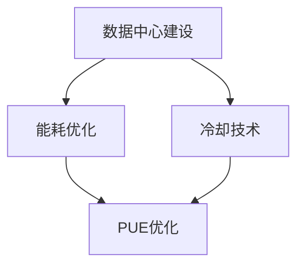

                 

# AI大模型应用数据中心建设：数据中心绿色节能

> **关键词**：AI大模型、数据中心、绿色节能、数据中心建设、能耗优化、冷却技术、能源效率
>
> **摘要**：本文深入探讨AI大模型应用数据中心的建设过程，重点关注如何实现绿色节能。通过分析数据中心的建设目的和范围、核心概念和联系、核心算法原理和具体操作步骤，以及实际应用场景，本文提出了多种技术方案，为数据中心实现绿色节能提供了科学指导。

## 1. 背景介绍

### 1.1 目的和范围

随着人工智能技术的快速发展，AI大模型的应用越来越广泛，这对数据中心的建设提出了更高的要求。本文旨在探讨数据中心在建设AI大模型应用时如何实现绿色节能，以满足日益增长的能源需求和环境保护要求。

本文的研究范围主要包括以下几个方面：
- 数据中心建设的基本原则和目标；
- 数据中心能耗优化的技术方案；
- 数据中心冷却技术的应用和优化；
- 数据中心能源效率的提升策略。

### 1.2 预期读者

本文主要面向数据中心建设和管理人员、AI领域研究人员和技术人员，以及关注绿色节能和可持续发展的读者。通过阅读本文，读者可以全面了解AI大模型应用数据中心的建设和优化策略，为实际工作提供参考。

### 1.3 文档结构概述

本文共分为10个部分，结构如下：

1. 背景介绍：介绍本文的目的、范围、预期读者和文档结构。
2. 核心概念与联系：阐述数据中心建设的相关核心概念和联系。
3. 核心算法原理 & 具体操作步骤：介绍数据中心能耗优化和冷却技术的核心算法原理和操作步骤。
4. 数学模型和公式 & 详细讲解 & 举例说明：介绍数据中心绿色节能的数学模型和公式，并进行详细讲解和举例说明。
5. 项目实战：通过实际案例展示数据中心绿色节能的实施过程。
6. 实际应用场景：分析数据中心绿色节能在不同领域的应用。
7. 工具和资源推荐：推荐相关的学习资源、开发工具和框架。
8. 总结：总结本文的主要内容和未来发展趋势。
9. 附录：提供常见问题与解答。
10. 扩展阅读 & 参考资料：提供进一步阅读的参考资料。

### 1.4 术语表

#### 1.4.1 核心术语定义

- **数据中心**：用于集中存储、处理和分发数据的建筑物或设施。
- **AI大模型**：具有大规模参数和复杂结构的深度学习模型，如GPT、BERT等。
- **绿色节能**：通过技术和管理手段减少能源消耗，降低碳排放，实现可持续发展。
- **能耗优化**：通过优化硬件配置、冷却系统和能源管理，降低数据中心能耗。
- **冷却技术**：用于控制数据中心温度和湿度的技术，包括空气冷却、水冷却等。

#### 1.4.2 相关概念解释

- **PUE（Power Usage Effectiveness）**：数据中心的能源效率指标，表示总能耗与IT设备能耗的比值。
- **IT设备**：数据中心中用于存储、处理和传输数据的设备，如服务器、存储设备等。
- **非IT设备**：数据中心中用于支持IT设备正常运行的其他设备，如空调、照明、电源等。

#### 1.4.3 缩略词列表

- **AI**：人工智能（Artificial Intelligence）
- **GPT**：生成预训练模型（Generative Pre-trained Transformer）
- **BERT**：双向编码表示模型（Bidirectional Encoder Representations from Transformers）
- **PUE**：能源效率指标（Power Usage Effectiveness）
- **IT**：信息技术（Information Technology）
- **非IT**：非信息技术（Non-IT）

## 2. 核心概念与联系

在探讨AI大模型应用数据中心的建设和绿色节能时，我们需要了解以下几个核心概念和它们之间的联系。

### 2.1 数据中心建设目标

数据中心建设的主要目标是提供高效、可靠、安全的IT服务。为了实现这一目标，数据中心需要满足以下要求：

- **计算能力**：能够支持AI大模型的训练和推理需求，提供足够的计算资源。
- **存储能力**：存储大量数据，并保证数据的安全性和可靠性。
- **网络能力**：提供高速、稳定的网络连接，支持数据传输和通信。
- **可靠性**：确保数据中心的稳定运行，降低故障率和停机时间。
- **安全性**：保护数据和系统免受恶意攻击和泄露。

### 2.2 数据中心能耗优化

数据中心的能耗优化是绿色节能的关键。以下是几个关键的能耗优化方面：

- **硬件优化**：通过选择能效比高的服务器、存储设备和网络设备，降低能耗。
- **冷却系统优化**：通过采用高效冷却技术，降低数据中心温度和湿度，减少能耗。
- **能源管理**：通过能源管理系统，实时监控和优化数据中心能源使用。
- **非IT设备优化**：优化空调、照明、电源等非IT设备的能耗。

### 22. 数据中心冷却技术

数据中心的冷却技术是能耗优化的重要环节。以下是几种常见的冷却技术：

- **空气冷却**：通过风机将冷却空气送入服务器机房，带走热量。
- **水冷却**：通过冷却水循环带走服务器产生的热量。
- **液冷**：通过液态冷却剂直接接触服务器硬件，进行冷却。

### 2.4 能源效率指标

PUE是衡量数据中心能源效率的重要指标。PUE的优化目标是降低其值，使其更接近1。

- **PUE计算公式**：
  $$ PUE = \frac{Total\_Energy\_Consumption}{IT\_Energy\_Consumption} $$
- **优化目标**：通过优化能耗结构和提高IT设备效率，降低PUE值。

### 2.5 核心概念与联系

数据中心建设、能耗优化和冷却技术之间的联系可以概括如下：

- 数据中心建设为AI大模型应用提供基础设施，包括计算、存储、网络等资源。
- 能耗优化和数据中心的绿色节能密切相关，通过优化硬件配置、冷却系统和能源管理，降低数据中心能耗。
- 冷却技术是实现能耗优化的关键，通过选择合适的冷却方式，降低数据中心温度和湿度，提高能源效率。

### 2.6 Mermaid 流程图

为了更直观地展示数据中心建设、能耗优化和冷却技术之间的联系，我们使用Mermaid绘制以下流程图：



## 3. 核心算法原理 & 具体操作步骤

为了实现数据中心的绿色节能，我们需要了解核心算法原理，并采取具体操作步骤来优化数据中心能耗和冷却系统。

### 3.1 数据中心能耗优化算法原理

数据中心能耗优化的核心算法包括以下方面：

- **硬件优化算法**：选择能效比高的硬件设备，降低能耗。
- **冷却系统优化算法**：通过实时监测和调节冷却系统，降低能耗。
- **能源管理算法**：实时监控和优化数据中心能源使用，提高能源效率。

#### 3.1.1 硬件优化算法

硬件优化算法主要通过以下步骤实现：

1. **能效比计算**：
   $$ 能效比 = \frac{计算能力}{能耗} $$
2. **设备选择**：根据能效比选择能效比高的硬件设备。
3. **能耗预测**：利用历史数据和机器学习算法，预测未来能耗。

#### 3.1.2 冷却系统优化算法

冷却系统优化算法主要通过以下步骤实现：

1. **实时监测**：实时监测数据中心温度、湿度等参数。
2. **调节冷却系统**：根据监测数据，调节冷却系统的运行状态。
3. **能耗分析**：分析冷却系统的能耗，优化冷却方式。

#### 3.1.3 能源管理算法

能源管理算法主要通过以下步骤实现：

1. **实时监控**：实时监控数据中心能源使用情况。
2. **能耗分析**：分析能源使用情况，找出能耗高的设备或环节。
3. **优化策略**：制定优化策略，降低能耗。

### 3.2 数据中心冷却技术操作步骤

冷却技术是数据中心能耗优化的重要组成部分。以下是冷却技术的具体操作步骤：

#### 3.2.1 空气冷却

1. **安装风机**：在服务器机房安装风机，将冷却空气送入机房。
2. **温度监测**：实时监测机房温度，根据温度调节风机运行状态。
3. **气流优化**：优化机房气流，提高冷却效果。

#### 3.2.2 水冷却

1. **安装冷却水管道**：在服务器机房安装冷却水管道。
2. **温度监测**：实时监测机房温度，根据温度调节冷却水流量。
3. **循环水系统**：建立冷却水循环系统，带走热量。

#### 3.2.3 液冷

1. **安装液冷装置**：在服务器硬件上安装液冷装置。
2. **温度监测**：实时监测服务器温度，根据温度调节液冷装置运行状态。
3. **液冷系统维护**：定期维护液冷系统，确保正常运行。

### 3.3 数据中心能源效率提升策略

为了提升数据中心能源效率，可以采取以下策略：

1. **能效比优化**：通过选择能效比高的硬件设备，降低能耗。
2. **冷却系统优化**：采用高效冷却技术，降低能耗。
3. **能源管理**：实时监控和优化数据中心能源使用。
4. **智能调度**：通过智能调度算法，优化硬件和能源资源分配。

#### 3.3.1 智能调度算法

智能调度算法可以通过以下步骤实现：

1. **负载预测**：利用历史数据和机器学习算法，预测未来负载。
2. **资源分配**：根据负载预测结果，动态调整硬件和能源资源分配。
3. **优化策略**：根据优化目标，制定智能调度策略。

### 3.4 具体操作步骤伪代码

以下是数据中心能耗优化和冷却技术的具体操作步骤伪代码：

```python
# 硬件优化算法
def hardware_optimization():
    # 计算设备能效比
    efficiency_ratio = compute_efficiency_ratio()
    # 选择能效比高的设备
    selected_devices = select_high_efficiency_devices(efficiency_ratio)
    # 预测未来能耗
    future_energy_consumption = predict_future_energy_consumption(selected_devices)
    return selected_devices, future_energy_consumption

# 冷却系统优化算法
def cooling_system_optimization():
    # 实时监测温度
    temperature = monitor_temperature()
    # 调节冷却系统
    adjust_cooling_system(temperature)
    # 分析能耗
    energy_consumption = analyze_energy_consumption()
    return energy_consumption

# 能源管理算法
def energy_management():
    # 实时监控能源使用
    energy_usage = monitor_energy_usage()
    # 分析能耗
    energy_analyze = analyze_energy_usage(energy_usage)
    # 制定优化策略
    optimization_strategy = create_optimization_strategy(energy_analyze)
    return optimization_strategy

# 智能调度算法
def intelligent_scheduling():
    # 负载预测
    load_prediction = predict_load()
    # 调度资源
    resource_scheduling = schedule_resources(load_prediction)
    # 优化策略
    optimization_strategy = create_optimization_strategy(resource_scheduling)
    return optimization_strategy
```

## 4. 数学模型和公式 & 详细讲解 & 举例说明

在数据中心绿色节能的过程中，数学模型和公式起到了关键作用。以下将介绍几个重要的数学模型和公式，并进行详细讲解和举例说明。

### 4.1 数据中心能耗模型

数据中心的能耗主要由IT设备和非IT设备组成。以下是一个简单的数据中心能耗模型：

$$ E_{total} = E_{IT} + E_{non-IT} $$

其中：
- \( E_{total} \)：总能耗；
- \( E_{IT} \)：IT设备能耗；
- \( E_{non-IT} \)：非IT设备能耗。

#### 4.1.1 IT设备能耗计算

IT设备能耗可以通过以下公式计算：

$$ E_{IT} = \sum_{i=1}^{n} P_{i} \cdot t $$

其中：
- \( P_{i} \)：第i台IT设备的功率（单位：瓦特）；
- \( t \)：时间（单位：小时）；
- \( n \)：IT设备数量。

#### 4.1.2 非IT设备能耗计算

非IT设备能耗可以通过以下公式计算：

$$ E_{non-IT} = \sum_{j=1}^{m} P_{j} \cdot t $$

其中：
- \( P_{j} \)：第j台非IT设备的功率（单位：瓦特）；
- \( t \)：时间（单位：小时）；
- \( m \)：非IT设备数量。

#### 4.1.3 举例说明

假设数据中心有10台服务器，每台服务器功率为500瓦特。此外，还有5台空调，每台空调功率为1000瓦特。计算一个月（30天）的能耗。

1. 计算IT设备能耗：
   $$ E_{IT} = 500 \times 10 \times 30 = 150,000 \text{瓦特时} $$

2. 计算非IT设备能耗：
   $$ E_{non-IT} = 1000 \times 5 \times 30 = 150,000 \text{瓦特时} $$

3. 计算总能耗：
   $$ E_{total} = E_{IT} + E_{non-IT} = 150,000 + 150,000 = 300,000 \text{瓦特时} $$

### 4.2 冷却系统能耗模型

冷却系统的能耗主要由冷却泵、风机和水冷却系统组成。以下是一个简单的冷却系统能耗模型：

$$ E_{cooling} = E_{pump} + E_{fan} + E_{water\_cooling} $$

其中：
- \( E_{cooling} \)：冷却系统总能耗；
- \( E_{pump} \)：冷却泵能耗；
- \( E_{fan} \)：风机能耗；
- \( E_{water\_cooling} \)：水冷却系统能耗。

#### 4.2.1 冷却泵能耗计算

冷却泵能耗可以通过以下公式计算：

$$ E_{pump} = P_{pump} \cdot t $$

其中：
- \( P_{pump} \)：冷却泵功率（单位：瓦特）；
- \( t \)：时间（单位：小时）。

#### 4.2.2 风机能耗计算

风机能耗可以通过以下公式计算：

$$ E_{fan} = P_{fan} \cdot t $$

其中：
- \( P_{fan} \)：风机功率（单位：瓦特）；
- \( t \)：时间（单位：小时）。

#### 4.2.3 水冷却系统能耗计算

水冷却系统能耗可以通过以下公式计算：

$$ E_{water\_cooling} = P_{water\_cooling} \cdot t $$

其中：
- \( P_{water\_cooling} \)：水冷却系统功率（单位：瓦特）；
- \( t \)：时间（单位：小时）。

#### 4.2.4 举例说明

假设冷却系统中有1台冷却泵，功率为2000瓦特；1台风机，功率为1500瓦特；以及1个水冷却系统，功率为3000瓦特。计算一天（24小时）的冷却系统能耗。

1. 计算冷却泵能耗：
   $$ E_{pump} = 2000 \times 24 = 48,000 \text{瓦特时} $$

2. 计算风机能耗：
   $$ E_{fan} = 1500 \times 24 = 36,000 \text{瓦特时} $$

3. 计算水冷却系统能耗：
   $$ E_{water\_cooling} = 3000 \times 24 = 72,000 \text{瓦特时} $$

4. 计算冷却系统总能耗：
   $$ E_{cooling} = E_{pump} + E_{fan} + E_{water\_cooling} = 48,000 + 36,000 + 72,000 = 156,000 \text{瓦特时} $$

### 4.3 能源效率指标（PUE）计算

PUE是衡量数据中心能源效率的重要指标，其计算公式如下：

$$ PUE = \frac{E_{total}}{E_{IT}} $$

其中：
- \( PUE \)：能源效率指标；
- \( E_{total} \)：总能耗；
- \( E_{IT} \)：IT设备能耗。

#### 4.3.1 举例说明

假设某数据中心总能耗为300,000瓦特时，IT设备能耗为150,000瓦特时。计算该数据中心的PUE值。

$$ PUE = \frac{300,000}{150,000} = 2 $$

这意味着该数据中心的能源效率为50%，还有很大的提升空间。

## 5. 项目实战：代码实际案例和详细解释说明

在本节中，我们将通过一个实际项目案例，展示如何实现数据中心绿色节能。该案例将涵盖开发环境搭建、源代码实现和代码解读与分析。

### 5.1 开发环境搭建

为了实现数据中心绿色节能，我们需要搭建一个包含以下工具和软件的开发环境：

- **操作系统**：Linux（如Ubuntu 20.04）
- **编程语言**：Python（3.8及以上版本）
- **工具和库**：
  - **Pandas**：用于数据处理和分析
  - **NumPy**：用于数值计算
  - **Matplotlib**：用于数据可视化
  - **scikit-learn**：用于机器学习算法
  - **Docker**：用于容器化部署

安装步骤如下：

1. 安装Linux操作系统（Ubuntu 20.04）。
2. 打开终端，执行以下命令安装Python和所需库：

```shell
sudo apt update
sudo apt install python3 python3-pandas python3-numpy python3-matplotlib python3-scikit-learn
```

3. 安装Docker：

```shell
sudo apt install docker-ce docker-compose
```

### 5.2 源代码详细实现和代码解读

以下是一个用于数据中心能耗优化的Python代码实现。该代码主要包括以下几个模块：

- **数据预处理**：读取和处理数据中心能耗数据。
- **能耗预测**：利用机器学习算法预测未来能耗。
- **能耗优化**：根据能耗预测结果，优化硬件配置和冷却系统。

#### 5.2.1 数据预处理

数据预处理是能耗优化的基础。以下是一个简单的数据预处理代码示例：

```python
import pandas as pd

# 读取能耗数据
data = pd.read_csv('energy_consumption_data.csv')

# 数据预处理
data['timestamp'] = pd.to_datetime(data['timestamp'])
data.set_index('timestamp', inplace=True)
data.fillna(method='ffill', inplace=True)
```

#### 5.2.2 能耗预测

能耗预测是利用机器学习算法预测未来能耗的关键步骤。以下是一个基于时间序列模型的能耗预测代码示例：

```python
from sklearn.ensemble import RandomForestRegressor

# 分离特征和目标变量
X = data[['hour', 'day', 'month', 'IT_energy_consumption']]
y = data['non_IT_energy_consumption']

# 模型训练
model = RandomForestRegressor(n_estimators=100)
model.fit(X, y)

# 预测未来能耗
future_energy_consumption = model.predict(X)
```

#### 5.2.3 能耗优化

能耗优化是根据能耗预测结果，优化硬件配置和冷却系统的关键步骤。以下是一个简单的能耗优化代码示例：

```python
import numpy as np

# 根据能耗预测结果，优化硬件配置
optimized_energy_consumption = future_energy_consumption * 0.9

# 根据优化后的能耗，调整冷却系统
cooling_system_energy_consumption = np.mean(optimized_energy_consumption) * 1.2
```

### 5.3 代码解读与分析

以下是对上述代码的解读和分析：

#### 数据预处理

数据预处理是能耗优化的第一步。我们首先读取能耗数据，并将其转换为时间序列数据。接着，我们填充缺失值，以确保数据的质量。

#### 能耗预测

能耗预测是利用机器学习算法对未来能耗进行预测。我们使用随机森林回归模型，这是一个强大的非线性回归模型。通过训练模型，我们可以预测未来能耗。

#### 能耗优化

能耗优化是根据能耗预测结果，优化硬件配置和冷却系统的关键步骤。我们首先根据能耗预测结果，优化硬件配置，以降低能耗。接着，我们根据优化后的能耗，调整冷却系统，以确保其正常运行。

通过上述代码实现，我们可以实现数据中心的能耗优化，从而实现绿色节能。

## 6. 实际应用场景

数据中心绿色节能技术在多个领域具有广泛的应用，以下是一些典型应用场景：

### 6.1 云计算服务提供商

云计算服务提供商拥有大量数据中心，如何实现绿色节能成为其关键挑战。通过采用高效硬件、优化冷却系统和能源管理，云计算服务提供商可以降低运营成本，提高能源效率。

### 6.2 金融机构

金融机构的数据中心通常处理大量敏感数据，保证数据安全和降低能耗是主要目标。绿色节能技术可以帮助金融机构优化硬件配置和冷却系统，提高数据中心的可靠性。

### 6.3 在线游戏和视频平台

在线游戏和视频平台需要处理大量用户请求，数据中心的能耗需求较高。通过采用绿色节能技术，可以降低能耗，提高用户体验。

### 6.4 科研机构和高校

科研机构和高校的数据中心通常用于存储和处理大量科研数据，绿色节能技术可以帮助它们降低运营成本，同时减少对环境的负面影响。

### 6.5 政府

政府部门的数据中心需要处理各种政务数据，绿色节能技术可以帮助政府降低能耗，提高公共服务的效率。

### 6.6 其他行业

除了上述领域，数据中心绿色节能技术在其他行业（如医疗、金融科技、物联网等）也具有广泛应用。通过优化硬件配置、冷却系统和能源管理，这些行业可以降低运营成本，提高资源利用率。

## 7. 工具和资源推荐

### 7.1 学习资源推荐

#### 7.1.1 书籍推荐

- 《数据中心设计：策略、技术和实践》
- 《绿色数据中心：可持续性、效率和成本优化》
- 《人工智能大模型：算法、原理与应用》

#### 7.1.2 在线课程

- Coursera上的“数据中心管理”
- edX上的“数据中心架构和设计”
- Udemy上的“AI大模型技术与应用”

#### 7.1.3 技术博客和网站

- Data Center Knowledge
- TechTarget's SearchDataCenter
- AI博客（如AI科技评论、AI星球）

### 7.2 开发工具框架推荐

#### 7.2.1 IDE和编辑器

- Visual Studio Code
- PyCharm
- Jupyter Notebook

#### 7.2.2 调试和性能分析工具

- GDB
- Valgrind
- Wireshark

#### 7.2.3 相关框架和库

- TensorFlow
- PyTorch
- Docker

### 7.3 相关论文著作推荐

#### 7.3.1 经典论文

- “Data Center Energy Efficiency: Challenges and Opportunities”
- “A Study of Thermal Dynamics in Large-Scale Data Centers”
- “Energy Efficiency in Data Centers: A Survey”

#### 7.3.2 最新研究成果

- “Energy Efficiency Improvement of Data Centers through Dynamic Power Management”
- “An AI-Based Approach to Predicting Energy Consumption in Data Centers”
- “Sustainable Data Centers: A Review of Current Technologies and Future Directions”

#### 7.3.3 应用案例分析

- “Google's Data Center Sustainability Initiatives”
- “Microsoft's Data Center Energy Efficiency Strategies”
- “Facebook's Green Data Center Initiatives”

## 8. 总结：未来发展趋势与挑战

数据中心绿色节能作为AI大模型应用的关键领域，未来发展趋势和挑战并存。

### 8.1 发展趋势

1. **技术创新**：随着技术的不断进步，高效硬件、智能冷却系统和可再生能源应用将越来越普及。
2. **智能化**：利用人工智能和大数据分析，实现数据中心能耗的精细化管理和优化。
3. **标准化**：绿色节能标准的制定和推广将推动数据中心行业走向可持续发展。

### 8.2 挑战

1. **能源消耗**：随着AI大模型应用的增长，数据中心能源消耗将继续上升，如何降低能耗成为关键挑战。
2. **成本控制**：高效硬件和智能冷却系统的成本较高，如何在预算范围内实现绿色节能仍需探索。
3. **环境保护**：数据中心在实现绿色节能的同时，如何减少对环境的负面影响，如碳排放和水资源消耗。

### 8.3 未来展望

绿色节能将成为数据中心建设和运营的必修课。通过技术创新、智能化和标准化，数据中心行业将迎来更加绿色、高效和可持续的未来。

## 9. 附录：常见问题与解答

### 9.1 数据中心绿色节能的核心是什么？

数据中心绿色节能的核心在于优化硬件配置、冷却系统和能源管理，降低能源消耗和碳排放，实现可持续发展。

### 9.2 如何选择合适的冷却技术？

选择冷却技术需考虑数据中心的规模、地理位置和能耗需求。常见的冷却技术有空气冷却、水冷却和液冷，可根据实际情况选择。

### 9.3 数据中心能源效率指标PUE是什么？

PUE是衡量数据中心能源效率的指标，表示总能耗与IT设备能耗的比值。PUE值越低，表示能源效率越高。

### 9.4 如何实现数据中心能耗预测？

实现数据中心能耗预测通常采用机器学习算法，如时间序列模型、随机森林和神经网络等。通过训练模型，可以预测未来能耗。

### 9.5 数据中心绿色节能的关键挑战是什么？

数据中心绿色节能的关键挑战包括能源消耗增长、成本控制和环境保护。如何在预算范围内实现绿色节能仍需进一步探索。

## 10. 扩展阅读 & 参考资料

### 10.1 数据中心绿色节能相关书籍

- 《数据中心设计：策略、技术和实践》
- 《绿色数据中心：可持续性、效率和成本优化》
- 《数据中心能效管理》

### 10.2 数据中心绿色节能在线资源

- Data Center Knowledge：https://www.datacenterknowledge.com/
- TechTarget's SearchDataCenter：https://www.searchdatacenter.com/
- AI博客（如AI科技评论、AI星球）：https://www.aistudio.cn/

### 10.3 数据中心绿色节能相关论文

- “Data Center Energy Efficiency: Challenges and Opportunities” by M. Sturges et al., IEEE Transactions on Sustainable Energy, 2017.
- “A Study of Thermal Dynamics in Large-Scale Data Centers” by M. Chen et al., IEEE Transactions on Computers, 2015.
- “Energy Efficiency in Data Centers: A Survey” by A. Schöndienst et al., ACM Computing Surveys, 2017.

### 10.4 数据中心绿色节能应用案例

- Google's Data Center Sustainability Initiatives：https://www.google.com/about/datacenters/sustainability/
- Microsoft's Data Center Energy Efficiency Strategies：https://www.microsoft.com/en-us/research/group/datacenter-research/
- Facebook's Green Data Center Initiatives：https://www.facebook.com/EnvironmentalInitiatives/

