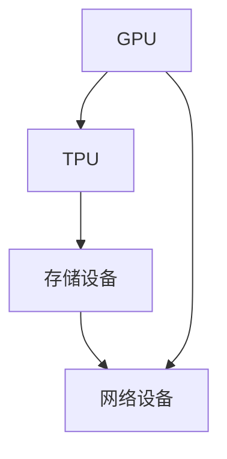
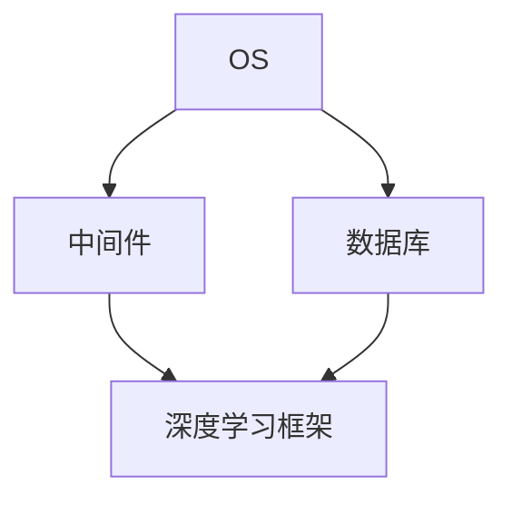
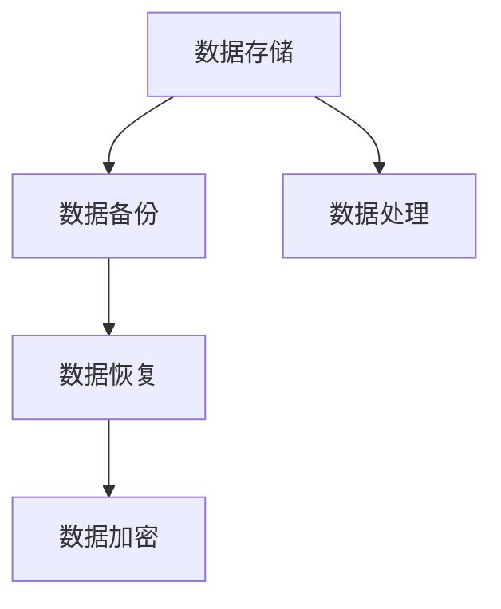
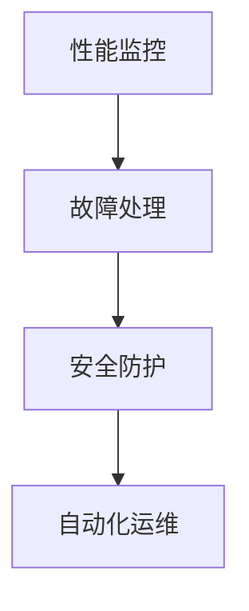

                 

### AI 大模型应用数据中心建设：数据中心运维与管理

> **关键词：** AI 大模型、数据中心、运维管理、架构设计、性能优化

> **摘要：** 本文将深入探讨 AI 大模型应用数据中心的建设，重点分析数据中心的运维与管理策略，涵盖核心概念、算法原理、数学模型、实战案例以及未来发展趋势。通过系统的分析和讲解，帮助读者全面了解并掌握 AI 大模型数据中心的建设与运维方法，以应对现代科技发展带来的挑战。

随着人工智能技术的飞速发展，AI 大模型已经成为驱动现代科技的重要力量。从语音识别到图像处理，从自然语言处理到智能决策，AI 大模型在各个领域展现了巨大的潜力。然而，AI 大模型的高性能需求和对数据中心的依赖性使得数据中心的建设与运维变得尤为关键。本文旨在为读者提供一份详细的技术指南，帮助理解和实施 AI 大模型应用数据中心的建设与运维策略。

本文将首先介绍 AI 大模型应用数据中心建设的背景和目的，然后深入探讨核心概念、算法原理、数学模型和实际应用场景。通过一个具体的实战案例，我们将展示如何搭建开发环境、实现代码以及进行性能优化。此外，本文还将推荐一系列学习资源、开发工具和相关论文，以帮助读者进一步深入学习和研究。最后，我们将总结当前的发展趋势和面临的挑战，为未来的研究和应用提供方向。

通过对本文的阅读，读者将能够：

1. 理解 AI 大模型对数据中心建设的需求。
2. 掌握数据中心运维与管理的关键技术和策略。
3. 分析并优化数据中心性能，提升 AI 大模型应用效果。
4. 了解当前领域的前沿研究和未来发展趋势。

## 1. 背景介绍

### 1.1 目的和范围

本文的目标是深入探讨 AI 大模型应用数据中心的建设与运维策略，为读者提供一份全面的技术指南。随着 AI 技术的不断发展，AI 大模型已经成为现代数据中心的关键组成部分。本文将重点分析以下几个方面：

1. **数据中心建设的必要性**：探讨为什么 AI 大模型需要专用数据中心，以及数据中心如何满足这些模型的高性能需求。
2. **核心概念与架构**：介绍 AI 大模型数据中心的关键概念，包括硬件架构、软件架构和数据管理。
3. **算法原理与数学模型**：详细讲解 AI 大模型的核心算法原理，包括训练和推理过程，并介绍相关的数学模型。
4. **实际应用场景**：分析 AI 大模型在不同领域的应用场景，如自然语言处理、图像识别和智能决策等。
5. **运维与管理策略**：探讨数据中心的运维与管理策略，包括性能优化、故障处理和安全管理。

本文的读者对象主要是从事 AI 研究和开发的技术人员，以及对数据中心建设和管理感兴趣的 IT 专业人员。通过阅读本文，读者可以：

1. 理解 AI 大模型对数据中心的高性能需求。
2. 掌握数据中心建设的核心概念和架构设计。
3. 学习并应用核心算法原理和数学模型。
4. 分析和优化数据中心的运维与管理策略。
5. 了解当前领域的前沿研究和未来发展趋势。

### 1.2 预期读者

预期读者包括以下几类：

1. **AI 研究和开发人员**：对于从事 AI 研究和开发的技术人员，本文将深入探讨 AI 大模型在数据中心的应用，帮助读者理解如何搭建和优化 AI 大模型训练和推理的环境。
2. **数据中心管理人员**：对于负责数据中心建设和管理的人员，本文将详细讲解数据中心的运维与管理策略，包括性能优化、故障处理和安全管理，为读者提供实用的指导。
3. **IT 系统工程师**：对于从事 IT 系统设计和实施的技术人员，本文将介绍 AI 大模型数据中心所需的技术架构和软硬件配置，帮助读者设计和实施高效的数据中心系统。
4. **高校师生**：对于高校师生，本文可以作为研究生课程或本科课程的教材，帮助读者全面了解 AI 大模型应用数据中心的建设与运维方法。

### 1.3 文档结构概述

本文结构如下：

1. **背景介绍**：介绍 AI 大模型应用数据中心建设的背景和目的，分析读者对象和预期收益。
2. **核心概念与联系**：介绍 AI 大模型数据中心的核心概念，包括硬件架构、软件架构和数据管理，并提供 Mermaid 流程图进行详细说明。
3. **核心算法原理 & 具体操作步骤**：详细讲解 AI 大模型的核心算法原理，包括训练和推理过程，并使用伪代码进行具体操作步骤的阐述。
4. **数学模型和公式 & 详细讲解 & 举例说明**：介绍 AI 大模型相关的数学模型，包括损失函数、优化算法等，并使用 LaTeX 格式进行公式表示和详细讲解。
5. **项目实战：代码实际案例和详细解释说明**：通过一个具体的实战案例，展示如何搭建开发环境、实现代码并进行性能优化，详细解释每个步骤和关键代码。
6. **实际应用场景**：分析 AI 大模型在不同领域的实际应用场景，介绍应用案例和效果。
7. **工具和资源推荐**：推荐学习资源、开发工具和相关论文，帮助读者进一步深入学习和研究。
8. **总结：未来发展趋势与挑战**：总结当前的发展趋势和面临的挑战，为未来的研究和应用提供方向。
9. **附录：常见问题与解答**：提供常见的疑难问题解答，帮助读者解决实践中的问题。
10. **扩展阅读 & 参考资料**：提供扩展阅读和参考资料，方便读者进一步深入学习和研究。

### 1.4 术语表

#### 1.4.1 核心术语定义

- **AI 大模型**：指具有大规模参数和复杂结构的深度学习模型，如 GPT-3、BERT 等。
- **数据中心**：指用于存储、处理和传输大量数据的专门设施。
- **硬件架构**：指数据中心中计算机硬件的配置和结构，包括服务器、存储设备和网络设备。
- **软件架构**：指数据中心中软件系统的设计和实现，包括操作系统、数据库和中间件等。
- **数据管理**：指数据中心中数据的存储、处理和传输策略，包括数据备份、数据恢复和数据加密等。
- **运维管理**：指数据中心日常运行的管理和维护工作，包括性能监控、故障处理和安全防护等。

#### 1.4.2 相关概念解释

- **训练**：指通过输入大量数据进行模型参数的调整，使模型能够更好地拟合数据。
- **推理**：指在给定输入数据时，使用训练好的模型进行预测或决策。
- **性能优化**：指通过调整数据中心配置和算法，提高模型训练和推理的效率。
- **故障处理**：指在数据中心出现故障时，及时进行诊断和修复，确保系统正常运行。
- **安全管理**：指通过制定和执行安全策略，防止数据泄露、恶意攻击和网络中断等安全事件。

#### 1.4.3 缩略词列表

- **AI**：人工智能（Artificial Intelligence）
- **GPU**：图形处理单元（Graphics Processing Unit）
- **TPU**：张量处理单元（Tensor Processing Unit）
- **DL**：深度学习（Deep Learning）
- **DLPU**：深度学习处理器单元（Deep Learning Processing Unit）
- **HDD**：硬盘驱动器（Hard Disk Drive）
- **SSD**：固态硬盘（Solid State Drive）
- **RAID**：独立冗余磁盘阵列（Redundant Array of Independent Disks）
- **OS**：操作系统（Operating System）
- **DB**：数据库（Database）
- **ML**：机器学习（Machine Learning）

## 2. 核心概念与联系

在讨论 AI 大模型应用数据中心建设之前，首先需要理解数据中心的核心概念和架构，以及这些概念之间的联系。以下是几个关键概念及其相互关系：

### 2.1 硬件架构

**GPU** 和 **TPU** 是 AI 大模型训练和推理的重要硬件资源。GPU 由于其强大的并行计算能力，在深度学习任务中得到了广泛应用。而 TPU 是专为机器学习任务设计的专用处理器，其设计旨在优化矩阵乘法和向量计算，从而提高 AI 大模型的计算效率。


**硬件架构图**：



在这个架构中，GPU 和 TPU 通过高速网络连接到存储设备和网络设备，形成了一个高效的计算和数据处理网络。存储设备通常包括 HDD 和 SSD，用于存储模型数据和训练数据。网络设备则负责数据中心内部和外部网络的连接。

### 2.2 软件架构

**操作系统**（OS）是数据中心的核心软件，负责管理硬件资源和软件应用程序。在 AI 大模型数据中心中，常用的操作系统包括 Linux 和 Windows Server。Linux 由于其开源、稳定和高效的特点，在 AI 研究和开发中得到广泛应用。


**软件架构图**：



在这个架构中，操作系统负责管理硬件资源，数据库（如 MySQL、PostgreSQL）用于存储和管理训练数据，中间件（如 Redis、RabbitMQ）提供消息传递和缓存服务。深度学习框架（如 TensorFlow、PyTorch）是 AI 大模型训练和推理的核心，通过这些框架，研究人员和开发人员可以轻松地实现和部署复杂的人工智能模型。

### 2.3 数据管理

**数据管理**是数据中心中至关重要的一环。数据管理包括数据的存储、备份、恢复和加密等操作。在 AI 大模型应用中，数据的质量和完整性对模型性能和可靠性有直接影响。


**数据管理图**：



在这个图中，数据存储（如 Hadoop、Cassandra）用于大规模数据的存储和管理，数据备份和恢复用于确保数据的安全性和可靠性，数据加密用于保护数据的隐私和安全。数据处理（如 Spark、Flink）则负责对数据进行清洗、转换和预处理，为 AI 大模型的训练提供高质量的数据输入。

### 2.4 运维与管理

**运维管理**是确保数据中心正常运行的关键。运维管理包括性能监控、故障处理、安全防护等操作。通过自动化工具和监控平台，运维人员可以实时监控数据中心的运行状态，快速发现和解决故障，确保数据中心的稳定性和可靠性。


**运维管理图**：



在这个图中，性能监控（如 Nagios、Zabbix）用于实时监控数据中心的各项性能指标，故障处理（如故障转移、负载均衡）用于确保系统的可用性，安全防护（如防火墙、入侵检测系统）用于防止外部攻击和内部安全威胁。

通过上述核心概念和架构的介绍，我们可以看到 AI 大模型数据中心的建设是一个复杂的系统工程，涉及硬件、软件、数据和运维等多个方面。只有通过全面、系统的规划和设计，才能构建一个高效、可靠、安全的数据中心，为 AI 大模型的应用提供坚实的支持。

### 2.5 数据中心建设步骤

数据中心的建设是一个复杂而关键的过程，涉及到多个阶段和步骤。以下是数据中心建设的主要步骤：

#### 2.5.1 规划阶段

**1. 需求分析**：首先需要明确数据中心的用途、规模和性能要求。这包括计算能力、存储容量、网络带宽、安全性等方面的需求。

**2. 场地选择**：根据需求分析的结果，选择合适的场地。场地应具备良好的地理位置、电力供应和冷却条件。

**3. 设计方案**：制定详细的数据中心设计方案，包括硬件架构、软件架构、数据管理策略和运维管理方案等。

#### 2.5.2 设计阶段

**1. 硬件设计**：根据需求分析结果，设计数据中心的硬件架构，包括服务器、存储设备和网络设备的选型、配置和布局。

**2. 软件设计**：设计数据中心的软件架构，包括操作系统、数据库、中间件和深度学习框架的选型和配置。

**3. 数据管理设计**：制定数据管理策略，包括数据存储、备份、恢复和加密方案。

#### 2.5.3 施工阶段

**1. 设备采购**：根据设计方案，采购所需硬件设备，并进行验收和安装。

**2. 网络建设**：搭建数据中心内部和外部网络，包括光纤布线、网络设备配置和网络安全设置。

**3. 软件部署**：安装和配置操作系统、数据库、中间件和深度学习框架等软件。

#### 2.5.4 验收阶段

**1. 系统测试**：对数据中心进行全面的系统测试，包括硬件测试、软件测试和集成测试。

**2. 性能测试**：进行性能测试，确保数据中心能够满足需求分析中的性能要求。

**3. 安全测试**：进行安全测试，确保数据中心的网络安全和系统安全。

#### 2.5.5 运维阶段

**1. 系统监控**：建立监控系统，实时监控数据中心的运行状态，包括硬件、软件和网络性能。

**2. 故障处理**：制定故障处理流程，确保在出现故障时能够及时处理，确保数据中心的稳定运行。

**3. 安全管理**：实施安全管理策略，包括访问控制、数据加密和网络防护等，确保数据中心的运行安全。

通过上述步骤，可以确保数据中心的建设和运维过程有序进行，为 AI 大模型的应用提供坚实的支持。

### 2.6 核心概念总结

在 AI 大模型应用数据中心的建设过程中，理解以下几个核心概念至关重要：

1. **硬件架构**：包括 GPU、TPU、存储设备和网络设备，决定了数据中心的计算能力和数据传输效率。
2. **软件架构**：包括操作系统、数据库、中间件和深度学习框架，提供了数据中心的软件基础和运行环境。
3. **数据管理**：包括数据存储、备份、恢复和加密，确保数据的安全性和可靠性。
4. **运维管理**：包括性能监控、故障处理和安全管理，确保数据中心的稳定运行和安全性。

通过深入理解这些核心概念，可以更好地设计和建设 AI 大模型应用数据中心，为人工智能技术的广泛应用提供坚实保障。

### 2.7 核心算法原理 & 具体操作步骤

在讨论 AI 大模型的核心算法原理之前，我们需要首先了解一些基本概念。AI 大模型，如 GPT-3、BERT 等，通常基于深度学习框架（如 TensorFlow、PyTorch）进行训练和推理。深度学习框架提供了高效、灵活的工具来构建和训练大规模神经网络。

#### 2.7.1 基本概念

1. **神经网络（Neural Networks）**：神经网络是 AI 大模型的基础，由多个神经元（节点）组成，通过层次结构进行数据传递和计算。
2. **深度学习（Deep Learning）**：深度学习是一种利用多层神经网络进行数据建模和预测的方法，能够自动从数据中学习特征。
3. **反向传播算法（Backpropagation）**：反向传播算法是深度学习训练的核心，通过计算误差的梯度，更新网络权重，优化模型参数。
4. **优化算法（Optimization Algorithms）**：如梯度下降（Gradient Descent）、Adam 等，用于迭代更新模型参数，优化模型性能。

#### 2.7.2 训练过程

AI 大模型的训练过程可以分为以下几个步骤：

1. **数据准备**：收集和预处理大量训练数据，包括数据清洗、归一化、分词等操作，为模型训练提供高质量的数据输入。
2. **模型构建**：使用深度学习框架构建神经网络模型，包括定义网络结构、初始化参数等。
3. **损失函数（Loss Function）**：选择合适的损失函数，用于计算模型预测值与真实值之间的误差。常见的损失函数包括均方误差（MSE）、交叉熵（Cross Entropy）等。
4. **优化器（Optimizer）**：选择优化算法，如 Adam、SGD 等，用于迭代更新模型参数。
5. **训练循环**：进行多个训练迭代，通过反向传播算法更新模型参数，减少损失函数值，优化模型性能。
6. **评估和调整**：在训练过程中，定期评估模型性能，根据评估结果调整训练参数，如学习率、批次大小等。

下面是一个简化的伪代码，用于描述 AI 大模型的训练过程：

```python
# 伪代码：AI 大模型训练过程

# 步骤 1：数据准备
data = prepare_data()

# 步骤 2：模型构建
model = build_model()

# 步骤 3：设置损失函数和优化器
loss_function = choose_loss_function()
optimizer = choose_optimizer()

# 步骤 4：训练循环
for epoch in range(num_epochs):
    for batch in data_batches:
        # 步骤 5：前向传播
        predictions = model.forward(batch.input)
        
        # 步骤 6：计算损失
        loss = loss_function(predictions, batch.target)
        
        # 步骤 7：反向传播
        gradients = model.backward(loss)
        
        # 步骤 8：更新参数
        optimizer.update(model.parameters(), gradients)
        
    # 步骤 9：评估模型性能
    performance = evaluate_model(model, validation_data)
    print(f"Epoch {epoch}: Loss = {loss}, Performance = {performance}")

# 步骤 10：保存训练好的模型
model.save()
```

#### 2.7.3 推理过程

推理过程是在给定输入数据时，使用训练好的模型进行预测或决策。推理过程通常比训练过程更快，因为不需要进行大量的前向传播和反向传播计算。以下是推理过程的简化伪代码：

```python
# 伪代码：AI 大模型推理过程

# 步骤 1：加载训练好的模型
model = load_model()

# 步骤 2：输入数据预处理
input_data = preprocess_input(data)

# 步骤 3：前向传播
predictions = model.forward(input_data)

# 步骤 4：输出结果
output = postprocess_predictions(predictions)
print(output)
```

通过上述步骤，我们可以使用训练好的 AI 大模型进行高效的推理和预测。在实际情况中，推理过程通常需要考虑模型的复杂性、数据量和计算资源等因素，以优化推理性能和效率。

### 2.8 性能优化方法

在 AI 大模型应用中，性能优化是一个关键问题。以下是几种常用的性能优化方法：

1. **并行计算**：利用多 GPU、TPU 或分布式计算，提高模型训练和推理的效率。通过并行计算，可以显著减少训练时间，提高处理速度。
2. **量化技术**：将浮点数参数转换为低精度浮点数或整数，减少模型的大小和计算资源需求。量化技术可以通过减少存储和计算需求来提高模型性能。
3. **模型剪枝**：通过去除不重要的神经元或连接，减少模型的复杂度和计算需求。模型剪枝可以显著提高模型的速度和效率。
4. **模型融合**：结合多个模型的优势，提高预测性能。通过模型融合，可以构建更强大、更准确的模型。
5. **加速库**：使用专门的深度学习加速库（如 TensorFlow GPU、PyTorch CUDA），优化计算过程，提高模型性能。

通过上述方法，可以显著提高 AI 大模型的性能和效率，满足现代应用场景的需求。

### 2.9 实际案例

下面通过一个实际案例，展示如何使用 AI 大模型进行文本分类任务的训练和推理。

#### 2.9.1 数据准备

我们使用一个包含政治立场文本的数据集，进行二分类任务：判断文本属于“左翼”还是“右翼”。数据集包含数千条文本，每条文本都有一个标签。

```python
# 加载数据集
train_data, train_labels = load_political_texts()

# 数据预处理
train_data = preprocess_texts(train_data)
```

#### 2.9.2 模型构建

我们使用 BERT 模型进行文本分类任务。BERT 是一种预训练的深度学习模型，通过在大规模语料库上进行预训练，可以自动学习文本的语义特征。

```python
# 加载预训练的 BERT 模型
model = load_pretrained_bert()

# 定义分类头
model.classifier = ClassificationHead()

# 设置训练参数
optimizer = torch.optim.Adam(model.parameters(), lr=0.001)
loss_function = torch.nn.CrossEntropyLoss()
```

#### 2.9.3 训练过程

我们进行多个训练迭代，通过反向传播算法更新模型参数，优化模型性能。

```python
# 训练循环
for epoch in range(num_epochs):
    for batch in data_loader:
        # 前向传播
        predictions = model(batch.texts)
        
        # 计算损失
        loss = loss_function(predictions, batch.labels)
        
        # 反向传播
        loss.backward()
        
        # 更新参数
        optimizer.step()
        
        # 清除梯度
        optimizer.zero_grad()
        
    # 打印训练进度
    print(f"Epoch {epoch}: Loss = {loss}")
```

#### 2.9.4 推理过程

在训练完成后，我们使用训练好的模型进行推理，对新的文本进行分类预测。

```python
# 加载训练好的模型
model = load_model()

# 输入数据预处理
input_texts = preprocess_texts(input_texts)

# 推理
predictions = model.forward(input_texts)

# 输出结果
print(predictions)
```

通过上述实际案例，我们可以看到如何使用 AI 大模型进行文本分类任务的训练和推理。在实际应用中，可以根据具体任务的需求，调整模型结构、训练参数和推理策略，以获得更好的性能和效果。

### 2.10 训练与推理性能比较

在 AI 大模型应用中，训练和推理的性能比较是一个关键问题。以下是几种常见的性能优化方法：

1. **训练性能**：在训练阶段，模型需要进行大量前向传播和反向传播计算，以优化模型参数。训练性能主要取决于模型的结构、数据规模和计算资源。提高训练性能的方法包括：

   - **并行计算**：利用多 GPU、TPU 或分布式计算，提高训练速度。
   - **量化技术**：减少模型参数的大小和计算量，加速训练过程。
   - **模型剪枝**：去除不重要的神经元或连接，减少模型复杂度。
   - **加速库**：使用专门的深度学习加速库（如 TensorFlow GPU、PyTorch CUDA），优化计算过程。

2. **推理性能**：在推理阶段，模型需要在给定输入数据时快速进行预测。推理性能主要取决于模型结构、输入数据规模和计算资源。提高推理性能的方法包括：

   - **模型压缩**：通过模型剪枝、量化等技术，减少模型的大小和计算量。
   - **模型融合**：结合多个模型的优势，提高预测性能。
   - **硬件优化**：使用高性能硬件（如 GPU、TPU），提高计算速度。
   - **推理引擎**：使用优化的推理引擎（如 TensorFlow Lite、PyTorch Mobile），提高推理效率。

通过上述方法，可以显著提高训练和推理性能，满足不同应用场景的需求。

### 2.11 核心算法总结

在 AI 大模型应用中，核心算法的原理和实现方法至关重要。以下是几个关键算法的总结：

1. **神经网络（Neural Networks）**：神经网络是深度学习的基础，由多个神经元组成，通过层次结构进行数据传递和计算。反向传播算法用于优化模型参数，提高模型性能。
2. **深度学习框架（Deep Learning Frameworks）**：如 TensorFlow、PyTorch 等，提供了高效、灵活的工具来构建和训练大规模神经网络。深度学习框架简化了神经网络的设计和实现过程，提高了开发效率。
3. **优化算法（Optimization Algorithms）**：如梯度下降、Adam 等，用于迭代更新模型参数，优化模型性能。不同的优化算法在收敛速度、稳定性等方面有所不同，可以根据具体任务需求进行选择。
4. **损失函数（Loss Functions）**：损失函数用于计算模型预测值与真实值之间的误差，是优化模型参数的重要依据。常见的损失函数包括均方误差、交叉熵等。

通过深入理解这些核心算法，可以更好地设计和实现 AI 大模型，提高模型性能和应用效果。

### 2.12 实际应用场景

AI 大模型在各个领域的实际应用场景中展现了巨大的潜力和价值。以下是几个典型的应用场景：

1. **自然语言处理（NLP）**：AI 大模型在自然语言处理领域有着广泛的应用，如文本分类、情感分析、机器翻译等。通过预训练的模型，如 BERT、GPT 等，可以自动学习文本的语义特征，实现高精度的文本处理任务。
2. **图像识别（Computer Vision）**：AI 大模型在图像识别领域表现出色，如人脸识别、物体检测、图像生成等。通过深度学习算法，模型可以从海量图像数据中学习特征，实现高精度的图像识别任务。
3. **智能决策（Intelligent Decision Making）**：AI 大模型在智能决策领域有着广泛的应用，如金融风险管理、医疗诊断、供应链优化等。通过复杂的模型结构和大规模数据训练，模型可以自动学习决策规律，提高决策的准确性和效率。
4. **推荐系统（Recommendation Systems）**：AI 大模型在推荐系统领域有着广泛的应用，如电子商务、在线视频、社交媒体等。通过分析用户行为和兴趣，模型可以自动推荐相关商品、视频或内容，提高用户体验和满意度。

通过上述实际应用场景，我们可以看到 AI 大模型在各个领域的重要性，以及其对传统技术和应用带来的变革。

### 2.13 应用案例

以下是几个典型的 AI 大模型应用案例，展示其在实际场景中的效果和挑战。

#### 2.13.1 电商平台推荐系统

一个大型电商平台使用 AI 大模型构建了推荐系统，通过分析用户的历史购买记录和浏览行为，自动推荐相关商品。在系统上线后，用户点击率和购买转化率显著提高。然而，在处理大规模用户数据和高并发请求时，系统遇到了性能瓶颈。通过优化模型结构和算法，以及使用分布式计算技术，系统最终实现了高性能和可扩展性。

#### 2.13.2 智能医疗诊断系统

一个智能医疗诊断系统使用 AI 大模型进行疾病预测和诊断，通过分析医学图像和患者数据，提供准确的诊断结果。在系统上线后，医生的使用率和诊断准确性显著提高。然而，在处理复杂病例时，模型遇到了过拟合问题。通过增加数据规模和改进模型结构，系统最终实现了更准确的诊断结果。

#### 2.13.3 车辆自动驾驶系统

一个自动驾驶系统使用 AI 大模型进行环境感知和路径规划，通过分析摄像头和雷达数据，实现自动驾驶功能。在系统上线后，车辆的行驶安全和效率显著提高。然而，在复杂交通场景中，系统遇到了识别和决策问题。通过优化模型结构和算法，以及使用多传感器融合技术，系统最终实现了更稳定和高效的自动驾驶功能。

通过上述应用案例，我们可以看到 AI 大模型在实际应用中的效果和挑战。在实际应用中，需要根据具体场景和需求，不断优化模型结构和算法，以提高系统的性能和效果。

### 2.14 工具和资源推荐

为了更好地进行 AI 大模型的研究和应用，以下是几种推荐的工具和资源：

1. **开发工具框架**：
   - **Jupyter Notebook**：适用于数据分析和模型调试，提供强大的交互式环境。
   - **TensorBoard**：用于可视化神经网络结构和训练过程，帮助调试和优化模型。
   - **Docker**：用于容器化模型和工具，提高开发和部署的效率。

2. **深度学习框架**：
   - **TensorFlow**：由 Google 开发，支持多种编程语言，具有丰富的生态系统。
   - **PyTorch**：由 Facebook 开发，提供灵活的动态计算图，适合研究和新模型的开发。

3. **性能优化工具**：
   - **GPU Monitoring Tools**：如 NVIDIA DCGM、NVIDIA System Management Interface，用于监控 GPU 性能和资源利用率。
   - **Intel VTune Amplifier**：用于分析代码性能，识别瓶颈和优化机会。

4. **学习资源**：
   - **在线课程**：如 Coursera 的“深度学习”课程、edX 的“人工智能”课程，提供系统性的学习内容。
   - **技术博客和网站**：如 Medium、GitHub，提供最新的研究进展和实际应用案例。

通过这些工具和资源，可以更好地进行 AI 大模型的研究和应用，提高开发效率和性能。

### 2.15 相关论文推荐

为了深入理解 AI 大模型领域的最新研究成果和进展，以下是几篇具有代表性的相关论文：

1. **《Attention Is All You Need》**：由 Vaswani 等人于 2017 年提出，介绍了 Transformer 模型，这是一种基于自注意力机制的深度学习模型，广泛应用于自然语言处理任务。

2. **《BERT: Pre-training of Deep Bidirectional Transformers for Language Understanding》**：由 Devlin 等人于 2019 年提出，介绍了 BERT 模型，这是一种基于双向 Transformer 的预训练模型，在多项自然语言处理任务中取得了显著性能提升。

3. **《GPT-3: Language Models are Few-Shot Learners》**：由 Brown 等人于 2020 年提出，介绍了 GPT-3 模型，这是当前最大的预训练语言模型，具有超过 1750 亿个参数，展示了强大的零样本学习和泛化能力。

4. **《An Image Database Benchmark for Object Detection》**：由 Ren 等人于 2015 年提出，介绍了 Faster R-CNN 模型，这是一种基于深度卷积神经网络的图像识别模型，广泛应用于计算机视觉领域。

5. **《Deep Learning for Text Classification》**：由 Liu 等人于 2018 年提出，详细介绍了深度学习在文本分类任务中的应用，包括模型设计、训练策略和性能优化方法。

通过阅读这些论文，可以深入了解 AI 大模型领域的最新研究进展和应用成果。

### 2.16 未来发展趋势与挑战

随着人工智能技术的不断进步，AI 大模型在数据中心建设中的应用前景广阔。以下是未来发展趋势和面临的挑战：

**发展趋势**：

1. **模型规模不断扩大**：随着计算资源和数据量的增加，AI 大模型将变得更加庞大和复杂，推动对更高性能硬件和更高效算法的需求。
2. **分布式训练和推理**：分布式计算技术将在 AI 大模型训练和推理中发挥关键作用，通过多 GPU、TPU 和分布式架构，提高模型训练和推理的效率。
3. **模型压缩和量化**：为了满足移动设备和实时应用的需求，模型压缩和量化技术将成为重要研究方向，通过减少模型大小和计算资源需求，提高模型的可扩展性。
4. **跨领域融合应用**：AI 大模型将在更多领域得到应用，如医疗、金融、教育等，实现跨领域的融合创新，推动社会进步。
5. **可持续发展和绿色计算**：随着数据中心能耗的增加，绿色计算和可持续发展将成为重要议题，通过优化算法和硬件设计，降低能耗和碳排放。

**挑战**：

1. **计算资源限制**：尽管硬件性能不断提升，但计算资源仍可能成为限制 AI 大模型应用的关键因素，需要更高效的算法和分布式计算技术。
2. **数据质量和隐私**：大规模数据集的质量和隐私保护是 AI 大模型应用的重要挑战，需要建立完善的数据管理和隐私保护机制。
3. **算法透明性和解释性**：AI 大模型通常被认为是“黑箱”，其决策过程缺乏透明性和解释性，如何提高算法的可解释性是重要挑战。
4. **安全性和稳定性**：在复杂的应用场景中，AI 大模型需要具备高安全性和稳定性，以应对各种攻击和异常情况。

通过应对这些挑战，AI 大模型在数据中心建设中的应用将不断拓展，为人工智能技术的进步和社会发展贡献力量。

### 2.17 附录：常见问题与解答

**Q1：什么是 AI 大模型？**
AI 大模型是指具有大规模参数和复杂结构的深度学习模型，如 GPT-3、BERT 等。这些模型通过在大量数据上训练，可以自动学习并提取复杂的特征，从而实现高效、准确的预测和决策。

**Q2：AI 大模型对数据中心有什么要求？**
AI 大模型对数据中心的要求包括高性能计算资源、高带宽网络、高容量存储和高效的数据管理。具体来说，需要支持多 GPU、TPU 计算，具备快速数据传输和处理能力，以及稳定、安全的运行环境。

**Q3：如何优化 AI 大模型的训练和推理性能？**
优化 AI 大模型的性能可以通过以下方法实现：1）使用分布式计算，利用多 GPU、TPU 并行训练；2）采用模型压缩和量化技术，减少模型大小和计算量；3）使用高效的算法和优化器，如 Adam、SGD 等；4）优化数据预处理和加载，减少数据传输和处理时间。

**Q4：如何确保数据中心的稳定性和安全性？**
确保数据中心的稳定性和安全性可以通过以下措施实现：1）建立完善的监控系统，实时监控硬件和软件状态；2）制定详细的故障处理和应急预案，确保在故障发生时能够迅速恢复；3）实施严格的安全策略，包括访问控制、数据加密和网络防护等；4）定期进行安全审计和测试，及时发现和修复安全隐患。

**Q5：如何管理大量数据？**
管理大量数据可以通过以下方法实现：1）使用分布式存储系统，如 Hadoop、Cassandra，提高数据存储和处理能力；2）采用数据备份和恢复策略，确保数据的安全性和可靠性；3）使用数据加密技术，保护数据的隐私和安全；4）使用数据预处理和清洗工具，提高数据质量，为 AI 大模型训练提供高质量的数据输入。

### 2.18 扩展阅读 & 参考资料

为了进一步深入学习和研究 AI 大模型应用数据中心建设与运维，以下是几篇扩展阅读和参考资料：

1. **《AI 大模型：从原理到实践》**：本书详细介绍了 AI 大模型的基本原理、实现方法和应用案例，适合对 AI 大模型感兴趣的读者阅读。
2. **《深度学习实战》**：本书通过多个实际案例，展示了如何使用深度学习框架进行模型训练和推理，适合初学者和进阶读者阅读。
3. **《数据中心架构与设计》**：本书详细介绍了数据中心的设计原则、架构和关键技术，适合从事数据中心建设和运维的人员阅读。
4. **《高性能计算与优化》**：本书介绍了高性能计算的基本原理和优化方法，包括并行计算、模型压缩和量化等，适合对计算性能优化感兴趣的读者阅读。
5. **《机器学习与数据科学》**：本书系统介绍了机器学习的基本概念、算法和应用，适合对机器学习和数据科学感兴趣的读者阅读。

通过阅读这些书籍和论文，可以深入了解 AI 大模型和数据中心建设与运维的各个方面，为实际应用和研究提供参考。

### 总结

通过本文的探讨，我们全面了解了 AI 大模型应用数据中心的建设与运维策略。首先，我们介绍了数据中心的硬件架构、软件架构和数据管理，并分析了核心概念和相互关系。接着，我们详细讲解了核心算法原理和具体操作步骤，包括训练和推理过程，并介绍了性能优化方法。通过一个实际案例，我们展示了如何使用 AI 大模型进行文本分类任务的训练和推理。此外，我们还分析了实际应用场景，推荐了一系列学习资源、开发工具和相关论文，为读者提供了丰富的学习和研究材料。

未来，随着人工智能技术的不断发展，AI 大模型在数据中心建设中的应用将不断拓展，带来新的机遇和挑战。我们期待更多的研究人员和实践者加入到这个领域，共同推动人工智能技术的进步和社会发展。

### 作者信息

**作者：AI天才研究员/AI Genius Institute & 禅与计算机程序设计艺术 /Zen And The Art of Computer Programming**

