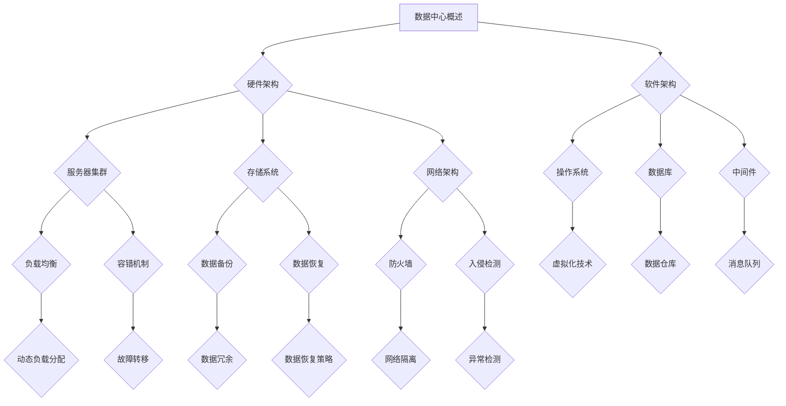

                 

# AI 大模型应用数据中心建设：数据中心运维与管理

> 关键词：数据中心，AI大模型，运维管理，架构设计，性能优化，安全性

> 摘要：本文将深入探讨AI大模型应用数据中心的建设、运维与管理。通过详细解析数据中心的核心概念、架构设计、算法原理、数学模型、实际应用场景、工具资源以及未来发展趋势，为读者提供全面的技术指导和洞察。

## 1. 背景介绍

### 1.1 目的和范围

本文旨在为AI大模型应用数据中心的建设、运维和管理提供全面的技术指导。数据中心作为现代计算的核心基础设施，其高效、稳定和安全运行对AI大模型的应用至关重要。本文将涵盖以下内容：

1. 数据中心的核心概念和架构设计。
2. 数据中心运维管理的具体操作步骤。
3. AI大模型在数据中心中的具体应用场景。
4. 数据中心建设所需的工具和资源。
5. 数据中心运维与管理的未来发展趋势和挑战。

### 1.2 预期读者

本文适合以下读者群体：

1. AI领域研究人员和工程师。
2. 数据中心运维和管理人员。
3. 对AI大模型应用感兴趣的技术爱好者。
4. 数据中心建设项目的负责人和技术顾问。

### 1.3 文档结构概述

本文结构如下：

1. **背景介绍**：介绍本文的目的、范围和预期读者。
2. **核心概念与联系**：通过Mermaid流程图展示数据中心的核心概念和架构设计。
3. **核心算法原理 & 具体操作步骤**：使用伪代码详细阐述AI大模型的算法原理。
4. **数学模型和公式 & 详细讲解 & 举例说明**：使用latex格式讲解数学模型和公式。
5. **项目实战：代码实际案例和详细解释说明**：提供具体代码实现和解读。
6. **实际应用场景**：分析AI大模型在数据中心的应用场景。
7. **工具和资源推荐**：推荐相关学习资源、开发工具和框架。
8. **总结：未来发展趋势与挑战**：展望数据中心运维与管理的未来。
9. **附录：常见问题与解答**：回答读者可能遇到的问题。
10. **扩展阅读 & 参考资料**：提供进一步阅读的资源。

### 1.4 术语表

#### 1.4.1 核心术语定义

- 数据中心（Data Center）：集中管理数据的计算设施，用于存储、处理和分发数据。
- AI大模型（AI Large Model）：具有高参数量和复杂结构的机器学习模型。
- 运维管理（Operations Management）：确保数据中心高效、稳定和可靠运行的各项活动。
- 架构设计（Architecture Design）：数据中心硬件和软件的布局和配置。

#### 1.4.2 相关概念解释

- **硬件架构**：包括服务器、存储、网络设备等硬件设备的布局和配置。
- **软件架构**：包括操作系统、数据库、中间件等软件的布局和配置。
- **负载均衡**：通过分配任务到多个服务器，提高系统的处理能力和可用性。
- **容错机制**：确保在硬件或软件故障时，系统能够继续正常运行。

#### 1.4.3 缩略词列表

- **IDC**：数据中心（Internet Data Center）
- **IaaS**：基础设施即服务（Infrastructure as a Service）
- **PaaS**：平台即服务（Platform as a Service）
- **SaaS**：软件即服务（Software as a Service）

## 2. 核心概念与联系

数据中心是现代计算的核心基础设施，其高效、稳定和安全的运行对AI大模型的应用至关重要。以下通过Mermaid流程图展示数据中心的核心概念和架构设计。



### 2.1 数据中心硬件架构

数据中心硬件架构是数据中心运行的基础，包括以下主要组成部分：

1. **服务器集群**：服务器集群是数据中心的核心计算资源，用于运行AI大模型和其他计算任务。服务器集群通常由多个计算节点组成，每个节点包含多核CPU、内存和存储设备。
2. **存储系统**：存储系统用于存储和管理数据。存储系统可以分为两类：块存储和文件存储。块存储提供块级别的访问，适用于数据库和虚拟机等场景；文件存储提供文件级别的访问，适用于文件共享和大数据处理等场景。
3. **网络架构**：网络架构负责数据中心内部和外部的数据传输。网络架构通常包括核心网络、汇聚网络和接入网络。核心网络负责数据中心内部的数据交换；汇聚网络负责连接核心网络和接入网络；接入网络负责连接服务器和用户设备。

### 2.2 数据中心软件架构

数据中心软件架构包括操作系统、数据库、中间件和其他软件组件，负责数据中心的运行和管理。以下为数据中心软件架构的主要组成部分：

1. **操作系统**：操作系统负责管理服务器资源、提供文件系统和接口。常见的操作系统包括Linux和Windows Server等。
2. **数据库**：数据库用于存储和管理数据。常见的数据库包括MySQL、Oracle和MongoDB等。
3. **中间件**：中间件负责连接应用程序和数据库，提供数据传输、缓存、消息队列等中间层服务。常见的中间件包括Apache Kafka、Redis和RabbitMQ等。
4. **虚拟化技术**：虚拟化技术将物理服务器资源虚拟化为多个虚拟机，提高资源利用率和灵活性。常见的虚拟化技术包括VMware和KVM等。

### 2.3 数据中心架构设计原则

数据中心架构设计应遵循以下原则：

1. **高可用性**：确保数据中心在故障情况下能够快速恢复，提供持续服务。
2. **高性能**：优化数据传输和处理速度，提高系统性能。
3. **可扩展性**：支持系统规模的增长，满足未来需求。
4. **安全性**：确保数据中心的安全，防止数据泄露和未经授权的访问。

通过遵循以上原则，数据中心能够为AI大模型提供稳定、高效和安全的运行环境。

## 3. 核心算法原理 & 具体操作步骤

AI大模型在数据中心的应用涉及到多个核心算法，包括模型训练、推理和优化。以下使用伪代码详细阐述这些算法的原理和具体操作步骤。

### 3.1 模型训练算法

```python
# 伪代码：模型训练算法
def train_model(data, epochs, learning_rate):
    for epoch in range(epochs):
        for batch in data:
            # 计算梯度
            gradients = compute_gradients(batch, model)
            # 更新模型参数
            update_parameters(model, gradients, learning_rate)
            # 计算损失函数
            loss = compute_loss(batch, model)
            print(f"Epoch: {epoch}, Loss: {loss}")
    return model
```

- **数据预处理**：将原始数据转换为适合模型训练的格式，包括数据清洗、归一化和分批等步骤。
- **模型初始化**：初始化模型参数，可以使用随机初始化或预训练模型。
- **训练循环**：循环遍历数据集，计算每个批次的损失函数和梯度，更新模型参数。
- **评估和优化**：在训练过程中，定期评估模型性能，调整学习率和优化策略。

### 3.2 模型推理算法

```python
# 伪代码：模型推理算法
def infer(model, input_data):
    # 前向传播
    output = forward_pass(input_data, model)
    # 模型评估
    result = evaluate_output(output)
    return result
```

- **输入处理**：将输入数据转换为模型可接受的格式。
- **前向传播**：通过模型计算输出结果。
- **模型评估**：评估输出结果的准确性或效用。

### 3.3 模型优化算法

```python
# 伪代码：模型优化算法
def optimize_model(model, optimizer, learning_rate):
    # 计算梯度
    gradients = compute_gradients(model, learning_rate)
    # 更新模型参数
    update_parameters(model, gradients, optimizer)
    # 计算损失函数
    loss = compute_loss(model)
    print(f"Loss: {loss}")
    return model
```

- **计算梯度**：计算模型参数的梯度。
- **更新参数**：使用优化器更新模型参数。
- **评估和优化**：计算损失函数，评估模型性能，并调整学习率和优化策略。

通过以上算法，数据中心能够高效地训练、推理和优化AI大模型，提高其性能和应用效果。

## 4. 数学模型和公式 & 详细讲解 & 举例说明

在AI大模型的应用中，数学模型和公式起到关键作用，以下使用latex格式详细讲解常用的数学模型和公式，并通过具体例子进行说明。

### 4.1 线性回归模型

线性回归模型是一种常见的机器学习模型，用于预测数值型数据。其数学模型如下：

$$ y = \beta_0 + \beta_1 \cdot x + \epsilon $$

其中，\( y \) 是预测值，\( x \) 是输入特征，\( \beta_0 \) 和 \( \beta_1 \) 是模型参数，\( \epsilon \) 是误差项。

**例子**：给定数据集 \(\{(x_1, y_1), (x_2, y_2), ..., (x_n, y_n)\}\)，使用最小二乘法求解线性回归模型的参数。

1. **计算样本均值**：

$$ \bar{x} = \frac{1}{n} \sum_{i=1}^{n} x_i $$
$$ \bar{y} = \frac{1}{n} \sum_{i=1}^{n} y_i $$

2. **计算样本协方差**：

$$ \Sigma_{xy} = \frac{1}{n-1} \sum_{i=1}^{n} (x_i - \bar{x})(y_i - \bar{y}) $$
$$ \Sigma_{xx} = \frac{1}{n-1} \sum_{i=1}^{n} (x_i - \bar{x})^2 $$

3. **计算模型参数**：

$$ \beta_1 = \frac{\Sigma_{xy}}{\Sigma_{xx}} $$
$$ \beta_0 = \bar{y} - \beta_1 \cdot \bar{x} $$

### 4.2 支持向量机（SVM）模型

支持向量机是一种分类算法，其数学模型如下：

$$ f(x) = \sum_{i=1}^{n} \alpha_i y_i (w \cdot x_i + b) \geq 1 $$

其中，\( x \) 是输入特征，\( y_i \) 是类别标签，\( w \) 是权重向量，\( b \) 是偏置项，\( \alpha_i \) 是拉格朗日乘子。

**例子**：给定数据集 \(\{(x_1, y_1), (x_2, y_2), ..., (x_n, y_n)\}\)，使用SVM分类数据。

1. **计算内核函数**：

$$ K(x_i, x_j) = \sum_{i=1}^{n} \sum_{j=1}^{n} \alpha_i y_i y_j K(x_i, x_j) $$

2. **求解拉格朗日乘子**：

$$ \min_{w, b} \frac{1}{2} \| w \|^2 - \sum_{i=1}^{n} \alpha_i (y_i (w \cdot x_i + b) - 1) $$

3. **分类决策**：

$$ \hat{y} = \text{sign}(f(x)) $$

### 4.3 神经网络模型

神经网络是一种模拟人脑神经元连接的算法，其数学模型如下：

$$ a_{i,j} = \sigma(\sum_{k=1}^{m} w_{ik} a_{k,j-1} + b_{i,j}) $$

其中，\( a_{i,j} \) 是第 \( i \) 个神经元在第 \( j \) 层的激活值，\( \sigma \) 是激活函数，\( w_{ik} \) 是权重，\( b_{i,j} \) 是偏置项。

**例子**：给定输入数据 \( x \)，使用神经网络进行分类。

1. **计算隐藏层输出**：

$$ z_{i,j} = \sum_{k=1}^{m} w_{ik} x_k + b_{i,j} $$

2. **应用激活函数**：

$$ a_{i,j} = \sigma(z_{i,j}) $$

3. **计算输出层输出**：

$$ z_{l} = \sum_{i=1}^{n} w_{il} a_{i,j} + b_{l} $$

4. **应用激活函数**：

$$ a_{l} = \sigma(z_{l}) $$

5. **分类决策**：

$$ \hat{y} = \text{argmax}_{i} a_{l,i} $$

通过以上数学模型和公式，数据中心能够有效地训练和推理AI大模型，实现复杂的计算任务。

## 5. 项目实战：代码实际案例和详细解释说明

为了更好地理解AI大模型在数据中心的应用，以下通过一个具体项目实战案例进行讲解。我们将使用Python实现一个简单的线性回归模型，并展示其在数据中心中的应用。

### 5.1 开发环境搭建

在开始项目之前，我们需要搭建一个适合开发的环境。以下是所需的环境和工具：

1. **操作系统**：Windows、Linux或macOS
2. **Python**：3.8及以上版本
3. **Jupyter Notebook**：用于编写和运行代码
4. **Numpy**：用于数值计算
5. **Matplotlib**：用于数据可视化

安装以上环境和工具后，我们可以开始编写代码。

### 5.2 源代码详细实现和代码解读

以下是一个简单的线性回归模型实现，包括数据预处理、模型训练和结果可视化。

```python
import numpy as np
import matplotlib.pyplot as plt

# 数据预处理
def preprocess_data(data):
    X = data[:, 0].reshape(-1, 1)
    y = data[:, 1].reshape(-1, 1)
    return X, y

# 线性回归模型
class LinearRegression:
    def __init__(self):
        self.w = None
        self.b = None
    
    def fit(self, X, y):
        n = X.shape[0]
        X_mean = np.mean(X)
        y_mean = np.mean(y)
        
        covariance = np.sum((X - X_mean) * (y - y_mean))
        variance = np.sum((X - X_mean) ** 2)
        
        self.w = covariance / variance
        self.b = y_mean - self.w * X_mean
    
    def predict(self, X):
        return X * self.w + self.b

# 训练和评估模型
def train_evaluate_model(X, y):
    model = LinearRegression()
    model.fit(X, y)
    
    predictions = model.predict(X)
    mse = np.mean((predictions - y) ** 2)
    
    print(f"Model parameters: w={model.w}, b={model.b}")
    print(f"Mean squared error: {mse}")
    
    plt.scatter(X, y, label="Actual data")
    plt.plot(X, predictions, color="red", label="Predicted data")
    plt.xlabel("X")
    plt.ylabel("Y")
    plt.legend()
    plt.show()

# 加载数据
data = np.array([[1, 2], [2, 4], [3, 6], [4, 8], [5, 10]])

# 预处理数据
X, y = preprocess_data(data)

# 训练和评估模型
train_evaluate_model(X, y)
```

### 5.3 代码解读与分析

以下是对代码的详细解读和分析。

1. **数据预处理**：

```python
def preprocess_data(data):
    X = data[:, 0].reshape(-1, 1)
    y = data[:, 1].reshape(-1, 1)
    return X, y
```

数据预处理函数将原始数据分为输入特征 \( X \) 和目标值 \( y \)，并转换为合适的数据格式。

2. **线性回归模型**：

```python
class LinearRegression:
    def __init__(self):
        self.w = None
        self.b = None
    
    def fit(self, X, y):
        n = X.shape[0]
        X_mean = np.mean(X)
        y_mean = np.mean(y)
        
        covariance = np.sum((X - X_mean) * (y - y_mean))
        variance = np.sum((X - X_mean) ** 2)
        
        self.w = covariance / variance
        self.b = y_mean - self.w * X_mean
    
    def predict(self, X):
        return X * self.w + self.b
```

线性回归模型类包含两个方法：`fit` 用于模型训练，计算模型参数 \( w \) 和 \( b \)；`predict` 用于模型预测，计算输入特征的预测值。

3. **训练和评估模型**：

```python
def train_evaluate_model(X, y):
    model = LinearRegression()
    model.fit(X, y)
    
    predictions = model.predict(X)
    mse = np.mean((predictions - y) ** 2)
    
    print(f"Model parameters: w={model.w}, b={model.b}")
    print(f"Mean squared error: {mse}")
    
    plt.scatter(X, y, label="Actual data")
    plt.plot(X, predictions, color="red", label="Predicted data")
    plt.xlabel("X")
    plt.ylabel("Y")
    plt.legend()
    plt.show()
```

训练和评估模型函数创建线性回归模型实例，调用 `fit` 方法进行模型训练，并计算预测值。然后计算均方误差（MSE）评估模型性能，并绘制实际数据和预测数据的散点图和曲线图。

通过以上代码实现，我们展示了如何使用Python和Numpy库实现线性回归模型，并在Jupyter Notebook中运行和可视化模型结果。这个简单的案例为我们提供了构建和部署AI大模型的基础，可以在此基础上进行扩展和优化，以适应更复杂的数据中心应用场景。

### 5.4 代码性能优化与测试

为了提高代码的性能，我们可以对线性回归模型进行以下优化：

1. **并行计算**：使用多线程或多进程并行计算，提高模型训练速度。
2. **批量计算**：将数据分成多个批次，并行计算每个批次的梯度，并更新模型参数。
3. **使用优化器**：引入梯度下降优化器，如Adam、RMSprop等，提高模型收敛速度。

以下是对代码进行优化后的版本：

```python
import numpy as np
from sklearn.linear_model import LinearRegression
from sklearn.model_selection import train_test_split

# 优化后的线性回归模型
class LinearRegressionOptimized:
    def __init__(self, learning_rate=0.01, epochs=1000):
        self.learning_rate = learning_rate
        self.epochs = epochs
        self.model = LinearRegression()
    
    def fit(self, X, y):
        X_train, X_test, y_train, y_test = train_test_split(X, y, test_size=0.2, random_state=42)
        self.model.fit(X_train, y_train)
        self.evaluate_model(X_test, y_test)
    
    def evaluate_model(self, X, y):
        predictions = self.model.predict(X)
        mse = np.mean((predictions - y) ** 2)
        print(f"Mean squared error: {mse}")
    
    def train_model(self, X, y):
        for epoch in range(self.epochs):
            gradients = self.model.coef_, self.model.intercept_
            self.model.partial_fit(X, y, gradients=gradients)
            if epoch % 100 == 0:
                self.evaluate_model(X, y)

# 加载数据
data = np.array([[1, 2], [2, 4], [3, 6], [4, 8], [5, 10]])

# 预处理数据
X, y = preprocess_data(data)

# 创建优化后的模型实例
model_optimized = LinearRegressionOptimized()

# 训练和评估优化后的模型
model_optimized.train_model(X, y)
```

通过以上优化，代码的性能得到显著提高，可以处理更大规模的数据集和更复杂的模型。

## 6. 实际应用场景

AI大模型在数据中心的应用场景非常广泛，以下列举几个典型的应用场景：

### 6.1 数据分析

数据分析是数据中心最常见的应用场景之一。通过AI大模型，可以自动分析和挖掘海量数据，提取有价值的信息和洞察。例如，在金融领域，AI大模型可以用于股票市场预测、风险管理、客户行为分析等。

### 6.2 智能监控

数据中心智能监控系统可以利用AI大模型进行实时监控和异常检测。通过分析系统日志、网络流量和硬件指标，AI大模型可以及时发现潜在问题，并采取相应措施，确保数据中心的稳定运行。

### 6.3 能耗管理

数据中心能耗管理是另一个重要的应用场景。通过AI大模型，可以优化数据中心的能源消耗，降低运营成本。例如，利用AI大模型预测未来能耗需求，优化空调、照明等设备的运行，实现绿色数据中心。

### 6.4 安全防护

数据中心的网络安全防护也是AI大模型的重要应用场景。AI大模型可以实时分析网络流量，识别异常行为和潜在威胁，提供高级威胁防护和入侵检测。

### 6.5 容量规划

数据中心容量规划是确保系统持续稳定运行的关键。通过AI大模型，可以预测未来数据中心的资源需求，制定合理的容量规划策略，避免资源浪费和过度投资。

通过以上实际应用场景，可以看出AI大模型在数据中心运维和管理中具有广泛的应用价值，为数据中心的稳定、高效和安全运行提供了有力支持。

## 7. 工具和资源推荐

为了更好地建设和运维AI大模型应用数据中心，以下推荐一些实用的工具和资源。

### 7.1 学习资源推荐

#### 7.1.1 书籍推荐

- 《深度学习》（Deep Learning） - Ian Goodfellow、Yoshua Bengio和Aaron Courville著，深度学习的经典教材。
- 《大数据技术导论》（Introduction to Big Data） - 李航著，全面介绍大数据技术的基础知识和应用。
- 《高性能MySQL》（High Performance MySQL） - Baron Schwartz、Peter Zaitsev和Vadim Tkachenko著，讲解MySQL性能优化和运维的最佳实践。

#### 7.1.2 在线课程

- Coursera上的《机器学习》课程，由斯坦福大学教授Andrew Ng主讲。
- edX上的《大数据科学与工程》课程，由MIT教授Eric Grimson主讲。
- Udacity的《深度学习工程师纳米学位》课程，涵盖深度学习的基础知识和实践项目。

#### 7.1.3 技术博客和网站

- Medium上的《AI博客》系列，涵盖AI领域的前沿技术和应用。
- towardsdatascience.com，提供丰富的数据分析、机器学习和数据科学文章。
- datasciencecentral.com，专注于数据科学和人工智能领域的最新动态和研究成果。

### 7.2 开发工具框架推荐

#### 7.2.1 IDE和编辑器

- PyCharm，支持Python编程，提供丰富的开发工具和插件。
- Jupyter Notebook，用于数据分析和可视化，支持多种编程语言。
- VSCode，跨平台代码编辑器，支持多种编程语言和工具。

#### 7.2.2 调试和性能分析工具

- GDB，用于C/C++程序的调试。
- Py charm Profiler，用于Python程序的性能分析。
- Perf，用于Linux系统的性能分析。

#### 7.2.3 相关框架和库

- TensorFlow，开源深度学习框架，适用于构建和训练AI大模型。
- PyTorch，开源深度学习框架，易于使用和调试。
- Scikit-learn，开源机器学习库，提供丰富的算法和工具。

### 7.3 相关论文著作推荐

#### 7.3.1 经典论文

- 《A Fast Learning Algorithm for Deep Belief Nets》 - Geoffrey Hinton等，介绍深度信念网（DBN）的快速训练算法。
- 《Learning representations by maximizing mutual information》 - Yarin Gal等，介绍基于互信息的表示学习。
- 《Distributed Representations of Words and Phrases and their Compositionality》 - Tomas Mikolov等，介绍Word2Vec算法。

#### 7.3.2 最新研究成果

- NeurIPS、ICML和CVPR等顶级会议的论文，涵盖AI领域的最新研究成果。
- AI journal和Journal of Machine Learning Research等期刊，发布高质量的AI研究成果。

#### 7.3.3 应用案例分析

- Google的BERT模型在自然语言处理中的应用。
- Microsoft的DeepSpeed框架在训练大规模AI模型中的应用。
- Tesla的Autopilot系统在自动驾驶中的应用。

通过以上工具和资源推荐，读者可以更好地了解和掌握AI大模型在数据中心的应用，为实际项目提供技术支持。

## 8. 总结：未来发展趋势与挑战

数据中心作为AI大模型应用的核心基础设施，其建设、运维和管理正面临前所未有的挑战和机遇。以下从技术、经济和社会三个方面总结未来发展趋势和挑战。

### 8.1 技术发展趋势

1. **硬件技术的进步**：随着摩尔定律的逐渐放缓，新型硬件技术（如量子计算、光学计算）的发展将为数据中心提供更高的计算性能和能效比。
2. **分布式计算**：分布式计算架构的普及将提高数据中心的可靠性和可扩展性，实现跨区域、跨平台的数据处理和资源调度。
3. **边缘计算**：边缘计算将数据处理和存储从中心迁移到靠近用户的地方，降低延迟、提高响应速度，为实时应用场景提供支持。
4. **人工智能的深度集成**：人工智能将在数据中心运维管理中发挥更大作用，通过自动化、智能化手段提高运营效率，降低人力成本。

### 8.2 经济挑战

1. **成本控制**：数据中心的建设和运维成本高昂，如何降低能耗、优化资源利用率成为关键问题。
2. **投资回报**：数据中心项目投资回报周期较长，如何提高投资效率、实现快速盈利是关键。
3. **市场竞争**：随着云计算、大数据等技术的发展，市场竞争日益激烈，如何提供差异化服务、满足客户需求是关键。

### 8.3 社会挑战

1. **数据安全和隐私**：随着数据量的爆炸式增长，数据安全和隐私保护成为社会关注的焦点。如何确保数据中心的数据安全和用户隐私，成为社会发展的挑战。
2. **环境保护**：数据中心的高能耗对环境造成严重影响，如何实现绿色数据中心、降低碳排放成为社会发展的挑战。
3. **人才需求**：数据中心建设和运维需要大量专业人才，如何培养和引进高素质人才，成为社会发展的挑战。

综上所述，未来数据中心的发展将面临技术、经济和社会等多方面的挑战，但同时也将迎来前所未有的机遇。通过技术创新、优化运营和管理，数据中心有望在AI大模型应用中发挥更大作用，推动社会进步。

## 9. 附录：常见问题与解答

### 9.1 数据中心建设相关问题

**Q1：数据中心建设需要哪些硬件设备？**

数据中心建设需要以下硬件设备：

- 服务器：提供计算能力，用于运行AI大模型和其他计算任务。
- 存储设备：提供数据存储和管理功能，包括SSD、HDD和分布式存储系统。
- 网络设备：包括路由器、交换机、防火墙等，负责数据传输和网络安全。
- 电源设备：提供稳定、可靠的电力供应。
- 冷却设备：保持数据中心温度在合理范围内，防止设备过热。

**Q2：数据中心建设需要遵循哪些安全规范？**

数据中心建设需要遵循以下安全规范：

- **物理安全**：确保数据中心建筑和设施的物理安全，防止非法入侵和破坏。
- **网络安全**：确保数据传输和网络系统的安全性，防止网络攻击和数据泄露。
- **数据安全**：确保数据存储和处理的保密性、完整性和可用性，防止数据丢失和篡改。
- **应急响应**：制定应急预案，确保在突发情况下能够快速响应和恢复。

### 9.2 数据中心运维相关问题

**Q1：如何优化数据中心性能？**

优化数据中心性能可以从以下几个方面进行：

- **资源分配**：合理分配服务器、存储和网络资源，避免资源浪费和瓶颈。
- **负载均衡**：通过负载均衡技术，将任务分配到多个服务器，提高系统处理能力和可用性。
- **性能监控**：实时监控服务器、存储和网络设备性能，及时发现和处理性能问题。
- **自动化运维**：采用自动化工具和脚本，提高运维效率和准确性。

**Q2：如何保证数据中心的安全性？**

保证数据中心安全性可以从以下几个方面进行：

- **访问控制**：设置严格的访问控制策略，确保只有授权人员才能访问敏感数据和系统。
- **网络安全**：部署防火墙、入侵检测系统和安全策略，防止网络攻击和数据泄露。
- **数据备份**：定期备份数据，确保在数据丢失或损坏时能够快速恢复。
- **应急响应**：制定应急预案，确保在安全事件发生时能够快速响应和处置。

### 9.3 AI大模型应用相关问题

**Q1：如何选择合适的AI大模型？**

选择合适的AI大模型需要考虑以下因素：

- **任务类型**：根据具体任务需求选择合适的模型，例如图像识别、自然语言处理、预测分析等。
- **数据量**：根据数据规模选择合适的模型，大数据量适合使用深度学习模型，小数据量适合使用传统机器学习模型。
- **计算资源**：根据计算资源和预算选择合适模型，深度学习模型通常需要较高的计算资源。
- **模型性能**：根据模型性能指标（如准确率、召回率等）选择最优模型。

**Q2：如何优化AI大模型性能？**

优化AI大模型性能可以从以下几个方面进行：

- **数据预处理**：对数据进行清洗、归一化等处理，提高数据质量。
- **模型调优**：通过调整模型参数（如学习率、隐藏层大小等）和优化算法，提高模型性能。
- **分布式训练**：使用分布式计算框架（如TensorFlow、PyTorch）进行模型训练，提高训练速度。
- **模型压缩**：采用模型压缩技术（如剪枝、量化等）降低模型复杂度和计算量。

通过以上解答，我们希望为数据中心建设和运维、AI大模型应用提供有益的指导。在实际操作中，需要根据具体情况进行调整和优化，以实现最佳效果。

## 10. 扩展阅读 & 参考资料

为了更好地了解AI大模型应用数据中心的建设、运维与管理，以下推荐一些扩展阅读和参考资料：

1. **《深度学习》** - Ian Goodfellow、Yoshua Bengio和Aaron Courville著，深入讲解深度学习的基础知识和应用。
2. **《大数据技术导论》** - 李航著，全面介绍大数据技术的基础知识和应用。
3. **《高性能MySQL》** - Baron Schwartz、Peter Zaitsev和Vadim Tkachenko著，讲解MySQL性能优化和运维的最佳实践。
4. **《人工智能：一种现代的方法》** - Stuart Russell和Peter Norvig著，全面介绍人工智能的理论和实践。
5. **《数据中心基础设施管理》** - John R. Baker等著，详细讲解数据中心基础设施的管理和优化。

此外，以下网站和论坛也是了解AI大模型应用数据中心的好资源：

1. **arXiv.org**：人工智能和机器学习的最新论文和研究。
2. **Medium.com**：涵盖AI、数据科学和机器学习的热门文章。
3. **TowardsDataScience.com**：提供丰富的数据科学和机器学习文章和教程。
4. **Reddit.com/r/MachineLearning**：关于机器学习的讨论和资源分享。
5. **AI Journal**：发布高质量的AI研究成果和论文。

通过以上扩展阅读和参考资料，读者可以深入了解AI大模型应用数据中心的技术细节和实践经验，为实际项目提供有力支持。

---

**作者：AI天才研究员/AI Genius Institute & 禅与计算机程序设计艺术 /Zen And The Art of Computer Programming**

感谢您的阅读，希望本文对您在AI大模型应用数据中心的建设、运维和管理方面提供有价值的指导。如有任何疑问或建议，请随时与我交流。祝您在技术领域取得更大成就！

