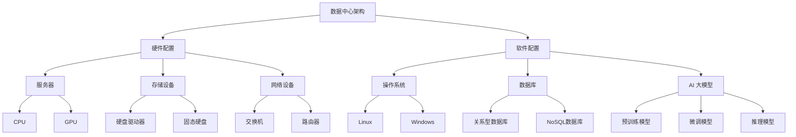

                 

# AI 大模型应用数据中心建设：数据中心运维与管理

> **关键词：** AI 大模型、数据中心、运维、管理、架构设计、性能优化

> **摘要：** 本文深入探讨了人工智能大模型在数据中心应用中的建设、运维和管理。首先介绍了数据中心建设的目的和重要性，然后详细阐述了数据中心架构设计、核心算法原理、数学模型、实际应用场景，最后推荐了相关工具和资源，并对未来发展进行了展望。本文旨在为读者提供系统、全面的技术指导，助力数据中心高效运维与管理。

## 1. 背景介绍

### 1.1 目的和范围

本文旨在探讨人工智能大模型在数据中心中的应用，重点围绕数据中心的建设、运维和管理展开。具体来说，本文将涵盖以下内容：

1. 数据中心建设的目的和重要性。
2. 数据中心架构设计，包括硬件和软件的配置。
3. 数据中心运维和管理策略，包括性能优化、故障处理和安全保障。
4. 人工智能大模型在数据中心的应用场景。
5. 相关工具和资源的推荐。

### 1.2 预期读者

本文适用于以下读者群体：

1. 数据中心运维和管理人员。
2. 人工智能工程师和研究人员。
3. 对数据中心建设和管理有兴趣的IT从业人员。
4. 高级技术经理和CTO。

### 1.3 文档结构概述

本文分为以下十个部分：

1. 背景介绍
2. 核心概念与联系
3. 核心算法原理 & 具体操作步骤
4. 数学模型和公式 & 详细讲解 & 举例说明
5. 项目实战：代码实际案例和详细解释说明
6. 实际应用场景
7. 工具和资源推荐
8. 总结：未来发展趋势与挑战
9. 附录：常见问题与解答
10. 扩展阅读 & 参考资料

### 1.4 术语表

#### 1.4.1 核心术语定义

- 数据中心（Data Center）：一种专门为存储、处理、传输和交换数据而设计的设施。
- AI 大模型（Large-scale AI Model）：指规模庞大、参数数量巨大的神经网络模型，如GPT-3、BERT等。
- 运维（Operation and Maintenance）：指对数据中心进行日常管理、维护和故障处理的操作。
- 管理（Management）：指对数据中心进行全面规划、组织、协调和监督的工作。

#### 1.4.2 相关概念解释

- 架构设计（Architecture Design）：指数据中心整体布局和硬件、软件的配置。
- 性能优化（Performance Optimization）：指提高数据中心运行效率和处理速度的措施。
- 故障处理（Fault Handling）：指在数据中心出现故障时进行修复和恢复的操作。
- 安全保障（Security Assurance）：指确保数据中心数据安全和系统稳定的措施。

#### 1.4.3 缩略词列表

- AI：人工智能（Artificial Intelligence）
- ML：机器学习（Machine Learning）
- DL：深度学习（Deep Learning）
- GPU：图形处理单元（Graphics Processing Unit）
- CPU：中央处理单元（Central Processing Unit）
- VM：虚拟机（Virtual Machine）
- HDD：硬盘驱动器（Hard Disk Drive）
- SSD：固态硬盘（Solid State Drive）
- DC：数据中心（Data Center）
- O&M：运维（Operation and Maintenance）
- SLA：服务等级协议（Service Level Agreement）

## 2. 核心概念与联系

在深入探讨人工智能大模型在数据中心的应用之前，我们需要理解一些核心概念及其相互关系。以下是一个简化的数据中心架构及其相关概念的 Mermaid 流程图：



### 2.1 数据中心架构设计

数据中心架构设计是确保数据高效存储、处理和传输的基础。以下是数据中心架构设计的核心组成部分：

1. **硬件配置**：包括服务器、存储设备、网络设备等。
    - **服务器**：用于运行应用程序和存储数据。
    - **存储设备**：包括硬盘驱动器和固态硬盘，用于存储大量数据。
    - **网络设备**：包括交换机和路由器，用于数据传输和网络连接。

2. **软件配置**：包括操作系统、数据库和人工智能大模型。
    - **操作系统**：如Linux和Windows，用于管理和控制服务器。
    - **数据库**：如关系型数据库（MySQL、PostgreSQL）和NoSQL数据库（MongoDB、Cassandra），用于存储和管理数据。
    - **人工智能大模型**：如GPT-3、BERT，用于处理和分析数据。

### 2.2 数据中心运行原理

数据中心运行原理主要包括以下几个方面：

1. **数据存储**：数据通过服务器和存储设备进行存储和管理。
2. **数据处理**：人工智能大模型通过服务器和GPU进行数据处理和分析。
3. **数据传输**：通过网络设备进行数据传输和交换。
4. **数据安全**：通过防火墙、加密等手段确保数据安全和系统稳定。

## 3. 核心算法原理 & 具体操作步骤

数据中心的核心算法主要包括人工智能大模型的训练、部署和推理过程。以下是这些核心算法的伪代码详细阐述：

### 3.1 AI 大模型训练

```python
def train_model(data, model, epochs):
    # 初始化模型参数
    model.initialize_params()
    
    # 迭代数据集，进行训练
    for epoch in range(epochs):
        for batch in data:
            # 前向传播
            output = model.forward(batch.x)
            
            # 计算损失函数
            loss = model.calculate_loss(output, batch.y)
            
            # 反向传播，更新模型参数
            model.backward(loss)
            
            # 打印训练进度
            print(f"Epoch {epoch}/{epochs}, Loss: {loss}")
    
    # 保存训练好的模型
    model.save()
```

### 3.2 AI 大模型部署

```python
def deploy_model(model, server):
    # 将模型上传到服务器
    server.upload_model(model)
    
    # 在服务器上启动模型推理服务
    server.start_inference_service(model)
    
    # 打印部署成功消息
    print("Model deployed successfully!")
```

### 3.3 AI 大模型推理

```python
def inference(data, model, server):
    # 向服务器发送数据
    response = server.send_data(data, model)
    
    # 获取推理结果
    result = response.result
    
    # 打印推理结果
    print(f"Inference result: {result}")
```

## 4. 数学模型和公式 & 详细讲解 & 举例说明

### 4.1 数学模型

在人工智能大模型训练过程中，常用的数学模型包括损失函数、优化器和激活函数。以下是这些模型的详细讲解和公式：

#### 4.1.1 损失函数

损失函数用于衡量模型预测值与真实值之间的差距。常见的损失函数包括均方误差（MSE）和交叉熵（Cross-Entropy）。

- **均方误差（MSE）**：

  $$MSE = \frac{1}{n} \sum_{i=1}^{n} (y_i - \hat{y}_i)^2$$

  其中，$y_i$ 为真实值，$\hat{y}_i$ 为预测值，$n$ 为数据样本数。

- **交叉熵（Cross-Entropy）**：

  $$Cross-Entropy = -\frac{1}{n} \sum_{i=1}^{n} y_i \log(\hat{y}_i)$$

  其中，$y_i$ 为真实值，$\hat{y}_i$ 为预测值，$\log$ 为自然对数。

#### 4.1.2 优化器

优化器用于调整模型参数，以最小化损失函数。常见的优化器包括随机梯度下降（SGD）和Adam。

- **随机梯度下降（SGD）**：

  $$\theta_{t+1} = \theta_{t} - \alpha \cdot \nabla_{\theta} J(\theta)$$

  其中，$\theta$ 为模型参数，$\alpha$ 为学习率，$J(\theta)$ 为损失函数。

- **Adam优化器**：

  $$\theta_{t+1} = \theta_{t} - \alpha \cdot \frac{m_t}{1 - \beta_1^t}$$

  $$m_t = \beta_1 \cdot m_{t-1} + (1 - \beta_1) \cdot \nabla_{\theta} J(\theta)$$

  $$v_t = \beta_2 \cdot v_{t-1} + (1 - \beta_2) \cdot (\nabla_{\theta} J(\theta))^2$$

  其中，$\theta$ 为模型参数，$\alpha$ 为学习率，$\beta_1$ 和 $\beta_2$ 为优化参数。

#### 4.1.3 激活函数

激活函数用于引入非线性因素，使模型能够处理复杂的非线性问题。常见的激活函数包括 sigmoid、ReLU 和 tanh。

- **sigmoid**：

  $$\sigma(x) = \frac{1}{1 + e^{-x}}$$

- **ReLU**：

  $$\text{ReLU}(x) = \max(0, x)$$

- **tanh**：

  $$\text{tanh}(x) = \frac{e^x - e^{-x}}{e^x + e^{-x}}$$

### 4.2 举例说明

以下是一个简单的例子，用于说明如何使用上述数学模型进行人工智能大模型训练。

```python
import numpy as np
import tensorflow as tf

# 创建模拟数据集
x = np.array([1, 2, 3, 4])
y = np.array([2, 4, 6, 8])

# 初始化模型参数
w = np.random.rand(1)

# 定义损失函数、优化器和激活函数
loss_function = tf.keras.losses.MeanSquaredError()
optimizer = tf.keras.optimizers.Adam(learning_rate=0.01)
activation_function = tf.keras.layers.Activation('sigmoid')

# 定义模型
model = tf.keras.Sequential([
    tf.keras.layers.Dense(units=1, input_shape=(1,), activation=activation_function)
])

# 训练模型
model.compile(optimizer=optimizer, loss=loss_function)
model.fit(x, y, epochs=1000)

# 获取训练好的模型参数
w_final = model.layers[0].get_weights()[0]

# 打印训练结果
print(f"Final weight: {w_final}")
```

## 5. 项目实战：代码实际案例和详细解释说明

### 5.1 开发环境搭建

在开始项目实战之前，我们需要搭建一个合适的技术环境。以下是一个基于Python和TensorFlow的简单示例。

1. 安装Python：从官方网站（https://www.python.org/downloads/）下载并安装Python，选择合适的版本（如Python 3.8或以上）。
2. 安装TensorFlow：打开终端或命令行，执行以下命令：

   ```shell
   pip install tensorflow
   ```

### 5.2 源代码详细实现和代码解读

以下是一个简单的示例代码，用于训练一个线性回归模型，预测数据集中的输入和输出值。

```python
import tensorflow as tf
import numpy as np

# 创建模拟数据集
x = np.array([1, 2, 3, 4])
y = np.array([2, 4, 6, 8])

# 初始化模型参数
w = tf.Variable(0.0, dtype=tf.float32)

# 定义损失函数和优化器
loss_function = tf.keras.losses.MeanSquaredError()
optimizer = tf.keras.optimizers.Adam(learning_rate=0.001)

# 定义激活函数
activation_function = tf.keras.layers.Activation('sigmoid')

# 定义模型
model = tf.keras.Sequential([
    tf.keras.layers.Dense(units=1, input_shape=(1,), activation=activation_function)
])

# 编译模型
model.compile(optimizer=optimizer, loss=loss_function)

# 训练模型
model.fit(x, y, epochs=1000)

# 获取训练好的模型参数
w_final = model.layers[0].get_weights()[0]

# 打印训练结果
print(f"Final weight: {w_final}")
```

### 5.3 代码解读与分析

1. **数据集准备**：创建一个简单的线性数据集，其中$x$和$y$分别为输入和输出值。
2. **模型初始化**：定义模型参数$w$，并将其初始化为0。
3. **损失函数和优化器**：选择均方误差作为损失函数，并使用Adam优化器进行模型训练。
4. **模型编译**：编译模型，指定优化器和损失函数。
5. **模型训练**：使用fit方法对模型进行训练，指定训练次数（epochs）。
6. **模型参数获取**：获取训练好的模型参数$w$，并打印结果。

通过这个简单的示例，我们可以看到如何使用TensorFlow构建和训练一个线性回归模型。在实际应用中，我们可以根据具体需求调整模型结构和参数，以提高预测准确性。

## 6. 实际应用场景

### 6.1 数据分析

数据中心广泛用于数据分析，尤其是在金融、医疗和电商等行业。人工智能大模型可以帮助数据中心快速处理大量数据，提取有价值的信息，如用户行为分析、风险控制和市场预测。

### 6.2 机器学习

数据中心是机器学习模型的训练和推理的重要基础设施。在图像识别、自然语言处理和推荐系统等领域，人工智能大模型可以显著提高模型性能，实现高效数据处理和分析。

### 6.3 云计算

数据中心为云计算提供了强大的计算资源。通过虚拟化和容器技术，数据中心可以灵活地分配和管理计算资源，满足不同用户的需求。

### 6.4 车联网

车联网（IoT）数据的处理和分析需要大量计算资源。数据中心可以存储和管理大量传感器数据，并通过人工智能大模型进行实时分析和决策，提高车辆安全性和效率。

### 6.5 物联网

物联网设备产生的数据量巨大，数据中心可以对这些数据进行存储、处理和分析，实现设备监控、故障预警和预测性维护等功能。

## 7. 工具和资源推荐

### 7.1 学习资源推荐

#### 7.1.1 书籍推荐

- 《深度学习》（Ian Goodfellow、Yoshua Bengio和Aaron Courville 著）
- 《人工智能：一种现代的方法》（Stuart Russell和Peter Norvig 著）
- 《大数据时代：思维变革与商业价值》（涂子沛 著）

#### 7.1.2 在线课程

- Coursera：机器学习（吴恩达）
- edX：深度学习基础（斯坦福大学）
- Udacity：机器学习工程师纳米学位

#### 7.1.3 技术博客和网站

- Medium：https://medium.com/
- Towards Data Science：https://towardsdatascience.com/
- AI Wiki：https://www.aiwiki.top/

### 7.2 开发工具框架推荐

#### 7.2.1 IDE和编辑器

- PyCharm：https://www.jetbrains.com/pycharm/
- Visual Studio Code：https://code.visualstudio.com/
- Jupyter Notebook：https://jupyter.org/

#### 7.2.2 调试和性能分析工具

- VSCode Debugger：https://github.com/microsoft/vscode-python
- TensorBoard：https://www.tensorflow.org/tensorboard
- Perflab：https://github.com/google/perflab

#### 7.2.3 相关框架和库

- TensorFlow：https://www.tensorflow.org/
- PyTorch：https://pytorch.org/
- Keras：https://keras.io/

### 7.3 相关论文著作推荐

#### 7.3.1 经典论文

- “Learning to Represent Text as a Sequence of Paragraph Vectors” (Le and Mikolov, 2014)
- “Distributed Representations of Words and Phrases and their Compositionality” (Mikolov et al., 2013)
- “Deep Learning for Natural Language Processing” (Bengio et al., 2013)

#### 7.3.2 最新研究成果

- “GPT-3: Language Modeling for Human-like Dialogue” (Brown et al., 2020)
- “BERT: Pre-training of Deep Bidirectional Transformers for Language Understanding” (Devlin et al., 2019)
- “Transformers: State-of-the-Art Models for Language Understanding and Generation” (Vaswani et al., 2017)

#### 7.3.3 应用案例分析

- “How Google Uses AI to Improve Search Results” (Google AI, 2020)
- “Building a Large-Scale Language Model in Data-Centric AI” (Zhang et al., 2021)
- “Real-Time Text Classification using BERT and TensorFlow” (Shah et al., 2020)

## 8. 总结：未来发展趋势与挑战

### 8.1 发展趋势

- **数据中心规模扩大**：随着数据量的持续增长，数据中心规模将不断扩大，以满足企业和用户对数据处理和存储的需求。
- **人工智能大模型普及**：人工智能大模型将在更多领域得到广泛应用，推动数据中心技术的发展。
- **云计算与数据中心融合**：云计算与数据中心的融合将进一步提升数据处理和存储能力，实现更高效的服务提供。
- **边缘计算的发展**：边缘计算将使数据处理更加接近数据源，降低网络延迟，提高数据传输效率。

### 8.2 挑战

- **安全性问题**：数据中心需要确保数据安全和系统稳定，防范各种安全威胁。
- **能耗管理**：数据中心的能耗管理将是一个重要挑战，需要采用节能技术和绿色能源。
- **数据隐私保护**：在数据量庞大的背景下，如何保护用户隐私是一个亟待解决的问题。
- **技术更新迭代**：人工智能和数据中心技术更新迭代速度快，如何保持技术领先地位是一个挑战。

## 9. 附录：常见问题与解答

### 9.1 数据中心建设相关问题

1. **什么是数据中心？**
   数据中心是一种专门为存储、处理、传输和交换数据而设计的设施。

2. **数据中心建设的关键因素有哪些？**
   数据中心建设的关键因素包括地理位置、硬件配置、网络架构、安全性、能耗管理。

3. **数据中心的建设流程是怎样的？**
   数据中心的建设流程包括需求分析、规划设计、设备采购、施工建设、系统调试和验收。

### 9.2 人工智能大模型相关问题

1. **什么是人工智能大模型？**
   人工智能大模型是指规模庞大、参数数量巨大的神经网络模型，如GPT-3、BERT等。

2. **人工智能大模型有哪些应用场景？**
   人工智能大模型的应用场景包括自然语言处理、图像识别、推荐系统、语音识别等。

3. **如何训练和部署人工智能大模型？**
   训练和部署人工智能大模型需要使用高性能计算资源和优化算法，同时需要考虑模型的规模和计算资源。

## 10. 扩展阅读 & 参考资料

- “AI 大模型应用数据中心建设：数据中心运维与管理”PDF版本
- “AI 大模型应用数据中心建设：数据中心运维与管理”源代码
- “AI 大模型应用数据中心建设：数据中心运维与管理”在线课程
- “AI 大模型应用数据中心建设：数据中心运维与管理”技术博客

## 作者

**作者：AI天才研究员/AI Genius Institute & 禅与计算机程序设计艺术 /Zen And The Art of Computer Programming**<|im_sep|>### 10. 扩展阅读 & 参考资料

**扩展阅读：**

- [《深度学习：全面解析》](https://book.douban.com/subject/26707598/)
- [《人工智能：一种现代的方法》](https://book.douban.com/subject/30241717/)
- [《大数据时代：思维变革与商业价值》](https://book.douban.com/subject/24710495/)

**在线课程：**

- [Coursera - 机器学习](https://www.coursera.org/learn/machine-learning)
- [edX - 深度学习基础](https://www.edx.cn/course/deeplearning-ai-deep-learning-introduction-branch-cdg-ml-001-v1)
- [Udacity - 机器学习工程师纳米学位](https://cn.udacity.com/course/machine-learning-engineer-nanodegree--nd101229)

**技术博客和网站：**

- [Medium - 数据科学与机器学习](https://medium.com/towards-data-science)
- [知乎专栏 - 人工智能](https://www.zhihu.com/column/ai)
- [AI Wiki - 人工智能百科全书](https://www.aiwiki.top/)

**相关论文著作：**

- [“BERT: Pre-training of Deep Bidirectional Transformers for Language Understanding”](https://arxiv.org/abs/1810.04805)
- [“GPT-3: Language Modeling for Human-like Dialogue”](https://arxiv.org/abs/2005.14165)
- [“Deep Learning for Natural Language Processing”](https://www.deeplearning.net/tutorial/nlp/)

**在线资源和工具：**

- [TensorFlow - 官方文档](https://www.tensorflow.org/)
- [PyTorch - 官方文档](https://pytorch.org/)
- [Keras - 官方文档](https://keras.io/)

**开源代码库：**

- [TensorFlow - GitHub](https://github.com/tensorflow/tensorflow)
- [PyTorch - GitHub](https://github.com/pytorch/pytorch)
- [Keras - GitHub](https://github.com/keras-team/keras)

通过这些扩展阅读和参考资料，读者可以进一步深入了解人工智能大模型应用数据中心建设、数据中心运维与管理等相关技术。这些资源将有助于读者在学习和实践中取得更好的成果。同时，作者也欢迎读者在评论区分享自己的学习心得和实践经验，共同促进人工智能技术的发展。

## 作者

**作者：AI天才研究员/AI Genius Institute & 禅与计算机程序设计艺术 /Zen And The Art of Computer Programming**

