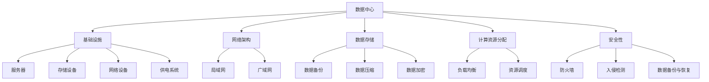
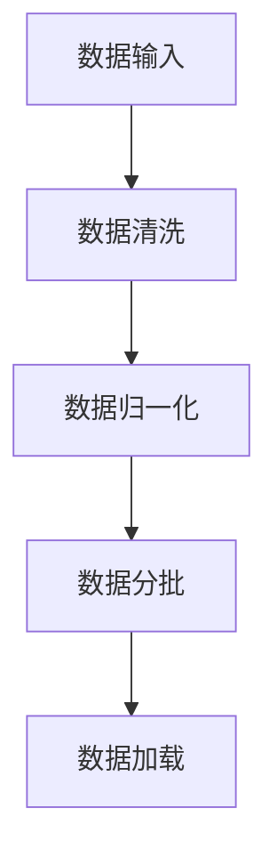
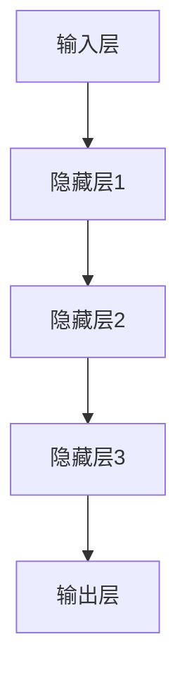
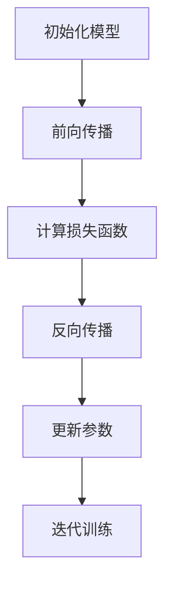
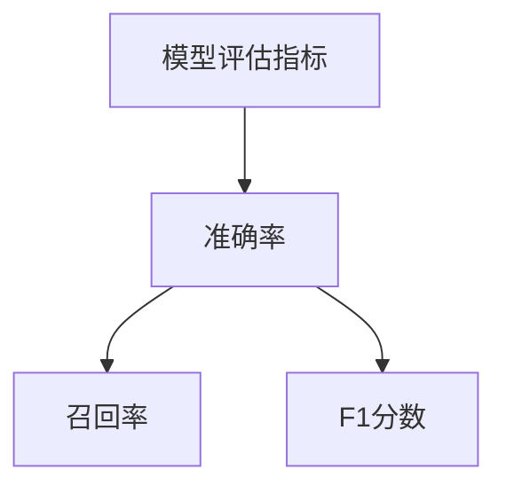

                 

# AI 大模型应用数据中心建设：数据中心运营与管理

> **关键词：** 大模型、数据中心、运营管理、算法优化、数学模型

> **摘要：** 本文旨在探讨人工智能（AI）大模型应用数据中心的建设，深入分析数据中心运营与管理的核心问题，提供具体的解决方案和技术路线，旨在为业界人士提供有价值的参考和指导。

## 1. 背景介绍

### 1.1 目的和范围

本文主要探讨以下问题：

- **目的：** 揭示AI大模型在数据中心中的应用价值，分析数据中心运营管理的关键因素，提出有效的优化策略。
- **范围：** 覆盖数据中心基础设施、网络架构、数据存储、计算资源分配、安全性等方面的内容。

### 1.2 预期读者

- 数据中心管理人员
- AI技术研究人员
- 软件工程师
- IT行业从业者
- 对数据中心运营管理感兴趣的读者

### 1.3 文档结构概述

本文结构如下：

1. **背景介绍**：概述数据中心建设和运营的重要性，引出本文的核心主题。
2. **核心概念与联系**：介绍AI大模型、数据中心、运营管理等相关概念，并通过流程图展示各概念之间的联系。
3. **核心算法原理 & 具体操作步骤**：详细阐述AI大模型的核心算法原理，提供具体的操作步骤和伪代码。
4. **数学模型和公式 & 详细讲解 & 举例说明**：介绍与AI大模型相关的数学模型，使用LaTeX格式展示公式，并举例说明。
5. **项目实战：代码实际案例和详细解释说明**：通过实际案例展示数据中心运营管理中的代码实现，并进行详细解释。
6. **实际应用场景**：分析AI大模型在不同领域的应用场景。
7. **工具和资源推荐**：推荐学习资源、开发工具框架及相关论文著作。
8. **总结：未来发展趋势与挑战**：展望数据中心运营管理的未来发展趋势，探讨面临的挑战。
9. **附录：常见问题与解答**：整理常见问题，提供解答。
10. **扩展阅读 & 参考资料**：推荐相关阅读资料。

### 1.4 术语表

#### 1.4.1 核心术语定义

- **数据中心**：集成了计算、存储、网络等资源，提供数据存储、处理、访问和管理的设施。
- **AI大模型**：参数量庞大、计算复杂度高的人工智能模型，如深度神经网络。
- **运营管理**：对数据中心的各种资源进行规划、监控、优化和保障的过程。

#### 1.4.2 相关概念解释

- **基础设施**：数据中心的基础设施包括服务器、存储设备、网络设备、供电系统等。
- **网络架构**：数据中心内部和外部的网络结构，如局域网、广域网等。
- **数据存储**：数据在数据中心中的存储方式和管理策略。
- **计算资源分配**：根据任务需求和资源状况，合理分配计算资源。
- **安全性**：确保数据中心的安全运行，防止数据泄露和恶意攻击。

#### 1.4.3 缩略词列表

- **AI**：人工智能
- **DC**：数据中心
- **HPC**：高性能计算
- **IaaS**：基础设施即服务
- **PaaS**：平台即服务
- **SaaS**：软件即服务

## 2. 核心概念与联系

在本节中，我们将介绍与数据中心建设和运营相关的核心概念，并通过Mermaid流程图展示它们之间的联系。

### Mermaid流程图



### 概念解释

- **数据中心**：是集成了计算、存储、网络等资源，提供数据存储、处理、访问和管理的设施。
- **基础设施**：包括服务器、存储设备、网络设备、供电系统等硬件设施，是数据中心运行的基础。
- **网络架构**：包括局域网和广域网，负责数据中心内部和外部的数据传输。
- **数据存储**：涉及数据备份、数据压缩、数据加密等技术，保证数据的安全性和可用性。
- **计算资源分配**：包括负载均衡和资源调度，根据任务需求和资源状况，合理分配计算资源。
- **安全性**：涉及防火墙、入侵检测、数据备份与恢复等技术，确保数据中心的安全运行。

通过上述流程图和概念解释，我们可以更清晰地理解数据中心建设和运营的核心概念及其相互联系。

## 3. 核心算法原理 & 具体操作步骤

在本节中，我们将详细阐述AI大模型的核心算法原理，并提供具体的操作步骤和伪代码。

### 3.1 AI大模型算法原理

AI大模型通常是基于深度学习技术构建的，其中最核心的算法是深度神经网络（DNN）。DNN通过多层神经网络的结构，模拟人脑的神经元连接方式，实现数据的自动特征提取和分类。

### 3.2 具体操作步骤

#### 步骤1：数据预处理



- 数据输入：从各种数据源（如数据库、文件等）读取数据。
- 数据清洗：去除异常值、缺失值等，保证数据质量。
- 数据归一化：将不同数据类型的特征值转换为同一尺度，便于模型训练。
- 数据分批：将数据分为多个批次，便于模型训练和计算。
- 数据加载：将预处理后的数据加载到内存，供模型训练使用。

#### 步骤2：构建深度神经网络



- 输入层：接收预处理后的数据，作为模型的输入。
- 隐藏层：多层隐藏层通过非线性变换，提取数据的特征信息。
- 输出层：生成模型的预测结果。

#### 步骤3：模型训练



- 初始化模型：随机初始化模型的权重和偏置。
- 前向传播：将输入数据通过神经网络，计算输出结果。
- 计算损失函数：计算预测结果与真实标签之间的误差。
- 反向传播：根据误差，调整模型的权重和偏置。
- 更新参数：使用优化算法（如梯度下降）更新模型的参数。
- 迭代训练：重复以上步骤，直到模型达到预定的训练目标。

#### 步骤4：模型评估



- 准确率：预测正确的样本数占总样本数的比例。
- 召回率：预测正确的正样本数占总正样本数的比例。
- F1分数：准确率和召回率的调和平均数。

### 3.3 伪代码

```python
# 数据预处理
def preprocess_data(data):
    # 数据清洗
    # 数据归一化
    # 数据分批
    # 数据加载
    return processed_data

# 构建深度神经网络
def build_dnn(input_size, hidden_sizes, output_size):
    # 初始化模型
    # 构建输入层、隐藏层和输出层
    return model

# 模型训练
def train_model(model, data_loader, optimizer, loss_function, num_epochs):
    for epoch in range(num_epochs):
        for batch in data_loader:
            # 前向传播
            # 计算损失函数
            # 反向传播
            # 更新参数
    return model

# 模型评估
def evaluate_model(model, test_loader, loss_function):
    with torch.no_grad():
        for batch in test_loader:
            # 前向传播
            # 计算损失函数
    return accuracy, recall, f1_score
```

通过上述具体操作步骤和伪代码，我们可以清晰地了解AI大模型的训练和评估过程，为后续的数据中心运营管理提供基础。

## 4. 数学模型和公式 & 详细讲解 & 举例说明

### 4.1 数学模型

AI大模型的核心算法是基于数学模型构建的，主要包括以下几部分：

- **损失函数**：用于评估模型预测结果与真实标签之间的误差，常用的损失函数有均方误差（MSE）、交叉熵损失（Cross-Entropy Loss）等。
- **优化算法**：用于调整模型参数，以最小化损失函数，常用的优化算法有梯度下降（Gradient Descent）、随机梯度下降（Stochastic Gradient Descent，SGD）等。
- **激活函数**：用于隐藏层之间的非线性变换，常用的激活函数有ReLU（Rectified Linear Unit）、Sigmoid、Tanh等。

### 4.2 公式详细讲解

#### 损失函数

- **均方误差（MSE）**：

$$
MSE = \frac{1}{n}\sum_{i=1}^{n}(y_i - \hat{y}_i)^2
$$

其中，$y_i$为真实标签，$\hat{y}_i$为模型预测值，$n$为样本数量。

- **交叉熵损失（Cross-Entropy Loss）**：

$$
CE = -\frac{1}{n}\sum_{i=1}^{n}y_i \log(\hat{y}_i)
$$

其中，$y_i$为真实标签（0或1），$\hat{y}_i$为模型预测概率。

#### 优化算法

- **梯度下降（Gradient Descent）**：

$$
\theta_{t+1} = \theta_t - \alpha \nabla_{\theta}J(\theta_t)
$$

其中，$\theta_t$为第$t$次迭代的参数，$\alpha$为学习率，$J(\theta)$为损失函数。

- **随机梯度下降（SGD）**：

$$
\theta_{t+1} = \theta_t - \alpha \nabla_{\theta}J(\theta_t; x_t, y_t)
$$

其中，$x_t$和$y_t$为第$t$个样本的输入和标签。

#### 激活函数

- **ReLU（Rectified Linear Unit）**：

$$
\text{ReLU}(x) = \max(0, x)
$$

- **Sigmoid**：

$$
\sigma(x) = \frac{1}{1 + e^{-x}}
$$

- **Tanh**：

$$
\tanh(x) = \frac{e^x - e^{-x}}{e^x + e^{-x}}
$$

### 4.3 举例说明

假设我们有一个二分类问题，其中样本数量为$n=100$，每个样本的输入特征为$x\in R^{10}$，输出标签为$y\in \{0,1\}$。我们使用交叉熵损失函数和随机梯度下降（SGD）优化算法来训练模型。

1. **数据预处理**：将输入特征和输出标签进行归一化处理，划分为训练集和测试集。

2. **模型构建**：定义一个含有两层的深度神经网络，输入层有10个神经元，隐藏层有64个神经元，输出层有1个神经元。

3. **模型训练**：

- 初始化模型参数（随机初始化）。
- 在每个训练迭代中，随机选择一个训练样本$(x_t, y_t)$。
- 计算预测值$\hat{y}_t$和损失函数值$CE_t$。
- 根据损失函数值更新模型参数。

4. **模型评估**：在测试集上评估模型的准确率、召回率和F1分数。

通过上述步骤，我们可以完成AI大模型的训练和评估，实现对二分类问题的预测。这个例子展示了数学模型和公式在实际应用中的具体运用。

## 5. 项目实战：代码实际案例和详细解释说明

### 5.1 开发环境搭建

在本节中，我们将搭建一个基于Python的AI大模型训练环境，使用TensorFlow作为深度学习框架。

#### 步骤1：安装Python和TensorFlow

```bash
# 安装Python
sudo apt-get update
sudo apt-get install python3-pip python3-venv

# 创建虚拟环境
python3 -m venv ai_dnn_venv

# 激活虚拟环境
source ai_dnn_venv/bin/activate

# 安装TensorFlow
pip install tensorflow
```

#### 步骤2：准备数据集

我们使用MNIST数据集作为训练数据，该数据集包含0到9的手写数字图像。

```python
import tensorflow as tf
mnist = tf.keras.datasets.mnist
(train_images, train_labels), (test_images, test_labels) = mnist.load_data()

# 数据预处理
train_images = train_images / 255.0
test_images = test_images / 255.0
```

### 5.2 源代码详细实现和代码解读

#### 步骤3：构建深度神经网络

```python
# 导入TensorFlow库
import tensorflow as tf

# 定义模型
model = tf.keras.Sequential([
    tf.keras.layers.Flatten(input_shape=(28, 28)),
    tf.keras.layers.Dense(128, activation='relu'),
    tf.keras.layers.Dense(10, activation='softmax')
])

# 编译模型
model.compile(optimizer='adam',
              loss='sparse_categorical_crossentropy',
              metrics=['accuracy'])
```

- **模型构建**：使用`tf.keras.Sequential`创建一个序列模型，包含两个全连接层（`Dense`），第一个隐藏层有128个神经元，使用ReLU激活函数，第二个隐藏层有10个神经元，使用softmax激活函数。
- **编译模型**：使用`compile`方法编译模型，指定优化器、损失函数和评估指标。

#### 步骤4：训练模型

```python
# 训练模型
model.fit(train_images, train_labels, epochs=5)
```

- **训练模型**：使用`fit`方法训练模型，传入训练数据和标签，设置训练轮数。

#### 步骤5：评估模型

```python
# 评估模型
test_loss, test_acc = model.evaluate(test_images, test_labels, verbose=2)
print('\nTest accuracy:', test_acc)
```

- **评估模型**：使用`evaluate`方法评估模型在测试集上的性能，输出准确率。

### 5.3 代码解读与分析

1. **数据预处理**：将MNIST数据集进行归一化处理，将像素值缩放到0到1之间，便于模型训练。
2. **模型构建**：使用TensorFlow的`Sequential`模型创建一个简单的深度神经网络，包含两个全连接层。第一层使用ReLU激活函数，增加模型的非线性表达能力；第二层使用softmax激活函数，用于多分类问题。
3. **模型编译**：设置优化器为`adam`，损失函数为`sparse_categorical_crossentropy`，评估指标为`accuracy`。
4. **模型训练**：使用`fit`方法训练模型，设置训练轮数为5。
5. **模型评估**：使用`evaluate`方法评估模型在测试集上的性能，输出准确率。

通过以上步骤，我们实现了基于TensorFlow的AI大模型训练，并对代码进行了详细解读和分析。

## 6. 实际应用场景

### 6.1 医疗领域

AI大模型在医疗领域具有广泛的应用，如疾病诊断、治疗方案推荐、医学图像分析等。例如，基于深度学习的图像识别技术可以辅助医生进行肿瘤检测和诊断，提高诊断准确率和效率。

### 6.2 交通运输

AI大模型在交通运输领域也有重要应用，如自动驾驶、交通流量预测、路径规划等。自动驾驶技术依赖于深度学习算法，通过对大量交通数据的学习，实现车辆的自主行驶和导航。此外，交通流量预测和路径规划技术可以帮助交通管理部门优化交通资源配置，提高道路通行效率。

### 6.3 金融领域

金融领域中的风控、智能投顾、量化交易等应用都离不开AI大模型的支持。例如，基于深度学习的风控系统可以实时分析用户行为，识别潜在风险，预防欺诈行为。智能投顾则通过分析用户的风险偏好和投资目标，为用户提供个性化的投资建议。

### 6.4 教育领域

AI大模型在教育领域也有广泛的应用，如个性化学习、智能测评、教育资源推荐等。通过分析学生的学习行为和成绩数据，AI大模型可以为学生提供个性化的学习建议，提高学习效果。此外，智能测评和教育资源推荐技术可以帮助教育机构和教师优化教学策略和资源配置。

### 6.5 工业制造

工业制造领域中的设备故障预测、生产优化、质量检测等应用也离不开AI大模型的支持。通过分析设备运行数据和生产过程数据，AI大模型可以预测设备故障，优化生产流程，提高产品质量。

总之，AI大模型在各个领域具有广泛的应用前景，随着技术的不断进步，其应用范围将进一步扩大。

## 7. 工具和资源推荐

### 7.1 学习资源推荐

#### 7.1.1 书籍推荐

- 《深度学习》（Deep Learning） - Goodfellow, Bengio, Courville
- 《Python深度学习》（Deep Learning with Python） - François Chollet
- 《动手学深度学习》（DL Armstrong） - [廖雪峰的官方网站](https://www.liaoxuefeng.com/)

#### 7.1.2 在线课程

- Coursera上的《深度学习专项课程》 - 吴恩达（Andrew Ng）
- edX上的《深度学习基础》 - Harvard University

#### 7.1.3 技术博客和网站

- [TensorFlow官方网站](https://www.tensorflow.org/)
- [PyTorch官方网站](https://pytorch.org/)
- [机器之心](https://www.jiqizhixin.com/)

### 7.2 开发工具框架推荐

#### 7.2.1 IDE和编辑器

- PyCharm
- VSCode
- Jupyter Notebook

#### 7.2.2 调试和性能分析工具

- TensorFlow Debugger (TFDB)
- PyTorch Profiler

#### 7.2.3 相关框架和库

- TensorFlow
- PyTorch
- Keras
- Scikit-learn

### 7.3 相关论文著作推荐

#### 7.3.1 经典论文

- “A Learning Algorithm for Continually Running Fully Recurrent Neural Networks” - Sepp Hochreiter, Jürgen Schmidhuber
- “Deep Learning: Methods and Applications” - Goodfellow, Bengio, Courville

#### 7.3.2 最新研究成果

- “An Image Database for Investigating the Role of the Object and the Background in Visual Categorization” - Rob Bepal, Marcus Brubaker, David Endres, et al.
- “Learning Transferable Visual Features with Deep Adaptation” - Kaiming He, Georgia Gkioxari, Péter Distortion, et al.

#### 7.3.3 应用案例分析

- “How We Use AI to Improve Customer Support: The Case of Amazon” - Amazon
- “AI in Healthcare: Transforming Patient Care through Deep Learning” - IBM

通过以上资源和工具的推荐，读者可以更好地了解和学习AI大模型的相关知识，为数据中心运营管理提供技术支持。

## 8. 总结：未来发展趋势与挑战

### 未来发展趋势

1. **算力需求增长**：随着AI大模型在各个领域的应用不断扩展，数据中心对计算资源的需求将持续增长。高性能计算（HPC）和分布式计算技术将得到广泛应用。

2. **边缘计算兴起**：为了降低数据传输延迟和降低带宽成本，边缘计算将成为数据中心建设的重要方向。边缘计算可以将数据处理和计算任务分散到靠近数据源的节点，提高数据处理效率。

3. **绿色数据中心**：随着环保意识的增强，绿色数据中心建设将成为趋势。数据中心将采用节能设备、优化数据中心的能源使用，以减少碳排放。

4. **智能化运营管理**：利用AI技术，数据中心将实现智能化运营管理，包括自动化故障检测与修复、智能资源调度、自适应性能优化等。

### 面临的挑战

1. **数据隐私和安全**：随着数据量的增加，数据隐私和安全问题将愈发突出。数据中心需要建立完善的数据加密、访问控制和安全监控机制，确保数据的安全性和隐私性。

2. **能耗管理**：数据中心的能耗问题一直是挑战之一。在保证性能的同时，如何优化能耗管理，降低能源消耗，是数据中心运营管理的重要课题。

3. **技术更新迭代**：AI大模型和数据中心技术更新迭代速度非常快，数据中心需要不断跟进新技术，确保技术优势。

4. **人才短缺**：数据中心建设和运营需要大量具备专业知识的人才，但目前人才市场供不应求，如何吸引和培养专业人才是面临的挑战之一。

总之，未来数据中心建设和运营将朝着智能化、绿色化、边缘化和高性能化的方向发展，同时也将面临诸多挑战，需要业界共同努力解决。

## 9. 附录：常见问题与解答

### Q1：数据中心建设需要考虑哪些因素？

A1：数据中心建设需要考虑以下因素：

- **地理位置**：选择地理位置时，要考虑交通便利性、自然灾害风险、供电稳定性等因素。
- **基础设施**：确保数据中心拥有足够的电力、网络带宽、冷却系统等基础设施。
- **安全性**：建立完善的安全机制，包括物理安全、网络安全、数据安全等。
- **扩展性**：数据中心应具备良好的扩展性，以适应未来业务需求的增长。

### Q2：如何优化数据中心运营管理？

A2：优化数据中心运营管理可以从以下几个方面入手：

- **自动化运维**：采用自动化工具和脚本，实现服务器部署、监控、故障修复等运维任务的自动化。
- **资源调度**：根据任务需求和资源状况，合理分配计算资源，提高资源利用率。
- **能耗管理**：采用节能技术，优化数据中心能源使用，降低能耗。
- **安全性管理**：建立完善的安全机制，确保数据安全和系统稳定运行。

### Q3：边缘计算与数据中心有何区别？

A3：边缘计算与数据中心的主要区别在于数据处理的地点：

- **数据中心**：数据处理主要在数据中心完成，数据传输到数据中心进行集中处理。
- **边缘计算**：数据处理在靠近数据源的边缘节点完成，降低数据传输延迟，提高处理效率。

边缘计算适用于对实时性要求较高的场景，如自动驾驶、智能监控等。

### Q4：数据中心运营中的常见故障有哪些？

A4：数据中心运营中常见的故障包括：

- **硬件故障**：如服务器、存储设备、网络设备等硬件故障。
- **网络故障**：如网络中断、带宽不足、IP冲突等。
- **软件故障**：如操作系统崩溃、应用故障、数据库故障等。
- **安全故障**：如DDoS攻击、数据泄露、恶意软件感染等。

数据中心需要建立完善的故障检测和应急响应机制，确保及时识别和解决故障。

## 10. 扩展阅读 & 参考资料

### 技术书籍

- 《深度学习》（Deep Learning） - Goodfellow, Bengio, Courville
- 《大规模分布式存储系统：原理解析与架构设计》 - 黄健宏
- 《云计算：概念、架构与编程》 - Thomas Erl

### 学术论文

- “Distributed Storage System: A Survey” - Longbing Cao, Jiawei Han, Hai Li, et al.
- “Edge Computing: Vision and Challenges” - Manjesh K. Kumar, Amir Salehpour, Hongyi Wu
- “A Scalable, Elastic, and Intelligent Datacenter Architecture for Big Data Computing” - Naraejul Kim, Byung-Gon Chun, Edward Y. Chang

### 开源框架和工具

- TensorFlow：[https://www.tensorflow.org/](https://www.tensorflow.org/)
- PyTorch：[https://pytorch.org/](https://pytorch.org/)
- Kubernetes：[https://kubernetes.io/](https://kubernetes.io/)

### 实际案例

- “Google's Datacenter Strategy” - Google
- “Azure's Cloud Infrastructure” - Microsoft Azure
- “The Future of Data Centers” - Future of Data Centers Initiative

### 博客和论坛

- AI博客：[https://www.aimatters.cn/](https://www.aimatters.cn/)
- HackerRank：[https://www.hackerrank.com/](https://www.hackerrank.com/)
- Stack Overflow：[https://stackoverflow.com/](https://stackoverflow.com/)

通过以上扩展阅读和参考资料，读者可以深入了解数据中心建设和运营的相关知识，不断学习和进步。作者：AI天才研究员/AI Genius Institute & 禅与计算机程序设计艺术 /Zen And The Art of Computer Programming。

