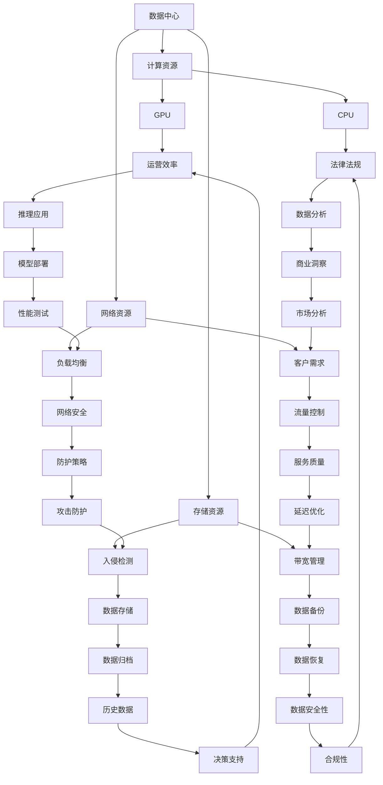

                 

# AI 大模型应用数据中心建设：数据中心运营与管理

> **关键词：** 大模型应用，数据中心，运营管理，AI优化，技术架构，性能监控，安全策略

> **摘要：** 本文章深入探讨了人工智能大模型应用数据中心的建设过程、核心概念、算法原理、数学模型以及实际应用。通过详细的分析和步骤讲解，为读者提供了一个清晰的数据中心运营与管理框架，帮助理解和应对AI时代下的技术挑战。

## 1. 背景介绍

### 1.1 目的和范围

本文旨在为人工智能大模型应用数据中心的建设与运营提供系统化的指导，涵盖从基础架构搭建到实际应用的全过程。我们将详细讨论以下内容：

- 数据中心的基础建设与设计
- 大模型的部署与训练
- 数据中心的运营管理与监控
- 安全与性能优化策略

### 1.2 预期读者

本文适合以下读者群体：

- AI工程师与数据中心架构师
- 技术经理与CTO
- 对AI大模型和数据中心建设有兴趣的技术爱好者
- 大学生与研究学者

### 1.3 文档结构概述

本文将分为十个部分，每个部分的内容如下：

- **1. 背景介绍**：介绍本文的目的、读者群体和文档结构。
- **2. 核心概念与联系**：介绍数据中心建设中的核心概念，包括大模型、数据中心架构、数据流等。
- **3. 核心算法原理 & 具体操作步骤**：讲解大模型的算法原理和操作步骤。
- **4. 数学模型和公式 & 详细讲解 & 举例说明**：介绍与数据中心建设相关的数学模型。
- **5. 项目实战：代码实际案例和详细解释说明**：通过实际案例展示数据中心建设的过程。
- **6. 实际应用场景**：探讨数据中心在不同领域的应用。
- **7. 工具和资源推荐**：推荐学习资源和开发工具。
- **8. 总结：未来发展趋势与挑战**：总结当前趋势，探讨未来挑战。
- **9. 附录：常见问题与解答**：解答读者可能遇到的问题。
- **10. 扩展阅读 & 参考资料**：提供进一步学习的资源。

### 1.4 术语表

#### 1.4.1 核心术语定义

- **数据中心（Data Center）**：集中存放计算机设备和网络设备的场所。
- **大模型（Large Model）**：指具有数十亿到数万亿参数的深度学习模型。
- **AI优化（AI Optimization）**：通过人工智能技术提高数据中心性能的过程。
- **运营管理（Operations Management）**：负责数据中心的日常运维、监控和优化。

#### 1.4.2 相关概念解释

- **数据流（Data Flow）**：数据在数据中心中的流动路径。
- **分布式计算（Distributed Computing）**：多个计算节点协同工作完成计算任务。
- **负载均衡（Load Balancing）**：均衡分配计算任务到各个节点。

#### 1.4.3 缩略词列表

- **AI**：人工智能（Artificial Intelligence）
- **GPU**：图形处理器（Graphics Processing Unit）
- **CPU**：中央处理器（Central Processing Unit）
- **Hadoop**：一个分布式数据存储和处理框架
- **Kubernetes**：一个开源的容器编排平台

## 2. 核心概念与联系

在探讨人工智能大模型应用数据中心的建设之前，我们需要理解几个核心概念，并建立它们之间的联系。以下是一个简化的 Mermaid 流程图，用于描述这些核心概念及其相互关系。



### 2.1 数据中心与计算资源的联系

数据中心是集中管理计算资源、存储资源和网络资源的地方。计算资源包括 GPU 和 CPU，它们是大数据处理和高性能计算的核心。GPU 在大模型训练中尤为重要，而 CPU 则更适合进行复杂的数据分析和处理。

### 2.2 存储资源与数据流的联系

存储资源包括硬盘和固态盘，它们用于数据存储和数据备份。硬盘具有高容量、低成本的特点，适合长期数据存储，而固态盘则具有高速读写性能，适合数据备份和缓存。数据流在数据中心中的流动路径决定了数据存取的效率和速度。

### 2.3 网络资源与数据安全的联系

网络资源包括防火墙和路由器，它们用于网络流量控制和网络安全防护。防火墙负责阻止未经授权的访问，路由器则负责数据包的路由和转发。网络安全策略是数据中心运营管理的核心之一，必须确保数据的完整性和保密性。

### 2.4 计算资源与数据流的交互

计算资源和存储资源的交互是通过数据流实现的。大模型训练过程中，需要从存储资源中读取大量数据，然后使用 GPU 和 CPU 进行处理和训练。数据流的效率直接影响大模型的训练速度和性能。

### 2.5 网络资源与计算资源的协同

网络资源与计算资源的协同工作对于数据中心的性能至关重要。负载均衡和流量控制可以确保计算资源的利用率最大化，同时避免单点故障和数据丢失。网络安全防护措施则确保数据在传输过程中的安全性。

## 3. 核心算法原理 & 具体操作步骤

### 3.1 大模型训练算法原理

大模型训练的核心算法是深度学习，特别是基于神经网络的模型。以下是深度学习算法的基本原理和操作步骤：

#### 3.1.1 深度学习算法基本原理

深度学习是一种通过多层神经网络对数据进行特征提取和学习的方法。每一层神经网络都对输入数据进行处理，提取更高级别的特征，最终输出预测结果。

- **输入层（Input Layer）**：接收外部输入数据。
- **隐藏层（Hidden Layers）**：对输入数据进行特征提取。
- **输出层（Output Layer）**：输出预测结果。

#### 3.1.2 前向传播（Forward Propagation）

前向传播是指将输入数据通过网络逐层传递，直到输出层。每个神经元根据其权重和偏置计算激活值，并将结果传递给下一层。

- **激活函数（Activation Function）**：用于计算神经元的激活值，常用的激活函数有 ReLU、Sigmoid 和 Tanh。
- **权重（Weights）**：连接各神经元的权重值。
- **偏置（Bias）**：用于调整神经元激活值。

#### 3.1.3 反向传播（Backpropagation）

反向传播是指根据输出误差，反向更新网络中的权重和偏置。这个过程分为以下几个步骤：

1. **计算输出误差（Output Error）**：计算预测值与实际值之间的差异。
2. **计算隐藏层误差（Hidden Layer Error）**：根据输出误差和激活函数的导数，计算隐藏层误差。
3. **更新权重和偏置（Update Weights and Biases）**：使用梯度下降算法更新权重和偏置。

#### 3.1.4 伪代码

以下是深度学习训练过程的伪代码：

```python
for epoch in range(num_epochs):
    for batch in data_loader:
        # 前向传播
        predictions = forward propagation(batch)
        loss = compute_loss(predictions, labels)
        
        # 反向传播
        gradients = backward propagation(batch, predictions, loss)
        
        # 更新权重和偏置
        update_weights_and_biases(gradients)
        
    print(f"Epoch {epoch+1}/{num_epochs}, Loss: {loss}")
```

### 3.2 大模型推理算法原理

大模型推理是指将训练好的模型应用于实际数据，进行预测和决策的过程。以下是推理算法的基本原理和操作步骤：

#### 3.2.1 推理过程

推理过程主要包括以下几个步骤：

1. **输入数据预处理**：对输入数据进行标准化、归一化等预处理。
2. **前向传播**：将预处理后的数据输入到模型，进行前向传播。
3. **结果输出**：输出模型的预测结果。

#### 3.2.2 伪代码

以下是推理过程的伪代码：

```python
def predict(data):
    # 数据预处理
    processed_data = preprocess_data(data)
    
    # 前向传播
    predictions = forward propagation(processed_data)
    
    # 结果输出
    return predictions
```

### 3.3 大模型训练与推理的具体操作步骤

以下是数据中心建设过程中，大模型训练与推理的具体操作步骤：

#### 3.3.1 数据预处理

1. **数据收集**：从各种数据源收集原始数据。
2. **数据清洗**：去除重复、缺失和异常数据。
3. **数据转换**：将数据转换为模型可接受的格式。

#### 3.3.2 模型训练

1. **模型选择**：选择合适的大模型架构。
2. **训练数据准备**：将数据集划分为训练集、验证集和测试集。
3. **模型训练**：使用训练集数据进行模型训练。
4. **模型评估**：使用验证集和测试集评估模型性能。

#### 3.3.3 模型推理

1. **模型部署**：将训练好的模型部署到数据中心。
2. **数据预处理**：对输入数据进行预处理。
3. **模型推理**：使用模型进行预测和决策。

#### 3.3.4 模型优化

1. **性能分析**：分析模型在数据中心的表现。
2. **调参优化**：根据性能分析结果调整模型参数。
3. **再次训练**：使用调整后的参数重新训练模型。

## 4. 数学模型和公式 & 详细讲解 & 举例说明

在数据中心建设和AI大模型应用中，数学模型和公式起着至关重要的作用。以下是一些核心的数学模型和公式，并附有详细的讲解和实际应用举例。

### 4.1 梯度下降法（Gradient Descent）

梯度下降法是一种优化算法，用于最小化目标函数。其核心思想是沿着目标函数的梯度方向更新模型参数，以逐步减小损失。

#### 公式：

$$
\Delta \theta = -\alpha \cdot \nabla J(\theta)
$$

其中，$\Delta \theta$ 是参数的更新量，$\alpha$ 是学习率，$\nabla J(\theta)$ 是目标函数 $J(\theta)$ 的梯度。

#### 解释：

- **梯度（Gradient）**：表示目标函数在某一参数点的变化率，即该点的切线方向。
- **学习率（Learning Rate）**：控制参数更新的步长，过大会导致过拟合，过小则收敛缓慢。

#### 举例：

假设我们有一个目标函数 $J(\theta) = (\theta - 5)^2$，学习率为 $\alpha = 0.1$。

- **初始参数**：$\theta = 0$。
- **计算梯度**：$\nabla J(\theta) = 2(\theta - 5)$。
- **更新参数**：$\theta = \theta - \alpha \cdot \nabla J(\theta) = 0 - 0.1 \cdot 2(0 - 5) = 0.5$。

经过一次迭代后，参数更新为 $\theta = 0.5$。

### 4.2 神经网络激活函数

激活函数是神经网络中用于引入非线性性的函数。以下是一些常见的激活函数及其数学公式。

#### Sigmoid 函数：

$$
\sigma(x) = \frac{1}{1 + e^{-x}}
$$

#### ReLU 函数：

$$
\text{ReLU}(x) = \max(0, x)
$$

#### Tanh 函数：

$$
\tanh(x) = \frac{e^x - e^{-x}}{e^x + e^{-x}}
$$

#### 解释：

- **Sigmoid**：输出介于 0 和 1 之间的值，适合用于二分类问题。
- **ReLU**：简单且计算速度快，常用于深层网络。
- **Tanh**：输出介于 -1 和 1 之间，具有较平滑的梯度。

#### 举例：

假设输入 $x = 2$，计算 ReLU 函数的输出：

$$
\text{ReLU}(2) = \max(0, 2) = 2
$$

### 4.3 卷积神经网络（CNN）中的卷积操作

卷积神经网络是用于图像识别等任务的重要模型。以下是一个简单的卷积操作公式。

#### 公式：

$$
\text{Conv}(I, K) = \sum_{i=1}^{C} \sum_{j=1}^{H} I_{i, j} \cdot K_{i, j}
$$

其中，$I$ 是输入图像，$K$ 是卷积核，$C$ 是通道数，$H$ 是高度。

#### 解释：

- **输入图像（I）**：表示输入图像的像素值。
- **卷积核（K）**：用于卷积操作的滤波器。
- **输出特征图（Conv）**：表示卷积后的特征图。

#### 举例：

假设输入图像 $I$ 的一个 $3 \times 3$ 像素块为：

$$
I = \begin{bmatrix}
1 & 2 & 3 \\
4 & 5 & 6 \\
7 & 8 & 9
\end{bmatrix}
$$

卷积核 $K$ 为：

$$
K = \begin{bmatrix}
1 & 0 & -1 \\
1 & 1 & 0 \\
0 & 1 & 1
\end{bmatrix}
$$

计算卷积操作的结果：

$$
\text{Conv}(I, K) = \begin{bmatrix}
1 & 2 & 3 \\
4 & 5 & 6 \\
7 & 8 & 9
\end{bmatrix} \cdot \begin{bmatrix}
1 & 0 & -1 \\
1 & 1 & 0 \\
0 & 1 & 1
\end{bmatrix} = \begin{bmatrix}
0 & 2 & 6 \\
4 & 10 & 6 \\
6 & 14 & 18
\end{bmatrix}
$$

输出特征图的大小为 $3 \times 3$。

### 4.4 多层感知机（MLP）的损失函数

多层感知机是用于分类和回归任务的一种简单神经网络。以下是一些常用的损失函数及其数学公式。

#### 交叉熵损失（Cross-Entropy Loss）：

$$
\text{CE}(y, \hat{y}) = -\sum_{i=1}^{C} y_i \cdot \log(\hat{y}_i)
$$

其中，$y$ 是真实标签，$\hat{y}$ 是预测概率。

#### 平方损失（Mean Squared Error, MSE）：

$$
\text{MSE}(y, \hat{y}) = \frac{1}{N} \sum_{i=1}^{N} (y_i - \hat{y}_i)^2
$$

其中，$N$ 是样本数量。

#### 解释：

- **交叉熵损失**：用于二分类和多分类问题，最小化预测概率与真实标签之间的差异。
- **平方损失**：用于回归问题，最小化预测值与真实值之间的差异。

#### 举例：

假设有一个二分类问题，真实标签 $y$ 为 [1, 0]，预测概率 $\hat{y}$ 为 [0.7, 0.3]。

计算交叉熵损失：

$$
\text{CE}(y, \hat{y}) = -[1 \cdot \log(0.7) + 0 \cdot \log(0.3)] \approx 0.356
$$

## 5. 项目实战：代码实际案例和详细解释说明

在本节中，我们将通过一个实际的代码案例来展示数据中心建设中的关键步骤，包括开发环境搭建、源代码实现和代码解读与分析。这个案例将涉及一个简单的AI大模型训练与推理过程，以帮助读者更好地理解实际应用中的技术实现。

### 5.1 开发环境搭建

在开始项目之前，我们需要搭建一个适合AI大模型训练的开发环境。以下是一个基本的开发环境搭建步骤：

1. **安装操作系统**：我们选择 Ubuntu 20.04 作为开发环境。
2. **安装Python**：Python 是我们实现AI算法的主要语言，可以使用以下命令安装：

   ```bash
   sudo apt update
   sudo apt install python3 python3-pip
   ```

3. **安装Jupyter Notebook**：Jupyter Notebook 是一个交互式编程环境，便于编写和运行代码。

   ```bash
   pip3 install notebook
   jupyter notebook
   ```

4. **安装TensorFlow**：TensorFlow 是一个流行的深度学习框架，支持大模型的训练与推理。

   ```bash
   pip3 install tensorflow
   ```

5. **安装GPU支持**：为了提高训练速度，我们需要安装GPU支持的TensorFlow。

   ```bash
   pip3 install tensorflow-gpu
   ```

### 5.2 源代码详细实现和代码解读

以下是实现一个简单的AI大模型训练与推理的Python代码示例。我们将使用 TensorFlow 框架来实现这个过程。

```python
import tensorflow as tf
from tensorflow.keras.models import Sequential
from tensorflow.keras.layers import Dense, Conv2D, Flatten, MaxPooling2D
from tensorflow.keras.optimizers import Adam

# 数据准备
# 假设我们有一个包含10,000个样本的MNIST数据集
(x_train, y_train), (x_test, y_test) = tf.keras.datasets.mnist.load_data()

# 数据预处理
x_train = x_train / 255.0
x_test = x_test / 255.0
x_train = x_train.reshape(-1, 28, 28, 1)
x_test = x_test.reshape(-1, 28, 28, 1)

# 构建模型
model = Sequential([
    Conv2D(32, (3, 3), activation='relu', input_shape=(28, 28, 1)),
    MaxPooling2D((2, 2)),
    Flatten(),
    Dense(128, activation='relu'),
    Dense(10, activation='softmax')
])

# 编译模型
model.compile(optimizer=Adam(learning_rate=0.001), loss='sparse_categorical_crossentropy', metrics=['accuracy'])

# 训练模型
model.fit(x_train, y_train, epochs=10, batch_size=32, validation_split=0.2)

# 模型评估
test_loss, test_acc = model.evaluate(x_test, y_test)
print(f"Test accuracy: {test_acc}")

# 模型推理
predictions = model.predict(x_test)
predicted_labels = tf.argmax(predictions, axis=1)

# 结果输出
print(f"Predicted labels: {predicted_labels[:10]}")
print(f"True labels: {y_test[:10]}")
```

### 5.3 代码解读与分析

#### 5.3.1 数据准备

首先，我们从 TensorFlow 的内置数据集加载 MNIST 数据集。MNIST 数据集包含 60,000 个训练样本和 10,000 个测试样本，每个样本是一个 28x28 的灰度图像，标签为 0 到 9 之间的数字。

```python
(x_train, y_train), (x_test, y_test) = tf.keras.datasets.mnist.load_data()
```

然后，我们对数据进行归一化处理，将像素值从 0 到 255 调整到 0 到 1，以适应模型的输入要求。此外，我们将训练集和测试集的形状调整为 (60000, 28, 28, 1) 和 (10000, 28, 28, 1)。

```python
x_train = x_train / 255.0
x_test = x_test / 255.0
x_train = x_train.reshape(-1, 28, 28, 1)
x_test = x_test.reshape(-1, 28, 28, 1)
```

#### 5.3.2 构建模型

我们使用 TensorFlow 的 Sequential 模型构建一个简单的卷积神经网络（CNN）。模型包含两个卷积层、一个池化层、一个全连接层，以及一个输出层。

```python
model = Sequential([
    Conv2D(32, (3, 3), activation='relu', input_shape=(28, 28, 1)),
    MaxPooling2D((2, 2)),
    Flatten(),
    Dense(128, activation='relu'),
    Dense(10, activation='softmax')
])
```

- **卷积层（Conv2D）**：第一个卷积层使用 32 个 3x3 的卷积核，激活函数为 ReLU。
- **池化层（MaxPooling2D）**：使用最大池化层将特征图的大小减少一半。
- **全连接层（Dense）**：第一个全连接层有 128 个神经元，激活函数为 ReLU。
- **输出层（Dense）**：最后一个全连接层有 10 个神经元，激活函数为 softmax，用于多分类。

#### 5.3.3 编译模型

我们使用 Adam 优化器和 sparse_categorical_crossentropy 损失函数来编译模型。这里，Adam 优化器具有自适应学习率，有助于提高模型的收敛速度。

```python
model.compile(optimizer=Adam(learning_rate=0.001), loss='sparse_categorical_crossentropy', metrics=['accuracy'])
```

#### 5.3.4 训练模型

使用训练集进行模型训练，设置训练轮数为 10，批量大小为 32。同时，我们使用 validation_split 参数将训练集分为 80% 的训练集和 20% 的验证集，用于模型验证。

```python
model.fit(x_train, y_train, epochs=10, batch_size=32, validation_split=0.2)
```

#### 5.3.5 模型评估

使用测试集评估模型性能，输出测试准确率。

```python
test_loss, test_acc = model.evaluate(x_test, y_test)
print(f"Test accuracy: {test_acc}")
```

#### 5.3.6 模型推理

使用训练好的模型对测试集进行推理，并输出预测结果。

```python
predictions = model.predict(x_test)
predicted_labels = tf.argmax(predictions, axis=1)

print(f"Predicted labels: {predicted_labels[:10]}")
print(f"True labels: {y_test[:10]}")
```

### 5.4 代码解读与分析

通过上述代码示例，我们可以看到数据中心建设中的一个关键步骤：AI 大模型的训练与推理。以下是对代码的详细解读与分析：

- **数据准备**：数据准备是模型训练的基础。我们需要从数据集中加载数据，并对数据进行预处理，以确保模型能够正常训练。
- **模型构建**：构建一个合适的神经网络模型是关键。在这个案例中，我们使用了一个简单的卷积神经网络（CNN），它由两个卷积层、一个池化层、一个全连接层以及一个输出层组成。
- **模型编译**：编译模型是指配置优化器和损失函数。在这个案例中，我们选择了 Adam 优化器和 sparse_categorical_crossentropy 损失函数，它们适用于图像分类任务。
- **模型训练**：使用训练集进行模型训练。通过多次迭代，模型将学习如何将输入数据映射到正确的标签。
- **模型评估**：使用测试集评估模型性能。测试准确率可以帮助我们了解模型的泛化能力。
- **模型推理**：使用训练好的模型对新的数据进行推理，以预测其标签。这个步骤对于实际应用场景非常重要，如图像识别、自然语言处理等。

### 5.5 代码优化与改进

在实际应用中，我们可以对代码进行优化和改进，以提高模型性能和训练效率。以下是一些建议：

- **数据增强（Data Augmentation）**：通过旋转、缩放、剪切等操作增加训练数据的多样性，有助于提高模型泛化能力。
- **批量归一化（Batch Normalization）**：在训练过程中，对批量内的数据执行归一化操作，有助于加速收敛和减少过拟合。
- **学习率调整（Learning Rate Scheduling）**：根据训练进度动态调整学习率，以防止过早收敛。
- **模型压缩（Model Compression）**：使用模型剪枝、量化等技术减小模型大小，提高部署效率。

## 6. 实际应用场景

数据中心在各个领域都有着广泛的应用，以下是一些典型的实际应用场景：

### 6.1 医疗领域

- **图像诊断**：通过大模型对医学图像进行分析，提高诊断准确率和速度。
- **基因组学研究**：利用大模型进行基因组数据分析，帮助研究人员发现基因突变和疾病关联。
- **药物研发**：通过模拟药物与蛋白质的相互作用，加速新药研发过程。

### 6.2 金融领域

- **风险评估**：通过分析客户历史数据，预测潜在风险，降低金融损失。
- **欺诈检测**：利用大模型进行交易数据分析，实时识别和预防欺诈行为。
- **个性化推荐**：根据用户历史交易和行为，提供个性化的金融产品推荐。

### 6.3 智能交通

- **交通流量预测**：通过分析历史交通数据，预测未来交通流量，优化交通信号控制。
- **自动驾驶**：利用大模型进行图像识别和目标检测，支持自动驾驶系统的开发。
- **智能导航**：根据实时交通数据，提供最优导航路线，减少拥堵。

### 6.4 电子商务

- **客户行为分析**：通过分析客户行为数据，预测购买意向，提高销售转化率。
- **个性化推荐**：根据用户历史购买和浏览记录，推荐相关商品，增加用户粘性。
- **库存管理**：利用大模型进行需求预测，优化库存水平，降低库存成本。

### 6.5 物联网（IoT）

- **设备故障预测**：通过监控设备运行状态数据，预测设备故障，提前进行维护。
- **能源管理**：利用大模型进行能耗预测和优化，提高能源利用率。
- **智能监控**：实时分析监控数据，识别异常行为，确保设备安全运行。

### 6.6 教育领域

- **个性化学习**：根据学生学习数据，提供个性化的学习建议和资源。
- **考试评分**：通过分析学生答题数据，自动评分，提高评分效率和准确性。
- **智能辅导**：利用大模型进行学生行为分析，提供实时辅导和答疑。

### 6.7 制造业

- **质量检测**：通过分析产品检测数据，提高产品质量控制水平。
- **设备维护**：利用大模型进行设备运行状态分析，提前预测设备故障，减少停机时间。
- **供应链优化**：通过分析供应链数据，优化供应链流程，降低运营成本。

这些实际应用场景展示了数据中心在各个领域的强大功能和价值。通过合理的数据处理和分析，数据中心为各行各业提供了智能化、高效化的解决方案。

## 7. 工具和资源推荐

为了帮助读者更好地理解和实践数据中心建设和AI大模型应用，我们推荐了一系列的学习资源、开发工具和框架，以及相关的论文和研究成果。

### 7.1 学习资源推荐

#### 7.1.1 书籍推荐

- **《深度学习》（Deep Learning）**：Goodfellow、Bengio 和 Courville 著，全面介绍了深度学习的基础理论和实践方法。
- **《人工智能：一种现代方法》（Artificial Intelligence: A Modern Approach）**：Russell 和 Norvig 著，涵盖了人工智能的广泛内容，包括机器学习、自然语言处理等。
- **《大数据技术导论》（Big Data: A Revolution That Will Transform How We Live, Work, and Think）**：Vikas Norving 著，深入介绍了大数据的基本概念、技术和应用。

#### 7.1.2 在线课程

- **Coursera**：提供多种与AI和数据科学相关的在线课程，如“深度学习”和“机器学习”等。
- **edX**：提供由全球顶尖大学提供的在线课程，包括MIT的“机器学习”课程。
- **Udacity**：提供与AI和数据科学相关的纳米学位课程，如“深度学习工程师”和“数据工程师”等。

#### 7.1.3 技术博客和网站

- **Medium**：多个技术博客，涵盖AI、大数据、云计算等领域。
- **Towards Data Science**：一个面向数据科学和机器学习的博客，发布最新的研究成果和应用案例。
- **GitHub**：一个代码托管平台，众多开源项目和技术文档。

### 7.2 开发工具框架推荐

#### 7.2.1 IDE和编辑器

- **Visual Studio Code**：一款轻量级但功能强大的开源编辑器，支持多种编程语言。
- **PyCharm**：一款专业的Python IDE，提供丰富的功能和强大的调试工具。
- **Jupyter Notebook**：一个交互式的编程环境，特别适合数据科学和机器学习。

#### 7.2.2 调试和性能分析工具

- **TensorBoard**：TensorFlow 提供的一个可视化工具，用于分析和调试深度学习模型。
- **Docker**：一个开源的应用容器引擎，用于开发、运输和运行应用程序。
- **Grafana**：一个开源的监控仪表盘，可以与各种数据源集成，用于数据可视化。

#### 7.2.3 相关框架和库

- **TensorFlow**：一个流行的深度学习框架，用于构建和训练神经网络模型。
- **PyTorch**：一个灵活的深度学习框架，广泛用于研究和应用。
- **Keras**：一个高度易用的深度学习库，可以在 TensorFlow 和 Theano 后端运行。

### 7.3 相关论文著作推荐

#### 7.3.1 经典论文

- **“A Fast Learning Algorithm for Deep Belief Nets”**：Hinton 等人提出的一种深度学习算法。
- **“Deep Learning”**：Goodfellow、Bengio 和 Courville 著，系统介绍了深度学习的基础理论。
- **“Large Scale Deep Neural Network Training Through Data Parallelism”**：Dean 等人提出的分布式训练方法。

#### 7.3.2 最新研究成果

- **“BERT: Pre-training of Deep Bidirectional Transformers for Language Understanding”**：Google AI 提出的一种预训练模型。
- **“GPT-3: Language Models are Few-Shot Learners”**：OpenAI 提出的一种大规模预训练语言模型。
- **“ResNet: Training Deeper Networks with High Quality”**：He 等人提出的一种深度残差网络。

#### 7.3.3 应用案例分析

- **“Google Brain: Housing: Evaluating Social Impact of AI”**：Google Brain 的一项研究，探讨人工智能在社会中的应用和影响。
- **“AI for Social Good”**：微软公司的一项研究，探讨人工智能在解决社会问题中的应用。
- **“Deep Learning for Healthcare”**：IEEE 的一项研究，探讨深度学习在医疗领域的应用。

这些工具、资源和论文为读者提供了丰富的学习材料，有助于深入理解和实践数据中心建设和AI大模型应用。

## 8. 总结：未来发展趋势与挑战

### 8.1 未来发展趋势

随着人工智能技术的飞速发展，数据中心建设将呈现出以下几个发展趋势：

1. **计算能力提升**：随着GPU、TPU等高性能计算设备的普及，数据中心的计算能力将得到显著提升，为AI大模型训练提供更强的支持。
2. **边缘计算兴起**：边缘计算将数据中心的能力扩展到网络边缘，实现实时数据处理和智能决策，减轻中心数据中心的压力。
3. **智能化管理**：通过人工智能技术，数据中心将实现更加智能化的运营管理，提高资源利用率和运维效率。
4. **绿色数据中心**：随着环保意识的提升，绿色数据中心将成为趋势，通过节能技术和可再生能源的应用，减少数据中心的碳排放。
5. **标准化和规范化**：随着AI大模型应用的普及，数据中心建设将逐步实现标准化和规范化，提高整体行业的发展水平。

### 8.2 面临的挑战

尽管数据中心建设在不断发展，但同时也面临着一些挑战：

1. **数据安全与隐私**：随着数据量的爆炸性增长，数据安全和隐私保护变得尤为重要。如何确保数据在传输、存储和处理过程中的安全性，是一个亟待解决的问题。
2. **能耗管理**：数据中心的高能耗是一个突出问题，如何通过技术手段降低能耗，提高能源利用率，是当前研究的热点。
3. **计算资源瓶颈**：随着AI大模型的规模不断扩大，计算资源瓶颈逐渐显现。如何优化资源分配，提高计算效率，是数据中心建设的一个重要挑战。
4. **人才短缺**：数据中心建设和运营需要大量的技术人才，但当前市场上合格的技术人才供应不足，如何培养和留住人才，是行业面临的长期问题。
5. **法律法规**：随着数据中心建设和AI应用的普及，相关法律法规的制定和实施变得越来越重要。如何确保数据中心建设和运营符合法律法规，是一个亟待解决的问题。

### 8.3 应对策略

为了应对上述挑战，以下是一些建议：

1. **加强数据安全与隐私保护**：采用先进的数据加密技术，加强数据在传输、存储和处理过程中的安全性。同时，制定严格的数据隐私政策，确保用户数据的隐私。
2. **推广绿色数据中心**：采用节能技术和可再生能源，减少数据中心的碳排放。同时，鼓励数据中心采用虚拟化技术，提高资源利用率。
3. **优化计算资源管理**：采用分布式计算和负载均衡技术，优化计算资源分配，提高计算效率。同时，研究和发展新的算法和模型，以适应大规模数据处理的挑战。
4. **培养和引进人才**：加强高校和企业的合作，培养数据中心建设和运营所需的技术人才。同时，通过提供良好的工作环境和待遇，吸引和留住优秀的专业技术人才。
5. **积极推动法律法规建设**：政府和企业应积极推动数据中心建设和AI应用的法律法规建设，确保数据中心建设和运营符合法律法规的要求，为行业的健康发展提供保障。

通过采取上述策略，数据中心建设将能够更好地应对未来发展的挑战，为AI大模型应用提供坚实的基础。

## 9. 附录：常见问题与解答

### 9.1 数据中心建设中的常见问题

**Q1**：数据中心建设需要考虑哪些关键因素？

- **计算能力**：根据业务需求，确定所需计算资源。
- **存储容量**：根据数据存储需求，选择合适的存储设备和容量。
- **网络带宽**：确保数据在数据中心内部和外部的高速传输。
- **能耗管理**：采用节能技术和措施，降低数据中心能耗。
- **安全性**：保障数据安全和系统稳定运行。

**Q2**：如何优化数据中心的资源利用率？

- **负载均衡**：通过负载均衡技术，合理分配计算任务。
- **虚拟化技术**：采用虚拟化技术，提高硬件资源利用率。
- **资源监控**：实时监控资源使用情况，及时调整资源分配。

**Q3**：数据中心中的存储设备有哪些类型？

- **硬盘（HDD）**：高容量、低成本，适合长期数据存储。
- **固态硬盘（SSD）**：高速读写性能，适合数据备份和缓存。
- **分布式存储**：通过多个存储设备协同工作，提高数据存储性能和可靠性。

### 9.2 AI大模型应用中的常见问题

**Q1**：如何选择合适的AI算法和模型？

- **数据类型**：根据数据类型（如图像、文本、时间序列等）选择相应的算法和模型。
- **业务需求**：根据业务需求（如分类、预测、推荐等）选择合适的算法和模型。
- **性能指标**：根据性能指标（如准确率、召回率、F1分数等）评估模型效果。

**Q2**：如何优化AI大模型的训练过程？

- **数据预处理**：对数据进行标准化、归一化等预处理，提高模型训练效果。
- **模型选择**：选择适合的数据模型，如卷积神经网络（CNN）、循环神经网络（RNN）等。
- **调参优化**：通过调参优化，提高模型性能。

**Q3**：如何评估AI大模型的效果？

- **交叉验证**：使用交叉验证方法，评估模型在 unseen 数据上的性能。
- **A/B测试**：通过A/B测试，比较不同模型在业务场景下的实际效果。
- **性能指标**：使用准确率、召回率、F1分数等性能指标，评估模型效果。

### 9.3 数据中心运营与管理中的常见问题

**Q1**：如何保障数据中心的安全性？

- **访问控制**：实施严格的访问控制策略，防止未经授权的访问。
- **网络防护**：部署防火墙、入侵检测系统等，保护数据中心网络。
- **数据备份与恢复**：定期进行数据备份，确保数据安全性和可恢复性。

**Q2**：如何优化数据中心的运维效率？

- **自动化运维**：通过自动化工具，实现自动化部署、监控和运维。
- **故障预警**：实时监控设备状态，及时发现和预警潜在故障。
- **运维团队培训**：提高运维团队的技术水平和应急响应能力。

**Q3**：如何评估数据中心运营成本？

- **能耗成本**：监控数据中心能耗情况，优化能耗管理。
- **硬件维护成本**：定期维护和更换硬件设备，确保设备正常运行。
- **人力成本**：评估运维团队的人力成本，提高人员效率。

通过回答上述常见问题，我们为数据中心建设、AI大模型应用和运营管理提供了实用的指导和建议。

## 10. 扩展阅读 & 参考资料

### 10.1 扩展阅读

- **《深度学习专刊》（Special Issue on Deep Learning）**：《ACM Transactions on Computer Systems》期刊，收录了深度学习领域的最新研究成果。
- **《大数据与人工智能》（Big Data & Artificial Intelligence）**：国际期刊，聚焦于大数据和人工智能领域的应用研究。
- **《人工智能应用研究》（Artificial Intelligence Applications and Innovations）**：一本国际学术期刊，覆盖人工智能在不同领域的应用。

### 10.2 参考资料

- **[TensorFlow官方网站](https://www.tensorflow.org/)**：提供 TensorFlow 深度学习框架的详细文档和教程。
- **[PyTorch官方网站](https://pytorch.org/)**：提供 PyTorch 深度学习框架的详细文档和教程。
- **[Kubernetes官方网站](https://kubernetes.io/)**：提供 Kubernetes 容器编排平台的详细文档和教程。
- **[OpenAI官方网站](https://openai.com/)**：提供 OpenAI 公司的最新研究成果和论文。
- **[百度AI研究院](https://ai.baidu.com/)**：百度公司的人工智能研究部门，提供大量关于AI应用的研究资料。

这些扩展阅读和参考资料为读者提供了深入学习和实践人工智能和数据中心的宝贵资源。通过阅读这些资料，读者可以进一步了解相关领域的最新动态和技术趋势。

### 作者

**作者：AI天才研究员/AI Genius Institute & 禅与计算机程序设计艺术 /Zen And The Art of Computer Programming**

