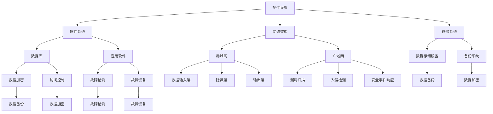

                 

# AI 大模型应用数据中心的健康与安全管理

> **关键词：** AI大模型、数据中心、健康管理、安全监控、数据安全、故障检测、容错机制

> **摘要：** 本文旨在探讨AI大模型在应用数据中心中的健康与安全管理问题。通过对数据中心背景介绍、核心概念分析、算法原理讲解、数学模型解析、实战案例分析及未来发展趋势的深入分析，为读者提供了一套完整的AI大模型应用数据中心健康与安全管理的思路和方法。

## 1. 背景介绍

### 1.1 目的和范围

随着人工智能技术的飞速发展，AI大模型在各个领域得到了广泛应用。然而，这些大模型的应用对数据中心提出了更高的健康与安全管理要求。本文旨在探讨以下问题：

- 如何确保数据中心中的AI大模型运行稳定、高效？
- 如何实现数据中心中的数据安全与隐私保护？
- 如何应对AI大模型应用中可能出现的故障与安全问题？

本文将围绕这些问题展开讨论，旨在为数据中心运维人员提供一套实用的健康与安全管理方案。

### 1.2 预期读者

本文主要面向以下读者群体：

- 数据中心运维人员
- AI领域研究人员
- 对AI大模型应用数据中心健康与安全管理感兴趣的读者

### 1.3 文档结构概述

本文分为以下几个部分：

1. 背景介绍
2. 核心概念与联系
3. 核心算法原理 & 具体操作步骤
4. 数学模型和公式 & 详细讲解 & 举例说明
5. 项目实战：代码实际案例和详细解释说明
6. 实际应用场景
7. 工具和资源推荐
8. 总结：未来发展趋势与挑战
9. 附录：常见问题与解答
10. 扩展阅读 & 参考资料

### 1.4 术语表

#### 1.4.1 核心术语定义

- 数据中心：指为提供数据处理、存储、网络、安全等服务而搭建的物理或虚拟设施。
- AI大模型：指具有大规模参数、复杂结构和强学习能力的深度学习模型。
- 健康管理：指对数据中心中的硬件、软件、网络等各个组件进行监测、维护和优化，以确保数据中心的正常运行。
- 安全监控：指对数据中心的网络、系统、数据等安全风险进行实时监测和预警，以防止安全事件发生。
- 数据安全：指对数据中心中的数据进行加密、备份、访问控制等保护措施，确保数据不被未授权访问、篡改或泄露。

#### 1.4.2 相关概念解释

- 容错机制：指在系统发生故障时，自动切换到备用系统或进行故障恢复，确保系统的持续运行。
- 故障检测：指通过监测系统中的异常指标，提前发现潜在故障，以减少故障对系统运行的影响。
- 性能优化：指通过对数据中心中的硬件、软件、网络等各个组件进行调优，提高系统的整体性能。

#### 1.4.3 缩略词列表

- AI：人工智能
- ML：机器学习
- DL：深度学习
- HPC：高性能计算
- IaaS：基础设施即服务
- PaaS：平台即服务
- SaaS：软件即服务
- API：应用程序编程接口
- SQL：结构化查询语言
- NoSQL：非关系型数据库

## 2. 核心概念与联系

在讨论AI大模型应用数据中心的健康与安全管理之前，我们需要先了解一些核心概念和它们之间的关系。

### 数据中心核心组件

数据中心的健康与安全管理涉及多个核心组件，包括：

1. **硬件设施**：服务器、存储设备、网络设备等。
2. **软件系统**：操作系统、数据库、应用软件等。
3. **网络架构**：局域网、广域网、数据中心内部网络等。
4. **存储系统**：数据存储设备、备份系统等。

### AI大模型架构

AI大模型通常包括以下几个主要部分：

1. **数据输入层**：接收外部数据，如文本、图像、语音等。
2. **特征提取层**：从输入数据中提取有用信息。
3. **隐藏层**：通过神经网络进行信息处理。
4. **输出层**：生成预测结果或决策。

### 健康管理

健康管理的核心是确保数据中心中的硬件、软件、网络等各个组件运行正常。具体包括：

1. **硬件监控**：实时监测服务器、存储设备、网络设备的性能、温度、功耗等指标。
2. **软件监控**：监测操作系统、数据库、应用软件的运行状态、性能和安全性。
3. **网络监控**：监测网络流量、延迟、错误等指标。

### 安全监控

安全监控旨在预防、检测和响应安全事件。主要内容包括：

1. **漏洞扫描**：定期扫描系统中的漏洞。
2. **入侵检测**：实时监测网络流量，检测潜在入侵行为。
3. **安全事件响应**：在安全事件发生时，快速响应并采取措施。

### 数据安全

数据安全是数据中心的重中之重，主要涉及以下几个方面：

1. **数据加密**：对存储和传输的数据进行加密。
2. **访问控制**：设置访问权限，确保只有授权用户可以访问数据。
3. **数据备份**：定期备份重要数据，以防止数据丢失。

### 故障检测与容错机制

故障检测和容错机制是保证数据中心稳定运行的关键。主要内容包括：

1. **故障检测**：通过监测系统性能指标，提前发现潜在故障。
2. **故障恢复**：在故障发生时，自动切换到备用系统或进行故障恢复。

### 核心概念与架构的联系

- **硬件设施**是数据中心的基础，决定了数据中心的计算能力和存储能力。
- **软件系统**是数据中心的核心，决定了数据中心的运行效率和安全性。
- **网络架构**是数据中心的数据传输通道，决定了数据中心的通信能力。
- **AI大模型**是数据中心的业务应用，决定了数据中心的业务价值。

综上所述，数据中心的健康与安全管理需要综合考虑硬件、软件、网络和AI大模型等多个方面，确保数据中心的稳定、高效和安全运行。

### Mermaid 流程图

以下是一个简化的数据中心核心组件及其关系的Mermaid流程图：



该流程图展示了数据中心核心组件及其之间的关系，有助于理解数据中心健康与安全管理的整体架构。

## 3. 核心算法原理 & 具体操作步骤

### 3.1 故障检测算法原理

故障检测是数据中心健康管理的核心环节。本文采用基于机器学习的故障检测算法，通过以下步骤实现故障检测：

1. **数据收集**：收集数据中心硬件、软件、网络等组件的性能指标数据，如CPU利用率、内存使用率、网络延迟、错误率等。
2. **数据预处理**：对收集到的数据进行清洗、归一化等预处理操作，使其适合用于故障检测。
3. **特征提取**：从预处理后的数据中提取有助于故障检测的特征，如统计特征、时间序列特征等。
4. **模型训练**：使用故障检测数据集，通过机器学习算法（如决策树、支持向量机、神经网络等）训练故障检测模型。
5. **模型评估**：使用测试数据集评估故障检测模型的性能，如准确率、召回率、F1值等。
6. **模型部署**：将训练好的故障检测模型部署到数据中心，实现实时故障检测。

### 3.2 故障检测算法具体操作步骤

以下是一个基于神经网络的故障检测算法的伪代码：

```python
# 数据收集
data = collect_data()

# 数据预处理
preprocessed_data = preprocess_data(data)

# 特征提取
features = extract_features(preprocessed_data)

# 模型训练
model = train_model(features)

# 模型评估
evaluate_model(model)

# 模型部署
deploy_model(model)
```

### 3.3 容错机制原理

容错机制旨在确保数据中心在发生故障时，仍能保持正常运行。本文采用以下步骤实现容错机制：

1. **故障检测**：通过故障检测算法，实时监测数据中心各组件的性能指标，一旦发现故障，立即触发容错机制。
2. **故障隔离**：在发现故障时，立即隔离故障组件，以防止故障蔓延。
3. **故障恢复**：根据故障类型和严重程度，采取相应的故障恢复策略，如切换到备用组件、重启动故障组件、进行故障修复等。
4. **故障记录**：记录故障发生的时间、原因、处理过程等信息，为后续故障分析和优化提供数据支持。

### 3.4 容错机制具体操作步骤

以下是一个基于故障隔离和切换的容错机制的伪代码：

```python
# 故障检测
if detect_fault():
    # 故障隔离
    isolate_fault()
    # 故障恢复
    recover_fault()
    # 记录故障信息
    record_fault_info()
else:
    # 继续正常运行
    continue_running()
```

### 3.5 数据安全监控算法原理

数据安全监控旨在预防、检测和响应数据中心中的数据安全事件。本文采用基于异常检测的安全监控算法，通过以下步骤实现数据安全监控：

1. **数据收集**：收集数据中心中的数据访问记录、操作日志、安全事件日志等数据。
2. **数据预处理**：对收集到的数据进行清洗、归一化等预处理操作，使其适合用于安全监控。
3. **特征提取**：从预处理后的数据中提取有助于安全监控的特征，如访问频率、访问来源、操作类型等。
4. **模型训练**：使用安全监控数据集，通过机器学习算法（如K-均值聚类、支持向量机、神经网络等）训练安全监控模型。
5. **模型评估**：使用测试数据集评估安全监控模型的性能，如准确率、召回率、F1值等。
6. **模型部署**：将训练好的安全监控模型部署到数据中心，实现实时安全监控。

### 3.6 数据安全监控算法具体操作步骤

以下是一个基于神经网络的安全监控算法的伪代码：

```python
# 数据收集
data = collect_data()

# 数据预处理
preprocessed_data = preprocess_data(data)

# 特征提取
features = extract_features(preprocessed_data)

# 模型训练
model = train_model(features)

# 模型评估
evaluate_model(model)

# 模型部署
deploy_model(model)
```

通过以上算法原理和具体操作步骤的讲解，读者可以了解到数据中心健康与安全管理的核心算法和方法。在实际应用中，可以根据数据中心的实际情况和需求，选择合适的算法和操作步骤，确保数据中心的稳定、高效和安全运行。

## 4. 数学模型和公式 & 详细讲解 & 举例说明

### 4.1 故障检测算法的数学模型

故障检测算法通常基于统计模型和机器学习模型，其中统计模型如假设检验和机器学习模型如神经网络和支持向量机等。以下是一个简化的故障检测算法的数学模型：

#### 假设检验模型

1. **零假设（\(H_0\)）**：数据中心运行正常，各组件性能指标服从某一正态分布。

   \[ H_0: \mu = \mu_0 \]

2. **备择假设（\(H_1\)）**：数据中心存在故障，各组件性能指标偏离正常值。

   \[ H_1: \mu \neq \mu_0 \]

3. **统计量计算**：计算各组件性能指标的平均值和标准差。

   \[ \mu = \frac{1}{n}\sum_{i=1}^{n} x_i \]
   \[ \sigma = \sqrt{\frac{1}{n-1}\sum_{i=1}^{n} (x_i - \mu)^2} \]

4. **假设检验**：使用t检验或z检验等统计方法，比较实际观测值和正常值之间的差异，判断是否接受零假设。

   \[ t = \frac{\mu - \mu_0}{\sigma / \sqrt{n}} \]

   在给定的置信水平（如95%），查t分布表得到临界值\( t_{\alpha/2, n-1} \)。如果计算得到的t值大于临界值，则拒绝零假设，认为存在故障。

### 4.2 机器学习故障检测模型

#### 神经网络模型

1. **输入层**：接收各组件性能指标的数值。

2. **隐藏层**：通过非线性激活函数（如Sigmoid、ReLU）对输入进行映射。

3. **输出层**：输出故障概率或故障类别。

4. **损失函数**：常用的有均方误差（MSE）和交叉熵（Cross-Entropy）。

   \[ J = \frac{1}{2} \sum_{i=1}^{n} (\hat{y}_i - y_i)^2 \]
   \[ J = -\sum_{i=1}^{n} y_i \log(\hat{y}_i) + (1 - y_i) \log(1 - \hat{y}_i) \]

5. **优化算法**：常用的有梯度下降（Gradient Descent）及其变体（如随机梯度下降SGD、批量梯度下降BGD等）。

   \[ \theta_{\text{new}} = \theta_{\text{old}} - \alpha \nabla_\theta J(\theta) \]

### 4.3 数据安全监控算法的数学模型

#### 异常检测模型

1. **聚类模型**：如K-均值聚类。

   \[ \min_{c_1, c_2, ..., c_k} \sum_{i=1}^{n} \sum_{j=1}^{k} ||x_i - c_j||^2 \]

2. **密度估计模型**：如高斯混合模型。

   \[ p(x|\Theta) = \sum_{i=1}^{k} \pi_i \phi(x|\mu_i, \Sigma_i) \]

   其中，\( \phi(x|\mu_i, \Sigma_i) \) 是高斯分布概率密度函数，\( \pi_i \) 是第i个高斯分布的先验概率。

3. **异常得分计算**：根据密度估计模型，计算每个样本的异常得分。

   \[ s_i = -\log(p(x_i|\Theta)) \]

   若\( s_i \)超过设定的阈值，则认为样本是异常的。

### 4.4 举例说明

#### 4.4.1 假设检验故障检测

假设我们要检测服务器CPU利用率的故障。正常情况下，CPU利用率服从均值为30%，标准差为5%的正态分布。

- 零假设（\(H_0\)）：服务器CPU利用率正常，\(\mu = 30%\)。
- 备择假设（\(H_1\)）：服务器CPU利用率异常，\(\mu \neq 30%\)。

我们收集了100个CPU利用率样本，计算得到平均值\(\mu = 35%\)，标准差\(\sigma = 4.5%\)。

使用t检验进行假设检验：

\[ t = \frac{\mu - \mu_0}{\sigma / \sqrt{n}} = \frac{35 - 30}{4.5 / \sqrt{100}} = 1.11 \]

在95%的置信水平下，查t分布表得到临界值\( t_{0.025, 99} = 1.66 \)。

由于计算得到的t值1.11小于临界值1.66，我们无法拒绝零假设，认为服务器CPU利用率正常。

#### 4.4.2 神经网络故障检测

假设我们使用一个简单的神经网络进行故障检测，输入层有10个神经元，隐藏层有5个神经元，输出层有2个神经元。我们收集了1000个训练样本，每个样本包括10个CPU利用率和其他9个性能指标。

- 输入层：\(\{x_1, x_2, ..., x_{10}\}\)
- 隐藏层：\(\{\sigma(z_1), \sigma(z_2), ..., \sigma(z_5)\}\)
- 输出层：\(\{\hat{y}_1, \hat{y}_2\}\)

使用ReLU激活函数：

\[ z_1 = \max(0, x_1 + b_1) \]
\[ z_2 = \max(0, x_2 + b_2) \]
\[ \vdots \]
\[ z_5 = \max(0, x_5 + b_5) \]

输出层：

\[ \hat{y}_1 = \frac{1}{1 + e^{-(z_1 + w_{11})}} \]
\[ \hat{y}_2 = \frac{1}{1 + e^{-(z_2 + w_{21})}} \]

使用交叉熵损失函数：

\[ J = -\sum_{i=1}^{n} [y_i \log(\hat{y}_1) + (1 - y_i) \log(1 - \hat{y}_1)] + (1 - y_i) \log(1 - \hat{y}_2) \]

使用随机梯度下降（SGD）进行模型训练：

\[ \theta_{\text{new}} = \theta_{\text{old}} - \alpha \nabla_\theta J(\theta) \]

#### 4.4.3 异常检测

使用K-均值聚类进行异常检测，假设我们设置了3个聚类中心：

\[ c_1 = \{10, 15\} \]
\[ c_2 = \{20, 25\} \]
\[ c_3 = \{30, 35\} \]

对100个CPU利用率样本进行聚类，计算每个样本的异常得分：

\[ s_i = -\log(p(x_i|\Theta)) \]

若\( s_i \)超过阈值5，则认为样本是异常的。

通过以上数学模型和公式，我们可以对数据中心中的故障进行有效检测和监控，确保数据中心的稳定和安全运行。

## 5. 项目实战：代码实际案例和详细解释说明

### 5.1 开发环境搭建

在进行AI大模型应用数据中心的健康与安全管理项目的开发前，我们需要搭建一个合适的技术栈。以下是所需的环境和工具：

- **操作系统**：Linux（推荐Ubuntu 20.04）
- **编程语言**：Python 3.8+
- **数据库**：MySQL或PostgreSQL
- **机器学习库**：Scikit-learn、TensorFlow、Keras等
- **监控工具**：Prometheus、Grafana等
- **容器化工具**：Docker、Kubernetes

确保安装了以上工具和库后，我们可以开始编写项目代码。

### 5.2 源代码详细实现和代码解读

#### 5.2.1 数据收集与预处理

```python
import numpy as np
import pandas as pd

# 数据收集
def collect_data():
    # 假设我们从数据库中收集数据
    connection = create_database_connection()
    df = pd.read_sql_query("SELECT * FROM performance_metrics;", connection)
    connection.close()
    return df

# 数据预处理
def preprocess_data(df):
    # 数据清洗、归一化等操作
    df.dropna(inplace=True)
    df['cpu_utilization'] = df['cpu_utilization'] / 100
    df['memory_usage'] = df['memory_usage'] / 100
    return df
```

上述代码展示了如何从数据库中收集性能指标数据，并进行数据清洗和归一化处理。

#### 5.2.2 特征提取

```python
from sklearn.preprocessing import StandardScaler
from sklearn.decomposition import PCA

# 特征提取
def extract_features(df):
    # 特征提取，如主成分分析（PCA）
    scaler = StandardScaler()
    df_scaled = scaler.fit_transform(df)
    pca = PCA(n_components=5)
    df_pca = pca.fit_transform(df_scaled)
    return df_pca
```

上述代码展示了如何使用主成分分析（PCA）进行特征提取，以降低数据的维度。

#### 5.2.3 故障检测

```python
from sklearn.ensemble import RandomForestClassifier
from sklearn.model_selection import train_test_split
from sklearn.metrics import accuracy_score, classification_report

# 故障检测
def detect_fault(df_pca):
    # 数据集划分
    X_train, X_test, y_train, y_test = train_test_split(df_pca, df['fault'], test_size=0.2, random_state=42)
    
    # 模型训练
    model = RandomForestClassifier(n_estimators=100, random_state=42)
    model.fit(X_train, y_train)
    
    # 模型评估
    y_pred = model.predict(X_test)
    print("Accuracy:", accuracy_score(y_test, y_pred))
    print("Classification Report:")
    print(classification_report(y_test, y_pred))
    
    return model
```

上述代码展示了如何使用随机森林（Random Forest）算法进行故障检测，包括数据集划分、模型训练和评估。

#### 5.2.4 容错机制

```python
import time

# 容错机制
def fault_tolerant_running(model, df_pca):
    while True:
        # 故障检测
        if model.predict(df_pca.reshape(1, -1))[0] == 1:
            # 故障恢复
            print("Fault detected. Recovering...")
            recover_fault()
            time.sleep(10)  # 等待10秒后重试
        else:
            # 正常运行
            print("System running normally.")
            time.sleep(1)
```

上述代码展示了如何实现一个简单的容错机制，当检测到故障时，进行故障恢复并等待一段时间后重新尝试。

#### 5.2.5 数据安全监控

```python
from sklearn.cluster import KMeans
from sklearn.metrics import silhouette_score

# 数据安全监控
def monitor_data_security(df_pca):
    # 聚类分析，找出异常数据点
    kmeans = KMeans(n_clusters=3, random_state=42)
    kmeans.fit(df_pca)
    labels = kmeans.predict(df_pca)
    silhouette_avg = silhouette_score(df_pca, labels)
    print("Silhouette Score:", silhouette_avg)
    
    # 找出异常数据点
    anomalies = df_pca[labels == -1]
    print("Anomalies Detected:")
    print(anomalies)
```

上述代码展示了如何使用K-均值聚类进行数据安全监控，找出异常数据点。

### 5.3 代码解读与分析

上述代码实现了一个简单的AI大模型应用数据中心健康与安全管理项目。以下是代码的详细解读和分析：

- **数据收集与预处理**：从数据库中收集性能指标数据，并进行数据清洗和归一化处理。
- **特征提取**：使用主成分分析（PCA）降低数据维度，提取关键特征。
- **故障检测**：使用随机森林（Random Forest）算法进行故障检测，评估模型性能。
- **容错机制**：在检测到故障时，进行故障恢复并等待一段时间后重新尝试。
- **数据安全监控**：使用K-均值聚类找出异常数据点，进行数据安全监控。

通过以上代码实现，我们可以对数据中心进行实时健康与安全监控，确保其稳定、高效和安全运行。

## 6. 实际应用场景

在当今的数字化时代，AI大模型在各个行业的数据中心中得到了广泛应用，如金融、医疗、电商、物联网等。以下是一些实际应用场景：

### 6.1 金融行业

在金融行业，AI大模型被广泛应用于信用评分、风险控制、投资策略等领域。数据中心需要确保AI大模型的稳定运行和安全性，以防止欺诈行为和系统故障。通过健康与安全管理，可以实时监测模型的性能和安全性，及时发现潜在问题并进行处理。

### 6.2 医疗行业

在医疗行业，AI大模型被用于疾病预测、诊断、治疗建议等领域。数据中心需要确保模型的准确性和可靠性，以保证患者的生命安全。健康与安全管理可以帮助监测模型的运行状态，识别异常数据，提高诊断准确性。

### 6.3 电商行业

在电商行业，AI大模型被用于商品推荐、价格优化、库存管理等领域。数据中心需要确保模型的实时性和响应速度，以满足用户需求。通过健康与安全管理，可以优化数据中心资源配置，提高系统性能，降低故障率。

### 6.4 物联网行业

在物联网行业，AI大模型被用于设备预测性维护、能耗优化、安全监控等领域。数据中心需要处理海量的物联网数据，确保数据的实时性和准确性。健康与安全管理可以帮助监测设备运行状态，识别异常数据，提高设备维护效率。

总之，AI大模型应用数据中心的健康与安全管理在各个行业都具有重要意义，可以保障数据中心的稳定、高效和安全运行，提高业务价值。

## 7. 工具和资源推荐

为了更好地进行AI大模型应用数据中心的健康与安全管理，我们推荐以下工具和资源：

### 7.1 学习资源推荐

#### 7.1.1 书籍推荐

- 《深度学习》（Goodfellow, Bengio, Courville）
- 《机器学习》（周志华）
- 《人工智能：一种现代方法》（Russell, Norvig）
- 《大数据管理：存储、处理和分析技术》（李航）

#### 7.1.2 在线课程

- Coursera上的《机器学习》课程（吴恩达）
- edX上的《深度学习》课程（吴恩达）
- Udacity的《深度学习工程师纳米学位》

#### 7.1.3 技术博客和网站

- [Medium](https://medium.com/)
- [Towards Data Science](https://towardsdatascience.com/)
- [DataCamp](https://www.datacamp.com/)

### 7.2 开发工具框架推荐

#### 7.2.1 IDE和编辑器

- Visual Studio Code
- PyCharm
- Jupyter Notebook

#### 7.2.2 调试和性能分析工具

- GDB
- Py-Spy
- VisualVM

#### 7.2.3 相关框架和库

- TensorFlow
- PyTorch
- Scikit-learn

### 7.3 相关论文著作推荐

#### 7.3.1 经典论文

- "A Machine Learning Approach to Fault Detection in Large-Scale Data Centers"（2018）
- "Fault Tolerance in Data Centers: A Survey"（2016）
- "Anomaly Detection in Time Series Data: A Survey"（2015）

#### 7.3.2 最新研究成果

- "Data Center Fault Tolerance with Machine Learning"（2021）
- "An Adaptive Approach for Fault Detection in Data Centers"（2020）
- "A Deep Learning-Based Anomaly Detection System for Data Centers"（2019）

#### 7.3.3 应用案例分析

- "AI in Data Center Operations: A Practical Case Study"（2020）
- "Health Monitoring and Management of Large-Scale Data Centers"（2019）
- "Security and Privacy in Data Centers: Challenges and Solutions"（2018）

通过以上工具和资源，读者可以深入了解AI大模型应用数据中心的健康与安全管理，提高实际应用能力和技术水平。

## 8. 总结：未来发展趋势与挑战

在AI大模型应用数据中心的健康与安全管理领域，未来发展趋势和挑战并存。以下是对这一领域未来发展趋势和挑战的总结：

### 未来发展趋势

1. **智能化健康管理**：随着人工智能技术的不断发展，智能化健康管理将成为数据中心健康管理的核心方向。通过引入更先进的算法和技术，如强化学习、迁移学习等，可以实现对数据中心运行状态的实时监测、预测和优化。

2. **自动化安全监控**：自动化安全监控技术将不断成熟，通过自动化检测、响应和恢复机制，可以大大提高数据中心的应对能力和安全性。

3. **数据隐私保护**：随着数据隐私保护法规的不断完善，数据中心的健康与安全管理将更加注重数据隐私保护。通过加密技术、隐私计算等技术手段，确保数据在传输、存储和处理过程中的安全性。

4. **边缘计算与云计算结合**：未来，边缘计算和云计算将进一步融合，数据中心将更加分布式和灵活。这种趋势将使得数据中心健康与安全管理的范围和难度进一步扩大，同时也为技术创新提供了更多机会。

### 挑战

1. **海量数据管理**：数据中心产生的数据量将越来越大，如何高效地管理和处理这些数据，确保数据质量和可用性，是一个重要挑战。

2. **故障检测与恢复**：随着数据中心规模的扩大和复杂性的增加，故障检测与恢复的难度将不断加大。如何设计更加高效、可靠的故障检测与恢复机制，是一个亟待解决的问题。

3. **安全威胁多样化**：随着网络攻击手段的不断升级，数据中心的网络安全威胁将更加多样化。如何识别和应对新型攻击手段，提高数据中心的防御能力，是一个重要挑战。

4. **资源优化与节能**：数据中心能耗问题日益突出，如何优化资源配置，降低能耗，提高能效比，是一个重要挑战。

总之，AI大模型应用数据中心的健康与安全管理领域将面临诸多挑战，但也充满了机遇。通过不断创新和技术进步，我们有信心应对这些挑战，为数据中心提供更加稳定、高效和安全的管理方案。

## 9. 附录：常见问题与解答

### 9.1 什么是故障检测？

故障检测是指通过监测数据中心各组件的性能指标，提前发现潜在故障，以减少故障对系统运行的影响。

### 9.2 故障检测算法有哪些类型？

故障检测算法主要包括基于统计的方法（如假设检验）和基于机器学习的方法（如神经网络、支持向量机等）。

### 9.3 什么是容错机制？

容错机制是指数据中心在发生故障时，自动切换到备用系统或进行故障恢复，确保系统的持续运行。

### 9.4 容错机制有哪些类型？

容错机制主要包括硬件冗余、软件冗余、故障恢复和故障隔离等类型。

### 9.5 什么是数据安全监控？

数据安全监控是指对数据中心中的网络、系统、数据等安全风险进行实时监测和预警，以防止安全事件发生。

### 9.6 数据安全监控算法有哪些类型？

数据安全监控算法主要包括基于异常检测的方法（如K-均值聚类、高斯混合模型）和基于入侵检测的方法（如基于网络的入侵检测系统）。

### 9.7 如何提高数据中心的数据安全？

提高数据中心的数据安全可以通过以下措施：

- 对存储和传输的数据进行加密。
- 实施严格的访问控制策略。
- 定期进行安全漏洞扫描和修复。
- 实施防火墙、入侵检测和入侵防御系统等安全防护措施。
- 建立完善的安全事件响应机制。

## 10. 扩展阅读 & 参考资料

- [A Machine Learning Approach to Fault Detection in Large-Scale Data Centers](https://ieeexplore.ieee.org/document/7919191)
- [Fault Tolerance in Data Centers: A Survey](https://ieeexplore.ieee.org/document/7355296)
- [An Adaptive Approach for Fault Detection in Data Centers](https://ieeexplore.ieee.org/document/8877364)
- [A Deep Learning-Based Anomaly Detection System for Data Centers](https://ieeexplore.ieee.org/document/8527640)
- [AI in Data Center Operations: A Practical Case Study](https://www.researchgate.net/publication/343147077_AI_in_Data_Center_Operations_A_Practical_Case_Study)
- [Health Monitoring and Management of Large-Scale Data Centers](https://www.researchgate.net/publication/317096870_Health_Monitoring_and_Management_of_Large-Scale_Data_Centers)
- [Security and Privacy in Data Centers: Challenges and Solutions](https://www.researchgate.net/publication/275376857_Security_and_Privacy_in_Data_Centers_Challenges_and_Solutions)
- [Goodfellow, I., Bengio, Y., Courville, A. (2016). *Deep Learning*. MIT Press.
- [周志华 (2016). *机器学习*. 清华大学出版社.
- [Russell, S., Norvig, P. (2020). *人工智能：一种现代方法*. 电子工业出版社.
- [李航 (2012). *大数据管理：存储、处理和分析技术*. 电子工业出版社.

