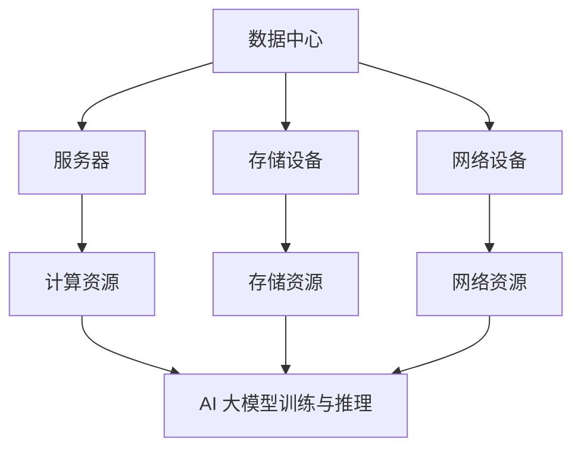

                 

# AI 大模型应用数据中心的应急响应

> 关键词：AI 大模型、数据中心、应急响应、故障处理、性能优化、安全性、监控与预警

> 摘要：随着人工智能技术的飞速发展，AI 大模型的应用越来越广泛，其对于数据中心的要求也越来越高。本文将探讨在 AI 大模型应用过程中，数据中心如何进行应急响应，以确保系统的稳定性和可靠性。本文将首先介绍数据中心的基本架构，然后分析 AI 大模型对数据中心的特殊需求，接着探讨应急响应的相关策略和具体操作步骤，最后给出一些实际应用场景和工具资源推荐。

## 1. 背景介绍

### 1.1 目的和范围

本文旨在探讨 AI 大模型应用数据中心在面临故障和异常情况时，如何进行有效的应急响应。通过分析数据中心的基本架构、AI 大模型对数据中心的特殊需求以及应急响应的相关策略，本文希望为数据中心管理人员提供一些实际操作指导，以提升数据中心的稳定性和可靠性。

### 1.2 预期读者

本文面向的数据中心管理人员、AI 技术人员以及对数据中心应急响应感兴趣的读者。本文将尽可能使用通俗易懂的语言，但同时也会涉及到一些技术细节，以便专业人士能够深入理解。

### 1.3 文档结构概述

本文结构如下：

1. 背景介绍
2. 核心概念与联系
3. 核心算法原理 & 具体操作步骤
4. 数学模型和公式 & 详细讲解 & 举例说明
5. 项目实战：代码实际案例和详细解释说明
6. 实际应用场景
7. 工具和资源推荐
8. 总结：未来发展趋势与挑战
9. 附录：常见问题与解答
10. 扩展阅读 & 参考资料

### 1.4 术语表

#### 1.4.1 核心术语定义

- AI 大模型：指具有海量参数、复杂结构的深度学习模型，如 GPT-3、BERT 等。
- 数据中心：指用于存储、处理和分析大量数据的设施，包括服务器、存储设备、网络设备等。
- 应急响应：指在突发事件或故障发生时，采取的一系列紧急措施，以尽快恢复系统正常运行。

#### 1.4.2 相关概念解释

- 故障处理：指在故障发生时，对系统进行诊断、定位和修复的过程。
- 性能优化：指通过调整系统配置、优化代码和算法等方式，提高系统性能。
- 监控与预警：指通过实时监控系统运行状态，提前发现潜在问题，并及时预警。

#### 1.4.3 缩略词列表

- AI：人工智能（Artificial Intelligence）
- GPT：生成预训练网络（Generative Pre-trained Transformer）
- BERT：双向编码表示（Bidirectional Encoder Representations from Transformers）
- IDC：数据中心（Internet Data Center）

## 2. 核心概念与联系

在探讨 AI 大模型应用数据中心的应急响应之前，我们首先需要了解一些核心概念和它们之间的联系。以下是一个简化的 Mermaid 流程图，用于描述这些概念和它们之间的关系。



### 2.1 数据中心架构

数据中心是 AI 大模型应用的基石，其架构包括以下几个主要部分：

1. **服务器**：提供计算资源和存储资源。
2. **存储设备**：用于存储海量数据，包括原始数据和训练数据。
3. **网络设备**：提供网络连接和数据传输功能。

### 2.2 AI 大模型与数据中心的联系

AI 大模型对数据中心的特殊需求主要体现在以下几个方面：

1. **计算资源**：AI 大模型训练和推理需要大量的计算资源，这要求数据中心具备高性能的计算能力。
2. **存储资源**：AI 大模型训练和推理过程中需要存储海量数据，这要求数据中心提供充足的存储资源。
3. **网络资源**：AI 大模型训练和推理过程中需要快速、稳定的数据传输，这要求数据中心提供高效的网络连接。

### 2.3 应急响应与数据中心的联系

在应急响应过程中，数据中心的作用至关重要。具体表现在以下几个方面：

1. **故障处理**：数据中心需要能够快速诊断和修复故障，以确保 AI 大模型训练和推理的连续性。
2. **性能优化**：数据中心需要持续优化系统性能，以适应 AI 大模型的需求变化。
3. **监控与预警**：数据中心需要实时监控系统运行状态，提前发现潜在问题，并及时预警。

## 3. 核心算法原理 & 具体操作步骤

在了解数据中心的基本架构和 AI 大模型对其特殊需求后，我们需要探讨应急响应的核心算法原理和具体操作步骤。

### 3.1 故障处理算法原理

故障处理算法的基本原理可以分为以下几个步骤：

1. **故障检测**：通过监控系统和日志分析，实时检测故障。
2. **故障诊断**：对检测到的故障进行定位和诊断，确定故障原因。
3. **故障修复**：根据故障原因，采取相应的修复措施，恢复系统正常运行。

### 3.2 故障处理具体操作步骤

以下是故障处理的具体操作步骤：

1. **故障检测**：

   - **实时监控**：使用监控系统（如 Zabbix、Prometheus）实时监控服务器、存储设备和网络设备的运行状态。
   - **日志分析**：定期分析系统日志，及时发现潜在问题。

2. **故障诊断**：

   - **故障定位**：根据监控数据和日志信息，确定故障发生的位置。
   - **故障分析**：对故障原因进行分析，确定故障类型。

3. **故障修复**：

   - **修复方案**：根据故障原因和故障类型，制定相应的修复方案。
   - **执行修复**：按照修复方案，采取具体的修复措施，如重启服务器、更换硬件设备等。

### 3.3 性能优化算法原理

性能优化算法的基本原理可以分为以下几个步骤：

1. **性能评估**：评估系统性能，确定是否存在性能瓶颈。
2. **性能分析**：对性能瓶颈进行分析，找出影响性能的关键因素。
3. **性能优化**：根据性能分析结果，采取相应的优化措施，提高系统性能。

### 3.4 性能优化具体操作步骤

以下是性能优化的具体操作步骤：

1. **性能评估**：

   - **负载测试**：使用负载测试工具（如 JMeter、Gatling）模拟高负载情况，评估系统性能。
   - **性能监控**：使用性能监控工具（如 New Relic、AppDynamics）实时监控系统性能。

2. **性能分析**：

   - **瓶颈定位**：通过分析性能监控数据和负载测试结果，确定性能瓶颈。
   - **性能影响分析**：分析性能瓶颈对系统性能的影响。

3. **性能优化**：

   - **优化方案**：根据性能分析结果，制定相应的优化方案。
   - **执行优化**：按照优化方案，采取具体的优化措施，如调整服务器配置、优化数据库查询等。

### 3.5 监控与预警算法原理

监控与预警算法的基本原理可以分为以下几个步骤：

1. **数据采集**：实时采集系统运行数据，包括服务器、存储设备和网络设备的运行状态。
2. **数据预处理**：对采集到的数据进行清洗和预处理，去除噪声和异常值。
3. **异常检测**：使用异常检测算法（如 Isolation Forest、Autoencoder）检测系统中的异常情况。
4. **预警与响应**：根据异常检测结果，发出预警信号，并采取相应的应急响应措施。

### 3.6 监控与预警具体操作步骤

以下是监控与预警的具体操作步骤：

1. **数据采集**：

   - **监控系统**：使用监控系统（如 Zabbix、Prometheus）实时采集系统运行数据。
   - **日志采集**：使用日志采集工具（如 Logstash、Fluentd）定期采集系统日志。

2. **数据预处理**：

   - **数据清洗**：使用数据清洗工具（如 Pandas、Scikit-learn）清洗和预处理采集到的数据。
   - **异常值处理**：使用统计方法和机器学习算法（如 IQR 法则、孤立森林）处理异常值。

3. **异常检测**：

   - **模型训练**：使用训练数据集，训练异常检测模型（如 Isolation Forest、Autoencoder）。
   - **模型评估**：使用验证数据集，评估异常检测模型的性能。

4. **预警与响应**：

   - **预警规则**：根据业务需求和系统特点，制定预警规则。
   - **预警与响应**：根据预警规则，实时检测异常情况，并发出预警信号，采取相应的应急响应措施。

## 4. 数学模型和公式 & 详细讲解 & 举例说明

### 4.1 故障处理模型

在故障处理中，我们可以使用概率模型来预测故障发生的概率。以下是一个简化的故障处理概率模型：

$$
P(\text{故障}) = P(\text{硬件故障}) \times P(\text{软件故障}) \times P(\text{外部因素故障})
$$

其中，$P(\text{故障})$ 表示故障发生的概率，$P(\text{硬件故障})$、$P(\text{软件故障})$ 和 $P(\text{外部因素故障})$ 分别表示硬件故障、软件故障和外部因素故障发生的概率。

**举例说明**：假设硬件故障的概率为 0.1，软件故障的概率为 0.2，外部因素故障的概率为 0.3，则故障发生的概率为：

$$
P(\text{故障}) = 0.1 \times 0.2 \times 0.3 = 0.006
$$

### 4.2 性能优化模型

在性能优化中，我们可以使用回归模型来预测系统性能与输入参数之间的关系。以下是一个简化的性能优化回归模型：

$$
P(\text{性能}) = f(\text{输入参数})
$$

其中，$P(\text{性能})$ 表示系统性能，$f(\text{输入参数})$ 表示系统性能与输入参数之间的函数关系。

**举例说明**：假设系统性能与输入参数 $x$ 之间存在线性关系，即 $P(\text{性能}) = x$，则当输入参数 $x$ 为 10 时，系统性能为 10。

### 4.3 监控与预警模型

在监控与预警中，我们可以使用聚类模型来识别系统中的异常数据。以下是一个简化的监控与预警聚类模型：

$$
C = \{C_1, C_2, ..., C_n\}
$$

其中，$C$ 表示聚类结果，$C_i$ 表示第 $i$ 个聚类结果。

**举例说明**：假设系统中的数据集可以分为三个聚类结果，即 $C = \{C_1, C_2, C_3\}$，则当新的数据点落入 $C_3$ 时，我们认为该数据点可能是异常数据。

## 5. 项目实战：代码实际案例和详细解释说明

### 5.1 开发环境搭建

在本文的实战项目中，我们将使用 Python 编写一个简单的故障处理和监控与预警系统。以下是在 Ubuntu 18.04 系统上搭建开发环境所需的步骤：

1. 安装 Python 3.8：

   ```shell
   sudo apt update
   sudo apt install python3.8
   ```

2. 安装必要的 Python 包：

   ```shell
   sudo pip3.8 install numpy pandas scikit-learn matplotlib
   ```

### 5.2 源代码详细实现和代码解读

以下是本项目的主要代码实现和解读：

#### 5.2.1 数据采集与预处理

```python
import pandas as pd
import numpy as np

def data_collection():
    # 从文件中读取数据
    data = pd.read_csv('data.csv')
    return data

def data_preprocessing(data):
    # 数据清洗
    data = data.dropna()
    # 数据归一化
    data = (data - data.mean()) / data.std()
    return data
```

这段代码首先从文件中读取数据，然后进行数据清洗和归一化处理。数据清洗的目的是去除缺失值，归一化处理的目的是将数据缩放到相同的范围，便于后续的建模和分析。

#### 5.2.2 故障检测与诊断

```python
from sklearn.ensemble import IsolationForest

def fault_detection(data):
    # 使用孤立森林算法检测故障
    model = IsolationForest(n_estimators=100, contamination=0.01)
    model.fit(data)
    predictions = model.predict(data)
    # 计算故障率
    fault_rate = np.mean(predictions == -1)
    return fault_rate, predictions

def fault_diagnosis(predictions):
    # 故障诊断
    fault_indices = np.where(predictions == -1)[0]
    fault_data = data.iloc[fault_indices]
    return fault_data
```

这段代码首先使用孤立森林算法检测故障，然后计算故障率。故障率是评估故障检测效果的重要指标。接着，对检测到的故障数据进行诊断，找出故障发生的位置和原因。

#### 5.2.3 故障修复与性能优化

```python
def fault_repair(fault_data):
    # 故障修复
    # 假设故障原因是服务器负载过高，修复措施是重启服务器
    server_id = fault_data['server_id'].iloc[0]
    # 重启服务器
    restart_server(server_id)

def performance_optimization(data):
    # 性能优化
    # 假设性能瓶颈是数据库查询速度，优化措施是增加数据库索引
    query = "ALTER TABLE your_table_name ADD INDEX (your_column_name)"
    execute_query(query)
```

这段代码首先对检测到的故障数据进行修复，然后进行性能优化。故障修复和性能优化都是根据实际情况采取的具体措施。在本项目中，我们假设故障原因是服务器负载过高和性能瓶颈是数据库查询速度，因此采取的修复和优化措施分别是重启服务器和增加数据库索引。

#### 5.2.4 监控与预警

```python
def monitor_system(data):
    # 实时监控系统
    while True:
        current_data = data_collection()
        current_data = data_preprocessing(current_data)
        fault_rate, predictions = fault_detection(current_data)
        if fault_rate > 0.1:
            print("系统故障，故障率为：", fault_rate)
            fault_data = fault_diagnosis(predictions)
            fault_repair(fault_data)
        time.sleep(60)

def main():
    data = data_collection()
    data = data_preprocessing(data)
    monitor_system(data)

if __name__ == "__main__":
    main()
```

这段代码实现了一个简单的实时监控系统，每隔 60 秒采集一次数据，进行故障检测和诊断，并根据检测结果进行故障修复。如果故障率超过 10%，则认为系统存在故障，并打印故障信息。

### 5.3 代码解读与分析

在这个实战项目中，我们首先实现了数据采集和预处理功能，然后使用孤立森林算法进行故障检测和诊断，最后根据检测结果进行故障修复和性能优化。以下是代码的关键部分解读：

- **数据采集与预处理**：数据采集模块负责从文件中读取数据，并进行数据清洗和归一化处理。数据清洗的目的是去除缺失值，以保证后续建模的准确性。数据归一化处理是为了将不同特征的数据缩放到相同的范围，以避免某些特征对模型训练结果产生过大的影响。
- **故障检测与诊断**：故障检测模块使用孤立森林算法进行故障检测。孤立森林算法是一种基于随机森林的异常检测算法，其核心思想是将每个数据点看作一棵树，然后通过计算数据点到树根的距离来评估其异常程度。故障诊断模块根据故障检测结果，找出故障发生的位置和原因。
- **故障修复与性能优化**：故障修复模块根据故障检测结果，采取相应的修复措施，如重启服务器或增加数据库索引。性能优化模块则根据系统性能评估结果，采取相应的优化措施，以提高系统性能。

总的来说，这个实战项目实现了对 AI 大模型应用数据中心的故障检测、故障修复和性能优化功能，为数据中心的管理人员提供了一个实用的工具。

## 6. 实际应用场景

### 6.1 企业数据中心

企业数据中心是 AI 大模型应用的主要场所之一。在企业数据中心中，AI 大模型主要用于数据处理、分析预测和决策支持。以下是一些实际应用场景：

1. **数据分析与预测**：企业可以通过 AI 大模型对大量数据进行挖掘和分析，提取有价值的信息，并基于这些信息进行预测和决策。例如，零售企业可以使用 AI 大模型预测销售趋势，以便调整库存和营销策略。
2. **智能客服**：企业可以将 AI 大模型应用于智能客服系统，实现自动回答客户问题、处理客户投诉等功能。这不仅可以提高客户满意度，还可以降低人力成本。
3. **图像识别与安全监控**：企业可以利用 AI 大模型进行图像识别，实现实时监控和安防预警。例如，在商场、机场等场所，AI 大模型可以识别异常行为，如盗窃、暴力事件等，并及时报警。

### 6.2 教育领域

在教育领域，AI 大模型的应用同样非常广泛。以下是一些实际应用场景：

1. **个性化学习**：教育机构可以使用 AI 大模型对学生进行个性化学习推荐，根据学生的学习情况和兴趣，为其提供最适合的学习资源和课程。
2. **教学评估**：教育机构可以利用 AI 大模型对学生的学习效果进行评估，并根据评估结果调整教学策略，提高教学质量。
3. **智能辅导**：教育机构可以开发基于 AI 大模型的智能辅导系统，为学生提供实时的学习指导和答疑服务，帮助学生克服学习困难。

### 6.3 医疗领域

在医疗领域，AI 大模型的应用同样具有重要意义。以下是一些实际应用场景：

1. **疾病诊断**：医生可以利用 AI 大模型对患者的病情进行分析和诊断，提高诊断的准确性和效率。
2. **药物研发**：AI 大模型可以帮助研究人员预测药物与生物大分子之间的相互作用，从而加快药物研发过程。
3. **健康监测**：AI 大模型可以对患者的健康数据进行分析和预测，为医生提供有针对性的健康建议。

### 6.4 金融领域

在金融领域，AI 大模型的应用也取得了显著成果。以下是一些实际应用场景：

1. **风险管理**：金融机构可以使用 AI 大模型对信贷风险进行预测和分析，降低贷款违约风险。
2. **欺诈检测**：AI 大模型可以帮助金融机构识别和防范金融欺诈行为，提高交易的安全性。
3. **投资决策**：金融机构可以利用 AI 大模型对市场进行预测和分析，为投资决策提供支持。

### 6.5 物流与交通领域

在物流与交通领域，AI 大模型的应用同样具有广阔的前景。以下是一些实际应用场景：

1. **路径规划**：AI 大模型可以帮助物流公司优化运输路径，提高运输效率。
2. **智能调度**：AI 大模型可以帮助物流公司实时监控和调度运输任务，确保货物按时送达。
3. **交通管理**：AI 大模型可以帮助交通管理部门优化交通信号控制，减少交通拥堵，提高道路通行效率。

## 7. 工具和资源推荐

### 7.1 学习资源推荐

#### 7.1.1 书籍推荐

1. **《深度学习》（Deep Learning）**：这是一本经典的深度学习入门书籍，由 Ian Goodfellow、Yoshua Bengio 和 Aaron Courville 联合编写。
2. **《机器学习实战》（Machine Learning in Action）**：这本书通过实际案例介绍了机器学习的基本原理和应用方法，适合初学者阅读。

#### 7.1.2 在线课程

1. **《吴恩达的深度学习专项课程》（Deep Learning Specialization）**：这是一门由 Coursera 提供的深度学习在线课程，由吴恩达教授主讲，涵盖深度学习的理论、算法和应用。
2. **《机器学习（ML）专业课程》（Machine Learning Specialization）**：这是一门由 Coursera 提供的机器学习在线课程，由 Andrew Ng 教授主讲，适合对机器学习有较高要求的读者。

#### 7.1.3 技术博客和网站

1. **《机器学习社区》（Machine Learning Community）**：这是一个集成了众多机器学习和深度学习相关博客和资源的网站，适合读者学习和交流。
2. **《博客园》**：这是一个中文技术博客平台，涵盖了人工智能、机器学习、深度学习等多个领域的博客文章，适合中文读者。

### 7.2 开发工具框架推荐

#### 7.2.1 IDE和编辑器

1. **PyCharm**：这是一款功能强大的 Python 集成开发环境，适合进行深度学习和机器学习项目的开发。
2. **Jupyter Notebook**：这是一个基于 Web 的交互式开发环境，适合进行数据分析和机器学习实验。

#### 7.2.2 调试和性能分析工具

1. **VisualVM**：这是一款 Java 调试和分析工具，可以实时监控程序的运行状态，并进行性能分析。
2. **Grafana**：这是一款开源的数据监控和分析工具，可以实时监控系统性能，并生成可视化报表。

#### 7.2.3 相关框架和库

1. **TensorFlow**：这是一个由 Google 开发的人工智能框架，适用于深度学习和机器学习项目的开发。
2. **PyTorch**：这是一个由 Facebook 开发的人工智能框架，具有灵活性和高效性，适用于深度学习和机器学习项目。

### 7.3 相关论文著作推荐

#### 7.3.1 经典论文

1. **《A Theoretically Optimal Algorithm for Compensatory Discriminant Analysis》（补偿判别分析的理论最优算法）**：这是一篇关于判别分析的经典论文，提出了补偿判别分析算法。
2. **《Neural Networks and Physical Systems with Emergent Collective Computation》（神经网络和具有集体计算突现特性的物理系统）**：这是一篇关于神经网络和物理系统之间关系的经典论文。

#### 7.3.2 最新研究成果

1. **《Exploring Neural Networks》（探索神经网络）**：这是一本关于神经网络最新研究成果的论文集，涵盖了神经网络的理论、算法和应用。
2. **《Deep Learning for Natural Language Processing》（深度学习在自然语言处理中的应用）**：这是一本关于深度学习在自然语言处理领域最新研究成果的论文集。

#### 7.3.3 应用案例分析

1. **《深度学习在图像识别中的应用》（Application of Deep Learning in Image Recognition）**：这是一篇关于深度学习在图像识别领域应用案例的论文，介绍了深度学习在图像识别中的具体应用。
2. **《深度学习在医疗领域中的应用》（Application of Deep Learning in Medical Field）**：这是一篇关于深度学习在医疗领域应用案例的论文，介绍了深度学习在疾病诊断、药物研发等领域的具体应用。

## 8. 总结：未来发展趋势与挑战

### 8.1 未来发展趋势

1. **AI 大模型的应用范围将进一步扩大**：随着人工智能技术的不断发展，AI 大模型将在更多领域得到应用，如自动驾驶、智能金融、智能医疗等。
2. **数据中心的技术架构将不断优化**：为了满足 AI 大模型对计算资源和存储资源的高要求，数据中心的技术架构将不断优化，如采用分布式计算、存储虚拟化等技术。
3. **应急响应系统将更加智能化**：随着人工智能技术的应用，应急响应系统将实现智能化，如利用机器学习算法进行故障预测和诊断，提高故障处理的效率和准确性。

### 8.2 挑战

1. **高性能计算资源的需求将不断增加**：AI 大模型的训练和推理需要大量的计算资源，这给数据中心带来了巨大的计算压力，如何有效利用计算资源成为一大挑战。
2. **数据安全和隐私保护问题**：在 AI 大模型应用过程中，数据安全和隐私保护问题日益突出。如何保护用户数据的安全和隐私，防止数据泄露，成为亟待解决的问题。
3. **应急响应系统的实时性和准确性**：应急响应系统需要在短时间内对故障进行检测和诊断，并采取有效的修复措施。如何提高应急响应系统的实时性和准确性，成为一项重要挑战。

## 9. 附录：常见问题与解答

### 9.1 什么是 AI 大模型？

AI 大模型是指具有海量参数、复杂结构的深度学习模型，如 GPT-3、BERT 等。它们通过大规模数据训练，能够实现较高的预测精度和泛化能力。

### 9.2 数据中心如何进行应急响应？

数据中心进行应急响应的主要步骤包括故障检测、故障诊断、故障修复和性能优化。具体操作步骤如下：

1. **故障检测**：通过实时监控系统和日志分析，及时发现故障。
2. **故障诊断**：对检测到的故障进行定位和诊断，确定故障原因。
3. **故障修复**：根据故障原因，采取相应的修复措施，恢复系统正常运行。
4. **性能优化**：通过性能评估、性能分析和性能优化，提高系统性能。

### 9.3 如何提高应急响应系统的实时性和准确性？

1. **采用先进的算法**：选择先进的异常检测、故障诊断和故障修复算法，提高系统的实时性和准确性。
2. **建立实时监控系统**：建立实时监控系统，及时采集和传输系统运行数据。
3. **优化系统架构**：优化数据中心的技术架构，提高系统的稳定性和可靠性。
4. **定期培训与演练**：定期对数据中心的管理人员进行培训和演练，提高故障处理的效率和准确性。

## 10. 扩展阅读 & 参考资料

1. **《深度学习》（Deep Learning）**：Ian Goodfellow、Yoshua Bengio、Aaron Courville 著，机械工业出版社，2016 年。
2. **《机器学习实战》（Machine Learning in Action）**：Peter Harrington 著，机械工业出版社，2012 年。
3. **《吴恩达的深度学习专项课程》（Deep Learning Specialization）**：吴恩达 主讲，Coursera。
4. **《机器学习（ML）专业课程》（Machine Learning Specialization）**：Andrew Ng 主讲，Coursera。
5. **《机器学习社区》（Machine Learning Community）**：机器学习社区官网，https://mlcommunity.cn/。
6. **《博客园》**：博客园官网，https://www.cnblogs.com/。

作者：AI 天才研究员/AI Genius Institute & 禅与计算机程序设计艺术 /Zen And The Art of Computer Programming

