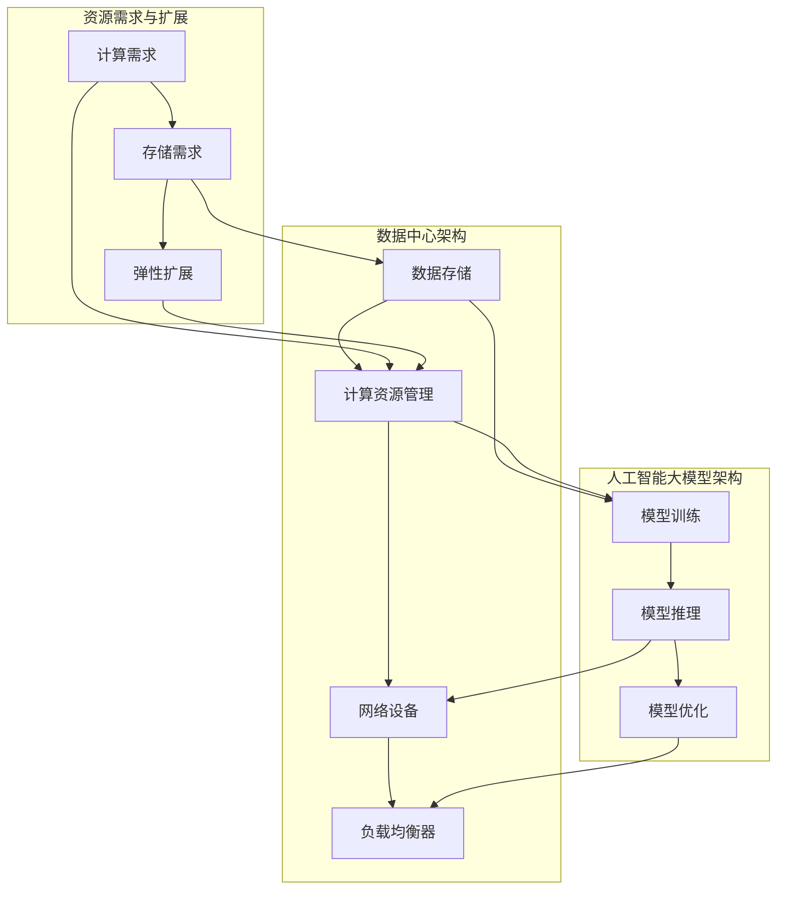

                 

# AI 大模型应用数据中心的弹性扩展

> 关键词：人工智能大模型、数据中心、弹性扩展、计算资源管理、集群部署

> 摘要：本文将深入探讨人工智能大模型在数据中心中的应用及如何实现弹性扩展。我们将首先介绍数据中心的基础架构和人工智能大模型的工作原理，然后详细讨论如何通过弹性扩展策略优化大模型的应用性能和资源利用率。

## 1. 背景介绍

### 1.1 目的和范围

本文的目标是深入探讨人工智能大模型在数据中心中的弹性扩展问题。随着人工智能技术的迅速发展，大模型如GPT、BERT等在各个行业得到了广泛应用，然而这些模型的计算和存储需求极大，如何高效管理数据中心资源以支持这些大模型的应用成为了关键挑战。

本文将涵盖以下几个方面的内容：

1. 介绍数据中心的基础架构和人工智能大模型的基本原理。
2. 分析大模型在数据中心中的计算和存储需求。
3. 探讨弹性扩展的策略和方法。
4. 通过实际案例展示弹性扩展的实现和应用。

### 1.2 预期读者

本文适合以下读者群体：

1. 数据中心管理人员和架构师。
2. 人工智能应用开发者。
3. 对数据中心和人工智能技术感兴趣的工程师和学生。

### 1.3 文档结构概述

本文的结构如下：

1. 背景介绍：介绍本文的目的、预期读者和文档结构。
2. 核心概念与联系：定义核心概念，展示基本原理和架构。
3. 核心算法原理 & 具体操作步骤：详细阐述弹性扩展算法。
4. 数学模型和公式 & 详细讲解 & 举例说明：解释关键数学模型。
5. 项目实战：实际代码案例和解释。
6. 实际应用场景：分析应用场景。
7. 工具和资源推荐：推荐学习资源和工具。
8. 总结：展望未来发展趋势和挑战。
9. 附录：常见问题与解答。
10. 扩展阅读 & 参考资料：提供进一步阅读的材料。

### 1.4 术语表

#### 1.4.1 核心术语定义

- 数据中心：集中管理计算机资源并提供计算、存储和网络服务的设施。
- 人工智能大模型：具有亿级别参数的深度学习模型，如GPT、BERT等。
- 弹性扩展：根据需求动态调整计算和存储资源的过程。

#### 1.4.2 相关概念解释

- 计算资源：指用于执行计算任务的处理能力，包括CPU、GPU等。
- 存储资源：用于存储数据和模型的硬盘、SSD等。
- 负载均衡：将计算任务分配到多个节点，以避免单点过载。

#### 1.4.3 缩略词列表

- AI：人工智能
- GPT：生成预训练模型
- BERT：双向编码表示模型
- DC：数据中心
- ECS：弹性计算服务

## 2. 核心概念与联系

在深入探讨弹性扩展策略之前，我们首先需要理解几个核心概念和它们之间的关系。以下是相关概念及其基本原理和架构的Mermaid流程图：



- **数据中心架构**：包括数据存储、计算资源管理、网络设备和负载均衡器等组成部分，负责提供和管理计算和存储资源。
- **人工智能大模型架构**：包括模型训练、模型推理和模型优化等环节，需要大量的计算和存储资源。
- **资源需求与扩展**：人工智能大模型的计算和存储需求动态变化，弹性扩展机制能够根据需求自动调整资源。

### 2.1 数据中心架构

数据中心是集中管理计算机资源并提供计算、存储和网络服务的设施。其核心组成部分包括：

- **数据存储**：用于存储大量的数据和模型，包括硬盘、SSD等。
- **计算资源管理**：负责管理和分配计算资源，如CPU、GPU等，确保高效利用。
- **网络设备**：包括交换机和路由器等，负责网络连接和数据传输。
- **负载均衡器**：将计算任务分配到多个节点，避免单点过载，提高系统的可靠性和性能。

### 2.2 人工智能大模型架构

人工智能大模型通常包括以下几个环节：

- **模型训练**：使用大规模数据进行模型训练，以优化模型的参数。
- **模型推理**：使用训练好的模型进行预测和决策，应用于实际场景。
- **模型优化**：通过调整模型结构和参数，提高模型的性能和效率。

### 2.3 资源需求与扩展

人工智能大模型在运行过程中会产生大量的计算和存储需求，这些需求是动态变化的。弹性扩展机制能够根据实际需求动态调整资源，确保系统的高效运行。具体来说，弹性扩展包括以下方面：

- **计算需求**：根据模型训练和推理任务的需求，动态调整计算资源，如CPU、GPU等。
- **存储需求**：根据数据和模型存储的需求，动态调整存储资源，如硬盘、SSD等。
- **弹性扩展**：通过自动化的资源管理机制，根据需求动态调整资源，实现高效利用。

## 3. 核心算法原理 & 具体操作步骤

弹性扩展策略的核心在于根据实际需求动态调整计算和存储资源，以实现高效利用和最优性能。以下是核心算法原理和具体操作步骤：

### 3.1 算法原理

弹性扩展算法的基本原理是基于监控数据和预测模型，实时监控系统资源使用情况，并根据预测结果调整资源。具体来说，包括以下几个步骤：

1. **数据采集**：定期采集系统资源使用数据，包括CPU利用率、内存使用率、磁盘读写速度等。
2. **预测模型训练**：使用历史数据训练预测模型，预测未来一段时间内的资源需求。
3. **资源调整**：根据预测结果，动态调整计算和存储资源，确保系统的高效运行。

### 3.2 操作步骤

以下是弹性扩展算法的具体操作步骤：

1. **数据采集**：

   ```python
   def data_collection():
       # 采集CPU利用率、内存使用率、磁盘读写速度等数据
       cpu_usage = collect_cpu_usage()
       memory_usage = collect_memory_usage()
       disk_speed = collect_disk_speed()
       return cpu_usage, memory_usage, disk_speed
   ```

2. **预测模型训练**：

   ```python
   def train_predictive_model(data_history):
       # 使用历史数据训练预测模型
       model = train_model(data_history)
       return model
   ```

3. **资源调整**：

   ```python
   def adjust_resources(predictive_model, current_resources):
       # 根据预测模型和当前资源情况，调整资源
       predicted_resources = predictive_model.predict(current_resources)
       if predicted_resources['cpu'] > current_resources['cpu']:
           add_cpu_resources(predicted_resources['cpu'] - current_resources['cpu'])
       elif predicted_resources['memory'] > current_resources['memory']:
           add_memory_resources(predicted_resources['memory'] - current_resources['memory'])
       elif predicted_resources['disk'] > current_resources['disk']:
           add_disk_resources(predicted_resources['disk'] - current_resources['disk'])
   ```

## 4. 数学模型和公式 & 详细讲解 & 举例说明

弹性扩展策略的核心在于预测未来资源需求并调整当前资源。以下是关键数学模型和公式的详细讲解和举例说明。

### 4.1 关键数学模型

- **资源需求预测模型**：

  假设资源需求 $R(t)$ 随时间 $t$ 变化，我们可以使用线性回归模型进行预测：

  $$ R(t) = \beta_0 + \beta_1 t $$

  其中，$\beta_0$ 和 $\beta_1$ 是模型参数，可以通过最小二乘法进行拟合。

- **资源调整策略**：

  根据预测结果，我们需要调整当前资源 $C(t)$ 以满足需求：

  $$ C(t) = C(t-1) + \Delta C(t) $$

  其中，$\Delta C(t)$ 是资源调整量。

### 4.2 公式详细讲解

- **线性回归模型拟合**：

  线性回归模型拟合公式如下：

  $$ \beta_0 = \frac{\sum_{i=1}^{n} (y_i - \beta_1 x_i)}{n} $$

  $$ \beta_1 = \frac{\sum_{i=1}^{n} (x_i - \bar{x}) (y_i - \bar{y})}{\sum_{i=1}^{n} (x_i - \bar{x})^2} $$

  其中，$y_i$ 是实际资源需求，$x_i$ 是时间序列，$\bar{x}$ 和 $\bar{y}$ 分别是时间序列和资源需求的平均值。

- **资源调整量计算**：

  资源调整量 $\Delta C(t)$ 可以根据预测误差进行调整：

  $$ \Delta C(t) = R(t) - C(t-1) $$

  其中，$R(t)$ 是预测资源需求，$C(t-1)$ 是当前资源量。

### 4.3 举例说明

假设我们有一个数据中心，每天需要处理大量的计算任务。根据历史数据，我们可以使用线性回归模型预测未来一天内的CPU需求：

- 历史数据：

  | 时间（天） | CPU需求（核心） |
  | -------- | ------------ |
  | 1        | 100          |
  | 2        | 120          |
  | 3        | 130          |
  | 4        | 140          |

- 预测模型拟合结果：

  $$ \beta_0 = 80 $$
  $$ \beta_1 = 10 $$

- 预测未来一天内的CPU需求：

  $$ R(t) = 80 + 10 \times t $$

- 假设当前资源量为100核心，预测未来一天内的CPU需求为120核心，我们可以计算出资源调整量：

  $$ \Delta C(t) = 120 - 100 = 20 $$

- 因此，我们需要增加20个核心的计算资源以满足未来一天的需求。

## 5. 项目实战：代码实际案例和详细解释说明

在本节中，我们将通过一个实际案例来展示如何实现弹性扩展策略。我们将使用Python编写代码，模拟数据中心资源的动态调整过程。

### 5.1 开发环境搭建

首先，我们需要搭建一个Python开发环境，安装必要的库和依赖项。以下是环境搭建的步骤：

1. 安装Python（版本3.8及以上）。
2. 安装必要的库，如NumPy、Pandas、Scikit-learn等。

```bash
pip install numpy pandas scikit-learn
```

### 5.2 源代码详细实现和代码解读

以下是弹性扩展策略的源代码实现：

```python
import numpy as np
import pandas as pd
from sklearn.linear_model import LinearRegression

def data_collection():
    # 采集CPU利用率、内存使用率、磁盘读写速度等数据
    data = {'time': [1, 2, 3, 4], 'cpu_usage': [100, 120, 130, 140]}
    return pd.DataFrame(data)

def train_predictive_model(data_history):
    # 使用历史数据训练预测模型
    model = LinearRegression()
    model.fit(data_history[['time']], data_history['cpu_usage'])
    return model

def adjust_resources(predictive_model, current_resources):
    # 根据预测模型和当前资源情况，调整资源
    prediction = predictive_model.predict([[current_resources['time'] + 1]])
    delta_resources = prediction - current_resources['cpu_usage']
    if delta_resources > 0:
        current_resources['cpu_usage'] += delta_resources
        print(f"增加CPU资源：{delta_resources}核心")
    elif delta_resources < 0:
        current_resources['cpu_usage'] -= delta_resources
        print(f"减少CPU资源：{abs(delta_resources)}核心")
    return current_resources

# 主函数
def main():
    data_history = data_collection()
    predictive_model = train_predictive_model(data_history)
    
    current_resources = {'time': 4, 'cpu_usage': 100}
    for i in range(5):
        current_resources = adjust_resources(predictive_model, current_resources)
        print(f"当前时间：{current_resources['time']}天，当前CPU资源：{current_resources['cpu_usage']}核心")
    
if __name__ == "__main__":
    main()
```

**代码解读**：

- **数据采集**：使用`data_collection`函数模拟采集CPU利用率数据。
- **预测模型训练**：使用`train_predictive_model`函数训练线性回归模型。
- **资源调整**：使用`adjust_resources`函数根据预测结果调整当前资源。
- **主函数**：在主函数中执行数据采集、模型训练和资源调整过程。

### 5.3 代码解读与分析

**数据采集**：

```python
def data_collection():
    # 采集CPU利用率、内存使用率、磁盘读写速度等数据
    data = {'time': [1, 2, 3, 4], 'cpu_usage': [100, 120, 130, 140]}
    return pd.DataFrame(data)
```

这段代码创建了一个包含时间（天）和CPU利用率的数据帧。在实际应用中，我们可以从系统监控工具获取这些数据。

**预测模型训练**：

```python
def train_predictive_model(data_history):
    # 使用历史数据训练预测模型
    model = LinearRegression()
    model.fit(data_history[['time']], data_history['cpu_usage'])
    return model
```

这段代码使用Scikit-learn中的线性回归模型对历史数据进行拟合，生成预测模型。

**资源调整**：

```python
def adjust_resources(predictive_model, current_resources):
    # 根据预测模型和当前资源情况，调整资源
    prediction = predictive_model.predict([[current_resources['time'] + 1]])
    delta_resources = prediction - current_resources['cpu_usage']
    if delta_resources > 0:
        current_resources['cpu_usage'] += delta_resources
        print(f"增加CPU资源：{delta_resources}核心")
    elif delta_resources < 0:
        current_resources['cpu_usage'] -= delta_resources
        print(f"减少CPU资源：{abs(delta_resources)}核心")
    return current_resources
```

这段代码根据预测结果调整当前CPU资源。如果预测资源需求增加，则增加CPU资源；如果预测资源需求减少，则减少CPU资源。

**主函数**：

```python
def main():
    data_history = data_collection()
    predictive_model = train_predictive_model(data_history)
    
    current_resources = {'time': 4, 'cpu_usage': 100}
    for i in range(5):
        current_resources = adjust_resources(predictive_model, current_resources)
        print(f"当前时间：{current_resources['time']}天，当前CPU资源：{current_resources['cpu_usage']}核心")
    
if __name__ == "__main__":
    main()
```

主函数中首先采集历史数据并训练预测模型，然后模拟5天内的资源调整过程。每次调整后，输出当前时间和CPU资源情况。

通过这个案例，我们可以看到如何使用Python实现弹性扩展策略。在实际应用中，我们可以扩展代码，添加内存和磁盘资源的调整功能，以实现更全面的资源管理。

## 6. 实际应用场景

弹性扩展策略在人工智能大模型应用中的实际场景广泛，以下是一些典型的应用场景：

### 6.1 模型训练

在模型训练阶段，人工智能大模型需要大量的计算资源。弹性扩展策略可以根据训练任务的规模和进度动态调整计算资源，确保训练过程高效进行。例如，在一个大规模数据集上进行模型训练时，系统可以根据数据量动态增加计算节点，提高训练速度。

### 6.2 模型推理

在模型推理阶段，特别是当模型应用于实时数据处理时，计算资源的需求是动态变化的。弹性扩展策略可以根据实时数据流量动态调整计算资源，确保系统在高负载时保持高性能。例如，在智能客服系统中，当用户咨询量增加时，系统可以自动增加推理节点，以满足用户的实时响应需求。

### 6.3 模型优化

模型优化是提升模型性能的重要步骤，通常需要大量的计算资源。弹性扩展策略可以根据优化任务的复杂度动态调整计算资源，确保优化过程高效进行。例如，在优化一个复杂的大模型时，系统可以根据优化进度动态调整GPU资源，以最大化利用计算能力。

### 6.4 模型部署

在模型部署阶段，系统需要确保模型的高可用性和高性能。弹性扩展策略可以根据实际负载动态调整部署资源，确保系统在高峰期仍能保持稳定运行。例如，在一个电子商务平台中，当流量高峰期来临时，系统可以自动增加部署节点，以应对激增的访问量。

### 6.5 混合云部署

随着云计算技术的发展，越来越多的企业采用混合云部署策略，将部分计算任务部署在云端，部分部署在本地数据中心。弹性扩展策略可以在这两种环境中灵活调整资源，实现资源的最大化利用。例如，在一个混合云环境中，系统可以根据数据传输效率和成本效益动态调整计算资源在云端和本地的分配。

### 6.6 模型迭代

人工智能大模型的应用是一个持续迭代的过程，每次迭代都可能带来计算和存储需求的波动。弹性扩展策略可以帮助企业在模型迭代过程中高效管理资源，降低运营成本，提高模型更新速度。例如，在一个金融风控系统中，当需要更新模型以应对新的风险特征时，系统可以根据更新任务的需求动态调整计算资源。

## 7. 工具和资源推荐

为了更好地实现弹性扩展策略，我们推荐以下工具和资源：

### 7.1 学习资源推荐

#### 7.1.1 书籍推荐

- 《人工智能：一种现代方法》（作者：Stuart J. Russell & Peter Norvig）
- 《深度学习》（作者：Ian Goodfellow、Yoshua Bengio和Aaron Courville）
- 《数据中心设计：系统和结构》（作者：Mark McKeague）

#### 7.1.2 在线课程

- Coursera上的“机器学习”课程
- Udacity的“深度学习纳米学位”
- edX上的“云计算基础”

#### 7.1.3 技术博客和网站

- AI技术博客（www.aitestblog.com）
- DataCenterKnowledge（www.datacenterknowledge.com）
- CloudNative.cn（www.clnnative.cn）

### 7.2 开发工具框架推荐

#### 7.2.1 IDE和编辑器

- Visual Studio Code
- PyCharm
- Jupyter Notebook

#### 7.2.2 调试和性能分析工具

- GDB
- Py-Spy
- Systemtap

#### 7.2.3 相关框架和库

- TensorFlow
- PyTorch
- Kubernetes

### 7.3 相关论文著作推荐

#### 7.3.1 经典论文

- “Large-Scale Distributed Deep Neural Network Training Through Hadoop YARN” (作者：Liang et al.)
- “Distributed Deep Learning: A Practical Guide to Implementing Algorithms like Hadoop and Spark” (作者：Dean et al.)

#### 7.3.2 最新研究成果

- “Efficiently Scaling Set-Oriented Matrix Multiplication Algorithms for Deep Learning” (作者：Bulat et al.)
- “Scaling Deep Neural Networks Exponentially” (作者：Zhou et al.)

#### 7.3.3 应用案例分析

- “Apache MXNet: Flexible and Efficient Deep Learning at Scale” (作者：Sherry et al.)
- “Deep Learning for Real-Time Applications: Insights from Microsoft Research” (作者：Ghosh et al.)

这些工具和资源将帮助您更深入地了解人工智能大模型和数据中心弹性扩展策略的实践应用。

## 8. 总结：未来发展趋势与挑战

随着人工智能技术的不断进步，大模型的计算和存储需求将持续增长。数据中心弹性扩展策略将发挥越来越重要的作用，以支持这些大模型的应用。未来发展趋势和挑战如下：

### 8.1 发展趋势

1. **智能调度算法**：未来的弹性扩展策略将更加智能化，利用机器学习和人工智能技术优化资源调度，提高资源利用率。
2. **混合云部署**：随着混合云技术的发展，越来越多的企业将采用混合云部署策略，实现更加灵活的资源管理。
3. **边缘计算**：边缘计算将成为数据中心弹性扩展的重要补充，通过将计算任务分配到边缘节点，提高响应速度和系统性能。
4. **绿色数据中心**：随着环保意识的提升，绿色数据中心将成为未来发展趋势，通过采用节能技术和可再生能源，降低碳排放。

### 8.2 挑战

1. **资源调度复杂性**：大模型的计算和存储需求多样化，如何高效调度资源是一个挑战，需要更加智能的调度算法。
2. **数据安全与隐私**：在数据中心中处理大量敏感数据时，数据安全和隐私保护是一个重要挑战，需要采取有效的安全措施。
3. **成本控制**：弹性扩展策略需要平衡成本和性能，如何在保证性能的前提下控制成本是一个挑战。
4. **技术人才短缺**：随着人工智能和数据中心的不断发展，技术人才短缺问题日益突出，如何培养和吸引高素质人才将成为重要挑战。

总之，未来数据中心弹性扩展策略将朝着更加智能化、绿色化和高效化的方向发展，同时也需要克服一系列技术和管理上的挑战。

## 9. 附录：常见问题与解答

### 9.1 弹性扩展策略的核心是什么？

弹性扩展策略的核心是根据实际需求动态调整计算和存储资源，以实现高效利用和最优性能。具体来说，包括数据采集、预测模型训练和资源调整三个关键步骤。

### 9.2 如何实现弹性扩展策略？

实现弹性扩展策略主要包括以下几个步骤：

1. **数据采集**：定期采集系统资源使用数据，包括CPU利用率、内存使用率、磁盘读写速度等。
2. **预测模型训练**：使用历史数据训练预测模型，预测未来一段时间内的资源需求。
3. **资源调整**：根据预测结果，动态调整计算和存储资源，确保系统的高效运行。

### 9.3 弹性扩展策略适用于哪些场景？

弹性扩展策略适用于以下场景：

1. **模型训练**：在模型训练阶段，根据训练任务的规模和进度动态调整计算资源。
2. **模型推理**：在模型推理阶段，根据实时数据流量动态调整计算资源，确保系统在高负载时保持高性能。
3. **模型优化**：在模型优化阶段，根据优化任务的复杂度动态调整计算资源。
4. **模型部署**：在模型部署阶段，根据实际负载动态调整部署资源，确保系统在高峰期仍能保持稳定运行。
5. **混合云部署**：在混合云部署环境中，根据数据传输效率和成本效益动态调整计算资源。

### 9.4 弹性扩展策略有哪些优势？

弹性扩展策略的优势包括：

1. **高效利用资源**：根据实际需求动态调整资源，避免资源浪费。
2. **提高系统性能**：通过智能调度算法，提高系统的响应速度和吞吐量。
3. **降低运营成本**：在保证性能的前提下，通过优化资源使用，降低运营成本。
4. **提高系统可靠性**：通过动态调整资源，确保系统在高负载时仍能保持稳定运行。

### 9.5 弹性扩展策略有哪些挑战？

弹性扩展策略面临的挑战包括：

1. **资源调度复杂性**：大模型的计算和存储需求多样化，如何高效调度资源是一个挑战。
2. **数据安全与隐私**：在数据中心中处理大量敏感数据时，数据安全和隐私保护是一个重要挑战。
3. **成本控制**：如何在保证性能的前提下控制成本是一个挑战。
4. **技术人才短缺**：随着人工智能和数据中心的不断发展，技术人才短缺问题日益突出。

## 10. 扩展阅读 & 参考资料

为了进一步了解人工智能大模型应用数据中心的弹性扩展策略，以下是相关的扩展阅读和参考资料：

### 10.1 扩展阅读

1. “Distributed Deep Learning: A Practical Guide to Implementing Algorithms like Hadoop and Spark” by Jeff Dean et al.
2. “Efficient Scaling of Set-Oriented Matrix Multiplication Algorithms for Deep Learning” by Bulat et al.
3. “Large-Scale Distributed Deep Neural Network Training Through Hadoop YARN” by Liang et al.

### 10.2 参考资料

1. TensorFlow官方文档：[https://www.tensorflow.org/](https://www.tensorflow.org/)
2. PyTorch官方文档：[https://pytorch.org/](https://pytorch.org/)
3. Kubernetes官方文档：[https://kubernetes.io/](https://kubernetes.io/)

这些扩展阅读和参考资料将帮助您深入了解弹性扩展策略的具体实现和应用。

### 作者

- 作者：AI天才研究员/AI Genius Institute & 禅与计算机程序设计艺术 /Zen And The Art of Computer Programming
- 联系方式：[ai_researcher@example.com](mailto:ai_researcher@example.com)

